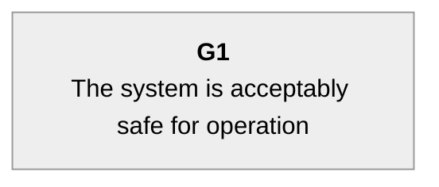
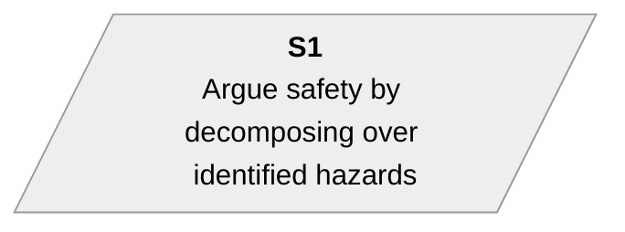
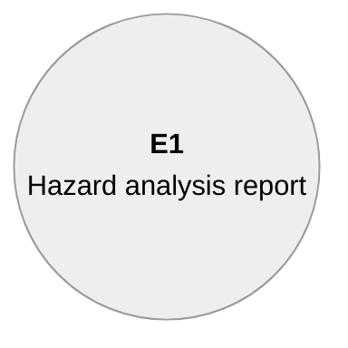
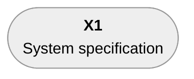
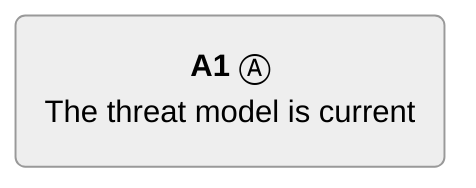
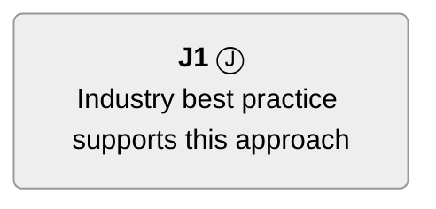
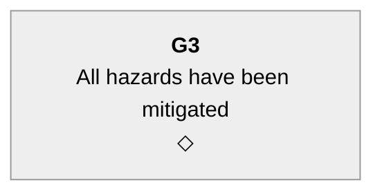

# GSN in mermaid

This document explains our approach to implementing
[Goal Structuring Notation (GSN)](https://scsc.uk/gsn)
graphical notation using the mermaid and markdown implementation
available on GitHub.

## Introduction

The [SCSC GSN Community Standard](https://scsc.uk/r141C:1) (version 3 at
time of writing) defines Goal Structuring Notation (GSN), a widely-used
notation for documenting an assurance case.
In GSN, an argument is structured as a hierarchy of **Goals**, **Strategies**,
**Solutions** (evidence), **Contexts**, **Assumptions**, and **Justifications**,
connected by **SupportedBy** and **InContextOf** relationships.
Note: the term "argument" in GSN often refers to an entire argument,
while SACM and CAE use the term "argument" where GSN uses "Strategy".

GSN is used by many safety engineers and assurance case practitioners and
is commonly rendered using dedicated tools (NOR-STA, AdvoCATE, etc.).
These produce excellent output but are specialized tools.

Similar to our [SACM/mermaid approach](sacm-mermaid.md), we render GSN
diagrams with mermaid inside GitHub-flavoured markdown, letting us write and
maintain assurance case arguments as plain LTAC text and generate readable
diagrams automatically.

Mermaid cannot exactly replicate every GSN graphical shape.
For example,
GSN uses a true oval for Assumption and Justification with a small letter
"A" or "J" placed outside the oval boundary.
We document our approximations and the options available here.

## LTAC element mappings to GSN concept

[LTAC](https://www.argevide.com/lightweight-text-assurance-case-ltac/)
defines six element types, all of which map directly to GSN elements.

| LTAC type | GSN element |
|---|---|
| Claim | Goal |
| Strategy | Strategy |
| Evidence | Solution |
| Context | Context |
| Assumption | Assumption |
| Justification | Justification |
| Link | Citation of an already-shown element |

Children support their parents via GSN's **SupportedBy** relationship.
Context, Assumption, and Justification children use **InContextOf** instead.

## Quick note on GSN identifiers

Many GSN examples have an identifier convention of a short type
indicator followed by a number.
The type indicator is often
"G" for Goal, "S" for Strategy, "Sn" for Solution, "C" for Context, "A"
for Assumption, and "J" for Justification.

However, the GSN spec version 3 (1:2.1.2, page 16)
only states that an identifier shall be unique   
within an argument module. That's the sole normative requirement; no defined
character set, no grammar, no prohibition on spaces.

We require that each identifier be unique across the entire assurance case,
as a way to simplify things.

## Mermaid approach to GSN

### Layout direction

We use mermaid `flowchart TD` (top-down).
The top-level Goal appears at the top; sub-goals, strategies, and solutions
appear below it.
Arrows point **downward** from each Goal or Strategy to the elements that
support it, matching standard GSN convention.

This differs from our SACM/mermaid approach, which uses `flowchart BT`
because SACM's arrows point from supporting elements upward to the claim.
In GSN the arrow direction is the opposite: the Goal points down to what
supports it, so mermaid flowchart TD is the natural fit
and the edge code direction matches the visual direction.

### No inference dot

GSN uses **direct** SupportedBy arrows from each supporting element to its
parent, with no intermediate "dot" node.
This is different from SACM, which requires a sacmDot.
In GSN, multiple supporting elements each draw their own arrow from the
parent Goal:

```
G1 --> G2
G1 --> G3
G1 --> S1
```

### Mermaid header

Every `gsn/mermaid` diagram uses the following header:

`````
```mermaid
---
config:
  theme: neutral
  flowchart:
    curve: linear
    htmlLabels: true
    rankSpacing: 60
    nodeSpacing: 45
    padding: 15
---
flowchart TD
    classDef invisible opacity:0
    classDef gsnUndev stroke-width:2px,stroke-dasharray: 5 5;
```
`````

The configuration is basically identical to SACM/mermaid.
`gsnUndev` (dashed border) approximates the GSN uninstantiated/abstract
decorator (a small hollow triangle ▽ in the standard).

### Label format

Labels follow the same conventions as SACM/mermaid.
The node identifier is **bolded**; if descriptive text is present, a `<br>`
separates it from the identifier.

```
<b>G1</b><br>The system is acceptably safe
```

For Assumption and Justification, the identifier is followed by a
**circled letter decorator** embedded in the label text:

* **Ⓐ** (U+24B6, Circled Latin Capital Letter A) for Assumption
* **Ⓙ** (U+24BF, Circled Latin Capital Letter J) for Justification

These circled letters are the closest mermaid-compatible approximation to
the GSN convention of placing a small "A" or "J" outside the oval boundary,
which mermaid cannot do directly.

## Node shape mapping

### Goal (LTAC: Claim)

**GSN shape**: Rectangle.
**Mermaid shape**: Plain rectangle `[ ]` (same as SACM Claim).

```
G1["<b>G1</b><br>The system is acceptably safe for operation"]
```



### Strategy (LTAC: Strategy)

**GSN shape**: Parallelogram.
**Mermaid shape**: Left-leaning parallelogram `[/ /]`

```
S1[/"<b>S1</b><br>Argue safety by decomposing over identified hazards"/]
```



### Solution (LTAC: Evidence)

**GSN shape**: Circle.
**Mermaid shape**: Circle `(( ))`

```
E1(("<b>E1</b><br>Hazard analysis report"))
```



### Context (LTAC: Context)

**GSN shape**: Rounded rectangle (lozenge-like, with curved ends).
**Mermaid shape**: Stadium/pill `([ ])` (the closest available shape).

```
X1(["<b>X1</b><br>System specification"])
```



### Assumption (LTAC: Assumption)

**GSN shape**: Oval with letter "A" placed at the top-right or bottom-right
corner (outside the oval boundary).
**Mermaid shape**: Rounded rectangle `( )` with the circled-A decorator Ⓐ
appended to the identifier in the label.
This shape is distinct from Context (stadium `([ ])`) and Goal (plain rectangle `[ ]`).

```
A1("<b>A1</b> Ⓐ<br>The threat model is current")
```



The Assumption node type automatically carries the "assumed" semantic;
no `{assumed}` option is needed on Assumption nodes.

### Justification (LTAC: Justification)

**GSN shape**: Oval with letter "J" placed at the top-right or bottom-right
corner.
**Mermaid shape**: Rounded rectangle `( )` with the circled-J decorator Ⓙ
appended to the identifier in the label.

```
J1("<b>J1</b> Ⓙ<br>Industry best practice supports this approach")
```



### Cited (away) Goals (LTAC: `^` prefix)

When a Goal is defined in another package and only cited here, use the
double-bracket subroutine shape `[[ ]]` (same as SACM's asCited Claim).
The `^` prefix in an LTAC identifier triggers this shape.

```
G5[["<b>G5</b><br>Safety functions verified"]]
```

## Edge mapping

### SupportedBy

Standard solid arrow `-->`, pointing from the Goal or Strategy **down** to
the element that supports it (TD layout).

```
G1 --> S1
S1 --> G2
G2 --> Ev1
```

### InContextOf

Circle-head arrow `--o`, same convention as SACM context connections.
The arrow points from the Goal or Strategy **down** to the contextual element
(Context, Assumption, or Justification), with the circle-head at the
contextual element end.

```
G1 --o X1
G1 --o A1
S1 --o J1
```

### Counter (`{counter}` option)

Adds `|⊖|` label on the edge (same as SACM).
A counter element does not necessarily defeat its parent, but it signals
that this element argues against the claim.

```
G1 -->|⊖| G2
G1 --o|⊖| X1
```

### Abstract edges (`{abstract}` option)

Dashed arrows for abstract or uninstantiated relationships (same as SACM).

```
G1 -.-> G2
G1 -.-o X1
```

## Special assertion states

These reuse the LTAC options established for SACM wherever equivalent.

### Undeveloped / NeedsSupport (`{needsSupport}`)

In GSN, an undeveloped Goal or Strategy carries a hollow diamond ◇ at its
base, indicating the argument has not yet been completed.
This corresponds to LTAC's `{needsSupport}` option.

We render it with a `◇` suffix on its own line inside the node label.
This is intentionally different from SACM's `...` suffix, because the
diamond is the actual GSN symbol for this state.

```
G3["<b>G3</b><br>All hazards have been mitigated<br>◇"]
```



### Defeated (`{defeated}`)

Append `✗` suffix (same as SACM).
GSN's dialectic extension represents this with a cross superimposed on
the element; `✗` is the closest inline text approximation.

```
G2["<b>G2</b><br>Defeated goal statement<br>✗"]
```

### Axiomatic (`{axiomatic}`)

Append `━━━` suffix (same as SACM).
GSN has no direct axiomatic concept, but the option is kept for
consistency with SACM workflows where the same LTAC source is rendered
in both notations.

```
G1["<b>G1</b><br>Safety-critical property<br>━━━"]
```

### Assumed (`{assumed}`)

Append `ASSUMED` suffix (same as SACM).
Normally not needed on Assumption nodes (those always carry the
Ⓐ decorator), but can be applied to a Goal that is accepted without
argument.

```
G1["<b>G1</b><br>Accepted without argument<br>ASSUMED"]
```

### Abstract / Uninstantiated (`{abstract}`)

Apply the `:::gsnUndev` class (dashed border).
In GSN, an uninstantiated element carries a small hollow-triangle decorator
▽ at its base; in mermaid we approximate this with a dashed border.

```
G3["<b>G3</b><br>Hazard &lt;H&gt; has been mitigated"]:::gsnUndev
```

## Document structure and hyperlinks

Document structure and hyperlink conventions are identical to SACM/mermaid;
see [sacm-mermaid.md](sacm-mermaid.md) for detail.
A summary:

* Each LTAC package is rendered as one `gsn/mermaid` diagram.
* Diagrams are collected under a heading such as "GSN Package Diagrams";
  each sub-heading has the form "Package NAME" where NAME is the top-level
  Goal identifier.
* Cited (away) Goals link to the package that defines them.
* Other nodes link to their corresponding detail heading using `click`.
* Each leaf node links down to a shared `BottomPadding[ ]:::invisible` node
  (`LEAF ~~~ BottomPadding`) to prevent GitHub's diagram controls from
  obscuring the bottom row.  Every leaf must link to it so that the padding
  sits below all of them.

## Options reference

The following LTAC `{options}` apply to `gsn/mermaid` output.

| Option | Effect | SACM equivalent |
|---|---|---|
| *(default)* | Normal node | asserted |
| `needsSupport` | Appends `◇` (undeveloped diamond) | Appends `...` |
| `defeated` | Appends `✗` | Same |
| `axiomatic` | Appends `━━━` | Same |
| `assumed` | Appends `ASSUMED` | Same |
| `abstract` | Dashed border (`:::gsnUndev`) | `:::abstractClaim` |
| `asCited` / `^` prefix | Double-bracket `[[ ]]` shape | Same |
| `counter` | `|⊖|` edge label | Same |
| `isCounter` | Alias for `counter` | Same |

The SACM-specific `metaClaim` option has no GSN equivalent and is ignored
when rendering `gsn/mermaid`.

## Complete LTAC → GSN/mermaid example

Given this LTAC input (the canonical LTAC example, slightly adapted):

```ltac
- Claim G1: The system is acceptably safe for operation
  - Context X1: System specification (Dev17_specification_v1.3.pdf)
  - Strategy S1: Decompose safety argument by system hazards
    - Claim G2: All hazards have been identified
      - Evidence Ev1: Hazard analysis (HARA_report.pdf)
    - Claim G3: All hazards have been mitigated {needsSupport}
      - Link Ev1
    - Claim ^[Package IV&V] Verification: Hazard mitigation verified
    - Assumption A1: Operating environment is as specified
```

The translator produces this mermaid:

```
flowchart TD
    classDef invisible opacity:0
    classDef gsnUndev stroke-width:2px,stroke-dasharray: 5 5;
    G1["<b>G1</b><br>The system is acceptably safe for operation"]
    X1(["<b>X1</b><br>System specification"])
    S1[/"<b>S1</b><br>Decompose safety argument by system hazards"/]
    G2["<b>G2</b><br>All hazards have been identified"]
    Ev1(("<b>Ev1</b><br>Hazard analysis"))
    G3["<b>G3</b><br>All hazards have been mitigated<br>◇"]
    Verification[["<b>Verification</b><br>Hazard mitigation verified"]]
    A1("<b>A1</b> Ⓐ<br>Operating environment is as specified")

    G1 --> S1
    G1 --o X1
    S1 --> G2
    S1 --> G3
    S1 --> Verification
    S1 --o A1
    G2 --> Ev1
    G3 --> Ev1
    Ev1 ~~~ BottomPadding[ ]:::invisible
    X1 ~~~ BottomPadding
    Verification ~~~ BottomPadding
    A1 ~~~ BottomPadding
```

Key mapping decisions illustrated:

- `X1` (Context) → stadium `([ ])` shape with `--o` InContextOf arrow
  pointing down from G1 to X1.
- `S1` (Strategy) → parallelogram `[/ /]`; G1 points down to S1 via SupportedBy.
- `G2`, `G3`, `Verification` (Goals/Claims) → plain rectangle `[ ]`.
- `Ev1` (Evidence/Solution) → circle `(( ))`; shared via Link, so
  both G2 and G3 point down to it with independent arrows.
- `G3` has `{needsSupport}` → `◇` suffix (undeveloped diamond).
- `^Verification` (cited Goal) → double-bracket `[[ ]]` shape.
- `A1` (Assumption) → rounded rect `( )` with Ⓐ and `--o` InContextOf arrow
  pointing down from S1 to A1.
- No sacmDot: each parent has its own `-->` arrow to each supporting child.
- All four leaf nodes (Ev1, X1, Verification, A1) link down to BottomPadding
  so the padding sits below every leaf.

## Shape summary

| LTAC type | GSN element | Mermaid shape | Syntax |
|---|---|---|---|
| Claim | Goal | Rectangle | `["..."]` |
| Strategy | Strategy | Parallelogram | `[/"..."/]` |
| Evidence | Solution | Circle | `(("<b>ID</b><br>..."))` |
| Context | Context | Stadium | `(["<b>ID</b><br>..."])` |
| Assumption | Assumption | Rounded rect + Ⓐ | `("<b>ID</b> Ⓐ<br>...")` |
| Justification | Justification | Rounded rect + Ⓙ | `("<b>ID</b> Ⓙ<br>...")` |
| `^`-prefixed Claim | Away/cited Goal | Subroutine | `[["..."]]` |
