```mermaid
---
config:
  theme: neutral
  flowchart:
    curve: linear
    htmlLabels: true
    rankSpacing: 60
    nodeSpacing: 45
    padding: 15
---
flowchart BT
    classDef invisible opacity:0
    classDef sacmDot fill:#000,stroke:#000
    classDef connector fill:none,stroke:#cccccc,stroke-width:1px;
    classDef abstractClaim stroke-width:2px,stroke-dasharray: 5 5;
    C1["<b>C1</b><br>The software is sufficiently secure"]
    AR1[/"<b>AR1</b><br>Argue security over threat categories"/]
    C2["<b>C2</b><br>No critical vulnerabilities in dependencies"]
    E1[("<b>E1</b>&nbsp;↗<br>Automated vulnerability scan")]
    C3[["<b>C3</b><br>Secure development process is followed"]]
    Ctx1[("<b>Ctx1</b>&nbsp;↗<br>Scope is release v2.4")]
    A1["<b>A1</b><br>The threat model is current<br>ASSUMED"]
    Dot1((&hairsp;)):::sacmDot
    E1 --> C2
    Ctx1 --o AR1
    C2 --- Dot1
    C3 --- Dot1
    AR1 --- Dot1
    A1 --- Dot1
    Dot1 --> C1
    BottomPadding[ ]:::invisible ~~~ C1
```

# Specification for ltacproc

The script `ltacproc` is a Python3 script for processing
our extended version of Lightweight Text Assurance Case (LTAC) format
and generating useful results to enable easy documentation and revision
of assurance cases.

## Summary

The script `ltacproc` can take information in LTAC format and
generate SACM notation in mermaid diagram format.
We eventually hope to support other notations (like GSN and CAE)
and other diagram formats.
It can also generate a markdown indented bullet list that looks like LTAC
format but adds hyperlinks, as well as other useful information.

Perhaps most usefully, it can process a markdown file and replace marked
sections with updated generated information. As a result,
users can simply run the
program with a sequence of markdown filenames, and the program
will update the markdown with the latest LTAC information.

The specification of LTAC we implement is in file
[docs/ltac-extended.txt](docs/ltac-extended.txt).

When generating SACM in mermaid format it will generate files per
[docs/sacm-mermaid.md](docs/sacm-mermaid.md).

## Technical

The program is implemented in a single file to simplify deployment.

It's written in Python3 because many can easily run and edit that.
Only use dependencies built in to Python (but *do* use those as appropriate).

It should be written in good and common style (e.g., implement
PEP 8 as appropriate). It should be
importable as a library (though we primarily intend for it to be used
as a command line script).

The code should be organized into clear reusable parts.
For example, there should be a simple routine for turning a
normal string into a GitHub id fragment.

## CLI Usage

```
ltacproc [--help] [--config JSON] [--error] [--ltac|-l FILENAME]
         [--validate | (--select|-s) SELECTOR | (--inline|-i)] [files]
```

Meaning:

* `[--help]`: Print usage information.
* `[--config JSON]`: Configure the tool per JSON.
* `[--error]`: Warnings (e.g., sub-element has wrong type) is considered
  an error and returns an error code as well as a warning on stderr.
  Without this flag only serious errors
  (such as regions with a start but no end) are considered errors.
* `[--ltac|-l] FILENAME`: The given FILENAME with this argument
   is read as a sequence of 1+ LTAC cases (packages),
   separated by at least 1 blank line and/or comment line beginning with `#`.
* `[--select|-s SELECTOR]`: Print *just* the selected information identified
  by SELECTOR to stdout.
  SELECTOR must begin with a known display type,
  optionally followed by a space and an element
  identifier. The "display types" include `sacm/mermaid`
  ([Structured Assurance Case Metamodel (SACM)](https://www.omg.org/spec/SACM)
  notation in mermaid graphics format) and
  `ltac/markdown` (markdown representation of LTAC with hyperlinks).
  If no element identifier is given in SELECTOR,
  the most recent Markdown header
   that would match an element (Package..., Claim...,
  etc.) is used, and if there wasn't one, the most recently read LTAC package.
  If files are given, they are read, and marked regions are used as input
  wherever appropriate. However, the content of the files are *not* output.
  This option is incompatible with `--inline`.
  See the "SELECTOR" section below.
* `[--validate]`: Report warnings and errors on stderr (as usual),
  but otherwise
  don't output or change files. For example, this would print a warning
  if a node was subordinate to the "wrong" type to standard error.
* `[--inline|-i]`:
  Each file is read, handling marked
  regions specially. However, each of the
  files is replaced with its updated form once it's processed.
  Typically the file would be markdown or HTML.
  We do our best to never lose data in these files, so we only update
  each file after we know it was correctly processed.

By default, this is a filter that reads files (or stdin if none given),
which are presumably markdown and/or HTML.
It will load data, perform replacements in marked regions
(see the section below on marked regions), and print to standard out
a concatentation of the files with those replacements performed.
Note that by default it does not change any source input files.

The `--validate` option lets you simply validate without printing anything
other than warnings and errors.
The `--select` option lets you specify something specific to print to
standard out; it also does not does change any files.
The `--inline` option, instead of printing to
standard out, reads each file in turn, updates regions as appropriate, and
replaces the file with the updated information (or does no update if there
was a serious failure).

Error reports go to stderr.

The `--config` configuration is loaded early.
Then the `--ltac` file is processed, if present.
Finally, the listed files are processed in order.

It will need to read the whole set of LTAC commands
before being able to generate a
result, since it may need to reorganize some nodes.

## Marked Regions

In markdown being read in, if a code block (using ` or ~)
is marked as being `ltac` format, its contents will be read as an LTAC
argument (package). In addition, if there is an HTML comment
on a line of its own saying
`<!-- ltac -->`
then the subsequent lines are treated as an LTAC argument (package) until
a corresponding line
`<!-- end ltac -->`.

Any one LTAC argument (package)
is expected to have one topmost Element
(it should be a Claim). This block of LTAC is considered to be the
package "Package ID" where ID is the ID of the topmost Element.
The system must record a map from the "Package ID" to the
the parsed LTAC data, as it is likely to need it later.

A line with
`<!-- ltac-config -->`
contains lines of JSON for configuration information until its corresponding
`<!-- end ltac-config -->`.

Any line beginning with 1+ `#` followed by a space is a markdown header.
If the header begins with "Package" or an Element type (e.g., "Claim"),
it's remembered as the default "current element".

Any line of the form
`<!-- ltac SELECTOR -->`
is copied back out, but the following lines are replaced with updated data
until the corresponding line
`<!-- end ltac -->`.
Exactly what is replaced depends on SELECTOR.

## SELECTOR

Often you want specific information in a specific information;
SELECTOR lets you specify what you want to see.

SELECTOR begins with a display type,
optionally followed by a space and element identifier
(if no element identifier is given the default "current element" is used).

Valid display types are:

* `sacm/mermaid` - SACM notation in mermaid format.
  See our conventions in `docs/sacm-mermaid.md`.
* `gsn/mermaid` - GSN notation in mermaid format
  NOTE: This won't be implemented at the beginning, it's a planned improvement.
* `ltac/markdown` - Markdown representation of LTAC (indented bullets, but
  with markdown hyperlinks added to each item).
* `ltac/html` - HTML representation of LTAC (indented bullets with hyperlinks).
  This is very similar to `ltac/markdown` but exclusively uses HTML
  (such as `<ul>`, `<li>`, and `<a>`).
* `statement` - Markdown representation showing `Statement:` followed by the
  statement of the element identifier
* `references` - Markdown representation showing `References:` followed by the
  comma-separated list of packages the element identifier is contained in,
  with hyperlinks to those packages. If there are no references, show
  `References: None`.
* `info` - A `statement`, blank line, and `references`.

## Generating hyperlinks (URLs)

The mermaid output, and output markdown, will generally include hyperlinks.
For example, the mermaid output will use `click` to render URLs for
each element.

If an `ext_ref` (external reference) is provided, it would be used
as the URL for the hyperlink. Otherwise, the URL must be determined.

The mermaid output will use the config value `base_url` as its base.
The output for markdown and references
will use `markdown_base_url` (default empty string) as its base.
URL fragments should use the GitHub conventions.

We presume that a *package* will have the header "Package ID".
We presume that other elements will have the header "Type ID: Statement"
where ("Type" would typically be "Claim").
The markdown processor will convert that to a GitHub-format identifier;
fragments must use the same one to match.

## Package Structure

One file only; no package structure needed. The file begins with
`#!/usr/bin/env python3`.

## Notes

Internally we'll add an element type "Connector" to represent
where we may create connectors to limit the number of elements across.

## Module Organization (sections within the single file)

Below are some thoughts on how to organize it.

- **Shebang + imports + module docstring**
- **Node dataclass** – the AST node
- **Utility functions** – pure functions with no side effects
- **LTAC parser** – text → tree of Node objects
- **SACM renderer** – Node tree → mermaid string (default)
- **GSN renderer** – Node tree → mermaid string for GSN processing
   when we get around to implementing it.
- **Inline processor** – markdown text → updated markdown text
- **Option processing** - read and process argument line for
  easy future tasks.
- **main()** – CLI entry point

---

## Data Model

```python
from dataclasses import dataclass, field
from typing import Dict, List, Optional, Set, Tuple

@dataclass
class Node:
    node_type: str          # Claim | Strategy | Justification | Evidence |
                            # Context | Assumption | Link | Relation | Connector
    identifier: str         # e.g. "C1"; empty string if absent
    text: str               # descriptive text (statement / reasoning)
    ext_ref: str            # text from trailing (...), empty if absent
    options: set            # members, e.g.: needsSupport axiomatic defeated
                            #          counter abstract assumed
    children: list          # list[Node]
    is_cited: bool          # True when identifier had a ^ prefix
    cited_pkg: str          # package name from ^[PkgName] prefix; empty = default
    depth: int              # 0-based indentation level (0 = root)
    parent: Optional['Node'] # back-reference; None for roots
    link_target: Optional['Node'] # for Link nodes: the referenced node (None otherwise)
    mermaid_id: str         # computed valid mermaid node id (set after parse)
```

---

## Utility Functions

```python
def to_github_fragment(text: str) -> str:
    """Convert heading text to a GitHub anchor fragment id.

    Algorithm (matches GitHub's algorithm):
    1. Lowercase the entire string.
    2. Remove every character that is not a Unicode letter, digit,
       hyphen, or space.
    3. Replace spaces with hyphens.
    4. Collapse runs of multiple hyphens into a single hyphen.
    5. Strip leading and trailing hyphens.

    Example: "Package C1: Main Claim" -> "package-c1-main-claim"
    """

def make_mermaid_id(identifier: str, counter: list) -> str:
    """Return a valid mermaid node id for the given LTAC identifier.

    Mermaid ids must match [A-Za-z0-9_]+.
    - Hyphens and dots become underscores.
    - Other non-alphanumeric characters are removed.
    - If identifier is empty, generate '_auto{N}' using counter[0]++.
    - Prefix with underscore if the first character is a digit.
    """

def escape_html(text: str) -> str:
    """Escape text for safe embedding in mermaid HTML labels.

    Replaces & -> &amp;  < -> &lt;  > -> &gt;  " -> &quot;
    Note: mermaid HTML labels require & to be written as &amp;
    """

def parse_options(raw: str) -> set:
    """Parse a {OPTIONS} suffix string into a set of option names.

    raw is the content between { and } (already stripped of braces).
    Splits on commas, strips whitespace, lowercases each token.
    Recognised tokens: needssupport axiomatic defeated counter abstract assumed
    Returns a set of lowercase strings.
    """
```

---

## LTAC Parser

### Line format (BNF sketch)

```
line       ::= INDENT bullet WS nodetype [WS identifier] ':' WS text [WS ref] [WS options] NEWLINE
             | INDENT bullet WS 'Link' WS identifier [WS options] NEWLINE
bullet     ::= '-' | '*'
nodetype   ::= 'Claim' | 'Strategy' | 'Justification' | 'Evidence'
             | 'Context' | 'Assumption' | 'Relation'
identifier ::= ['^' ('[' pkgname ']')?] localid
ref        ::= '(' reftext ')'
options    ::= '{' option (',' option)* '}'
```

- `INDENT` is a multiple of 2 spaces; `depth = len(INDENT) / 2`.
- Lines beginning with `#` or that are blank are ignored (comments/blanks).
- The `:` separator is the FIRST colon after the node type keyword; everything
  before it (after the keyword) is the identifier, everything after is text.
- Per the EBNF, `(ref)` comes before `{OPTIONS}`: `Text [Reference] [Options]`.
  Strip `{OPTIONS}` from the end of the line first, then strip `(ref)`.

### Parser algorithm (class LTACParser)

```python
class LTACParser:
    def parse(self, lines: List[str]) -> List[Node]:
        """Parse LTAC lines into a forest (list of root Nodes).

        Returns the list of root nodes (depth == 0).
        Also populates self.registry: Dict[str, Node] mapping
        each identifier to its Node (for Link resolution).
        """
```

`parse_ltac_lines` is a module-level convenience wrapper: it creates an
`LTACParser`, calls `parse()`, and returns `(roots, parser.registry)` as a tuple.

Steps:
1. Maintain a **depth stack** of `(depth, node)` pairs; initially empty.
2. For each non-blank, non-comment line:
   a. Count leading spaces; compute `depth = spaces // 2`.
   b. Strip leading spaces and the `- ` or `* ` bullet prefix.
   c. Strip trailing `{OPTIONS}` → parse_options() → node.options.
   d. Strip trailing `(ref)` → node.ext_ref.
   e. Match the nodetype keyword.
   f. Check for `^` prefix on identifier → set `is_cited`, `cited_pkg`.
   g. Split on first `:` to get identifier and text.
   h. Create Node; compute `mermaid_id`; register in `self.registry`.
   i. Pop stack until stack top depth < current depth.
   j. If stack is non-empty, the top is the parent; add node to parent.children.
   k. If stack is empty, node is a root; append to roots list.
   l. Push `(depth, node)` onto stack.
3. For `Link` nodes: look up `self.registry[identifier]`; if found, set
   `node.link_target = referenced_node`; if not found, warn to stderr.
4. Return roots list.

---

## SACM Renderer

### Mermaid node declaration strings

| LTAC Type            | Condition          | Mermaid declaration                              |
|----------------------|--------------------|--------------------------------------------------|
| Claim                | normal / asserted  | `ID["<b>LABEL</b><br>TEXT"]`                    |
| Claim                | needsSupport       | `ID["<b>LABEL</b><br>TEXT<br>..."]`             |
| Claim                | axiomatic          | `ID["<b>LABEL</b><br>TEXT<br>━━━"]`             |
| Claim                | defeated           | `ID["<b>LABEL</b><br>TEXT<br>✗"]`               |
| Claim                | assumed            | `ID["<b>LABEL</b><br>TEXT<br>ASSUMED"]`         |
| Claim                | abstract           | `ID["<b>LABEL</b><br>TEXT"]:::abstractClaim`    |
| Claim                | is_cited = True    | `ID[["<b>LABEL</b><br>TEXT"]]`                  |
| Strategy             | any                | `ID[/"<b>LABEL</b><br>TEXT"/]`                  |
| Evidence             | any                | `ID[("<b>LABEL</b>&nbsp;↗<br>TEXT")]`           |
| Context              | any                | `ID[("<b>LABEL</b>&nbsp;↗<br>TEXT")]`           |
| Assumption           | any                | `ID["<b>LABEL</b><br>TEXT<br>ASSUMED"]`         |
| Justification        | any                | `ID["<b>LABEL</b><br>TEXT"]`                    |
| Connector            | any                | `ID((&hairsp;)):::connector`                     |
| Relation             | (no mermaid node)  | (Relation is implicit; sets options on edge)     |
| Link                 | (no new node)      | (only adds edges to the link_target node)        |

LABEL = `identifier` if non-empty, else omitted (just TEXT).
If both identifier and text are non-empty: LABEL = `ID` and TEXT = text.
The full label is `<b>ID</b><br>TEXT` or just `<b>ID</b>` if text is empty.

Assertion-state suffixes are mutually exclusive (apply only one in priority
order: defeated > axiomatic > assumed > needsSupport).

### Inference Group Algorithm (SACM)

For each non-Context, non-Link, non-Relation node X (that has children):

1. Collect `inference_sources` and `context_children`:

   ```
   inference_sources = []
   context_children = []
   context_children_of_strategy = []
   for child in X.effective_children():     # see Connector handling below
       if child.node_type == 'Context':
           context_children.append(child)
       elif child.node_type == 'Strategy':
           inference_sources.append(child)
           for grandchild in child.effective_children():
               if grandchild.node_type != 'Context':
                   inference_sources.append(grandchild)
               else:
                   context_children_of_strategy.append((grandchild, child))
       else:
           inference_sources.append(child)
   ```

   `effective_children()` on a node X: if X's children include Connector
   nodes, those Connectors are represented in mermaid but their children
   are treated as if they were X's children for semantic purposes.
   A Connector node itself appears in the mermaid output.

2. Build edges:
   - Context children: `ctx_id --o X_id`
   - Context children of Strategy AR: `ctx_id --o AR_id`
   - If `len(inference_sources) == 1` and no metaClaim on X:
     - Unreified: `src_id --> X_id`
   - If `len(inference_sources) >= 2` or metaClaim:
     - Create: `DotN((&hairsp;)):::sacmDot`
     - For each source: `src_id --- DotN`
     - Then: `DotN --> X_id`

3. Recurse into each child (and grandchildren via Strategy) to collect
   their edges.

### Counter flag on edges

If a relationship has `counter` in its options:
- Replace `-->` with `-->|⊖|`
- Replace `--o` with `--o|⊖|`

### Abstract relationships

If a Relation node has `abstract` in its options:
- Replace `---` with `-.-`
- Replace `-->` with `-.->`

### Relation node semantics

When a `Relation R` node appears as a child of `X`:
- R's children are the inference sources (instead of being treated
  as children of X directly).
- R's options set options on that relationship (e.g., `defeated`).
- R does **not** produce a mermaid node declaration of its own.

### Edge and node output order

1. Declare all nodes (BFS top-to-bottom order: roots first, then children).
2. Declare all sacmDot and Connector nodes (collected during edge generation).
3. Output all edges (DFS post-order: deepest leaves first, root last).
4. Add padding: `BottomPadding[ ]:::invisible ~~~ FIRST_ROOT_ID`

### Full mermaid output structure

````
```mermaid
---
config:
  theme: neutral
  flowchart:
    curve: linear
    htmlLabels: true
    rankSpacing: 60
    nodeSpacing: 45
    padding: 15
---
flowchart BT
    classDef invisible opacity:0
    classDef sacmDot fill:#000,stroke:#000
    classDef connector fill:none,stroke:#cccccc,stroke-width:1px;
    classDef abstractClaim stroke-width:2px,stroke-dasharray: 5 5;
    [node declarations]
    [dot/connector declarations]
    [edge declarations]
    BottomPadding[ ]:::invisible ~~~ [first_root_mermaid_id]
```
````

---

## GSN Renderer (--gsn mode)

GSN mappings to mermaid shapes:

| LTAC Type      | GSN Concept   | Mermaid shape                            |
|----------------|---------------|------------------------------------------|
| Claim          | Goal          | `ID["<b>LABEL</b><br>TEXT"]`            |
| Strategy       | Strategy      | `ID[/"<b>LABEL</b><br>TEXT"/]`          |
| Evidence       | Solution      | `ID(("<b>LABEL</b><br>TEXT"))`          |
| Context        | Context       | `ID("<b>LABEL</b><br>TEXT")`            |
| Assumption     | Assumption    | `ID(["<b>LABEL</b><br>TEXT"])`          |
| Justification  | Justification | `ID(["<b>LABEL</b><br>TEXT"])`          |

GSN edges: direct `child --> parent` (no sacmDots).
Context connects with `--o`.
Undeveloped goals (needsSupport): append `<br>◇` to label (GSN convention).
Multiple children each get their own direct arrow (no grouping into a dot).

Output header uses `flowchart BT` without sacmDot classDef.

---

## Inline Mode (--inline / -i)

### Detection

Find fenced LTAC code blocks in markdown.

For example:

```
N backticks or tildes (N >= 3) followed immediately by 'ltac'
... LTAC content lines ...
N backticks (same count, on their own line)
```

The fence marker character is backtick or tilde.

Note: We must also handle the various markers from HTML comments.

### Algorithm

```
state: reading | in_ltac_fence | after_ltac | in_mermaid_fence
```

Process the markdown file as lines:
1. When in `reading` state:
   - If line matches `` ```ltac `` (3+ backticks + "ltac"):
     record fence length N; save fence line; enter `in_ltac_fence` state.
   - Otherwise: emit line as-is.
2. When in `in_ltac_fence` state:
   - If line is exactly N backticks: record fence end; save fence-end line;
     enter `after_ltac` state; render mermaid from collected LTAC lines.
   - Otherwise: accumulate LTAC content lines.
3. When in `after_ltac` state:
   - Emit the saved LTAC fence lines (start + content + end).
   - Skip any blank lines between LTAC block and the following mermaid block
     (emit them back but remember count).
   - If next line matches `` ```mermaid `` (3+ backticks + "mermaid"):
     enter `in_mermaid_fence` state (about to replace existing mermaid).
   - Else if non-blank, non-mermaid line: insert new mermaid block before it,
     then emit the line; return to `reading` state.
4. When in `in_mermaid_fence` state:
   - Consume lines until closing fence (same N backticks).
   - Discard the old mermaid content.
   - Emit the newly generated mermaid block instead.
   - Return to `reading` state.

### In-place file rewriting

If `--inline` and filenames are given:
- Read file to string.
- Run inline processor.
- If output differs, write back to same path (overwrite).
- If no filenames given, process stdin → stdout.

---

## Sample: Complete Input → Expected Output

### Input (LTAC)

```ltac
- Claim C1: The software is sufficiently secure
  - Strategy AR1: Argue security over threat categories
    - Claim C2: No critical vulnerabilities in dependencies
      - Evidence E1: Automated vulnerability scan (scan-2024.html)
    - Claim ^C3: Secure development process is followed
    - Context Ctx1: Scope is release v2.4 (release-notes.md)
  - Assumption A1: The threat model is current
```

### Expected SACM mermaid output

````

````

Not shown: We also need to generate `click` lines.

### Explanation of key mapping decisions

- `^C3` in LTAC → asCited double-bracket `[[...]]` shape in mermaid.
- `A1` (Assumption) → Claim with `ASSUMED` suffix.
- `Ctx1` (Context child of AR1) → ArtifactReference cylinder shape,
  `--o` context arrow pointing to AR1.
- `E1` (Evidence, sole child of C2) → unreified: single inference source produces
  a direct `E1 --> C2` arrow (no dot).
- `C2`, `C3`, `AR1`, and `A1` are all in the C1 inference path,
  sharing one sacmDot `Dot1 --> C1`.

---

## Key Design Decisions

1. **Single file** `ltacproc`, Python 3.8+ (uses dataclasses,
   walrus operator avoided for 3.8 compat). Shebang: `#!/usr/bin/env python3`.

2. **Read package before render**: parser builds full AST first; renderer then
   traverses. Required because Link nodes reference earlier-defined nodes.

3. **Node registry**: `dict[str, Node]` populated during parse; consulted for
   Link resolution. Warn on unresolved Link, duplicate identifier.

4. **Auto-identifiers**: if a node has no identifier, generate `_auto{N}`.
   Not displayed in the label (label omits the bold ID prefix).

5. **Multiple roots**: all top-level Claims render in a single flowchart.
   The BottomPadding node uses `~~~ FIRST_ROOT_ID`.

6. **Error handling**: parse errors and warnings go to stderr; processing
   continues where possible (skip malformed lines with a warning).

7. **Connector nodes**: appear in mermaid as `:::connector` open circles.
   Their children connect to them via `---`, and the Connector connects
   into the parent's inference group.

8. **Relation nodes**: no mermaid node of their own; they annotate the
   relationship between grandparent and their children with options.

9. **Hair space in sacmDot**: the dot text uses the HTML entity `&hairsp;`
   (U+200A hair space), consistent with the convention in `docs/sacm-mermaid.md`.
   Using the entity form keeps the character visible in source.

10. **ext_ref**: the external reference text `(scan.html)` is available on
    Evidence/Context nodes but is not rendered into the mermaid label by
    default (it would clutter the diagram). It may be used to generate
    hyperlinks in a future enhancement, or via an option.

---

## Reusable Pure Functions Summary

```python
to_github_fragment(text: str) -> str
make_mermaid_id(identifier: str, counter: list) -> str
escape_html(text: str) -> str
parse_options(raw: str) -> set

# Parser (module-level wrapper around LTACParser.parse)
parse_ltac_lines(lines: List[str]) -> Tuple[List[Node], Dict[str, Node]]
    # Returns (roots, registry)

# Renderers (base_url from config; empty string if not set)
render_sacm(roots: List[Node], base_url: str = '') -> str      # -> mermaid string (with fences)
render_gsn(roots: List[Node], base_url: str = '') -> str       # -> mermaid string (with fences)
render_markdown(roots: List[Node], base_url: str = '') -> str  # -> indented bullet list with hyperlinks

# Inline processor
process_inline_text(text: str, render_fn) -> str
    # render_fn: List[Node] -> str

# Top-level orchestration
process_stream(stream, render_fn) -> str
process_inline_file(path: str, render_fn) -> None
```

---
