# BadgeApp Security Assurance Case

This document presents the security assurance case for the BadgeApp system,
arguing that it is adequately secure against moderate threats.

## Packages

<!-- verocase sacm/mermaid * -->
### Package Security

```mermaid
---
config:
  theme: neutral
  flowchart:
    curve: linear
    htmlLabels: true
    rankSpacing: 60
    nodeSpacing: 45
    padding: 15
---
flowchart BT
    classDef invisible opacity:0
    classDef sacmDot fill:#000,stroke:#000
    classDef connector fill:none,stroke:#cccccc,stroke-width:1px;
    classDef abstractClaim stroke-width:2px,stroke-dasharray: 5 5;
    Security["<b>Security</b><br>The system is adequately secure against moderate threats"]
    Processes[/"<b>Processes</b><br>Security is argued by examining lifecycle processes"/]
    Technical["<b>Technical</b><br>Technical lifecycle processes implement security"]
    NonTechnical[["<b>NonTechnical</b><br>Non-technical lifecycle processes implement security"]]
    Controls[["<b>Controls</b><br>Certifications &amp; controls provide confidence in operating results"]]
    Requirements[["<b>Requirements</b>"]]
    Design[["<b>Design</b><br>The security design is documented and reviewed"]]
    Implementation[["<b>Implementation</b><br>The implementation process maintains security"]]
    Verification[["<b>Verification</b><br>Integration &amp; verification confirm security"]]
    Deployment[["<b>Deployment</b><br>Deployment maintains security"]]
    Maintenance[["<b>Maintenance</b><br>The maintenance process maintains security"]]
    Dot1((" ")):::sacmDot
    Dot2((" ")):::sacmDot
    click Security "https://github.com/david-a-wheeler/verocase/blob/main/tests/fixtures/badgeapp-doc-output.expected.md#claim-security"
    click Processes "https://github.com/david-a-wheeler/verocase/blob/main/tests/fixtures/badgeapp-doc-output.expected.md#strategy-processes"
    click Technical "https://github.com/david-a-wheeler/verocase/blob/main/tests/fixtures/badgeapp-doc-output.expected.md#claim-technical"
    click NonTechnical "https://github.com/david-a-wheeler/verocase/blob/main/tests/fixtures/badgeapp-doc-output.expected.md#package-nontechnical"
    click Controls "https://github.com/david-a-wheeler/verocase/blob/main/tests/fixtures/badgeapp-doc-output.expected.md#package-controls"
    click Requirements "https://github.com/david-a-wheeler/verocase/blob/main/tests/fixtures/badgeapp-doc-output.expected.md#package-requirements"
    click Design "https://github.com/david-a-wheeler/verocase/blob/main/tests/fixtures/badgeapp-doc-output.expected.md#package-design"
    click Implementation "https://github.com/david-a-wheeler/verocase/blob/main/tests/fixtures/badgeapp-doc-output.expected.md#package-implementation"
    click Verification "https://github.com/david-a-wheeler/verocase/blob/main/tests/fixtures/badgeapp-doc-output.expected.md#package-verification"
    click Deployment "https://github.com/david-a-wheeler/verocase/blob/main/tests/fixtures/badgeapp-doc-output.expected.md#package-deployment"
    click Maintenance "https://github.com/david-a-wheeler/verocase/blob/main/tests/fixtures/badgeapp-doc-output.expected.md#package-maintenance"

    BottomPadding[ ]:::invisible ~~~ Requirements
    Requirements --- Dot1
    Design --- Dot1
    Implementation --- Dot1
    Verification --- Dot1
    Deployment --- Dot1
    Maintenance --- Dot1
    Dot1 --> Technical
    Technical --- Dot2
    NonTechnical --- Dot2
    Controls --- Dot2
    Processes --- Dot2
    Dot2 --> Security
```

### Package Requirements

```mermaid
---
config:
  theme: neutral
  flowchart:
    curve: linear
    htmlLabels: true
    rankSpacing: 60
    nodeSpacing: 45
    padding: 15
---
flowchart BT
    classDef invisible opacity:0
    classDef sacmDot fill:#000,stroke:#000
    classDef connector fill:none,stroke:#cccccc,stroke-width:1px;
    classDef abstractClaim stroke-width:2px,stroke-dasharray: 5 5;
    Requirements["<b>Requirements</b><br>Security requirements are identified and met"]
    ReqSpec[("<b>ReqSpec</b>&nbsp;↗<br>Requirements specification")]
    TestCoverage[("<b>TestCoverage</b>&nbsp;↗<br>Test coverage report")]
    ReqScope[("<b>ReqScope</b>&nbsp;↗<br>Applies to all user-facing features")]
    Dot1((" ")):::sacmDot
    click Requirements "https://github.com/david-a-wheeler/verocase/blob/main/tests/fixtures/badgeapp-doc-output.expected.md#claim-requirements"
    click ReqSpec "https://github.com/david-a-wheeler/verocase/blob/main/tests/fixtures/badgeapp-doc-output.expected.md#evidence-reqspec"
    click TestCoverage "https://github.com/david-a-wheeler/verocase/blob/main/tests/fixtures/badgeapp-doc-output.expected.md#evidence-testcoverage"
    click ReqScope "https://github.com/david-a-wheeler/verocase/blob/main/tests/fixtures/badgeapp-doc-output.expected.md#context-reqscope"

    BottomPadding[ ]:::invisible ~~~ ReqSpec
    ReqSpec --- Dot1
    TestCoverage --- Dot1
    Dot1 --> Requirements
    ReqScope --o Requirements
```

### Package Design

```mermaid
---
config:
  theme: neutral
  flowchart:
    curve: linear
    htmlLabels: true
    rankSpacing: 60
    nodeSpacing: 45
    padding: 15
---
flowchart BT
    classDef invisible opacity:0
    classDef sacmDot fill:#000,stroke:#000
    classDef connector fill:none,stroke:#cccccc,stroke-width:1px;
    classDef abstractClaim stroke-width:2px,stroke-dasharray: 5 5;
    Design["<b>Design</b><br>The security design is documented and reviewed"]
    DesignDoc[("<b>DesignDoc</b>&nbsp;↗<br>Security architecture document")]
    ThreatModel[("<b>ThreatModel</b>&nbsp;↗<br>Threat model")]
    Dot1((" ")):::sacmDot
    click Design "https://github.com/david-a-wheeler/verocase/blob/main/tests/fixtures/badgeapp-doc-output.expected.md#claim-design"
    click DesignDoc "https://github.com/david-a-wheeler/verocase/blob/main/tests/fixtures/badgeapp-doc-output.expected.md#evidence-designdoc"
    click ThreatModel "https://github.com/david-a-wheeler/verocase/blob/main/tests/fixtures/badgeapp-doc-output.expected.md#evidence-threatmodel"

    BottomPadding[ ]:::invisible ~~~ DesignDoc
    DesignDoc --- Dot1
    ThreatModel --- Dot1
    Dot1 --> Design
```

<!-- end verocase -->

## Context Details

Additional context and evidence packages supporting the argument.

<!-- verocase element Security -->
<!-- DO NOT EDIT text from here until "end verocase" -->

### Claim Security: The system is adequately secure against moderate threats

Referenced by: **[Package Security](#package-security)**

Supported by: **[Strategy Processes](#strategy-processes)**
<!-- end verocase -->

This is the top-level claim for the entire assurance case.

<!-- verocase element Requirements -->
<!-- DO NOT EDIT text from here until "end verocase" -->

### Claim Requirements: Security requirements are identified and met

Referenced by: **[Package Requirements](#package-requirements)**, [Package Security](#package-security)

Supported by: **[Evidence ReqSpec](#evidence-reqspec)**, [Evidence TestCoverage](#evidence-testcoverage), [Context ReqScope](#context-reqscope)

Supports: [Claim Technical](#claim-technical)
<!-- end verocase -->

The security requirements are documented and verified against the implementation.

<!-- verocase element Design -->
<!-- DO NOT EDIT text from here until "end verocase" -->

### Claim Design: The security design is documented and reviewed

Referenced by: **[Package Design](#package-design)**, [Package Security](#package-security)

Supported by: **[Evidence DesignDoc](#evidence-designdoc)**, [Evidence ThreatModel](#evidence-threatmodel)

Supports: [Claim Technical](#claim-technical)
<!-- end verocase -->

The system design incorporates security from the ground up.

<!-- verocase element ReqSpec -->
<!-- DO NOT EDIT text from here until "end verocase" -->

### Evidence ReqSpec: Requirements specification

Referenced by: **[Package Requirements](#package-requirements)**

Supports: **[Claim Requirements](#claim-requirements)**

External Reference: [docs/requirements.md](https://github.com/david-a-wheeler/verocase/blob/main/tests/fixtures/docs/requirements.md)
<!-- end verocase -->

See the full requirements document for details.

<!-- verocase element TestCoverage -->
<!-- DO NOT EDIT text from here until "end verocase" -->

### Evidence TestCoverage: Test coverage report

Referenced by: **[Package Requirements](#package-requirements)**

Supports: **[Claim Requirements](#claim-requirements)**

External Reference: [reports/coverage.html](https://github.com/david-a-wheeler/verocase/blob/main/tests/fixtures/reports/coverage.html)
<!-- end verocase -->

All security tests pass with full coverage of requirements.

<!-- verocase element DesignDoc -->
<!-- DO NOT EDIT text from here until "end verocase" -->

### Evidence DesignDoc: Security architecture document

Referenced by: **[Package Design](#package-design)**

Supports: **[Claim Design](#claim-design)**

External Reference: [docs/security-arch.pdf](https://github.com/david-a-wheeler/verocase/blob/main/tests/fixtures/docs/security-arch.pdf)
<!-- end verocase -->

The architecture has been reviewed by the security team.

<!-- verocase element ThreatModel -->
<!-- DO NOT EDIT text from here until "end verocase" -->

### Evidence ThreatModel: Threat model

Referenced by: **[Package Design](#package-design)**

Supports: **[Claim Design](#claim-design)**

External Reference: [docs/threat-model.md](https://github.com/david-a-wheeler/verocase/blob/main/tests/fixtures/docs/threat-model.md)
<!-- end verocase -->

Threats are systematically identified and mitigated.

<!-- verocase element ReqScope -->
<!-- DO NOT EDIT text from here until "end verocase" -->

### Context ReqScope: Applies to all user-facing features

Referenced by: **[Package Requirements](#package-requirements)**

Supports: **[Claim Requirements](#claim-requirements)**
<!-- end verocase -->

Defines the scope of the requirements coverage.
