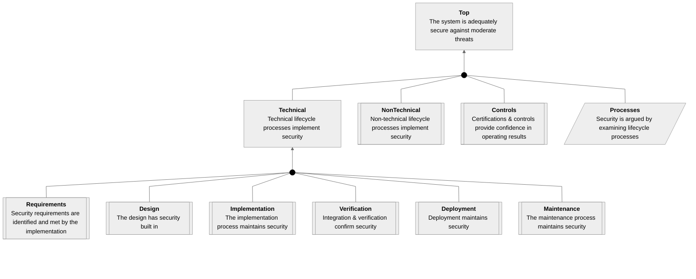

```mermaid
---
config:
  theme: neutral
  flowchart:
    curve: linear
    htmlLabels: true
    rankSpacing: 60
    nodeSpacing: 45
    padding: 15
---
flowchart BT
    classDef invisible opacity:0
    classDef sacmDot fill:#000,stroke:#000
    classDef connector fill:none,stroke:#cccccc,stroke-width:1px;
    classDef abstractClaim stroke-width:2px,stroke-dasharray: 5 5;
    Top["<b>Top</b><br>The system is adequately secure against moderate threats"]
    Processes[/"<b>Processes</b><br>Security is argued by examining lifecycle processes"/]
    Technical["<b>Technical</b><br>Technical lifecycle processes implement security"]
    NonTechnical[["<b>NonTechnical</b><br>Non-technical lifecycle processes implement security"]]
    Controls[["<b>Controls</b><br>Certifications &amp; controls provide confidence in operating results"]]
    Requirements[["<b>Requirements</b><br>Security requirements are identified and met by the implementation"]]
    Design[["<b>Design</b><br>The design has security built in"]]
    Implementation[["<b>Implementation</b><br>The implementation process maintains security"]]
    Verification[["<b>Verification</b><br>Integration &amp; verification confirm security"]]
    Deployment[["<b>Deployment</b><br>Deployment maintains security"]]
    Maintenance[["<b>Maintenance</b><br>The maintenance process maintains security"]]
    Dot1((" ")):::sacmDot
    Dot2((" ")):::sacmDot
    click Top "https://github.com/david-a-wheeler/caseproc/blob/main/tests/fixtures/badgeapp-top.sacm.mermaid.expected.md#claim-top"
    click Processes "https://github.com/david-a-wheeler/caseproc/blob/main/tests/fixtures/badgeapp-top.sacm.mermaid.expected.md#strategy-processes"
    click Technical "https://github.com/david-a-wheeler/caseproc/blob/main/tests/fixtures/badgeapp-top.sacm.mermaid.expected.md#claim-technical"
    click NonTechnical "https://github.com/david-a-wheeler/caseproc/blob/main/tests/fixtures/badgeapp-top.sacm.mermaid.expected.md#package-nontechnical"
    click Controls "https://github.com/david-a-wheeler/caseproc/blob/main/tests/fixtures/badgeapp-top.sacm.mermaid.expected.md#package-controls"
    click Requirements "https://github.com/david-a-wheeler/caseproc/blob/main/tests/fixtures/badgeapp-top.sacm.mermaid.expected.md#package-requirements"
    click Design "https://github.com/david-a-wheeler/caseproc/blob/main/tests/fixtures/badgeapp-top.sacm.mermaid.expected.md#package-design"
    click Implementation "https://github.com/david-a-wheeler/caseproc/blob/main/tests/fixtures/badgeapp-top.sacm.mermaid.expected.md#package-implementation"
    click Verification "https://github.com/david-a-wheeler/caseproc/blob/main/tests/fixtures/badgeapp-top.sacm.mermaid.expected.md#package-verification"
    click Deployment "https://github.com/david-a-wheeler/caseproc/blob/main/tests/fixtures/badgeapp-top.sacm.mermaid.expected.md#package-deployment"
    click Maintenance "https://github.com/david-a-wheeler/caseproc/blob/main/tests/fixtures/badgeapp-top.sacm.mermaid.expected.md#package-maintenance"

    BottomPadding[ ]:::invisible ~~~ Requirements
    Requirements --- Dot1
    Design --- Dot1
    Implementation --- Dot1
    Verification --- Dot1
    Deployment --- Dot1
    Maintenance --- Dot1
    Dot1 --> Technical
    Technical --- Dot2
    NonTechnical --- Dot2
    Controls --- Dot2
    Processes --- Dot2
    Dot2 --> Top
```
