# Demo Website Security Assurance Case

This document presents the security assurance case for a public-facing web
application, arguing that it is adequately secure against moderate threats.
The case is structured as four sub-arguments—access control, data
protection, deployment, and monitoring—each supporting the overarching
security claim.

It's really a demo of some of our capabilities, including four different
GSN Strategy renderings: one with no Context or Justification children
(SArg), one with a single Context (SAccess), one with a Context and a
Justification (SData), and one with a Context, a Justification, and a
second Context (SMonitor).

## SACM Diagrams

<!-- verocase sacm/mermaid * -->
### Package Security
```mermaid
---
config:
  theme: neutral
  flowchart:
    curve: linear
    htmlLabels: true
    rankSpacing: 60
    nodeSpacing: 45
    padding: 15
---
flowchart BT
    classDef invisible opacity:0
    classDef sacmDot fill:#000,stroke:#000
    classDef connector fill:none,stroke:#cccccc,stroke-width:1px;
    classDef abstractClaim stroke-width:2px,stroke-dasharray: 5 5;
    Security["<b>Security</b><br>The website is adequately secure against moderate threats"]
    XScope[("<b>XScope</b>&nbsp;↗<br>OWASP Top Ten threat model defines the threat scope")]
    SArg[/"<b>SArg</b><br>Security is argued by examining access control, data protection, deployment, and monitoring"/]
    Access[["<b>Access</b>"]]
    Data[["<b>Data</b>"]]
    Deployment["<b>Deployment</b><br>Deployment configuration follows security hardening guidelines"]
    Monitoring[["<b>Monitoring</b>"]]
    EvHarden[("<b>EvHarden</b>&nbsp;↗<br>Server hardening checklist completed and signed off")]
    XProd[("<b>XProd</b>&nbsp;↗<br>Production environment enforces HTTPS-only connections")]
    Dot1((" ")):::sacmDot
    click Security "https://github.com/david-a-wheeler/verocase/blob/main/tests/fixtures/demo-output.expected.md#claim-security"
    click XScope "https://github.com/david-a-wheeler/verocase/blob/main/tests/fixtures/demo-output.expected.md#context-xscope"
    click SArg "https://github.com/david-a-wheeler/verocase/blob/main/tests/fixtures/demo-output.expected.md#strategy-sarg"
    click Access "https://github.com/david-a-wheeler/verocase/blob/main/tests/fixtures/demo-output.expected.md#package-access"
    click Data "https://github.com/david-a-wheeler/verocase/blob/main/tests/fixtures/demo-output.expected.md#package-data"
    click Deployment "https://github.com/david-a-wheeler/verocase/blob/main/tests/fixtures/demo-output.expected.md#claim-deployment"
    click Monitoring "https://github.com/david-a-wheeler/verocase/blob/main/tests/fixtures/demo-output.expected.md#package-monitoring"
    click EvHarden "https://github.com/david-a-wheeler/verocase/blob/main/tests/fixtures/demo-output.expected.md#evidence-evharden"
    click XProd "https://github.com/david-a-wheeler/verocase/blob/main/tests/fixtures/demo-output.expected.md#context-xprod"

    BottomPadding1["<br/><br/><br/>"]:::invisible ~~~ XScope
    BottomPadding2["<br/><br/><br/>"]:::invisible ~~~ SArg
    BottomPadding3["<br/><br/><br/>"]:::invisible ~~~ Access
    BottomPadding4["<br/><br/><br/>"]:::invisible ~~~ Data
    BottomPadding5["<br/><br/><br/>"]:::invisible ~~~ Monitoring
    BottomPadding6["<br/><br/><br/>"]:::invisible ~~~ EvHarden
    BottomPadding7["<br/><br/><br/>"]:::invisible ~~~ XProd
    EvHarden --> Deployment
    XProd --o Deployment
    Access --- Dot1
    Data --- Dot1
    Deployment --- Dot1
    Monitoring --- Dot1
    SArg --- Dot1
    Dot1 --> Security
    XScope --o Security
```

### Package Access
```mermaid
---
config:
  theme: neutral
  flowchart:
    curve: linear
    htmlLabels: true
    rankSpacing: 60
    nodeSpacing: 45
    padding: 15
---
flowchart BT
    classDef invisible opacity:0
    classDef sacmDot fill:#000,stroke:#000
    classDef connector fill:none,stroke:#cccccc,stroke-width:1px;
    classDef abstractClaim stroke-width:2px,stroke-dasharray: 5 5;
    Access["<b>Access</b><br>User access control prevents unauthorized actions"]
    AAdmin["<b>AAdmin</b><br>Site administrators follow the published access management policy<br>ASSUMED"]
    SAccess[/"<b>SAccess</b><br>Access control is argued by examining authentication and authorization"/]
    XAuthStd[("<b>XAuthStd</b>&nbsp;↗<br>NIST SP 800-63B Level 2 defines the required authentication assurance level")]
    AuthN["<b>AuthN</b><br>All users are authenticated before accessing protected resources"]
    AuthZ["<b>AuthZ</b><br>Users can only access resources appropriate to their role"]
    XSSFree["<b>XSSFree</b><br>Cross-site scripting attacks are mitigated"]
    SqlFree["<b>SqlFree</b><br>SQL injection attacks are mitigated<br>✗"]
    EvLogin[("<b>EvLogin</b>&nbsp;↗<br>Login audit log shows no unauthorized access in last 90 days")]
    JMechanism["<b>JMechanism</b><br>Password-plus-MFA provides industry-standard two-factor authentication"]
    XLogPolicy[("<b>XLogPolicy</b>&nbsp;↗<br>Log retention policy requires 90-day audit trail")]
    EvRBAC[("<b>EvRBAC</b>&nbsp;↗<br>Role-based access control configuration review passed")]
    AuthZAdmin["<b>AuthZAdmin</b><br>Administrative functions require elevated privilege<br>ASSUMED"]
    EvCSP[("<b>EvCSP</b>&nbsp;↗<br>Content Security Policy headers verified by automated scanner")]
    EvPenTest[("<b>EvPenTest</b>&nbsp;↗<br>Penetration test report identifies active vulnerabilities in multiple endpoints")]
    DBVuln["<b>DBVuln</b><br>Active SQL injection vulnerability found in search endpoint"]
    Dot1((" ")):::sacmDot
    Dot2((" ")):::sacmDot
    Dot3((" ")):::sacmDot
    Dot4((" ")):::sacmDot
    click Access "https://github.com/david-a-wheeler/verocase/blob/main/tests/fixtures/demo-output.expected.md#claim-access"
    click AAdmin "https://github.com/david-a-wheeler/verocase/blob/main/tests/fixtures/demo-output.expected.md#assumption-aadmin"
    click SAccess "https://github.com/david-a-wheeler/verocase/blob/main/tests/fixtures/demo-output.expected.md#strategy-saccess"
    click XAuthStd "https://github.com/david-a-wheeler/verocase/blob/main/tests/fixtures/demo-output.expected.md#context-xauthstd"
    click AuthN "https://github.com/david-a-wheeler/verocase/blob/main/tests/fixtures/demo-output.expected.md#claim-authn"
    click AuthZ "https://github.com/david-a-wheeler/verocase/blob/main/tests/fixtures/demo-output.expected.md#claim-authz"
    click XSSFree "https://github.com/david-a-wheeler/verocase/blob/main/tests/fixtures/demo-output.expected.md#claim-xssfree"
    click SqlFree "https://github.com/david-a-wheeler/verocase/blob/main/tests/fixtures/demo-output.expected.md#claim-sqlfree"
    click EvLogin "https://github.com/david-a-wheeler/verocase/blob/main/tests/fixtures/demo-output.expected.md#evidence-evlogin"
    click JMechanism "https://github.com/david-a-wheeler/verocase/blob/main/tests/fixtures/demo-output.expected.md#justification-jmechanism"
    click XLogPolicy "https://github.com/david-a-wheeler/verocase/blob/main/tests/fixtures/demo-output.expected.md#context-xlogpolicy"
    click EvRBAC "https://github.com/david-a-wheeler/verocase/blob/main/tests/fixtures/demo-output.expected.md#evidence-evrbac"
    click AuthZAdmin "https://github.com/david-a-wheeler/verocase/blob/main/tests/fixtures/demo-output.expected.md#claim-authzadmin"
    click EvCSP "https://github.com/david-a-wheeler/verocase/blob/main/tests/fixtures/demo-output.expected.md#evidence-evcsp"
    click EvPenTest "https://github.com/david-a-wheeler/verocase/blob/main/tests/fixtures/demo-output.expected.md#evidence-evpentest"
    click DBVuln "https://github.com/david-a-wheeler/verocase/blob/main/tests/fixtures/demo-output.expected.md#claim-dbvuln"

    BottomPadding1["<br/><br/><br/>"]:::invisible ~~~ AAdmin
    BottomPadding2["<br/><br/><br/>"]:::invisible ~~~ XAuthStd
    BottomPadding3["<br/><br/><br/>"]:::invisible ~~~ EvLogin
    BottomPadding4["<br/><br/><br/>"]:::invisible ~~~ JMechanism
    BottomPadding5["<br/><br/><br/>"]:::invisible ~~~ XLogPolicy
    BottomPadding6["<br/><br/><br/>"]:::invisible ~~~ EvRBAC
    BottomPadding7["<br/><br/><br/>"]:::invisible ~~~ AuthZAdmin
    BottomPadding8["<br/><br/><br/>"]:::invisible ~~~ EvCSP
    BottomPadding9["<br/><br/><br/>"]:::invisible ~~~ EvPenTest
    BottomPadding10["<br/><br/><br/>"]:::invisible ~~~ DBVuln
    EvLogin --- Dot1
    JMechanism --- Dot1
    Dot1 --> AuthN
    XLogPolicy --o AuthN
    EvRBAC --- Dot2
    AuthZAdmin --- Dot2
    Dot2 --> AuthZ
    EvCSP --> XSSFree
    EvPenTest --- Dot3
    DBVuln --- Dot3
    Dot3 -->|⊖| SqlFree
    AAdmin --- Dot4
    AuthN --- Dot4
    AuthZ --- Dot4
    XSSFree --- Dot4
    SqlFree --- Dot4
    SAccess --- Dot4
    Dot4 --> Access
    XAuthStd --o SAccess
```

### Package Data
```mermaid
---
config:
  theme: neutral
  flowchart:
    curve: linear
    htmlLabels: true
    rankSpacing: 60
    nodeSpacing: 45
    padding: 15
---
flowchart BT
    classDef invisible opacity:0
    classDef sacmDot fill:#000,stroke:#000
    classDef connector fill:none,stroke:#cccccc,stroke-width:1px;
    classDef abstractClaim stroke-width:2px,stroke-dasharray: 5 5;
    Data["<b>Data</b><br>Sensitive user data is protected in transit and at rest"]
    XRegulation[("<b>XRegulation</b>&nbsp;↗<br>GDPR and applicable state privacy laws govern data handling")]
    AEncrypt["<b>AEncrypt</b><br>TLS 1.3 is correctly deployed on all public endpoints<br>━━━"]
    SData[/"<b>SData</b><br>Data protection is argued by examining encryption, minimization, and audit logging"/]
    MetaClaim["<b>MetaClaim</b><br>This assurance case addresses all applicable data protection requirements"]
    XDataScope[("<b>XDataScope</b>&nbsp;↗<br>GDPR Article 32 and state privacy law specify the required technical security measures")]
    JDataArch["<b>JDataArch</b><br>Treating encryption, minimisation, and audit as independent sub-arguments mirrors the layered controls recommended by the EDPB"]
    Encrypt["<b>Encrypt</b><br>All sensitive data is encrypted in transit and at rest"]
    Minimise["<b>Minimise</b><br>Only necessary data is collected and retained per the privacy policy"]
    AuditAccess["<b>AuditAccess</b><br>All sensitive data access events are logged and periodically reviewed"]:::abstractClaim
    EvTLS[("<b>EvTLS</b>&nbsp;↗<br>TLS configuration scan achieves A+ rating")]
    EvDB[("<b>EvDB</b>&nbsp;↗<br>Database-level encryption enabled and key management audited")]
    DataMap["<b>DataMap</b><br>The data flow diagram covers all personal data stores and flows<br>..."]
    JRetention["<b>JRetention</b><br>Data minimisation reduces breach impact and aids regulatory compliance"]
    Dot1((" ")):::sacmDot
    Dot2((" ")):::sacmDot
    Dot3((" ")):::sacmDot
    click Data "https://github.com/david-a-wheeler/verocase/blob/main/tests/fixtures/demo-output.expected.md#claim-data"
    click XRegulation "https://github.com/david-a-wheeler/verocase/blob/main/tests/fixtures/demo-output.expected.md#context-xregulation"
    click AEncrypt "https://github.com/david-a-wheeler/verocase/blob/main/tests/fixtures/demo-output.expected.md#claim-aencrypt"
    click SData "https://github.com/david-a-wheeler/verocase/blob/main/tests/fixtures/demo-output.expected.md#strategy-sdata"
    click MetaClaim "https://github.com/david-a-wheeler/verocase/blob/main/tests/fixtures/demo-output.expected.md#claim-metaclaim"
    click XDataScope "https://github.com/david-a-wheeler/verocase/blob/main/tests/fixtures/demo-output.expected.md#context-xdatascope"
    click JDataArch "https://github.com/david-a-wheeler/verocase/blob/main/tests/fixtures/demo-output.expected.md#justification-jdataarch"
    click Encrypt "https://github.com/david-a-wheeler/verocase/blob/main/tests/fixtures/demo-output.expected.md#claim-encrypt"
    click Minimise "https://github.com/david-a-wheeler/verocase/blob/main/tests/fixtures/demo-output.expected.md#claim-minimise"
    click AuditAccess "https://github.com/david-a-wheeler/verocase/blob/main/tests/fixtures/demo-output.expected.md#claim-auditaccess"
    click EvTLS "https://github.com/david-a-wheeler/verocase/blob/main/tests/fixtures/demo-output.expected.md#evidence-evtls"
    click EvDB "https://github.com/david-a-wheeler/verocase/blob/main/tests/fixtures/demo-output.expected.md#evidence-evdb"
    click DataMap "https://github.com/david-a-wheeler/verocase/blob/main/tests/fixtures/demo-output.expected.md#claim-datamap"
    click JRetention "https://github.com/david-a-wheeler/verocase/blob/main/tests/fixtures/demo-output.expected.md#justification-jretention"

    BottomPadding1["<br/><br/><br/>"]:::invisible ~~~ XRegulation
    BottomPadding2["<br/><br/><br/>"]:::invisible ~~~ AEncrypt
    BottomPadding3["<br/><br/><br/>"]:::invisible ~~~ MetaClaim
    BottomPadding4["<br/><br/><br/>"]:::invisible ~~~ XDataScope
    BottomPadding5["<br/><br/><br/>"]:::invisible ~~~ JDataArch
    BottomPadding6["<br/><br/><br/>"]:::invisible ~~~ AuditAccess
    BottomPadding7["<br/><br/><br/>"]:::invisible ~~~ EvTLS
    BottomPadding8["<br/><br/><br/>"]:::invisible ~~~ EvDB
    BottomPadding9["<br/><br/><br/>"]:::invisible ~~~ DataMap
    BottomPadding10["<br/><br/><br/>"]:::invisible ~~~ JRetention
    EvTLS --- Dot1
    EvDB --- Dot1
    Dot1 --> Encrypt
    DataMap --- Dot2
    JRetention --- Dot2
    Dot2 --> Minimise
    AEncrypt --- Dot3
    JDataArch --- Dot3
    Encrypt --- Dot3
    Minimise --- Dot3
    AuditAccess --- Dot3
    SData --- Dot3
    MetaClaim --- Dot3
    Dot3 --> Data
    XRegulation --o Data
    XDataScope --o SData
```

### Package Monitoring
```mermaid
---
config:
  theme: neutral
  flowchart:
    curve: linear
    htmlLabels: true
    rankSpacing: 60
    nodeSpacing: 45
    padding: 15
---
flowchart BT
    classDef invisible opacity:0
    classDef sacmDot fill:#000,stroke:#000
    classDef connector fill:none,stroke:#cccccc,stroke-width:1px;
    classDef abstractClaim stroke-width:2px,stroke-dasharray: 5 5;
    Monitoring["<b>Monitoring</b><br>Security events are detected and responded to in a timely manner"]
    SMonitor[/"<b>SMonitor</b><br>Detection capability is argued by examining alerting coverage, SOC capacity, and response procedures"/]
    XSIEMScope[("<b>XSIEMScope</b>&nbsp;↗<br>The SIEM deployment covers all application, network, and host event sources")]
    JSOCModel["<b>JSOCModel</b><br>The 24/7 follow-the-sun SOC model ensures trained responders are always available"]
    XSLA[("<b>XSLA</b>&nbsp;↗<br>The service-level agreement requires critical alerts to be acknowledged within 15 minutes")]
    AlertCoverage["<b>AlertCoverage</b><br>All OWASP Top Ten attack patterns trigger at least one SIEM alert"]
    ResponseTime["<b>ResponseTime</b><br>Critical security alerts are acknowledged within the required timeframe"]
    EvAlertCoverage[("<b>EvAlertCoverage</b>&nbsp;↗<br>SIEM rule audit confirms coverage of all current OWASP Top Ten patterns")]
    EvResponseTime[("<b>EvResponseTime</b>&nbsp;↗<br>SOC metrics show 99.2% of critical alerts acknowledged within 15 minutes over the past year")]
    Dot1((" ")):::sacmDot
    click Monitoring "https://github.com/david-a-wheeler/verocase/blob/main/tests/fixtures/demo-output.expected.md#claim-monitoring"
    click SMonitor "https://github.com/david-a-wheeler/verocase/blob/main/tests/fixtures/demo-output.expected.md#strategy-smonitor"
    click XSIEMScope "https://github.com/david-a-wheeler/verocase/blob/main/tests/fixtures/demo-output.expected.md#context-xsiemscope"
    click JSOCModel "https://github.com/david-a-wheeler/verocase/blob/main/tests/fixtures/demo-output.expected.md#justification-jsocmodel"
    click XSLA "https://github.com/david-a-wheeler/verocase/blob/main/tests/fixtures/demo-output.expected.md#context-xsla"
    click AlertCoverage "https://github.com/david-a-wheeler/verocase/blob/main/tests/fixtures/demo-output.expected.md#claim-alertcoverage"
    click ResponseTime "https://github.com/david-a-wheeler/verocase/blob/main/tests/fixtures/demo-output.expected.md#claim-responsetime"
    click EvAlertCoverage "https://github.com/david-a-wheeler/verocase/blob/main/tests/fixtures/demo-output.expected.md#evidence-evalertcoverage"
    click EvResponseTime "https://github.com/david-a-wheeler/verocase/blob/main/tests/fixtures/demo-output.expected.md#evidence-evresponsetime"

    BottomPadding1["<br/><br/><br/>"]:::invisible ~~~ XSIEMScope
    BottomPadding2["<br/><br/><br/>"]:::invisible ~~~ JSOCModel
    BottomPadding3["<br/><br/><br/>"]:::invisible ~~~ XSLA
    BottomPadding4["<br/><br/><br/>"]:::invisible ~~~ EvAlertCoverage
    BottomPadding5["<br/><br/><br/>"]:::invisible ~~~ EvResponseTime
    EvAlertCoverage --> AlertCoverage
    EvResponseTime --> ResponseTime
    JSOCModel --- Dot1
    AlertCoverage --- Dot1
    ResponseTime --- Dot1
    SMonitor --- Dot1
    Dot1 --> Monitoring
    XSIEMScope --o SMonitor
    XSLA --o SMonitor
```
<!-- end verocase -->

## GSN Diagrams

<!-- verocase gsn/mermaid * -->
### Package Security
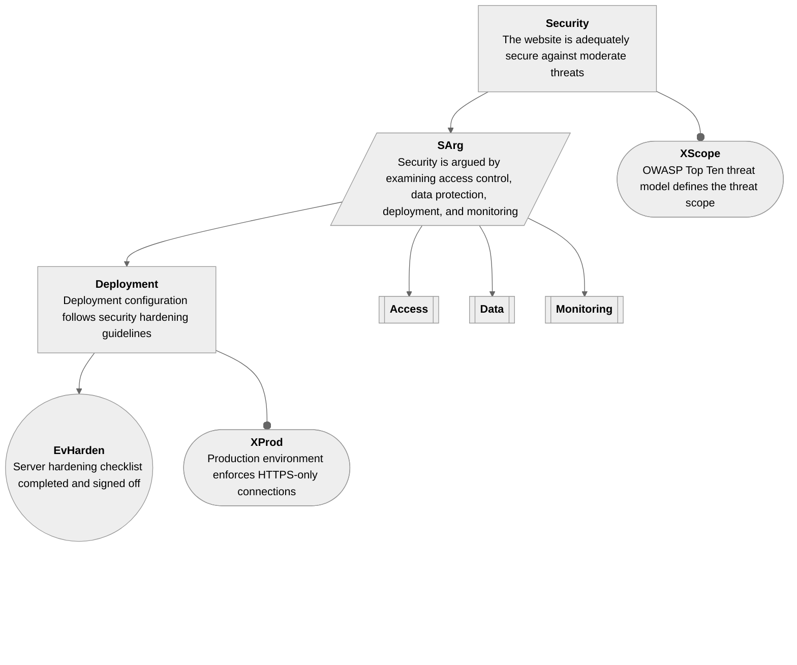

### Package Access
```mermaid
---
config:
  theme: neutral
  flowchart:
    curve: basis
    htmlLabels: true
    rankSpacing: 60
    nodeSpacing: 45
    padding: 15
---
flowchart TD
    classDef invisible opacity:0
    classDef gsnUndev stroke-width:2px,stroke-dasharray: 5 5;
    classDef connector fill:none,stroke:#cccccc,stroke-width:1px;
    Access["<b>Access</b><br>User access control prevents unauthorized actions"]
    AAdmin("<b>AAdmin</b>&nbsp;Ⓐ<br>Site administrators follow the published access management policy")
    SAccess[/"<b>SAccess</b><br>Access control is argued by examining authentication and authorization"/]
    XAuthStd(["<b>XAuthStd</b><br>NIST SP 800-63B Level 2 defines the required authentication assurance level"])
    AuthN["<b>AuthN</b><br>All users are authenticated before accessing protected resources"]
    AuthZ["<b>AuthZ</b><br>Users can only access resources appropriate to their role"]
    XSSFree["<b>XSSFree</b><br>Cross-site scripting attacks are mitigated"]
    SqlFree["<b>SqlFree</b><br>SQL injection attacks are mitigated<br>✗"]
    EvLogin(("<b>EvLogin</b><br>Login audit log shows no unauthorized access in last 90 days"))
    JMechanism("<b>JMechanism</b>&nbsp;Ⓙ<br>Password-plus-MFA provides industry-standard two-factor authentication")
    XLogPolicy(["<b>XLogPolicy</b><br>Log retention policy requires 90-day audit trail"])
    EvRBAC(("<b>EvRBAC</b><br>Role-based access control configuration review passed"))
    AuthZAdmin("<b>AuthZAdmin</b>&nbsp;Ⓐ<br>Administrative functions require elevated privilege")
    EvCSP(("<b>EvCSP</b><br>Content Security Policy headers verified by automated scanner"))
    EvPenTest(("<b>EvPenTest</b><br>Penetration test report identifies active vulnerabilities in multiple endpoints"))
    DBVuln["<b>DBVuln</b><br>Active SQL injection vulnerability found in search endpoint"]
    click Access "https://github.com/david-a-wheeler/verocase/blob/main/tests/fixtures/demo-output.expected.md#claim-access"
    click AAdmin "https://github.com/david-a-wheeler/verocase/blob/main/tests/fixtures/demo-output.expected.md#assumption-aadmin"
    click SAccess "https://github.com/david-a-wheeler/verocase/blob/main/tests/fixtures/demo-output.expected.md#strategy-saccess"
    click XAuthStd "https://github.com/david-a-wheeler/verocase/blob/main/tests/fixtures/demo-output.expected.md#context-xauthstd"
    click AuthN "https://github.com/david-a-wheeler/verocase/blob/main/tests/fixtures/demo-output.expected.md#claim-authn"
    click AuthZ "https://github.com/david-a-wheeler/verocase/blob/main/tests/fixtures/demo-output.expected.md#claim-authz"
    click XSSFree "https://github.com/david-a-wheeler/verocase/blob/main/tests/fixtures/demo-output.expected.md#claim-xssfree"
    click SqlFree "https://github.com/david-a-wheeler/verocase/blob/main/tests/fixtures/demo-output.expected.md#claim-sqlfree"
    click EvLogin "https://github.com/david-a-wheeler/verocase/blob/main/tests/fixtures/demo-output.expected.md#evidence-evlogin"
    click JMechanism "https://github.com/david-a-wheeler/verocase/blob/main/tests/fixtures/demo-output.expected.md#justification-jmechanism"
    click XLogPolicy "https://github.com/david-a-wheeler/verocase/blob/main/tests/fixtures/demo-output.expected.md#context-xlogpolicy"
    click EvRBAC "https://github.com/david-a-wheeler/verocase/blob/main/tests/fixtures/demo-output.expected.md#evidence-evrbac"
    click AuthZAdmin "https://github.com/david-a-wheeler/verocase/blob/main/tests/fixtures/demo-output.expected.md#claim-authzadmin"
    click EvCSP "https://github.com/david-a-wheeler/verocase/blob/main/tests/fixtures/demo-output.expected.md#evidence-evcsp"
    click EvPenTest "https://github.com/david-a-wheeler/verocase/blob/main/tests/fixtures/demo-output.expected.md#evidence-evpentest"
    click DBVuln "https://github.com/david-a-wheeler/verocase/blob/main/tests/fixtures/demo-output.expected.md#claim-dbvuln"

    Access --o AAdmin
    Access --> SAccess
    SAccess --o XAuthStd
    SAccess --> AuthN
    AuthN --> EvLogin
    AuthN --o JMechanism
    AuthN --o XLogPolicy
    SAccess --> AuthZ
    AuthZ --> EvRBAC
    AuthZ --> AuthZAdmin
    SAccess --> XSSFree
    XSSFree --> EvCSP
    XSSFree -->|⊖| EvPenTest
    SAccess --> SqlFree
    SqlFree --> EvPenTest
    SqlFree -->|⊖| DBVuln
    AAdmin ~~~ BottomPadding1["<br/><br/><br/>"]:::invisible
    XAuthStd ~~~ BottomPadding2["<br/><br/><br/>"]:::invisible
    EvLogin ~~~ BottomPadding3["<br/><br/><br/>"]:::invisible
    JMechanism ~~~ BottomPadding4["<br/><br/><br/>"]:::invisible
    XLogPolicy ~~~ BottomPadding5["<br/><br/><br/>"]:::invisible
    EvRBAC ~~~ BottomPadding6["<br/><br/><br/>"]:::invisible
    AuthZAdmin ~~~ BottomPadding7["<br/><br/><br/>"]:::invisible
    EvCSP ~~~ BottomPadding8["<br/><br/><br/>"]:::invisible
    EvPenTest ~~~ BottomPadding9["<br/><br/><br/>"]:::invisible
    DBVuln ~~~ BottomPadding10["<br/><br/><br/>"]:::invisible
```

### Package Data
```mermaid
---
config:
  theme: neutral
  flowchart:
    curve: basis
    htmlLabels: true
    rankSpacing: 60
    nodeSpacing: 45
    padding: 15
---
flowchart TD
    classDef invisible opacity:0
    classDef gsnUndev stroke-width:2px,stroke-dasharray: 5 5;
    classDef connector fill:none,stroke:#cccccc,stroke-width:1px;
    Data["<b>Data</b><br>Sensitive user data is protected in transit and at rest"]
    XRegulation(["<b>XRegulation</b><br>GDPR and applicable state privacy laws govern data handling"])
    AEncrypt["<b>AEncrypt</b><br>TLS 1.3 is correctly deployed on all public endpoints<br>AXIOMATIC"]
    SData[/"<b>SData</b><br>Data protection is argued by examining encryption, minimization, and audit logging"/]
    MetaClaim["<b>MetaClaim</b><br>This assurance case addresses all applicable data protection requirements<br>METACLAIM"]
    XDataScope(["<b>XDataScope</b><br>GDPR Article 32 and state privacy law specify the required technical security measures"])
    JDataArch("<b>JDataArch</b>&nbsp;Ⓙ<br>Treating encryption, minimisation, and audit as independent sub-arguments mirrors the layered controls recommended by the EDPB")
    Encrypt["<b>Encrypt</b><br>All sensitive data is encrypted in transit and at rest"]
    Minimise["<b>Minimise</b><br>Only necessary data is collected and retained per the privacy policy"]
    AuditAccess["<b>AuditAccess</b><br>All sensitive data access events are logged and periodically reviewed"]:::gsnUndev
    EvTLS(("<b>EvTLS</b><br>TLS configuration scan achieves A+ rating"))
    EvDB(("<b>EvDB</b><br>Database-level encryption enabled and key management audited"))
    DataMap["<b>DataMap</b><br>The data flow diagram covers all personal data stores and flows<br>◇"]
    JRetention("<b>JRetention</b>&nbsp;Ⓙ<br>Data minimisation reduces breach impact and aids regulatory compliance")
    click Data "https://github.com/david-a-wheeler/verocase/blob/main/tests/fixtures/demo-output.expected.md#claim-data"
    click XRegulation "https://github.com/david-a-wheeler/verocase/blob/main/tests/fixtures/demo-output.expected.md#context-xregulation"
    click AEncrypt "https://github.com/david-a-wheeler/verocase/blob/main/tests/fixtures/demo-output.expected.md#claim-aencrypt"
    click SData "https://github.com/david-a-wheeler/verocase/blob/main/tests/fixtures/demo-output.expected.md#strategy-sdata"
    click MetaClaim "https://github.com/david-a-wheeler/verocase/blob/main/tests/fixtures/demo-output.expected.md#claim-metaclaim"
    click XDataScope "https://github.com/david-a-wheeler/verocase/blob/main/tests/fixtures/demo-output.expected.md#context-xdatascope"
    click JDataArch "https://github.com/david-a-wheeler/verocase/blob/main/tests/fixtures/demo-output.expected.md#justification-jdataarch"
    click Encrypt "https://github.com/david-a-wheeler/verocase/blob/main/tests/fixtures/demo-output.expected.md#claim-encrypt"
    click Minimise "https://github.com/david-a-wheeler/verocase/blob/main/tests/fixtures/demo-output.expected.md#claim-minimise"
    click AuditAccess "https://github.com/david-a-wheeler/verocase/blob/main/tests/fixtures/demo-output.expected.md#claim-auditaccess"
    click EvTLS "https://github.com/david-a-wheeler/verocase/blob/main/tests/fixtures/demo-output.expected.md#evidence-evtls"
    click EvDB "https://github.com/david-a-wheeler/verocase/blob/main/tests/fixtures/demo-output.expected.md#evidence-evdb"
    click DataMap "https://github.com/david-a-wheeler/verocase/blob/main/tests/fixtures/demo-output.expected.md#claim-datamap"
    click JRetention "https://github.com/david-a-wheeler/verocase/blob/main/tests/fixtures/demo-output.expected.md#justification-jretention"

    Data --o XRegulation
    Data --> AEncrypt
    Data --> SData
    SData --o XDataScope
    SData --o JDataArch
    SData --> Encrypt
    Encrypt --> EvTLS
    Encrypt --> EvDB
    SData --> Minimise
    Minimise --> DataMap
    Minimise --o JRetention
    SData --> AuditAccess
    Data --> MetaClaim
    XRegulation ~~~ BottomPadding1["<br/><br/><br/>"]:::invisible
    AEncrypt ~~~ BottomPadding2["<br/><br/><br/>"]:::invisible
    XDataScope ~~~ BottomPadding3["<br/><br/><br/>"]:::invisible
    JDataArch ~~~ BottomPadding4["<br/><br/><br/>"]:::invisible
    EvTLS ~~~ BottomPadding5["<br/><br/><br/>"]:::invisible
    EvDB ~~~ BottomPadding6["<br/><br/><br/>"]:::invisible
    DataMap ~~~ BottomPadding7["<br/><br/><br/>"]:::invisible
    JRetention ~~~ BottomPadding8["<br/><br/><br/>"]:::invisible
    AuditAccess ~~~ BottomPadding9["<br/><br/><br/>"]:::invisible
    MetaClaim ~~~ BottomPadding10["<br/><br/><br/>"]:::invisible
```

### Package Monitoring
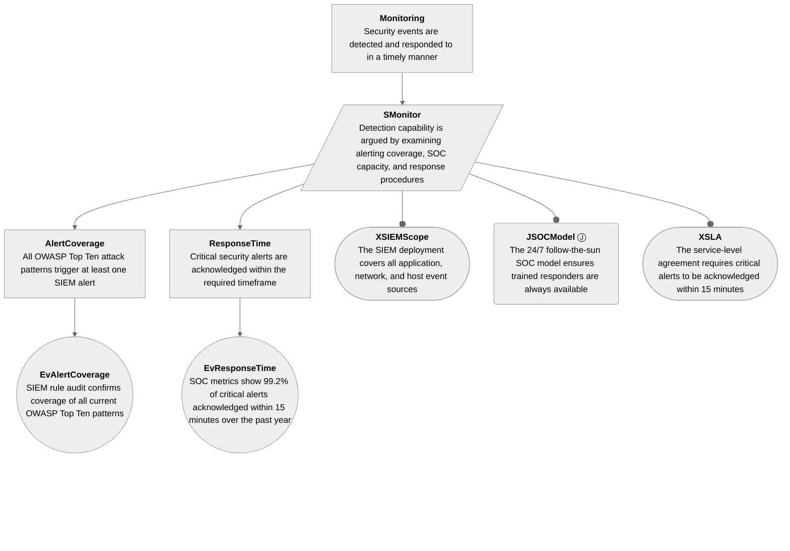
<!-- end verocase -->

## CAE Diagrams

<!-- verocase cae/mermaid * -->
### Package Security
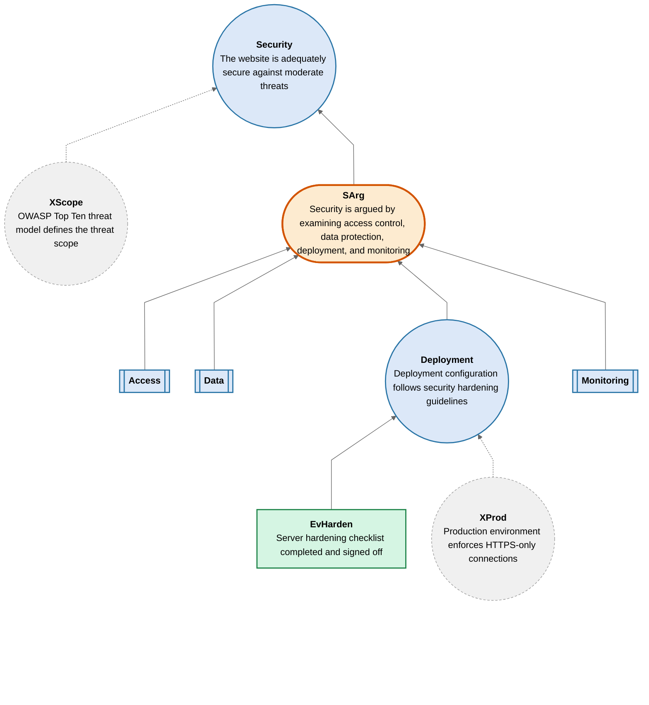

### Package Access
```mermaid
---
config:
  theme: neutral
  flowchart:
    curve: linear
    htmlLabels: true
    rankSpacing: 60
    nodeSpacing: 45
    padding: 15
---
flowchart BT
    classDef invisible        opacity:0
    classDef connector        fill:none,stroke:#cccccc,stroke-width:1px
    classDef caeClaimClass    fill:#dce8f8,stroke:#2874a6,stroke-width:2px,color:#000
    classDef caeArgClass      fill:#fdebd0,stroke:#d35400,stroke-width:3px,color:#000
    classDef caeEvidClass     fill:#d5f5e3,stroke:#1e8449,stroke-width:2px,color:#000
    classDef caeInfoClass     fill:#f0f0f0,stroke:#999999,stroke-width:1px,stroke-dasharray:4 3,color:#000
    classDef caeAssumedClass  fill:#e8daef,stroke:#76448a,stroke-width:2px,stroke-dasharray:4 3,color:#000
    classDef caeSideClass     fill:#d6eaf8,stroke:#1a5276,stroke-width:2px,color:#000
    classDef caeDefeaterClass fill:#fadbd8,stroke:#c0392b,stroke-width:4px,color:#000
    classDef abstractClaim    stroke-width:2px,stroke-dasharray:5 5
    Access(("<b>Access</b><br>User access control prevents unauthorized actions")):::caeClaimClass
    AAdmin(("<b>AAdmin</b>&nbsp;Ⓐ<br>Site administrators follow the published access management policy")):::caeAssumedClass
    SAccess(["<b>SAccess</b><br>Access control is argued by examining authentication and authorization"]):::caeArgClass
    XAuthStd(("<b>XAuthStd</b><br>NIST SP 800-63B Level 2 defines the required authentication assurance level")):::caeInfoClass
    AuthN(("<b>AuthN</b><br>All users are authenticated before accessing protected resources")):::caeClaimClass
    AuthZ(("<b>AuthZ</b><br>Users can only access resources appropriate to their role")):::caeClaimClass
    XSSFree(("<b>XSSFree</b><br>Cross-site scripting attacks are mitigated")):::caeClaimClass
    SqlFree(("<b>SqlFree</b><br>SQL injection attacks are mitigated<br>DEFEATED")):::caeClaimClass
    EvLogin["<b>EvLogin</b><br>Login audit log shows no unauthorized access in last 90 days"]:::caeEvidClass
    JMechanism(["<b>JMechanism</b>&nbsp;Ⓢ<br>Password-plus-MFA provides industry-standard two-factor authentication"]):::caeSideClass
    XLogPolicy(("<b>XLogPolicy</b><br>Log retention policy requires 90-day audit trail")):::caeInfoClass
    EvRBAC["<b>EvRBAC</b><br>Role-based access control configuration review passed"]:::caeEvidClass
    AuthZAdmin(("<b>AuthZAdmin</b>&nbsp;Ⓐ<br>Administrative functions require elevated privilege")):::caeAssumedClass
    EvCSP["<b>EvCSP</b><br>Content Security Policy headers verified by automated scanner"]:::caeEvidClass
    EvPenTest["<b>EvPenTest</b><br>Penetration test report identifies active vulnerabilities in multiple endpoints"]:::caeEvidClass
    DBVuln(("<b>DBVuln</b>&nbsp;⊗<br>Active SQL injection vulnerability found in search endpoint")):::caeDefeaterClass
    click Access "https://github.com/david-a-wheeler/verocase/blob/main/tests/fixtures/demo-output.expected.md#claim-access"
    click AAdmin "https://github.com/david-a-wheeler/verocase/blob/main/tests/fixtures/demo-output.expected.md#assumption-aadmin"
    click SAccess "https://github.com/david-a-wheeler/verocase/blob/main/tests/fixtures/demo-output.expected.md#strategy-saccess"
    click XAuthStd "https://github.com/david-a-wheeler/verocase/blob/main/tests/fixtures/demo-output.expected.md#context-xauthstd"
    click AuthN "https://github.com/david-a-wheeler/verocase/blob/main/tests/fixtures/demo-output.expected.md#claim-authn"
    click AuthZ "https://github.com/david-a-wheeler/verocase/blob/main/tests/fixtures/demo-output.expected.md#claim-authz"
    click XSSFree "https://github.com/david-a-wheeler/verocase/blob/main/tests/fixtures/demo-output.expected.md#claim-xssfree"
    click SqlFree "https://github.com/david-a-wheeler/verocase/blob/main/tests/fixtures/demo-output.expected.md#claim-sqlfree"
    click EvLogin "https://github.com/david-a-wheeler/verocase/blob/main/tests/fixtures/demo-output.expected.md#evidence-evlogin"
    click JMechanism "https://github.com/david-a-wheeler/verocase/blob/main/tests/fixtures/demo-output.expected.md#justification-jmechanism"
    click XLogPolicy "https://github.com/david-a-wheeler/verocase/blob/main/tests/fixtures/demo-output.expected.md#context-xlogpolicy"
    click EvRBAC "https://github.com/david-a-wheeler/verocase/blob/main/tests/fixtures/demo-output.expected.md#evidence-evrbac"
    click AuthZAdmin "https://github.com/david-a-wheeler/verocase/blob/main/tests/fixtures/demo-output.expected.md#claim-authzadmin"
    click EvCSP "https://github.com/david-a-wheeler/verocase/blob/main/tests/fixtures/demo-output.expected.md#evidence-evcsp"
    click EvPenTest "https://github.com/david-a-wheeler/verocase/blob/main/tests/fixtures/demo-output.expected.md#evidence-evpentest"
    click DBVuln "https://github.com/david-a-wheeler/verocase/blob/main/tests/fixtures/demo-output.expected.md#claim-dbvuln"

    BottomPadding1["<br/><br/><br/>"]:::invisible ~~~ AAdmin
    BottomPadding2["<br/><br/><br/>"]:::invisible ~~~ XAuthStd
    BottomPadding3["<br/><br/><br/>"]:::invisible ~~~ EvLogin
    BottomPadding4["<br/><br/><br/>"]:::invisible ~~~ JMechanism
    BottomPadding5["<br/><br/><br/>"]:::invisible ~~~ XLogPolicy
    BottomPadding6["<br/><br/><br/>"]:::invisible ~~~ EvRBAC
    BottomPadding7["<br/><br/><br/>"]:::invisible ~~~ AuthZAdmin
    BottomPadding8["<br/><br/><br/>"]:::invisible ~~~ EvCSP
    BottomPadding9["<br/><br/><br/>"]:::invisible ~~~ EvPenTest
    BottomPadding10["<br/><br/><br/>"]:::invisible ~~~ DBVuln
    AAdmin --> Access
    XAuthStd -.-> SAccess
    EvLogin --> AuthN
    JMechanism --> AuthN
    XLogPolicy -.-> AuthN
    AuthN --> SAccess
    EvRBAC --> AuthZ
    AuthZAdmin --> AuthZ
    AuthZ --> SAccess
    EvCSP --> XSSFree
    EvPenTest -->|⊖| XSSFree
    XSSFree --> SAccess
    EvPenTest --> SqlFree
    DBVuln --x SqlFree
    SqlFree --> SAccess
    SAccess --> Access
```

### Package Data
```mermaid
---
config:
  theme: neutral
  flowchart:
    curve: linear
    htmlLabels: true
    rankSpacing: 60
    nodeSpacing: 45
    padding: 15
---
flowchart BT
    classDef invisible        opacity:0
    classDef connector        fill:none,stroke:#cccccc,stroke-width:1px
    classDef caeClaimClass    fill:#dce8f8,stroke:#2874a6,stroke-width:2px,color:#000
    classDef caeArgClass      fill:#fdebd0,stroke:#d35400,stroke-width:3px,color:#000
    classDef caeEvidClass     fill:#d5f5e3,stroke:#1e8449,stroke-width:2px,color:#000
    classDef caeInfoClass     fill:#f0f0f0,stroke:#999999,stroke-width:1px,stroke-dasharray:4 3,color:#000
    classDef caeAssumedClass  fill:#e8daef,stroke:#76448a,stroke-width:2px,stroke-dasharray:4 3,color:#000
    classDef caeSideClass     fill:#d6eaf8,stroke:#1a5276,stroke-width:2px,color:#000
    classDef caeDefeaterClass fill:#fadbd8,stroke:#c0392b,stroke-width:4px,color:#000
    classDef abstractClaim    stroke-width:2px,stroke-dasharray:5 5
    Data(("<b>Data</b><br>Sensitive user data is protected in transit and at rest")):::caeClaimClass
    XRegulation(("<b>XRegulation</b><br>GDPR and applicable state privacy laws govern data handling")):::caeInfoClass
    AEncrypt(("<b>AEncrypt</b><br>TLS 1.3 is correctly deployed on all public endpoints")):::caeClaimClass
    SData(["<b>SData</b><br>Data protection is argued by examining encryption, minimization, and audit logging"]):::caeArgClass
    MetaClaim(("<b>MetaClaim</b><br>This assurance case addresses all applicable data protection requirements")):::caeClaimClass
    XDataScope(("<b>XDataScope</b><br>GDPR Article 32 and state privacy law specify the required technical security measures")):::caeInfoClass
    JDataArch(["<b>JDataArch</b>&nbsp;Ⓢ<br>Treating encryption, minimisation, and audit as independent sub-arguments mirrors the layered controls recommended by the EDPB"]):::caeSideClass
    Encrypt(("<b>Encrypt</b><br>All sensitive data is encrypted in transit and at rest")):::caeClaimClass
    Minimise(("<b>Minimise</b><br>Only necessary data is collected and retained per the privacy policy")):::caeClaimClass
    AuditAccess(("<b>AuditAccess</b><br>All sensitive data access events are logged and periodically reviewed")):::caeClaimClass
    EvTLS["<b>EvTLS</b><br>TLS configuration scan achieves A+ rating"]:::caeEvidClass
    EvDB["<b>EvDB</b><br>Database-level encryption enabled and key management audited"]:::caeEvidClass
    DataMap(("<b>DataMap</b><br>The data flow diagram covers all personal data stores and flows<br>...")):::caeClaimClass
    JRetention(["<b>JRetention</b>&nbsp;Ⓢ<br>Data minimisation reduces breach impact and aids regulatory compliance"]):::caeSideClass
    class AuditAccess abstractClaim
    click Data "https://github.com/david-a-wheeler/verocase/blob/main/tests/fixtures/demo-output.expected.md#claim-data"
    click XRegulation "https://github.com/david-a-wheeler/verocase/blob/main/tests/fixtures/demo-output.expected.md#context-xregulation"
    click AEncrypt "https://github.com/david-a-wheeler/verocase/blob/main/tests/fixtures/demo-output.expected.md#claim-aencrypt"
    click SData "https://github.com/david-a-wheeler/verocase/blob/main/tests/fixtures/demo-output.expected.md#strategy-sdata"
    click MetaClaim "https://github.com/david-a-wheeler/verocase/blob/main/tests/fixtures/demo-output.expected.md#claim-metaclaim"
    click XDataScope "https://github.com/david-a-wheeler/verocase/blob/main/tests/fixtures/demo-output.expected.md#context-xdatascope"
    click JDataArch "https://github.com/david-a-wheeler/verocase/blob/main/tests/fixtures/demo-output.expected.md#justification-jdataarch"
    click Encrypt "https://github.com/david-a-wheeler/verocase/blob/main/tests/fixtures/demo-output.expected.md#claim-encrypt"
    click Minimise "https://github.com/david-a-wheeler/verocase/blob/main/tests/fixtures/demo-output.expected.md#claim-minimise"
    click AuditAccess "https://github.com/david-a-wheeler/verocase/blob/main/tests/fixtures/demo-output.expected.md#claim-auditaccess"
    click EvTLS "https://github.com/david-a-wheeler/verocase/blob/main/tests/fixtures/demo-output.expected.md#evidence-evtls"
    click EvDB "https://github.com/david-a-wheeler/verocase/blob/main/tests/fixtures/demo-output.expected.md#evidence-evdb"
    click DataMap "https://github.com/david-a-wheeler/verocase/blob/main/tests/fixtures/demo-output.expected.md#claim-datamap"
    click JRetention "https://github.com/david-a-wheeler/verocase/blob/main/tests/fixtures/demo-output.expected.md#justification-jretention"

    BottomPadding1["<br/><br/><br/>"]:::invisible ~~~ XRegulation
    BottomPadding2["<br/><br/><br/>"]:::invisible ~~~ AEncrypt
    BottomPadding3["<br/><br/><br/>"]:::invisible ~~~ MetaClaim
    BottomPadding4["<br/><br/><br/>"]:::invisible ~~~ XDataScope
    BottomPadding5["<br/><br/><br/>"]:::invisible ~~~ JDataArch
    BottomPadding6["<br/><br/><br/>"]:::invisible ~~~ AuditAccess
    BottomPadding7["<br/><br/><br/>"]:::invisible ~~~ EvTLS
    BottomPadding8["<br/><br/><br/>"]:::invisible ~~~ EvDB
    BottomPadding9["<br/><br/><br/>"]:::invisible ~~~ DataMap
    BottomPadding10["<br/><br/><br/>"]:::invisible ~~~ JRetention
    XRegulation -.-> Data
    AEncrypt --> Data
    XDataScope -.-> SData
    JDataArch --> SData
    EvTLS --> Encrypt
    EvDB --> Encrypt
    Encrypt --> SData
    DataMap --> Minimise
    JRetention --> Minimise
    Minimise --> SData
    AuditAccess --> SData
    SData --> Data
    MetaClaim --> Data
```

### Package Monitoring
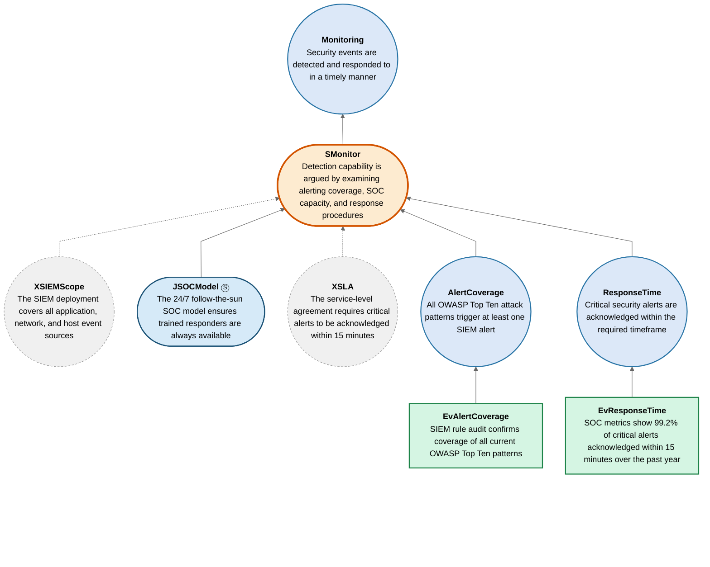
<!-- end verocase -->

## LTAC Notation

<!-- verocase ltac/markdown * -->
### Package Security
- [Claim Security: The website is adequately secure against moderate threats](#claim-security)
  - [Context XScope: OWASP Top Ten threat model defines the threat scope](#context-xscope) ([owasp-top10.pdf](owasp-top10.pdf))
  - [Strategy SArg: Security is argued by examining access control, data protection, deployment, and monitoring](#strategy-sarg)
    - [Claim Access](#claim-access)
    - [Claim Data](#claim-data)
    - [Claim Deployment: Deployment configuration follows security hardening guidelines](#claim-deployment)
      - [Evidence EvHarden: Server hardening checklist completed and signed off](#evidence-evharden) ([hardening-checklist.pdf](hardening-checklist.pdf))
      - [Context XProd: Production environment enforces HTTPS-only connections](#context-xprod)
    - [Claim Monitoring](#claim-monitoring)

### Package Access
- [Claim Access: User access control prevents unauthorized actions](#claim-access)
  - [Assumption AAdmin: Site administrators follow the published access management policy](#assumption-aadmin)
  - [Strategy SAccess: Access control is argued by examining authentication and authorization](#strategy-saccess)
    - [Context XAuthStd: NIST SP 800-63B Level 2 defines the required authentication assurance level](#context-xauthstd) ([nist-800-63b.pdf](nist-800-63b.pdf))
    - [Claim AuthN: All users are authenticated before accessing protected resources](#claim-authn)
      - [Evidence EvLogin: Login audit log shows no unauthorized access in last 90 days](#evidence-evlogin) ([audit.log](audit.log))
      - [Justification JMechanism: Password-plus-MFA provides industry-standard two-factor authentication](#justification-jmechanism)
      - [Context XLogPolicy: Log retention policy requires 90-day audit trail](#context-xlogpolicy) ([log-policy.pdf](log-policy.pdf))
    - [Claim AuthZ: Users can only access resources appropriate to their role](#claim-authz)
      - [Evidence EvRBAC: Role-based access control configuration review passed](#evidence-evrbac) ([rbac-review.pdf](rbac-review.pdf))
      - [Claim AuthZAdmin: Administrative functions require elevated privilege](#claim-authzadmin)
    - [Claim XSSFree: Cross-site scripting attacks are mitigated](#claim-xssfree)
      - [Evidence EvCSP: Content Security Policy headers verified by automated scanner](#evidence-evcsp) ([csp-scan.pdf](csp-scan.pdf))
      - [Relation R1](#relation-r1)
    - [Claim SqlFree: SQL injection attacks are mitigated](#claim-sqlfree)
      - [Evidence EvPenTest: Penetration test report identifies active vulnerabilities in multiple endpoints](#evidence-evpentest) ([pentest-2024.pdf](pentest-2024.pdf))
      - [Claim DBVuln: Active SQL injection vulnerability found in search endpoint](#claim-dbvuln)

### Package Data
- [Claim Data: Sensitive user data is protected in transit and at rest](#claim-data)
  - [Context XRegulation: GDPR and applicable state privacy laws govern data handling](#context-xregulation) ([privacy-policy.pdf](privacy-policy.pdf))
  - [Claim AEncrypt: TLS 1.3 is correctly deployed on all public endpoints](#claim-aencrypt)
  - [Strategy SData: Data protection is argued by examining encryption, minimization, and audit logging](#strategy-sdata)
    - [Context XDataScope: GDPR Article 32 and state privacy law specify the required technical security measures](#context-xdatascope) ([gdpr-art32.pdf](gdpr-art32.pdf))
    - [Justification JDataArch: Treating encryption, minimisation, and audit as independent sub-arguments mirrors the layered controls recommended by the EDPB](#justification-jdataarch)
    - [Claim Encrypt: All sensitive data is encrypted in transit and at rest](#claim-encrypt)
      - [Evidence EvTLS: TLS configuration scan achieves A+ rating](#evidence-evtls) ([ssl-labs-report.pdf](ssl-labs-report.pdf))
      - [Evidence EvDB: Database-level encryption enabled and key management audited](#evidence-evdb) ([db-audit.pdf](db-audit.pdf))
    - [Claim Minimise: Only necessary data is collected and retained per the privacy policy](#claim-minimise)
      - [Claim DataMap: The data flow diagram covers all personal data stores and flows](#claim-datamap)
      - [Justification JRetention: Data minimisation reduces breach impact and aids regulatory compliance](#justification-jretention)
    - [Claim AuditAccess: All sensitive data access events are logged and periodically reviewed](#claim-auditaccess)
  - [Claim MetaClaim: This assurance case addresses all applicable data protection requirements](#claim-metaclaim)

### Package Monitoring
- [Claim Monitoring: Security events are detected and responded to in a timely manner](#claim-monitoring)
  - [Strategy SMonitor: Detection capability is argued by examining alerting coverage, SOC capacity, and response procedures](#strategy-smonitor)
    - [Context XSIEMScope: The SIEM deployment covers all application, network, and host event sources](#context-xsiemscope) ([siem-config.pdf](siem-config.pdf))
    - [Justification JSOCModel: The 24/7 follow-the-sun SOC model ensures trained responders are always available](#justification-jsocmodel) ([soc-charter.pdf](soc-charter.pdf))
    - [Context XSLA: The service-level agreement requires critical alerts to be acknowledged within 15 minutes](#context-xsla) ([sla.pdf](sla.pdf))
    - [Claim AlertCoverage: All OWASP Top Ten attack patterns trigger at least one SIEM alert](#claim-alertcoverage)
      - [Evidence EvAlertCoverage: SIEM rule audit confirms coverage of all current OWASP Top Ten patterns](#evidence-evalertcoverage) ([siem-audit-2024.pdf](siem-audit-2024.pdf))
    - [Claim ResponseTime: Critical security alerts are acknowledged within the required timeframe](#claim-responsetime)
      - [Evidence EvResponseTime: SOC metrics show 99.2% of critical alerts acknowledged within 15 minutes over the past year](#evidence-evresponsetime) ([soc-metrics-2024.pdf](soc-metrics-2024.pdf))
<!-- end verocase -->

## Element Details

<!-- verocase element Security -->
<!-- DO NOT EDIT text from here until "end verocase" -->

### Claim Security: The website is adequately secure against moderate threats

Referenced by: **[Package Security](#package-security)**

Supported by: **[Context XScope](#context-xscope)**, [Strategy SArg](#strategy-sarg)
<!-- end verocase -->

The website must withstand opportunistic attacks and targeted attacks up to
the level described by the OWASP Top Ten threat model. This is the
top-level claim the entire assurance case supports.

<!-- verocase element XScope -->
<!-- DO NOT EDIT text from here until "end verocase" -->

### Context XScope: OWASP Top Ten threat model defines the threat scope

Referenced by: **[Package Security](#package-security)**

Supports: **[Claim Security](#claim-security)**

External Reference: [owasp-top10.pdf](https://github.com/david-a-wheeler/verocase/blob/main/tests/fixtures/owasp-top10.pdf)
<!-- end verocase -->

OWASP Top Ten is a widely recognised baseline threat model for public-facing
web applications, updated annually to reflect current attacker techniques.
It was agreed with the customer as the applicable scope for this engagement.

<!-- verocase element SArg -->
<!-- DO NOT EDIT text from here until "end verocase" -->

### Strategy SArg: Security is argued by examining access control, data protection, deployment, and monitoring

Referenced by: **[Package Security](#package-security)**

Supported by: **[Claim Access](#claim-access)**, [Claim Data](#claim-data), [Claim Deployment](#claim-deployment), [Claim Monitoring](#claim-monitoring)

Supports: **[Claim Security](#claim-security)**
<!-- end verocase -->

The argument is decomposed into four parallel sub-arguments. Access control,
data protection, deployment configuration, and security monitoring are argued
independently; each sub-argument supports the top-level security claim.
SArg demonstrates a Strategy with no Context or Justification children.

<!-- verocase element Access -->
<!-- DO NOT EDIT text from here until "end verocase" -->

### Claim Access: User access control prevents unauthorized actions

Referenced by: **[Package Access](#package-access)**, [Package Security](#package-security)

Supported by: **[Assumption AAdmin](#assumption-aadmin)**, [Strategy SAccess](#strategy-saccess)

Supports: [Strategy SArg](#strategy-sarg)
<!-- end verocase -->

This claim covers the mechanisms that prevent unauthorised users from
reading, modifying, or destroying resources. It encompasses authentication,
authorisation, and protection against client-side injection attacks.

<!-- verocase element AAdmin -->
<!-- DO NOT EDIT text from here until "end verocase" -->

### Assumption AAdmin: Site administrators follow the published access management policy

Referenced by: **[Package Access](#package-access)**

Supports: **[Claim Access](#claim-access)**
<!-- end verocase -->

Administrators are responsible for creating and revoking accounts, assigning
roles, and following the access management policy. Deliberate misuse by
administrators is outside the threat model for this case.

<!-- verocase element SAccess -->
<!-- DO NOT EDIT text from here until "end verocase" -->

### Strategy SAccess: Access control is argued by examining authentication and authorization

Referenced by: **[Package Access](#package-access)**

Supported by: **[Context XAuthStd](#context-xauthstd)**, [Claim AuthN](#claim-authn), [Claim AuthZ](#claim-authz), [Claim XSSFree](#claim-xssfree), [Claim SqlFree](#claim-sqlfree)

Supports: **[Claim Access](#claim-access)**
<!-- end verocase -->

Access control is argued by examining the authentication mechanism,
role-based authorisation configuration, and mitigations for the two most
prevalent web injection attack classes: XSS and SQL injection.
SAccess demonstrates a Strategy with a single Context child (XAuthStd),
which GSN renders beside the Strategy rather than below it.

<!-- verocase element XAuthStd -->
<!-- DO NOT EDIT text from here until "end verocase" -->

### Context XAuthStd: NIST SP 800-63B Level 2 defines the required authentication assurance level

Referenced by: **[Package Access](#package-access)**

Supports: **[Strategy SAccess](#strategy-saccess)**

External Reference: [nist-800-63b.pdf](https://github.com/david-a-wheeler/verocase/blob/main/tests/fixtures/nist-800-63b.pdf)
<!-- end verocase -->

NIST SP 800-63B Authenticator Assurance Level 2 is the baseline required
for applications handling personal data. The standard mandates a
multi-factor authentication mechanism resistant to phishing and replay
attacks, and serves as the normative reference for all authentication
claims in this sub-argument.

<!-- verocase element AuthN -->
<!-- DO NOT EDIT text from here until "end verocase" -->

### Claim AuthN: All users are authenticated before accessing protected resources

Referenced by: **[Package Access](#package-access)**

Supported by: **[Evidence EvLogin](#evidence-evlogin)**, [Justification JMechanism](#justification-jmechanism), [Context XLogPolicy](#context-xlogpolicy)

Supports: **[Strategy SAccess](#strategy-saccess)**
<!-- end verocase -->

All accounts require a password and a time-based one-time password (TOTP)
token before a session is established. Failed attempts trigger a progressive
delay and are recorded in the audit log.

<!-- verocase element EvLogin -->
<!-- DO NOT EDIT text from here until "end verocase" -->

### Evidence EvLogin: Login audit log shows no unauthorized access in last 90 days

Referenced by: **[Package Access](#package-access)**

Supports: **[Claim AuthN](#claim-authn)**

External Reference: [audit.log](https://github.com/david-a-wheeler/verocase/blob/main/tests/fixtures/audit.log)
<!-- end verocase -->

Login audit logs for the preceding 90 days were reviewed. No sessions were
established without a successful MFA challenge, and no accounts showed
anomalous access patterns.

<!-- verocase element JMechanism -->
<!-- DO NOT EDIT text from here until "end verocase" -->

### Justification JMechanism: Password-plus-MFA provides industry-standard two-factor authentication

Referenced by: **[Package Access](#package-access)**

Supports: **[Claim AuthN](#claim-authn)**
<!-- end verocase -->

Password-plus-TOTP corresponds to NIST SP 800-63B AAL2, the recommended
assurance level for applications handling personal data. It defends against
both password-stuffing attacks and phished credentials.

<!-- verocase element XLogPolicy -->
<!-- DO NOT EDIT text from here until "end verocase" -->

### Context XLogPolicy: Log retention policy requires 90-day audit trail

Referenced by: **[Package Access](#package-access)**

Supports: **[Claim AuthN](#claim-authn)**

External Reference: [log-policy.pdf](https://github.com/david-a-wheeler/verocase/blob/main/tests/fixtures/log-policy.pdf)
<!-- end verocase -->

The log retention policy requires all authentication events to be retained
for a minimum of 90 days, satisfying the audit window needed to detect
slow-burn credential-abuse campaigns.

<!-- verocase element AuthZ -->
<!-- DO NOT EDIT text from here until "end verocase" -->

### Claim AuthZ: Users can only access resources appropriate to their role

Referenced by: **[Package Access](#package-access)**

Supported by: **[Evidence EvRBAC](#evidence-evrbac)**, [Claim AuthZAdmin](#claim-authzadmin)

Supports: **[Strategy SAccess](#strategy-saccess)**
<!-- end verocase -->

Permissions are assigned by role; no user is granted capabilities beyond
those their role requires. Role assignments are reviewed quarterly by the
access control team and approved by the relevant department head.

<!-- verocase element EvRBAC -->
<!-- DO NOT EDIT text from here until "end verocase" -->

### Evidence EvRBAC: Role-based access control configuration review passed

Referenced by: **[Package Access](#package-access)**

Supports: **[Claim AuthZ](#claim-authz)**

External Reference: [rbac-review.pdf](https://github.com/david-a-wheeler/verocase/blob/main/tests/fixtures/rbac-review.pdf)
<!-- end verocase -->

An independent configuration review compared the RBAC policy document
against the live permission tables. No over-privileged accounts or role
violations were found.

<!-- verocase element AuthZAdmin -->
<!-- DO NOT EDIT text from here until "end verocase" -->

### Claim AuthZAdmin: Administrative functions require elevated privilege

Referenced by: **[Package Access](#package-access)**

Supports: **[Claim AuthZ](#claim-authz)**
<!-- end verocase -->

Elevated administrative actions require the operator to re-authenticate into
a separate privileged session with a short timeout. This architectural
control is assumed to be correctly enforced by the framework.

<!-- verocase element XSSFree -->
<!-- DO NOT EDIT text from here until "end verocase" -->

### Claim XSSFree: Cross-site scripting attacks are mitigated

Referenced by: **[Package Access](#package-access)**

Supported by: **[Evidence EvCSP](#evidence-evcsp)**, [Relation R1](#relation-r1)

Supports: **[Strategy SAccess](#strategy-saccess)**
<!-- end verocase -->

Cross-site scripting is mitigated through a Content Security Policy that
blocks inline scripts and restricts script sources, combined with
context-aware output encoding on all dynamic content.

<!-- verocase element EvCSP -->
<!-- DO NOT EDIT text from here until "end verocase" -->

### Evidence EvCSP: Content Security Policy headers verified by automated scanner

Referenced by: **[Package Access](#package-access)**

Supports: **[Claim XSSFree](#claim-xssfree)**

External Reference: [csp-scan.pdf](https://github.com/david-a-wheeler/verocase/blob/main/tests/fixtures/csp-scan.pdf)
<!-- end verocase -->

An automated CSP scanner confirmed that policy headers are present on all
public endpoints and that the policy is sufficiently restrictive to block
known inline-script injection patterns.

<!-- verocase element R1 -->
<!-- DO NOT EDIT text from here until "end verocase" -->

### Relation R1

Referenced by: **[Package Access](#package-access)**

Supported by: **[Evidence EvPenTest](#evidence-evpentest)**

Supports: **[Claim XSSFree](#claim-xssfree)**
<!-- end verocase -->

The penetration test found XSS vulnerabilities on several endpoints that
lack consistent output encoding, indicating that the mitigations are not
uniformly applied. This is cited as a counter-argument to XSSFree.

<!-- verocase element SqlFree -->
<!-- DO NOT EDIT text from here until "end verocase" -->

### Claim SqlFree: SQL injection attacks are mitigated

Referenced by: **[Package Access](#package-access)**

Supported by: **[Evidence EvPenTest](#evidence-evpentest)**, [Claim DBVuln](#claim-dbvuln)

Supports: **[Strategy SAccess](#strategy-saccess)**
<!-- end verocase -->

SQL injection was intended to be prevented through an ORM layer and
mandatory use of parameterised queries. However, a penetration test
revealed a legacy code path that bypasses the ORM, making this claim
defeated: remediation is required before the case can be reasserted.

<!-- verocase element EvPenTest -->
<!-- DO NOT EDIT text from here until "end verocase" -->

### Evidence EvPenTest: Penetration test report identifies active vulnerabilities in multiple endpoints

Referenced by: **[Package Access](#package-access)**

Supports: **[Claim SqlFree](#claim-sqlfree)**, [Relation R1](#relation-r1)

External Reference: [pentest-2024.pdf](https://github.com/david-a-wheeler/verocase/blob/main/tests/fixtures/pentest-2024.pdf)
<!-- end verocase -->

A targeted penetration test was conducted against the application by an
external security firm. The report identified an actively exploitable SQL
injection vulnerability in the search endpoint (severity: Critical) and
flagged multiple endpoints with inconsistent XSS output encoding.

<!-- verocase element DBVuln -->
<!-- DO NOT EDIT text from here until "end verocase" -->

### Claim DBVuln: Active SQL injection vulnerability found in search endpoint

Referenced by: **[Package Access](#package-access)**

Supports: **[Claim SqlFree](#claim-sqlfree)**
<!-- end verocase -->

The search endpoint constructs a query by string concatenation when the
ORM cache misses, admitting direct SQL injection. This vulnerability
defeats the SqlFree claim and must be remediated before the assurance
case can be reasserted.

<!-- verocase element Data -->
<!-- DO NOT EDIT text from here until "end verocase" -->

### Claim Data: Sensitive user data is protected in transit and at rest

Referenced by: **[Package Data](#package-data)**, [Package Security](#package-security)

Supported by: **[Context XRegulation](#context-xregulation)**, [Claim AEncrypt](#claim-aencrypt), [Strategy SData](#strategy-sdata), [Claim MetaClaim](#claim-metaclaim)

Supports: [Strategy SArg](#strategy-sarg)
<!-- end verocase -->

Personal data collected by the application must be protected against
disclosure and tampering both in transit (over the network) and at rest
(in the database and backups). Handling must comply with applicable
privacy regulations.

<!-- verocase element XRegulation -->
<!-- DO NOT EDIT text from here until "end verocase" -->

### Context XRegulation: GDPR and applicable state privacy laws govern data handling

Referenced by: **[Package Data](#package-data)**

Supports: **[Claim Data](#claim-data)**

External Reference: [privacy-policy.pdf](https://github.com/david-a-wheeler/verocase/blob/main/tests/fixtures/privacy-policy.pdf)
<!-- end verocase -->

GDPR and applicable state privacy laws impose obligations on data
collection, processing, retention, and breach notification. The privacy
policy covering these obligations has been reviewed by legal counsel.

<!-- verocase element AEncrypt -->
<!-- DO NOT EDIT text from here until "end verocase" -->

### Claim AEncrypt: TLS 1.3 is correctly deployed on all public endpoints

Referenced by: **[Package Data](#package-data)**

Supports: **[Claim Data](#claim-data)**
<!-- end verocase -->

The correctness of the TLS 1.3 protocol itself is taken as axiomatic,
established by the IETF specification (RFC 8446) and extensive
cryptographic review. This case argues only that TLS 1.3 is correctly
deployed, not that the protocol is sound.

<!-- verocase element SData -->
<!-- DO NOT EDIT text from here until "end verocase" -->

### Strategy SData: Data protection is argued by examining encryption, minimization, and audit logging

Referenced by: **[Package Data](#package-data)**

Supported by: **[Context XDataScope](#context-xdatascope)**, [Justification JDataArch](#justification-jdataarch), [Claim Encrypt](#claim-encrypt), [Claim Minimise](#claim-minimise), [Claim AuditAccess](#claim-auditaccess)

Supports: **[Claim Data](#claim-data)**
<!-- end verocase -->

Data protection is argued across four concerns: encryption of data in
transit, encryption of data at rest, minimisation of data collected and
retained, and audit logging of access to sensitive records.
SData demonstrates a Strategy with a Context child (XDataScope) and a
Justification child (JDataArch), which GSN renders flanking the Strategy.

<!-- verocase element XDataScope -->
<!-- DO NOT EDIT text from here until "end verocase" -->

### Context XDataScope: GDPR Article 32 and state privacy law specify the required technical security measures

Referenced by: **[Package Data](#package-data)**

Supports: **[Strategy SData](#strategy-sdata)**

External Reference: [gdpr-art32.pdf](https://github.com/david-a-wheeler/verocase/blob/main/tests/fixtures/gdpr-art32.pdf)
<!-- end verocase -->

GDPR Article 32 requires controllers to implement appropriate technical
measures to ensure a level of security appropriate to the risk, including
encryption and ongoing confidentiality assurance. Applicable state privacy
laws impose equivalent or stricter obligations. These instruments define
the normative scope for all data protection claims in this sub-argument.

<!-- verocase element JDataArch -->
<!-- DO NOT EDIT text from here until "end verocase" -->

### Justification JDataArch: Treating encryption, minimisation, and audit as independent sub-arguments mirrors the layered controls recommended by the EDPB

Referenced by: **[Package Data](#package-data)**

Supports: **[Strategy SData](#strategy-sdata)**
<!-- end verocase -->

Separating encryption, data minimisation, and audit logging into
independent sub-arguments follows the EDPB's layered security guidance
and makes each concern independently verifiable. This decomposition also
simplifies gap analysis against GDPR Article 32 compliance checklists.

<!-- verocase element Encrypt -->
<!-- DO NOT EDIT text from here until "end verocase" -->

### Claim Encrypt: All sensitive data is encrypted in transit and at rest

Referenced by: **[Package Data](#package-data)**

Supported by: **[Evidence EvTLS](#evidence-evtls)**, [Evidence EvDB](#evidence-evdb)

Supports: **[Strategy SData](#strategy-sdata)**
<!-- end verocase -->

All external connections use TLS 1.3 with HSTS enforced. Database
volumes are encrypted with AES-256-GCM; encryption keys are stored in a
hardware security module and rotated annually.

<!-- verocase element EvTLS -->
<!-- DO NOT EDIT text from here until "end verocase" -->

### Evidence EvTLS: TLS configuration scan achieves A+ rating

Referenced by: **[Package Data](#package-data)**

Supports: **[Claim Encrypt](#claim-encrypt)**

External Reference: [ssl-labs-report.pdf](https://github.com/david-a-wheeler/verocase/blob/main/tests/fixtures/ssl-labs-report.pdf)
<!-- end verocase -->

An SSL Labs scan awarded the application an A+ rating, confirming correct
cipher-suite selection, HSTS preloading, and OCSP stapling on all
public-facing endpoints.

<!-- verocase element EvDB -->
<!-- DO NOT EDIT text from here until "end verocase" -->

### Evidence EvDB: Database-level encryption enabled and key management audited

Referenced by: **[Package Data](#package-data)**

Supports: **[Claim Encrypt](#claim-encrypt)**

External Reference: [db-audit.pdf](https://github.com/david-a-wheeler/verocase/blob/main/tests/fixtures/db-audit.pdf)
<!-- end verocase -->

An independent database audit confirmed that encryption-at-rest is enabled
for all volumes containing personal data and that key management procedures
comply with the organisation's cryptographic standards policy.

<!-- verocase element Minimise -->
<!-- DO NOT EDIT text from here until "end verocase" -->

### Claim Minimise: Only necessary data is collected and retained per the privacy policy

Referenced by: **[Package Data](#package-data)**

Supported by: **[Claim DataMap](#claim-datamap)**, [Justification JRetention](#justification-jretention)

Supports: **[Strategy SData](#strategy-sdata)**
<!-- end verocase -->

The application collects only fields required for the stated service
purpose. Retention schedules are enforced by an automated purge job that
runs nightly and is monitored for failures.

<!-- verocase element DataMap -->
<!-- DO NOT EDIT text from here until "end verocase" -->

### Claim DataMap: The data flow diagram covers all personal data stores and flows

Referenced by: **[Package Data](#package-data)**

Supports: **[Claim Minimise](#claim-minimise)**
<!-- end verocase -->

The data flow diagram captures all personal data inputs, stores, processing
steps, and outputs. It has been drafted but formal sign-off from the data
protection officer is pending; this claim is therefore marked as needing
further support.

<!-- verocase element JRetention -->
<!-- DO NOT EDIT text from here until "end verocase" -->

### Justification JRetention: Data minimisation reduces breach impact and aids regulatory compliance

Referenced by: **[Package Data](#package-data)**

Supports: **[Claim Minimise](#claim-minimise)**
<!-- end verocase -->

Collecting and retaining only the minimum necessary data reduces the impact
of a breach (less data exposed), simplifies compliance with GDPR Article
5(1)(e) (storage limitation), and lowers the cost of subject-access-request
responses.

<!-- verocase element AuditAccess -->
<!-- DO NOT EDIT text from here until "end verocase" -->

### Claim AuditAccess: All sensitive data access events are logged and periodically reviewed

Referenced by: **[Package Data](#package-data)**

Supports: **[Strategy SData](#strategy-sdata)**
<!-- end verocase -->

Every read or write to a sensitive data record is appended to an
append-only audit log. The security team reviews the log for anomalous
patterns; the review cadence and escalation procedures are defined in the
forthcoming access monitoring policy, which has not yet been finalised.

<!-- verocase element MetaClaim -->
<!-- DO NOT EDIT text from here until "end verocase" -->

### Claim MetaClaim: This assurance case addresses all applicable data protection requirements

Referenced by: **[Package Data](#package-data)**

Supports: **[Claim Data](#claim-data)**
<!-- end verocase -->

The data protection sub-argument was structured against the GDPR compliance
checklist. Each checklist item maps to at least one claim or evidence
element in the case, ensuring no data protection requirement is
inadvertently omitted.

<!-- verocase element Deployment -->
<!-- DO NOT EDIT text from here until "end verocase" -->

### Claim Deployment: Deployment configuration follows security hardening guidelines

Referenced by: **[Package Security](#package-security)**

Supported by: **[Evidence EvHarden](#evidence-evharden)**, [Context XProd](#context-xprod)

Supports: **[Strategy SArg](#strategy-sarg)**
<!-- end verocase -->

The server configuration is derived from the CIS Benchmark hardening
profile for the operating system and is enforced via infrastructure-as-code.
Drift from the baseline triggers an automated alert.

<!-- verocase element EvHarden -->
<!-- DO NOT EDIT text from here until "end verocase" -->

### Evidence EvHarden: Server hardening checklist completed and signed off

Referenced by: **[Package Security](#package-security)**

Supports: **[Claim Deployment](#claim-deployment)**

External Reference: [hardening-checklist.pdf](https://github.com/david-a-wheeler/verocase/blob/main/tests/fixtures/hardening-checklist.pdf)
<!-- end verocase -->

The server hardening checklist was completed and signed off by the
infrastructure security team. The review covered OS-level patches, removal
of unnecessary services, firewall ingress rules, and file-permission
hardening.

<!-- verocase element XProd -->
<!-- DO NOT EDIT text from here until "end verocase" -->

### Context XProd: Production environment enforces HTTPS-only connections

Referenced by: **[Package Security](#package-security)**

Supports: **[Claim Deployment](#claim-deployment)**
<!-- end verocase -->

The production environment is configured to reject plain HTTP connections.
HTTP requests are redirected to HTTPS at the load balancer before reaching
any application code, preventing accidental cleartext transmission.

<!-- verocase element Monitoring -->
<!-- DO NOT EDIT text from here until "end verocase" -->

### Claim Monitoring: Security events are detected and responded to in a timely manner

Referenced by: **[Package Monitoring](#package-monitoring)**, [Package Security](#package-security)

Supported by: **[Strategy SMonitor](#strategy-smonitor)**

Supports: [Strategy SArg](#strategy-sarg)
<!-- end verocase -->

Security event detection and response is essential for identifying active
attacks and limiting their impact. This claim covers the operational
capability to detect, triage, and respond to security events in time to
prevent material harm.

<!-- verocase element SMonitor -->
<!-- DO NOT EDIT text from here until "end verocase" -->

### Strategy SMonitor: Detection capability is argued by examining alerting coverage, SOC capacity, and response procedures

Referenced by: **[Package Monitoring](#package-monitoring)**

Supported by: **[Context XSIEMScope](#context-xsiemscope)**, [Justification JSOCModel](#justification-jsocmodel), [Context XSLA](#context-xsla), [Claim AlertCoverage](#claim-alertcoverage), [Claim ResponseTime](#claim-responsetime)

Supports: **[Claim Monitoring](#claim-monitoring)**
<!-- end verocase -->

Detection capability is argued by examining three orthogonal concerns:
the breadth of SIEM event-source coverage, the SOC staffing model that
ensures human review is always available, and the contractual response-time
obligations that bound acceptable latency.
SMonitor demonstrates a Strategy with three Context/Justification children.
The first two (XSIEMScope and JSOCModel) are rendered beside the Strategy
in GSN; the third (XSLA) remains below as a regular in-context-of child.

<!-- verocase element XSIEMScope -->
<!-- DO NOT EDIT text from here until "end verocase" -->

### Context XSIEMScope: The SIEM deployment covers all application, network, and host event sources

Referenced by: **[Package Monitoring](#package-monitoring)**

Supports: **[Strategy SMonitor](#strategy-smonitor)**

External Reference: [siem-config.pdf](https://github.com/david-a-wheeler/verocase/blob/main/tests/fixtures/siem-config.pdf)
<!-- end verocase -->

The SIEM is configured to ingest logs from all application servers, load
balancers, database engines, and network perimeter devices. Full coverage
is a prerequisite for the alerting-coverage claim; gaps in ingestion would
create blind spots that make AlertCoverage unverifiable.

<!-- verocase element JSOCModel -->
<!-- DO NOT EDIT text from here until "end verocase" -->

### Justification JSOCModel: The 24/7 follow-the-sun SOC model ensures trained responders are always available

Referenced by: **[Package Monitoring](#package-monitoring)**

Supports: **[Strategy SMonitor](#strategy-smonitor)**

External Reference: [soc-charter.pdf](https://github.com/david-a-wheeler/verocase/blob/main/tests/fixtures/soc-charter.pdf)
<!-- end verocase -->

The follow-the-sun model staffs the SOC across three regional teams in
overlapping shifts, eliminating the after-hours coverage gaps common in
single-region operations. This staffing structure is the organisational
justification for asserting that human review is continuously available.

<!-- verocase element XSLA -->
<!-- DO NOT EDIT text from here until "end verocase" -->

### Context XSLA: The service-level agreement requires critical alerts to be acknowledged within 15 minutes

Referenced by: **[Package Monitoring](#package-monitoring)**

Supports: **[Strategy SMonitor](#strategy-smonitor)**

External Reference: [sla.pdf](https://github.com/david-a-wheeler/verocase/blob/main/tests/fixtures/sla.pdf)
<!-- end verocase -->

The service-level agreement with the customer specifies a 15-minute
acknowledgment target for P1 (critical) security alerts. This contractual
obligation defines the quantitative threshold against which the
ResponseTime claim is measured.

<!-- verocase element AlertCoverage -->
<!-- DO NOT EDIT text from here until "end verocase" -->

### Claim AlertCoverage: All OWASP Top Ten attack patterns trigger at least one SIEM alert

Referenced by: **[Package Monitoring](#package-monitoring)**

Supported by: **[Evidence EvAlertCoverage](#evidence-evalertcoverage)**

Supports: **[Strategy SMonitor](#strategy-smonitor)**
<!-- end verocase -->

The SIEM rule set is mapped against the OWASP Top Ten. Each attack
category must have at least one detection rule with a documented test
case confirming it fires on a representative attack sample.

<!-- verocase element EvAlertCoverage -->
<!-- DO NOT EDIT text from here until "end verocase" -->

### Evidence EvAlertCoverage: SIEM rule audit confirms coverage of all current OWASP Top Ten patterns

Referenced by: **[Package Monitoring](#package-monitoring)**

Supports: **[Claim AlertCoverage](#claim-alertcoverage)**

External Reference: [siem-audit-2024.pdf](https://github.com/david-a-wheeler/verocase/blob/main/tests/fixtures/siem-audit-2024.pdf)
<!-- end verocase -->

An annual SIEM rule audit reviewed all active detection rules against the
current OWASP Top Ten list. Every attack category had at least one
matching rule, and each rule had a passing test case in the rule-testing
framework.

<!-- verocase element ResponseTime -->
<!-- DO NOT EDIT text from here until "end verocase" -->

### Claim ResponseTime: Critical security alerts are acknowledged within the required timeframe

Referenced by: **[Package Monitoring](#package-monitoring)**

Supported by: **[Evidence EvResponseTime](#evidence-evresponsetime)**

Supports: **[Strategy SMonitor](#strategy-smonitor)**
<!-- end verocase -->

Alert acknowledgment time is measured from the moment a P1 alert fires
in the SIEM to the moment a SOC analyst marks it as under investigation.
The claim requires this latency to remain within the SLA threshold.

<!-- verocase element EvResponseTime -->
<!-- DO NOT EDIT text from here until "end verocase" -->

### Evidence EvResponseTime: SOC metrics show 99.2% of critical alerts acknowledged within 15 minutes over the past year

Referenced by: **[Package Monitoring](#package-monitoring)**

Supports: **[Claim ResponseTime](#claim-responsetime)**

External Reference: [soc-metrics-2024.pdf](https://github.com/david-a-wheeler/verocase/blob/main/tests/fixtures/soc-metrics-2024.pdf)
<!-- end verocase -->

Monthly SOC performance reports for the preceding 12 months were reviewed.
Across 847 P1 alerts raised during the period, 99.2% were acknowledged
within 15 minutes. The eight exceptions were all caused by a single
infrastructure outage and were covered by the SLA's force-majeure clause.
