<!-- verocase package C1 -->
<!-- DO NOT EDIT text from here until "end verocase" -->

### Package C1: The software is acceptably safe

```mermaid
---
config:
  theme: neutral
  flowchart:
    curve: linear
    htmlLabels: true
    rankSpacing: 60
    nodeSpacing: 45
    padding: 15
---
flowchart BT
    classDef invisible opacity:0
    classDef sacmDot fill:#000,stroke:#000
    classDef connector fill:none,stroke:#cccccc,stroke-width:1px;
    classDef abstractClaim stroke-width:2px,stroke-dasharray: 5 5;
    C1["<b>C1</b><br>The software is acceptably safe"]
    AR1[/"<b>AR1</b><br>Argue safety by hazard category"/]
    A1["<b>A1</b><br>Threat model is current<br>ASSUMED"]
    X1[("<b>X1</b>&nbsp;↗<br>Scope is release v1.0")]
    C2["<b>C2</b><br>All hazards have been identified"]
    C3["<b>C3</b><br>All hazards have been mitigated"]
    E1[("<b>E1</b>&nbsp;↗<br>Hazard analysis")]
    Dot1((" ")):::sacmDot

    BottomPadding[ ]:::invisible ~~~ E1
    E1 --> C2
    C2 --- Dot1
    C3 --- Dot1
    AR1 --- Dot1
    A1 --- Dot1
    Dot1 --> C1
    X1 --o C1
```

Defines: **[Claim C1](#claim-c1)**, [Context X1](#context-x1), [Assumption A1](#assumption-a1), [Strategy AR1](#strategy-ar1), [Claim C3](#claim-c3), [Link E1](#link-e1), [Claim C2](#claim-c2), [Evidence E1](#evidence-e1)
<!-- end verocase -->

<!-- verocase element C1 -->
<!-- DO NOT EDIT text from here until "end verocase" -->

### Claim C1: The software is acceptably safe

Referenced by: **[Package C1](#package-c1)**

Supported by: **[Strategy AR1](#strategy-ar1)**, [Assumption A1](#assumption-a1), [Context X1](#context-x1)
<!-- end verocase -->

<!-- verocase statement C1 -->
Statement: The software is acceptably safe
<!-- end verocase -->

<!-- verocase sacm/mermaid C1 -->

<!-- end verocase -->
