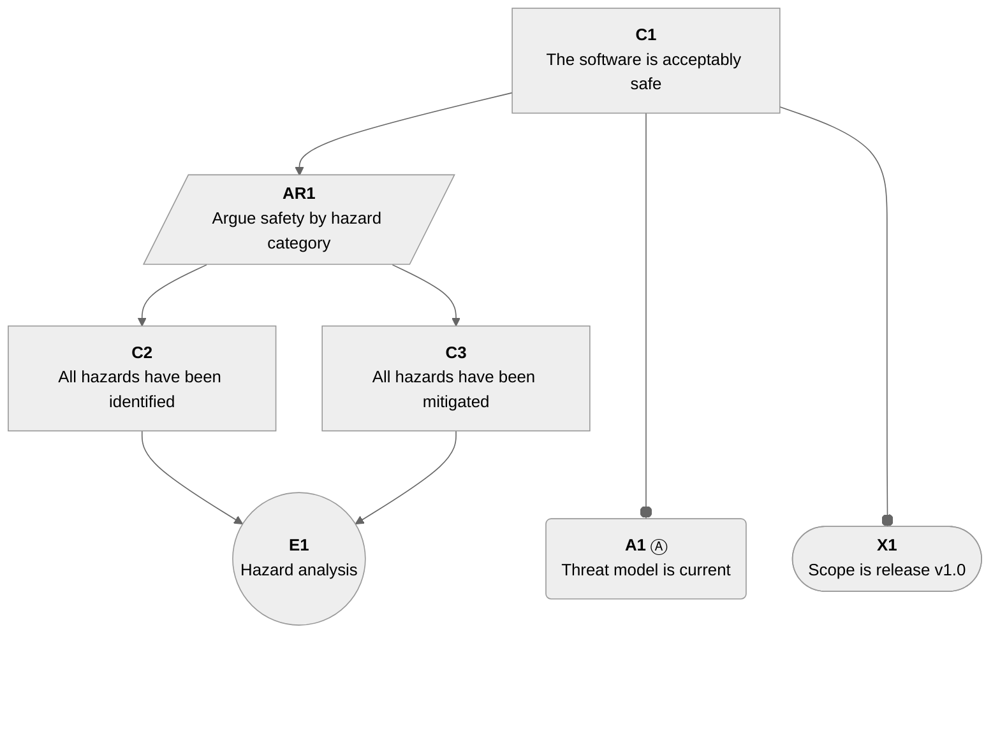

```mermaid
---
config:
  theme: neutral
  flowchart:
    curve: basis
    htmlLabels: true
    rankSpacing: 60
    nodeSpacing: 45
    padding: 15
---
flowchart TD
    classDef invisible opacity:0
    classDef gsnUndev stroke-width:2px,stroke-dasharray: 5 5;
    classDef connector fill:none,stroke:#cccccc,stroke-width:1px;
    C1_L1["<b>C1</b><br>The software is acceptably safe"]
    AR1_L2[/"<b>AR1</b><br>Argue safety by hazard category"/]
    A1_L7("<b>A1</b>&nbsp;Ⓐ<br>Threat model is current")
    X1_L8(["<b>X1</b><br>Scope is release v1.0"])
    C2_L3["<b>C2</b><br>All hazards have been identified"]
    C3_L5["<b>C3</b><br>All hazards have been mitigated"]
    E1_L4(("<b>E1</b><br>Hazard analysis"))
    click C1_L1 "https://github.com/david-a-wheeler/verocase/blob/main/tests/fixtures/simple.gsn.mermaid.expected.md#claim-c1"
    click AR1_L2 "https://github.com/david-a-wheeler/verocase/blob/main/tests/fixtures/simple.gsn.mermaid.expected.md#strategy-ar1"
    click A1_L7 "https://github.com/david-a-wheeler/verocase/blob/main/tests/fixtures/simple.gsn.mermaid.expected.md#assumption-a1"
    click X1_L8 "https://github.com/david-a-wheeler/verocase/blob/main/tests/fixtures/simple.gsn.mermaid.expected.md#context-x1"
    click C2_L3 "https://github.com/david-a-wheeler/verocase/blob/main/tests/fixtures/simple.gsn.mermaid.expected.md#claim-c2"
    click C3_L5 "https://github.com/david-a-wheeler/verocase/blob/main/tests/fixtures/simple.gsn.mermaid.expected.md#claim-c3"
    click E1_L4 "https://github.com/david-a-wheeler/verocase/blob/main/tests/fixtures/simple.gsn.mermaid.expected.md#evidence-e1"

    C1_L1 --> AR1_L2
    AR1_L2 --> C2_L3
    C2_L3 --> E1_L4
    AR1_L2 --> C3_L5
    C3_L5 --> E1_L4
    C1_L1 --o A1_L7
    C1_L1 --o X1_L8
    E1_L4 ~~~ BottomPadding[ ]:::invisible
    A1_L7 ~~~ BottomPadding
    X1_L8 ~~~ BottomPadding
```
