```mermaid
---
config:
  theme: neutral
  flowchart:
    curve: linear
    htmlLabels: true
    rankSpacing: 60
    nodeSpacing: 45
    padding: 15
---
flowchart BT
    classDef invisible opacity:0
    classDef sacmDot fill:#000,stroke:#000
    classDef connector fill:none,stroke:#cccccc,stroke-width:1px;
    classDef abstractClaim stroke-width:2px,stroke-dasharray: 5 5;
    G1["<b>G1</b><br>Statement of G1"]
    Xscope[("<b>Xscope</b>&nbsp;↗<br>Scope of Sys")]
    Asys["<b>Asys</b><br>Assumption of Sys<br>ASSUMED"]
    Esys1[("<b>Esys1</b>&nbsp;↗<br>System-level evidence")]
    SynConnect_00000001((" ")):::connector
    Scomps[/"<b>Scomps</b><br>Argue by component"/]
    Sdecomp[/"<b>Sdecomp</b><br>Decompose by large area"/]
    SynConnect_00000002((" ")):::connector
    C44top[["<b>C44top</b><br>Statement of C44top"]]
    C45top[["<b>C45top</b><br>Statement of C45top"]]
    L1top[["<b>L1top</b><br>Statement of L1top"]]
    SynConnect_00000000((" ")):::connector
    C01top[["<b>C01top</b><br>Statement of C01top"]]
    C02top[["<b>C02top</b><br>Statement of C02top"]]
    C03top[["<b>C03top</b><br>Statement of C03top"]]
    SynConnect_00000003((" ")):::connector
    C41top[["<b>C41top</b><br>Statement of C41top"]]
    C42top[["<b>C42top</b><br>Statement of C42top"]]
    C43top[["<b>C43top</b><br>Statement of C43top"]]
    L2top[["<b>L2top</b><br>Statement of L2top"]]
    L3top[["<b>L3top</b><br>Statement of L3top"]]
    L4top[["<b>L4top</b><br>Statement of L4top"]]
    L5top[["<b>L5top</b><br>Statement of L5top"]]
    C04top[["<b>C04top</b><br>Statement of C04top"]]
    C05top[["<b>C05top</b><br>Statement of C05top"]]
    C06top[["<b>C06top</b><br>Statement of C06top"]]
    SynConnect_00000004((" ")):::connector
    C38top[["<b>C38top</b><br>Statement of C38top"]]
    C39top[["<b>C39top</b><br>Statement of C39top"]]
    C40top[["<b>C40top</b><br>Statement of C40top"]]
    C07top[["<b>C07top</b><br>Statement of C07top"]]
    C08top[["<b>C08top</b><br>Statement of C08top"]]
    C09top[["<b>C09top</b><br>Statement of C09top"]]
    SynConnect_00000005((" ")):::connector
    C35top[["<b>C35top</b><br>Statement of C35top"]]
    C36top[["<b>C36top</b><br>Statement of C36top"]]
    C37top[["<b>C37top</b><br>Statement of C37top"]]
    C10top[["<b>C10top</b><br>Statement of C10top"]]
    C11top[["<b>C11top</b><br>Statement of C11top"]]
    C12top[["<b>C12top</b><br>Statement of C12top"]]
    SynConnect_00000006((" ")):::connector
    C32top[["<b>C32top</b><br>Statement of C32top"]]
    C33top[["<b>C33top</b><br>Statement of C33top"]]
    C34top[["<b>C34top</b><br>Statement of C34top"]]
    C13top[["<b>C13top</b><br>Statement of C13top"]]
    C14top[["<b>C14top</b><br>Statement of C14top"]]
    C15top[["<b>C15top</b><br>Statement of C15top"]]
    SynConnect_00000007((" ")):::connector
    C29top[["<b>C29top</b><br>Statement of C29top"]]
    C30top[["<b>C30top</b><br>Statement of C30top"]]
    C31top[["<b>C31top</b><br>Statement of C31top"]]
    C16top[["<b>C16top</b><br>Statement of C16top"]]
    C17top[["<b>C17top</b><br>Statement of C17top"]]
    C18top[["<b>C18top</b><br>Statement of C18top"]]
    SynConnect_00000008((" ")):::connector
    C26top[["<b>C26top</b><br>Statement of C26top"]]
    C27top[["<b>C27top</b><br>Statement of C27top"]]
    C28top[["<b>C28top</b><br>Statement of C28top"]]
    C19top[["<b>C19top</b><br>Statement of C19top"]]
    C20top[["<b>C20top</b><br>Statement of C20top"]]
    C21top[["<b>C21top</b><br>Statement of C21top"]]
    C22top[["<b>C22top</b><br>Statement of C22top"]]
    C23top[["<b>C23top</b><br>Statement of C23top"]]
    C24top[["<b>C24top</b><br>Statement of C24top"]]
    C25top[["<b>C25top</b><br>Statement of C25top"]]
    Dot1((" ")):::sacmDot
    click G1 "https://github.com/david-a-wheeler/verocase/blob/main/tests/fixtures/stress-test-output.expected.md#claim-g1"
    click Xscope "https://github.com/david-a-wheeler/verocase/blob/main/tests/fixtures/stress-test-output.expected.md#context-xscope"
    click Asys "https://github.com/david-a-wheeler/verocase/blob/main/tests/fixtures/stress-test-output.expected.md#assumption-asys"
    click Esys1 "https://github.com/david-a-wheeler/verocase/blob/main/tests/fixtures/stress-test-output.expected.md#evidence-esys1"
    click Scomps "https://github.com/david-a-wheeler/verocase/blob/main/tests/fixtures/stress-test-output.expected.md#strategy-scomps"
    click Sdecomp "https://github.com/david-a-wheeler/verocase/blob/main/tests/fixtures/stress-test-output.expected.md#strategy-sdecomp"
    click C44top "https://github.com/david-a-wheeler/verocase/blob/main/tests/fixtures/stress-test-output.expected.md#package-c44top"
    click C45top "https://github.com/david-a-wheeler/verocase/blob/main/tests/fixtures/stress-test-output.expected.md#package-c45top"
    click L1top "https://github.com/david-a-wheeler/verocase/blob/main/tests/fixtures/stress-test-output.expected.md#package-l1top"
    click C01top "https://github.com/david-a-wheeler/verocase/blob/main/tests/fixtures/stress-test-output.expected.md#package-c01top"
    click C02top "https://github.com/david-a-wheeler/verocase/blob/main/tests/fixtures/stress-test-output.expected.md#package-c02top"
    click C03top "https://github.com/david-a-wheeler/verocase/blob/main/tests/fixtures/stress-test-output.expected.md#package-c03top"
    click C41top "https://github.com/david-a-wheeler/verocase/blob/main/tests/fixtures/stress-test-output.expected.md#package-c41top"
    click C42top "https://github.com/david-a-wheeler/verocase/blob/main/tests/fixtures/stress-test-output.expected.md#package-c42top"
    click C43top "https://github.com/david-a-wheeler/verocase/blob/main/tests/fixtures/stress-test-output.expected.md#package-c43top"
    click L2top "https://github.com/david-a-wheeler/verocase/blob/main/tests/fixtures/stress-test-output.expected.md#package-l2top"
    click L3top "https://github.com/david-a-wheeler/verocase/blob/main/tests/fixtures/stress-test-output.expected.md#package-l3top"
    click L4top "https://github.com/david-a-wheeler/verocase/blob/main/tests/fixtures/stress-test-output.expected.md#package-l4top"
    click L5top "https://github.com/david-a-wheeler/verocase/blob/main/tests/fixtures/stress-test-output.expected.md#package-l5top"
    click C04top "https://github.com/david-a-wheeler/verocase/blob/main/tests/fixtures/stress-test-output.expected.md#package-c04top"
    click C05top "https://github.com/david-a-wheeler/verocase/blob/main/tests/fixtures/stress-test-output.expected.md#package-c05top"
    click C06top "https://github.com/david-a-wheeler/verocase/blob/main/tests/fixtures/stress-test-output.expected.md#package-c06top"
    click C38top "https://github.com/david-a-wheeler/verocase/blob/main/tests/fixtures/stress-test-output.expected.md#package-c38top"
    click C39top "https://github.com/david-a-wheeler/verocase/blob/main/tests/fixtures/stress-test-output.expected.md#package-c39top"
    click C40top "https://github.com/david-a-wheeler/verocase/blob/main/tests/fixtures/stress-test-output.expected.md#package-c40top"
    click C07top "https://github.com/david-a-wheeler/verocase/blob/main/tests/fixtures/stress-test-output.expected.md#package-c07top"
    click C08top "https://github.com/david-a-wheeler/verocase/blob/main/tests/fixtures/stress-test-output.expected.md#package-c08top"
    click C09top "https://github.com/david-a-wheeler/verocase/blob/main/tests/fixtures/stress-test-output.expected.md#package-c09top"
    click C35top "https://github.com/david-a-wheeler/verocase/blob/main/tests/fixtures/stress-test-output.expected.md#package-c35top"
    click C36top "https://github.com/david-a-wheeler/verocase/blob/main/tests/fixtures/stress-test-output.expected.md#package-c36top"
    click C37top "https://github.com/david-a-wheeler/verocase/blob/main/tests/fixtures/stress-test-output.expected.md#package-c37top"
    click C10top "https://github.com/david-a-wheeler/verocase/blob/main/tests/fixtures/stress-test-output.expected.md#package-c10top"
    click C11top "https://github.com/david-a-wheeler/verocase/blob/main/tests/fixtures/stress-test-output.expected.md#package-c11top"
    click C12top "https://github.com/david-a-wheeler/verocase/blob/main/tests/fixtures/stress-test-output.expected.md#package-c12top"
    click C32top "https://github.com/david-a-wheeler/verocase/blob/main/tests/fixtures/stress-test-output.expected.md#package-c32top"
    click C33top "https://github.com/david-a-wheeler/verocase/blob/main/tests/fixtures/stress-test-output.expected.md#package-c33top"
    click C34top "https://github.com/david-a-wheeler/verocase/blob/main/tests/fixtures/stress-test-output.expected.md#package-c34top"
    click C13top "https://github.com/david-a-wheeler/verocase/blob/main/tests/fixtures/stress-test-output.expected.md#package-c13top"
    click C14top "https://github.com/david-a-wheeler/verocase/blob/main/tests/fixtures/stress-test-output.expected.md#package-c14top"
    click C15top "https://github.com/david-a-wheeler/verocase/blob/main/tests/fixtures/stress-test-output.expected.md#package-c15top"
    click C29top "https://github.com/david-a-wheeler/verocase/blob/main/tests/fixtures/stress-test-output.expected.md#package-c29top"
    click C30top "https://github.com/david-a-wheeler/verocase/blob/main/tests/fixtures/stress-test-output.expected.md#package-c30top"
    click C31top "https://github.com/david-a-wheeler/verocase/blob/main/tests/fixtures/stress-test-output.expected.md#package-c31top"
    click C16top "https://github.com/david-a-wheeler/verocase/blob/main/tests/fixtures/stress-test-output.expected.md#package-c16top"
    click C17top "https://github.com/david-a-wheeler/verocase/blob/main/tests/fixtures/stress-test-output.expected.md#package-c17top"
    click C18top "https://github.com/david-a-wheeler/verocase/blob/main/tests/fixtures/stress-test-output.expected.md#package-c18top"
    click C26top "https://github.com/david-a-wheeler/verocase/blob/main/tests/fixtures/stress-test-output.expected.md#package-c26top"
    click C27top "https://github.com/david-a-wheeler/verocase/blob/main/tests/fixtures/stress-test-output.expected.md#package-c27top"
    click C28top "https://github.com/david-a-wheeler/verocase/blob/main/tests/fixtures/stress-test-output.expected.md#package-c28top"
    click C19top "https://github.com/david-a-wheeler/verocase/blob/main/tests/fixtures/stress-test-output.expected.md#package-c19top"
    click C20top "https://github.com/david-a-wheeler/verocase/blob/main/tests/fixtures/stress-test-output.expected.md#package-c20top"
    click C21top "https://github.com/david-a-wheeler/verocase/blob/main/tests/fixtures/stress-test-output.expected.md#package-c21top"
    click C22top "https://github.com/david-a-wheeler/verocase/blob/main/tests/fixtures/stress-test-output.expected.md#package-c22top"
    click C23top "https://github.com/david-a-wheeler/verocase/blob/main/tests/fixtures/stress-test-output.expected.md#package-c23top"
    click C24top "https://github.com/david-a-wheeler/verocase/blob/main/tests/fixtures/stress-test-output.expected.md#package-c24top"
    click C25top "https://github.com/david-a-wheeler/verocase/blob/main/tests/fixtures/stress-test-output.expected.md#package-c25top"

    BottomPadding[ ]:::invisible ~~~ Xscope
    L2top --- SynConnect_00000000
    L3top --- SynConnect_00000000
    L4top --- SynConnect_00000000
    L5top --- SynConnect_00000000
    Sdecomp --- SynConnect_00000001
    C19top --- SynConnect_00000008
    C20top --- SynConnect_00000008
    C21top --- SynConnect_00000008
    C22top --- SynConnect_00000008
    C23top --- SynConnect_00000008
    C24top --- SynConnect_00000008
    C25top --- SynConnect_00000008
    C16top --- SynConnect_00000007
    C17top --- SynConnect_00000007
    C18top --- SynConnect_00000007
    SynConnect_00000008 --- SynConnect_00000007
    C26top --- SynConnect_00000007
    C27top --- SynConnect_00000007
    C28top --- SynConnect_00000007
    C13top --- SynConnect_00000006
    C14top --- SynConnect_00000006
    C15top --- SynConnect_00000006
    SynConnect_00000007 --- SynConnect_00000006
    C29top --- SynConnect_00000006
    C30top --- SynConnect_00000006
    C31top --- SynConnect_00000006
    C10top --- SynConnect_00000005
    C11top --- SynConnect_00000005
    C12top --- SynConnect_00000005
    SynConnect_00000006 --- SynConnect_00000005
    C32top --- SynConnect_00000005
    C33top --- SynConnect_00000005
    C34top --- SynConnect_00000005
    C07top --- SynConnect_00000004
    C08top --- SynConnect_00000004
    C09top --- SynConnect_00000004
    SynConnect_00000005 --- SynConnect_00000004
    C35top --- SynConnect_00000004
    C36top --- SynConnect_00000004
    C37top --- SynConnect_00000004
    C04top --- SynConnect_00000003
    C05top --- SynConnect_00000003
    C06top --- SynConnect_00000003
    SynConnect_00000004 --- SynConnect_00000003
    C38top --- SynConnect_00000003
    C39top --- SynConnect_00000003
    C40top --- SynConnect_00000003
    C01top --- SynConnect_00000002
    C02top --- SynConnect_00000002
    C03top --- SynConnect_00000002
    SynConnect_00000003 --- SynConnect_00000002
    C41top --- SynConnect_00000002
    C42top --- SynConnect_00000002
    C43top --- SynConnect_00000002
    Asys --- Dot1
    Esys1 --- Dot1
    SynConnect_00000001 --- Dot1
    SynConnect_00000002 --- Dot1
    C44top --- Dot1
    C45top --- Dot1
    Scomps --- Dot1
    Dot1 --> G1
    Xscope --o G1
```

```mermaid
---
config:
  theme: neutral
  flowchart:
    curve: linear
    htmlLabels: true
    rankSpacing: 60
    nodeSpacing: 45
    padding: 15
---
flowchart BT
    classDef invisible opacity:0
    classDef sacmDot fill:#000,stroke:#000
    classDef connector fill:none,stroke:#cccccc,stroke-width:1px;
    classDef abstractClaim stroke-width:2px,stroke-dasharray: 5 5;
    L2top["<b>L2top</b><br>Statement of L2top"]
    L2Xctx[("<b>L2Xctx</b>&nbsp;↗<br>Context of L2Xctx")]
    L2Esh1[("<b>L2Esh1</b>&nbsp;↗<br>Shared evidence A of L2")]
    L2Esh2[("<b>L2Esh2</b>&nbsp;↗<br>Shared evidence B of L2")]
    L2Smain[/"<b>L2Smain</b><br>Main strategy of L2"/]
    L2G2["<b>L2G2</b><br>Level-2 claim of L2"]
    SynConnect_00000000((" ")):::connector
    L2Gbr7["<b>L2Gbr7</b><br>Breadth claim 7 of L2"]
    L2Gbr8["<b>L2Gbr8</b><br>Breadth claim 8 of L2"]
    L2S2[/"<b>L2S2</b><br>Level-3 strategy of L2"/]
    L2G2b["<b>L2G2b</b><br>Level-3 alt claim of L2"]
    C15top[["<b>C15top</b><br>Statement of C15top"]]
    C16top[["<b>C16top</b><br>Statement of C16top"]]
    C17top[["<b>C17top</b><br>Statement of C17top"]]
    SynConnect_00000001((" ")):::connector
    L2Gbr4["<b>L2Gbr4</b><br>Breadth claim 4 of L2"]
    L2Gbr5["<b>L2Gbr5</b><br>Breadth claim 5 of L2"]
    L2Gbr6["<b>L2Gbr6</b><br>Breadth claim 6 of L2"]
    L2Gbr7a["<b>L2Gbr7a</b><br>Sub-claim 7a of L2"]
    L2Gbr7b["<b>L2Gbr7b</b><br>Sub-claim 7b of L2"]
    L2Gbr8a["<b>L2Gbr8a</b><br>Sub-claim 8a of L2"]
    L2Gbr8b["<b>L2Gbr8b</b><br>Sub-claim 8b of L2"]
    L2G3["<b>L2G3</b><br>Level-4 claim of L2"]
    L2G3c["<b>L2G3c</b><br>Level-4 alt claim of L2"]
    L2S2b[/"<b>L2S2b</b><br>Level-4 alt strategy of L2"/]
    C18top[["<b>C18top</b><br>Statement of C18top"]]
    C19top[["<b>C19top</b><br>Statement of C19top"]]
    L2Gbr1["<b>L2Gbr1</b><br>Breadth claim 1 of L2"]
    L2Gbr2["<b>L2Gbr2</b><br>Breadth claim 2 of L2"]
    L2Gbr3["<b>L2Gbr3</b><br>Breadth claim 3 of L2"]
    L2Gbr4a["<b>L2Gbr4a</b><br>Sub-claim 4a of L2"]
    L2Gbr4b["<b>L2Gbr4b</b><br>Sub-claim 4b of L2"]
    L2Gbr5a["<b>L2Gbr5a</b><br>Sub-claim 5a of L2"]
    L2Gbr5b["<b>L2Gbr5b</b><br>Sub-claim 5b of L2"]
    L2Gbr6a["<b>L2Gbr6a</b><br>Sub-claim 6a of L2"]
    L2Gbr6b["<b>L2Gbr6b</b><br>Sub-claim 6b of L2"]
    L2Ebr7[("<b>L2Ebr7</b>&nbsp;↗<br>Evidence for breadth 7 of L2")]
    L2Ebr8[("<b>L2Ebr8</b>&nbsp;↗<br>Evidence for breadth 8 of L2")]
    L2S3[/"<b>L2S3</b><br>Level-5 strategy of L2"/]
    L2G3b["<b>L2G3b</b><br>Level-5 alt claim of L2"]
    L2J1["<b>L2J1</b><br>Justification of L2"]
    L2G3d["<b>L2G3d</b><br>Level-5 claim D of L2"]
    L2G3e["<b>L2G3e</b><br>Level-5 claim E of L2"]
    L2Gbr1a["<b>L2Gbr1a</b><br>Sub-claim 1a of L2"]
    L2Gbr1b["<b>L2Gbr1b</b><br>Sub-claim 1b of L2"]
    L2Gbr2a["<b>L2Gbr2a</b><br>Sub-claim 2a of L2"]
    L2Gbr2b["<b>L2Gbr2b</b><br>Sub-claim 2b of L2"]
    L2Gbr3a["<b>L2Gbr3a</b><br>Sub-claim 3a of L2"]
    L2Gbr3b["<b>L2Gbr3b</b><br>Sub-claim 3b of L2"]
    L2Ebr4[("<b>L2Ebr4</b>&nbsp;↗<br>Evidence for breadth 4 of L2")]
    L2Ebr5[("<b>L2Ebr5</b>&nbsp;↗<br>Evidence for breadth 5 of L2")]
    L2Ebr6[("<b>L2Ebr6</b>&nbsp;↗<br>Evidence for breadth 6 of L2")]
    L2G4["<b>L2G4</b><br>Level-6 claim of L2"]
    L2G4b["<b>L2G4b</b><br>Level-6 alt claim of L2"]
    L2E2[("<b>L2E2</b>&nbsp;↗<br>Extra evidence of L2")]
    L2Ebr1[("<b>L2Ebr1</b>&nbsp;↗<br>Evidence for breadth 1 of L2")]
    L2Ebr2[("<b>L2Ebr2</b>&nbsp;↗<br>Evidence for breadth 2 of L2")]
    L2Ebr3[("<b>L2Ebr3</b>&nbsp;↗<br>Evidence for breadth 3 of L2")]
    L2Edeep[("<b>L2Edeep</b>&nbsp;↗<br>Deep evidence of L2")]
    Dot1((" ")):::sacmDot
    Dot2((" ")):::sacmDot
    Dot3((" ")):::sacmDot
    Dot4((" ")):::sacmDot
    Dot5((" ")):::sacmDot
    Dot6((" ")):::sacmDot
    Dot7((" ")):::sacmDot
    Dot8((" ")):::sacmDot
    Dot9((" ")):::sacmDot
    Dot10((" ")):::sacmDot
    Dot11((" ")):::sacmDot
    Dot12((" ")):::sacmDot
    click L2top "https://github.com/david-a-wheeler/verocase/blob/main/tests/fixtures/stress-test-output.expected.md#claim-l2top"
    click L2Xctx "https://github.com/david-a-wheeler/verocase/blob/main/tests/fixtures/stress-test-output.expected.md#context-l2xctx"
    click L2Esh1 "https://github.com/david-a-wheeler/verocase/blob/main/tests/fixtures/stress-test-output.expected.md#evidence-l2esh1"
    click L2Esh2 "https://github.com/david-a-wheeler/verocase/blob/main/tests/fixtures/stress-test-output.expected.md#evidence-l2esh2"
    click L2Smain "https://github.com/david-a-wheeler/verocase/blob/main/tests/fixtures/stress-test-output.expected.md#strategy-l2smain"
    click L2G2 "https://github.com/david-a-wheeler/verocase/blob/main/tests/fixtures/stress-test-output.expected.md#claim-l2g2"
    click L2Gbr7 "https://github.com/david-a-wheeler/verocase/blob/main/tests/fixtures/stress-test-output.expected.md#claim-l2gbr7"
    click L2Gbr8 "https://github.com/david-a-wheeler/verocase/blob/main/tests/fixtures/stress-test-output.expected.md#claim-l2gbr8"
    click L2S2 "https://github.com/david-a-wheeler/verocase/blob/main/tests/fixtures/stress-test-output.expected.md#strategy-l2s2"
    click L2G2b "https://github.com/david-a-wheeler/verocase/blob/main/tests/fixtures/stress-test-output.expected.md#claim-l2g2b"
    click C15top "https://github.com/david-a-wheeler/verocase/blob/main/tests/fixtures/stress-test-output.expected.md#package-c15top"
    click C16top "https://github.com/david-a-wheeler/verocase/blob/main/tests/fixtures/stress-test-output.expected.md#package-c16top"
    click C17top "https://github.com/david-a-wheeler/verocase/blob/main/tests/fixtures/stress-test-output.expected.md#package-c17top"
    click L2Gbr4 "https://github.com/david-a-wheeler/verocase/blob/main/tests/fixtures/stress-test-output.expected.md#claim-l2gbr4"
    click L2Gbr5 "https://github.com/david-a-wheeler/verocase/blob/main/tests/fixtures/stress-test-output.expected.md#claim-l2gbr5"
    click L2Gbr6 "https://github.com/david-a-wheeler/verocase/blob/main/tests/fixtures/stress-test-output.expected.md#claim-l2gbr6"
    click L2Gbr7a "https://github.com/david-a-wheeler/verocase/blob/main/tests/fixtures/stress-test-output.expected.md#claim-l2gbr7a"
    click L2Gbr7b "https://github.com/david-a-wheeler/verocase/blob/main/tests/fixtures/stress-test-output.expected.md#claim-l2gbr7b"
    click L2Gbr8a "https://github.com/david-a-wheeler/verocase/blob/main/tests/fixtures/stress-test-output.expected.md#claim-l2gbr8a"
    click L2Gbr8b "https://github.com/david-a-wheeler/verocase/blob/main/tests/fixtures/stress-test-output.expected.md#claim-l2gbr8b"
    click L2G3 "https://github.com/david-a-wheeler/verocase/blob/main/tests/fixtures/stress-test-output.expected.md#claim-l2g3"
    click L2G3c "https://github.com/david-a-wheeler/verocase/blob/main/tests/fixtures/stress-test-output.expected.md#claim-l2g3c"
    click L2S2b "https://github.com/david-a-wheeler/verocase/blob/main/tests/fixtures/stress-test-output.expected.md#strategy-l2s2b"
    click C18top "https://github.com/david-a-wheeler/verocase/blob/main/tests/fixtures/stress-test-output.expected.md#package-c18top"
    click C19top "https://github.com/david-a-wheeler/verocase/blob/main/tests/fixtures/stress-test-output.expected.md#package-c19top"
    click L2Gbr1 "https://github.com/david-a-wheeler/verocase/blob/main/tests/fixtures/stress-test-output.expected.md#claim-l2gbr1"
    click L2Gbr2 "https://github.com/david-a-wheeler/verocase/blob/main/tests/fixtures/stress-test-output.expected.md#claim-l2gbr2"
    click L2Gbr3 "https://github.com/david-a-wheeler/verocase/blob/main/tests/fixtures/stress-test-output.expected.md#claim-l2gbr3"
    click L2Gbr4a "https://github.com/david-a-wheeler/verocase/blob/main/tests/fixtures/stress-test-output.expected.md#claim-l2gbr4a"
    click L2Gbr4b "https://github.com/david-a-wheeler/verocase/blob/main/tests/fixtures/stress-test-output.expected.md#claim-l2gbr4b"
    click L2Gbr5a "https://github.com/david-a-wheeler/verocase/blob/main/tests/fixtures/stress-test-output.expected.md#claim-l2gbr5a"
    click L2Gbr5b "https://github.com/david-a-wheeler/verocase/blob/main/tests/fixtures/stress-test-output.expected.md#claim-l2gbr5b"
    click L2Gbr6a "https://github.com/david-a-wheeler/verocase/blob/main/tests/fixtures/stress-test-output.expected.md#claim-l2gbr6a"
    click L2Gbr6b "https://github.com/david-a-wheeler/verocase/blob/main/tests/fixtures/stress-test-output.expected.md#claim-l2gbr6b"
    click L2Ebr7 "https://github.com/david-a-wheeler/verocase/blob/main/tests/fixtures/stress-test-output.expected.md#evidence-l2ebr7"
    click L2Ebr8 "https://github.com/david-a-wheeler/verocase/blob/main/tests/fixtures/stress-test-output.expected.md#evidence-l2ebr8"
    click L2S3 "https://github.com/david-a-wheeler/verocase/blob/main/tests/fixtures/stress-test-output.expected.md#strategy-l2s3"
    click L2G3b "https://github.com/david-a-wheeler/verocase/blob/main/tests/fixtures/stress-test-output.expected.md#claim-l2g3b"
    click L2J1 "https://github.com/david-a-wheeler/verocase/blob/main/tests/fixtures/stress-test-output.expected.md#justification-l2j1"
    click L2G3d "https://github.com/david-a-wheeler/verocase/blob/main/tests/fixtures/stress-test-output.expected.md#claim-l2g3d"
    click L2G3e "https://github.com/david-a-wheeler/verocase/blob/main/tests/fixtures/stress-test-output.expected.md#claim-l2g3e"
    click L2Gbr1a "https://github.com/david-a-wheeler/verocase/blob/main/tests/fixtures/stress-test-output.expected.md#claim-l2gbr1a"
    click L2Gbr1b "https://github.com/david-a-wheeler/verocase/blob/main/tests/fixtures/stress-test-output.expected.md#claim-l2gbr1b"
    click L2Gbr2a "https://github.com/david-a-wheeler/verocase/blob/main/tests/fixtures/stress-test-output.expected.md#claim-l2gbr2a"
    click L2Gbr2b "https://github.com/david-a-wheeler/verocase/blob/main/tests/fixtures/stress-test-output.expected.md#claim-l2gbr2b"
    click L2Gbr3a "https://github.com/david-a-wheeler/verocase/blob/main/tests/fixtures/stress-test-output.expected.md#claim-l2gbr3a"
    click L2Gbr3b "https://github.com/david-a-wheeler/verocase/blob/main/tests/fixtures/stress-test-output.expected.md#claim-l2gbr3b"
    click L2Ebr4 "https://github.com/david-a-wheeler/verocase/blob/main/tests/fixtures/stress-test-output.expected.md#evidence-l2ebr4"
    click L2Ebr5 "https://github.com/david-a-wheeler/verocase/blob/main/tests/fixtures/stress-test-output.expected.md#evidence-l2ebr5"
    click L2Ebr6 "https://github.com/david-a-wheeler/verocase/blob/main/tests/fixtures/stress-test-output.expected.md#evidence-l2ebr6"
    click L2G4 "https://github.com/david-a-wheeler/verocase/blob/main/tests/fixtures/stress-test-output.expected.md#claim-l2g4"
    click L2G4b "https://github.com/david-a-wheeler/verocase/blob/main/tests/fixtures/stress-test-output.expected.md#claim-l2g4b"
    click L2E2 "https://github.com/david-a-wheeler/verocase/blob/main/tests/fixtures/stress-test-output.expected.md#evidence-l2e2"
    click L2Ebr1 "https://github.com/david-a-wheeler/verocase/blob/main/tests/fixtures/stress-test-output.expected.md#evidence-l2ebr1"
    click L2Ebr2 "https://github.com/david-a-wheeler/verocase/blob/main/tests/fixtures/stress-test-output.expected.md#evidence-l2ebr2"
    click L2Ebr3 "https://github.com/david-a-wheeler/verocase/blob/main/tests/fixtures/stress-test-output.expected.md#evidence-l2ebr3"
    click L2Edeep "https://github.com/david-a-wheeler/verocase/blob/main/tests/fixtures/stress-test-output.expected.md#evidence-l2edeep"

    BottomPadding[ ]:::invisible ~~~ L2Xctx
    L2Edeep --> L2G4
    L2G4 --- Dot1
    L2G4b --- Dot1
    L2S3 --- Dot1
    L2G3b --- Dot1
    Dot1 --> L2G3
    L2J1 --> L2G3c
    L2E2 --> L2G3e
    L2G3d --- Dot2
    L2G3e --- Dot2
    L2S2b --- Dot2
    Dot2 --> L2G2b
    L2G3 --- Dot3
    L2G3c --- Dot3
    L2S2 --- Dot3
    L2G2b --- Dot3
    Dot3 --> L2G2
    L2Ebr1 --> L2Gbr1a
    L2Gbr1a --- Dot4
    L2Gbr1b --- Dot4
    Dot4 --> L2Gbr1
    L2Ebr2 --> L2Gbr2a
    L2Gbr2a --- Dot5
    L2Gbr2b --- Dot5
    Dot5 --> L2Gbr2
    L2Ebr3 --> L2Gbr3a
    L2Gbr3a --- Dot6
    L2Gbr3b --- Dot6
    Dot6 --> L2Gbr3
    C18top --- SynConnect_00000001
    C19top --- SynConnect_00000001
    L2Gbr1 --- SynConnect_00000001
    L2Gbr2 --- SynConnect_00000001
    L2Gbr3 --- SynConnect_00000001
    L2Ebr4 --> L2Gbr4a
    L2Gbr4a --- Dot7
    L2Gbr4b --- Dot7
    Dot7 --> L2Gbr4
    L2Ebr5 --> L2Gbr5a
    L2Gbr5a --- Dot8
    L2Gbr5b --- Dot8
    Dot8 --> L2Gbr5
    L2Ebr6 --> L2Gbr6a
    L2Gbr6a --- Dot9
    L2Gbr6b --- Dot9
    Dot9 --> L2Gbr6
    C15top --- SynConnect_00000000
    C16top --- SynConnect_00000000
    C17top --- SynConnect_00000000
    SynConnect_00000001 --- SynConnect_00000000
    L2Gbr4 --- SynConnect_00000000
    L2Gbr5 --- SynConnect_00000000
    L2Gbr6 --- SynConnect_00000000
    L2Ebr7 --> L2Gbr7a
    L2Gbr7a --- Dot10
    L2Gbr7b --- Dot10
    Dot10 --> L2Gbr7
    L2Ebr8 --> L2Gbr8a
    L2Gbr8a --- Dot11
    L2Gbr8b --- Dot11
    Dot11 --> L2Gbr8
    L2Esh1 --- Dot12
    L2Esh2 --- Dot12
    L2G2 --- Dot12
    SynConnect_00000000 --- Dot12
    L2Gbr7 --- Dot12
    L2Gbr8 --- Dot12
    L2Smain --- Dot12
    Dot12 --> L2top
    L2Xctx --o L2top
```

```mermaid
---
config:
  theme: neutral
  flowchart:
    curve: linear
    htmlLabels: true
    rankSpacing: 60
    nodeSpacing: 45
    padding: 15
---
flowchart BT
    classDef invisible opacity:0
    classDef sacmDot fill:#000,stroke:#000
    classDef connector fill:none,stroke:#cccccc,stroke-width:1px;
    classDef abstractClaim stroke-width:2px,stroke-dasharray: 5 5;
    C02top["<b>C02top</b><br>Statement of C02top"]
    C03top[["<b>C03top</b><br>Statement of C03top"]]
    C02Xctx[("<b>C02Xctx</b>&nbsp;↗<br>Context of C02Xctx")]
    C02Esh[("<b>C02Esh</b>&nbsp;↗<br>Shared evidence of C02")]
    C02Sass[/"<b>C02Sass</b><br>Assertion strategy of C02"/]
    C02G1["<b>C02G1</b><br>Sub-claim 1 of C02"]
    C02G2["<b>C02G2</b><br>Sub-claim 2 of C02"]
    C02G3["<b>C02G3</b><br>Sub-claim 3 of C02"]
    C02E1[("<b>C02E1</b>&nbsp;↗<br>Evidence 1 of C02")]
    C02J1["<b>C02J1</b><br>Justification of C02"]
    C02A1["<b>C02A1</b><br>Assumption of C02<br>ASSUMED"]
    C02E2[("<b>C02E2</b>&nbsp;↗<br>Evidence 2 of C02")]
    Dot1((" ")):::sacmDot
    Dot2((" ")):::sacmDot
    click C02top "https://github.com/david-a-wheeler/verocase/blob/main/tests/fixtures/stress-test-output.expected.md#claim-c02top"
    click C03top "https://github.com/david-a-wheeler/verocase/blob/main/tests/fixtures/stress-test-output.expected.md#package-c03top"
    click C02Xctx "https://github.com/david-a-wheeler/verocase/blob/main/tests/fixtures/stress-test-output.expected.md#context-c02xctx"
    click C02Esh "https://github.com/david-a-wheeler/verocase/blob/main/tests/fixtures/stress-test-output.expected.md#evidence-c02esh"
    click C02Sass "https://github.com/david-a-wheeler/verocase/blob/main/tests/fixtures/stress-test-output.expected.md#strategy-c02sass"
    click C02G1 "https://github.com/david-a-wheeler/verocase/blob/main/tests/fixtures/stress-test-output.expected.md#claim-c02g1"
    click C02G2 "https://github.com/david-a-wheeler/verocase/blob/main/tests/fixtures/stress-test-output.expected.md#claim-c02g2"
    click C02G3 "https://github.com/david-a-wheeler/verocase/blob/main/tests/fixtures/stress-test-output.expected.md#claim-c02g3"
    click C02E1 "https://github.com/david-a-wheeler/verocase/blob/main/tests/fixtures/stress-test-output.expected.md#evidence-c02e1"
    click C02J1 "https://github.com/david-a-wheeler/verocase/blob/main/tests/fixtures/stress-test-output.expected.md#justification-c02j1"
    click C02A1 "https://github.com/david-a-wheeler/verocase/blob/main/tests/fixtures/stress-test-output.expected.md#assumption-c02a1"
    click C02E2 "https://github.com/david-a-wheeler/verocase/blob/main/tests/fixtures/stress-test-output.expected.md#evidence-c02e2"

    BottomPadding[ ]:::invisible ~~~ C03top
    C02E1 --> C02G1
    C02J1 --> C02G2
    C02A1 --- Dot1
    C02E2 --- Dot1
    Dot1 --> C02G3
    C03top --- Dot2
    C02Esh --- Dot2
    C02G1 --- Dot2
    C02G2 --- Dot2
    C02G3 --- Dot2
    C02Sass --- Dot2
    Dot2 --> C02top
    C02Xctx --o C02top
```

```mermaid
---
config:
  theme: neutral
  flowchart:
    curve: linear
    htmlLabels: true
    rankSpacing: 60
    nodeSpacing: 45
    padding: 15
---
flowchart BT
    classDef invisible opacity:0
    classDef sacmDot fill:#000,stroke:#000
    classDef connector fill:none,stroke:#cccccc,stroke-width:1px;
    classDef abstractClaim stroke-width:2px,stroke-dasharray: 5 5;
    C06top["<b>C06top</b><br>Statement of C06top"]
    C07top[["<b>C07top</b><br>Statement of C07top"]]
    C06Xctx[("<b>C06Xctx</b>&nbsp;↗<br>Context of C06Xctx")]
    C06Esh[("<b>C06Esh</b>&nbsp;↗<br>Shared evidence of C06")]
    C06Sass[/"<b>C06Sass</b><br>Assertion strategy of C06"/]
    C06G1["<b>C06G1</b><br>Sub-claim 1 of C06"]
    C06G2["<b>C06G2</b><br>Sub-claim 2 of C06"]
    C06G3["<b>C06G3</b><br>Sub-claim 3 of C06"]
    C06E1[("<b>C06E1</b>&nbsp;↗<br>Evidence 1 of C06")]
    C06J1["<b>C06J1</b><br>Justification of C06"]
    C06A1["<b>C06A1</b><br>Assumption of C06<br>ASSUMED"]
    C06E2[("<b>C06E2</b>&nbsp;↗<br>Evidence 2 of C06")]
    Dot1((" ")):::sacmDot
    Dot2((" ")):::sacmDot
    click C06top "https://github.com/david-a-wheeler/verocase/blob/main/tests/fixtures/stress-test-output.expected.md#claim-c06top"
    click C07top "https://github.com/david-a-wheeler/verocase/blob/main/tests/fixtures/stress-test-output.expected.md#package-c07top"
    click C06Xctx "https://github.com/david-a-wheeler/verocase/blob/main/tests/fixtures/stress-test-output.expected.md#context-c06xctx"
    click C06Esh "https://github.com/david-a-wheeler/verocase/blob/main/tests/fixtures/stress-test-output.expected.md#evidence-c06esh"
    click C06Sass "https://github.com/david-a-wheeler/verocase/blob/main/tests/fixtures/stress-test-output.expected.md#strategy-c06sass"
    click C06G1 "https://github.com/david-a-wheeler/verocase/blob/main/tests/fixtures/stress-test-output.expected.md#claim-c06g1"
    click C06G2 "https://github.com/david-a-wheeler/verocase/blob/main/tests/fixtures/stress-test-output.expected.md#claim-c06g2"
    click C06G3 "https://github.com/david-a-wheeler/verocase/blob/main/tests/fixtures/stress-test-output.expected.md#claim-c06g3"
    click C06E1 "https://github.com/david-a-wheeler/verocase/blob/main/tests/fixtures/stress-test-output.expected.md#evidence-c06e1"
    click C06J1 "https://github.com/david-a-wheeler/verocase/blob/main/tests/fixtures/stress-test-output.expected.md#justification-c06j1"
    click C06A1 "https://github.com/david-a-wheeler/verocase/blob/main/tests/fixtures/stress-test-output.expected.md#assumption-c06a1"
    click C06E2 "https://github.com/david-a-wheeler/verocase/blob/main/tests/fixtures/stress-test-output.expected.md#evidence-c06e2"

    BottomPadding[ ]:::invisible ~~~ C07top
    C06E1 --> C06G1
    C06J1 --> C06G2
    C06A1 --- Dot1
    C06E2 --- Dot1
    Dot1 --> C06G3
    C07top --- Dot2
    C06Esh --- Dot2
    C06G1 --- Dot2
    C06G2 --- Dot2
    C06G3 --- Dot2
    C06Sass --- Dot2
    Dot2 --> C06top
    C06Xctx --o C06top
```

```mermaid
---
config:
  theme: neutral
  flowchart:
    curve: linear
    htmlLabels: true
    rankSpacing: 60
    nodeSpacing: 45
    padding: 15
---
flowchart BT
    classDef invisible opacity:0
    classDef sacmDot fill:#000,stroke:#000
    classDef connector fill:none,stroke:#cccccc,stroke-width:1px;
    classDef abstractClaim stroke-width:2px,stroke-dasharray: 5 5;
    C12top["<b>C12top</b><br>Statement of C12top"]
    C12Xctx[("<b>C12Xctx</b>&nbsp;↗<br>Context of C12Xctx")]
    C12Esh[("<b>C12Esh</b>&nbsp;↗<br>Shared evidence of C12")]
    C12Sass[/"<b>C12Sass</b><br>Assertion strategy of C12"/]
    C12G1["<b>C12G1</b><br>Sub-claim 1 of C12"]
    C12G2["<b>C12G2</b><br>Sub-claim 2 of C12"]
    C12G3["<b>C12G3</b><br>Sub-claim 3 of C12"]
    C12E1[("<b>C12E1</b>&nbsp;↗<br>Evidence 1 of C12")]
    C12J1["<b>C12J1</b><br>Justification of C12"]
    C12A1["<b>C12A1</b><br>Assumption of C12<br>ASSUMED"]
    C12E2[("<b>C12E2</b>&nbsp;↗<br>Evidence 2 of C12")]
    Dot1((" ")):::sacmDot
    Dot2((" ")):::sacmDot
    click C12top "https://github.com/david-a-wheeler/verocase/blob/main/tests/fixtures/stress-test-output.expected.md#claim-c12top"
    click C12Xctx "https://github.com/david-a-wheeler/verocase/blob/main/tests/fixtures/stress-test-output.expected.md#context-c12xctx"
    click C12Esh "https://github.com/david-a-wheeler/verocase/blob/main/tests/fixtures/stress-test-output.expected.md#evidence-c12esh"
    click C12Sass "https://github.com/david-a-wheeler/verocase/blob/main/tests/fixtures/stress-test-output.expected.md#strategy-c12sass"
    click C12G1 "https://github.com/david-a-wheeler/verocase/blob/main/tests/fixtures/stress-test-output.expected.md#claim-c12g1"
    click C12G2 "https://github.com/david-a-wheeler/verocase/blob/main/tests/fixtures/stress-test-output.expected.md#claim-c12g2"
    click C12G3 "https://github.com/david-a-wheeler/verocase/blob/main/tests/fixtures/stress-test-output.expected.md#claim-c12g3"
    click C12E1 "https://github.com/david-a-wheeler/verocase/blob/main/tests/fixtures/stress-test-output.expected.md#evidence-c12e1"
    click C12J1 "https://github.com/david-a-wheeler/verocase/blob/main/tests/fixtures/stress-test-output.expected.md#justification-c12j1"
    click C12A1 "https://github.com/david-a-wheeler/verocase/blob/main/tests/fixtures/stress-test-output.expected.md#assumption-c12a1"
    click C12E2 "https://github.com/david-a-wheeler/verocase/blob/main/tests/fixtures/stress-test-output.expected.md#evidence-c12e2"

    BottomPadding[ ]:::invisible ~~~ C12Xctx
    C12E1 --> C12G1
    C12J1 --> C12G2
    C12A1 --- Dot1
    C12E2 --- Dot1
    Dot1 --> C12G3
    C12Esh --- Dot2
    C12G1 --- Dot2
    C12G2 --- Dot2
    C12G3 --- Dot2
    C12Sass --- Dot2
    Dot2 --> C12top
    C12Xctx --o C12top
```

# Stress Test Assurance Case

This document exercises a large assurance case with many packages and elements.

## SACM/Mermaid View

<!-- verocase sacm/mermaid * -->
### Package G1


### Package L1top


### Package L2top


### Package L3top


### Package L4top


### Package L5top


### Package C01top


### Package C02top


### Package C03top


### Package C04top


### Package C05top


### Package C06top


### Package C07top


### Package C08top


### Package C09top


### Package C10top


### Package C11top


### Package C12top


### Package C13top


### Package C14top


### Package C15top
```mermaid
---
config:
  theme: neutral
  flowchart:
    curve: linear
    htmlLabels: true
    rankSpacing: 60
    nodeSpacing: 45
    padding: 15
---
flowchart BT
    classDef invisible opacity:0
    classDef sacmDot fill:#000,stroke:#000
    classDef connector fill:none,stroke:#cccccc,stroke-width:1px;
    classDef abstractClaim stroke-width:2px,stroke-dasharray: 5 5;
    C15top_L683["<b>C15top</b><br>Statement of C15top"]
    C15Xctx_L684[("<b>C15Xctx</b>&nbsp;↗<br>Context of C15Xctx")]
    C15Esh_L685[("<b>C15Esh</b>&nbsp;↗<br>Shared evidence of C15")]
    C15Sass_L686[/"<b>C15Sass</b><br>Assertion strategy of C15"/]
    C15G1_L687["<b>C15G1</b><br>Sub-claim 1 of C15"]
    C15G2_L690["<b>C15G2</b><br>Sub-claim 2 of C15"]
    C15G3_L693["<b>C15G3</b><br>Sub-claim 3 of C15"]
    C15E1_L688[("<b>C15E1</b>&nbsp;↗<br>Evidence 1 of C15")]
    C15J1_L691["<b>C15J1</b><br>Justification of C15"]
    C15A1_L694["<b>C15A1</b><br>Assumption of C15<br>ASSUMED"]
    C15E2_L695[("<b>C15E2</b>&nbsp;↗<br>Evidence 2 of C15")]
    Dot1((" ")):::sacmDot
    Dot2((" ")):::sacmDot
    click C15top_L683 "https://github.com/david-a-wheeler/verocase/blob/main/tests/fixtures/stress-test-output.expected.md#claim-c15top"
    click C15Xctx_L684 "https://github.com/david-a-wheeler/verocase/blob/main/tests/fixtures/stress-test-output.expected.md#context-c15xctx"
    click C15Esh_L685 "https://github.com/david-a-wheeler/verocase/blob/main/tests/fixtures/stress-test-output.expected.md#evidence-c15esh"
    click C15Sass_L686 "https://github.com/david-a-wheeler/verocase/blob/main/tests/fixtures/stress-test-output.expected.md#strategy-c15sass"
    click C15G1_L687 "https://github.com/david-a-wheeler/verocase/blob/main/tests/fixtures/stress-test-output.expected.md#claim-c15g1"
    click C15G2_L690 "https://github.com/david-a-wheeler/verocase/blob/main/tests/fixtures/stress-test-output.expected.md#claim-c15g2"
    click C15G3_L693 "https://github.com/david-a-wheeler/verocase/blob/main/tests/fixtures/stress-test-output.expected.md#claim-c15g3"
    click C15E1_L688 "https://github.com/david-a-wheeler/verocase/blob/main/tests/fixtures/stress-test-output.expected.md#evidence-c15e1"
    click C15J1_L691 "https://github.com/david-a-wheeler/verocase/blob/main/tests/fixtures/stress-test-output.expected.md#justification-c15j1"
    click C15A1_L694 "https://github.com/david-a-wheeler/verocase/blob/main/tests/fixtures/stress-test-output.expected.md#assumption-c15a1"
    click C15E2_L695 "https://github.com/david-a-wheeler/verocase/blob/main/tests/fixtures/stress-test-output.expected.md#evidence-c15e2"

    BottomPadding[ ]:::invisible ~~~ C15Xctx_L684
    C15E1_L688 --> C15G1_L687
    C15J1_L691 --> C15G2_L690
    C15A1_L694 --- Dot1
    C15E2_L695 --- Dot1
    Dot1 --> C15G3_L693
    C15Esh_L685 --- Dot2
    C15G1_L687 --- Dot2
    C15G2_L690 --- Dot2
    C15G3_L693 --- Dot2
    C15Sass_L686 --- Dot2
    Dot2 --> C15top_L683
    C15Xctx_L684 --o C15top_L683
```

### Package C16top
```mermaid
---
config:
  theme: neutral
  flowchart:
    curve: linear
    htmlLabels: true
    rankSpacing: 60
    nodeSpacing: 45
    padding: 15
---
flowchart BT
    classDef invisible opacity:0
    classDef sacmDot fill:#000,stroke:#000
    classDef connector fill:none,stroke:#cccccc,stroke-width:1px;
    classDef abstractClaim stroke-width:2px,stroke-dasharray: 5 5;
    C16top_L698["<b>C16top</b><br>Statement of C16top"]
    C16Xctx_L699[("<b>C16Xctx</b>&nbsp;↗<br>Context of C16Xctx")]
    C16Esh_L700[("<b>C16Esh</b>&nbsp;↗<br>Shared evidence of C16")]
    C16Sass_L701[/"<b>C16Sass</b><br>Assertion strategy of C16"/]
    C16G1_L702["<b>C16G1</b><br>Sub-claim 1 of C16"]
    C16G2_L705["<b>C16G2</b><br>Sub-claim 2 of C16"]
    C16G3_L708["<b>C16G3</b><br>Sub-claim 3 of C16"]
    C16E1_L703[("<b>C16E1</b>&nbsp;↗<br>Evidence 1 of C16")]
    C16J1_L706["<b>C16J1</b><br>Justification of C16"]
    C16A1_L709["<b>C16A1</b><br>Assumption of C16<br>ASSUMED"]
    C16E2_L710[("<b>C16E2</b>&nbsp;↗<br>Evidence 2 of C16")]
    Dot1((" ")):::sacmDot
    Dot2((" ")):::sacmDot
    click C16top_L698 "https://github.com/david-a-wheeler/verocase/blob/main/tests/fixtures/stress-test-output.expected.md#claim-c16top"
    click C16Xctx_L699 "https://github.com/david-a-wheeler/verocase/blob/main/tests/fixtures/stress-test-output.expected.md#context-c16xctx"
    click C16Esh_L700 "https://github.com/david-a-wheeler/verocase/blob/main/tests/fixtures/stress-test-output.expected.md#evidence-c16esh"
    click C16Sass_L701 "https://github.com/david-a-wheeler/verocase/blob/main/tests/fixtures/stress-test-output.expected.md#strategy-c16sass"
    click C16G1_L702 "https://github.com/david-a-wheeler/verocase/blob/main/tests/fixtures/stress-test-output.expected.md#claim-c16g1"
    click C16G2_L705 "https://github.com/david-a-wheeler/verocase/blob/main/tests/fixtures/stress-test-output.expected.md#claim-c16g2"
    click C16G3_L708 "https://github.com/david-a-wheeler/verocase/blob/main/tests/fixtures/stress-test-output.expected.md#claim-c16g3"
    click C16E1_L703 "https://github.com/david-a-wheeler/verocase/blob/main/tests/fixtures/stress-test-output.expected.md#evidence-c16e1"
    click C16J1_L706 "https://github.com/david-a-wheeler/verocase/blob/main/tests/fixtures/stress-test-output.expected.md#justification-c16j1"
    click C16A1_L709 "https://github.com/david-a-wheeler/verocase/blob/main/tests/fixtures/stress-test-output.expected.md#assumption-c16a1"
    click C16E2_L710 "https://github.com/david-a-wheeler/verocase/blob/main/tests/fixtures/stress-test-output.expected.md#evidence-c16e2"

    BottomPadding[ ]:::invisible ~~~ C16Xctx_L699
    C16E1_L703 --> C16G1_L702
    C16J1_L706 --> C16G2_L705
    C16A1_L709 --- Dot1
    C16E2_L710 --- Dot1
    Dot1 --> C16G3_L708
    C16Esh_L700 --- Dot2
    C16G1_L702 --- Dot2
    C16G2_L705 --- Dot2
    C16G3_L708 --- Dot2
    C16Sass_L701 --- Dot2
    Dot2 --> C16top_L698
    C16Xctx_L699 --o C16top_L698
```

### Package C17top
```mermaid
---
config:
  theme: neutral
  flowchart:
    curve: linear
    htmlLabels: true
    rankSpacing: 60
    nodeSpacing: 45
    padding: 15
---
flowchart BT
    classDef invisible opacity:0
    classDef sacmDot fill:#000,stroke:#000
    classDef connector fill:none,stroke:#cccccc,stroke-width:1px;
    classDef abstractClaim stroke-width:2px,stroke-dasharray: 5 5;
    C17top_L713["<b>C17top</b><br>Statement of C17top"]
    C17Xctx_L714[("<b>C17Xctx</b>&nbsp;↗<br>Context of C17Xctx")]
    C17Esh_L715[("<b>C17Esh</b>&nbsp;↗<br>Shared evidence of C17")]
    C17Sass_L716[/"<b>C17Sass</b><br>Assertion strategy of C17"/]
    C17G1_L717["<b>C17G1</b><br>Sub-claim 1 of C17"]
    C17G2_L720["<b>C17G2</b><br>Sub-claim 2 of C17"]
    C17G3_L723["<b>C17G3</b><br>Sub-claim 3 of C17"]
    C17E1_L718[("<b>C17E1</b>&nbsp;↗<br>Evidence 1 of C17")]
    C17J1_L721["<b>C17J1</b><br>Justification of C17"]
    C17A1_L724["<b>C17A1</b><br>Assumption of C17<br>ASSUMED"]
    C17E2_L725[("<b>C17E2</b>&nbsp;↗<br>Evidence 2 of C17")]
    Dot1((" ")):::sacmDot
    Dot2((" ")):::sacmDot
    click C17top_L713 "https://github.com/david-a-wheeler/verocase/blob/main/tests/fixtures/stress-test-output.expected.md#claim-c17top"
    click C17Xctx_L714 "https://github.com/david-a-wheeler/verocase/blob/main/tests/fixtures/stress-test-output.expected.md#context-c17xctx"
    click C17Esh_L715 "https://github.com/david-a-wheeler/verocase/blob/main/tests/fixtures/stress-test-output.expected.md#evidence-c17esh"
    click C17Sass_L716 "https://github.com/david-a-wheeler/verocase/blob/main/tests/fixtures/stress-test-output.expected.md#strategy-c17sass"
    click C17G1_L717 "https://github.com/david-a-wheeler/verocase/blob/main/tests/fixtures/stress-test-output.expected.md#claim-c17g1"
    click C17G2_L720 "https://github.com/david-a-wheeler/verocase/blob/main/tests/fixtures/stress-test-output.expected.md#claim-c17g2"
    click C17G3_L723 "https://github.com/david-a-wheeler/verocase/blob/main/tests/fixtures/stress-test-output.expected.md#claim-c17g3"
    click C17E1_L718 "https://github.com/david-a-wheeler/verocase/blob/main/tests/fixtures/stress-test-output.expected.md#evidence-c17e1"
    click C17J1_L721 "https://github.com/david-a-wheeler/verocase/blob/main/tests/fixtures/stress-test-output.expected.md#justification-c17j1"
    click C17A1_L724 "https://github.com/david-a-wheeler/verocase/blob/main/tests/fixtures/stress-test-output.expected.md#assumption-c17a1"
    click C17E2_L725 "https://github.com/david-a-wheeler/verocase/blob/main/tests/fixtures/stress-test-output.expected.md#evidence-c17e2"

    BottomPadding[ ]:::invisible ~~~ C17Xctx_L714
    C17E1_L718 --> C17G1_L717
    C17J1_L721 --> C17G2_L720
    C17A1_L724 --- Dot1
    C17E2_L725 --- Dot1
    Dot1 --> C17G3_L723
    C17Esh_L715 --- Dot2
    C17G1_L717 --- Dot2
    C17G2_L720 --- Dot2
    C17G3_L723 --- Dot2
    C17Sass_L716 --- Dot2
    Dot2 --> C17top_L713
    C17Xctx_L714 --o C17top_L713
```

### Package C18top
```mermaid
---
config:
  theme: neutral
  flowchart:
    curve: linear
    htmlLabels: true
    rankSpacing: 60
    nodeSpacing: 45
    padding: 15
---
flowchart BT
    classDef invisible opacity:0
    classDef sacmDot fill:#000,stroke:#000
    classDef connector fill:none,stroke:#cccccc,stroke-width:1px;
    classDef abstractClaim stroke-width:2px,stroke-dasharray: 5 5;
    C18top_L728["<b>C18top</b><br>Statement of C18top"]
    C18Xctx_L729[("<b>C18Xctx</b>&nbsp;↗<br>Context of C18Xctx")]
    C18Esh_L730[("<b>C18Esh</b>&nbsp;↗<br>Shared evidence of C18")]
    C18Sass_L731[/"<b>C18Sass</b><br>Assertion strategy of C18"/]
    C18G1_L732["<b>C18G1</b><br>Sub-claim 1 of C18"]
    C18G2_L735["<b>C18G2</b><br>Sub-claim 2 of C18"]
    C18G3_L738["<b>C18G3</b><br>Sub-claim 3 of C18"]
    C18E1_L733[("<b>C18E1</b>&nbsp;↗<br>Evidence 1 of C18")]
    C18J1_L736["<b>C18J1</b><br>Justification of C18"]
    C18A1_L739["<b>C18A1</b><br>Assumption of C18<br>ASSUMED"]
    C18E2_L740[("<b>C18E2</b>&nbsp;↗<br>Evidence 2 of C18")]
    Dot1((" ")):::sacmDot
    Dot2((" ")):::sacmDot
    click C18top_L728 "https://github.com/david-a-wheeler/verocase/blob/main/tests/fixtures/stress-test-output.expected.md#claim-c18top"
    click C18Xctx_L729 "https://github.com/david-a-wheeler/verocase/blob/main/tests/fixtures/stress-test-output.expected.md#context-c18xctx"
    click C18Esh_L730 "https://github.com/david-a-wheeler/verocase/blob/main/tests/fixtures/stress-test-output.expected.md#evidence-c18esh"
    click C18Sass_L731 "https://github.com/david-a-wheeler/verocase/blob/main/tests/fixtures/stress-test-output.expected.md#strategy-c18sass"
    click C18G1_L732 "https://github.com/david-a-wheeler/verocase/blob/main/tests/fixtures/stress-test-output.expected.md#claim-c18g1"
    click C18G2_L735 "https://github.com/david-a-wheeler/verocase/blob/main/tests/fixtures/stress-test-output.expected.md#claim-c18g2"
    click C18G3_L738 "https://github.com/david-a-wheeler/verocase/blob/main/tests/fixtures/stress-test-output.expected.md#claim-c18g3"
    click C18E1_L733 "https://github.com/david-a-wheeler/verocase/blob/main/tests/fixtures/stress-test-output.expected.md#evidence-c18e1"
    click C18J1_L736 "https://github.com/david-a-wheeler/verocase/blob/main/tests/fixtures/stress-test-output.expected.md#justification-c18j1"
    click C18A1_L739 "https://github.com/david-a-wheeler/verocase/blob/main/tests/fixtures/stress-test-output.expected.md#assumption-c18a1"
    click C18E2_L740 "https://github.com/david-a-wheeler/verocase/blob/main/tests/fixtures/stress-test-output.expected.md#evidence-c18e2"

    BottomPadding[ ]:::invisible ~~~ C18Xctx_L729
    C18E1_L733 --> C18G1_L732
    C18J1_L736 --> C18G2_L735
    C18A1_L739 --- Dot1
    C18E2_L740 --- Dot1
    Dot1 --> C18G3_L738
    C18Esh_L730 --- Dot2
    C18G1_L732 --- Dot2
    C18G2_L735 --- Dot2
    C18G3_L738 --- Dot2
    C18Sass_L731 --- Dot2
    Dot2 --> C18top_L728
    C18Xctx_L729 --o C18top_L728
```

### Package C19top
```mermaid
---
config:
  theme: neutral
  flowchart:
    curve: linear
    htmlLabels: true
    rankSpacing: 60
    nodeSpacing: 45
    padding: 15
---
flowchart BT
    classDef invisible opacity:0
    classDef sacmDot fill:#000,stroke:#000
    classDef connector fill:none,stroke:#cccccc,stroke-width:1px;
    classDef abstractClaim stroke-width:2px,stroke-dasharray: 5 5;
    C19top_L743["<b>C19top</b><br>Statement of C19top"]
    C19Xctx_L744[("<b>C19Xctx</b>&nbsp;↗<br>Context of C19Xctx")]
    C19Esh_L745[("<b>C19Esh</b>&nbsp;↗<br>Shared evidence of C19")]
    C19Sass_L746[/"<b>C19Sass</b><br>Assertion strategy of C19"/]
    C19G1_L747["<b>C19G1</b><br>Sub-claim 1 of C19"]
    C19G2_L750["<b>C19G2</b><br>Sub-claim 2 of C19"]
    C19G3_L753["<b>C19G3</b><br>Sub-claim 3 of C19"]
    C19E1_L748[("<b>C19E1</b>&nbsp;↗<br>Evidence 1 of C19")]
    C19J1_L751["<b>C19J1</b><br>Justification of C19"]
    C19A1_L754["<b>C19A1</b><br>Assumption of C19<br>ASSUMED"]
    C19E2_L755[("<b>C19E2</b>&nbsp;↗<br>Evidence 2 of C19")]
    Dot1((" ")):::sacmDot
    Dot2((" ")):::sacmDot
    click C19top_L743 "https://github.com/david-a-wheeler/verocase/blob/main/tests/fixtures/stress-test-output.expected.md#claim-c19top"
    click C19Xctx_L744 "https://github.com/david-a-wheeler/verocase/blob/main/tests/fixtures/stress-test-output.expected.md#context-c19xctx"
    click C19Esh_L745 "https://github.com/david-a-wheeler/verocase/blob/main/tests/fixtures/stress-test-output.expected.md#evidence-c19esh"
    click C19Sass_L746 "https://github.com/david-a-wheeler/verocase/blob/main/tests/fixtures/stress-test-output.expected.md#strategy-c19sass"
    click C19G1_L747 "https://github.com/david-a-wheeler/verocase/blob/main/tests/fixtures/stress-test-output.expected.md#claim-c19g1"
    click C19G2_L750 "https://github.com/david-a-wheeler/verocase/blob/main/tests/fixtures/stress-test-output.expected.md#claim-c19g2"
    click C19G3_L753 "https://github.com/david-a-wheeler/verocase/blob/main/tests/fixtures/stress-test-output.expected.md#claim-c19g3"
    click C19E1_L748 "https://github.com/david-a-wheeler/verocase/blob/main/tests/fixtures/stress-test-output.expected.md#evidence-c19e1"
    click C19J1_L751 "https://github.com/david-a-wheeler/verocase/blob/main/tests/fixtures/stress-test-output.expected.md#justification-c19j1"
    click C19A1_L754 "https://github.com/david-a-wheeler/verocase/blob/main/tests/fixtures/stress-test-output.expected.md#assumption-c19a1"
    click C19E2_L755 "https://github.com/david-a-wheeler/verocase/blob/main/tests/fixtures/stress-test-output.expected.md#evidence-c19e2"

    BottomPadding[ ]:::invisible ~~~ C19Xctx_L744
    C19E1_L748 --> C19G1_L747
    C19J1_L751 --> C19G2_L750
    C19A1_L754 --- Dot1
    C19E2_L755 --- Dot1
    Dot1 --> C19G3_L753
    C19Esh_L745 --- Dot2
    C19G1_L747 --- Dot2
    C19G2_L750 --- Dot2
    C19G3_L753 --- Dot2
    C19Sass_L746 --- Dot2
    Dot2 --> C19top_L743
    C19Xctx_L744 --o C19top_L743
```

### Package C20top
```mermaid
---
config:
  theme: neutral
  flowchart:
    curve: linear
    htmlLabels: true
    rankSpacing: 60
    nodeSpacing: 45
    padding: 15
---
flowchart BT
    classDef invisible opacity:0
    classDef sacmDot fill:#000,stroke:#000
    classDef connector fill:none,stroke:#cccccc,stroke-width:1px;
    classDef abstractClaim stroke-width:2px,stroke-dasharray: 5 5;
    C20top_L758["<b>C20top</b><br>Statement of C20top"]
    C20Xctx_L759[("<b>C20Xctx</b>&nbsp;↗<br>Context of C20Xctx")]
    C20Esh_L760[("<b>C20Esh</b>&nbsp;↗<br>Shared evidence of C20")]
    C20Sass_L761[/"<b>C20Sass</b><br>Assertion strategy of C20"/]
    C20G1_L762["<b>C20G1</b><br>Sub-claim 1 of C20"]
    C20G2_L765["<b>C20G2</b><br>Sub-claim 2 of C20"]
    C20G3_L768["<b>C20G3</b><br>Sub-claim 3 of C20"]
    C20E1_L763[("<b>C20E1</b>&nbsp;↗<br>Evidence 1 of C20")]
    C20J1_L766["<b>C20J1</b><br>Justification of C20"]
    C20A1_L769["<b>C20A1</b><br>Assumption of C20<br>ASSUMED"]
    C20E2_L770[("<b>C20E2</b>&nbsp;↗<br>Evidence 2 of C20")]
    Dot1((" ")):::sacmDot
    Dot2((" ")):::sacmDot
    click C20top_L758 "https://github.com/david-a-wheeler/verocase/blob/main/tests/fixtures/stress-test-output.expected.md#claim-c20top"
    click C20Xctx_L759 "https://github.com/david-a-wheeler/verocase/blob/main/tests/fixtures/stress-test-output.expected.md#context-c20xctx"
    click C20Esh_L760 "https://github.com/david-a-wheeler/verocase/blob/main/tests/fixtures/stress-test-output.expected.md#evidence-c20esh"
    click C20Sass_L761 "https://github.com/david-a-wheeler/verocase/blob/main/tests/fixtures/stress-test-output.expected.md#strategy-c20sass"
    click C20G1_L762 "https://github.com/david-a-wheeler/verocase/blob/main/tests/fixtures/stress-test-output.expected.md#claim-c20g1"
    click C20G2_L765 "https://github.com/david-a-wheeler/verocase/blob/main/tests/fixtures/stress-test-output.expected.md#claim-c20g2"
    click C20G3_L768 "https://github.com/david-a-wheeler/verocase/blob/main/tests/fixtures/stress-test-output.expected.md#claim-c20g3"
    click C20E1_L763 "https://github.com/david-a-wheeler/verocase/blob/main/tests/fixtures/stress-test-output.expected.md#evidence-c20e1"
    click C20J1_L766 "https://github.com/david-a-wheeler/verocase/blob/main/tests/fixtures/stress-test-output.expected.md#justification-c20j1"
    click C20A1_L769 "https://github.com/david-a-wheeler/verocase/blob/main/tests/fixtures/stress-test-output.expected.md#assumption-c20a1"
    click C20E2_L770 "https://github.com/david-a-wheeler/verocase/blob/main/tests/fixtures/stress-test-output.expected.md#evidence-c20e2"

    BottomPadding[ ]:::invisible ~~~ C20Xctx_L759
    C20E1_L763 --> C20G1_L762
    C20J1_L766 --> C20G2_L765
    C20A1_L769 --- Dot1
    C20E2_L770 --- Dot1
    Dot1 --> C20G3_L768
    C20Esh_L760 --- Dot2
    C20G1_L762 --- Dot2
    C20G2_L765 --- Dot2
    C20G3_L768 --- Dot2
    C20Sass_L761 --- Dot2
    Dot2 --> C20top_L758
    C20Xctx_L759 --o C20top_L758
```

### Package C21top
```mermaid
---
config:
  theme: neutral
  flowchart:
    curve: linear
    htmlLabels: true
    rankSpacing: 60
    nodeSpacing: 45
    padding: 15
---
flowchart BT
    classDef invisible opacity:0
    classDef sacmDot fill:#000,stroke:#000
    classDef connector fill:none,stroke:#cccccc,stroke-width:1px;
    classDef abstractClaim stroke-width:2px,stroke-dasharray: 5 5;
    C21top_L773["<b>C21top</b><br>Statement of C21top"]
    C21Xctx_L774[("<b>C21Xctx</b>&nbsp;↗<br>Context of C21Xctx")]
    C21Esh_L775[("<b>C21Esh</b>&nbsp;↗<br>Shared evidence of C21")]
    C21Sass_L776[/"<b>C21Sass</b><br>Assertion strategy of C21"/]
    C21G1_L777["<b>C21G1</b><br>Sub-claim 1 of C21"]
    C21G2_L780["<b>C21G2</b><br>Sub-claim 2 of C21"]
    C21G3_L783["<b>C21G3</b><br>Sub-claim 3 of C21"]
    C21E1_L778[("<b>C21E1</b>&nbsp;↗<br>Evidence 1 of C21")]
    C21J1_L781["<b>C21J1</b><br>Justification of C21"]
    C21A1_L784["<b>C21A1</b><br>Assumption of C21<br>ASSUMED"]
    C21E2_L785[("<b>C21E2</b>&nbsp;↗<br>Evidence 2 of C21")]
    Dot1((" ")):::sacmDot
    Dot2((" ")):::sacmDot
    click C21top_L773 "https://github.com/david-a-wheeler/verocase/blob/main/tests/fixtures/stress-test-output.expected.md#claim-c21top"
    click C21Xctx_L774 "https://github.com/david-a-wheeler/verocase/blob/main/tests/fixtures/stress-test-output.expected.md#context-c21xctx"
    click C21Esh_L775 "https://github.com/david-a-wheeler/verocase/blob/main/tests/fixtures/stress-test-output.expected.md#evidence-c21esh"
    click C21Sass_L776 "https://github.com/david-a-wheeler/verocase/blob/main/tests/fixtures/stress-test-output.expected.md#strategy-c21sass"
    click C21G1_L777 "https://github.com/david-a-wheeler/verocase/blob/main/tests/fixtures/stress-test-output.expected.md#claim-c21g1"
    click C21G2_L780 "https://github.com/david-a-wheeler/verocase/blob/main/tests/fixtures/stress-test-output.expected.md#claim-c21g2"
    click C21G3_L783 "https://github.com/david-a-wheeler/verocase/blob/main/tests/fixtures/stress-test-output.expected.md#claim-c21g3"
    click C21E1_L778 "https://github.com/david-a-wheeler/verocase/blob/main/tests/fixtures/stress-test-output.expected.md#evidence-c21e1"
    click C21J1_L781 "https://github.com/david-a-wheeler/verocase/blob/main/tests/fixtures/stress-test-output.expected.md#justification-c21j1"
    click C21A1_L784 "https://github.com/david-a-wheeler/verocase/blob/main/tests/fixtures/stress-test-output.expected.md#assumption-c21a1"
    click C21E2_L785 "https://github.com/david-a-wheeler/verocase/blob/main/tests/fixtures/stress-test-output.expected.md#evidence-c21e2"

    BottomPadding[ ]:::invisible ~~~ C21Xctx_L774
    C21E1_L778 --> C21G1_L777
    C21J1_L781 --> C21G2_L780
    C21A1_L784 --- Dot1
    C21E2_L785 --- Dot1
    Dot1 --> C21G3_L783
    C21Esh_L775 --- Dot2
    C21G1_L777 --- Dot2
    C21G2_L780 --- Dot2
    C21G3_L783 --- Dot2
    C21Sass_L776 --- Dot2
    Dot2 --> C21top_L773
    C21Xctx_L774 --o C21top_L773
```

### Package C22top
```mermaid
---
config:
  theme: neutral
  flowchart:
    curve: linear
    htmlLabels: true
    rankSpacing: 60
    nodeSpacing: 45
    padding: 15
---
flowchart BT
    classDef invisible opacity:0
    classDef sacmDot fill:#000,stroke:#000
    classDef connector fill:none,stroke:#cccccc,stroke-width:1px;
    classDef abstractClaim stroke-width:2px,stroke-dasharray: 5 5;
    C22top_L788["<b>C22top</b><br>Statement of C22top"]
    C22Xctx_L789[("<b>C22Xctx</b>&nbsp;↗<br>Context of C22Xctx")]
    C22Esh_L790[("<b>C22Esh</b>&nbsp;↗<br>Shared evidence of C22")]
    C22Sass_L791[/"<b>C22Sass</b><br>Assertion strategy of C22"/]
    C22G1_L792["<b>C22G1</b><br>Sub-claim 1 of C22"]
    C22G2_L795["<b>C22G2</b><br>Sub-claim 2 of C22"]
    C22G3_L798["<b>C22G3</b><br>Sub-claim 3 of C22"]
    C22E1_L793[("<b>C22E1</b>&nbsp;↗<br>Evidence 1 of C22")]
    C22J1_L796["<b>C22J1</b><br>Justification of C22"]
    C22A1_L799["<b>C22A1</b><br>Assumption of C22<br>ASSUMED"]
    C22E2_L800[("<b>C22E2</b>&nbsp;↗<br>Evidence 2 of C22")]
    Dot1((" ")):::sacmDot
    Dot2((" ")):::sacmDot
    click C22top_L788 "https://github.com/david-a-wheeler/verocase/blob/main/tests/fixtures/stress-test-output.expected.md#claim-c22top"
    click C22Xctx_L789 "https://github.com/david-a-wheeler/verocase/blob/main/tests/fixtures/stress-test-output.expected.md#context-c22xctx"
    click C22Esh_L790 "https://github.com/david-a-wheeler/verocase/blob/main/tests/fixtures/stress-test-output.expected.md#evidence-c22esh"
    click C22Sass_L791 "https://github.com/david-a-wheeler/verocase/blob/main/tests/fixtures/stress-test-output.expected.md#strategy-c22sass"
    click C22G1_L792 "https://github.com/david-a-wheeler/verocase/blob/main/tests/fixtures/stress-test-output.expected.md#claim-c22g1"
    click C22G2_L795 "https://github.com/david-a-wheeler/verocase/blob/main/tests/fixtures/stress-test-output.expected.md#claim-c22g2"
    click C22G3_L798 "https://github.com/david-a-wheeler/verocase/blob/main/tests/fixtures/stress-test-output.expected.md#claim-c22g3"
    click C22E1_L793 "https://github.com/david-a-wheeler/verocase/blob/main/tests/fixtures/stress-test-output.expected.md#evidence-c22e1"
    click C22J1_L796 "https://github.com/david-a-wheeler/verocase/blob/main/tests/fixtures/stress-test-output.expected.md#justification-c22j1"
    click C22A1_L799 "https://github.com/david-a-wheeler/verocase/blob/main/tests/fixtures/stress-test-output.expected.md#assumption-c22a1"
    click C22E2_L800 "https://github.com/david-a-wheeler/verocase/blob/main/tests/fixtures/stress-test-output.expected.md#evidence-c22e2"

    BottomPadding[ ]:::invisible ~~~ C22Xctx_L789
    C22E1_L793 --> C22G1_L792
    C22J1_L796 --> C22G2_L795
    C22A1_L799 --- Dot1
    C22E2_L800 --- Dot1
    Dot1 --> C22G3_L798
    C22Esh_L790 --- Dot2
    C22G1_L792 --- Dot2
    C22G2_L795 --- Dot2
    C22G3_L798 --- Dot2
    C22Sass_L791 --- Dot2
    Dot2 --> C22top_L788
    C22Xctx_L789 --o C22top_L788
```

### Package C23top
```mermaid
---
config:
  theme: neutral
  flowchart:
    curve: linear
    htmlLabels: true
    rankSpacing: 60
    nodeSpacing: 45
    padding: 15
---
flowchart BT
    classDef invisible opacity:0
    classDef sacmDot fill:#000,stroke:#000
    classDef connector fill:none,stroke:#cccccc,stroke-width:1px;
    classDef abstractClaim stroke-width:2px,stroke-dasharray: 5 5;
    C23top_L803["<b>C23top</b><br>Statement of C23top"]
    C23Xctx_L804[("<b>C23Xctx</b>&nbsp;↗<br>Context of C23Xctx")]
    C23Esh_L805[("<b>C23Esh</b>&nbsp;↗<br>Shared evidence of C23")]
    C23Sass_L806[/"<b>C23Sass</b><br>Assertion strategy of C23"/]
    C23G1_L807["<b>C23G1</b><br>Sub-claim 1 of C23"]
    C23G2_L810["<b>C23G2</b><br>Sub-claim 2 of C23"]
    C23G3_L813["<b>C23G3</b><br>Sub-claim 3 of C23"]
    C23E1_L808[("<b>C23E1</b>&nbsp;↗<br>Evidence 1 of C23")]
    C23J1_L811["<b>C23J1</b><br>Justification of C23"]
    C23A1_L814["<b>C23A1</b><br>Assumption of C23<br>ASSUMED"]
    C23E2_L815[("<b>C23E2</b>&nbsp;↗<br>Evidence 2 of C23")]
    Dot1((" ")):::sacmDot
    Dot2((" ")):::sacmDot
    click C23top_L803 "https://github.com/david-a-wheeler/verocase/blob/main/tests/fixtures/stress-test-output.expected.md#claim-c23top"
    click C23Xctx_L804 "https://github.com/david-a-wheeler/verocase/blob/main/tests/fixtures/stress-test-output.expected.md#context-c23xctx"
    click C23Esh_L805 "https://github.com/david-a-wheeler/verocase/blob/main/tests/fixtures/stress-test-output.expected.md#evidence-c23esh"
    click C23Sass_L806 "https://github.com/david-a-wheeler/verocase/blob/main/tests/fixtures/stress-test-output.expected.md#strategy-c23sass"
    click C23G1_L807 "https://github.com/david-a-wheeler/verocase/blob/main/tests/fixtures/stress-test-output.expected.md#claim-c23g1"
    click C23G2_L810 "https://github.com/david-a-wheeler/verocase/blob/main/tests/fixtures/stress-test-output.expected.md#claim-c23g2"
    click C23G3_L813 "https://github.com/david-a-wheeler/verocase/blob/main/tests/fixtures/stress-test-output.expected.md#claim-c23g3"
    click C23E1_L808 "https://github.com/david-a-wheeler/verocase/blob/main/tests/fixtures/stress-test-output.expected.md#evidence-c23e1"
    click C23J1_L811 "https://github.com/david-a-wheeler/verocase/blob/main/tests/fixtures/stress-test-output.expected.md#justification-c23j1"
    click C23A1_L814 "https://github.com/david-a-wheeler/verocase/blob/main/tests/fixtures/stress-test-output.expected.md#assumption-c23a1"
    click C23E2_L815 "https://github.com/david-a-wheeler/verocase/blob/main/tests/fixtures/stress-test-output.expected.md#evidence-c23e2"

    BottomPadding[ ]:::invisible ~~~ C23Xctx_L804
    C23E1_L808 --> C23G1_L807
    C23J1_L811 --> C23G2_L810
    C23A1_L814 --- Dot1
    C23E2_L815 --- Dot1
    Dot1 --> C23G3_L813
    C23Esh_L805 --- Dot2
    C23G1_L807 --- Dot2
    C23G2_L810 --- Dot2
    C23G3_L813 --- Dot2
    C23Sass_L806 --- Dot2
    Dot2 --> C23top_L803
    C23Xctx_L804 --o C23top_L803
```

### Package C24top
```mermaid
---
config:
  theme: neutral
  flowchart:
    curve: linear
    htmlLabels: true
    rankSpacing: 60
    nodeSpacing: 45
    padding: 15
---
flowchart BT
    classDef invisible opacity:0
    classDef sacmDot fill:#000,stroke:#000
    classDef connector fill:none,stroke:#cccccc,stroke-width:1px;
    classDef abstractClaim stroke-width:2px,stroke-dasharray: 5 5;
    C24top_L818["<b>C24top</b><br>Statement of C24top"]
    C24Xctx_L819[("<b>C24Xctx</b>&nbsp;↗<br>Context of C24Xctx")]
    C24Esh_L820[("<b>C24Esh</b>&nbsp;↗<br>Shared evidence of C24")]
    C24Sass_L821[/"<b>C24Sass</b><br>Assertion strategy of C24"/]
    C24G1_L822["<b>C24G1</b><br>Sub-claim 1 of C24"]
    C24G2_L825["<b>C24G2</b><br>Sub-claim 2 of C24"]
    C24G3_L828["<b>C24G3</b><br>Sub-claim 3 of C24"]
    C24E1_L823[("<b>C24E1</b>&nbsp;↗<br>Evidence 1 of C24")]
    C24J1_L826["<b>C24J1</b><br>Justification of C24"]
    C24A1_L829["<b>C24A1</b><br>Assumption of C24<br>ASSUMED"]
    C24E2_L830[("<b>C24E2</b>&nbsp;↗<br>Evidence 2 of C24")]
    Dot1((" ")):::sacmDot
    Dot2((" ")):::sacmDot
    click C24top_L818 "https://github.com/david-a-wheeler/verocase/blob/main/tests/fixtures/stress-test-output.expected.md#claim-c24top"
    click C24Xctx_L819 "https://github.com/david-a-wheeler/verocase/blob/main/tests/fixtures/stress-test-output.expected.md#context-c24xctx"
    click C24Esh_L820 "https://github.com/david-a-wheeler/verocase/blob/main/tests/fixtures/stress-test-output.expected.md#evidence-c24esh"
    click C24Sass_L821 "https://github.com/david-a-wheeler/verocase/blob/main/tests/fixtures/stress-test-output.expected.md#strategy-c24sass"
    click C24G1_L822 "https://github.com/david-a-wheeler/verocase/blob/main/tests/fixtures/stress-test-output.expected.md#claim-c24g1"
    click C24G2_L825 "https://github.com/david-a-wheeler/verocase/blob/main/tests/fixtures/stress-test-output.expected.md#claim-c24g2"
    click C24G3_L828 "https://github.com/david-a-wheeler/verocase/blob/main/tests/fixtures/stress-test-output.expected.md#claim-c24g3"
    click C24E1_L823 "https://github.com/david-a-wheeler/verocase/blob/main/tests/fixtures/stress-test-output.expected.md#evidence-c24e1"
    click C24J1_L826 "https://github.com/david-a-wheeler/verocase/blob/main/tests/fixtures/stress-test-output.expected.md#justification-c24j1"
    click C24A1_L829 "https://github.com/david-a-wheeler/verocase/blob/main/tests/fixtures/stress-test-output.expected.md#assumption-c24a1"
    click C24E2_L830 "https://github.com/david-a-wheeler/verocase/blob/main/tests/fixtures/stress-test-output.expected.md#evidence-c24e2"

    BottomPadding[ ]:::invisible ~~~ C24Xctx_L819
    C24E1_L823 --> C24G1_L822
    C24J1_L826 --> C24G2_L825
    C24A1_L829 --- Dot1
    C24E2_L830 --- Dot1
    Dot1 --> C24G3_L828
    C24Esh_L820 --- Dot2
    C24G1_L822 --- Dot2
    C24G2_L825 --- Dot2
    C24G3_L828 --- Dot2
    C24Sass_L821 --- Dot2
    Dot2 --> C24top_L818
    C24Xctx_L819 --o C24top_L818
```

### Package C25top
```mermaid
---
config:
  theme: neutral
  flowchart:
    curve: linear
    htmlLabels: true
    rankSpacing: 60
    nodeSpacing: 45
    padding: 15
---
flowchart BT
    classDef invisible opacity:0
    classDef sacmDot fill:#000,stroke:#000
    classDef connector fill:none,stroke:#cccccc,stroke-width:1px;
    classDef abstractClaim stroke-width:2px,stroke-dasharray: 5 5;
    C25top_L833["<b>C25top</b><br>Statement of C25top"]
    C25Xctx_L834[("<b>C25Xctx</b>&nbsp;↗<br>Context of C25Xctx")]
    C25Esh_L835[("<b>C25Esh</b>&nbsp;↗<br>Shared evidence of C25")]
    C25Sass_L836[/"<b>C25Sass</b><br>Assertion strategy of C25"/]
    C25G1_L837["<b>C25G1</b><br>Sub-claim 1 of C25"]
    C25G2_L840["<b>C25G2</b><br>Sub-claim 2 of C25"]
    C25G3_L843["<b>C25G3</b><br>Sub-claim 3 of C25"]
    C25E1_L838[("<b>C25E1</b>&nbsp;↗<br>Evidence 1 of C25")]
    C25J1_L841["<b>C25J1</b><br>Justification of C25"]
    C25A1_L844["<b>C25A1</b><br>Assumption of C25<br>ASSUMED"]
    C25E2_L845[("<b>C25E2</b>&nbsp;↗<br>Evidence 2 of C25")]
    Dot1((" ")):::sacmDot
    Dot2((" ")):::sacmDot
    click C25top_L833 "https://github.com/david-a-wheeler/verocase/blob/main/tests/fixtures/stress-test-output.expected.md#claim-c25top"
    click C25Xctx_L834 "https://github.com/david-a-wheeler/verocase/blob/main/tests/fixtures/stress-test-output.expected.md#context-c25xctx"
    click C25Esh_L835 "https://github.com/david-a-wheeler/verocase/blob/main/tests/fixtures/stress-test-output.expected.md#evidence-c25esh"
    click C25Sass_L836 "https://github.com/david-a-wheeler/verocase/blob/main/tests/fixtures/stress-test-output.expected.md#strategy-c25sass"
    click C25G1_L837 "https://github.com/david-a-wheeler/verocase/blob/main/tests/fixtures/stress-test-output.expected.md#claim-c25g1"
    click C25G2_L840 "https://github.com/david-a-wheeler/verocase/blob/main/tests/fixtures/stress-test-output.expected.md#claim-c25g2"
    click C25G3_L843 "https://github.com/david-a-wheeler/verocase/blob/main/tests/fixtures/stress-test-output.expected.md#claim-c25g3"
    click C25E1_L838 "https://github.com/david-a-wheeler/verocase/blob/main/tests/fixtures/stress-test-output.expected.md#evidence-c25e1"
    click C25J1_L841 "https://github.com/david-a-wheeler/verocase/blob/main/tests/fixtures/stress-test-output.expected.md#justification-c25j1"
    click C25A1_L844 "https://github.com/david-a-wheeler/verocase/blob/main/tests/fixtures/stress-test-output.expected.md#assumption-c25a1"
    click C25E2_L845 "https://github.com/david-a-wheeler/verocase/blob/main/tests/fixtures/stress-test-output.expected.md#evidence-c25e2"

    BottomPadding[ ]:::invisible ~~~ C25Xctx_L834
    C25E1_L838 --> C25G1_L837
    C25J1_L841 --> C25G2_L840
    C25A1_L844 --- Dot1
    C25E2_L845 --- Dot1
    Dot1 --> C25G3_L843
    C25Esh_L835 --- Dot2
    C25G1_L837 --- Dot2
    C25G2_L840 --- Dot2
    C25G3_L843 --- Dot2
    C25Sass_L836 --- Dot2
    Dot2 --> C25top_L833
    C25Xctx_L834 --o C25top_L833
```

### Package C26top
```mermaid
---
config:
  theme: neutral
  flowchart:
    curve: linear
    htmlLabels: true
    rankSpacing: 60
    nodeSpacing: 45
    padding: 15
---
flowchart BT
    classDef invisible opacity:0
    classDef sacmDot fill:#000,stroke:#000
    classDef connector fill:none,stroke:#cccccc,stroke-width:1px;
    classDef abstractClaim stroke-width:2px,stroke-dasharray: 5 5;
    C26top_L848["<b>C26top</b><br>Statement of C26top"]
    C26Xctx_L849[("<b>C26Xctx</b>&nbsp;↗<br>Context of C26Xctx")]
    C26Esh_L850[("<b>C26Esh</b>&nbsp;↗<br>Shared evidence of C26")]
    C26Sass_L851[/"<b>C26Sass</b><br>Assertion strategy of C26"/]
    C26G1_L852["<b>C26G1</b><br>Sub-claim 1 of C26"]
    C26G2_L855["<b>C26G2</b><br>Sub-claim 2 of C26"]
    C26G3_L858["<b>C26G3</b><br>Sub-claim 3 of C26"]
    C26E1_L853[("<b>C26E1</b>&nbsp;↗<br>Evidence 1 of C26")]
    C26J1_L856["<b>C26J1</b><br>Justification of C26"]
    C26A1_L859["<b>C26A1</b><br>Assumption of C26<br>ASSUMED"]
    C26E2_L860[("<b>C26E2</b>&nbsp;↗<br>Evidence 2 of C26")]
    Dot1((" ")):::sacmDot
    Dot2((" ")):::sacmDot
    click C26top_L848 "https://github.com/david-a-wheeler/verocase/blob/main/tests/fixtures/stress-test-output.expected.md#claim-c26top"
    click C26Xctx_L849 "https://github.com/david-a-wheeler/verocase/blob/main/tests/fixtures/stress-test-output.expected.md#context-c26xctx"
    click C26Esh_L850 "https://github.com/david-a-wheeler/verocase/blob/main/tests/fixtures/stress-test-output.expected.md#evidence-c26esh"
    click C26Sass_L851 "https://github.com/david-a-wheeler/verocase/blob/main/tests/fixtures/stress-test-output.expected.md#strategy-c26sass"
    click C26G1_L852 "https://github.com/david-a-wheeler/verocase/blob/main/tests/fixtures/stress-test-output.expected.md#claim-c26g1"
    click C26G2_L855 "https://github.com/david-a-wheeler/verocase/blob/main/tests/fixtures/stress-test-output.expected.md#claim-c26g2"
    click C26G3_L858 "https://github.com/david-a-wheeler/verocase/blob/main/tests/fixtures/stress-test-output.expected.md#claim-c26g3"
    click C26E1_L853 "https://github.com/david-a-wheeler/verocase/blob/main/tests/fixtures/stress-test-output.expected.md#evidence-c26e1"
    click C26J1_L856 "https://github.com/david-a-wheeler/verocase/blob/main/tests/fixtures/stress-test-output.expected.md#justification-c26j1"
    click C26A1_L859 "https://github.com/david-a-wheeler/verocase/blob/main/tests/fixtures/stress-test-output.expected.md#assumption-c26a1"
    click C26E2_L860 "https://github.com/david-a-wheeler/verocase/blob/main/tests/fixtures/stress-test-output.expected.md#evidence-c26e2"

    BottomPadding[ ]:::invisible ~~~ C26Xctx_L849
    C26E1_L853 --> C26G1_L852
    C26J1_L856 --> C26G2_L855
    C26A1_L859 --- Dot1
    C26E2_L860 --- Dot1
    Dot1 --> C26G3_L858
    C26Esh_L850 --- Dot2
    C26G1_L852 --- Dot2
    C26G2_L855 --- Dot2
    C26G3_L858 --- Dot2
    C26Sass_L851 --- Dot2
    Dot2 --> C26top_L848
    C26Xctx_L849 --o C26top_L848
```

### Package C27top
```mermaid
---
config:
  theme: neutral
  flowchart:
    curve: linear
    htmlLabels: true
    rankSpacing: 60
    nodeSpacing: 45
    padding: 15
---
flowchart BT
    classDef invisible opacity:0
    classDef sacmDot fill:#000,stroke:#000
    classDef connector fill:none,stroke:#cccccc,stroke-width:1px;
    classDef abstractClaim stroke-width:2px,stroke-dasharray: 5 5;
    C27top_L863["<b>C27top</b><br>Statement of C27top"]
    C27Xctx_L864[("<b>C27Xctx</b>&nbsp;↗<br>Context of C27Xctx")]
    C27Esh_L865[("<b>C27Esh</b>&nbsp;↗<br>Shared evidence of C27")]
    C27Sass_L866[/"<b>C27Sass</b><br>Assertion strategy of C27"/]
    C27G1_L867["<b>C27G1</b><br>Sub-claim 1 of C27"]
    C27G2_L870["<b>C27G2</b><br>Sub-claim 2 of C27"]
    C27G3_L873["<b>C27G3</b><br>Sub-claim 3 of C27"]
    C27E1_L868[("<b>C27E1</b>&nbsp;↗<br>Evidence 1 of C27")]
    C27J1_L871["<b>C27J1</b><br>Justification of C27"]
    C27A1_L874["<b>C27A1</b><br>Assumption of C27<br>ASSUMED"]
    C27E2_L875[("<b>C27E2</b>&nbsp;↗<br>Evidence 2 of C27")]
    Dot1((" ")):::sacmDot
    Dot2((" ")):::sacmDot
    click C27top_L863 "https://github.com/david-a-wheeler/verocase/blob/main/tests/fixtures/stress-test-output.expected.md#claim-c27top"
    click C27Xctx_L864 "https://github.com/david-a-wheeler/verocase/blob/main/tests/fixtures/stress-test-output.expected.md#context-c27xctx"
    click C27Esh_L865 "https://github.com/david-a-wheeler/verocase/blob/main/tests/fixtures/stress-test-output.expected.md#evidence-c27esh"
    click C27Sass_L866 "https://github.com/david-a-wheeler/verocase/blob/main/tests/fixtures/stress-test-output.expected.md#strategy-c27sass"
    click C27G1_L867 "https://github.com/david-a-wheeler/verocase/blob/main/tests/fixtures/stress-test-output.expected.md#claim-c27g1"
    click C27G2_L870 "https://github.com/david-a-wheeler/verocase/blob/main/tests/fixtures/stress-test-output.expected.md#claim-c27g2"
    click C27G3_L873 "https://github.com/david-a-wheeler/verocase/blob/main/tests/fixtures/stress-test-output.expected.md#claim-c27g3"
    click C27E1_L868 "https://github.com/david-a-wheeler/verocase/blob/main/tests/fixtures/stress-test-output.expected.md#evidence-c27e1"
    click C27J1_L871 "https://github.com/david-a-wheeler/verocase/blob/main/tests/fixtures/stress-test-output.expected.md#justification-c27j1"
    click C27A1_L874 "https://github.com/david-a-wheeler/verocase/blob/main/tests/fixtures/stress-test-output.expected.md#assumption-c27a1"
    click C27E2_L875 "https://github.com/david-a-wheeler/verocase/blob/main/tests/fixtures/stress-test-output.expected.md#evidence-c27e2"

    BottomPadding[ ]:::invisible ~~~ C27Xctx_L864
    C27E1_L868 --> C27G1_L867
    C27J1_L871 --> C27G2_L870
    C27A1_L874 --- Dot1
    C27E2_L875 --- Dot1
    Dot1 --> C27G3_L873
    C27Esh_L865 --- Dot2
    C27G1_L867 --- Dot2
    C27G2_L870 --- Dot2
    C27G3_L873 --- Dot2
    C27Sass_L866 --- Dot2
    Dot2 --> C27top_L863
    C27Xctx_L864 --o C27top_L863
```

### Package C28top
```mermaid
---
config:
  theme: neutral
  flowchart:
    curve: linear
    htmlLabels: true
    rankSpacing: 60
    nodeSpacing: 45
    padding: 15
---
flowchart BT
    classDef invisible opacity:0
    classDef sacmDot fill:#000,stroke:#000
    classDef connector fill:none,stroke:#cccccc,stroke-width:1px;
    classDef abstractClaim stroke-width:2px,stroke-dasharray: 5 5;
    C28top_L878["<b>C28top</b><br>Statement of C28top"]
    C28Xctx_L879[("<b>C28Xctx</b>&nbsp;↗<br>Context of C28Xctx")]
    C28Esh_L880[("<b>C28Esh</b>&nbsp;↗<br>Shared evidence of C28")]
    C28Sass_L881[/"<b>C28Sass</b><br>Assertion strategy of C28"/]
    C28G1_L882["<b>C28G1</b><br>Sub-claim 1 of C28"]
    C28G2_L885["<b>C28G2</b><br>Sub-claim 2 of C28"]
    C28G3_L888["<b>C28G3</b><br>Sub-claim 3 of C28"]
    C28E1_L883[("<b>C28E1</b>&nbsp;↗<br>Evidence 1 of C28")]
    C28J1_L886["<b>C28J1</b><br>Justification of C28"]
    C28A1_L889["<b>C28A1</b><br>Assumption of C28<br>ASSUMED"]
    C28E2_L890[("<b>C28E2</b>&nbsp;↗<br>Evidence 2 of C28")]
    Dot1((" ")):::sacmDot
    Dot2((" ")):::sacmDot
    click C28top_L878 "https://github.com/david-a-wheeler/verocase/blob/main/tests/fixtures/stress-test-output.expected.md#claim-c28top"
    click C28Xctx_L879 "https://github.com/david-a-wheeler/verocase/blob/main/tests/fixtures/stress-test-output.expected.md#context-c28xctx"
    click C28Esh_L880 "https://github.com/david-a-wheeler/verocase/blob/main/tests/fixtures/stress-test-output.expected.md#evidence-c28esh"
    click C28Sass_L881 "https://github.com/david-a-wheeler/verocase/blob/main/tests/fixtures/stress-test-output.expected.md#strategy-c28sass"
    click C28G1_L882 "https://github.com/david-a-wheeler/verocase/blob/main/tests/fixtures/stress-test-output.expected.md#claim-c28g1"
    click C28G2_L885 "https://github.com/david-a-wheeler/verocase/blob/main/tests/fixtures/stress-test-output.expected.md#claim-c28g2"
    click C28G3_L888 "https://github.com/david-a-wheeler/verocase/blob/main/tests/fixtures/stress-test-output.expected.md#claim-c28g3"
    click C28E1_L883 "https://github.com/david-a-wheeler/verocase/blob/main/tests/fixtures/stress-test-output.expected.md#evidence-c28e1"
    click C28J1_L886 "https://github.com/david-a-wheeler/verocase/blob/main/tests/fixtures/stress-test-output.expected.md#justification-c28j1"
    click C28A1_L889 "https://github.com/david-a-wheeler/verocase/blob/main/tests/fixtures/stress-test-output.expected.md#assumption-c28a1"
    click C28E2_L890 "https://github.com/david-a-wheeler/verocase/blob/main/tests/fixtures/stress-test-output.expected.md#evidence-c28e2"

    BottomPadding[ ]:::invisible ~~~ C28Xctx_L879
    C28E1_L883 --> C28G1_L882
    C28J1_L886 --> C28G2_L885
    C28A1_L889 --- Dot1
    C28E2_L890 --- Dot1
    Dot1 --> C28G3_L888
    C28Esh_L880 --- Dot2
    C28G1_L882 --- Dot2
    C28G2_L885 --- Dot2
    C28G3_L888 --- Dot2
    C28Sass_L881 --- Dot2
    Dot2 --> C28top_L878
    C28Xctx_L879 --o C28top_L878
```

### Package C29top
```mermaid
---
config:
  theme: neutral
  flowchart:
    curve: linear
    htmlLabels: true
    rankSpacing: 60
    nodeSpacing: 45
    padding: 15
---
flowchart BT
    classDef invisible opacity:0
    classDef sacmDot fill:#000,stroke:#000
    classDef connector fill:none,stroke:#cccccc,stroke-width:1px;
    classDef abstractClaim stroke-width:2px,stroke-dasharray: 5 5;
    C29top_L893["<b>C29top</b><br>Statement of C29top"]
    C29Xctx_L894[("<b>C29Xctx</b>&nbsp;↗<br>Context of C29Xctx")]
    C29Esh_L895[("<b>C29Esh</b>&nbsp;↗<br>Shared evidence of C29")]
    C29Sass_L896[/"<b>C29Sass</b><br>Assertion strategy of C29"/]
    C29G1_L897["<b>C29G1</b><br>Sub-claim 1 of C29"]
    C29G2_L900["<b>C29G2</b><br>Sub-claim 2 of C29"]
    C29G3_L903["<b>C29G3</b><br>Sub-claim 3 of C29"]
    C29E1_L898[("<b>C29E1</b>&nbsp;↗<br>Evidence 1 of C29")]
    C29J1_L901["<b>C29J1</b><br>Justification of C29"]
    C29A1_L904["<b>C29A1</b><br>Assumption of C29<br>ASSUMED"]
    C29E2_L905[("<b>C29E2</b>&nbsp;↗<br>Evidence 2 of C29")]
    Dot1((" ")):::sacmDot
    Dot2((" ")):::sacmDot
    click C29top_L893 "https://github.com/david-a-wheeler/verocase/blob/main/tests/fixtures/stress-test-output.expected.md#claim-c29top"
    click C29Xctx_L894 "https://github.com/david-a-wheeler/verocase/blob/main/tests/fixtures/stress-test-output.expected.md#context-c29xctx"
    click C29Esh_L895 "https://github.com/david-a-wheeler/verocase/blob/main/tests/fixtures/stress-test-output.expected.md#evidence-c29esh"
    click C29Sass_L896 "https://github.com/david-a-wheeler/verocase/blob/main/tests/fixtures/stress-test-output.expected.md#strategy-c29sass"
    click C29G1_L897 "https://github.com/david-a-wheeler/verocase/blob/main/tests/fixtures/stress-test-output.expected.md#claim-c29g1"
    click C29G2_L900 "https://github.com/david-a-wheeler/verocase/blob/main/tests/fixtures/stress-test-output.expected.md#claim-c29g2"
    click C29G3_L903 "https://github.com/david-a-wheeler/verocase/blob/main/tests/fixtures/stress-test-output.expected.md#claim-c29g3"
    click C29E1_L898 "https://github.com/david-a-wheeler/verocase/blob/main/tests/fixtures/stress-test-output.expected.md#evidence-c29e1"
    click C29J1_L901 "https://github.com/david-a-wheeler/verocase/blob/main/tests/fixtures/stress-test-output.expected.md#justification-c29j1"
    click C29A1_L904 "https://github.com/david-a-wheeler/verocase/blob/main/tests/fixtures/stress-test-output.expected.md#assumption-c29a1"
    click C29E2_L905 "https://github.com/david-a-wheeler/verocase/blob/main/tests/fixtures/stress-test-output.expected.md#evidence-c29e2"

    BottomPadding[ ]:::invisible ~~~ C29Xctx_L894
    C29E1_L898 --> C29G1_L897
    C29J1_L901 --> C29G2_L900
    C29A1_L904 --- Dot1
    C29E2_L905 --- Dot1
    Dot1 --> C29G3_L903
    C29Esh_L895 --- Dot2
    C29G1_L897 --- Dot2
    C29G2_L900 --- Dot2
    C29G3_L903 --- Dot2
    C29Sass_L896 --- Dot2
    Dot2 --> C29top_L893
    C29Xctx_L894 --o C29top_L893
```

### Package C30top
```mermaid
---
config:
  theme: neutral
  flowchart:
    curve: linear
    htmlLabels: true
    rankSpacing: 60
    nodeSpacing: 45
    padding: 15
---
flowchart BT
    classDef invisible opacity:0
    classDef sacmDot fill:#000,stroke:#000
    classDef connector fill:none,stroke:#cccccc,stroke-width:1px;
    classDef abstractClaim stroke-width:2px,stroke-dasharray: 5 5;
    C30top_L908["<b>C30top</b><br>Statement of C30top"]
    C30Xctx_L909[("<b>C30Xctx</b>&nbsp;↗<br>Context of C30Xctx")]
    C30Esh_L910[("<b>C30Esh</b>&nbsp;↗<br>Shared evidence of C30")]
    C30Sass_L911[/"<b>C30Sass</b><br>Assertion strategy of C30"/]
    C30G1_L912["<b>C30G1</b><br>Sub-claim 1 of C30"]
    C30G2_L915["<b>C30G2</b><br>Sub-claim 2 of C30"]
    C30G3_L918["<b>C30G3</b><br>Sub-claim 3 of C30"]
    C30E1_L913[("<b>C30E1</b>&nbsp;↗<br>Evidence 1 of C30")]
    C30J1_L916["<b>C30J1</b><br>Justification of C30"]
    C30A1_L919["<b>C30A1</b><br>Assumption of C30<br>ASSUMED"]
    C30E2_L920[("<b>C30E2</b>&nbsp;↗<br>Evidence 2 of C30")]
    Dot1((" ")):::sacmDot
    Dot2((" ")):::sacmDot
    click C30top_L908 "https://github.com/david-a-wheeler/verocase/blob/main/tests/fixtures/stress-test-output.expected.md#claim-c30top"
    click C30Xctx_L909 "https://github.com/david-a-wheeler/verocase/blob/main/tests/fixtures/stress-test-output.expected.md#context-c30xctx"
    click C30Esh_L910 "https://github.com/david-a-wheeler/verocase/blob/main/tests/fixtures/stress-test-output.expected.md#evidence-c30esh"
    click C30Sass_L911 "https://github.com/david-a-wheeler/verocase/blob/main/tests/fixtures/stress-test-output.expected.md#strategy-c30sass"
    click C30G1_L912 "https://github.com/david-a-wheeler/verocase/blob/main/tests/fixtures/stress-test-output.expected.md#claim-c30g1"
    click C30G2_L915 "https://github.com/david-a-wheeler/verocase/blob/main/tests/fixtures/stress-test-output.expected.md#claim-c30g2"
    click C30G3_L918 "https://github.com/david-a-wheeler/verocase/blob/main/tests/fixtures/stress-test-output.expected.md#claim-c30g3"
    click C30E1_L913 "https://github.com/david-a-wheeler/verocase/blob/main/tests/fixtures/stress-test-output.expected.md#evidence-c30e1"
    click C30J1_L916 "https://github.com/david-a-wheeler/verocase/blob/main/tests/fixtures/stress-test-output.expected.md#justification-c30j1"
    click C30A1_L919 "https://github.com/david-a-wheeler/verocase/blob/main/tests/fixtures/stress-test-output.expected.md#assumption-c30a1"
    click C30E2_L920 "https://github.com/david-a-wheeler/verocase/blob/main/tests/fixtures/stress-test-output.expected.md#evidence-c30e2"

    BottomPadding[ ]:::invisible ~~~ C30Xctx_L909
    C30E1_L913 --> C30G1_L912
    C30J1_L916 --> C30G2_L915
    C30A1_L919 --- Dot1
    C30E2_L920 --- Dot1
    Dot1 --> C30G3_L918
    C30Esh_L910 --- Dot2
    C30G1_L912 --- Dot2
    C30G2_L915 --- Dot2
    C30G3_L918 --- Dot2
    C30Sass_L911 --- Dot2
    Dot2 --> C30top_L908
    C30Xctx_L909 --o C30top_L908
```

### Package C31top
```mermaid
---
config:
  theme: neutral
  flowchart:
    curve: linear
    htmlLabels: true
    rankSpacing: 60
    nodeSpacing: 45
    padding: 15
---
flowchart BT
    classDef invisible opacity:0
    classDef sacmDot fill:#000,stroke:#000
    classDef connector fill:none,stroke:#cccccc,stroke-width:1px;
    classDef abstractClaim stroke-width:2px,stroke-dasharray: 5 5;
    C31top_L923["<b>C31top</b><br>Statement of C31top"]
    C31Xctx_L924[("<b>C31Xctx</b>&nbsp;↗<br>Context of C31Xctx")]
    C31Esh_L925[("<b>C31Esh</b>&nbsp;↗<br>Shared evidence of C31")]
    C31Sass_L926[/"<b>C31Sass</b><br>Assertion strategy of C31"/]
    C31G1_L927["<b>C31G1</b><br>Sub-claim 1 of C31"]
    C31G2_L930["<b>C31G2</b><br>Sub-claim 2 of C31"]
    C31G3_L933["<b>C31G3</b><br>Sub-claim 3 of C31"]
    C31E1_L928[("<b>C31E1</b>&nbsp;↗<br>Evidence 1 of C31")]
    C31J1_L931["<b>C31J1</b><br>Justification of C31"]
    C31A1_L934["<b>C31A1</b><br>Assumption of C31<br>ASSUMED"]
    C31E2_L935[("<b>C31E2</b>&nbsp;↗<br>Evidence 2 of C31")]
    Dot1((" ")):::sacmDot
    Dot2((" ")):::sacmDot
    click C31top_L923 "https://github.com/david-a-wheeler/verocase/blob/main/tests/fixtures/stress-test-output.expected.md#claim-c31top"
    click C31Xctx_L924 "https://github.com/david-a-wheeler/verocase/blob/main/tests/fixtures/stress-test-output.expected.md#context-c31xctx"
    click C31Esh_L925 "https://github.com/david-a-wheeler/verocase/blob/main/tests/fixtures/stress-test-output.expected.md#evidence-c31esh"
    click C31Sass_L926 "https://github.com/david-a-wheeler/verocase/blob/main/tests/fixtures/stress-test-output.expected.md#strategy-c31sass"
    click C31G1_L927 "https://github.com/david-a-wheeler/verocase/blob/main/tests/fixtures/stress-test-output.expected.md#claim-c31g1"
    click C31G2_L930 "https://github.com/david-a-wheeler/verocase/blob/main/tests/fixtures/stress-test-output.expected.md#claim-c31g2"
    click C31G3_L933 "https://github.com/david-a-wheeler/verocase/blob/main/tests/fixtures/stress-test-output.expected.md#claim-c31g3"
    click C31E1_L928 "https://github.com/david-a-wheeler/verocase/blob/main/tests/fixtures/stress-test-output.expected.md#evidence-c31e1"
    click C31J1_L931 "https://github.com/david-a-wheeler/verocase/blob/main/tests/fixtures/stress-test-output.expected.md#justification-c31j1"
    click C31A1_L934 "https://github.com/david-a-wheeler/verocase/blob/main/tests/fixtures/stress-test-output.expected.md#assumption-c31a1"
    click C31E2_L935 "https://github.com/david-a-wheeler/verocase/blob/main/tests/fixtures/stress-test-output.expected.md#evidence-c31e2"

    BottomPadding[ ]:::invisible ~~~ C31Xctx_L924
    C31E1_L928 --> C31G1_L927
    C31J1_L931 --> C31G2_L930
    C31A1_L934 --- Dot1
    C31E2_L935 --- Dot1
    Dot1 --> C31G3_L933
    C31Esh_L925 --- Dot2
    C31G1_L927 --- Dot2
    C31G2_L930 --- Dot2
    C31G3_L933 --- Dot2
    C31Sass_L926 --- Dot2
    Dot2 --> C31top_L923
    C31Xctx_L924 --o C31top_L923
```

### Package C32top
```mermaid
---
config:
  theme: neutral
  flowchart:
    curve: linear
    htmlLabels: true
    rankSpacing: 60
    nodeSpacing: 45
    padding: 15
---
flowchart BT
    classDef invisible opacity:0
    classDef sacmDot fill:#000,stroke:#000
    classDef connector fill:none,stroke:#cccccc,stroke-width:1px;
    classDef abstractClaim stroke-width:2px,stroke-dasharray: 5 5;
    C32top_L938["<b>C32top</b><br>Statement of C32top"]
    C32Xctx_L939[("<b>C32Xctx</b>&nbsp;↗<br>Context of C32Xctx")]
    C32Esh_L940[("<b>C32Esh</b>&nbsp;↗<br>Shared evidence of C32")]
    C32Sass_L941[/"<b>C32Sass</b><br>Assertion strategy of C32"/]
    C32G1_L942["<b>C32G1</b><br>Sub-claim 1 of C32"]
    C32G2_L945["<b>C32G2</b><br>Sub-claim 2 of C32"]
    C32G3_L948["<b>C32G3</b><br>Sub-claim 3 of C32"]
    C32E1_L943[("<b>C32E1</b>&nbsp;↗<br>Evidence 1 of C32")]
    C32J1_L946["<b>C32J1</b><br>Justification of C32"]
    C32A1_L949["<b>C32A1</b><br>Assumption of C32<br>ASSUMED"]
    C32E2_L950[("<b>C32E2</b>&nbsp;↗<br>Evidence 2 of C32")]
    Dot1((" ")):::sacmDot
    Dot2((" ")):::sacmDot
    click C32top_L938 "https://github.com/david-a-wheeler/verocase/blob/main/tests/fixtures/stress-test-output.expected.md#claim-c32top"
    click C32Xctx_L939 "https://github.com/david-a-wheeler/verocase/blob/main/tests/fixtures/stress-test-output.expected.md#context-c32xctx"
    click C32Esh_L940 "https://github.com/david-a-wheeler/verocase/blob/main/tests/fixtures/stress-test-output.expected.md#evidence-c32esh"
    click C32Sass_L941 "https://github.com/david-a-wheeler/verocase/blob/main/tests/fixtures/stress-test-output.expected.md#strategy-c32sass"
    click C32G1_L942 "https://github.com/david-a-wheeler/verocase/blob/main/tests/fixtures/stress-test-output.expected.md#claim-c32g1"
    click C32G2_L945 "https://github.com/david-a-wheeler/verocase/blob/main/tests/fixtures/stress-test-output.expected.md#claim-c32g2"
    click C32G3_L948 "https://github.com/david-a-wheeler/verocase/blob/main/tests/fixtures/stress-test-output.expected.md#claim-c32g3"
    click C32E1_L943 "https://github.com/david-a-wheeler/verocase/blob/main/tests/fixtures/stress-test-output.expected.md#evidence-c32e1"
    click C32J1_L946 "https://github.com/david-a-wheeler/verocase/blob/main/tests/fixtures/stress-test-output.expected.md#justification-c32j1"
    click C32A1_L949 "https://github.com/david-a-wheeler/verocase/blob/main/tests/fixtures/stress-test-output.expected.md#assumption-c32a1"
    click C32E2_L950 "https://github.com/david-a-wheeler/verocase/blob/main/tests/fixtures/stress-test-output.expected.md#evidence-c32e2"

    BottomPadding[ ]:::invisible ~~~ C32Xctx_L939
    C32E1_L943 --> C32G1_L942
    C32J1_L946 --> C32G2_L945
    C32A1_L949 --- Dot1
    C32E2_L950 --- Dot1
    Dot1 --> C32G3_L948
    C32Esh_L940 --- Dot2
    C32G1_L942 --- Dot2
    C32G2_L945 --- Dot2
    C32G3_L948 --- Dot2
    C32Sass_L941 --- Dot2
    Dot2 --> C32top_L938
    C32Xctx_L939 --o C32top_L938
```

### Package C33top
```mermaid
---
config:
  theme: neutral
  flowchart:
    curve: linear
    htmlLabels: true
    rankSpacing: 60
    nodeSpacing: 45
    padding: 15
---
flowchart BT
    classDef invisible opacity:0
    classDef sacmDot fill:#000,stroke:#000
    classDef connector fill:none,stroke:#cccccc,stroke-width:1px;
    classDef abstractClaim stroke-width:2px,stroke-dasharray: 5 5;
    C33top_L953["<b>C33top</b><br>Statement of C33top"]
    C33Xctx_L954[("<b>C33Xctx</b>&nbsp;↗<br>Context of C33Xctx")]
    C33Esh_L955[("<b>C33Esh</b>&nbsp;↗<br>Shared evidence of C33")]
    C33Sass_L956[/"<b>C33Sass</b><br>Assertion strategy of C33"/]
    C33G1_L957["<b>C33G1</b><br>Sub-claim 1 of C33"]
    C33G2_L960["<b>C33G2</b><br>Sub-claim 2 of C33"]
    C33G3_L963["<b>C33G3</b><br>Sub-claim 3 of C33"]
    C33E1_L958[("<b>C33E1</b>&nbsp;↗<br>Evidence 1 of C33")]
    C33J1_L961["<b>C33J1</b><br>Justification of C33"]
    C33A1_L964["<b>C33A1</b><br>Assumption of C33<br>ASSUMED"]
    C33E2_L965[("<b>C33E2</b>&nbsp;↗<br>Evidence 2 of C33")]
    Dot1((" ")):::sacmDot
    Dot2((" ")):::sacmDot
    click C33top_L953 "https://github.com/david-a-wheeler/verocase/blob/main/tests/fixtures/stress-test-output.expected.md#claim-c33top"
    click C33Xctx_L954 "https://github.com/david-a-wheeler/verocase/blob/main/tests/fixtures/stress-test-output.expected.md#context-c33xctx"
    click C33Esh_L955 "https://github.com/david-a-wheeler/verocase/blob/main/tests/fixtures/stress-test-output.expected.md#evidence-c33esh"
    click C33Sass_L956 "https://github.com/david-a-wheeler/verocase/blob/main/tests/fixtures/stress-test-output.expected.md#strategy-c33sass"
    click C33G1_L957 "https://github.com/david-a-wheeler/verocase/blob/main/tests/fixtures/stress-test-output.expected.md#claim-c33g1"
    click C33G2_L960 "https://github.com/david-a-wheeler/verocase/blob/main/tests/fixtures/stress-test-output.expected.md#claim-c33g2"
    click C33G3_L963 "https://github.com/david-a-wheeler/verocase/blob/main/tests/fixtures/stress-test-output.expected.md#claim-c33g3"
    click C33E1_L958 "https://github.com/david-a-wheeler/verocase/blob/main/tests/fixtures/stress-test-output.expected.md#evidence-c33e1"
    click C33J1_L961 "https://github.com/david-a-wheeler/verocase/blob/main/tests/fixtures/stress-test-output.expected.md#justification-c33j1"
    click C33A1_L964 "https://github.com/david-a-wheeler/verocase/blob/main/tests/fixtures/stress-test-output.expected.md#assumption-c33a1"
    click C33E2_L965 "https://github.com/david-a-wheeler/verocase/blob/main/tests/fixtures/stress-test-output.expected.md#evidence-c33e2"

    BottomPadding[ ]:::invisible ~~~ C33Xctx_L954
    C33E1_L958 --> C33G1_L957
    C33J1_L961 --> C33G2_L960
    C33A1_L964 --- Dot1
    C33E2_L965 --- Dot1
    Dot1 --> C33G3_L963
    C33Esh_L955 --- Dot2
    C33G1_L957 --- Dot2
    C33G2_L960 --- Dot2
    C33G3_L963 --- Dot2
    C33Sass_L956 --- Dot2
    Dot2 --> C33top_L953
    C33Xctx_L954 --o C33top_L953
```

### Package C34top
```mermaid
---
config:
  theme: neutral
  flowchart:
    curve: linear
    htmlLabels: true
    rankSpacing: 60
    nodeSpacing: 45
    padding: 15
---
flowchart BT
    classDef invisible opacity:0
    classDef sacmDot fill:#000,stroke:#000
    classDef connector fill:none,stroke:#cccccc,stroke-width:1px;
    classDef abstractClaim stroke-width:2px,stroke-dasharray: 5 5;
    C34top_L968["<b>C34top</b><br>Statement of C34top"]
    C34Xctx_L969[("<b>C34Xctx</b>&nbsp;↗<br>Context of C34Xctx")]
    C34Esh_L970[("<b>C34Esh</b>&nbsp;↗<br>Shared evidence of C34")]
    C34Sass_L971[/"<b>C34Sass</b><br>Assertion strategy of C34"/]
    C34G1_L972["<b>C34G1</b><br>Sub-claim 1 of C34"]
    C34G2_L975["<b>C34G2</b><br>Sub-claim 2 of C34"]
    C34G3_L978["<b>C34G3</b><br>Sub-claim 3 of C34"]
    C34E1_L973[("<b>C34E1</b>&nbsp;↗<br>Evidence 1 of C34")]
    C34J1_L976["<b>C34J1</b><br>Justification of C34"]
    C34A1_L979["<b>C34A1</b><br>Assumption of C34<br>ASSUMED"]
    C34E2_L980[("<b>C34E2</b>&nbsp;↗<br>Evidence 2 of C34")]
    Dot1((" ")):::sacmDot
    Dot2((" ")):::sacmDot
    click C34top_L968 "https://github.com/david-a-wheeler/verocase/blob/main/tests/fixtures/stress-test-output.expected.md#claim-c34top"
    click C34Xctx_L969 "https://github.com/david-a-wheeler/verocase/blob/main/tests/fixtures/stress-test-output.expected.md#context-c34xctx"
    click C34Esh_L970 "https://github.com/david-a-wheeler/verocase/blob/main/tests/fixtures/stress-test-output.expected.md#evidence-c34esh"
    click C34Sass_L971 "https://github.com/david-a-wheeler/verocase/blob/main/tests/fixtures/stress-test-output.expected.md#strategy-c34sass"
    click C34G1_L972 "https://github.com/david-a-wheeler/verocase/blob/main/tests/fixtures/stress-test-output.expected.md#claim-c34g1"
    click C34G2_L975 "https://github.com/david-a-wheeler/verocase/blob/main/tests/fixtures/stress-test-output.expected.md#claim-c34g2"
    click C34G3_L978 "https://github.com/david-a-wheeler/verocase/blob/main/tests/fixtures/stress-test-output.expected.md#claim-c34g3"
    click C34E1_L973 "https://github.com/david-a-wheeler/verocase/blob/main/tests/fixtures/stress-test-output.expected.md#evidence-c34e1"
    click C34J1_L976 "https://github.com/david-a-wheeler/verocase/blob/main/tests/fixtures/stress-test-output.expected.md#justification-c34j1"
    click C34A1_L979 "https://github.com/david-a-wheeler/verocase/blob/main/tests/fixtures/stress-test-output.expected.md#assumption-c34a1"
    click C34E2_L980 "https://github.com/david-a-wheeler/verocase/blob/main/tests/fixtures/stress-test-output.expected.md#evidence-c34e2"

    BottomPadding[ ]:::invisible ~~~ C34Xctx_L969
    C34E1_L973 --> C34G1_L972
    C34J1_L976 --> C34G2_L975
    C34A1_L979 --- Dot1
    C34E2_L980 --- Dot1
    Dot1 --> C34G3_L978
    C34Esh_L970 --- Dot2
    C34G1_L972 --- Dot2
    C34G2_L975 --- Dot2
    C34G3_L978 --- Dot2
    C34Sass_L971 --- Dot2
    Dot2 --> C34top_L968
    C34Xctx_L969 --o C34top_L968
```

### Package C35top
```mermaid
---
config:
  theme: neutral
  flowchart:
    curve: linear
    htmlLabels: true
    rankSpacing: 60
    nodeSpacing: 45
    padding: 15
---
flowchart BT
    classDef invisible opacity:0
    classDef sacmDot fill:#000,stroke:#000
    classDef connector fill:none,stroke:#cccccc,stroke-width:1px;
    classDef abstractClaim stroke-width:2px,stroke-dasharray: 5 5;
    C35top_L983["<b>C35top</b><br>Statement of C35top"]
    C35Xctx_L984[("<b>C35Xctx</b>&nbsp;↗<br>Context of C35Xctx")]
    C35Esh_L985[("<b>C35Esh</b>&nbsp;↗<br>Shared evidence of C35")]
    C35Sass_L986[/"<b>C35Sass</b><br>Assertion strategy of C35"/]
    C35G1_L987["<b>C35G1</b><br>Sub-claim 1 of C35"]
    C35G2_L990["<b>C35G2</b><br>Sub-claim 2 of C35"]
    C35G3_L993["<b>C35G3</b><br>Sub-claim 3 of C35"]
    C35E1_L988[("<b>C35E1</b>&nbsp;↗<br>Evidence 1 of C35")]
    C35J1_L991["<b>C35J1</b><br>Justification of C35"]
    C35A1_L994["<b>C35A1</b><br>Assumption of C35<br>ASSUMED"]
    C35E2_L995[("<b>C35E2</b>&nbsp;↗<br>Evidence 2 of C35")]
    Dot1((" ")):::sacmDot
    Dot2((" ")):::sacmDot
    click C35top_L983 "https://github.com/david-a-wheeler/verocase/blob/main/tests/fixtures/stress-test-output.expected.md#claim-c35top"
    click C35Xctx_L984 "https://github.com/david-a-wheeler/verocase/blob/main/tests/fixtures/stress-test-output.expected.md#context-c35xctx"
    click C35Esh_L985 "https://github.com/david-a-wheeler/verocase/blob/main/tests/fixtures/stress-test-output.expected.md#evidence-c35esh"
    click C35Sass_L986 "https://github.com/david-a-wheeler/verocase/blob/main/tests/fixtures/stress-test-output.expected.md#strategy-c35sass"
    click C35G1_L987 "https://github.com/david-a-wheeler/verocase/blob/main/tests/fixtures/stress-test-output.expected.md#claim-c35g1"
    click C35G2_L990 "https://github.com/david-a-wheeler/verocase/blob/main/tests/fixtures/stress-test-output.expected.md#claim-c35g2"
    click C35G3_L993 "https://github.com/david-a-wheeler/verocase/blob/main/tests/fixtures/stress-test-output.expected.md#claim-c35g3"
    click C35E1_L988 "https://github.com/david-a-wheeler/verocase/blob/main/tests/fixtures/stress-test-output.expected.md#evidence-c35e1"
    click C35J1_L991 "https://github.com/david-a-wheeler/verocase/blob/main/tests/fixtures/stress-test-output.expected.md#justification-c35j1"
    click C35A1_L994 "https://github.com/david-a-wheeler/verocase/blob/main/tests/fixtures/stress-test-output.expected.md#assumption-c35a1"
    click C35E2_L995 "https://github.com/david-a-wheeler/verocase/blob/main/tests/fixtures/stress-test-output.expected.md#evidence-c35e2"

    BottomPadding[ ]:::invisible ~~~ C35Xctx_L984
    C35E1_L988 --> C35G1_L987
    C35J1_L991 --> C35G2_L990
    C35A1_L994 --- Dot1
    C35E2_L995 --- Dot1
    Dot1 --> C35G3_L993
    C35Esh_L985 --- Dot2
    C35G1_L987 --- Dot2
    C35G2_L990 --- Dot2
    C35G3_L993 --- Dot2
    C35Sass_L986 --- Dot2
    Dot2 --> C35top_L983
    C35Xctx_L984 --o C35top_L983
```

### Package C36top
```mermaid
---
config:
  theme: neutral
  flowchart:
    curve: linear
    htmlLabels: true
    rankSpacing: 60
    nodeSpacing: 45
    padding: 15
---
flowchart BT
    classDef invisible opacity:0
    classDef sacmDot fill:#000,stroke:#000
    classDef connector fill:none,stroke:#cccccc,stroke-width:1px;
    classDef abstractClaim stroke-width:2px,stroke-dasharray: 5 5;
    C36top_L998["<b>C36top</b><br>Statement of C36top"]
    C36Xctx_L999[("<b>C36Xctx</b>&nbsp;↗<br>Context of C36Xctx")]
    C36Esh_L1000[("<b>C36Esh</b>&nbsp;↗<br>Shared evidence of C36")]
    C36Sass_L1001[/"<b>C36Sass</b><br>Assertion strategy of C36"/]
    C36G1_L1002["<b>C36G1</b><br>Sub-claim 1 of C36"]
    C36G2_L1005["<b>C36G2</b><br>Sub-claim 2 of C36"]
    C36G3_L1008["<b>C36G3</b><br>Sub-claim 3 of C36"]
    C36E1_L1003[("<b>C36E1</b>&nbsp;↗<br>Evidence 1 of C36")]
    C36J1_L1006["<b>C36J1</b><br>Justification of C36"]
    C36A1_L1009["<b>C36A1</b><br>Assumption of C36<br>ASSUMED"]
    C36E2_L1010[("<b>C36E2</b>&nbsp;↗<br>Evidence 2 of C36")]
    Dot1((" ")):::sacmDot
    Dot2((" ")):::sacmDot
    click C36top_L998 "https://github.com/david-a-wheeler/verocase/blob/main/tests/fixtures/stress-test-output.expected.md#claim-c36top"
    click C36Xctx_L999 "https://github.com/david-a-wheeler/verocase/blob/main/tests/fixtures/stress-test-output.expected.md#context-c36xctx"
    click C36Esh_L1000 "https://github.com/david-a-wheeler/verocase/blob/main/tests/fixtures/stress-test-output.expected.md#evidence-c36esh"
    click C36Sass_L1001 "https://github.com/david-a-wheeler/verocase/blob/main/tests/fixtures/stress-test-output.expected.md#strategy-c36sass"
    click C36G1_L1002 "https://github.com/david-a-wheeler/verocase/blob/main/tests/fixtures/stress-test-output.expected.md#claim-c36g1"
    click C36G2_L1005 "https://github.com/david-a-wheeler/verocase/blob/main/tests/fixtures/stress-test-output.expected.md#claim-c36g2"
    click C36G3_L1008 "https://github.com/david-a-wheeler/verocase/blob/main/tests/fixtures/stress-test-output.expected.md#claim-c36g3"
    click C36E1_L1003 "https://github.com/david-a-wheeler/verocase/blob/main/tests/fixtures/stress-test-output.expected.md#evidence-c36e1"
    click C36J1_L1006 "https://github.com/david-a-wheeler/verocase/blob/main/tests/fixtures/stress-test-output.expected.md#justification-c36j1"
    click C36A1_L1009 "https://github.com/david-a-wheeler/verocase/blob/main/tests/fixtures/stress-test-output.expected.md#assumption-c36a1"
    click C36E2_L1010 "https://github.com/david-a-wheeler/verocase/blob/main/tests/fixtures/stress-test-output.expected.md#evidence-c36e2"

    BottomPadding[ ]:::invisible ~~~ C36Xctx_L999
    C36E1_L1003 --> C36G1_L1002
    C36J1_L1006 --> C36G2_L1005
    C36A1_L1009 --- Dot1
    C36E2_L1010 --- Dot1
    Dot1 --> C36G3_L1008
    C36Esh_L1000 --- Dot2
    C36G1_L1002 --- Dot2
    C36G2_L1005 --- Dot2
    C36G3_L1008 --- Dot2
    C36Sass_L1001 --- Dot2
    Dot2 --> C36top_L998
    C36Xctx_L999 --o C36top_L998
```

### Package C37top
```mermaid
---
config:
  theme: neutral
  flowchart:
    curve: linear
    htmlLabels: true
    rankSpacing: 60
    nodeSpacing: 45
    padding: 15
---
flowchart BT
    classDef invisible opacity:0
    classDef sacmDot fill:#000,stroke:#000
    classDef connector fill:none,stroke:#cccccc,stroke-width:1px;
    classDef abstractClaim stroke-width:2px,stroke-dasharray: 5 5;
    C37top_L1013["<b>C37top</b><br>Statement of C37top"]
    C37Xctx_L1014[("<b>C37Xctx</b>&nbsp;↗<br>Context of C37Xctx")]
    C37Esh_L1015[("<b>C37Esh</b>&nbsp;↗<br>Shared evidence of C37")]
    C37Sass_L1016[/"<b>C37Sass</b><br>Assertion strategy of C37"/]
    C37G1_L1017["<b>C37G1</b><br>Sub-claim 1 of C37"]
    C37G2_L1020["<b>C37G2</b><br>Sub-claim 2 of C37"]
    C37G3_L1023["<b>C37G3</b><br>Sub-claim 3 of C37"]
    C37E1_L1018[("<b>C37E1</b>&nbsp;↗<br>Evidence 1 of C37")]
    C37J1_L1021["<b>C37J1</b><br>Justification of C37"]
    C37A1_L1024["<b>C37A1</b><br>Assumption of C37<br>ASSUMED"]
    C37E2_L1025[("<b>C37E2</b>&nbsp;↗<br>Evidence 2 of C37")]
    Dot1((" ")):::sacmDot
    Dot2((" ")):::sacmDot
    click C37top_L1013 "https://github.com/david-a-wheeler/verocase/blob/main/tests/fixtures/stress-test-output.expected.md#claim-c37top"
    click C37Xctx_L1014 "https://github.com/david-a-wheeler/verocase/blob/main/tests/fixtures/stress-test-output.expected.md#context-c37xctx"
    click C37Esh_L1015 "https://github.com/david-a-wheeler/verocase/blob/main/tests/fixtures/stress-test-output.expected.md#evidence-c37esh"
    click C37Sass_L1016 "https://github.com/david-a-wheeler/verocase/blob/main/tests/fixtures/stress-test-output.expected.md#strategy-c37sass"
    click C37G1_L1017 "https://github.com/david-a-wheeler/verocase/blob/main/tests/fixtures/stress-test-output.expected.md#claim-c37g1"
    click C37G2_L1020 "https://github.com/david-a-wheeler/verocase/blob/main/tests/fixtures/stress-test-output.expected.md#claim-c37g2"
    click C37G3_L1023 "https://github.com/david-a-wheeler/verocase/blob/main/tests/fixtures/stress-test-output.expected.md#claim-c37g3"
    click C37E1_L1018 "https://github.com/david-a-wheeler/verocase/blob/main/tests/fixtures/stress-test-output.expected.md#evidence-c37e1"
    click C37J1_L1021 "https://github.com/david-a-wheeler/verocase/blob/main/tests/fixtures/stress-test-output.expected.md#justification-c37j1"
    click C37A1_L1024 "https://github.com/david-a-wheeler/verocase/blob/main/tests/fixtures/stress-test-output.expected.md#assumption-c37a1"
    click C37E2_L1025 "https://github.com/david-a-wheeler/verocase/blob/main/tests/fixtures/stress-test-output.expected.md#evidence-c37e2"

    BottomPadding[ ]:::invisible ~~~ C37Xctx_L1014
    C37E1_L1018 --> C37G1_L1017
    C37J1_L1021 --> C37G2_L1020
    C37A1_L1024 --- Dot1
    C37E2_L1025 --- Dot1
    Dot1 --> C37G3_L1023
    C37Esh_L1015 --- Dot2
    C37G1_L1017 --- Dot2
    C37G2_L1020 --- Dot2
    C37G3_L1023 --- Dot2
    C37Sass_L1016 --- Dot2
    Dot2 --> C37top_L1013
    C37Xctx_L1014 --o C37top_L1013
```

### Package C38top
```mermaid
---
config:
  theme: neutral
  flowchart:
    curve: linear
    htmlLabels: true
    rankSpacing: 60
    nodeSpacing: 45
    padding: 15
---
flowchart BT
    classDef invisible opacity:0
    classDef sacmDot fill:#000,stroke:#000
    classDef connector fill:none,stroke:#cccccc,stroke-width:1px;
    classDef abstractClaim stroke-width:2px,stroke-dasharray: 5 5;
    C38top_L1028["<b>C38top</b><br>Statement of C38top"]
    C38Xctx_L1029[("<b>C38Xctx</b>&nbsp;↗<br>Context of C38Xctx")]
    C38Esh_L1030[("<b>C38Esh</b>&nbsp;↗<br>Shared evidence of C38")]
    C38Sass_L1031[/"<b>C38Sass</b><br>Assertion strategy of C38"/]
    C38G1_L1032["<b>C38G1</b><br>Sub-claim 1 of C38"]
    C38G2_L1035["<b>C38G2</b><br>Sub-claim 2 of C38"]
    C38G3_L1038["<b>C38G3</b><br>Sub-claim 3 of C38"]
    C38E1_L1033[("<b>C38E1</b>&nbsp;↗<br>Evidence 1 of C38")]
    C38J1_L1036["<b>C38J1</b><br>Justification of C38"]
    C38A1_L1039["<b>C38A1</b><br>Assumption of C38<br>ASSUMED"]
    C38E2_L1040[("<b>C38E2</b>&nbsp;↗<br>Evidence 2 of C38")]
    Dot1((" ")):::sacmDot
    Dot2((" ")):::sacmDot
    click C38top_L1028 "https://github.com/david-a-wheeler/verocase/blob/main/tests/fixtures/stress-test-output.expected.md#claim-c38top"
    click C38Xctx_L1029 "https://github.com/david-a-wheeler/verocase/blob/main/tests/fixtures/stress-test-output.expected.md#context-c38xctx"
    click C38Esh_L1030 "https://github.com/david-a-wheeler/verocase/blob/main/tests/fixtures/stress-test-output.expected.md#evidence-c38esh"
    click C38Sass_L1031 "https://github.com/david-a-wheeler/verocase/blob/main/tests/fixtures/stress-test-output.expected.md#strategy-c38sass"
    click C38G1_L1032 "https://github.com/david-a-wheeler/verocase/blob/main/tests/fixtures/stress-test-output.expected.md#claim-c38g1"
    click C38G2_L1035 "https://github.com/david-a-wheeler/verocase/blob/main/tests/fixtures/stress-test-output.expected.md#claim-c38g2"
    click C38G3_L1038 "https://github.com/david-a-wheeler/verocase/blob/main/tests/fixtures/stress-test-output.expected.md#claim-c38g3"
    click C38E1_L1033 "https://github.com/david-a-wheeler/verocase/blob/main/tests/fixtures/stress-test-output.expected.md#evidence-c38e1"
    click C38J1_L1036 "https://github.com/david-a-wheeler/verocase/blob/main/tests/fixtures/stress-test-output.expected.md#justification-c38j1"
    click C38A1_L1039 "https://github.com/david-a-wheeler/verocase/blob/main/tests/fixtures/stress-test-output.expected.md#assumption-c38a1"
    click C38E2_L1040 "https://github.com/david-a-wheeler/verocase/blob/main/tests/fixtures/stress-test-output.expected.md#evidence-c38e2"

    BottomPadding[ ]:::invisible ~~~ C38Xctx_L1029
    C38E1_L1033 --> C38G1_L1032
    C38J1_L1036 --> C38G2_L1035
    C38A1_L1039 --- Dot1
    C38E2_L1040 --- Dot1
    Dot1 --> C38G3_L1038
    C38Esh_L1030 --- Dot2
    C38G1_L1032 --- Dot2
    C38G2_L1035 --- Dot2
    C38G3_L1038 --- Dot2
    C38Sass_L1031 --- Dot2
    Dot2 --> C38top_L1028
    C38Xctx_L1029 --o C38top_L1028
```

### Package C39top
```mermaid
---
config:
  theme: neutral
  flowchart:
    curve: linear
    htmlLabels: true
    rankSpacing: 60
    nodeSpacing: 45
    padding: 15
---
flowchart BT
    classDef invisible opacity:0
    classDef sacmDot fill:#000,stroke:#000
    classDef connector fill:none,stroke:#cccccc,stroke-width:1px;
    classDef abstractClaim stroke-width:2px,stroke-dasharray: 5 5;
    C39top_L1043["<b>C39top</b><br>Statement of C39top"]
    C39Xctx_L1044[("<b>C39Xctx</b>&nbsp;↗<br>Context of C39Xctx")]
    C39Esh_L1045[("<b>C39Esh</b>&nbsp;↗<br>Shared evidence of C39")]
    C39Sass_L1046[/"<b>C39Sass</b><br>Assertion strategy of C39"/]
    C39G1_L1047["<b>C39G1</b><br>Sub-claim 1 of C39"]
    C39G2_L1050["<b>C39G2</b><br>Sub-claim 2 of C39"]
    C39G3_L1053["<b>C39G3</b><br>Sub-claim 3 of C39"]
    C39E1_L1048[("<b>C39E1</b>&nbsp;↗<br>Evidence 1 of C39")]
    C39J1_L1051["<b>C39J1</b><br>Justification of C39"]
    C39A1_L1054["<b>C39A1</b><br>Assumption of C39<br>ASSUMED"]
    C39E2_L1055[("<b>C39E2</b>&nbsp;↗<br>Evidence 2 of C39")]
    Dot1((" ")):::sacmDot
    Dot2((" ")):::sacmDot
    click C39top_L1043 "https://github.com/david-a-wheeler/verocase/blob/main/tests/fixtures/stress-test-output.expected.md#claim-c39top"
    click C39Xctx_L1044 "https://github.com/david-a-wheeler/verocase/blob/main/tests/fixtures/stress-test-output.expected.md#context-c39xctx"
    click C39Esh_L1045 "https://github.com/david-a-wheeler/verocase/blob/main/tests/fixtures/stress-test-output.expected.md#evidence-c39esh"
    click C39Sass_L1046 "https://github.com/david-a-wheeler/verocase/blob/main/tests/fixtures/stress-test-output.expected.md#strategy-c39sass"
    click C39G1_L1047 "https://github.com/david-a-wheeler/verocase/blob/main/tests/fixtures/stress-test-output.expected.md#claim-c39g1"
    click C39G2_L1050 "https://github.com/david-a-wheeler/verocase/blob/main/tests/fixtures/stress-test-output.expected.md#claim-c39g2"
    click C39G3_L1053 "https://github.com/david-a-wheeler/verocase/blob/main/tests/fixtures/stress-test-output.expected.md#claim-c39g3"
    click C39E1_L1048 "https://github.com/david-a-wheeler/verocase/blob/main/tests/fixtures/stress-test-output.expected.md#evidence-c39e1"
    click C39J1_L1051 "https://github.com/david-a-wheeler/verocase/blob/main/tests/fixtures/stress-test-output.expected.md#justification-c39j1"
    click C39A1_L1054 "https://github.com/david-a-wheeler/verocase/blob/main/tests/fixtures/stress-test-output.expected.md#assumption-c39a1"
    click C39E2_L1055 "https://github.com/david-a-wheeler/verocase/blob/main/tests/fixtures/stress-test-output.expected.md#evidence-c39e2"

    BottomPadding[ ]:::invisible ~~~ C39Xctx_L1044
    C39E1_L1048 --> C39G1_L1047
    C39J1_L1051 --> C39G2_L1050
    C39A1_L1054 --- Dot1
    C39E2_L1055 --- Dot1
    Dot1 --> C39G3_L1053
    C39Esh_L1045 --- Dot2
    C39G1_L1047 --- Dot2
    C39G2_L1050 --- Dot2
    C39G3_L1053 --- Dot2
    C39Sass_L1046 --- Dot2
    Dot2 --> C39top_L1043
    C39Xctx_L1044 --o C39top_L1043
```

### Package C40top
```mermaid
---
config:
  theme: neutral
  flowchart:
    curve: linear
    htmlLabels: true
    rankSpacing: 60
    nodeSpacing: 45
    padding: 15
---
flowchart BT
    classDef invisible opacity:0
    classDef sacmDot fill:#000,stroke:#000
    classDef connector fill:none,stroke:#cccccc,stroke-width:1px;
    classDef abstractClaim stroke-width:2px,stroke-dasharray: 5 5;
    C40top_L1058["<b>C40top</b><br>Statement of C40top"]
    C40Xctx_L1059[("<b>C40Xctx</b>&nbsp;↗<br>Context of C40Xctx")]
    C40Esh_L1060[("<b>C40Esh</b>&nbsp;↗<br>Shared evidence of C40")]
    C40Sass_L1061[/"<b>C40Sass</b><br>Assertion strategy of C40"/]
    C40G1_L1062["<b>C40G1</b><br>Sub-claim 1 of C40"]
    C40G2_L1065["<b>C40G2</b><br>Sub-claim 2 of C40"]
    C40G3_L1068["<b>C40G3</b><br>Sub-claim 3 of C40"]
    C40E1_L1063[("<b>C40E1</b>&nbsp;↗<br>Evidence 1 of C40")]
    C40J1_L1066["<b>C40J1</b><br>Justification of C40"]
    C40A1_L1069["<b>C40A1</b><br>Assumption of C40<br>ASSUMED"]
    C40E2_L1070[("<b>C40E2</b>&nbsp;↗<br>Evidence 2 of C40")]
    Dot1((" ")):::sacmDot
    Dot2((" ")):::sacmDot
    click C40top_L1058 "https://github.com/david-a-wheeler/verocase/blob/main/tests/fixtures/stress-test-output.expected.md#claim-c40top"
    click C40Xctx_L1059 "https://github.com/david-a-wheeler/verocase/blob/main/tests/fixtures/stress-test-output.expected.md#context-c40xctx"
    click C40Esh_L1060 "https://github.com/david-a-wheeler/verocase/blob/main/tests/fixtures/stress-test-output.expected.md#evidence-c40esh"
    click C40Sass_L1061 "https://github.com/david-a-wheeler/verocase/blob/main/tests/fixtures/stress-test-output.expected.md#strategy-c40sass"
    click C40G1_L1062 "https://github.com/david-a-wheeler/verocase/blob/main/tests/fixtures/stress-test-output.expected.md#claim-c40g1"
    click C40G2_L1065 "https://github.com/david-a-wheeler/verocase/blob/main/tests/fixtures/stress-test-output.expected.md#claim-c40g2"
    click C40G3_L1068 "https://github.com/david-a-wheeler/verocase/blob/main/tests/fixtures/stress-test-output.expected.md#claim-c40g3"
    click C40E1_L1063 "https://github.com/david-a-wheeler/verocase/blob/main/tests/fixtures/stress-test-output.expected.md#evidence-c40e1"
    click C40J1_L1066 "https://github.com/david-a-wheeler/verocase/blob/main/tests/fixtures/stress-test-output.expected.md#justification-c40j1"
    click C40A1_L1069 "https://github.com/david-a-wheeler/verocase/blob/main/tests/fixtures/stress-test-output.expected.md#assumption-c40a1"
    click C40E2_L1070 "https://github.com/david-a-wheeler/verocase/blob/main/tests/fixtures/stress-test-output.expected.md#evidence-c40e2"

    BottomPadding[ ]:::invisible ~~~ C40Xctx_L1059
    C40E1_L1063 --> C40G1_L1062
    C40J1_L1066 --> C40G2_L1065
    C40A1_L1069 --- Dot1
    C40E2_L1070 --- Dot1
    Dot1 --> C40G3_L1068
    C40Esh_L1060 --- Dot2
    C40G1_L1062 --- Dot2
    C40G2_L1065 --- Dot2
    C40G3_L1068 --- Dot2
    C40Sass_L1061 --- Dot2
    Dot2 --> C40top_L1058
    C40Xctx_L1059 --o C40top_L1058
```

### Package C41top
```mermaid
---
config:
  theme: neutral
  flowchart:
    curve: linear
    htmlLabels: true
    rankSpacing: 60
    nodeSpacing: 45
    padding: 15
---
flowchart BT
    classDef invisible opacity:0
    classDef sacmDot fill:#000,stroke:#000
    classDef connector fill:none,stroke:#cccccc,stroke-width:1px;
    classDef abstractClaim stroke-width:2px,stroke-dasharray: 5 5;
    C41top_L1073["<b>C41top</b><br>Statement of C41top"]
    C41Xctx_L1074[("<b>C41Xctx</b>&nbsp;↗<br>Context of C41Xctx")]
    C41Esh_L1075[("<b>C41Esh</b>&nbsp;↗<br>Shared evidence of C41")]
    C41Sass_L1076[/"<b>C41Sass</b><br>Assertion strategy of C41"/]
    C41G1_L1077["<b>C41G1</b><br>Sub-claim 1 of C41"]
    C41G2_L1080["<b>C41G2</b><br>Sub-claim 2 of C41"]
    C41G3_L1083["<b>C41G3</b><br>Sub-claim 3 of C41"]
    C41E1_L1078[("<b>C41E1</b>&nbsp;↗<br>Evidence 1 of C41")]
    C41J1_L1081["<b>C41J1</b><br>Justification of C41"]
    C41A1_L1084["<b>C41A1</b><br>Assumption of C41<br>ASSUMED"]
    C41E2_L1085[("<b>C41E2</b>&nbsp;↗<br>Evidence 2 of C41")]
    Dot1((" ")):::sacmDot
    Dot2((" ")):::sacmDot
    click C41top_L1073 "https://github.com/david-a-wheeler/verocase/blob/main/tests/fixtures/stress-test-output.expected.md#claim-c41top"
    click C41Xctx_L1074 "https://github.com/david-a-wheeler/verocase/blob/main/tests/fixtures/stress-test-output.expected.md#context-c41xctx"
    click C41Esh_L1075 "https://github.com/david-a-wheeler/verocase/blob/main/tests/fixtures/stress-test-output.expected.md#evidence-c41esh"
    click C41Sass_L1076 "https://github.com/david-a-wheeler/verocase/blob/main/tests/fixtures/stress-test-output.expected.md#strategy-c41sass"
    click C41G1_L1077 "https://github.com/david-a-wheeler/verocase/blob/main/tests/fixtures/stress-test-output.expected.md#claim-c41g1"
    click C41G2_L1080 "https://github.com/david-a-wheeler/verocase/blob/main/tests/fixtures/stress-test-output.expected.md#claim-c41g2"
    click C41G3_L1083 "https://github.com/david-a-wheeler/verocase/blob/main/tests/fixtures/stress-test-output.expected.md#claim-c41g3"
    click C41E1_L1078 "https://github.com/david-a-wheeler/verocase/blob/main/tests/fixtures/stress-test-output.expected.md#evidence-c41e1"
    click C41J1_L1081 "https://github.com/david-a-wheeler/verocase/blob/main/tests/fixtures/stress-test-output.expected.md#justification-c41j1"
    click C41A1_L1084 "https://github.com/david-a-wheeler/verocase/blob/main/tests/fixtures/stress-test-output.expected.md#assumption-c41a1"
    click C41E2_L1085 "https://github.com/david-a-wheeler/verocase/blob/main/tests/fixtures/stress-test-output.expected.md#evidence-c41e2"

    BottomPadding[ ]:::invisible ~~~ C41Xctx_L1074
    C41E1_L1078 --> C41G1_L1077
    C41J1_L1081 --> C41G2_L1080
    C41A1_L1084 --- Dot1
    C41E2_L1085 --- Dot1
    Dot1 --> C41G3_L1083
    C41Esh_L1075 --- Dot2
    C41G1_L1077 --- Dot2
    C41G2_L1080 --- Dot2
    C41G3_L1083 --- Dot2
    C41Sass_L1076 --- Dot2
    Dot2 --> C41top_L1073
    C41Xctx_L1074 --o C41top_L1073
```

### Package C42top
```mermaid
---
config:
  theme: neutral
  flowchart:
    curve: linear
    htmlLabels: true
    rankSpacing: 60
    nodeSpacing: 45
    padding: 15
---
flowchart BT
    classDef invisible opacity:0
    classDef sacmDot fill:#000,stroke:#000
    classDef connector fill:none,stroke:#cccccc,stroke-width:1px;
    classDef abstractClaim stroke-width:2px,stroke-dasharray: 5 5;
    C42top_L1088["<b>C42top</b><br>Statement of C42top"]
    C42Xctx_L1089[("<b>C42Xctx</b>&nbsp;↗<br>Context of C42Xctx")]
    C42Esh_L1090[("<b>C42Esh</b>&nbsp;↗<br>Shared evidence of C42")]
    C42Sass_L1091[/"<b>C42Sass</b><br>Assertion strategy of C42"/]
    C42G1_L1092["<b>C42G1</b><br>Sub-claim 1 of C42"]
    C42G2_L1095["<b>C42G2</b><br>Sub-claim 2 of C42"]
    C42G3_L1098["<b>C42G3</b><br>Sub-claim 3 of C42"]
    C42E1_L1093[("<b>C42E1</b>&nbsp;↗<br>Evidence 1 of C42")]
    C42J1_L1096["<b>C42J1</b><br>Justification of C42"]
    C42A1_L1099["<b>C42A1</b><br>Assumption of C42<br>ASSUMED"]
    C42E2_L1100[("<b>C42E2</b>&nbsp;↗<br>Evidence 2 of C42")]
    Dot1((" ")):::sacmDot
    Dot2((" ")):::sacmDot
    click C42top_L1088 "https://github.com/david-a-wheeler/verocase/blob/main/tests/fixtures/stress-test-output.expected.md#claim-c42top"
    click C42Xctx_L1089 "https://github.com/david-a-wheeler/verocase/blob/main/tests/fixtures/stress-test-output.expected.md#context-c42xctx"
    click C42Esh_L1090 "https://github.com/david-a-wheeler/verocase/blob/main/tests/fixtures/stress-test-output.expected.md#evidence-c42esh"
    click C42Sass_L1091 "https://github.com/david-a-wheeler/verocase/blob/main/tests/fixtures/stress-test-output.expected.md#strategy-c42sass"
    click C42G1_L1092 "https://github.com/david-a-wheeler/verocase/blob/main/tests/fixtures/stress-test-output.expected.md#claim-c42g1"
    click C42G2_L1095 "https://github.com/david-a-wheeler/verocase/blob/main/tests/fixtures/stress-test-output.expected.md#claim-c42g2"
    click C42G3_L1098 "https://github.com/david-a-wheeler/verocase/blob/main/tests/fixtures/stress-test-output.expected.md#claim-c42g3"
    click C42E1_L1093 "https://github.com/david-a-wheeler/verocase/blob/main/tests/fixtures/stress-test-output.expected.md#evidence-c42e1"
    click C42J1_L1096 "https://github.com/david-a-wheeler/verocase/blob/main/tests/fixtures/stress-test-output.expected.md#justification-c42j1"
    click C42A1_L1099 "https://github.com/david-a-wheeler/verocase/blob/main/tests/fixtures/stress-test-output.expected.md#assumption-c42a1"
    click C42E2_L1100 "https://github.com/david-a-wheeler/verocase/blob/main/tests/fixtures/stress-test-output.expected.md#evidence-c42e2"

    BottomPadding[ ]:::invisible ~~~ C42Xctx_L1089
    C42E1_L1093 --> C42G1_L1092
    C42J1_L1096 --> C42G2_L1095
    C42A1_L1099 --- Dot1
    C42E2_L1100 --- Dot1
    Dot1 --> C42G3_L1098
    C42Esh_L1090 --- Dot2
    C42G1_L1092 --- Dot2
    C42G2_L1095 --- Dot2
    C42G3_L1098 --- Dot2
    C42Sass_L1091 --- Dot2
    Dot2 --> C42top_L1088
    C42Xctx_L1089 --o C42top_L1088
```

### Package C43top
```mermaid
---
config:
  theme: neutral
  flowchart:
    curve: linear
    htmlLabels: true
    rankSpacing: 60
    nodeSpacing: 45
    padding: 15
---
flowchart BT
    classDef invisible opacity:0
    classDef sacmDot fill:#000,stroke:#000
    classDef connector fill:none,stroke:#cccccc,stroke-width:1px;
    classDef abstractClaim stroke-width:2px,stroke-dasharray: 5 5;
    C43top_L1103["<b>C43top</b><br>Statement of C43top"]
    C43Xctx_L1104[("<b>C43Xctx</b>&nbsp;↗<br>Context of C43Xctx")]
    C43Esh_L1105[("<b>C43Esh</b>&nbsp;↗<br>Shared evidence of C43")]
    C43Sass_L1106[/"<b>C43Sass</b><br>Assertion strategy of C43"/]
    C43G1_L1107["<b>C43G1</b><br>Sub-claim 1 of C43"]
    C43G2_L1110["<b>C43G2</b><br>Sub-claim 2 of C43"]
    C43G3_L1113["<b>C43G3</b><br>Sub-claim 3 of C43"]
    C43E1_L1108[("<b>C43E1</b>&nbsp;↗<br>Evidence 1 of C43")]
    C43J1_L1111["<b>C43J1</b><br>Justification of C43"]
    C43A1_L1114["<b>C43A1</b><br>Assumption of C43<br>ASSUMED"]
    C43E2_L1115[("<b>C43E2</b>&nbsp;↗<br>Evidence 2 of C43")]
    Dot1((" ")):::sacmDot
    Dot2((" ")):::sacmDot
    click C43top_L1103 "https://github.com/david-a-wheeler/verocase/blob/main/tests/fixtures/stress-test-output.expected.md#claim-c43top"
    click C43Xctx_L1104 "https://github.com/david-a-wheeler/verocase/blob/main/tests/fixtures/stress-test-output.expected.md#context-c43xctx"
    click C43Esh_L1105 "https://github.com/david-a-wheeler/verocase/blob/main/tests/fixtures/stress-test-output.expected.md#evidence-c43esh"
    click C43Sass_L1106 "https://github.com/david-a-wheeler/verocase/blob/main/tests/fixtures/stress-test-output.expected.md#strategy-c43sass"
    click C43G1_L1107 "https://github.com/david-a-wheeler/verocase/blob/main/tests/fixtures/stress-test-output.expected.md#claim-c43g1"
    click C43G2_L1110 "https://github.com/david-a-wheeler/verocase/blob/main/tests/fixtures/stress-test-output.expected.md#claim-c43g2"
    click C43G3_L1113 "https://github.com/david-a-wheeler/verocase/blob/main/tests/fixtures/stress-test-output.expected.md#claim-c43g3"
    click C43E1_L1108 "https://github.com/david-a-wheeler/verocase/blob/main/tests/fixtures/stress-test-output.expected.md#evidence-c43e1"
    click C43J1_L1111 "https://github.com/david-a-wheeler/verocase/blob/main/tests/fixtures/stress-test-output.expected.md#justification-c43j1"
    click C43A1_L1114 "https://github.com/david-a-wheeler/verocase/blob/main/tests/fixtures/stress-test-output.expected.md#assumption-c43a1"
    click C43E2_L1115 "https://github.com/david-a-wheeler/verocase/blob/main/tests/fixtures/stress-test-output.expected.md#evidence-c43e2"

    BottomPadding[ ]:::invisible ~~~ C43Xctx_L1104
    C43E1_L1108 --> C43G1_L1107
    C43J1_L1111 --> C43G2_L1110
    C43A1_L1114 --- Dot1
    C43E2_L1115 --- Dot1
    Dot1 --> C43G3_L1113
    C43Esh_L1105 --- Dot2
    C43G1_L1107 --- Dot2
    C43G2_L1110 --- Dot2
    C43G3_L1113 --- Dot2
    C43Sass_L1106 --- Dot2
    Dot2 --> C43top_L1103
    C43Xctx_L1104 --o C43top_L1103
```

### Package C44top
```mermaid
---
config:
  theme: neutral
  flowchart:
    curve: linear
    htmlLabels: true
    rankSpacing: 60
    nodeSpacing: 45
    padding: 15
---
flowchart BT
    classDef invisible opacity:0
    classDef sacmDot fill:#000,stroke:#000
    classDef connector fill:none,stroke:#cccccc,stroke-width:1px;
    classDef abstractClaim stroke-width:2px,stroke-dasharray: 5 5;
    C44top_L1118["<b>C44top</b><br>Statement of C44top"]
    C44Xctx_L1119[("<b>C44Xctx</b>&nbsp;↗<br>Context of C44Xctx")]
    C44Esh_L1120[("<b>C44Esh</b>&nbsp;↗<br>Shared evidence of C44")]
    C44Sass_L1121[/"<b>C44Sass</b><br>Assertion strategy of C44"/]
    C44G1_L1122["<b>C44G1</b><br>Sub-claim 1 of C44"]
    C44G2_L1125["<b>C44G2</b><br>Sub-claim 2 of C44"]
    C44G3_L1128["<b>C44G3</b><br>Sub-claim 3 of C44"]
    C44E1_L1123[("<b>C44E1</b>&nbsp;↗<br>Evidence 1 of C44")]
    C44J1_L1126["<b>C44J1</b><br>Justification of C44"]
    C44A1_L1129["<b>C44A1</b><br>Assumption of C44<br>ASSUMED"]
    C44E2_L1130[("<b>C44E2</b>&nbsp;↗<br>Evidence 2 of C44")]
    Dot1((" ")):::sacmDot
    Dot2((" ")):::sacmDot
    click C44top_L1118 "https://github.com/david-a-wheeler/verocase/blob/main/tests/fixtures/stress-test-output.expected.md#claim-c44top"
    click C44Xctx_L1119 "https://github.com/david-a-wheeler/verocase/blob/main/tests/fixtures/stress-test-output.expected.md#context-c44xctx"
    click C44Esh_L1120 "https://github.com/david-a-wheeler/verocase/blob/main/tests/fixtures/stress-test-output.expected.md#evidence-c44esh"
    click C44Sass_L1121 "https://github.com/david-a-wheeler/verocase/blob/main/tests/fixtures/stress-test-output.expected.md#strategy-c44sass"
    click C44G1_L1122 "https://github.com/david-a-wheeler/verocase/blob/main/tests/fixtures/stress-test-output.expected.md#claim-c44g1"
    click C44G2_L1125 "https://github.com/david-a-wheeler/verocase/blob/main/tests/fixtures/stress-test-output.expected.md#claim-c44g2"
    click C44G3_L1128 "https://github.com/david-a-wheeler/verocase/blob/main/tests/fixtures/stress-test-output.expected.md#claim-c44g3"
    click C44E1_L1123 "https://github.com/david-a-wheeler/verocase/blob/main/tests/fixtures/stress-test-output.expected.md#evidence-c44e1"
    click C44J1_L1126 "https://github.com/david-a-wheeler/verocase/blob/main/tests/fixtures/stress-test-output.expected.md#justification-c44j1"
    click C44A1_L1129 "https://github.com/david-a-wheeler/verocase/blob/main/tests/fixtures/stress-test-output.expected.md#assumption-c44a1"
    click C44E2_L1130 "https://github.com/david-a-wheeler/verocase/blob/main/tests/fixtures/stress-test-output.expected.md#evidence-c44e2"

    BottomPadding[ ]:::invisible ~~~ C44Xctx_L1119
    C44E1_L1123 --> C44G1_L1122
    C44J1_L1126 --> C44G2_L1125
    C44A1_L1129 --- Dot1
    C44E2_L1130 --- Dot1
    Dot1 --> C44G3_L1128
    C44Esh_L1120 --- Dot2
    C44G1_L1122 --- Dot2
    C44G2_L1125 --- Dot2
    C44G3_L1128 --- Dot2
    C44Sass_L1121 --- Dot2
    Dot2 --> C44top_L1118
    C44Xctx_L1119 --o C44top_L1118
```

### Package C45top
```mermaid
---
config:
  theme: neutral
  flowchart:
    curve: linear
    htmlLabels: true
    rankSpacing: 60
    nodeSpacing: 45
    padding: 15
---
flowchart BT
    classDef invisible opacity:0
    classDef sacmDot fill:#000,stroke:#000
    classDef connector fill:none,stroke:#cccccc,stroke-width:1px;
    classDef abstractClaim stroke-width:2px,stroke-dasharray: 5 5;
    C45top_L1133["<b>C45top</b><br>Statement of C45top"]
    C45Xctx_L1134[("<b>C45Xctx</b>&nbsp;↗<br>Context of C45Xctx")]
    C45Esh_L1135[("<b>C45Esh</b>&nbsp;↗<br>Shared evidence of C45")]
    C45Sass_L1136[/"<b>C45Sass</b><br>Assertion strategy of C45"/]
    C45G1_L1137["<b>C45G1</b><br>Sub-claim 1 of C45"]
    C45G2_L1140["<b>C45G2</b><br>Sub-claim 2 of C45"]
    C45G3_L1143["<b>C45G3</b><br>Sub-claim 3 of C45"]
    C45E1_L1138[("<b>C45E1</b>&nbsp;↗<br>Evidence 1 of C45")]
    C45J1_L1141["<b>C45J1</b><br>Justification of C45"]
    C45A1_L1144["<b>C45A1</b><br>Assumption of C45<br>ASSUMED"]
    C45E2_L1145[("<b>C45E2</b>&nbsp;↗<br>Evidence 2 of C45")]
    Dot1((" ")):::sacmDot
    Dot2((" ")):::sacmDot
    click C45top_L1133 "https://github.com/david-a-wheeler/verocase/blob/main/tests/fixtures/stress-test-output.expected.md#claim-c45top"
    click C45Xctx_L1134 "https://github.com/david-a-wheeler/verocase/blob/main/tests/fixtures/stress-test-output.expected.md#context-c45xctx"
    click C45Esh_L1135 "https://github.com/david-a-wheeler/verocase/blob/main/tests/fixtures/stress-test-output.expected.md#evidence-c45esh"
    click C45Sass_L1136 "https://github.com/david-a-wheeler/verocase/blob/main/tests/fixtures/stress-test-output.expected.md#strategy-c45sass"
    click C45G1_L1137 "https://github.com/david-a-wheeler/verocase/blob/main/tests/fixtures/stress-test-output.expected.md#claim-c45g1"
    click C45G2_L1140 "https://github.com/david-a-wheeler/verocase/blob/main/tests/fixtures/stress-test-output.expected.md#claim-c45g2"
    click C45G3_L1143 "https://github.com/david-a-wheeler/verocase/blob/main/tests/fixtures/stress-test-output.expected.md#claim-c45g3"
    click C45E1_L1138 "https://github.com/david-a-wheeler/verocase/blob/main/tests/fixtures/stress-test-output.expected.md#evidence-c45e1"
    click C45J1_L1141 "https://github.com/david-a-wheeler/verocase/blob/main/tests/fixtures/stress-test-output.expected.md#justification-c45j1"
    click C45A1_L1144 "https://github.com/david-a-wheeler/verocase/blob/main/tests/fixtures/stress-test-output.expected.md#assumption-c45a1"
    click C45E2_L1145 "https://github.com/david-a-wheeler/verocase/blob/main/tests/fixtures/stress-test-output.expected.md#evidence-c45e2"

    BottomPadding[ ]:::invisible ~~~ C45Xctx_L1134
    C45E1_L1138 --> C45G1_L1137
    C45J1_L1141 --> C45G2_L1140
    C45A1_L1144 --- Dot1
    C45E2_L1145 --- Dot1
    Dot1 --> C45G3_L1143
    C45Esh_L1135 --- Dot2
    C45G1_L1137 --- Dot2
    C45G2_L1140 --- Dot2
    C45G3_L1143 --- Dot2
    C45Sass_L1136 --- Dot2
    Dot2 --> C45top_L1133
    C45Xctx_L1134 --o C45top_L1133
```
<!-- end verocase -->

## GSN/Mermaid View

<!-- verocase gsn/mermaid * -->
### Package G1
```mermaid
---
config:
  theme: neutral
  flowchart:
    curve: basis
    htmlLabels: true
    rankSpacing: 60
    nodeSpacing: 45
    padding: 15
---
flowchart TD
    classDef invisible opacity:0
    classDef gsnUndev stroke-width:2px,stroke-dasharray: 5 5;
    classDef connector fill:none,stroke:#cccccc,stroke-width:1px;
    G1_L1["<b>G1</b><br>Statement of G1"]
    Xscope_L2(["<b>Xscope</b><br>Scope of Sys"])
    Asys_L3("<b>Asys</b>&nbsp;Ⓐ<br>Assumption of Sys")
    Esys1_L4(("<b>Esys1</b><br>System-level evidence"))
    Sdecomp_L5[/"<b>Sdecomp</b><br>Decompose by large area"/]
    Scomps_L11[/"<b>Scomps</b><br>Argue by component"/]
    L1top_L6[["<b>L1top</b><br>Statement of L1top"]]
    L2top_L7[["<b>L2top</b><br>Statement of L2top"]]
    L3top_L8[["<b>L3top</b><br>Statement of L3top"]]
    L4top_L9[["<b>L4top</b><br>Statement of L4top"]]
    L5top_L10[["<b>L5top</b><br>Statement of L5top"]]
    C01top_L12[["<b>C01top</b><br>Statement of C01top"]]
    C02top_L13[["<b>C02top</b><br>Statement of C02top"]]
    C03top_L14[["<b>C03top</b><br>Statement of C03top"]]
    _Connector_00000000((" ")):::connector
    C43top_L54[["<b>C43top</b><br>Statement of C43top"]]
    C44top_L55[["<b>C44top</b><br>Statement of C44top"]]
    C45top_L56[["<b>C45top</b><br>Statement of C45top"]]
    C04top_L15[["<b>C04top</b><br>Statement of C04top"]]
    C05top_L16[["<b>C05top</b><br>Statement of C05top"]]
    C06top_L17[["<b>C06top</b><br>Statement of C06top"]]
    _Connector_00000001((" ")):::connector
    C40top_L51[["<b>C40top</b><br>Statement of C40top"]]
    C41top_L52[["<b>C41top</b><br>Statement of C41top"]]
    C42top_L53[["<b>C42top</b><br>Statement of C42top"]]
    C07top_L18[["<b>C07top</b><br>Statement of C07top"]]
    C08top_L19[["<b>C08top</b><br>Statement of C08top"]]
    C09top_L20[["<b>C09top</b><br>Statement of C09top"]]
    _Connector_00000002((" ")):::connector
    C37top_L48[["<b>C37top</b><br>Statement of C37top"]]
    C38top_L49[["<b>C38top</b><br>Statement of C38top"]]
    C39top_L50[["<b>C39top</b><br>Statement of C39top"]]
    C10top_L21[["<b>C10top</b><br>Statement of C10top"]]
    C11top_L22[["<b>C11top</b><br>Statement of C11top"]]
    C12top_L23[["<b>C12top</b><br>Statement of C12top"]]
    _Connector_00000003((" ")):::connector
    C34top_L45[["<b>C34top</b><br>Statement of C34top"]]
    C35top_L46[["<b>C35top</b><br>Statement of C35top"]]
    C36top_L47[["<b>C36top</b><br>Statement of C36top"]]
    C13top_L24[["<b>C13top</b><br>Statement of C13top"]]
    C14top_L25[["<b>C14top</b><br>Statement of C14top"]]
    C15top_L26[["<b>C15top</b><br>Statement of C15top"]]
    _Connector_00000004((" ")):::connector
    C31top_L42[["<b>C31top</b><br>Statement of C31top"]]
    C32top_L43[["<b>C32top</b><br>Statement of C32top"]]
    C33top_L44[["<b>C33top</b><br>Statement of C33top"]]
    C16top_L27[["<b>C16top</b><br>Statement of C16top"]]
    C17top_L28[["<b>C17top</b><br>Statement of C17top"]]
    C18top_L29[["<b>C18top</b><br>Statement of C18top"]]
    _Connector_00000005((" ")):::connector
    C28top_L39[["<b>C28top</b><br>Statement of C28top"]]
    C29top_L40[["<b>C29top</b><br>Statement of C29top"]]
    C30top_L41[["<b>C30top</b><br>Statement of C30top"]]
    C19top_L30[["<b>C19top</b><br>Statement of C19top"]]
    C20top_L31[["<b>C20top</b><br>Statement of C20top"]]
    C21top_L32[["<b>C21top</b><br>Statement of C21top"]]
    _Connector_00000006((" ")):::connector
    C25top_L36[["<b>C25top</b><br>Statement of C25top"]]
    C26top_L37[["<b>C26top</b><br>Statement of C26top"]]
    C27top_L38[["<b>C27top</b><br>Statement of C27top"]]
    C22top_L33[["<b>C22top</b><br>Statement of C22top"]]
    C23top_L34[["<b>C23top</b><br>Statement of C23top"]]
    C24top_L35[["<b>C24top</b><br>Statement of C24top"]]
    click G1_L1 "https://github.com/david-a-wheeler/verocase/blob/main/tests/fixtures/stress-test-output.expected.md#claim-g1"
    click Xscope_L2 "https://github.com/david-a-wheeler/verocase/blob/main/tests/fixtures/stress-test-output.expected.md#context-xscope"
    click Asys_L3 "https://github.com/david-a-wheeler/verocase/blob/main/tests/fixtures/stress-test-output.expected.md#assumption-asys"
    click Esys1_L4 "https://github.com/david-a-wheeler/verocase/blob/main/tests/fixtures/stress-test-output.expected.md#evidence-esys1"
    click Sdecomp_L5 "https://github.com/david-a-wheeler/verocase/blob/main/tests/fixtures/stress-test-output.expected.md#strategy-sdecomp"
    click Scomps_L11 "https://github.com/david-a-wheeler/verocase/blob/main/tests/fixtures/stress-test-output.expected.md#strategy-scomps"
    click L1top_L6 "https://github.com/david-a-wheeler/verocase/blob/main/tests/fixtures/stress-test-output.expected.md#package-l1top"
    click L2top_L7 "https://github.com/david-a-wheeler/verocase/blob/main/tests/fixtures/stress-test-output.expected.md#package-l2top"
    click L3top_L8 "https://github.com/david-a-wheeler/verocase/blob/main/tests/fixtures/stress-test-output.expected.md#package-l3top"
    click L4top_L9 "https://github.com/david-a-wheeler/verocase/blob/main/tests/fixtures/stress-test-output.expected.md#package-l4top"
    click L5top_L10 "https://github.com/david-a-wheeler/verocase/blob/main/tests/fixtures/stress-test-output.expected.md#package-l5top"
    click C01top_L12 "https://github.com/david-a-wheeler/verocase/blob/main/tests/fixtures/stress-test-output.expected.md#package-c01top"
    click C02top_L13 "https://github.com/david-a-wheeler/verocase/blob/main/tests/fixtures/stress-test-output.expected.md#package-c02top"
    click C03top_L14 "https://github.com/david-a-wheeler/verocase/blob/main/tests/fixtures/stress-test-output.expected.md#package-c03top"
    click C43top_L54 "https://github.com/david-a-wheeler/verocase/blob/main/tests/fixtures/stress-test-output.expected.md#package-c43top"
    click C44top_L55 "https://github.com/david-a-wheeler/verocase/blob/main/tests/fixtures/stress-test-output.expected.md#package-c44top"
    click C45top_L56 "https://github.com/david-a-wheeler/verocase/blob/main/tests/fixtures/stress-test-output.expected.md#package-c45top"
    click C04top_L15 "https://github.com/david-a-wheeler/verocase/blob/main/tests/fixtures/stress-test-output.expected.md#package-c04top"
    click C05top_L16 "https://github.com/david-a-wheeler/verocase/blob/main/tests/fixtures/stress-test-output.expected.md#package-c05top"
    click C06top_L17 "https://github.com/david-a-wheeler/verocase/blob/main/tests/fixtures/stress-test-output.expected.md#package-c06top"
    click C40top_L51 "https://github.com/david-a-wheeler/verocase/blob/main/tests/fixtures/stress-test-output.expected.md#package-c40top"
    click C41top_L52 "https://github.com/david-a-wheeler/verocase/blob/main/tests/fixtures/stress-test-output.expected.md#package-c41top"
    click C42top_L53 "https://github.com/david-a-wheeler/verocase/blob/main/tests/fixtures/stress-test-output.expected.md#package-c42top"
    click C07top_L18 "https://github.com/david-a-wheeler/verocase/blob/main/tests/fixtures/stress-test-output.expected.md#package-c07top"
    click C08top_L19 "https://github.com/david-a-wheeler/verocase/blob/main/tests/fixtures/stress-test-output.expected.md#package-c08top"
    click C09top_L20 "https://github.com/david-a-wheeler/verocase/blob/main/tests/fixtures/stress-test-output.expected.md#package-c09top"
    click C37top_L48 "https://github.com/david-a-wheeler/verocase/blob/main/tests/fixtures/stress-test-output.expected.md#package-c37top"
    click C38top_L49 "https://github.com/david-a-wheeler/verocase/blob/main/tests/fixtures/stress-test-output.expected.md#package-c38top"
    click C39top_L50 "https://github.com/david-a-wheeler/verocase/blob/main/tests/fixtures/stress-test-output.expected.md#package-c39top"
    click C10top_L21 "https://github.com/david-a-wheeler/verocase/blob/main/tests/fixtures/stress-test-output.expected.md#package-c10top"
    click C11top_L22 "https://github.com/david-a-wheeler/verocase/blob/main/tests/fixtures/stress-test-output.expected.md#package-c11top"
    click C12top_L23 "https://github.com/david-a-wheeler/verocase/blob/main/tests/fixtures/stress-test-output.expected.md#package-c12top"
    click C34top_L45 "https://github.com/david-a-wheeler/verocase/blob/main/tests/fixtures/stress-test-output.expected.md#package-c34top"
    click C35top_L46 "https://github.com/david-a-wheeler/verocase/blob/main/tests/fixtures/stress-test-output.expected.md#package-c35top"
    click C36top_L47 "https://github.com/david-a-wheeler/verocase/blob/main/tests/fixtures/stress-test-output.expected.md#package-c36top"
    click C13top_L24 "https://github.com/david-a-wheeler/verocase/blob/main/tests/fixtures/stress-test-output.expected.md#package-c13top"
    click C14top_L25 "https://github.com/david-a-wheeler/verocase/blob/main/tests/fixtures/stress-test-output.expected.md#package-c14top"
    click C15top_L26 "https://github.com/david-a-wheeler/verocase/blob/main/tests/fixtures/stress-test-output.expected.md#package-c15top"
    click C31top_L42 "https://github.com/david-a-wheeler/verocase/blob/main/tests/fixtures/stress-test-output.expected.md#package-c31top"
    click C32top_L43 "https://github.com/david-a-wheeler/verocase/blob/main/tests/fixtures/stress-test-output.expected.md#package-c32top"
    click C33top_L44 "https://github.com/david-a-wheeler/verocase/blob/main/tests/fixtures/stress-test-output.expected.md#package-c33top"
    click C16top_L27 "https://github.com/david-a-wheeler/verocase/blob/main/tests/fixtures/stress-test-output.expected.md#package-c16top"
    click C17top_L28 "https://github.com/david-a-wheeler/verocase/blob/main/tests/fixtures/stress-test-output.expected.md#package-c17top"
    click C18top_L29 "https://github.com/david-a-wheeler/verocase/blob/main/tests/fixtures/stress-test-output.expected.md#package-c18top"
    click C28top_L39 "https://github.com/david-a-wheeler/verocase/blob/main/tests/fixtures/stress-test-output.expected.md#package-c28top"
    click C29top_L40 "https://github.com/david-a-wheeler/verocase/blob/main/tests/fixtures/stress-test-output.expected.md#package-c29top"
    click C30top_L41 "https://github.com/david-a-wheeler/verocase/blob/main/tests/fixtures/stress-test-output.expected.md#package-c30top"
    click C19top_L30 "https://github.com/david-a-wheeler/verocase/blob/main/tests/fixtures/stress-test-output.expected.md#package-c19top"
    click C20top_L31 "https://github.com/david-a-wheeler/verocase/blob/main/tests/fixtures/stress-test-output.expected.md#package-c20top"
    click C21top_L32 "https://github.com/david-a-wheeler/verocase/blob/main/tests/fixtures/stress-test-output.expected.md#package-c21top"
    click C25top_L36 "https://github.com/david-a-wheeler/verocase/blob/main/tests/fixtures/stress-test-output.expected.md#package-c25top"
    click C26top_L37 "https://github.com/david-a-wheeler/verocase/blob/main/tests/fixtures/stress-test-output.expected.md#package-c26top"
    click C27top_L38 "https://github.com/david-a-wheeler/verocase/blob/main/tests/fixtures/stress-test-output.expected.md#package-c27top"
    click C22top_L33 "https://github.com/david-a-wheeler/verocase/blob/main/tests/fixtures/stress-test-output.expected.md#package-c22top"
    click C23top_L34 "https://github.com/david-a-wheeler/verocase/blob/main/tests/fixtures/stress-test-output.expected.md#package-c23top"
    click C24top_L35 "https://github.com/david-a-wheeler/verocase/blob/main/tests/fixtures/stress-test-output.expected.md#package-c24top"

    G1_L1 --o Xscope_L2
    G1_L1 --o Asys_L3
    G1_L1 --> Esys1_L4
    G1_L1 --> Sdecomp_L5
    Sdecomp_L5 --> L1top_L6
    Sdecomp_L5 --> L2top_L7
    Sdecomp_L5 --> L3top_L8
    Sdecomp_L5 --> L4top_L9
    Sdecomp_L5 --> L5top_L10
    G1_L1 --> Scomps_L11
    Scomps_L11 --> C01top_L12
    Scomps_L11 --> C02top_L13
    Scomps_L11 --> C03top_L14
    Scomps_L11 --> _Connector_00000000
    _Connector_00000000 --> C04top_L15
    _Connector_00000000 --> C05top_L16
    _Connector_00000000 --> C06top_L17
    _Connector_00000000 --> _Connector_00000001
    _Connector_00000001 --> C07top_L18
    _Connector_00000001 --> C08top_L19
    _Connector_00000001 --> C09top_L20
    _Connector_00000001 --> _Connector_00000002
    _Connector_00000002 --> C10top_L21
    _Connector_00000002 --> C11top_L22
    _Connector_00000002 --> C12top_L23
    _Connector_00000002 --> _Connector_00000003
    _Connector_00000003 --> C13top_L24
    _Connector_00000003 --> C14top_L25
    _Connector_00000003 --> C15top_L26
    _Connector_00000003 --> _Connector_00000004
    _Connector_00000004 --> C16top_L27
    _Connector_00000004 --> C17top_L28
    _Connector_00000004 --> C18top_L29
    _Connector_00000004 --> _Connector_00000005
    _Connector_00000005 --> C19top_L30
    _Connector_00000005 --> C20top_L31
    _Connector_00000005 --> C21top_L32
    _Connector_00000005 --> _Connector_00000006
    _Connector_00000006 --> C22top_L33
    _Connector_00000006 --> C23top_L34
    _Connector_00000006 --> C24top_L35
    _Connector_00000005 --> C25top_L36
    _Connector_00000005 --> C26top_L37
    _Connector_00000005 --> C27top_L38
    _Connector_00000004 --> C28top_L39
    _Connector_00000004 --> C29top_L40
    _Connector_00000004 --> C30top_L41
    _Connector_00000003 --> C31top_L42
    _Connector_00000003 --> C32top_L43
    _Connector_00000003 --> C33top_L44
    _Connector_00000002 --> C34top_L45
    _Connector_00000002 --> C35top_L46
    _Connector_00000002 --> C36top_L47
    _Connector_00000001 --> C37top_L48
    _Connector_00000001 --> C38top_L49
    _Connector_00000001 --> C39top_L50
    _Connector_00000000 --> C40top_L51
    _Connector_00000000 --> C41top_L52
    _Connector_00000000 --> C42top_L53
    Scomps_L11 --> C43top_L54
    Scomps_L11 --> C44top_L55
    Scomps_L11 --> C45top_L56
    Xscope_L2 ~~~ BottomPadding[ ]:::invisible
    Asys_L3 ~~~ BottomPadding
    Esys1_L4 ~~~ BottomPadding
    L1top_L6 ~~~ BottomPadding
    L2top_L7 ~~~ BottomPadding
    L3top_L8 ~~~ BottomPadding
    L4top_L9 ~~~ BottomPadding
    L5top_L10 ~~~ BottomPadding
    C01top_L12 ~~~ BottomPadding
    C02top_L13 ~~~ BottomPadding
    C03top_L14 ~~~ BottomPadding
    C04top_L15 ~~~ BottomPadding
    C05top_L16 ~~~ BottomPadding
    C06top_L17 ~~~ BottomPadding
    C07top_L18 ~~~ BottomPadding
    C08top_L19 ~~~ BottomPadding
    C09top_L20 ~~~ BottomPadding
    C10top_L21 ~~~ BottomPadding
    C11top_L22 ~~~ BottomPadding
    C12top_L23 ~~~ BottomPadding
    C13top_L24 ~~~ BottomPadding
    C14top_L25 ~~~ BottomPadding
    C15top_L26 ~~~ BottomPadding
    C16top_L27 ~~~ BottomPadding
    C17top_L28 ~~~ BottomPadding
    C18top_L29 ~~~ BottomPadding
    C19top_L30 ~~~ BottomPadding
    C20top_L31 ~~~ BottomPadding
    C21top_L32 ~~~ BottomPadding
    C22top_L33 ~~~ BottomPadding
    C23top_L34 ~~~ BottomPadding
    C24top_L35 ~~~ BottomPadding
    C25top_L36 ~~~ BottomPadding
    C26top_L37 ~~~ BottomPadding
    C27top_L38 ~~~ BottomPadding
    C28top_L39 ~~~ BottomPadding
    C29top_L40 ~~~ BottomPadding
    C30top_L41 ~~~ BottomPadding
    C31top_L42 ~~~ BottomPadding
    C32top_L43 ~~~ BottomPadding
    C33top_L44 ~~~ BottomPadding
    C34top_L45 ~~~ BottomPadding
    C35top_L46 ~~~ BottomPadding
    C36top_L47 ~~~ BottomPadding
    C37top_L48 ~~~ BottomPadding
    C38top_L49 ~~~ BottomPadding
    C39top_L50 ~~~ BottomPadding
    C40top_L51 ~~~ BottomPadding
    C41top_L52 ~~~ BottomPadding
    C42top_L53 ~~~ BottomPadding
    C43top_L54 ~~~ BottomPadding
    C44top_L55 ~~~ BottomPadding
    C45top_L56 ~~~ BottomPadding
```

### Package L1top
```mermaid
---
config:
  theme: neutral
  flowchart:
    curve: basis
    htmlLabels: true
    rankSpacing: 60
    nodeSpacing: 45
    padding: 15
---
flowchart TD
    classDef invisible opacity:0
    classDef gsnUndev stroke-width:2px,stroke-dasharray: 5 5;
    classDef connector fill:none,stroke:#cccccc,stroke-width:1px;
    L1top_L58["<b>L1top</b><br>Statement of L1top"]
    L1Xctx_L59(["<b>L1Xctx</b><br>Context of L1Xctx"])
    L1Esh1_L60(("<b>L1Esh1</b><br>Shared evidence A of L1"))
    L1Esh2_L61(("<b>L1Esh2</b><br>Shared evidence B of L1"))
    L1Smain_L62[/"<b>L1Smain</b><br>Main strategy of L1"/]
    L1G2_L63["<b>L1G2</b><br>Level-2 claim of L1"]
    C08top_L85[["<b>C08top</b><br>Statement of C08top"]]
    C09top_L86[["<b>C09top</b><br>Statement of C09top"]]
    _Connector_00000000((" ")):::connector
    L1Gbr6_L120["<b>L1Gbr6</b><br>Breadth claim 6 of L1"]
    L1Gbr7_L126["<b>L1Gbr7</b><br>Breadth claim 7 of L1"]
    L1Gbr8_L132["<b>L1Gbr8</b><br>Breadth claim 8 of L1"]
    L1S2_L64[/"<b>L1S2</b><br>Level-3 strategy of L1"/]
    L1G2b_L78["<b>L1G2b</b><br>Level-3 alt claim of L1"]
    C10top_L87[["<b>C10top</b><br>Statement of C10top"]]
    C11top_L88[["<b>C11top</b><br>Statement of C11top"]]
    C12top_L89[["<b>C12top</b><br>Statement of C12top"]]
    L1Gbr1_L90["<b>L1Gbr1</b><br>Breadth claim 1 of L1"]
    L1Gbr2_L96["<b>L1Gbr2</b><br>Breadth claim 2 of L1"]
    L1Gbr3_L102["<b>L1Gbr3</b><br>Breadth claim 3 of L1"]
    L1Gbr4_L108["<b>L1Gbr4</b><br>Breadth claim 4 of L1"]
    L1Gbr5_L114["<b>L1Gbr5</b><br>Breadth claim 5 of L1"]
    L1Gbr6a_L121["<b>L1Gbr6a</b><br>Sub-claim 6a of L1"]
    L1Gbr6b_L124["<b>L1Gbr6b</b><br>Sub-claim 6b of L1"]
    L1Gbr7a_L127["<b>L1Gbr7a</b><br>Sub-claim 7a of L1"]
    L1Gbr7b_L130["<b>L1Gbr7b</b><br>Sub-claim 7b of L1"]
    L1Gbr8a_L133["<b>L1Gbr8a</b><br>Sub-claim 8a of L1"]
    L1Gbr8b_L136["<b>L1Gbr8b</b><br>Sub-claim 8b of L1"]
    L1G3_L65["<b>L1G3</b><br>Level-4 claim of L1"]
    L1G3c_L75["<b>L1G3c</b><br>Level-4 alt claim of L1"]
    L1S2b_L79[/"<b>L1S2b</b><br>Level-4 alt strategy of L1"/]
    L1Gbr1a_L91["<b>L1Gbr1a</b><br>Sub-claim 1a of L1"]
    L1Gbr1b_L94["<b>L1Gbr1b</b><br>Sub-claim 1b of L1"]
    L1Gbr2a_L97["<b>L1Gbr2a</b><br>Sub-claim 2a of L1"]
    L1Gbr2b_L100["<b>L1Gbr2b</b><br>Sub-claim 2b of L1"]
    L1Gbr3a_L103["<b>L1Gbr3a</b><br>Sub-claim 3a of L1"]
    L1Gbr3b_L106["<b>L1Gbr3b</b><br>Sub-claim 3b of L1"]
    L1Gbr4a_L109["<b>L1Gbr4a</b><br>Sub-claim 4a of L1"]
    L1Gbr4b_L112["<b>L1Gbr4b</b><br>Sub-claim 4b of L1"]
    L1Gbr5a_L115["<b>L1Gbr5a</b><br>Sub-claim 5a of L1"]
    L1Gbr5b_L118["<b>L1Gbr5b</b><br>Sub-claim 5b of L1"]
    L1Ebr6_L122(("<b>L1Ebr6</b><br>Evidence for breadth 6 of L1"))
    L1Ebr7_L128(("<b>L1Ebr7</b><br>Evidence for breadth 7 of L1"))
    L1Ebr8_L134(("<b>L1Ebr8</b><br>Evidence for breadth 8 of L1"))
    L1S3_L66[/"<b>L1S3</b><br>Level-5 strategy of L1"/]
    L1G3b_L73["<b>L1G3b</b><br>Level-5 alt claim of L1"]
    L1J1_L76("<b>L1J1</b>&nbsp;Ⓙ<br>Justification of L1")
    L1G3d_L80["<b>L1G3d</b><br>Level-5 claim D of L1"]
    L1G3e_L83["<b>L1G3e</b><br>Level-5 claim E of L1"]
    L1Ebr1_L92(("<b>L1Ebr1</b><br>Evidence for breadth 1 of L1"))
    L1Ebr2_L98(("<b>L1Ebr2</b><br>Evidence for breadth 2 of L1"))
    L1Ebr3_L104(("<b>L1Ebr3</b><br>Evidence for breadth 3 of L1"))
    L1Ebr4_L110(("<b>L1Ebr4</b><br>Evidence for breadth 4 of L1"))
    L1Ebr5_L116(("<b>L1Ebr5</b><br>Evidence for breadth 5 of L1"))
    L1G4_L67["<b>L1G4</b><br>Level-6 claim of L1"]
    L1G4b_L70["<b>L1G4b</b><br>Level-6 alt claim of L1"]
    L1E2_L84(("<b>L1E2</b><br>Extra evidence of L1"))
    L1Edeep_L68(("<b>L1Edeep</b><br>Deep evidence of L1"))
    click L1top_L58 "https://github.com/david-a-wheeler/verocase/blob/main/tests/fixtures/stress-test-output.expected.md#claim-l1top"
    click L1Xctx_L59 "https://github.com/david-a-wheeler/verocase/blob/main/tests/fixtures/stress-test-output.expected.md#context-l1xctx"
    click L1Esh1_L60 "https://github.com/david-a-wheeler/verocase/blob/main/tests/fixtures/stress-test-output.expected.md#evidence-l1esh1"
    click L1Esh2_L61 "https://github.com/david-a-wheeler/verocase/blob/main/tests/fixtures/stress-test-output.expected.md#evidence-l1esh2"
    click L1Smain_L62 "https://github.com/david-a-wheeler/verocase/blob/main/tests/fixtures/stress-test-output.expected.md#strategy-l1smain"
    click L1G2_L63 "https://github.com/david-a-wheeler/verocase/blob/main/tests/fixtures/stress-test-output.expected.md#claim-l1g2"
    click C08top_L85 "https://github.com/david-a-wheeler/verocase/blob/main/tests/fixtures/stress-test-output.expected.md#package-c08top"
    click C09top_L86 "https://github.com/david-a-wheeler/verocase/blob/main/tests/fixtures/stress-test-output.expected.md#package-c09top"
    click L1Gbr6_L120 "https://github.com/david-a-wheeler/verocase/blob/main/tests/fixtures/stress-test-output.expected.md#claim-l1gbr6"
    click L1Gbr7_L126 "https://github.com/david-a-wheeler/verocase/blob/main/tests/fixtures/stress-test-output.expected.md#claim-l1gbr7"
    click L1Gbr8_L132 "https://github.com/david-a-wheeler/verocase/blob/main/tests/fixtures/stress-test-output.expected.md#claim-l1gbr8"
    click L1S2_L64 "https://github.com/david-a-wheeler/verocase/blob/main/tests/fixtures/stress-test-output.expected.md#strategy-l1s2"
    click L1G2b_L78 "https://github.com/david-a-wheeler/verocase/blob/main/tests/fixtures/stress-test-output.expected.md#claim-l1g2b"
    click C10top_L87 "https://github.com/david-a-wheeler/verocase/blob/main/tests/fixtures/stress-test-output.expected.md#package-c10top"
    click C11top_L88 "https://github.com/david-a-wheeler/verocase/blob/main/tests/fixtures/stress-test-output.expected.md#package-c11top"
    click C12top_L89 "https://github.com/david-a-wheeler/verocase/blob/main/tests/fixtures/stress-test-output.expected.md#package-c12top"
    click L1Gbr1_L90 "https://github.com/david-a-wheeler/verocase/blob/main/tests/fixtures/stress-test-output.expected.md#claim-l1gbr1"
    click L1Gbr2_L96 "https://github.com/david-a-wheeler/verocase/blob/main/tests/fixtures/stress-test-output.expected.md#claim-l1gbr2"
    click L1Gbr3_L102 "https://github.com/david-a-wheeler/verocase/blob/main/tests/fixtures/stress-test-output.expected.md#claim-l1gbr3"
    click L1Gbr4_L108 "https://github.com/david-a-wheeler/verocase/blob/main/tests/fixtures/stress-test-output.expected.md#claim-l1gbr4"
    click L1Gbr5_L114 "https://github.com/david-a-wheeler/verocase/blob/main/tests/fixtures/stress-test-output.expected.md#claim-l1gbr5"
    click L1Gbr6a_L121 "https://github.com/david-a-wheeler/verocase/blob/main/tests/fixtures/stress-test-output.expected.md#claim-l1gbr6a"
    click L1Gbr6b_L124 "https://github.com/david-a-wheeler/verocase/blob/main/tests/fixtures/stress-test-output.expected.md#claim-l1gbr6b"
    click L1Gbr7a_L127 "https://github.com/david-a-wheeler/verocase/blob/main/tests/fixtures/stress-test-output.expected.md#claim-l1gbr7a"
    click L1Gbr7b_L130 "https://github.com/david-a-wheeler/verocase/blob/main/tests/fixtures/stress-test-output.expected.md#claim-l1gbr7b"
    click L1Gbr8a_L133 "https://github.com/david-a-wheeler/verocase/blob/main/tests/fixtures/stress-test-output.expected.md#claim-l1gbr8a"
    click L1Gbr8b_L136 "https://github.com/david-a-wheeler/verocase/blob/main/tests/fixtures/stress-test-output.expected.md#claim-l1gbr8b"
    click L1G3_L65 "https://github.com/david-a-wheeler/verocase/blob/main/tests/fixtures/stress-test-output.expected.md#claim-l1g3"
    click L1G3c_L75 "https://github.com/david-a-wheeler/verocase/blob/main/tests/fixtures/stress-test-output.expected.md#claim-l1g3c"
    click L1S2b_L79 "https://github.com/david-a-wheeler/verocase/blob/main/tests/fixtures/stress-test-output.expected.md#strategy-l1s2b"
    click L1Gbr1a_L91 "https://github.com/david-a-wheeler/verocase/blob/main/tests/fixtures/stress-test-output.expected.md#claim-l1gbr1a"
    click L1Gbr1b_L94 "https://github.com/david-a-wheeler/verocase/blob/main/tests/fixtures/stress-test-output.expected.md#claim-l1gbr1b"
    click L1Gbr2a_L97 "https://github.com/david-a-wheeler/verocase/blob/main/tests/fixtures/stress-test-output.expected.md#claim-l1gbr2a"
    click L1Gbr2b_L100 "https://github.com/david-a-wheeler/verocase/blob/main/tests/fixtures/stress-test-output.expected.md#claim-l1gbr2b"
    click L1Gbr3a_L103 "https://github.com/david-a-wheeler/verocase/blob/main/tests/fixtures/stress-test-output.expected.md#claim-l1gbr3a"
    click L1Gbr3b_L106 "https://github.com/david-a-wheeler/verocase/blob/main/tests/fixtures/stress-test-output.expected.md#claim-l1gbr3b"
    click L1Gbr4a_L109 "https://github.com/david-a-wheeler/verocase/blob/main/tests/fixtures/stress-test-output.expected.md#claim-l1gbr4a"
    click L1Gbr4b_L112 "https://github.com/david-a-wheeler/verocase/blob/main/tests/fixtures/stress-test-output.expected.md#claim-l1gbr4b"
    click L1Gbr5a_L115 "https://github.com/david-a-wheeler/verocase/blob/main/tests/fixtures/stress-test-output.expected.md#claim-l1gbr5a"
    click L1Gbr5b_L118 "https://github.com/david-a-wheeler/verocase/blob/main/tests/fixtures/stress-test-output.expected.md#claim-l1gbr5b"
    click L1Ebr6_L122 "https://github.com/david-a-wheeler/verocase/blob/main/tests/fixtures/stress-test-output.expected.md#evidence-l1ebr6"
    click L1Ebr7_L128 "https://github.com/david-a-wheeler/verocase/blob/main/tests/fixtures/stress-test-output.expected.md#evidence-l1ebr7"
    click L1Ebr8_L134 "https://github.com/david-a-wheeler/verocase/blob/main/tests/fixtures/stress-test-output.expected.md#evidence-l1ebr8"
    click L1S3_L66 "https://github.com/david-a-wheeler/verocase/blob/main/tests/fixtures/stress-test-output.expected.md#strategy-l1s3"
    click L1G3b_L73 "https://github.com/david-a-wheeler/verocase/blob/main/tests/fixtures/stress-test-output.expected.md#claim-l1g3b"
    click L1J1_L76 "https://github.com/david-a-wheeler/verocase/blob/main/tests/fixtures/stress-test-output.expected.md#justification-l1j1"
    click L1G3d_L80 "https://github.com/david-a-wheeler/verocase/blob/main/tests/fixtures/stress-test-output.expected.md#claim-l1g3d"
    click L1G3e_L83 "https://github.com/david-a-wheeler/verocase/blob/main/tests/fixtures/stress-test-output.expected.md#claim-l1g3e"
    click L1Ebr1_L92 "https://github.com/david-a-wheeler/verocase/blob/main/tests/fixtures/stress-test-output.expected.md#evidence-l1ebr1"
    click L1Ebr2_L98 "https://github.com/david-a-wheeler/verocase/blob/main/tests/fixtures/stress-test-output.expected.md#evidence-l1ebr2"
    click L1Ebr3_L104 "https://github.com/david-a-wheeler/verocase/blob/main/tests/fixtures/stress-test-output.expected.md#evidence-l1ebr3"
    click L1Ebr4_L110 "https://github.com/david-a-wheeler/verocase/blob/main/tests/fixtures/stress-test-output.expected.md#evidence-l1ebr4"
    click L1Ebr5_L116 "https://github.com/david-a-wheeler/verocase/blob/main/tests/fixtures/stress-test-output.expected.md#evidence-l1ebr5"
    click L1G4_L67 "https://github.com/david-a-wheeler/verocase/blob/main/tests/fixtures/stress-test-output.expected.md#claim-l1g4"
    click L1G4b_L70 "https://github.com/david-a-wheeler/verocase/blob/main/tests/fixtures/stress-test-output.expected.md#claim-l1g4b"
    click L1E2_L84 "https://github.com/david-a-wheeler/verocase/blob/main/tests/fixtures/stress-test-output.expected.md#evidence-l1e2"
    click L1Edeep_L68 "https://github.com/david-a-wheeler/verocase/blob/main/tests/fixtures/stress-test-output.expected.md#evidence-l1edeep"

    L1top_L58 --o L1Xctx_L59
    L1top_L58 --> L1Esh1_L60
    L1top_L58 --> L1Esh2_L61
    L1top_L58 --> L1Smain_L62
    L1Smain_L62 --> L1G2_L63
    L1G2_L63 --> L1S2_L64
    L1S2_L64 --> L1G3_L65
    L1G3_L65 --> L1S3_L66
    L1S3_L66 --> L1G4_L67
    L1G4_L67 --> L1Edeep_L68
    L1G4_L67 --> L1Esh1_L60
    L1S3_L66 --> L1G4b_L70
    L1G4b_L70 --> L1Esh2_L61
    L1G4b_L70 --> L1Esh1_L60
    L1G3_L65 --> L1G3b_L73
    L1G3b_L73 --> L1Esh1_L60
    L1S2_L64 --> L1G3c_L75
    L1G3c_L75 --o L1J1_L76
    L1G3c_L75 --> L1Esh2_L61
    L1G2_L63 --> L1G2b_L78
    L1G2b_L78 --> L1S2b_L79
    L1S2b_L79 --> L1G3d_L80
    L1G3d_L80 --> L1Esh1_L60
    L1G3d_L80 --> L1Esh2_L61
    L1S2b_L79 --> L1G3e_L83
    L1G3e_L83 --> L1E2_L84
    L1Smain_L62 --> C08top_L85
    L1Smain_L62 --> C09top_L86
    L1Smain_L62 --> _Connector_00000000
    _Connector_00000000 --> C10top_L87
    _Connector_00000000 --> C11top_L88
    _Connector_00000000 --> C12top_L89
    _Connector_00000000 --> L1Gbr1_L90
    L1Gbr1_L90 --> L1Gbr1a_L91
    L1Gbr1a_L91 --> L1Ebr1_L92
    L1Gbr1a_L91 --> L1Esh1_L60
    L1Gbr1_L90 --> L1Gbr1b_L94
    L1Gbr1b_L94 --> L1Esh2_L61
    _Connector_00000000 --> L1Gbr2_L96
    L1Gbr2_L96 --> L1Gbr2a_L97
    L1Gbr2a_L97 --> L1Ebr2_L98
    L1Gbr2a_L97 --> L1Esh1_L60
    L1Gbr2_L96 --> L1Gbr2b_L100
    L1Gbr2b_L100 --> L1Esh2_L61
    _Connector_00000000 --> L1Gbr3_L102
    L1Gbr3_L102 --> L1Gbr3a_L103
    L1Gbr3a_L103 --> L1Ebr3_L104
    L1Gbr3a_L103 --> L1Esh1_L60
    L1Gbr3_L102 --> L1Gbr3b_L106
    L1Gbr3b_L106 --> L1Esh2_L61
    _Connector_00000000 --> L1Gbr4_L108
    L1Gbr4_L108 --> L1Gbr4a_L109
    L1Gbr4a_L109 --> L1Ebr4_L110
    L1Gbr4a_L109 --> L1Esh1_L60
    L1Gbr4_L108 --> L1Gbr4b_L112
    L1Gbr4b_L112 --> L1Esh2_L61
    _Connector_00000000 --> L1Gbr5_L114
    L1Gbr5_L114 --> L1Gbr5a_L115
    L1Gbr5a_L115 --> L1Ebr5_L116
    L1Gbr5a_L115 --> L1Esh1_L60
    L1Gbr5_L114 --> L1Gbr5b_L118
    L1Gbr5b_L118 --> L1Esh2_L61
    L1Smain_L62 --> L1Gbr6_L120
    L1Gbr6_L120 --> L1Gbr6a_L121
    L1Gbr6a_L121 --> L1Ebr6_L122
    L1Gbr6a_L121 --> L1Esh1_L60
    L1Gbr6_L120 --> L1Gbr6b_L124
    L1Gbr6b_L124 --> L1Esh2_L61
    L1Smain_L62 --> L1Gbr7_L126
    L1Gbr7_L126 --> L1Gbr7a_L127
    L1Gbr7a_L127 --> L1Ebr7_L128
    L1Gbr7a_L127 --> L1Esh1_L60
    L1Gbr7_L126 --> L1Gbr7b_L130
    L1Gbr7b_L130 --> L1Esh2_L61
    L1Smain_L62 --> L1Gbr8_L132
    L1Gbr8_L132 --> L1Gbr8a_L133
    L1Gbr8a_L133 --> L1Ebr8_L134
    L1Gbr8a_L133 --> L1Esh1_L60
    L1Gbr8_L132 --> L1Gbr8b_L136
    L1Gbr8b_L136 --> L1Esh2_L61
    L1Xctx_L59 ~~~ BottomPadding[ ]:::invisible
    L1Esh1_L60 ~~~ BottomPadding
    L1Esh2_L61 ~~~ BottomPadding
    L1Edeep_L68 ~~~ BottomPadding
    L1J1_L76 ~~~ BottomPadding
    L1E2_L84 ~~~ BottomPadding
    C08top_L85 ~~~ BottomPadding
    C09top_L86 ~~~ BottomPadding
    C10top_L87 ~~~ BottomPadding
    C11top_L88 ~~~ BottomPadding
    C12top_L89 ~~~ BottomPadding
    L1Ebr1_L92 ~~~ BottomPadding
    L1Ebr2_L98 ~~~ BottomPadding
    L1Ebr3_L104 ~~~ BottomPadding
    L1Ebr4_L110 ~~~ BottomPadding
    L1Ebr5_L116 ~~~ BottomPadding
    L1Ebr6_L122 ~~~ BottomPadding
    L1Ebr7_L128 ~~~ BottomPadding
    L1Ebr8_L134 ~~~ BottomPadding
```

### Package L2top
```mermaid
---
config:
  theme: neutral
  flowchart:
    curve: basis
    htmlLabels: true
    rankSpacing: 60
    nodeSpacing: 45
    padding: 15
---
flowchart TD
    classDef invisible opacity:0
    classDef gsnUndev stroke-width:2px,stroke-dasharray: 5 5;
    classDef connector fill:none,stroke:#cccccc,stroke-width:1px;
    L2top_L139["<b>L2top</b><br>Statement of L2top"]
    L2Xctx_L140(["<b>L2Xctx</b><br>Context of L2Xctx"])
    L2Esh1_L141(("<b>L2Esh1</b><br>Shared evidence A of L2"))
    L2Esh2_L142(("<b>L2Esh2</b><br>Shared evidence B of L2"))
    L2Smain_L143[/"<b>L2Smain</b><br>Main strategy of L2"/]
    L2G2_L144["<b>L2G2</b><br>Level-2 claim of L2"]
    C15top_L166[["<b>C15top</b><br>Statement of C15top"]]
    C16top_L167[["<b>C16top</b><br>Statement of C16top"]]
    _Connector_00000000((" ")):::connector
    L2Gbr6_L201["<b>L2Gbr6</b><br>Breadth claim 6 of L2"]
    L2Gbr7_L207["<b>L2Gbr7</b><br>Breadth claim 7 of L2"]
    L2Gbr8_L213["<b>L2Gbr8</b><br>Breadth claim 8 of L2"]
    L2S2_L145[/"<b>L2S2</b><br>Level-3 strategy of L2"/]
    L2G2b_L159["<b>L2G2b</b><br>Level-3 alt claim of L2"]
    C17top_L168[["<b>C17top</b><br>Statement of C17top"]]
    C18top_L169[["<b>C18top</b><br>Statement of C18top"]]
    C19top_L170[["<b>C19top</b><br>Statement of C19top"]]
    L2Gbr1_L171["<b>L2Gbr1</b><br>Breadth claim 1 of L2"]
    L2Gbr2_L177["<b>L2Gbr2</b><br>Breadth claim 2 of L2"]
    L2Gbr3_L183["<b>L2Gbr3</b><br>Breadth claim 3 of L2"]
    L2Gbr4_L189["<b>L2Gbr4</b><br>Breadth claim 4 of L2"]
    L2Gbr5_L195["<b>L2Gbr5</b><br>Breadth claim 5 of L2"]
    L2Gbr6a_L202["<b>L2Gbr6a</b><br>Sub-claim 6a of L2"]
    L2Gbr6b_L205["<b>L2Gbr6b</b><br>Sub-claim 6b of L2"]
    L2Gbr7a_L208["<b>L2Gbr7a</b><br>Sub-claim 7a of L2"]
    L2Gbr7b_L211["<b>L2Gbr7b</b><br>Sub-claim 7b of L2"]
    L2Gbr8a_L214["<b>L2Gbr8a</b><br>Sub-claim 8a of L2"]
    L2Gbr8b_L217["<b>L2Gbr8b</b><br>Sub-claim 8b of L2"]
    L2G3_L146["<b>L2G3</b><br>Level-4 claim of L2"]
    L2G3c_L156["<b>L2G3c</b><br>Level-4 alt claim of L2"]
    L2S2b_L160[/"<b>L2S2b</b><br>Level-4 alt strategy of L2"/]
    L2Gbr1a_L172["<b>L2Gbr1a</b><br>Sub-claim 1a of L2"]
    L2Gbr1b_L175["<b>L2Gbr1b</b><br>Sub-claim 1b of L2"]
    L2Gbr2a_L178["<b>L2Gbr2a</b><br>Sub-claim 2a of L2"]
    L2Gbr2b_L181["<b>L2Gbr2b</b><br>Sub-claim 2b of L2"]
    L2Gbr3a_L184["<b>L2Gbr3a</b><br>Sub-claim 3a of L2"]
    L2Gbr3b_L187["<b>L2Gbr3b</b><br>Sub-claim 3b of L2"]
    L2Gbr4a_L190["<b>L2Gbr4a</b><br>Sub-claim 4a of L2"]
    L2Gbr4b_L193["<b>L2Gbr4b</b><br>Sub-claim 4b of L2"]
    L2Gbr5a_L196["<b>L2Gbr5a</b><br>Sub-claim 5a of L2"]
    L2Gbr5b_L199["<b>L2Gbr5b</b><br>Sub-claim 5b of L2"]
    L2Ebr6_L203(("<b>L2Ebr6</b><br>Evidence for breadth 6 of L2"))
    L2Ebr7_L209(("<b>L2Ebr7</b><br>Evidence for breadth 7 of L2"))
    L2Ebr8_L215(("<b>L2Ebr8</b><br>Evidence for breadth 8 of L2"))
    L2S3_L147[/"<b>L2S3</b><br>Level-5 strategy of L2"/]
    L2G3b_L154["<b>L2G3b</b><br>Level-5 alt claim of L2"]
    L2J1_L157("<b>L2J1</b>&nbsp;Ⓙ<br>Justification of L2")
    L2G3d_L161["<b>L2G3d</b><br>Level-5 claim D of L2"]
    L2G3e_L164["<b>L2G3e</b><br>Level-5 claim E of L2"]
    L2Ebr1_L173(("<b>L2Ebr1</b><br>Evidence for breadth 1 of L2"))
    L2Ebr2_L179(("<b>L2Ebr2</b><br>Evidence for breadth 2 of L2"))
    L2Ebr3_L185(("<b>L2Ebr3</b><br>Evidence for breadth 3 of L2"))
    L2Ebr4_L191(("<b>L2Ebr4</b><br>Evidence for breadth 4 of L2"))
    L2Ebr5_L197(("<b>L2Ebr5</b><br>Evidence for breadth 5 of L2"))
    L2G4_L148["<b>L2G4</b><br>Level-6 claim of L2"]
    L2G4b_L151["<b>L2G4b</b><br>Level-6 alt claim of L2"]
    L2E2_L165(("<b>L2E2</b><br>Extra evidence of L2"))
    L2Edeep_L149(("<b>L2Edeep</b><br>Deep evidence of L2"))
    click L2top_L139 "https://github.com/david-a-wheeler/verocase/blob/main/tests/fixtures/stress-test-output.expected.md#claim-l2top"
    click L2Xctx_L140 "https://github.com/david-a-wheeler/verocase/blob/main/tests/fixtures/stress-test-output.expected.md#context-l2xctx"
    click L2Esh1_L141 "https://github.com/david-a-wheeler/verocase/blob/main/tests/fixtures/stress-test-output.expected.md#evidence-l2esh1"
    click L2Esh2_L142 "https://github.com/david-a-wheeler/verocase/blob/main/tests/fixtures/stress-test-output.expected.md#evidence-l2esh2"
    click L2Smain_L143 "https://github.com/david-a-wheeler/verocase/blob/main/tests/fixtures/stress-test-output.expected.md#strategy-l2smain"
    click L2G2_L144 "https://github.com/david-a-wheeler/verocase/blob/main/tests/fixtures/stress-test-output.expected.md#claim-l2g2"
    click C15top_L166 "https://github.com/david-a-wheeler/verocase/blob/main/tests/fixtures/stress-test-output.expected.md#package-c15top"
    click C16top_L167 "https://github.com/david-a-wheeler/verocase/blob/main/tests/fixtures/stress-test-output.expected.md#package-c16top"
    click L2Gbr6_L201 "https://github.com/david-a-wheeler/verocase/blob/main/tests/fixtures/stress-test-output.expected.md#claim-l2gbr6"
    click L2Gbr7_L207 "https://github.com/david-a-wheeler/verocase/blob/main/tests/fixtures/stress-test-output.expected.md#claim-l2gbr7"
    click L2Gbr8_L213 "https://github.com/david-a-wheeler/verocase/blob/main/tests/fixtures/stress-test-output.expected.md#claim-l2gbr8"
    click L2S2_L145 "https://github.com/david-a-wheeler/verocase/blob/main/tests/fixtures/stress-test-output.expected.md#strategy-l2s2"
    click L2G2b_L159 "https://github.com/david-a-wheeler/verocase/blob/main/tests/fixtures/stress-test-output.expected.md#claim-l2g2b"
    click C17top_L168 "https://github.com/david-a-wheeler/verocase/blob/main/tests/fixtures/stress-test-output.expected.md#package-c17top"
    click C18top_L169 "https://github.com/david-a-wheeler/verocase/blob/main/tests/fixtures/stress-test-output.expected.md#package-c18top"
    click C19top_L170 "https://github.com/david-a-wheeler/verocase/blob/main/tests/fixtures/stress-test-output.expected.md#package-c19top"
    click L2Gbr1_L171 "https://github.com/david-a-wheeler/verocase/blob/main/tests/fixtures/stress-test-output.expected.md#claim-l2gbr1"
    click L2Gbr2_L177 "https://github.com/david-a-wheeler/verocase/blob/main/tests/fixtures/stress-test-output.expected.md#claim-l2gbr2"
    click L2Gbr3_L183 "https://github.com/david-a-wheeler/verocase/blob/main/tests/fixtures/stress-test-output.expected.md#claim-l2gbr3"
    click L2Gbr4_L189 "https://github.com/david-a-wheeler/verocase/blob/main/tests/fixtures/stress-test-output.expected.md#claim-l2gbr4"
    click L2Gbr5_L195 "https://github.com/david-a-wheeler/verocase/blob/main/tests/fixtures/stress-test-output.expected.md#claim-l2gbr5"
    click L2Gbr6a_L202 "https://github.com/david-a-wheeler/verocase/blob/main/tests/fixtures/stress-test-output.expected.md#claim-l2gbr6a"
    click L2Gbr6b_L205 "https://github.com/david-a-wheeler/verocase/blob/main/tests/fixtures/stress-test-output.expected.md#claim-l2gbr6b"
    click L2Gbr7a_L208 "https://github.com/david-a-wheeler/verocase/blob/main/tests/fixtures/stress-test-output.expected.md#claim-l2gbr7a"
    click L2Gbr7b_L211 "https://github.com/david-a-wheeler/verocase/blob/main/tests/fixtures/stress-test-output.expected.md#claim-l2gbr7b"
    click L2Gbr8a_L214 "https://github.com/david-a-wheeler/verocase/blob/main/tests/fixtures/stress-test-output.expected.md#claim-l2gbr8a"
    click L2Gbr8b_L217 "https://github.com/david-a-wheeler/verocase/blob/main/tests/fixtures/stress-test-output.expected.md#claim-l2gbr8b"
    click L2G3_L146 "https://github.com/david-a-wheeler/verocase/blob/main/tests/fixtures/stress-test-output.expected.md#claim-l2g3"
    click L2G3c_L156 "https://github.com/david-a-wheeler/verocase/blob/main/tests/fixtures/stress-test-output.expected.md#claim-l2g3c"
    click L2S2b_L160 "https://github.com/david-a-wheeler/verocase/blob/main/tests/fixtures/stress-test-output.expected.md#strategy-l2s2b"
    click L2Gbr1a_L172 "https://github.com/david-a-wheeler/verocase/blob/main/tests/fixtures/stress-test-output.expected.md#claim-l2gbr1a"
    click L2Gbr1b_L175 "https://github.com/david-a-wheeler/verocase/blob/main/tests/fixtures/stress-test-output.expected.md#claim-l2gbr1b"
    click L2Gbr2a_L178 "https://github.com/david-a-wheeler/verocase/blob/main/tests/fixtures/stress-test-output.expected.md#claim-l2gbr2a"
    click L2Gbr2b_L181 "https://github.com/david-a-wheeler/verocase/blob/main/tests/fixtures/stress-test-output.expected.md#claim-l2gbr2b"
    click L2Gbr3a_L184 "https://github.com/david-a-wheeler/verocase/blob/main/tests/fixtures/stress-test-output.expected.md#claim-l2gbr3a"
    click L2Gbr3b_L187 "https://github.com/david-a-wheeler/verocase/blob/main/tests/fixtures/stress-test-output.expected.md#claim-l2gbr3b"
    click L2Gbr4a_L190 "https://github.com/david-a-wheeler/verocase/blob/main/tests/fixtures/stress-test-output.expected.md#claim-l2gbr4a"
    click L2Gbr4b_L193 "https://github.com/david-a-wheeler/verocase/blob/main/tests/fixtures/stress-test-output.expected.md#claim-l2gbr4b"
    click L2Gbr5a_L196 "https://github.com/david-a-wheeler/verocase/blob/main/tests/fixtures/stress-test-output.expected.md#claim-l2gbr5a"
    click L2Gbr5b_L199 "https://github.com/david-a-wheeler/verocase/blob/main/tests/fixtures/stress-test-output.expected.md#claim-l2gbr5b"
    click L2Ebr6_L203 "https://github.com/david-a-wheeler/verocase/blob/main/tests/fixtures/stress-test-output.expected.md#evidence-l2ebr6"
    click L2Ebr7_L209 "https://github.com/david-a-wheeler/verocase/blob/main/tests/fixtures/stress-test-output.expected.md#evidence-l2ebr7"
    click L2Ebr8_L215 "https://github.com/david-a-wheeler/verocase/blob/main/tests/fixtures/stress-test-output.expected.md#evidence-l2ebr8"
    click L2S3_L147 "https://github.com/david-a-wheeler/verocase/blob/main/tests/fixtures/stress-test-output.expected.md#strategy-l2s3"
    click L2G3b_L154 "https://github.com/david-a-wheeler/verocase/blob/main/tests/fixtures/stress-test-output.expected.md#claim-l2g3b"
    click L2J1_L157 "https://github.com/david-a-wheeler/verocase/blob/main/tests/fixtures/stress-test-output.expected.md#justification-l2j1"
    click L2G3d_L161 "https://github.com/david-a-wheeler/verocase/blob/main/tests/fixtures/stress-test-output.expected.md#claim-l2g3d"
    click L2G3e_L164 "https://github.com/david-a-wheeler/verocase/blob/main/tests/fixtures/stress-test-output.expected.md#claim-l2g3e"
    click L2Ebr1_L173 "https://github.com/david-a-wheeler/verocase/blob/main/tests/fixtures/stress-test-output.expected.md#evidence-l2ebr1"
    click L2Ebr2_L179 "https://github.com/david-a-wheeler/verocase/blob/main/tests/fixtures/stress-test-output.expected.md#evidence-l2ebr2"
    click L2Ebr3_L185 "https://github.com/david-a-wheeler/verocase/blob/main/tests/fixtures/stress-test-output.expected.md#evidence-l2ebr3"
    click L2Ebr4_L191 "https://github.com/david-a-wheeler/verocase/blob/main/tests/fixtures/stress-test-output.expected.md#evidence-l2ebr4"
    click L2Ebr5_L197 "https://github.com/david-a-wheeler/verocase/blob/main/tests/fixtures/stress-test-output.expected.md#evidence-l2ebr5"
    click L2G4_L148 "https://github.com/david-a-wheeler/verocase/blob/main/tests/fixtures/stress-test-output.expected.md#claim-l2g4"
    click L2G4b_L151 "https://github.com/david-a-wheeler/verocase/blob/main/tests/fixtures/stress-test-output.expected.md#claim-l2g4b"
    click L2E2_L165 "https://github.com/david-a-wheeler/verocase/blob/main/tests/fixtures/stress-test-output.expected.md#evidence-l2e2"
    click L2Edeep_L149 "https://github.com/david-a-wheeler/verocase/blob/main/tests/fixtures/stress-test-output.expected.md#evidence-l2edeep"

    L2top_L139 --o L2Xctx_L140
    L2top_L139 --> L2Esh1_L141
    L2top_L139 --> L2Esh2_L142
    L2top_L139 --> L2Smain_L143
    L2Smain_L143 --> L2G2_L144
    L2G2_L144 --> L2S2_L145
    L2S2_L145 --> L2G3_L146
    L2G3_L146 --> L2S3_L147
    L2S3_L147 --> L2G4_L148
    L2G4_L148 --> L2Edeep_L149
    L2G4_L148 --> L2Esh1_L141
    L2S3_L147 --> L2G4b_L151
    L2G4b_L151 --> L2Esh2_L142
    L2G4b_L151 --> L2Esh1_L141
    L2G3_L146 --> L2G3b_L154
    L2G3b_L154 --> L2Esh1_L141
    L2S2_L145 --> L2G3c_L156
    L2G3c_L156 --o L2J1_L157
    L2G3c_L156 --> L2Esh2_L142
    L2G2_L144 --> L2G2b_L159
    L2G2b_L159 --> L2S2b_L160
    L2S2b_L160 --> L2G3d_L161
    L2G3d_L161 --> L2Esh1_L141
    L2G3d_L161 --> L2Esh2_L142
    L2S2b_L160 --> L2G3e_L164
    L2G3e_L164 --> L2E2_L165
    L2Smain_L143 --> C15top_L166
    L2Smain_L143 --> C16top_L167
    L2Smain_L143 --> _Connector_00000000
    _Connector_00000000 --> C17top_L168
    _Connector_00000000 --> C18top_L169
    _Connector_00000000 --> C19top_L170
    _Connector_00000000 --> L2Gbr1_L171
    L2Gbr1_L171 --> L2Gbr1a_L172
    L2Gbr1a_L172 --> L2Ebr1_L173
    L2Gbr1a_L172 --> L2Esh1_L141
    L2Gbr1_L171 --> L2Gbr1b_L175
    L2Gbr1b_L175 --> L2Esh2_L142
    _Connector_00000000 --> L2Gbr2_L177
    L2Gbr2_L177 --> L2Gbr2a_L178
    L2Gbr2a_L178 --> L2Ebr2_L179
    L2Gbr2a_L178 --> L2Esh1_L141
    L2Gbr2_L177 --> L2Gbr2b_L181
    L2Gbr2b_L181 --> L2Esh2_L142
    _Connector_00000000 --> L2Gbr3_L183
    L2Gbr3_L183 --> L2Gbr3a_L184
    L2Gbr3a_L184 --> L2Ebr3_L185
    L2Gbr3a_L184 --> L2Esh1_L141
    L2Gbr3_L183 --> L2Gbr3b_L187
    L2Gbr3b_L187 --> L2Esh2_L142
    _Connector_00000000 --> L2Gbr4_L189
    L2Gbr4_L189 --> L2Gbr4a_L190
    L2Gbr4a_L190 --> L2Ebr4_L191
    L2Gbr4a_L190 --> L2Esh1_L141
    L2Gbr4_L189 --> L2Gbr4b_L193
    L2Gbr4b_L193 --> L2Esh2_L142
    _Connector_00000000 --> L2Gbr5_L195
    L2Gbr5_L195 --> L2Gbr5a_L196
    L2Gbr5a_L196 --> L2Ebr5_L197
    L2Gbr5a_L196 --> L2Esh1_L141
    L2Gbr5_L195 --> L2Gbr5b_L199
    L2Gbr5b_L199 --> L2Esh2_L142
    L2Smain_L143 --> L2Gbr6_L201
    L2Gbr6_L201 --> L2Gbr6a_L202
    L2Gbr6a_L202 --> L2Ebr6_L203
    L2Gbr6a_L202 --> L2Esh1_L141
    L2Gbr6_L201 --> L2Gbr6b_L205
    L2Gbr6b_L205 --> L2Esh2_L142
    L2Smain_L143 --> L2Gbr7_L207
    L2Gbr7_L207 --> L2Gbr7a_L208
    L2Gbr7a_L208 --> L2Ebr7_L209
    L2Gbr7a_L208 --> L2Esh1_L141
    L2Gbr7_L207 --> L2Gbr7b_L211
    L2Gbr7b_L211 --> L2Esh2_L142
    L2Smain_L143 --> L2Gbr8_L213
    L2Gbr8_L213 --> L2Gbr8a_L214
    L2Gbr8a_L214 --> L2Ebr8_L215
    L2Gbr8a_L214 --> L2Esh1_L141
    L2Gbr8_L213 --> L2Gbr8b_L217
    L2Gbr8b_L217 --> L2Esh2_L142
    L2Xctx_L140 ~~~ BottomPadding[ ]:::invisible
    L2Esh1_L141 ~~~ BottomPadding
    L2Esh2_L142 ~~~ BottomPadding
    L2Edeep_L149 ~~~ BottomPadding
    L2J1_L157 ~~~ BottomPadding
    L2E2_L165 ~~~ BottomPadding
    C15top_L166 ~~~ BottomPadding
    C16top_L167 ~~~ BottomPadding
    C17top_L168 ~~~ BottomPadding
    C18top_L169 ~~~ BottomPadding
    C19top_L170 ~~~ BottomPadding
    L2Ebr1_L173 ~~~ BottomPadding
    L2Ebr2_L179 ~~~ BottomPadding
    L2Ebr3_L185 ~~~ BottomPadding
    L2Ebr4_L191 ~~~ BottomPadding
    L2Ebr5_L197 ~~~ BottomPadding
    L2Ebr6_L203 ~~~ BottomPadding
    L2Ebr7_L209 ~~~ BottomPadding
    L2Ebr8_L215 ~~~ BottomPadding
```

### Package L3top
```mermaid
---
config:
  theme: neutral
  flowchart:
    curve: basis
    htmlLabels: true
    rankSpacing: 60
    nodeSpacing: 45
    padding: 15
---
flowchart TD
    classDef invisible opacity:0
    classDef gsnUndev stroke-width:2px,stroke-dasharray: 5 5;
    classDef connector fill:none,stroke:#cccccc,stroke-width:1px;
    L3top_L220["<b>L3top</b><br>Statement of L3top"]
    L3Xctx_L221(["<b>L3Xctx</b><br>Context of L3Xctx"])
    L3Esh1_L222(("<b>L3Esh1</b><br>Shared evidence A of L3"))
    L3Esh2_L223(("<b>L3Esh2</b><br>Shared evidence B of L3"))
    L3Smain_L224[/"<b>L3Smain</b><br>Main strategy of L3"/]
    L3G2_L225["<b>L3G2</b><br>Level-2 claim of L3"]
    C22top_L247[["<b>C22top</b><br>Statement of C22top"]]
    C23top_L248[["<b>C23top</b><br>Statement of C23top"]]
    _Connector_00000000((" ")):::connector
    L3Gbr6_L282["<b>L3Gbr6</b><br>Breadth claim 6 of L3"]
    L3Gbr7_L288["<b>L3Gbr7</b><br>Breadth claim 7 of L3"]
    L3Gbr8_L294["<b>L3Gbr8</b><br>Breadth claim 8 of L3"]
    L3S2_L226[/"<b>L3S2</b><br>Level-3 strategy of L3"/]
    L3G2b_L240["<b>L3G2b</b><br>Level-3 alt claim of L3"]
    C24top_L249[["<b>C24top</b><br>Statement of C24top"]]
    C25top_L250[["<b>C25top</b><br>Statement of C25top"]]
    C26top_L251[["<b>C26top</b><br>Statement of C26top"]]
    L3Gbr1_L252["<b>L3Gbr1</b><br>Breadth claim 1 of L3"]
    L3Gbr2_L258["<b>L3Gbr2</b><br>Breadth claim 2 of L3"]
    L3Gbr3_L264["<b>L3Gbr3</b><br>Breadth claim 3 of L3"]
    L3Gbr4_L270["<b>L3Gbr4</b><br>Breadth claim 4 of L3"]
    L3Gbr5_L276["<b>L3Gbr5</b><br>Breadth claim 5 of L3"]
    L3Gbr6a_L283["<b>L3Gbr6a</b><br>Sub-claim 6a of L3"]
    L3Gbr6b_L286["<b>L3Gbr6b</b><br>Sub-claim 6b of L3"]
    L3Gbr7a_L289["<b>L3Gbr7a</b><br>Sub-claim 7a of L3"]
    L3Gbr7b_L292["<b>L3Gbr7b</b><br>Sub-claim 7b of L3"]
    L3Gbr8a_L295["<b>L3Gbr8a</b><br>Sub-claim 8a of L3"]
    L3Gbr8b_L298["<b>L3Gbr8b</b><br>Sub-claim 8b of L3"]
    L3G3_L227["<b>L3G3</b><br>Level-4 claim of L3"]
    L3G3c_L237["<b>L3G3c</b><br>Level-4 alt claim of L3"]
    L3S2b_L241[/"<b>L3S2b</b><br>Level-4 alt strategy of L3"/]
    L3Gbr1a_L253["<b>L3Gbr1a</b><br>Sub-claim 1a of L3"]
    L3Gbr1b_L256["<b>L3Gbr1b</b><br>Sub-claim 1b of L3"]
    L3Gbr2a_L259["<b>L3Gbr2a</b><br>Sub-claim 2a of L3"]
    L3Gbr2b_L262["<b>L3Gbr2b</b><br>Sub-claim 2b of L3"]
    L3Gbr3a_L265["<b>L3Gbr3a</b><br>Sub-claim 3a of L3"]
    L3Gbr3b_L268["<b>L3Gbr3b</b><br>Sub-claim 3b of L3"]
    L3Gbr4a_L271["<b>L3Gbr4a</b><br>Sub-claim 4a of L3"]
    L3Gbr4b_L274["<b>L3Gbr4b</b><br>Sub-claim 4b of L3"]
    L3Gbr5a_L277["<b>L3Gbr5a</b><br>Sub-claim 5a of L3"]
    L3Gbr5b_L280["<b>L3Gbr5b</b><br>Sub-claim 5b of L3"]
    L3Ebr6_L284(("<b>L3Ebr6</b><br>Evidence for breadth 6 of L3"))
    L3Ebr7_L290(("<b>L3Ebr7</b><br>Evidence for breadth 7 of L3"))
    L3Ebr8_L296(("<b>L3Ebr8</b><br>Evidence for breadth 8 of L3"))
    L3S3_L228[/"<b>L3S3</b><br>Level-5 strategy of L3"/]
    L3G3b_L235["<b>L3G3b</b><br>Level-5 alt claim of L3"]
    L3J1_L238("<b>L3J1</b>&nbsp;Ⓙ<br>Justification of L3")
    L3G3d_L242["<b>L3G3d</b><br>Level-5 claim D of L3"]
    L3G3e_L245["<b>L3G3e</b><br>Level-5 claim E of L3"]
    L3Ebr1_L254(("<b>L3Ebr1</b><br>Evidence for breadth 1 of L3"))
    L3Ebr2_L260(("<b>L3Ebr2</b><br>Evidence for breadth 2 of L3"))
    L3Ebr3_L266(("<b>L3Ebr3</b><br>Evidence for breadth 3 of L3"))
    L3Ebr4_L272(("<b>L3Ebr4</b><br>Evidence for breadth 4 of L3"))
    L3Ebr5_L278(("<b>L3Ebr5</b><br>Evidence for breadth 5 of L3"))
    L3G4_L229["<b>L3G4</b><br>Level-6 claim of L3"]
    L3G4b_L232["<b>L3G4b</b><br>Level-6 alt claim of L3"]
    L3E2_L246(("<b>L3E2</b><br>Extra evidence of L3"))
    L3Edeep_L230(("<b>L3Edeep</b><br>Deep evidence of L3"))
    click L3top_L220 "https://github.com/david-a-wheeler/verocase/blob/main/tests/fixtures/stress-test-output.expected.md#claim-l3top"
    click L3Xctx_L221 "https://github.com/david-a-wheeler/verocase/blob/main/tests/fixtures/stress-test-output.expected.md#context-l3xctx"
    click L3Esh1_L222 "https://github.com/david-a-wheeler/verocase/blob/main/tests/fixtures/stress-test-output.expected.md#evidence-l3esh1"
    click L3Esh2_L223 "https://github.com/david-a-wheeler/verocase/blob/main/tests/fixtures/stress-test-output.expected.md#evidence-l3esh2"
    click L3Smain_L224 "https://github.com/david-a-wheeler/verocase/blob/main/tests/fixtures/stress-test-output.expected.md#strategy-l3smain"
    click L3G2_L225 "https://github.com/david-a-wheeler/verocase/blob/main/tests/fixtures/stress-test-output.expected.md#claim-l3g2"
    click C22top_L247 "https://github.com/david-a-wheeler/verocase/blob/main/tests/fixtures/stress-test-output.expected.md#package-c22top"
    click C23top_L248 "https://github.com/david-a-wheeler/verocase/blob/main/tests/fixtures/stress-test-output.expected.md#package-c23top"
    click L3Gbr6_L282 "https://github.com/david-a-wheeler/verocase/blob/main/tests/fixtures/stress-test-output.expected.md#claim-l3gbr6"
    click L3Gbr7_L288 "https://github.com/david-a-wheeler/verocase/blob/main/tests/fixtures/stress-test-output.expected.md#claim-l3gbr7"
    click L3Gbr8_L294 "https://github.com/david-a-wheeler/verocase/blob/main/tests/fixtures/stress-test-output.expected.md#claim-l3gbr8"
    click L3S2_L226 "https://github.com/david-a-wheeler/verocase/blob/main/tests/fixtures/stress-test-output.expected.md#strategy-l3s2"
    click L3G2b_L240 "https://github.com/david-a-wheeler/verocase/blob/main/tests/fixtures/stress-test-output.expected.md#claim-l3g2b"
    click C24top_L249 "https://github.com/david-a-wheeler/verocase/blob/main/tests/fixtures/stress-test-output.expected.md#package-c24top"
    click C25top_L250 "https://github.com/david-a-wheeler/verocase/blob/main/tests/fixtures/stress-test-output.expected.md#package-c25top"
    click C26top_L251 "https://github.com/david-a-wheeler/verocase/blob/main/tests/fixtures/stress-test-output.expected.md#package-c26top"
    click L3Gbr1_L252 "https://github.com/david-a-wheeler/verocase/blob/main/tests/fixtures/stress-test-output.expected.md#claim-l3gbr1"
    click L3Gbr2_L258 "https://github.com/david-a-wheeler/verocase/blob/main/tests/fixtures/stress-test-output.expected.md#claim-l3gbr2"
    click L3Gbr3_L264 "https://github.com/david-a-wheeler/verocase/blob/main/tests/fixtures/stress-test-output.expected.md#claim-l3gbr3"
    click L3Gbr4_L270 "https://github.com/david-a-wheeler/verocase/blob/main/tests/fixtures/stress-test-output.expected.md#claim-l3gbr4"
    click L3Gbr5_L276 "https://github.com/david-a-wheeler/verocase/blob/main/tests/fixtures/stress-test-output.expected.md#claim-l3gbr5"
    click L3Gbr6a_L283 "https://github.com/david-a-wheeler/verocase/blob/main/tests/fixtures/stress-test-output.expected.md#claim-l3gbr6a"
    click L3Gbr6b_L286 "https://github.com/david-a-wheeler/verocase/blob/main/tests/fixtures/stress-test-output.expected.md#claim-l3gbr6b"
    click L3Gbr7a_L289 "https://github.com/david-a-wheeler/verocase/blob/main/tests/fixtures/stress-test-output.expected.md#claim-l3gbr7a"
    click L3Gbr7b_L292 "https://github.com/david-a-wheeler/verocase/blob/main/tests/fixtures/stress-test-output.expected.md#claim-l3gbr7b"
    click L3Gbr8a_L295 "https://github.com/david-a-wheeler/verocase/blob/main/tests/fixtures/stress-test-output.expected.md#claim-l3gbr8a"
    click L3Gbr8b_L298 "https://github.com/david-a-wheeler/verocase/blob/main/tests/fixtures/stress-test-output.expected.md#claim-l3gbr8b"
    click L3G3_L227 "https://github.com/david-a-wheeler/verocase/blob/main/tests/fixtures/stress-test-output.expected.md#claim-l3g3"
    click L3G3c_L237 "https://github.com/david-a-wheeler/verocase/blob/main/tests/fixtures/stress-test-output.expected.md#claim-l3g3c"
    click L3S2b_L241 "https://github.com/david-a-wheeler/verocase/blob/main/tests/fixtures/stress-test-output.expected.md#strategy-l3s2b"
    click L3Gbr1a_L253 "https://github.com/david-a-wheeler/verocase/blob/main/tests/fixtures/stress-test-output.expected.md#claim-l3gbr1a"
    click L3Gbr1b_L256 "https://github.com/david-a-wheeler/verocase/blob/main/tests/fixtures/stress-test-output.expected.md#claim-l3gbr1b"
    click L3Gbr2a_L259 "https://github.com/david-a-wheeler/verocase/blob/main/tests/fixtures/stress-test-output.expected.md#claim-l3gbr2a"
    click L3Gbr2b_L262 "https://github.com/david-a-wheeler/verocase/blob/main/tests/fixtures/stress-test-output.expected.md#claim-l3gbr2b"
    click L3Gbr3a_L265 "https://github.com/david-a-wheeler/verocase/blob/main/tests/fixtures/stress-test-output.expected.md#claim-l3gbr3a"
    click L3Gbr3b_L268 "https://github.com/david-a-wheeler/verocase/blob/main/tests/fixtures/stress-test-output.expected.md#claim-l3gbr3b"
    click L3Gbr4a_L271 "https://github.com/david-a-wheeler/verocase/blob/main/tests/fixtures/stress-test-output.expected.md#claim-l3gbr4a"
    click L3Gbr4b_L274 "https://github.com/david-a-wheeler/verocase/blob/main/tests/fixtures/stress-test-output.expected.md#claim-l3gbr4b"
    click L3Gbr5a_L277 "https://github.com/david-a-wheeler/verocase/blob/main/tests/fixtures/stress-test-output.expected.md#claim-l3gbr5a"
    click L3Gbr5b_L280 "https://github.com/david-a-wheeler/verocase/blob/main/tests/fixtures/stress-test-output.expected.md#claim-l3gbr5b"
    click L3Ebr6_L284 "https://github.com/david-a-wheeler/verocase/blob/main/tests/fixtures/stress-test-output.expected.md#evidence-l3ebr6"
    click L3Ebr7_L290 "https://github.com/david-a-wheeler/verocase/blob/main/tests/fixtures/stress-test-output.expected.md#evidence-l3ebr7"
    click L3Ebr8_L296 "https://github.com/david-a-wheeler/verocase/blob/main/tests/fixtures/stress-test-output.expected.md#evidence-l3ebr8"
    click L3S3_L228 "https://github.com/david-a-wheeler/verocase/blob/main/tests/fixtures/stress-test-output.expected.md#strategy-l3s3"
    click L3G3b_L235 "https://github.com/david-a-wheeler/verocase/blob/main/tests/fixtures/stress-test-output.expected.md#claim-l3g3b"
    click L3J1_L238 "https://github.com/david-a-wheeler/verocase/blob/main/tests/fixtures/stress-test-output.expected.md#justification-l3j1"
    click L3G3d_L242 "https://github.com/david-a-wheeler/verocase/blob/main/tests/fixtures/stress-test-output.expected.md#claim-l3g3d"
    click L3G3e_L245 "https://github.com/david-a-wheeler/verocase/blob/main/tests/fixtures/stress-test-output.expected.md#claim-l3g3e"
    click L3Ebr1_L254 "https://github.com/david-a-wheeler/verocase/blob/main/tests/fixtures/stress-test-output.expected.md#evidence-l3ebr1"
    click L3Ebr2_L260 "https://github.com/david-a-wheeler/verocase/blob/main/tests/fixtures/stress-test-output.expected.md#evidence-l3ebr2"
    click L3Ebr3_L266 "https://github.com/david-a-wheeler/verocase/blob/main/tests/fixtures/stress-test-output.expected.md#evidence-l3ebr3"
    click L3Ebr4_L272 "https://github.com/david-a-wheeler/verocase/blob/main/tests/fixtures/stress-test-output.expected.md#evidence-l3ebr4"
    click L3Ebr5_L278 "https://github.com/david-a-wheeler/verocase/blob/main/tests/fixtures/stress-test-output.expected.md#evidence-l3ebr5"
    click L3G4_L229 "https://github.com/david-a-wheeler/verocase/blob/main/tests/fixtures/stress-test-output.expected.md#claim-l3g4"
    click L3G4b_L232 "https://github.com/david-a-wheeler/verocase/blob/main/tests/fixtures/stress-test-output.expected.md#claim-l3g4b"
    click L3E2_L246 "https://github.com/david-a-wheeler/verocase/blob/main/tests/fixtures/stress-test-output.expected.md#evidence-l3e2"
    click L3Edeep_L230 "https://github.com/david-a-wheeler/verocase/blob/main/tests/fixtures/stress-test-output.expected.md#evidence-l3edeep"

    L3top_L220 --o L3Xctx_L221
    L3top_L220 --> L3Esh1_L222
    L3top_L220 --> L3Esh2_L223
    L3top_L220 --> L3Smain_L224
    L3Smain_L224 --> L3G2_L225
    L3G2_L225 --> L3S2_L226
    L3S2_L226 --> L3G3_L227
    L3G3_L227 --> L3S3_L228
    L3S3_L228 --> L3G4_L229
    L3G4_L229 --> L3Edeep_L230
    L3G4_L229 --> L3Esh1_L222
    L3S3_L228 --> L3G4b_L232
    L3G4b_L232 --> L3Esh2_L223
    L3G4b_L232 --> L3Esh1_L222
    L3G3_L227 --> L3G3b_L235
    L3G3b_L235 --> L3Esh1_L222
    L3S2_L226 --> L3G3c_L237
    L3G3c_L237 --o L3J1_L238
    L3G3c_L237 --> L3Esh2_L223
    L3G2_L225 --> L3G2b_L240
    L3G2b_L240 --> L3S2b_L241
    L3S2b_L241 --> L3G3d_L242
    L3G3d_L242 --> L3Esh1_L222
    L3G3d_L242 --> L3Esh2_L223
    L3S2b_L241 --> L3G3e_L245
    L3G3e_L245 --> L3E2_L246
    L3Smain_L224 --> C22top_L247
    L3Smain_L224 --> C23top_L248
    L3Smain_L224 --> _Connector_00000000
    _Connector_00000000 --> C24top_L249
    _Connector_00000000 --> C25top_L250
    _Connector_00000000 --> C26top_L251
    _Connector_00000000 --> L3Gbr1_L252
    L3Gbr1_L252 --> L3Gbr1a_L253
    L3Gbr1a_L253 --> L3Ebr1_L254
    L3Gbr1a_L253 --> L3Esh1_L222
    L3Gbr1_L252 --> L3Gbr1b_L256
    L3Gbr1b_L256 --> L3Esh2_L223
    _Connector_00000000 --> L3Gbr2_L258
    L3Gbr2_L258 --> L3Gbr2a_L259
    L3Gbr2a_L259 --> L3Ebr2_L260
    L3Gbr2a_L259 --> L3Esh1_L222
    L3Gbr2_L258 --> L3Gbr2b_L262
    L3Gbr2b_L262 --> L3Esh2_L223
    _Connector_00000000 --> L3Gbr3_L264
    L3Gbr3_L264 --> L3Gbr3a_L265
    L3Gbr3a_L265 --> L3Ebr3_L266
    L3Gbr3a_L265 --> L3Esh1_L222
    L3Gbr3_L264 --> L3Gbr3b_L268
    L3Gbr3b_L268 --> L3Esh2_L223
    _Connector_00000000 --> L3Gbr4_L270
    L3Gbr4_L270 --> L3Gbr4a_L271
    L3Gbr4a_L271 --> L3Ebr4_L272
    L3Gbr4a_L271 --> L3Esh1_L222
    L3Gbr4_L270 --> L3Gbr4b_L274
    L3Gbr4b_L274 --> L3Esh2_L223
    _Connector_00000000 --> L3Gbr5_L276
    L3Gbr5_L276 --> L3Gbr5a_L277
    L3Gbr5a_L277 --> L3Ebr5_L278
    L3Gbr5a_L277 --> L3Esh1_L222
    L3Gbr5_L276 --> L3Gbr5b_L280
    L3Gbr5b_L280 --> L3Esh2_L223
    L3Smain_L224 --> L3Gbr6_L282
    L3Gbr6_L282 --> L3Gbr6a_L283
    L3Gbr6a_L283 --> L3Ebr6_L284
    L3Gbr6a_L283 --> L3Esh1_L222
    L3Gbr6_L282 --> L3Gbr6b_L286
    L3Gbr6b_L286 --> L3Esh2_L223
    L3Smain_L224 --> L3Gbr7_L288
    L3Gbr7_L288 --> L3Gbr7a_L289
    L3Gbr7a_L289 --> L3Ebr7_L290
    L3Gbr7a_L289 --> L3Esh1_L222
    L3Gbr7_L288 --> L3Gbr7b_L292
    L3Gbr7b_L292 --> L3Esh2_L223
    L3Smain_L224 --> L3Gbr8_L294
    L3Gbr8_L294 --> L3Gbr8a_L295
    L3Gbr8a_L295 --> L3Ebr8_L296
    L3Gbr8a_L295 --> L3Esh1_L222
    L3Gbr8_L294 --> L3Gbr8b_L298
    L3Gbr8b_L298 --> L3Esh2_L223
    L3Xctx_L221 ~~~ BottomPadding[ ]:::invisible
    L3Esh1_L222 ~~~ BottomPadding
    L3Esh2_L223 ~~~ BottomPadding
    L3Edeep_L230 ~~~ BottomPadding
    L3J1_L238 ~~~ BottomPadding
    L3E2_L246 ~~~ BottomPadding
    C22top_L247 ~~~ BottomPadding
    C23top_L248 ~~~ BottomPadding
    C24top_L249 ~~~ BottomPadding
    C25top_L250 ~~~ BottomPadding
    C26top_L251 ~~~ BottomPadding
    L3Ebr1_L254 ~~~ BottomPadding
    L3Ebr2_L260 ~~~ BottomPadding
    L3Ebr3_L266 ~~~ BottomPadding
    L3Ebr4_L272 ~~~ BottomPadding
    L3Ebr5_L278 ~~~ BottomPadding
    L3Ebr6_L284 ~~~ BottomPadding
    L3Ebr7_L290 ~~~ BottomPadding
    L3Ebr8_L296 ~~~ BottomPadding
```

### Package L4top
```mermaid
---
config:
  theme: neutral
  flowchart:
    curve: basis
    htmlLabels: true
    rankSpacing: 60
    nodeSpacing: 45
    padding: 15
---
flowchart TD
    classDef invisible opacity:0
    classDef gsnUndev stroke-width:2px,stroke-dasharray: 5 5;
    classDef connector fill:none,stroke:#cccccc,stroke-width:1px;
    L4top_L301["<b>L4top</b><br>Statement of L4top"]
    L4Xctx_L302(["<b>L4Xctx</b><br>Context of L4Xctx"])
    L4Esh1_L303(("<b>L4Esh1</b><br>Shared evidence A of L4"))
    L4Esh2_L304(("<b>L4Esh2</b><br>Shared evidence B of L4"))
    L4Smain_L305[/"<b>L4Smain</b><br>Main strategy of L4"/]
    L4G2_L306["<b>L4G2</b><br>Level-2 claim of L4"]
    C29top_L328[["<b>C29top</b><br>Statement of C29top"]]
    C30top_L329[["<b>C30top</b><br>Statement of C30top"]]
    _Connector_00000000((" ")):::connector
    L4Gbr6_L363["<b>L4Gbr6</b><br>Breadth claim 6 of L4"]
    L4Gbr7_L369["<b>L4Gbr7</b><br>Breadth claim 7 of L4"]
    L4Gbr8_L375["<b>L4Gbr8</b><br>Breadth claim 8 of L4"]
    L4S2_L307[/"<b>L4S2</b><br>Level-3 strategy of L4"/]
    L4G2b_L321["<b>L4G2b</b><br>Level-3 alt claim of L4"]
    C31top_L330[["<b>C31top</b><br>Statement of C31top"]]
    C32top_L331[["<b>C32top</b><br>Statement of C32top"]]
    C33top_L332[["<b>C33top</b><br>Statement of C33top"]]
    L4Gbr1_L333["<b>L4Gbr1</b><br>Breadth claim 1 of L4"]
    L4Gbr2_L339["<b>L4Gbr2</b><br>Breadth claim 2 of L4"]
    L4Gbr3_L345["<b>L4Gbr3</b><br>Breadth claim 3 of L4"]
    L4Gbr4_L351["<b>L4Gbr4</b><br>Breadth claim 4 of L4"]
    L4Gbr5_L357["<b>L4Gbr5</b><br>Breadth claim 5 of L4"]
    L4Gbr6a_L364["<b>L4Gbr6a</b><br>Sub-claim 6a of L4"]
    L4Gbr6b_L367["<b>L4Gbr6b</b><br>Sub-claim 6b of L4"]
    L4Gbr7a_L370["<b>L4Gbr7a</b><br>Sub-claim 7a of L4"]
    L4Gbr7b_L373["<b>L4Gbr7b</b><br>Sub-claim 7b of L4"]
    L4Gbr8a_L376["<b>L4Gbr8a</b><br>Sub-claim 8a of L4"]
    L4Gbr8b_L379["<b>L4Gbr8b</b><br>Sub-claim 8b of L4"]
    L4G3_L308["<b>L4G3</b><br>Level-4 claim of L4"]
    L4G3c_L318["<b>L4G3c</b><br>Level-4 alt claim of L4"]
    L4S2b_L322[/"<b>L4S2b</b><br>Level-4 alt strategy of L4"/]
    L4Gbr1a_L334["<b>L4Gbr1a</b><br>Sub-claim 1a of L4"]
    L4Gbr1b_L337["<b>L4Gbr1b</b><br>Sub-claim 1b of L4"]
    L4Gbr2a_L340["<b>L4Gbr2a</b><br>Sub-claim 2a of L4"]
    L4Gbr2b_L343["<b>L4Gbr2b</b><br>Sub-claim 2b of L4"]
    L4Gbr3a_L346["<b>L4Gbr3a</b><br>Sub-claim 3a of L4"]
    L4Gbr3b_L349["<b>L4Gbr3b</b><br>Sub-claim 3b of L4"]
    L4Gbr4a_L352["<b>L4Gbr4a</b><br>Sub-claim 4a of L4"]
    L4Gbr4b_L355["<b>L4Gbr4b</b><br>Sub-claim 4b of L4"]
    L4Gbr5a_L358["<b>L4Gbr5a</b><br>Sub-claim 5a of L4"]
    L4Gbr5b_L361["<b>L4Gbr5b</b><br>Sub-claim 5b of L4"]
    L4Ebr6_L365(("<b>L4Ebr6</b><br>Evidence for breadth 6 of L4"))
    L4Ebr7_L371(("<b>L4Ebr7</b><br>Evidence for breadth 7 of L4"))
    L4Ebr8_L377(("<b>L4Ebr8</b><br>Evidence for breadth 8 of L4"))
    L4S3_L309[/"<b>L4S3</b><br>Level-5 strategy of L4"/]
    L4G3b_L316["<b>L4G3b</b><br>Level-5 alt claim of L4"]
    L4J1_L319("<b>L4J1</b>&nbsp;Ⓙ<br>Justification of L4")
    L4G3d_L323["<b>L4G3d</b><br>Level-5 claim D of L4"]
    L4G3e_L326["<b>L4G3e</b><br>Level-5 claim E of L4"]
    L4Ebr1_L335(("<b>L4Ebr1</b><br>Evidence for breadth 1 of L4"))
    L4Ebr2_L341(("<b>L4Ebr2</b><br>Evidence for breadth 2 of L4"))
    L4Ebr3_L347(("<b>L4Ebr3</b><br>Evidence for breadth 3 of L4"))
    L4Ebr4_L353(("<b>L4Ebr4</b><br>Evidence for breadth 4 of L4"))
    L4Ebr5_L359(("<b>L4Ebr5</b><br>Evidence for breadth 5 of L4"))
    L4G4_L310["<b>L4G4</b><br>Level-6 claim of L4"]
    L4G4b_L313["<b>L4G4b</b><br>Level-6 alt claim of L4"]
    L4E2_L327(("<b>L4E2</b><br>Extra evidence of L4"))
    L4Edeep_L311(("<b>L4Edeep</b><br>Deep evidence of L4"))
    click L4top_L301 "https://github.com/david-a-wheeler/verocase/blob/main/tests/fixtures/stress-test-output.expected.md#claim-l4top"
    click L4Xctx_L302 "https://github.com/david-a-wheeler/verocase/blob/main/tests/fixtures/stress-test-output.expected.md#context-l4xctx"
    click L4Esh1_L303 "https://github.com/david-a-wheeler/verocase/blob/main/tests/fixtures/stress-test-output.expected.md#evidence-l4esh1"
    click L4Esh2_L304 "https://github.com/david-a-wheeler/verocase/blob/main/tests/fixtures/stress-test-output.expected.md#evidence-l4esh2"
    click L4Smain_L305 "https://github.com/david-a-wheeler/verocase/blob/main/tests/fixtures/stress-test-output.expected.md#strategy-l4smain"
    click L4G2_L306 "https://github.com/david-a-wheeler/verocase/blob/main/tests/fixtures/stress-test-output.expected.md#claim-l4g2"
    click C29top_L328 "https://github.com/david-a-wheeler/verocase/blob/main/tests/fixtures/stress-test-output.expected.md#package-c29top"
    click C30top_L329 "https://github.com/david-a-wheeler/verocase/blob/main/tests/fixtures/stress-test-output.expected.md#package-c30top"
    click L4Gbr6_L363 "https://github.com/david-a-wheeler/verocase/blob/main/tests/fixtures/stress-test-output.expected.md#claim-l4gbr6"
    click L4Gbr7_L369 "https://github.com/david-a-wheeler/verocase/blob/main/tests/fixtures/stress-test-output.expected.md#claim-l4gbr7"
    click L4Gbr8_L375 "https://github.com/david-a-wheeler/verocase/blob/main/tests/fixtures/stress-test-output.expected.md#claim-l4gbr8"
    click L4S2_L307 "https://github.com/david-a-wheeler/verocase/blob/main/tests/fixtures/stress-test-output.expected.md#strategy-l4s2"
    click L4G2b_L321 "https://github.com/david-a-wheeler/verocase/blob/main/tests/fixtures/stress-test-output.expected.md#claim-l4g2b"
    click C31top_L330 "https://github.com/david-a-wheeler/verocase/blob/main/tests/fixtures/stress-test-output.expected.md#package-c31top"
    click C32top_L331 "https://github.com/david-a-wheeler/verocase/blob/main/tests/fixtures/stress-test-output.expected.md#package-c32top"
    click C33top_L332 "https://github.com/david-a-wheeler/verocase/blob/main/tests/fixtures/stress-test-output.expected.md#package-c33top"
    click L4Gbr1_L333 "https://github.com/david-a-wheeler/verocase/blob/main/tests/fixtures/stress-test-output.expected.md#claim-l4gbr1"
    click L4Gbr2_L339 "https://github.com/david-a-wheeler/verocase/blob/main/tests/fixtures/stress-test-output.expected.md#claim-l4gbr2"
    click L4Gbr3_L345 "https://github.com/david-a-wheeler/verocase/blob/main/tests/fixtures/stress-test-output.expected.md#claim-l4gbr3"
    click L4Gbr4_L351 "https://github.com/david-a-wheeler/verocase/blob/main/tests/fixtures/stress-test-output.expected.md#claim-l4gbr4"
    click L4Gbr5_L357 "https://github.com/david-a-wheeler/verocase/blob/main/tests/fixtures/stress-test-output.expected.md#claim-l4gbr5"
    click L4Gbr6a_L364 "https://github.com/david-a-wheeler/verocase/blob/main/tests/fixtures/stress-test-output.expected.md#claim-l4gbr6a"
    click L4Gbr6b_L367 "https://github.com/david-a-wheeler/verocase/blob/main/tests/fixtures/stress-test-output.expected.md#claim-l4gbr6b"
    click L4Gbr7a_L370 "https://github.com/david-a-wheeler/verocase/blob/main/tests/fixtures/stress-test-output.expected.md#claim-l4gbr7a"
    click L4Gbr7b_L373 "https://github.com/david-a-wheeler/verocase/blob/main/tests/fixtures/stress-test-output.expected.md#claim-l4gbr7b"
    click L4Gbr8a_L376 "https://github.com/david-a-wheeler/verocase/blob/main/tests/fixtures/stress-test-output.expected.md#claim-l4gbr8a"
    click L4Gbr8b_L379 "https://github.com/david-a-wheeler/verocase/blob/main/tests/fixtures/stress-test-output.expected.md#claim-l4gbr8b"
    click L4G3_L308 "https://github.com/david-a-wheeler/verocase/blob/main/tests/fixtures/stress-test-output.expected.md#claim-l4g3"
    click L4G3c_L318 "https://github.com/david-a-wheeler/verocase/blob/main/tests/fixtures/stress-test-output.expected.md#claim-l4g3c"
    click L4S2b_L322 "https://github.com/david-a-wheeler/verocase/blob/main/tests/fixtures/stress-test-output.expected.md#strategy-l4s2b"
    click L4Gbr1a_L334 "https://github.com/david-a-wheeler/verocase/blob/main/tests/fixtures/stress-test-output.expected.md#claim-l4gbr1a"
    click L4Gbr1b_L337 "https://github.com/david-a-wheeler/verocase/blob/main/tests/fixtures/stress-test-output.expected.md#claim-l4gbr1b"
    click L4Gbr2a_L340 "https://github.com/david-a-wheeler/verocase/blob/main/tests/fixtures/stress-test-output.expected.md#claim-l4gbr2a"
    click L4Gbr2b_L343 "https://github.com/david-a-wheeler/verocase/blob/main/tests/fixtures/stress-test-output.expected.md#claim-l4gbr2b"
    click L4Gbr3a_L346 "https://github.com/david-a-wheeler/verocase/blob/main/tests/fixtures/stress-test-output.expected.md#claim-l4gbr3a"
    click L4Gbr3b_L349 "https://github.com/david-a-wheeler/verocase/blob/main/tests/fixtures/stress-test-output.expected.md#claim-l4gbr3b"
    click L4Gbr4a_L352 "https://github.com/david-a-wheeler/verocase/blob/main/tests/fixtures/stress-test-output.expected.md#claim-l4gbr4a"
    click L4Gbr4b_L355 "https://github.com/david-a-wheeler/verocase/blob/main/tests/fixtures/stress-test-output.expected.md#claim-l4gbr4b"
    click L4Gbr5a_L358 "https://github.com/david-a-wheeler/verocase/blob/main/tests/fixtures/stress-test-output.expected.md#claim-l4gbr5a"
    click L4Gbr5b_L361 "https://github.com/david-a-wheeler/verocase/blob/main/tests/fixtures/stress-test-output.expected.md#claim-l4gbr5b"
    click L4Ebr6_L365 "https://github.com/david-a-wheeler/verocase/blob/main/tests/fixtures/stress-test-output.expected.md#evidence-l4ebr6"
    click L4Ebr7_L371 "https://github.com/david-a-wheeler/verocase/blob/main/tests/fixtures/stress-test-output.expected.md#evidence-l4ebr7"
    click L4Ebr8_L377 "https://github.com/david-a-wheeler/verocase/blob/main/tests/fixtures/stress-test-output.expected.md#evidence-l4ebr8"
    click L4S3_L309 "https://github.com/david-a-wheeler/verocase/blob/main/tests/fixtures/stress-test-output.expected.md#strategy-l4s3"
    click L4G3b_L316 "https://github.com/david-a-wheeler/verocase/blob/main/tests/fixtures/stress-test-output.expected.md#claim-l4g3b"
    click L4J1_L319 "https://github.com/david-a-wheeler/verocase/blob/main/tests/fixtures/stress-test-output.expected.md#justification-l4j1"
    click L4G3d_L323 "https://github.com/david-a-wheeler/verocase/blob/main/tests/fixtures/stress-test-output.expected.md#claim-l4g3d"
    click L4G3e_L326 "https://github.com/david-a-wheeler/verocase/blob/main/tests/fixtures/stress-test-output.expected.md#claim-l4g3e"
    click L4Ebr1_L335 "https://github.com/david-a-wheeler/verocase/blob/main/tests/fixtures/stress-test-output.expected.md#evidence-l4ebr1"
    click L4Ebr2_L341 "https://github.com/david-a-wheeler/verocase/blob/main/tests/fixtures/stress-test-output.expected.md#evidence-l4ebr2"
    click L4Ebr3_L347 "https://github.com/david-a-wheeler/verocase/blob/main/tests/fixtures/stress-test-output.expected.md#evidence-l4ebr3"
    click L4Ebr4_L353 "https://github.com/david-a-wheeler/verocase/blob/main/tests/fixtures/stress-test-output.expected.md#evidence-l4ebr4"
    click L4Ebr5_L359 "https://github.com/david-a-wheeler/verocase/blob/main/tests/fixtures/stress-test-output.expected.md#evidence-l4ebr5"
    click L4G4_L310 "https://github.com/david-a-wheeler/verocase/blob/main/tests/fixtures/stress-test-output.expected.md#claim-l4g4"
    click L4G4b_L313 "https://github.com/david-a-wheeler/verocase/blob/main/tests/fixtures/stress-test-output.expected.md#claim-l4g4b"
    click L4E2_L327 "https://github.com/david-a-wheeler/verocase/blob/main/tests/fixtures/stress-test-output.expected.md#evidence-l4e2"
    click L4Edeep_L311 "https://github.com/david-a-wheeler/verocase/blob/main/tests/fixtures/stress-test-output.expected.md#evidence-l4edeep"

    L4top_L301 --o L4Xctx_L302
    L4top_L301 --> L4Esh1_L303
    L4top_L301 --> L4Esh2_L304
    L4top_L301 --> L4Smain_L305
    L4Smain_L305 --> L4G2_L306
    L4G2_L306 --> L4S2_L307
    L4S2_L307 --> L4G3_L308
    L4G3_L308 --> L4S3_L309
    L4S3_L309 --> L4G4_L310
    L4G4_L310 --> L4Edeep_L311
    L4G4_L310 --> L4Esh1_L303
    L4S3_L309 --> L4G4b_L313
    L4G4b_L313 --> L4Esh2_L304
    L4G4b_L313 --> L4Esh1_L303
    L4G3_L308 --> L4G3b_L316
    L4G3b_L316 --> L4Esh1_L303
    L4S2_L307 --> L4G3c_L318
    L4G3c_L318 --o L4J1_L319
    L4G3c_L318 --> L4Esh2_L304
    L4G2_L306 --> L4G2b_L321
    L4G2b_L321 --> L4S2b_L322
    L4S2b_L322 --> L4G3d_L323
    L4G3d_L323 --> L4Esh1_L303
    L4G3d_L323 --> L4Esh2_L304
    L4S2b_L322 --> L4G3e_L326
    L4G3e_L326 --> L4E2_L327
    L4Smain_L305 --> C29top_L328
    L4Smain_L305 --> C30top_L329
    L4Smain_L305 --> _Connector_00000000
    _Connector_00000000 --> C31top_L330
    _Connector_00000000 --> C32top_L331
    _Connector_00000000 --> C33top_L332
    _Connector_00000000 --> L4Gbr1_L333
    L4Gbr1_L333 --> L4Gbr1a_L334
    L4Gbr1a_L334 --> L4Ebr1_L335
    L4Gbr1a_L334 --> L4Esh1_L303
    L4Gbr1_L333 --> L4Gbr1b_L337
    L4Gbr1b_L337 --> L4Esh2_L304
    _Connector_00000000 --> L4Gbr2_L339
    L4Gbr2_L339 --> L4Gbr2a_L340
    L4Gbr2a_L340 --> L4Ebr2_L341
    L4Gbr2a_L340 --> L4Esh1_L303
    L4Gbr2_L339 --> L4Gbr2b_L343
    L4Gbr2b_L343 --> L4Esh2_L304
    _Connector_00000000 --> L4Gbr3_L345
    L4Gbr3_L345 --> L4Gbr3a_L346
    L4Gbr3a_L346 --> L4Ebr3_L347
    L4Gbr3a_L346 --> L4Esh1_L303
    L4Gbr3_L345 --> L4Gbr3b_L349
    L4Gbr3b_L349 --> L4Esh2_L304
    _Connector_00000000 --> L4Gbr4_L351
    L4Gbr4_L351 --> L4Gbr4a_L352
    L4Gbr4a_L352 --> L4Ebr4_L353
    L4Gbr4a_L352 --> L4Esh1_L303
    L4Gbr4_L351 --> L4Gbr4b_L355
    L4Gbr4b_L355 --> L4Esh2_L304
    _Connector_00000000 --> L4Gbr5_L357
    L4Gbr5_L357 --> L4Gbr5a_L358
    L4Gbr5a_L358 --> L4Ebr5_L359
    L4Gbr5a_L358 --> L4Esh1_L303
    L4Gbr5_L357 --> L4Gbr5b_L361
    L4Gbr5b_L361 --> L4Esh2_L304
    L4Smain_L305 --> L4Gbr6_L363
    L4Gbr6_L363 --> L4Gbr6a_L364
    L4Gbr6a_L364 --> L4Ebr6_L365
    L4Gbr6a_L364 --> L4Esh1_L303
    L4Gbr6_L363 --> L4Gbr6b_L367
    L4Gbr6b_L367 --> L4Esh2_L304
    L4Smain_L305 --> L4Gbr7_L369
    L4Gbr7_L369 --> L4Gbr7a_L370
    L4Gbr7a_L370 --> L4Ebr7_L371
    L4Gbr7a_L370 --> L4Esh1_L303
    L4Gbr7_L369 --> L4Gbr7b_L373
    L4Gbr7b_L373 --> L4Esh2_L304
    L4Smain_L305 --> L4Gbr8_L375
    L4Gbr8_L375 --> L4Gbr8a_L376
    L4Gbr8a_L376 --> L4Ebr8_L377
    L4Gbr8a_L376 --> L4Esh1_L303
    L4Gbr8_L375 --> L4Gbr8b_L379
    L4Gbr8b_L379 --> L4Esh2_L304
    L4Xctx_L302 ~~~ BottomPadding[ ]:::invisible
    L4Esh1_L303 ~~~ BottomPadding
    L4Esh2_L304 ~~~ BottomPadding
    L4Edeep_L311 ~~~ BottomPadding
    L4J1_L319 ~~~ BottomPadding
    L4E2_L327 ~~~ BottomPadding
    C29top_L328 ~~~ BottomPadding
    C30top_L329 ~~~ BottomPadding
    C31top_L330 ~~~ BottomPadding
    C32top_L331 ~~~ BottomPadding
    C33top_L332 ~~~ BottomPadding
    L4Ebr1_L335 ~~~ BottomPadding
    L4Ebr2_L341 ~~~ BottomPadding
    L4Ebr3_L347 ~~~ BottomPadding
    L4Ebr4_L353 ~~~ BottomPadding
    L4Ebr5_L359 ~~~ BottomPadding
    L4Ebr6_L365 ~~~ BottomPadding
    L4Ebr7_L371 ~~~ BottomPadding
    L4Ebr8_L377 ~~~ BottomPadding
```

### Package L5top
```mermaid
---
config:
  theme: neutral
  flowchart:
    curve: basis
    htmlLabels: true
    rankSpacing: 60
    nodeSpacing: 45
    padding: 15
---
flowchart TD
    classDef invisible opacity:0
    classDef gsnUndev stroke-width:2px,stroke-dasharray: 5 5;
    classDef connector fill:none,stroke:#cccccc,stroke-width:1px;
    L5top_L382["<b>L5top</b><br>Statement of L5top"]
    L5Xctx_L383(["<b>L5Xctx</b><br>Context of L5Xctx"])
    L5Esh1_L384(("<b>L5Esh1</b><br>Shared evidence A of L5"))
    L5Esh2_L385(("<b>L5Esh2</b><br>Shared evidence B of L5"))
    L5Smain_L386[/"<b>L5Smain</b><br>Main strategy of L5"/]
    L5G2_L387["<b>L5G2</b><br>Level-2 claim of L5"]
    C36top_L409[["<b>C36top</b><br>Statement of C36top"]]
    C37top_L410[["<b>C37top</b><br>Statement of C37top"]]
    _Connector_00000000((" ")):::connector
    L5Gbr6_L444["<b>L5Gbr6</b><br>Breadth claim 6 of L5"]
    L5Gbr7_L450["<b>L5Gbr7</b><br>Breadth claim 7 of L5"]
    L5Gbr8_L456["<b>L5Gbr8</b><br>Breadth claim 8 of L5"]
    L5S2_L388[/"<b>L5S2</b><br>Level-3 strategy of L5"/]
    L5G2b_L402["<b>L5G2b</b><br>Level-3 alt claim of L5"]
    C38top_L411[["<b>C38top</b><br>Statement of C38top"]]
    C39top_L412[["<b>C39top</b><br>Statement of C39top"]]
    C40top_L413[["<b>C40top</b><br>Statement of C40top"]]
    L5Gbr1_L414["<b>L5Gbr1</b><br>Breadth claim 1 of L5"]
    L5Gbr2_L420["<b>L5Gbr2</b><br>Breadth claim 2 of L5"]
    L5Gbr3_L426["<b>L5Gbr3</b><br>Breadth claim 3 of L5"]
    L5Gbr4_L432["<b>L5Gbr4</b><br>Breadth claim 4 of L5"]
    L5Gbr5_L438["<b>L5Gbr5</b><br>Breadth claim 5 of L5"]
    L5Gbr6a_L445["<b>L5Gbr6a</b><br>Sub-claim 6a of L5"]
    L5Gbr6b_L448["<b>L5Gbr6b</b><br>Sub-claim 6b of L5"]
    L5Gbr7a_L451["<b>L5Gbr7a</b><br>Sub-claim 7a of L5"]
    L5Gbr7b_L454["<b>L5Gbr7b</b><br>Sub-claim 7b of L5"]
    L5Gbr8a_L457["<b>L5Gbr8a</b><br>Sub-claim 8a of L5"]
    L5Gbr8b_L460["<b>L5Gbr8b</b><br>Sub-claim 8b of L5"]
    L5G3_L389["<b>L5G3</b><br>Level-4 claim of L5"]
    L5G3c_L399["<b>L5G3c</b><br>Level-4 alt claim of L5"]
    L5S2b_L403[/"<b>L5S2b</b><br>Level-4 alt strategy of L5"/]
    L5Gbr1a_L415["<b>L5Gbr1a</b><br>Sub-claim 1a of L5"]
    L5Gbr1b_L418["<b>L5Gbr1b</b><br>Sub-claim 1b of L5"]
    L5Gbr2a_L421["<b>L5Gbr2a</b><br>Sub-claim 2a of L5"]
    L5Gbr2b_L424["<b>L5Gbr2b</b><br>Sub-claim 2b of L5"]
    L5Gbr3a_L427["<b>L5Gbr3a</b><br>Sub-claim 3a of L5"]
    L5Gbr3b_L430["<b>L5Gbr3b</b><br>Sub-claim 3b of L5"]
    L5Gbr4a_L433["<b>L5Gbr4a</b><br>Sub-claim 4a of L5"]
    L5Gbr4b_L436["<b>L5Gbr4b</b><br>Sub-claim 4b of L5"]
    L5Gbr5a_L439["<b>L5Gbr5a</b><br>Sub-claim 5a of L5"]
    L5Gbr5b_L442["<b>L5Gbr5b</b><br>Sub-claim 5b of L5"]
    L5Ebr6_L446(("<b>L5Ebr6</b><br>Evidence for breadth 6 of L5"))
    L5Ebr7_L452(("<b>L5Ebr7</b><br>Evidence for breadth 7 of L5"))
    L5Ebr8_L458(("<b>L5Ebr8</b><br>Evidence for breadth 8 of L5"))
    L5S3_L390[/"<b>L5S3</b><br>Level-5 strategy of L5"/]
    L5G3b_L397["<b>L5G3b</b><br>Level-5 alt claim of L5"]
    L5J1_L400("<b>L5J1</b>&nbsp;Ⓙ<br>Justification of L5")
    L5G3d_L404["<b>L5G3d</b><br>Level-5 claim D of L5"]
    L5G3e_L407["<b>L5G3e</b><br>Level-5 claim E of L5"]
    L5Ebr1_L416(("<b>L5Ebr1</b><br>Evidence for breadth 1 of L5"))
    L5Ebr2_L422(("<b>L5Ebr2</b><br>Evidence for breadth 2 of L5"))
    L5Ebr3_L428(("<b>L5Ebr3</b><br>Evidence for breadth 3 of L5"))
    L5Ebr4_L434(("<b>L5Ebr4</b><br>Evidence for breadth 4 of L5"))
    L5Ebr5_L440(("<b>L5Ebr5</b><br>Evidence for breadth 5 of L5"))
    L5G4_L391["<b>L5G4</b><br>Level-6 claim of L5"]
    L5G4b_L394["<b>L5G4b</b><br>Level-6 alt claim of L5"]
    L5E2_L408(("<b>L5E2</b><br>Extra evidence of L5"))
    L5Edeep_L392(("<b>L5Edeep</b><br>Deep evidence of L5"))
    click L5top_L382 "https://github.com/david-a-wheeler/verocase/blob/main/tests/fixtures/stress-test-output.expected.md#claim-l5top"
    click L5Xctx_L383 "https://github.com/david-a-wheeler/verocase/blob/main/tests/fixtures/stress-test-output.expected.md#context-l5xctx"
    click L5Esh1_L384 "https://github.com/david-a-wheeler/verocase/blob/main/tests/fixtures/stress-test-output.expected.md#evidence-l5esh1"
    click L5Esh2_L385 "https://github.com/david-a-wheeler/verocase/blob/main/tests/fixtures/stress-test-output.expected.md#evidence-l5esh2"
    click L5Smain_L386 "https://github.com/david-a-wheeler/verocase/blob/main/tests/fixtures/stress-test-output.expected.md#strategy-l5smain"
    click L5G2_L387 "https://github.com/david-a-wheeler/verocase/blob/main/tests/fixtures/stress-test-output.expected.md#claim-l5g2"
    click C36top_L409 "https://github.com/david-a-wheeler/verocase/blob/main/tests/fixtures/stress-test-output.expected.md#package-c36top"
    click C37top_L410 "https://github.com/david-a-wheeler/verocase/blob/main/tests/fixtures/stress-test-output.expected.md#package-c37top"
    click L5Gbr6_L444 "https://github.com/david-a-wheeler/verocase/blob/main/tests/fixtures/stress-test-output.expected.md#claim-l5gbr6"
    click L5Gbr7_L450 "https://github.com/david-a-wheeler/verocase/blob/main/tests/fixtures/stress-test-output.expected.md#claim-l5gbr7"
    click L5Gbr8_L456 "https://github.com/david-a-wheeler/verocase/blob/main/tests/fixtures/stress-test-output.expected.md#claim-l5gbr8"
    click L5S2_L388 "https://github.com/david-a-wheeler/verocase/blob/main/tests/fixtures/stress-test-output.expected.md#strategy-l5s2"
    click L5G2b_L402 "https://github.com/david-a-wheeler/verocase/blob/main/tests/fixtures/stress-test-output.expected.md#claim-l5g2b"
    click C38top_L411 "https://github.com/david-a-wheeler/verocase/blob/main/tests/fixtures/stress-test-output.expected.md#package-c38top"
    click C39top_L412 "https://github.com/david-a-wheeler/verocase/blob/main/tests/fixtures/stress-test-output.expected.md#package-c39top"
    click C40top_L413 "https://github.com/david-a-wheeler/verocase/blob/main/tests/fixtures/stress-test-output.expected.md#package-c40top"
    click L5Gbr1_L414 "https://github.com/david-a-wheeler/verocase/blob/main/tests/fixtures/stress-test-output.expected.md#claim-l5gbr1"
    click L5Gbr2_L420 "https://github.com/david-a-wheeler/verocase/blob/main/tests/fixtures/stress-test-output.expected.md#claim-l5gbr2"
    click L5Gbr3_L426 "https://github.com/david-a-wheeler/verocase/blob/main/tests/fixtures/stress-test-output.expected.md#claim-l5gbr3"
    click L5Gbr4_L432 "https://github.com/david-a-wheeler/verocase/blob/main/tests/fixtures/stress-test-output.expected.md#claim-l5gbr4"
    click L5Gbr5_L438 "https://github.com/david-a-wheeler/verocase/blob/main/tests/fixtures/stress-test-output.expected.md#claim-l5gbr5"
    click L5Gbr6a_L445 "https://github.com/david-a-wheeler/verocase/blob/main/tests/fixtures/stress-test-output.expected.md#claim-l5gbr6a"
    click L5Gbr6b_L448 "https://github.com/david-a-wheeler/verocase/blob/main/tests/fixtures/stress-test-output.expected.md#claim-l5gbr6b"
    click L5Gbr7a_L451 "https://github.com/david-a-wheeler/verocase/blob/main/tests/fixtures/stress-test-output.expected.md#claim-l5gbr7a"
    click L5Gbr7b_L454 "https://github.com/david-a-wheeler/verocase/blob/main/tests/fixtures/stress-test-output.expected.md#claim-l5gbr7b"
    click L5Gbr8a_L457 "https://github.com/david-a-wheeler/verocase/blob/main/tests/fixtures/stress-test-output.expected.md#claim-l5gbr8a"
    click L5Gbr8b_L460 "https://github.com/david-a-wheeler/verocase/blob/main/tests/fixtures/stress-test-output.expected.md#claim-l5gbr8b"
    click L5G3_L389 "https://github.com/david-a-wheeler/verocase/blob/main/tests/fixtures/stress-test-output.expected.md#claim-l5g3"
    click L5G3c_L399 "https://github.com/david-a-wheeler/verocase/blob/main/tests/fixtures/stress-test-output.expected.md#claim-l5g3c"
    click L5S2b_L403 "https://github.com/david-a-wheeler/verocase/blob/main/tests/fixtures/stress-test-output.expected.md#strategy-l5s2b"
    click L5Gbr1a_L415 "https://github.com/david-a-wheeler/verocase/blob/main/tests/fixtures/stress-test-output.expected.md#claim-l5gbr1a"
    click L5Gbr1b_L418 "https://github.com/david-a-wheeler/verocase/blob/main/tests/fixtures/stress-test-output.expected.md#claim-l5gbr1b"
    click L5Gbr2a_L421 "https://github.com/david-a-wheeler/verocase/blob/main/tests/fixtures/stress-test-output.expected.md#claim-l5gbr2a"
    click L5Gbr2b_L424 "https://github.com/david-a-wheeler/verocase/blob/main/tests/fixtures/stress-test-output.expected.md#claim-l5gbr2b"
    click L5Gbr3a_L427 "https://github.com/david-a-wheeler/verocase/blob/main/tests/fixtures/stress-test-output.expected.md#claim-l5gbr3a"
    click L5Gbr3b_L430 "https://github.com/david-a-wheeler/verocase/blob/main/tests/fixtures/stress-test-output.expected.md#claim-l5gbr3b"
    click L5Gbr4a_L433 "https://github.com/david-a-wheeler/verocase/blob/main/tests/fixtures/stress-test-output.expected.md#claim-l5gbr4a"
    click L5Gbr4b_L436 "https://github.com/david-a-wheeler/verocase/blob/main/tests/fixtures/stress-test-output.expected.md#claim-l5gbr4b"
    click L5Gbr5a_L439 "https://github.com/david-a-wheeler/verocase/blob/main/tests/fixtures/stress-test-output.expected.md#claim-l5gbr5a"
    click L5Gbr5b_L442 "https://github.com/david-a-wheeler/verocase/blob/main/tests/fixtures/stress-test-output.expected.md#claim-l5gbr5b"
    click L5Ebr6_L446 "https://github.com/david-a-wheeler/verocase/blob/main/tests/fixtures/stress-test-output.expected.md#evidence-l5ebr6"
    click L5Ebr7_L452 "https://github.com/david-a-wheeler/verocase/blob/main/tests/fixtures/stress-test-output.expected.md#evidence-l5ebr7"
    click L5Ebr8_L458 "https://github.com/david-a-wheeler/verocase/blob/main/tests/fixtures/stress-test-output.expected.md#evidence-l5ebr8"
    click L5S3_L390 "https://github.com/david-a-wheeler/verocase/blob/main/tests/fixtures/stress-test-output.expected.md#strategy-l5s3"
    click L5G3b_L397 "https://github.com/david-a-wheeler/verocase/blob/main/tests/fixtures/stress-test-output.expected.md#claim-l5g3b"
    click L5J1_L400 "https://github.com/david-a-wheeler/verocase/blob/main/tests/fixtures/stress-test-output.expected.md#justification-l5j1"
    click L5G3d_L404 "https://github.com/david-a-wheeler/verocase/blob/main/tests/fixtures/stress-test-output.expected.md#claim-l5g3d"
    click L5G3e_L407 "https://github.com/david-a-wheeler/verocase/blob/main/tests/fixtures/stress-test-output.expected.md#claim-l5g3e"
    click L5Ebr1_L416 "https://github.com/david-a-wheeler/verocase/blob/main/tests/fixtures/stress-test-output.expected.md#evidence-l5ebr1"
    click L5Ebr2_L422 "https://github.com/david-a-wheeler/verocase/blob/main/tests/fixtures/stress-test-output.expected.md#evidence-l5ebr2"
    click L5Ebr3_L428 "https://github.com/david-a-wheeler/verocase/blob/main/tests/fixtures/stress-test-output.expected.md#evidence-l5ebr3"
    click L5Ebr4_L434 "https://github.com/david-a-wheeler/verocase/blob/main/tests/fixtures/stress-test-output.expected.md#evidence-l5ebr4"
    click L5Ebr5_L440 "https://github.com/david-a-wheeler/verocase/blob/main/tests/fixtures/stress-test-output.expected.md#evidence-l5ebr5"
    click L5G4_L391 "https://github.com/david-a-wheeler/verocase/blob/main/tests/fixtures/stress-test-output.expected.md#claim-l5g4"
    click L5G4b_L394 "https://github.com/david-a-wheeler/verocase/blob/main/tests/fixtures/stress-test-output.expected.md#claim-l5g4b"
    click L5E2_L408 "https://github.com/david-a-wheeler/verocase/blob/main/tests/fixtures/stress-test-output.expected.md#evidence-l5e2"
    click L5Edeep_L392 "https://github.com/david-a-wheeler/verocase/blob/main/tests/fixtures/stress-test-output.expected.md#evidence-l5edeep"

    L5top_L382 --o L5Xctx_L383
    L5top_L382 --> L5Esh1_L384
    L5top_L382 --> L5Esh2_L385
    L5top_L382 --> L5Smain_L386
    L5Smain_L386 --> L5G2_L387
    L5G2_L387 --> L5S2_L388
    L5S2_L388 --> L5G3_L389
    L5G3_L389 --> L5S3_L390
    L5S3_L390 --> L5G4_L391
    L5G4_L391 --> L5Edeep_L392
    L5G4_L391 --> L5Esh1_L384
    L5S3_L390 --> L5G4b_L394
    L5G4b_L394 --> L5Esh2_L385
    L5G4b_L394 --> L5Esh1_L384
    L5G3_L389 --> L5G3b_L397
    L5G3b_L397 --> L5Esh1_L384
    L5S2_L388 --> L5G3c_L399
    L5G3c_L399 --o L5J1_L400
    L5G3c_L399 --> L5Esh2_L385
    L5G2_L387 --> L5G2b_L402
    L5G2b_L402 --> L5S2b_L403
    L5S2b_L403 --> L5G3d_L404
    L5G3d_L404 --> L5Esh1_L384
    L5G3d_L404 --> L5Esh2_L385
    L5S2b_L403 --> L5G3e_L407
    L5G3e_L407 --> L5E2_L408
    L5Smain_L386 --> C36top_L409
    L5Smain_L386 --> C37top_L410
    L5Smain_L386 --> _Connector_00000000
    _Connector_00000000 --> C38top_L411
    _Connector_00000000 --> C39top_L412
    _Connector_00000000 --> C40top_L413
    _Connector_00000000 --> L5Gbr1_L414
    L5Gbr1_L414 --> L5Gbr1a_L415
    L5Gbr1a_L415 --> L5Ebr1_L416
    L5Gbr1a_L415 --> L5Esh1_L384
    L5Gbr1_L414 --> L5Gbr1b_L418
    L5Gbr1b_L418 --> L5Esh2_L385
    _Connector_00000000 --> L5Gbr2_L420
    L5Gbr2_L420 --> L5Gbr2a_L421
    L5Gbr2a_L421 --> L5Ebr2_L422
    L5Gbr2a_L421 --> L5Esh1_L384
    L5Gbr2_L420 --> L5Gbr2b_L424
    L5Gbr2b_L424 --> L5Esh2_L385
    _Connector_00000000 --> L5Gbr3_L426
    L5Gbr3_L426 --> L5Gbr3a_L427
    L5Gbr3a_L427 --> L5Ebr3_L428
    L5Gbr3a_L427 --> L5Esh1_L384
    L5Gbr3_L426 --> L5Gbr3b_L430
    L5Gbr3b_L430 --> L5Esh2_L385
    _Connector_00000000 --> L5Gbr4_L432
    L5Gbr4_L432 --> L5Gbr4a_L433
    L5Gbr4a_L433 --> L5Ebr4_L434
    L5Gbr4a_L433 --> L5Esh1_L384
    L5Gbr4_L432 --> L5Gbr4b_L436
    L5Gbr4b_L436 --> L5Esh2_L385
    _Connector_00000000 --> L5Gbr5_L438
    L5Gbr5_L438 --> L5Gbr5a_L439
    L5Gbr5a_L439 --> L5Ebr5_L440
    L5Gbr5a_L439 --> L5Esh1_L384
    L5Gbr5_L438 --> L5Gbr5b_L442
    L5Gbr5b_L442 --> L5Esh2_L385
    L5Smain_L386 --> L5Gbr6_L444
    L5Gbr6_L444 --> L5Gbr6a_L445
    L5Gbr6a_L445 --> L5Ebr6_L446
    L5Gbr6a_L445 --> L5Esh1_L384
    L5Gbr6_L444 --> L5Gbr6b_L448
    L5Gbr6b_L448 --> L5Esh2_L385
    L5Smain_L386 --> L5Gbr7_L450
    L5Gbr7_L450 --> L5Gbr7a_L451
    L5Gbr7a_L451 --> L5Ebr7_L452
    L5Gbr7a_L451 --> L5Esh1_L384
    L5Gbr7_L450 --> L5Gbr7b_L454
    L5Gbr7b_L454 --> L5Esh2_L385
    L5Smain_L386 --> L5Gbr8_L456
    L5Gbr8_L456 --> L5Gbr8a_L457
    L5Gbr8a_L457 --> L5Ebr8_L458
    L5Gbr8a_L457 --> L5Esh1_L384
    L5Gbr8_L456 --> L5Gbr8b_L460
    L5Gbr8b_L460 --> L5Esh2_L385
    L5Xctx_L383 ~~~ BottomPadding[ ]:::invisible
    L5Esh1_L384 ~~~ BottomPadding
    L5Esh2_L385 ~~~ BottomPadding
    L5Edeep_L392 ~~~ BottomPadding
    L5J1_L400 ~~~ BottomPadding
    L5E2_L408 ~~~ BottomPadding
    C36top_L409 ~~~ BottomPadding
    C37top_L410 ~~~ BottomPadding
    C38top_L411 ~~~ BottomPadding
    C39top_L412 ~~~ BottomPadding
    C40top_L413 ~~~ BottomPadding
    L5Ebr1_L416 ~~~ BottomPadding
    L5Ebr2_L422 ~~~ BottomPadding
    L5Ebr3_L428 ~~~ BottomPadding
    L5Ebr4_L434 ~~~ BottomPadding
    L5Ebr5_L440 ~~~ BottomPadding
    L5Ebr6_L446 ~~~ BottomPadding
    L5Ebr7_L452 ~~~ BottomPadding
    L5Ebr8_L458 ~~~ BottomPadding
```

### Package C01top
```mermaid
---
config:
  theme: neutral
  flowchart:
    curve: basis
    htmlLabels: true
    rankSpacing: 60
    nodeSpacing: 45
    padding: 15
---
flowchart TD
    classDef invisible opacity:0
    classDef gsnUndev stroke-width:2px,stroke-dasharray: 5 5;
    classDef connector fill:none,stroke:#cccccc,stroke-width:1px;
    C01top_L463["<b>C01top</b><br>Statement of C01top"]
    C02top_L464[["<b>C02top</b><br>Statement of C02top"]]
    C01Xctx_L465(["<b>C01Xctx</b><br>Context of C01Xctx"])
    C01Esh_L466(("<b>C01Esh</b><br>Shared evidence of C01"))
    C01Sass_L467[/"<b>C01Sass</b><br>Assertion strategy of C01"/]
    C01G1_L468["<b>C01G1</b><br>Sub-claim 1 of C01"]
    C01G2_L471["<b>C01G2</b><br>Sub-claim 2 of C01"]
    C01G3_L474["<b>C01G3</b><br>Sub-claim 3 of C01"]
    C01E1_L469(("<b>C01E1</b><br>Evidence 1 of C01"))
    C01J1_L472("<b>C01J1</b>&nbsp;Ⓙ<br>Justification of C01")
    C01A1_L475("<b>C01A1</b>&nbsp;Ⓐ<br>Assumption of C01")
    C01E2_L476(("<b>C01E2</b><br>Evidence 2 of C01"))
    click C01top_L463 "https://github.com/david-a-wheeler/verocase/blob/main/tests/fixtures/stress-test-output.expected.md#claim-c01top"
    click C02top_L464 "https://github.com/david-a-wheeler/verocase/blob/main/tests/fixtures/stress-test-output.expected.md#package-c02top"
    click C01Xctx_L465 "https://github.com/david-a-wheeler/verocase/blob/main/tests/fixtures/stress-test-output.expected.md#context-c01xctx"
    click C01Esh_L466 "https://github.com/david-a-wheeler/verocase/blob/main/tests/fixtures/stress-test-output.expected.md#evidence-c01esh"
    click C01Sass_L467 "https://github.com/david-a-wheeler/verocase/blob/main/tests/fixtures/stress-test-output.expected.md#strategy-c01sass"
    click C01G1_L468 "https://github.com/david-a-wheeler/verocase/blob/main/tests/fixtures/stress-test-output.expected.md#claim-c01g1"
    click C01G2_L471 "https://github.com/david-a-wheeler/verocase/blob/main/tests/fixtures/stress-test-output.expected.md#claim-c01g2"
    click C01G3_L474 "https://github.com/david-a-wheeler/verocase/blob/main/tests/fixtures/stress-test-output.expected.md#claim-c01g3"
    click C01E1_L469 "https://github.com/david-a-wheeler/verocase/blob/main/tests/fixtures/stress-test-output.expected.md#evidence-c01e1"
    click C01J1_L472 "https://github.com/david-a-wheeler/verocase/blob/main/tests/fixtures/stress-test-output.expected.md#justification-c01j1"
    click C01A1_L475 "https://github.com/david-a-wheeler/verocase/blob/main/tests/fixtures/stress-test-output.expected.md#assumption-c01a1"
    click C01E2_L476 "https://github.com/david-a-wheeler/verocase/blob/main/tests/fixtures/stress-test-output.expected.md#evidence-c01e2"

    C01top_L463 --> C02top_L464
    C01top_L463 --o C01Xctx_L465
    C01top_L463 --> C01Esh_L466
    C01top_L463 --> C01Sass_L467
    C01Sass_L467 --> C01G1_L468
    C01G1_L468 --> C01E1_L469
    C01G1_L468 --o C01Xctx_L465
    C01Sass_L467 --> C01G2_L471
    C01G2_L471 --o C01J1_L472
    C01G2_L471 --> C01Esh_L466
    C01Sass_L467 --> C01G3_L474
    C01G3_L474 --o C01A1_L475
    C01G3_L474 --> C01E2_L476
    C01G3_L474 --> C01E1_L469
    C02top_L464 ~~~ BottomPadding[ ]:::invisible
    C01Xctx_L465 ~~~ BottomPadding
    C01Esh_L466 ~~~ BottomPadding
    C01E1_L469 ~~~ BottomPadding
    C01J1_L472 ~~~ BottomPadding
    C01A1_L475 ~~~ BottomPadding
    C01E2_L476 ~~~ BottomPadding
```

### Package C02top
```mermaid
---
config:
  theme: neutral
  flowchart:
    curve: basis
    htmlLabels: true
    rankSpacing: 60
    nodeSpacing: 45
    padding: 15
---
flowchart TD
    classDef invisible opacity:0
    classDef gsnUndev stroke-width:2px,stroke-dasharray: 5 5;
    classDef connector fill:none,stroke:#cccccc,stroke-width:1px;
    C02top_L479["<b>C02top</b><br>Statement of C02top"]
    C03top_L480[["<b>C03top</b><br>Statement of C03top"]]
    C02Xctx_L481(["<b>C02Xctx</b><br>Context of C02Xctx"])
    C02Esh_L482(("<b>C02Esh</b><br>Shared evidence of C02"))
    C02Sass_L483[/"<b>C02Sass</b><br>Assertion strategy of C02"/]
    C02G1_L484["<b>C02G1</b><br>Sub-claim 1 of C02"]
    C02G2_L487["<b>C02G2</b><br>Sub-claim 2 of C02"]
    C02G3_L490["<b>C02G3</b><br>Sub-claim 3 of C02"]
    C02E1_L485(("<b>C02E1</b><br>Evidence 1 of C02"))
    C02J1_L488("<b>C02J1</b>&nbsp;Ⓙ<br>Justification of C02")
    C02A1_L491("<b>C02A1</b>&nbsp;Ⓐ<br>Assumption of C02")
    C02E2_L492(("<b>C02E2</b><br>Evidence 2 of C02"))
    click C02top_L479 "https://github.com/david-a-wheeler/verocase/blob/main/tests/fixtures/stress-test-output.expected.md#claim-c02top"
    click C03top_L480 "https://github.com/david-a-wheeler/verocase/blob/main/tests/fixtures/stress-test-output.expected.md#package-c03top"
    click C02Xctx_L481 "https://github.com/david-a-wheeler/verocase/blob/main/tests/fixtures/stress-test-output.expected.md#context-c02xctx"
    click C02Esh_L482 "https://github.com/david-a-wheeler/verocase/blob/main/tests/fixtures/stress-test-output.expected.md#evidence-c02esh"
    click C02Sass_L483 "https://github.com/david-a-wheeler/verocase/blob/main/tests/fixtures/stress-test-output.expected.md#strategy-c02sass"
    click C02G1_L484 "https://github.com/david-a-wheeler/verocase/blob/main/tests/fixtures/stress-test-output.expected.md#claim-c02g1"
    click C02G2_L487 "https://github.com/david-a-wheeler/verocase/blob/main/tests/fixtures/stress-test-output.expected.md#claim-c02g2"
    click C02G3_L490 "https://github.com/david-a-wheeler/verocase/blob/main/tests/fixtures/stress-test-output.expected.md#claim-c02g3"
    click C02E1_L485 "https://github.com/david-a-wheeler/verocase/blob/main/tests/fixtures/stress-test-output.expected.md#evidence-c02e1"
    click C02J1_L488 "https://github.com/david-a-wheeler/verocase/blob/main/tests/fixtures/stress-test-output.expected.md#justification-c02j1"
    click C02A1_L491 "https://github.com/david-a-wheeler/verocase/blob/main/tests/fixtures/stress-test-output.expected.md#assumption-c02a1"
    click C02E2_L492 "https://github.com/david-a-wheeler/verocase/blob/main/tests/fixtures/stress-test-output.expected.md#evidence-c02e2"

    C02top_L479 --> C03top_L480
    C02top_L479 --o C02Xctx_L481
    C02top_L479 --> C02Esh_L482
    C02top_L479 --> C02Sass_L483
    C02Sass_L483 --> C02G1_L484
    C02G1_L484 --> C02E1_L485
    C02G1_L484 --o C02Xctx_L481
    C02Sass_L483 --> C02G2_L487
    C02G2_L487 --o C02J1_L488
    C02G2_L487 --> C02Esh_L482
    C02Sass_L483 --> C02G3_L490
    C02G3_L490 --o C02A1_L491
    C02G3_L490 --> C02E2_L492
    C02G3_L490 --> C02E1_L485
    C03top_L480 ~~~ BottomPadding[ ]:::invisible
    C02Xctx_L481 ~~~ BottomPadding
    C02Esh_L482 ~~~ BottomPadding
    C02E1_L485 ~~~ BottomPadding
    C02J1_L488 ~~~ BottomPadding
    C02A1_L491 ~~~ BottomPadding
    C02E2_L492 ~~~ BottomPadding
```

### Package C03top
```mermaid
---
config:
  theme: neutral
  flowchart:
    curve: basis
    htmlLabels: true
    rankSpacing: 60
    nodeSpacing: 45
    padding: 15
---
flowchart TD
    classDef invisible opacity:0
    classDef gsnUndev stroke-width:2px,stroke-dasharray: 5 5;
    classDef connector fill:none,stroke:#cccccc,stroke-width:1px;
    C03top_L495["<b>C03top</b><br>Statement of C03top"]
    C04top_L496[["<b>C04top</b><br>Statement of C04top"]]
    C03Xctx_L497(["<b>C03Xctx</b><br>Context of C03Xctx"])
    C03Esh_L498(("<b>C03Esh</b><br>Shared evidence of C03"))
    C03Sass_L499[/"<b>C03Sass</b><br>Assertion strategy of C03"/]
    C03G1_L500["<b>C03G1</b><br>Sub-claim 1 of C03"]
    C03G2_L503["<b>C03G2</b><br>Sub-claim 2 of C03"]
    C03G3_L506["<b>C03G3</b><br>Sub-claim 3 of C03"]
    C03E1_L501(("<b>C03E1</b><br>Evidence 1 of C03"))
    C03J1_L504("<b>C03J1</b>&nbsp;Ⓙ<br>Justification of C03")
    C03A1_L507("<b>C03A1</b>&nbsp;Ⓐ<br>Assumption of C03")
    C03E2_L508(("<b>C03E2</b><br>Evidence 2 of C03"))
    click C03top_L495 "https://github.com/david-a-wheeler/verocase/blob/main/tests/fixtures/stress-test-output.expected.md#claim-c03top"
    click C04top_L496 "https://github.com/david-a-wheeler/verocase/blob/main/tests/fixtures/stress-test-output.expected.md#package-c04top"
    click C03Xctx_L497 "https://github.com/david-a-wheeler/verocase/blob/main/tests/fixtures/stress-test-output.expected.md#context-c03xctx"
    click C03Esh_L498 "https://github.com/david-a-wheeler/verocase/blob/main/tests/fixtures/stress-test-output.expected.md#evidence-c03esh"
    click C03Sass_L499 "https://github.com/david-a-wheeler/verocase/blob/main/tests/fixtures/stress-test-output.expected.md#strategy-c03sass"
    click C03G1_L500 "https://github.com/david-a-wheeler/verocase/blob/main/tests/fixtures/stress-test-output.expected.md#claim-c03g1"
    click C03G2_L503 "https://github.com/david-a-wheeler/verocase/blob/main/tests/fixtures/stress-test-output.expected.md#claim-c03g2"
    click C03G3_L506 "https://github.com/david-a-wheeler/verocase/blob/main/tests/fixtures/stress-test-output.expected.md#claim-c03g3"
    click C03E1_L501 "https://github.com/david-a-wheeler/verocase/blob/main/tests/fixtures/stress-test-output.expected.md#evidence-c03e1"
    click C03J1_L504 "https://github.com/david-a-wheeler/verocase/blob/main/tests/fixtures/stress-test-output.expected.md#justification-c03j1"
    click C03A1_L507 "https://github.com/david-a-wheeler/verocase/blob/main/tests/fixtures/stress-test-output.expected.md#assumption-c03a1"
    click C03E2_L508 "https://github.com/david-a-wheeler/verocase/blob/main/tests/fixtures/stress-test-output.expected.md#evidence-c03e2"

    C03top_L495 --> C04top_L496
    C03top_L495 --o C03Xctx_L497
    C03top_L495 --> C03Esh_L498
    C03top_L495 --> C03Sass_L499
    C03Sass_L499 --> C03G1_L500
    C03G1_L500 --> C03E1_L501
    C03G1_L500 --o C03Xctx_L497
    C03Sass_L499 --> C03G2_L503
    C03G2_L503 --o C03J1_L504
    C03G2_L503 --> C03Esh_L498
    C03Sass_L499 --> C03G3_L506
    C03G3_L506 --o C03A1_L507
    C03G3_L506 --> C03E2_L508
    C03G3_L506 --> C03E1_L501
    C04top_L496 ~~~ BottomPadding[ ]:::invisible
    C03Xctx_L497 ~~~ BottomPadding
    C03Esh_L498 ~~~ BottomPadding
    C03E1_L501 ~~~ BottomPadding
    C03J1_L504 ~~~ BottomPadding
    C03A1_L507 ~~~ BottomPadding
    C03E2_L508 ~~~ BottomPadding
```

### Package C04top
```mermaid
---
config:
  theme: neutral
  flowchart:
    curve: basis
    htmlLabels: true
    rankSpacing: 60
    nodeSpacing: 45
    padding: 15
---
flowchart TD
    classDef invisible opacity:0
    classDef gsnUndev stroke-width:2px,stroke-dasharray: 5 5;
    classDef connector fill:none,stroke:#cccccc,stroke-width:1px;
    C04top_L511["<b>C04top</b><br>Statement of C04top"]
    C05top_L512[["<b>C05top</b><br>Statement of C05top"]]
    C04Xctx_L513(["<b>C04Xctx</b><br>Context of C04Xctx"])
    C04Esh_L514(("<b>C04Esh</b><br>Shared evidence of C04"))
    C04Sass_L515[/"<b>C04Sass</b><br>Assertion strategy of C04"/]
    C04G1_L516["<b>C04G1</b><br>Sub-claim 1 of C04"]
    C04G2_L519["<b>C04G2</b><br>Sub-claim 2 of C04"]
    C04G3_L522["<b>C04G3</b><br>Sub-claim 3 of C04"]
    C04E1_L517(("<b>C04E1</b><br>Evidence 1 of C04"))
    C04J1_L520("<b>C04J1</b>&nbsp;Ⓙ<br>Justification of C04")
    C04A1_L523("<b>C04A1</b>&nbsp;Ⓐ<br>Assumption of C04")
    C04E2_L524(("<b>C04E2</b><br>Evidence 2 of C04"))
    click C04top_L511 "https://github.com/david-a-wheeler/verocase/blob/main/tests/fixtures/stress-test-output.expected.md#claim-c04top"
    click C05top_L512 "https://github.com/david-a-wheeler/verocase/blob/main/tests/fixtures/stress-test-output.expected.md#package-c05top"
    click C04Xctx_L513 "https://github.com/david-a-wheeler/verocase/blob/main/tests/fixtures/stress-test-output.expected.md#context-c04xctx"
    click C04Esh_L514 "https://github.com/david-a-wheeler/verocase/blob/main/tests/fixtures/stress-test-output.expected.md#evidence-c04esh"
    click C04Sass_L515 "https://github.com/david-a-wheeler/verocase/blob/main/tests/fixtures/stress-test-output.expected.md#strategy-c04sass"
    click C04G1_L516 "https://github.com/david-a-wheeler/verocase/blob/main/tests/fixtures/stress-test-output.expected.md#claim-c04g1"
    click C04G2_L519 "https://github.com/david-a-wheeler/verocase/blob/main/tests/fixtures/stress-test-output.expected.md#claim-c04g2"
    click C04G3_L522 "https://github.com/david-a-wheeler/verocase/blob/main/tests/fixtures/stress-test-output.expected.md#claim-c04g3"
    click C04E1_L517 "https://github.com/david-a-wheeler/verocase/blob/main/tests/fixtures/stress-test-output.expected.md#evidence-c04e1"
    click C04J1_L520 "https://github.com/david-a-wheeler/verocase/blob/main/tests/fixtures/stress-test-output.expected.md#justification-c04j1"
    click C04A1_L523 "https://github.com/david-a-wheeler/verocase/blob/main/tests/fixtures/stress-test-output.expected.md#assumption-c04a1"
    click C04E2_L524 "https://github.com/david-a-wheeler/verocase/blob/main/tests/fixtures/stress-test-output.expected.md#evidence-c04e2"

    C04top_L511 --> C05top_L512
    C04top_L511 --o C04Xctx_L513
    C04top_L511 --> C04Esh_L514
    C04top_L511 --> C04Sass_L515
    C04Sass_L515 --> C04G1_L516
    C04G1_L516 --> C04E1_L517
    C04G1_L516 --o C04Xctx_L513
    C04Sass_L515 --> C04G2_L519
    C04G2_L519 --o C04J1_L520
    C04G2_L519 --> C04Esh_L514
    C04Sass_L515 --> C04G3_L522
    C04G3_L522 --o C04A1_L523
    C04G3_L522 --> C04E2_L524
    C04G3_L522 --> C04E1_L517
    C05top_L512 ~~~ BottomPadding[ ]:::invisible
    C04Xctx_L513 ~~~ BottomPadding
    C04Esh_L514 ~~~ BottomPadding
    C04E1_L517 ~~~ BottomPadding
    C04J1_L520 ~~~ BottomPadding
    C04A1_L523 ~~~ BottomPadding
    C04E2_L524 ~~~ BottomPadding
```

### Package C05top
```mermaid
---
config:
  theme: neutral
  flowchart:
    curve: basis
    htmlLabels: true
    rankSpacing: 60
    nodeSpacing: 45
    padding: 15
---
flowchart TD
    classDef invisible opacity:0
    classDef gsnUndev stroke-width:2px,stroke-dasharray: 5 5;
    classDef connector fill:none,stroke:#cccccc,stroke-width:1px;
    C05top_L527["<b>C05top</b><br>Statement of C05top"]
    C06top_L528[["<b>C06top</b><br>Statement of C06top"]]
    C05Xctx_L529(["<b>C05Xctx</b><br>Context of C05Xctx"])
    C05Esh_L530(("<b>C05Esh</b><br>Shared evidence of C05"))
    C05Sass_L531[/"<b>C05Sass</b><br>Assertion strategy of C05"/]
    C05G1_L532["<b>C05G1</b><br>Sub-claim 1 of C05"]
    C05G2_L535["<b>C05G2</b><br>Sub-claim 2 of C05"]
    C05G3_L538["<b>C05G3</b><br>Sub-claim 3 of C05"]
    C05E1_L533(("<b>C05E1</b><br>Evidence 1 of C05"))
    C05J1_L536("<b>C05J1</b>&nbsp;Ⓙ<br>Justification of C05")
    C05A1_L539("<b>C05A1</b>&nbsp;Ⓐ<br>Assumption of C05")
    C05E2_L540(("<b>C05E2</b><br>Evidence 2 of C05"))
    click C05top_L527 "https://github.com/david-a-wheeler/verocase/blob/main/tests/fixtures/stress-test-output.expected.md#claim-c05top"
    click C06top_L528 "https://github.com/david-a-wheeler/verocase/blob/main/tests/fixtures/stress-test-output.expected.md#package-c06top"
    click C05Xctx_L529 "https://github.com/david-a-wheeler/verocase/blob/main/tests/fixtures/stress-test-output.expected.md#context-c05xctx"
    click C05Esh_L530 "https://github.com/david-a-wheeler/verocase/blob/main/tests/fixtures/stress-test-output.expected.md#evidence-c05esh"
    click C05Sass_L531 "https://github.com/david-a-wheeler/verocase/blob/main/tests/fixtures/stress-test-output.expected.md#strategy-c05sass"
    click C05G1_L532 "https://github.com/david-a-wheeler/verocase/blob/main/tests/fixtures/stress-test-output.expected.md#claim-c05g1"
    click C05G2_L535 "https://github.com/david-a-wheeler/verocase/blob/main/tests/fixtures/stress-test-output.expected.md#claim-c05g2"
    click C05G3_L538 "https://github.com/david-a-wheeler/verocase/blob/main/tests/fixtures/stress-test-output.expected.md#claim-c05g3"
    click C05E1_L533 "https://github.com/david-a-wheeler/verocase/blob/main/tests/fixtures/stress-test-output.expected.md#evidence-c05e1"
    click C05J1_L536 "https://github.com/david-a-wheeler/verocase/blob/main/tests/fixtures/stress-test-output.expected.md#justification-c05j1"
    click C05A1_L539 "https://github.com/david-a-wheeler/verocase/blob/main/tests/fixtures/stress-test-output.expected.md#assumption-c05a1"
    click C05E2_L540 "https://github.com/david-a-wheeler/verocase/blob/main/tests/fixtures/stress-test-output.expected.md#evidence-c05e2"

    C05top_L527 --> C06top_L528
    C05top_L527 --o C05Xctx_L529
    C05top_L527 --> C05Esh_L530
    C05top_L527 --> C05Sass_L531
    C05Sass_L531 --> C05G1_L532
    C05G1_L532 --> C05E1_L533
    C05G1_L532 --o C05Xctx_L529
    C05Sass_L531 --> C05G2_L535
    C05G2_L535 --o C05J1_L536
    C05G2_L535 --> C05Esh_L530
    C05Sass_L531 --> C05G3_L538
    C05G3_L538 --o C05A1_L539
    C05G3_L538 --> C05E2_L540
    C05G3_L538 --> C05E1_L533
    C06top_L528 ~~~ BottomPadding[ ]:::invisible
    C05Xctx_L529 ~~~ BottomPadding
    C05Esh_L530 ~~~ BottomPadding
    C05E1_L533 ~~~ BottomPadding
    C05J1_L536 ~~~ BottomPadding
    C05A1_L539 ~~~ BottomPadding
    C05E2_L540 ~~~ BottomPadding
```

### Package C06top
```mermaid
---
config:
  theme: neutral
  flowchart:
    curve: basis
    htmlLabels: true
    rankSpacing: 60
    nodeSpacing: 45
    padding: 15
---
flowchart TD
    classDef invisible opacity:0
    classDef gsnUndev stroke-width:2px,stroke-dasharray: 5 5;
    classDef connector fill:none,stroke:#cccccc,stroke-width:1px;
    C06top_L543["<b>C06top</b><br>Statement of C06top"]
    C07top_L544[["<b>C07top</b><br>Statement of C07top"]]
    C06Xctx_L545(["<b>C06Xctx</b><br>Context of C06Xctx"])
    C06Esh_L546(("<b>C06Esh</b><br>Shared evidence of C06"))
    C06Sass_L547[/"<b>C06Sass</b><br>Assertion strategy of C06"/]
    C06G1_L548["<b>C06G1</b><br>Sub-claim 1 of C06"]
    C06G2_L551["<b>C06G2</b><br>Sub-claim 2 of C06"]
    C06G3_L554["<b>C06G3</b><br>Sub-claim 3 of C06"]
    C06E1_L549(("<b>C06E1</b><br>Evidence 1 of C06"))
    C06J1_L552("<b>C06J1</b>&nbsp;Ⓙ<br>Justification of C06")
    C06A1_L555("<b>C06A1</b>&nbsp;Ⓐ<br>Assumption of C06")
    C06E2_L556(("<b>C06E2</b><br>Evidence 2 of C06"))
    click C06top_L543 "https://github.com/david-a-wheeler/verocase/blob/main/tests/fixtures/stress-test-output.expected.md#claim-c06top"
    click C07top_L544 "https://github.com/david-a-wheeler/verocase/blob/main/tests/fixtures/stress-test-output.expected.md#package-c07top"
    click C06Xctx_L545 "https://github.com/david-a-wheeler/verocase/blob/main/tests/fixtures/stress-test-output.expected.md#context-c06xctx"
    click C06Esh_L546 "https://github.com/david-a-wheeler/verocase/blob/main/tests/fixtures/stress-test-output.expected.md#evidence-c06esh"
    click C06Sass_L547 "https://github.com/david-a-wheeler/verocase/blob/main/tests/fixtures/stress-test-output.expected.md#strategy-c06sass"
    click C06G1_L548 "https://github.com/david-a-wheeler/verocase/blob/main/tests/fixtures/stress-test-output.expected.md#claim-c06g1"
    click C06G2_L551 "https://github.com/david-a-wheeler/verocase/blob/main/tests/fixtures/stress-test-output.expected.md#claim-c06g2"
    click C06G3_L554 "https://github.com/david-a-wheeler/verocase/blob/main/tests/fixtures/stress-test-output.expected.md#claim-c06g3"
    click C06E1_L549 "https://github.com/david-a-wheeler/verocase/blob/main/tests/fixtures/stress-test-output.expected.md#evidence-c06e1"
    click C06J1_L552 "https://github.com/david-a-wheeler/verocase/blob/main/tests/fixtures/stress-test-output.expected.md#justification-c06j1"
    click C06A1_L555 "https://github.com/david-a-wheeler/verocase/blob/main/tests/fixtures/stress-test-output.expected.md#assumption-c06a1"
    click C06E2_L556 "https://github.com/david-a-wheeler/verocase/blob/main/tests/fixtures/stress-test-output.expected.md#evidence-c06e2"

    C06top_L543 --> C07top_L544
    C06top_L543 --o C06Xctx_L545
    C06top_L543 --> C06Esh_L546
    C06top_L543 --> C06Sass_L547
    C06Sass_L547 --> C06G1_L548
    C06G1_L548 --> C06E1_L549
    C06G1_L548 --o C06Xctx_L545
    C06Sass_L547 --> C06G2_L551
    C06G2_L551 --o C06J1_L552
    C06G2_L551 --> C06Esh_L546
    C06Sass_L547 --> C06G3_L554
    C06G3_L554 --o C06A1_L555
    C06G3_L554 --> C06E2_L556
    C06G3_L554 --> C06E1_L549
    C07top_L544 ~~~ BottomPadding[ ]:::invisible
    C06Xctx_L545 ~~~ BottomPadding
    C06Esh_L546 ~~~ BottomPadding
    C06E1_L549 ~~~ BottomPadding
    C06J1_L552 ~~~ BottomPadding
    C06A1_L555 ~~~ BottomPadding
    C06E2_L556 ~~~ BottomPadding
```

### Package C07top
```mermaid
---
config:
  theme: neutral
  flowchart:
    curve: basis
    htmlLabels: true
    rankSpacing: 60
    nodeSpacing: 45
    padding: 15
---
flowchart TD
    classDef invisible opacity:0
    classDef gsnUndev stroke-width:2px,stroke-dasharray: 5 5;
    classDef connector fill:none,stroke:#cccccc,stroke-width:1px;
    C07top_L559["<b>C07top</b><br>Statement of C07top"]
    C08top_L560[["<b>C08top</b><br>Statement of C08top"]]
    C07Xctx_L561(["<b>C07Xctx</b><br>Context of C07Xctx"])
    C07Esh_L562(("<b>C07Esh</b><br>Shared evidence of C07"))
    C07Sass_L563[/"<b>C07Sass</b><br>Assertion strategy of C07"/]
    C07G1_L564["<b>C07G1</b><br>Sub-claim 1 of C07"]
    C07G2_L567["<b>C07G2</b><br>Sub-claim 2 of C07"]
    C07G3_L570["<b>C07G3</b><br>Sub-claim 3 of C07"]
    C07E1_L565(("<b>C07E1</b><br>Evidence 1 of C07"))
    C07J1_L568("<b>C07J1</b>&nbsp;Ⓙ<br>Justification of C07")
    C07A1_L571("<b>C07A1</b>&nbsp;Ⓐ<br>Assumption of C07")
    C07E2_L572(("<b>C07E2</b><br>Evidence 2 of C07"))
    click C07top_L559 "https://github.com/david-a-wheeler/verocase/blob/main/tests/fixtures/stress-test-output.expected.md#claim-c07top"
    click C08top_L560 "https://github.com/david-a-wheeler/verocase/blob/main/tests/fixtures/stress-test-output.expected.md#package-c08top"
    click C07Xctx_L561 "https://github.com/david-a-wheeler/verocase/blob/main/tests/fixtures/stress-test-output.expected.md#context-c07xctx"
    click C07Esh_L562 "https://github.com/david-a-wheeler/verocase/blob/main/tests/fixtures/stress-test-output.expected.md#evidence-c07esh"
    click C07Sass_L563 "https://github.com/david-a-wheeler/verocase/blob/main/tests/fixtures/stress-test-output.expected.md#strategy-c07sass"
    click C07G1_L564 "https://github.com/david-a-wheeler/verocase/blob/main/tests/fixtures/stress-test-output.expected.md#claim-c07g1"
    click C07G2_L567 "https://github.com/david-a-wheeler/verocase/blob/main/tests/fixtures/stress-test-output.expected.md#claim-c07g2"
    click C07G3_L570 "https://github.com/david-a-wheeler/verocase/blob/main/tests/fixtures/stress-test-output.expected.md#claim-c07g3"
    click C07E1_L565 "https://github.com/david-a-wheeler/verocase/blob/main/tests/fixtures/stress-test-output.expected.md#evidence-c07e1"
    click C07J1_L568 "https://github.com/david-a-wheeler/verocase/blob/main/tests/fixtures/stress-test-output.expected.md#justification-c07j1"
    click C07A1_L571 "https://github.com/david-a-wheeler/verocase/blob/main/tests/fixtures/stress-test-output.expected.md#assumption-c07a1"
    click C07E2_L572 "https://github.com/david-a-wheeler/verocase/blob/main/tests/fixtures/stress-test-output.expected.md#evidence-c07e2"

    C07top_L559 --> C08top_L560
    C07top_L559 --o C07Xctx_L561
    C07top_L559 --> C07Esh_L562
    C07top_L559 --> C07Sass_L563
    C07Sass_L563 --> C07G1_L564
    C07G1_L564 --> C07E1_L565
    C07G1_L564 --o C07Xctx_L561
    C07Sass_L563 --> C07G2_L567
    C07G2_L567 --o C07J1_L568
    C07G2_L567 --> C07Esh_L562
    C07Sass_L563 --> C07G3_L570
    C07G3_L570 --o C07A1_L571
    C07G3_L570 --> C07E2_L572
    C07G3_L570 --> C07E1_L565
    C08top_L560 ~~~ BottomPadding[ ]:::invisible
    C07Xctx_L561 ~~~ BottomPadding
    C07Esh_L562 ~~~ BottomPadding
    C07E1_L565 ~~~ BottomPadding
    C07J1_L568 ~~~ BottomPadding
    C07A1_L571 ~~~ BottomPadding
    C07E2_L572 ~~~ BottomPadding
```

### Package C08top
```mermaid
---
config:
  theme: neutral
  flowchart:
    curve: basis
    htmlLabels: true
    rankSpacing: 60
    nodeSpacing: 45
    padding: 15
---
flowchart TD
    classDef invisible opacity:0
    classDef gsnUndev stroke-width:2px,stroke-dasharray: 5 5;
    classDef connector fill:none,stroke:#cccccc,stroke-width:1px;
    C08top_L575["<b>C08top</b><br>Statement of C08top"]
    C09top_L576[["<b>C09top</b><br>Statement of C09top"]]
    C08Xctx_L577(["<b>C08Xctx</b><br>Context of C08Xctx"])
    C08Esh_L578(("<b>C08Esh</b><br>Shared evidence of C08"))
    C08Sass_L579[/"<b>C08Sass</b><br>Assertion strategy of C08"/]
    C08G1_L580["<b>C08G1</b><br>Sub-claim 1 of C08"]
    C08G2_L583["<b>C08G2</b><br>Sub-claim 2 of C08"]
    C08G3_L586["<b>C08G3</b><br>Sub-claim 3 of C08"]
    C08E1_L581(("<b>C08E1</b><br>Evidence 1 of C08"))
    C08J1_L584("<b>C08J1</b>&nbsp;Ⓙ<br>Justification of C08")
    C08A1_L587("<b>C08A1</b>&nbsp;Ⓐ<br>Assumption of C08")
    C08E2_L588(("<b>C08E2</b><br>Evidence 2 of C08"))
    click C08top_L575 "https://github.com/david-a-wheeler/verocase/blob/main/tests/fixtures/stress-test-output.expected.md#claim-c08top"
    click C09top_L576 "https://github.com/david-a-wheeler/verocase/blob/main/tests/fixtures/stress-test-output.expected.md#package-c09top"
    click C08Xctx_L577 "https://github.com/david-a-wheeler/verocase/blob/main/tests/fixtures/stress-test-output.expected.md#context-c08xctx"
    click C08Esh_L578 "https://github.com/david-a-wheeler/verocase/blob/main/tests/fixtures/stress-test-output.expected.md#evidence-c08esh"
    click C08Sass_L579 "https://github.com/david-a-wheeler/verocase/blob/main/tests/fixtures/stress-test-output.expected.md#strategy-c08sass"
    click C08G1_L580 "https://github.com/david-a-wheeler/verocase/blob/main/tests/fixtures/stress-test-output.expected.md#claim-c08g1"
    click C08G2_L583 "https://github.com/david-a-wheeler/verocase/blob/main/tests/fixtures/stress-test-output.expected.md#claim-c08g2"
    click C08G3_L586 "https://github.com/david-a-wheeler/verocase/blob/main/tests/fixtures/stress-test-output.expected.md#claim-c08g3"
    click C08E1_L581 "https://github.com/david-a-wheeler/verocase/blob/main/tests/fixtures/stress-test-output.expected.md#evidence-c08e1"
    click C08J1_L584 "https://github.com/david-a-wheeler/verocase/blob/main/tests/fixtures/stress-test-output.expected.md#justification-c08j1"
    click C08A1_L587 "https://github.com/david-a-wheeler/verocase/blob/main/tests/fixtures/stress-test-output.expected.md#assumption-c08a1"
    click C08E2_L588 "https://github.com/david-a-wheeler/verocase/blob/main/tests/fixtures/stress-test-output.expected.md#evidence-c08e2"

    C08top_L575 --> C09top_L576
    C08top_L575 --o C08Xctx_L577
    C08top_L575 --> C08Esh_L578
    C08top_L575 --> C08Sass_L579
    C08Sass_L579 --> C08G1_L580
    C08G1_L580 --> C08E1_L581
    C08G1_L580 --o C08Xctx_L577
    C08Sass_L579 --> C08G2_L583
    C08G2_L583 --o C08J1_L584
    C08G2_L583 --> C08Esh_L578
    C08Sass_L579 --> C08G3_L586
    C08G3_L586 --o C08A1_L587
    C08G3_L586 --> C08E2_L588
    C08G3_L586 --> C08E1_L581
    C09top_L576 ~~~ BottomPadding[ ]:::invisible
    C08Xctx_L577 ~~~ BottomPadding
    C08Esh_L578 ~~~ BottomPadding
    C08E1_L581 ~~~ BottomPadding
    C08J1_L584 ~~~ BottomPadding
    C08A1_L587 ~~~ BottomPadding
    C08E2_L588 ~~~ BottomPadding
```

### Package C09top
```mermaid
---
config:
  theme: neutral
  flowchart:
    curve: basis
    htmlLabels: true
    rankSpacing: 60
    nodeSpacing: 45
    padding: 15
---
flowchart TD
    classDef invisible opacity:0
    classDef gsnUndev stroke-width:2px,stroke-dasharray: 5 5;
    classDef connector fill:none,stroke:#cccccc,stroke-width:1px;
    C09top_L591["<b>C09top</b><br>Statement of C09top"]
    C10top_L592[["<b>C10top</b><br>Statement of C10top"]]
    C09Xctx_L593(["<b>C09Xctx</b><br>Context of C09Xctx"])
    C09Esh_L594(("<b>C09Esh</b><br>Shared evidence of C09"))
    C09Sass_L595[/"<b>C09Sass</b><br>Assertion strategy of C09"/]
    C09G1_L596["<b>C09G1</b><br>Sub-claim 1 of C09"]
    C09G2_L599["<b>C09G2</b><br>Sub-claim 2 of C09"]
    C09G3_L602["<b>C09G3</b><br>Sub-claim 3 of C09"]
    C09E1_L597(("<b>C09E1</b><br>Evidence 1 of C09"))
    C09J1_L600("<b>C09J1</b>&nbsp;Ⓙ<br>Justification of C09")
    C09A1_L603("<b>C09A1</b>&nbsp;Ⓐ<br>Assumption of C09")
    C09E2_L604(("<b>C09E2</b><br>Evidence 2 of C09"))
    click C09top_L591 "https://github.com/david-a-wheeler/verocase/blob/main/tests/fixtures/stress-test-output.expected.md#claim-c09top"
    click C10top_L592 "https://github.com/david-a-wheeler/verocase/blob/main/tests/fixtures/stress-test-output.expected.md#package-c10top"
    click C09Xctx_L593 "https://github.com/david-a-wheeler/verocase/blob/main/tests/fixtures/stress-test-output.expected.md#context-c09xctx"
    click C09Esh_L594 "https://github.com/david-a-wheeler/verocase/blob/main/tests/fixtures/stress-test-output.expected.md#evidence-c09esh"
    click C09Sass_L595 "https://github.com/david-a-wheeler/verocase/blob/main/tests/fixtures/stress-test-output.expected.md#strategy-c09sass"
    click C09G1_L596 "https://github.com/david-a-wheeler/verocase/blob/main/tests/fixtures/stress-test-output.expected.md#claim-c09g1"
    click C09G2_L599 "https://github.com/david-a-wheeler/verocase/blob/main/tests/fixtures/stress-test-output.expected.md#claim-c09g2"
    click C09G3_L602 "https://github.com/david-a-wheeler/verocase/blob/main/tests/fixtures/stress-test-output.expected.md#claim-c09g3"
    click C09E1_L597 "https://github.com/david-a-wheeler/verocase/blob/main/tests/fixtures/stress-test-output.expected.md#evidence-c09e1"
    click C09J1_L600 "https://github.com/david-a-wheeler/verocase/blob/main/tests/fixtures/stress-test-output.expected.md#justification-c09j1"
    click C09A1_L603 "https://github.com/david-a-wheeler/verocase/blob/main/tests/fixtures/stress-test-output.expected.md#assumption-c09a1"
    click C09E2_L604 "https://github.com/david-a-wheeler/verocase/blob/main/tests/fixtures/stress-test-output.expected.md#evidence-c09e2"

    C09top_L591 --> C10top_L592
    C09top_L591 --o C09Xctx_L593
    C09top_L591 --> C09Esh_L594
    C09top_L591 --> C09Sass_L595
    C09Sass_L595 --> C09G1_L596
    C09G1_L596 --> C09E1_L597
    C09G1_L596 --o C09Xctx_L593
    C09Sass_L595 --> C09G2_L599
    C09G2_L599 --o C09J1_L600
    C09G2_L599 --> C09Esh_L594
    C09Sass_L595 --> C09G3_L602
    C09G3_L602 --o C09A1_L603
    C09G3_L602 --> C09E2_L604
    C09G3_L602 --> C09E1_L597
    C10top_L592 ~~~ BottomPadding[ ]:::invisible
    C09Xctx_L593 ~~~ BottomPadding
    C09Esh_L594 ~~~ BottomPadding
    C09E1_L597 ~~~ BottomPadding
    C09J1_L600 ~~~ BottomPadding
    C09A1_L603 ~~~ BottomPadding
    C09E2_L604 ~~~ BottomPadding
```

### Package C10top
```mermaid
---
config:
  theme: neutral
  flowchart:
    curve: basis
    htmlLabels: true
    rankSpacing: 60
    nodeSpacing: 45
    padding: 15
---
flowchart TD
    classDef invisible opacity:0
    classDef gsnUndev stroke-width:2px,stroke-dasharray: 5 5;
    classDef connector fill:none,stroke:#cccccc,stroke-width:1px;
    C10top_L607["<b>C10top</b><br>Statement of C10top"]
    C11top_L608[["<b>C11top</b><br>Statement of C11top"]]
    C10Xctx_L609(["<b>C10Xctx</b><br>Context of C10Xctx"])
    C10Esh_L610(("<b>C10Esh</b><br>Shared evidence of C10"))
    C10Sass_L611[/"<b>C10Sass</b><br>Assertion strategy of C10"/]
    C10G1_L612["<b>C10G1</b><br>Sub-claim 1 of C10"]
    C10G2_L615["<b>C10G2</b><br>Sub-claim 2 of C10"]
    C10G3_L618["<b>C10G3</b><br>Sub-claim 3 of C10"]
    C10E1_L613(("<b>C10E1</b><br>Evidence 1 of C10"))
    C10J1_L616("<b>C10J1</b>&nbsp;Ⓙ<br>Justification of C10")
    C10A1_L619("<b>C10A1</b>&nbsp;Ⓐ<br>Assumption of C10")
    C10E2_L620(("<b>C10E2</b><br>Evidence 2 of C10"))
    click C10top_L607 "https://github.com/david-a-wheeler/verocase/blob/main/tests/fixtures/stress-test-output.expected.md#claim-c10top"
    click C11top_L608 "https://github.com/david-a-wheeler/verocase/blob/main/tests/fixtures/stress-test-output.expected.md#package-c11top"
    click C10Xctx_L609 "https://github.com/david-a-wheeler/verocase/blob/main/tests/fixtures/stress-test-output.expected.md#context-c10xctx"
    click C10Esh_L610 "https://github.com/david-a-wheeler/verocase/blob/main/tests/fixtures/stress-test-output.expected.md#evidence-c10esh"
    click C10Sass_L611 "https://github.com/david-a-wheeler/verocase/blob/main/tests/fixtures/stress-test-output.expected.md#strategy-c10sass"
    click C10G1_L612 "https://github.com/david-a-wheeler/verocase/blob/main/tests/fixtures/stress-test-output.expected.md#claim-c10g1"
    click C10G2_L615 "https://github.com/david-a-wheeler/verocase/blob/main/tests/fixtures/stress-test-output.expected.md#claim-c10g2"
    click C10G3_L618 "https://github.com/david-a-wheeler/verocase/blob/main/tests/fixtures/stress-test-output.expected.md#claim-c10g3"
    click C10E1_L613 "https://github.com/david-a-wheeler/verocase/blob/main/tests/fixtures/stress-test-output.expected.md#evidence-c10e1"
    click C10J1_L616 "https://github.com/david-a-wheeler/verocase/blob/main/tests/fixtures/stress-test-output.expected.md#justification-c10j1"
    click C10A1_L619 "https://github.com/david-a-wheeler/verocase/blob/main/tests/fixtures/stress-test-output.expected.md#assumption-c10a1"
    click C10E2_L620 "https://github.com/david-a-wheeler/verocase/blob/main/tests/fixtures/stress-test-output.expected.md#evidence-c10e2"

    C10top_L607 --> C11top_L608
    C10top_L607 --o C10Xctx_L609
    C10top_L607 --> C10Esh_L610
    C10top_L607 --> C10Sass_L611
    C10Sass_L611 --> C10G1_L612
    C10G1_L612 --> C10E1_L613
    C10G1_L612 --o C10Xctx_L609
    C10Sass_L611 --> C10G2_L615
    C10G2_L615 --o C10J1_L616
    C10G2_L615 --> C10Esh_L610
    C10Sass_L611 --> C10G3_L618
    C10G3_L618 --o C10A1_L619
    C10G3_L618 --> C10E2_L620
    C10G3_L618 --> C10E1_L613
    C11top_L608 ~~~ BottomPadding[ ]:::invisible
    C10Xctx_L609 ~~~ BottomPadding
    C10Esh_L610 ~~~ BottomPadding
    C10E1_L613 ~~~ BottomPadding
    C10J1_L616 ~~~ BottomPadding
    C10A1_L619 ~~~ BottomPadding
    C10E2_L620 ~~~ BottomPadding
```

### Package C11top
```mermaid
---
config:
  theme: neutral
  flowchart:
    curve: basis
    htmlLabels: true
    rankSpacing: 60
    nodeSpacing: 45
    padding: 15
---
flowchart TD
    classDef invisible opacity:0
    classDef gsnUndev stroke-width:2px,stroke-dasharray: 5 5;
    classDef connector fill:none,stroke:#cccccc,stroke-width:1px;
    C11top_L623["<b>C11top</b><br>Statement of C11top"]
    C11Xctx_L624(["<b>C11Xctx</b><br>Context of C11Xctx"])
    C11Esh_L625(("<b>C11Esh</b><br>Shared evidence of C11"))
    C11Sass_L626[/"<b>C11Sass</b><br>Assertion strategy of C11"/]
    C11G1_L627["<b>C11G1</b><br>Sub-claim 1 of C11"]
    C11G2_L630["<b>C11G2</b><br>Sub-claim 2 of C11"]
    C11G3_L633["<b>C11G3</b><br>Sub-claim 3 of C11"]
    C11E1_L628(("<b>C11E1</b><br>Evidence 1 of C11"))
    C11J1_L631("<b>C11J1</b>&nbsp;Ⓙ<br>Justification of C11")
    C11A1_L634("<b>C11A1</b>&nbsp;Ⓐ<br>Assumption of C11")
    C11E2_L635(("<b>C11E2</b><br>Evidence 2 of C11"))
    click C11top_L623 "https://github.com/david-a-wheeler/verocase/blob/main/tests/fixtures/stress-test-output.expected.md#claim-c11top"
    click C11Xctx_L624 "https://github.com/david-a-wheeler/verocase/blob/main/tests/fixtures/stress-test-output.expected.md#context-c11xctx"
    click C11Esh_L625 "https://github.com/david-a-wheeler/verocase/blob/main/tests/fixtures/stress-test-output.expected.md#evidence-c11esh"
    click C11Sass_L626 "https://github.com/david-a-wheeler/verocase/blob/main/tests/fixtures/stress-test-output.expected.md#strategy-c11sass"
    click C11G1_L627 "https://github.com/david-a-wheeler/verocase/blob/main/tests/fixtures/stress-test-output.expected.md#claim-c11g1"
    click C11G2_L630 "https://github.com/david-a-wheeler/verocase/blob/main/tests/fixtures/stress-test-output.expected.md#claim-c11g2"
    click C11G3_L633 "https://github.com/david-a-wheeler/verocase/blob/main/tests/fixtures/stress-test-output.expected.md#claim-c11g3"
    click C11E1_L628 "https://github.com/david-a-wheeler/verocase/blob/main/tests/fixtures/stress-test-output.expected.md#evidence-c11e1"
    click C11J1_L631 "https://github.com/david-a-wheeler/verocase/blob/main/tests/fixtures/stress-test-output.expected.md#justification-c11j1"
    click C11A1_L634 "https://github.com/david-a-wheeler/verocase/blob/main/tests/fixtures/stress-test-output.expected.md#assumption-c11a1"
    click C11E2_L635 "https://github.com/david-a-wheeler/verocase/blob/main/tests/fixtures/stress-test-output.expected.md#evidence-c11e2"

    C11top_L623 --o C11Xctx_L624
    C11top_L623 --> C11Esh_L625
    C11top_L623 --> C11Sass_L626
    C11Sass_L626 --> C11G1_L627
    C11G1_L627 --> C11E1_L628
    C11G1_L627 --o C11Xctx_L624
    C11Sass_L626 --> C11G2_L630
    C11G2_L630 --o C11J1_L631
    C11G2_L630 --> C11Esh_L625
    C11Sass_L626 --> C11G3_L633
    C11G3_L633 --o C11A1_L634
    C11G3_L633 --> C11E2_L635
    C11G3_L633 --> C11E1_L628
    C11Xctx_L624 ~~~ BottomPadding[ ]:::invisible
    C11Esh_L625 ~~~ BottomPadding
    C11E1_L628 ~~~ BottomPadding
    C11J1_L631 ~~~ BottomPadding
    C11A1_L634 ~~~ BottomPadding
    C11E2_L635 ~~~ BottomPadding
```

### Package C12top
```mermaid
---
config:
  theme: neutral
  flowchart:
    curve: basis
    htmlLabels: true
    rankSpacing: 60
    nodeSpacing: 45
    padding: 15
---
flowchart TD
    classDef invisible opacity:0
    classDef gsnUndev stroke-width:2px,stroke-dasharray: 5 5;
    classDef connector fill:none,stroke:#cccccc,stroke-width:1px;
    C12top_L638["<b>C12top</b><br>Statement of C12top"]
    C12Xctx_L639(["<b>C12Xctx</b><br>Context of C12Xctx"])
    C12Esh_L640(("<b>C12Esh</b><br>Shared evidence of C12"))
    C12Sass_L641[/"<b>C12Sass</b><br>Assertion strategy of C12"/]
    C12G1_L642["<b>C12G1</b><br>Sub-claim 1 of C12"]
    C12G2_L645["<b>C12G2</b><br>Sub-claim 2 of C12"]
    C12G3_L648["<b>C12G3</b><br>Sub-claim 3 of C12"]
    C12E1_L643(("<b>C12E1</b><br>Evidence 1 of C12"))
    C12J1_L646("<b>C12J1</b>&nbsp;Ⓙ<br>Justification of C12")
    C12A1_L649("<b>C12A1</b>&nbsp;Ⓐ<br>Assumption of C12")
    C12E2_L650(("<b>C12E2</b><br>Evidence 2 of C12"))
    click C12top_L638 "https://github.com/david-a-wheeler/verocase/blob/main/tests/fixtures/stress-test-output.expected.md#claim-c12top"
    click C12Xctx_L639 "https://github.com/david-a-wheeler/verocase/blob/main/tests/fixtures/stress-test-output.expected.md#context-c12xctx"
    click C12Esh_L640 "https://github.com/david-a-wheeler/verocase/blob/main/tests/fixtures/stress-test-output.expected.md#evidence-c12esh"
    click C12Sass_L641 "https://github.com/david-a-wheeler/verocase/blob/main/tests/fixtures/stress-test-output.expected.md#strategy-c12sass"
    click C12G1_L642 "https://github.com/david-a-wheeler/verocase/blob/main/tests/fixtures/stress-test-output.expected.md#claim-c12g1"
    click C12G2_L645 "https://github.com/david-a-wheeler/verocase/blob/main/tests/fixtures/stress-test-output.expected.md#claim-c12g2"
    click C12G3_L648 "https://github.com/david-a-wheeler/verocase/blob/main/tests/fixtures/stress-test-output.expected.md#claim-c12g3"
    click C12E1_L643 "https://github.com/david-a-wheeler/verocase/blob/main/tests/fixtures/stress-test-output.expected.md#evidence-c12e1"
    click C12J1_L646 "https://github.com/david-a-wheeler/verocase/blob/main/tests/fixtures/stress-test-output.expected.md#justification-c12j1"
    click C12A1_L649 "https://github.com/david-a-wheeler/verocase/blob/main/tests/fixtures/stress-test-output.expected.md#assumption-c12a1"
    click C12E2_L650 "https://github.com/david-a-wheeler/verocase/blob/main/tests/fixtures/stress-test-output.expected.md#evidence-c12e2"

    C12top_L638 --o C12Xctx_L639
    C12top_L638 --> C12Esh_L640
    C12top_L638 --> C12Sass_L641
    C12Sass_L641 --> C12G1_L642
    C12G1_L642 --> C12E1_L643
    C12G1_L642 --o C12Xctx_L639
    C12Sass_L641 --> C12G2_L645
    C12G2_L645 --o C12J1_L646
    C12G2_L645 --> C12Esh_L640
    C12Sass_L641 --> C12G3_L648
    C12G3_L648 --o C12A1_L649
    C12G3_L648 --> C12E2_L650
    C12G3_L648 --> C12E1_L643
    C12Xctx_L639 ~~~ BottomPadding[ ]:::invisible
    C12Esh_L640 ~~~ BottomPadding
    C12E1_L643 ~~~ BottomPadding
    C12J1_L646 ~~~ BottomPadding
    C12A1_L649 ~~~ BottomPadding
    C12E2_L650 ~~~ BottomPadding
```

### Package C13top
```mermaid
---
config:
  theme: neutral
  flowchart:
    curve: basis
    htmlLabels: true
    rankSpacing: 60
    nodeSpacing: 45
    padding: 15
---
flowchart TD
    classDef invisible opacity:0
    classDef gsnUndev stroke-width:2px,stroke-dasharray: 5 5;
    classDef connector fill:none,stroke:#cccccc,stroke-width:1px;
    C13top_L653["<b>C13top</b><br>Statement of C13top"]
    C13Xctx_L654(["<b>C13Xctx</b><br>Context of C13Xctx"])
    C13Esh_L655(("<b>C13Esh</b><br>Shared evidence of C13"))
    C13Sass_L656[/"<b>C13Sass</b><br>Assertion strategy of C13"/]
    C13G1_L657["<b>C13G1</b><br>Sub-claim 1 of C13"]
    C13G2_L660["<b>C13G2</b><br>Sub-claim 2 of C13"]
    C13G3_L663["<b>C13G3</b><br>Sub-claim 3 of C13"]
    C13E1_L658(("<b>C13E1</b><br>Evidence 1 of C13"))
    C13J1_L661("<b>C13J1</b>&nbsp;Ⓙ<br>Justification of C13")
    C13A1_L664("<b>C13A1</b>&nbsp;Ⓐ<br>Assumption of C13")
    C13E2_L665(("<b>C13E2</b><br>Evidence 2 of C13"))
    click C13top_L653 "https://github.com/david-a-wheeler/verocase/blob/main/tests/fixtures/stress-test-output.expected.md#claim-c13top"
    click C13Xctx_L654 "https://github.com/david-a-wheeler/verocase/blob/main/tests/fixtures/stress-test-output.expected.md#context-c13xctx"
    click C13Esh_L655 "https://github.com/david-a-wheeler/verocase/blob/main/tests/fixtures/stress-test-output.expected.md#evidence-c13esh"
    click C13Sass_L656 "https://github.com/david-a-wheeler/verocase/blob/main/tests/fixtures/stress-test-output.expected.md#strategy-c13sass"
    click C13G1_L657 "https://github.com/david-a-wheeler/verocase/blob/main/tests/fixtures/stress-test-output.expected.md#claim-c13g1"
    click C13G2_L660 "https://github.com/david-a-wheeler/verocase/blob/main/tests/fixtures/stress-test-output.expected.md#claim-c13g2"
    click C13G3_L663 "https://github.com/david-a-wheeler/verocase/blob/main/tests/fixtures/stress-test-output.expected.md#claim-c13g3"
    click C13E1_L658 "https://github.com/david-a-wheeler/verocase/blob/main/tests/fixtures/stress-test-output.expected.md#evidence-c13e1"
    click C13J1_L661 "https://github.com/david-a-wheeler/verocase/blob/main/tests/fixtures/stress-test-output.expected.md#justification-c13j1"
    click C13A1_L664 "https://github.com/david-a-wheeler/verocase/blob/main/tests/fixtures/stress-test-output.expected.md#assumption-c13a1"
    click C13E2_L665 "https://github.com/david-a-wheeler/verocase/blob/main/tests/fixtures/stress-test-output.expected.md#evidence-c13e2"

    C13top_L653 --o C13Xctx_L654
    C13top_L653 --> C13Esh_L655
    C13top_L653 --> C13Sass_L656
    C13Sass_L656 --> C13G1_L657
    C13G1_L657 --> C13E1_L658
    C13G1_L657 --o C13Xctx_L654
    C13Sass_L656 --> C13G2_L660
    C13G2_L660 --o C13J1_L661
    C13G2_L660 --> C13Esh_L655
    C13Sass_L656 --> C13G3_L663
    C13G3_L663 --o C13A1_L664
    C13G3_L663 --> C13E2_L665
    C13G3_L663 --> C13E1_L658
    C13Xctx_L654 ~~~ BottomPadding[ ]:::invisible
    C13Esh_L655 ~~~ BottomPadding
    C13E1_L658 ~~~ BottomPadding
    C13J1_L661 ~~~ BottomPadding
    C13A1_L664 ~~~ BottomPadding
    C13E2_L665 ~~~ BottomPadding
```

### Package C14top
```mermaid
---
config:
  theme: neutral
  flowchart:
    curve: basis
    htmlLabels: true
    rankSpacing: 60
    nodeSpacing: 45
    padding: 15
---
flowchart TD
    classDef invisible opacity:0
    classDef gsnUndev stroke-width:2px,stroke-dasharray: 5 5;
    classDef connector fill:none,stroke:#cccccc,stroke-width:1px;
    C14top_L668["<b>C14top</b><br>Statement of C14top"]
    C14Xctx_L669(["<b>C14Xctx</b><br>Context of C14Xctx"])
    C14Esh_L670(("<b>C14Esh</b><br>Shared evidence of C14"))
    C14Sass_L671[/"<b>C14Sass</b><br>Assertion strategy of C14"/]
    C14G1_L672["<b>C14G1</b><br>Sub-claim 1 of C14"]
    C14G2_L675["<b>C14G2</b><br>Sub-claim 2 of C14"]
    C14G3_L678["<b>C14G3</b><br>Sub-claim 3 of C14"]
    C14E1_L673(("<b>C14E1</b><br>Evidence 1 of C14"))
    C14J1_L676("<b>C14J1</b>&nbsp;Ⓙ<br>Justification of C14")
    C14A1_L679("<b>C14A1</b>&nbsp;Ⓐ<br>Assumption of C14")
    C14E2_L680(("<b>C14E2</b><br>Evidence 2 of C14"))
    click C14top_L668 "https://github.com/david-a-wheeler/verocase/blob/main/tests/fixtures/stress-test-output.expected.md#claim-c14top"
    click C14Xctx_L669 "https://github.com/david-a-wheeler/verocase/blob/main/tests/fixtures/stress-test-output.expected.md#context-c14xctx"
    click C14Esh_L670 "https://github.com/david-a-wheeler/verocase/blob/main/tests/fixtures/stress-test-output.expected.md#evidence-c14esh"
    click C14Sass_L671 "https://github.com/david-a-wheeler/verocase/blob/main/tests/fixtures/stress-test-output.expected.md#strategy-c14sass"
    click C14G1_L672 "https://github.com/david-a-wheeler/verocase/blob/main/tests/fixtures/stress-test-output.expected.md#claim-c14g1"
    click C14G2_L675 "https://github.com/david-a-wheeler/verocase/blob/main/tests/fixtures/stress-test-output.expected.md#claim-c14g2"
    click C14G3_L678 "https://github.com/david-a-wheeler/verocase/blob/main/tests/fixtures/stress-test-output.expected.md#claim-c14g3"
    click C14E1_L673 "https://github.com/david-a-wheeler/verocase/blob/main/tests/fixtures/stress-test-output.expected.md#evidence-c14e1"
    click C14J1_L676 "https://github.com/david-a-wheeler/verocase/blob/main/tests/fixtures/stress-test-output.expected.md#justification-c14j1"
    click C14A1_L679 "https://github.com/david-a-wheeler/verocase/blob/main/tests/fixtures/stress-test-output.expected.md#assumption-c14a1"
    click C14E2_L680 "https://github.com/david-a-wheeler/verocase/blob/main/tests/fixtures/stress-test-output.expected.md#evidence-c14e2"

    C14top_L668 --o C14Xctx_L669
    C14top_L668 --> C14Esh_L670
    C14top_L668 --> C14Sass_L671
    C14Sass_L671 --> C14G1_L672
    C14G1_L672 --> C14E1_L673
    C14G1_L672 --o C14Xctx_L669
    C14Sass_L671 --> C14G2_L675
    C14G2_L675 --o C14J1_L676
    C14G2_L675 --> C14Esh_L670
    C14Sass_L671 --> C14G3_L678
    C14G3_L678 --o C14A1_L679
    C14G3_L678 --> C14E2_L680
    C14G3_L678 --> C14E1_L673
    C14Xctx_L669 ~~~ BottomPadding[ ]:::invisible
    C14Esh_L670 ~~~ BottomPadding
    C14E1_L673 ~~~ BottomPadding
    C14J1_L676 ~~~ BottomPadding
    C14A1_L679 ~~~ BottomPadding
    C14E2_L680 ~~~ BottomPadding
```

### Package C15top
```mermaid
---
config:
  theme: neutral
  flowchart:
    curve: basis
    htmlLabels: true
    rankSpacing: 60
    nodeSpacing: 45
    padding: 15
---
flowchart TD
    classDef invisible opacity:0
    classDef gsnUndev stroke-width:2px,stroke-dasharray: 5 5;
    classDef connector fill:none,stroke:#cccccc,stroke-width:1px;
    C15top_L683["<b>C15top</b><br>Statement of C15top"]
    C15Xctx_L684(["<b>C15Xctx</b><br>Context of C15Xctx"])
    C15Esh_L685(("<b>C15Esh</b><br>Shared evidence of C15"))
    C15Sass_L686[/"<b>C15Sass</b><br>Assertion strategy of C15"/]
    C15G1_L687["<b>C15G1</b><br>Sub-claim 1 of C15"]
    C15G2_L690["<b>C15G2</b><br>Sub-claim 2 of C15"]
    C15G3_L693["<b>C15G3</b><br>Sub-claim 3 of C15"]
    C15E1_L688(("<b>C15E1</b><br>Evidence 1 of C15"))
    C15J1_L691("<b>C15J1</b>&nbsp;Ⓙ<br>Justification of C15")
    C15A1_L694("<b>C15A1</b>&nbsp;Ⓐ<br>Assumption of C15")
    C15E2_L695(("<b>C15E2</b><br>Evidence 2 of C15"))
    click C15top_L683 "https://github.com/david-a-wheeler/verocase/blob/main/tests/fixtures/stress-test-output.expected.md#claim-c15top"
    click C15Xctx_L684 "https://github.com/david-a-wheeler/verocase/blob/main/tests/fixtures/stress-test-output.expected.md#context-c15xctx"
    click C15Esh_L685 "https://github.com/david-a-wheeler/verocase/blob/main/tests/fixtures/stress-test-output.expected.md#evidence-c15esh"
    click C15Sass_L686 "https://github.com/david-a-wheeler/verocase/blob/main/tests/fixtures/stress-test-output.expected.md#strategy-c15sass"
    click C15G1_L687 "https://github.com/david-a-wheeler/verocase/blob/main/tests/fixtures/stress-test-output.expected.md#claim-c15g1"
    click C15G2_L690 "https://github.com/david-a-wheeler/verocase/blob/main/tests/fixtures/stress-test-output.expected.md#claim-c15g2"
    click C15G3_L693 "https://github.com/david-a-wheeler/verocase/blob/main/tests/fixtures/stress-test-output.expected.md#claim-c15g3"
    click C15E1_L688 "https://github.com/david-a-wheeler/verocase/blob/main/tests/fixtures/stress-test-output.expected.md#evidence-c15e1"
    click C15J1_L691 "https://github.com/david-a-wheeler/verocase/blob/main/tests/fixtures/stress-test-output.expected.md#justification-c15j1"
    click C15A1_L694 "https://github.com/david-a-wheeler/verocase/blob/main/tests/fixtures/stress-test-output.expected.md#assumption-c15a1"
    click C15E2_L695 "https://github.com/david-a-wheeler/verocase/blob/main/tests/fixtures/stress-test-output.expected.md#evidence-c15e2"

    C15top_L683 --o C15Xctx_L684
    C15top_L683 --> C15Esh_L685
    C15top_L683 --> C15Sass_L686
    C15Sass_L686 --> C15G1_L687
    C15G1_L687 --> C15E1_L688
    C15G1_L687 --o C15Xctx_L684
    C15Sass_L686 --> C15G2_L690
    C15G2_L690 --o C15J1_L691
    C15G2_L690 --> C15Esh_L685
    C15Sass_L686 --> C15G3_L693
    C15G3_L693 --o C15A1_L694
    C15G3_L693 --> C15E2_L695
    C15G3_L693 --> C15E1_L688
    C15Xctx_L684 ~~~ BottomPadding[ ]:::invisible
    C15Esh_L685 ~~~ BottomPadding
    C15E1_L688 ~~~ BottomPadding
    C15J1_L691 ~~~ BottomPadding
    C15A1_L694 ~~~ BottomPadding
    C15E2_L695 ~~~ BottomPadding
```

### Package C16top
```mermaid
---
config:
  theme: neutral
  flowchart:
    curve: basis
    htmlLabels: true
    rankSpacing: 60
    nodeSpacing: 45
    padding: 15
---
flowchart TD
    classDef invisible opacity:0
    classDef gsnUndev stroke-width:2px,stroke-dasharray: 5 5;
    classDef connector fill:none,stroke:#cccccc,stroke-width:1px;
    C16top_L698["<b>C16top</b><br>Statement of C16top"]
    C16Xctx_L699(["<b>C16Xctx</b><br>Context of C16Xctx"])
    C16Esh_L700(("<b>C16Esh</b><br>Shared evidence of C16"))
    C16Sass_L701[/"<b>C16Sass</b><br>Assertion strategy of C16"/]
    C16G1_L702["<b>C16G1</b><br>Sub-claim 1 of C16"]
    C16G2_L705["<b>C16G2</b><br>Sub-claim 2 of C16"]
    C16G3_L708["<b>C16G3</b><br>Sub-claim 3 of C16"]
    C16E1_L703(("<b>C16E1</b><br>Evidence 1 of C16"))
    C16J1_L706("<b>C16J1</b>&nbsp;Ⓙ<br>Justification of C16")
    C16A1_L709("<b>C16A1</b>&nbsp;Ⓐ<br>Assumption of C16")
    C16E2_L710(("<b>C16E2</b><br>Evidence 2 of C16"))
    click C16top_L698 "https://github.com/david-a-wheeler/verocase/blob/main/tests/fixtures/stress-test-output.expected.md#claim-c16top"
    click C16Xctx_L699 "https://github.com/david-a-wheeler/verocase/blob/main/tests/fixtures/stress-test-output.expected.md#context-c16xctx"
    click C16Esh_L700 "https://github.com/david-a-wheeler/verocase/blob/main/tests/fixtures/stress-test-output.expected.md#evidence-c16esh"
    click C16Sass_L701 "https://github.com/david-a-wheeler/verocase/blob/main/tests/fixtures/stress-test-output.expected.md#strategy-c16sass"
    click C16G1_L702 "https://github.com/david-a-wheeler/verocase/blob/main/tests/fixtures/stress-test-output.expected.md#claim-c16g1"
    click C16G2_L705 "https://github.com/david-a-wheeler/verocase/blob/main/tests/fixtures/stress-test-output.expected.md#claim-c16g2"
    click C16G3_L708 "https://github.com/david-a-wheeler/verocase/blob/main/tests/fixtures/stress-test-output.expected.md#claim-c16g3"
    click C16E1_L703 "https://github.com/david-a-wheeler/verocase/blob/main/tests/fixtures/stress-test-output.expected.md#evidence-c16e1"
    click C16J1_L706 "https://github.com/david-a-wheeler/verocase/blob/main/tests/fixtures/stress-test-output.expected.md#justification-c16j1"
    click C16A1_L709 "https://github.com/david-a-wheeler/verocase/blob/main/tests/fixtures/stress-test-output.expected.md#assumption-c16a1"
    click C16E2_L710 "https://github.com/david-a-wheeler/verocase/blob/main/tests/fixtures/stress-test-output.expected.md#evidence-c16e2"

    C16top_L698 --o C16Xctx_L699
    C16top_L698 --> C16Esh_L700
    C16top_L698 --> C16Sass_L701
    C16Sass_L701 --> C16G1_L702
    C16G1_L702 --> C16E1_L703
    C16G1_L702 --o C16Xctx_L699
    C16Sass_L701 --> C16G2_L705
    C16G2_L705 --o C16J1_L706
    C16G2_L705 --> C16Esh_L700
    C16Sass_L701 --> C16G3_L708
    C16G3_L708 --o C16A1_L709
    C16G3_L708 --> C16E2_L710
    C16G3_L708 --> C16E1_L703
    C16Xctx_L699 ~~~ BottomPadding[ ]:::invisible
    C16Esh_L700 ~~~ BottomPadding
    C16E1_L703 ~~~ BottomPadding
    C16J1_L706 ~~~ BottomPadding
    C16A1_L709 ~~~ BottomPadding
    C16E2_L710 ~~~ BottomPadding
```

### Package C17top
```mermaid
---
config:
  theme: neutral
  flowchart:
    curve: basis
    htmlLabels: true
    rankSpacing: 60
    nodeSpacing: 45
    padding: 15
---
flowchart TD
    classDef invisible opacity:0
    classDef gsnUndev stroke-width:2px,stroke-dasharray: 5 5;
    classDef connector fill:none,stroke:#cccccc,stroke-width:1px;
    C17top_L713["<b>C17top</b><br>Statement of C17top"]
    C17Xctx_L714(["<b>C17Xctx</b><br>Context of C17Xctx"])
    C17Esh_L715(("<b>C17Esh</b><br>Shared evidence of C17"))
    C17Sass_L716[/"<b>C17Sass</b><br>Assertion strategy of C17"/]
    C17G1_L717["<b>C17G1</b><br>Sub-claim 1 of C17"]
    C17G2_L720["<b>C17G2</b><br>Sub-claim 2 of C17"]
    C17G3_L723["<b>C17G3</b><br>Sub-claim 3 of C17"]
    C17E1_L718(("<b>C17E1</b><br>Evidence 1 of C17"))
    C17J1_L721("<b>C17J1</b>&nbsp;Ⓙ<br>Justification of C17")
    C17A1_L724("<b>C17A1</b>&nbsp;Ⓐ<br>Assumption of C17")
    C17E2_L725(("<b>C17E2</b><br>Evidence 2 of C17"))
    click C17top_L713 "https://github.com/david-a-wheeler/verocase/blob/main/tests/fixtures/stress-test-output.expected.md#claim-c17top"
    click C17Xctx_L714 "https://github.com/david-a-wheeler/verocase/blob/main/tests/fixtures/stress-test-output.expected.md#context-c17xctx"
    click C17Esh_L715 "https://github.com/david-a-wheeler/verocase/blob/main/tests/fixtures/stress-test-output.expected.md#evidence-c17esh"
    click C17Sass_L716 "https://github.com/david-a-wheeler/verocase/blob/main/tests/fixtures/stress-test-output.expected.md#strategy-c17sass"
    click C17G1_L717 "https://github.com/david-a-wheeler/verocase/blob/main/tests/fixtures/stress-test-output.expected.md#claim-c17g1"
    click C17G2_L720 "https://github.com/david-a-wheeler/verocase/blob/main/tests/fixtures/stress-test-output.expected.md#claim-c17g2"
    click C17G3_L723 "https://github.com/david-a-wheeler/verocase/blob/main/tests/fixtures/stress-test-output.expected.md#claim-c17g3"
    click C17E1_L718 "https://github.com/david-a-wheeler/verocase/blob/main/tests/fixtures/stress-test-output.expected.md#evidence-c17e1"
    click C17J1_L721 "https://github.com/david-a-wheeler/verocase/blob/main/tests/fixtures/stress-test-output.expected.md#justification-c17j1"
    click C17A1_L724 "https://github.com/david-a-wheeler/verocase/blob/main/tests/fixtures/stress-test-output.expected.md#assumption-c17a1"
    click C17E2_L725 "https://github.com/david-a-wheeler/verocase/blob/main/tests/fixtures/stress-test-output.expected.md#evidence-c17e2"

    C17top_L713 --o C17Xctx_L714
    C17top_L713 --> C17Esh_L715
    C17top_L713 --> C17Sass_L716
    C17Sass_L716 --> C17G1_L717
    C17G1_L717 --> C17E1_L718
    C17G1_L717 --o C17Xctx_L714
    C17Sass_L716 --> C17G2_L720
    C17G2_L720 --o C17J1_L721
    C17G2_L720 --> C17Esh_L715
    C17Sass_L716 --> C17G3_L723
    C17G3_L723 --o C17A1_L724
    C17G3_L723 --> C17E2_L725
    C17G3_L723 --> C17E1_L718
    C17Xctx_L714 ~~~ BottomPadding[ ]:::invisible
    C17Esh_L715 ~~~ BottomPadding
    C17E1_L718 ~~~ BottomPadding
    C17J1_L721 ~~~ BottomPadding
    C17A1_L724 ~~~ BottomPadding
    C17E2_L725 ~~~ BottomPadding
```

### Package C18top
```mermaid
---
config:
  theme: neutral
  flowchart:
    curve: basis
    htmlLabels: true
    rankSpacing: 60
    nodeSpacing: 45
    padding: 15
---
flowchart TD
    classDef invisible opacity:0
    classDef gsnUndev stroke-width:2px,stroke-dasharray: 5 5;
    classDef connector fill:none,stroke:#cccccc,stroke-width:1px;
    C18top_L728["<b>C18top</b><br>Statement of C18top"]
    C18Xctx_L729(["<b>C18Xctx</b><br>Context of C18Xctx"])
    C18Esh_L730(("<b>C18Esh</b><br>Shared evidence of C18"))
    C18Sass_L731[/"<b>C18Sass</b><br>Assertion strategy of C18"/]
    C18G1_L732["<b>C18G1</b><br>Sub-claim 1 of C18"]
    C18G2_L735["<b>C18G2</b><br>Sub-claim 2 of C18"]
    C18G3_L738["<b>C18G3</b><br>Sub-claim 3 of C18"]
    C18E1_L733(("<b>C18E1</b><br>Evidence 1 of C18"))
    C18J1_L736("<b>C18J1</b>&nbsp;Ⓙ<br>Justification of C18")
    C18A1_L739("<b>C18A1</b>&nbsp;Ⓐ<br>Assumption of C18")
    C18E2_L740(("<b>C18E2</b><br>Evidence 2 of C18"))
    click C18top_L728 "https://github.com/david-a-wheeler/verocase/blob/main/tests/fixtures/stress-test-output.expected.md#claim-c18top"
    click C18Xctx_L729 "https://github.com/david-a-wheeler/verocase/blob/main/tests/fixtures/stress-test-output.expected.md#context-c18xctx"
    click C18Esh_L730 "https://github.com/david-a-wheeler/verocase/blob/main/tests/fixtures/stress-test-output.expected.md#evidence-c18esh"
    click C18Sass_L731 "https://github.com/david-a-wheeler/verocase/blob/main/tests/fixtures/stress-test-output.expected.md#strategy-c18sass"
    click C18G1_L732 "https://github.com/david-a-wheeler/verocase/blob/main/tests/fixtures/stress-test-output.expected.md#claim-c18g1"
    click C18G2_L735 "https://github.com/david-a-wheeler/verocase/blob/main/tests/fixtures/stress-test-output.expected.md#claim-c18g2"
    click C18G3_L738 "https://github.com/david-a-wheeler/verocase/blob/main/tests/fixtures/stress-test-output.expected.md#claim-c18g3"
    click C18E1_L733 "https://github.com/david-a-wheeler/verocase/blob/main/tests/fixtures/stress-test-output.expected.md#evidence-c18e1"
    click C18J1_L736 "https://github.com/david-a-wheeler/verocase/blob/main/tests/fixtures/stress-test-output.expected.md#justification-c18j1"
    click C18A1_L739 "https://github.com/david-a-wheeler/verocase/blob/main/tests/fixtures/stress-test-output.expected.md#assumption-c18a1"
    click C18E2_L740 "https://github.com/david-a-wheeler/verocase/blob/main/tests/fixtures/stress-test-output.expected.md#evidence-c18e2"

    C18top_L728 --o C18Xctx_L729
    C18top_L728 --> C18Esh_L730
    C18top_L728 --> C18Sass_L731
    C18Sass_L731 --> C18G1_L732
    C18G1_L732 --> C18E1_L733
    C18G1_L732 --o C18Xctx_L729
    C18Sass_L731 --> C18G2_L735
    C18G2_L735 --o C18J1_L736
    C18G2_L735 --> C18Esh_L730
    C18Sass_L731 --> C18G3_L738
    C18G3_L738 --o C18A1_L739
    C18G3_L738 --> C18E2_L740
    C18G3_L738 --> C18E1_L733
    C18Xctx_L729 ~~~ BottomPadding[ ]:::invisible
    C18Esh_L730 ~~~ BottomPadding
    C18E1_L733 ~~~ BottomPadding
    C18J1_L736 ~~~ BottomPadding
    C18A1_L739 ~~~ BottomPadding
    C18E2_L740 ~~~ BottomPadding
```

### Package C19top
```mermaid
---
config:
  theme: neutral
  flowchart:
    curve: basis
    htmlLabels: true
    rankSpacing: 60
    nodeSpacing: 45
    padding: 15
---
flowchart TD
    classDef invisible opacity:0
    classDef gsnUndev stroke-width:2px,stroke-dasharray: 5 5;
    classDef connector fill:none,stroke:#cccccc,stroke-width:1px;
    C19top_L743["<b>C19top</b><br>Statement of C19top"]
    C19Xctx_L744(["<b>C19Xctx</b><br>Context of C19Xctx"])
    C19Esh_L745(("<b>C19Esh</b><br>Shared evidence of C19"))
    C19Sass_L746[/"<b>C19Sass</b><br>Assertion strategy of C19"/]
    C19G1_L747["<b>C19G1</b><br>Sub-claim 1 of C19"]
    C19G2_L750["<b>C19G2</b><br>Sub-claim 2 of C19"]
    C19G3_L753["<b>C19G3</b><br>Sub-claim 3 of C19"]
    C19E1_L748(("<b>C19E1</b><br>Evidence 1 of C19"))
    C19J1_L751("<b>C19J1</b>&nbsp;Ⓙ<br>Justification of C19")
    C19A1_L754("<b>C19A1</b>&nbsp;Ⓐ<br>Assumption of C19")
    C19E2_L755(("<b>C19E2</b><br>Evidence 2 of C19"))
    click C19top_L743 "https://github.com/david-a-wheeler/verocase/blob/main/tests/fixtures/stress-test-output.expected.md#claim-c19top"
    click C19Xctx_L744 "https://github.com/david-a-wheeler/verocase/blob/main/tests/fixtures/stress-test-output.expected.md#context-c19xctx"
    click C19Esh_L745 "https://github.com/david-a-wheeler/verocase/blob/main/tests/fixtures/stress-test-output.expected.md#evidence-c19esh"
    click C19Sass_L746 "https://github.com/david-a-wheeler/verocase/blob/main/tests/fixtures/stress-test-output.expected.md#strategy-c19sass"
    click C19G1_L747 "https://github.com/david-a-wheeler/verocase/blob/main/tests/fixtures/stress-test-output.expected.md#claim-c19g1"
    click C19G2_L750 "https://github.com/david-a-wheeler/verocase/blob/main/tests/fixtures/stress-test-output.expected.md#claim-c19g2"
    click C19G3_L753 "https://github.com/david-a-wheeler/verocase/blob/main/tests/fixtures/stress-test-output.expected.md#claim-c19g3"
    click C19E1_L748 "https://github.com/david-a-wheeler/verocase/blob/main/tests/fixtures/stress-test-output.expected.md#evidence-c19e1"
    click C19J1_L751 "https://github.com/david-a-wheeler/verocase/blob/main/tests/fixtures/stress-test-output.expected.md#justification-c19j1"
    click C19A1_L754 "https://github.com/david-a-wheeler/verocase/blob/main/tests/fixtures/stress-test-output.expected.md#assumption-c19a1"
    click C19E2_L755 "https://github.com/david-a-wheeler/verocase/blob/main/tests/fixtures/stress-test-output.expected.md#evidence-c19e2"

    C19top_L743 --o C19Xctx_L744
    C19top_L743 --> C19Esh_L745
    C19top_L743 --> C19Sass_L746
    C19Sass_L746 --> C19G1_L747
    C19G1_L747 --> C19E1_L748
    C19G1_L747 --o C19Xctx_L744
    C19Sass_L746 --> C19G2_L750
    C19G2_L750 --o C19J1_L751
    C19G2_L750 --> C19Esh_L745
    C19Sass_L746 --> C19G3_L753
    C19G3_L753 --o C19A1_L754
    C19G3_L753 --> C19E2_L755
    C19G3_L753 --> C19E1_L748
    C19Xctx_L744 ~~~ BottomPadding[ ]:::invisible
    C19Esh_L745 ~~~ BottomPadding
    C19E1_L748 ~~~ BottomPadding
    C19J1_L751 ~~~ BottomPadding
    C19A1_L754 ~~~ BottomPadding
    C19E2_L755 ~~~ BottomPadding
```

### Package C20top
```mermaid
---
config:
  theme: neutral
  flowchart:
    curve: basis
    htmlLabels: true
    rankSpacing: 60
    nodeSpacing: 45
    padding: 15
---
flowchart TD
    classDef invisible opacity:0
    classDef gsnUndev stroke-width:2px,stroke-dasharray: 5 5;
    classDef connector fill:none,stroke:#cccccc,stroke-width:1px;
    C20top_L758["<b>C20top</b><br>Statement of C20top"]
    C20Xctx_L759(["<b>C20Xctx</b><br>Context of C20Xctx"])
    C20Esh_L760(("<b>C20Esh</b><br>Shared evidence of C20"))
    C20Sass_L761[/"<b>C20Sass</b><br>Assertion strategy of C20"/]
    C20G1_L762["<b>C20G1</b><br>Sub-claim 1 of C20"]
    C20G2_L765["<b>C20G2</b><br>Sub-claim 2 of C20"]
    C20G3_L768["<b>C20G3</b><br>Sub-claim 3 of C20"]
    C20E1_L763(("<b>C20E1</b><br>Evidence 1 of C20"))
    C20J1_L766("<b>C20J1</b>&nbsp;Ⓙ<br>Justification of C20")
    C20A1_L769("<b>C20A1</b>&nbsp;Ⓐ<br>Assumption of C20")
    C20E2_L770(("<b>C20E2</b><br>Evidence 2 of C20"))
    click C20top_L758 "https://github.com/david-a-wheeler/verocase/blob/main/tests/fixtures/stress-test-output.expected.md#claim-c20top"
    click C20Xctx_L759 "https://github.com/david-a-wheeler/verocase/blob/main/tests/fixtures/stress-test-output.expected.md#context-c20xctx"
    click C20Esh_L760 "https://github.com/david-a-wheeler/verocase/blob/main/tests/fixtures/stress-test-output.expected.md#evidence-c20esh"
    click C20Sass_L761 "https://github.com/david-a-wheeler/verocase/blob/main/tests/fixtures/stress-test-output.expected.md#strategy-c20sass"
    click C20G1_L762 "https://github.com/david-a-wheeler/verocase/blob/main/tests/fixtures/stress-test-output.expected.md#claim-c20g1"
    click C20G2_L765 "https://github.com/david-a-wheeler/verocase/blob/main/tests/fixtures/stress-test-output.expected.md#claim-c20g2"
    click C20G3_L768 "https://github.com/david-a-wheeler/verocase/blob/main/tests/fixtures/stress-test-output.expected.md#claim-c20g3"
    click C20E1_L763 "https://github.com/david-a-wheeler/verocase/blob/main/tests/fixtures/stress-test-output.expected.md#evidence-c20e1"
    click C20J1_L766 "https://github.com/david-a-wheeler/verocase/blob/main/tests/fixtures/stress-test-output.expected.md#justification-c20j1"
    click C20A1_L769 "https://github.com/david-a-wheeler/verocase/blob/main/tests/fixtures/stress-test-output.expected.md#assumption-c20a1"
    click C20E2_L770 "https://github.com/david-a-wheeler/verocase/blob/main/tests/fixtures/stress-test-output.expected.md#evidence-c20e2"

    C20top_L758 --o C20Xctx_L759
    C20top_L758 --> C20Esh_L760
    C20top_L758 --> C20Sass_L761
    C20Sass_L761 --> C20G1_L762
    C20G1_L762 --> C20E1_L763
    C20G1_L762 --o C20Xctx_L759
    C20Sass_L761 --> C20G2_L765
    C20G2_L765 --o C20J1_L766
    C20G2_L765 --> C20Esh_L760
    C20Sass_L761 --> C20G3_L768
    C20G3_L768 --o C20A1_L769
    C20G3_L768 --> C20E2_L770
    C20G3_L768 --> C20E1_L763
    C20Xctx_L759 ~~~ BottomPadding[ ]:::invisible
    C20Esh_L760 ~~~ BottomPadding
    C20E1_L763 ~~~ BottomPadding
    C20J1_L766 ~~~ BottomPadding
    C20A1_L769 ~~~ BottomPadding
    C20E2_L770 ~~~ BottomPadding
```

### Package C21top
```mermaid
---
config:
  theme: neutral
  flowchart:
    curve: basis
    htmlLabels: true
    rankSpacing: 60
    nodeSpacing: 45
    padding: 15
---
flowchart TD
    classDef invisible opacity:0
    classDef gsnUndev stroke-width:2px,stroke-dasharray: 5 5;
    classDef connector fill:none,stroke:#cccccc,stroke-width:1px;
    C21top_L773["<b>C21top</b><br>Statement of C21top"]
    C21Xctx_L774(["<b>C21Xctx</b><br>Context of C21Xctx"])
    C21Esh_L775(("<b>C21Esh</b><br>Shared evidence of C21"))
    C21Sass_L776[/"<b>C21Sass</b><br>Assertion strategy of C21"/]
    C21G1_L777["<b>C21G1</b><br>Sub-claim 1 of C21"]
    C21G2_L780["<b>C21G2</b><br>Sub-claim 2 of C21"]
    C21G3_L783["<b>C21G3</b><br>Sub-claim 3 of C21"]
    C21E1_L778(("<b>C21E1</b><br>Evidence 1 of C21"))
    C21J1_L781("<b>C21J1</b>&nbsp;Ⓙ<br>Justification of C21")
    C21A1_L784("<b>C21A1</b>&nbsp;Ⓐ<br>Assumption of C21")
    C21E2_L785(("<b>C21E2</b><br>Evidence 2 of C21"))
    click C21top_L773 "https://github.com/david-a-wheeler/verocase/blob/main/tests/fixtures/stress-test-output.expected.md#claim-c21top"
    click C21Xctx_L774 "https://github.com/david-a-wheeler/verocase/blob/main/tests/fixtures/stress-test-output.expected.md#context-c21xctx"
    click C21Esh_L775 "https://github.com/david-a-wheeler/verocase/blob/main/tests/fixtures/stress-test-output.expected.md#evidence-c21esh"
    click C21Sass_L776 "https://github.com/david-a-wheeler/verocase/blob/main/tests/fixtures/stress-test-output.expected.md#strategy-c21sass"
    click C21G1_L777 "https://github.com/david-a-wheeler/verocase/blob/main/tests/fixtures/stress-test-output.expected.md#claim-c21g1"
    click C21G2_L780 "https://github.com/david-a-wheeler/verocase/blob/main/tests/fixtures/stress-test-output.expected.md#claim-c21g2"
    click C21G3_L783 "https://github.com/david-a-wheeler/verocase/blob/main/tests/fixtures/stress-test-output.expected.md#claim-c21g3"
    click C21E1_L778 "https://github.com/david-a-wheeler/verocase/blob/main/tests/fixtures/stress-test-output.expected.md#evidence-c21e1"
    click C21J1_L781 "https://github.com/david-a-wheeler/verocase/blob/main/tests/fixtures/stress-test-output.expected.md#justification-c21j1"
    click C21A1_L784 "https://github.com/david-a-wheeler/verocase/blob/main/tests/fixtures/stress-test-output.expected.md#assumption-c21a1"
    click C21E2_L785 "https://github.com/david-a-wheeler/verocase/blob/main/tests/fixtures/stress-test-output.expected.md#evidence-c21e2"

    C21top_L773 --o C21Xctx_L774
    C21top_L773 --> C21Esh_L775
    C21top_L773 --> C21Sass_L776
    C21Sass_L776 --> C21G1_L777
    C21G1_L777 --> C21E1_L778
    C21G1_L777 --o C21Xctx_L774
    C21Sass_L776 --> C21G2_L780
    C21G2_L780 --o C21J1_L781
    C21G2_L780 --> C21Esh_L775
    C21Sass_L776 --> C21G3_L783
    C21G3_L783 --o C21A1_L784
    C21G3_L783 --> C21E2_L785
    C21G3_L783 --> C21E1_L778
    C21Xctx_L774 ~~~ BottomPadding[ ]:::invisible
    C21Esh_L775 ~~~ BottomPadding
    C21E1_L778 ~~~ BottomPadding
    C21J1_L781 ~~~ BottomPadding
    C21A1_L784 ~~~ BottomPadding
    C21E2_L785 ~~~ BottomPadding
```

### Package C22top
```mermaid
---
config:
  theme: neutral
  flowchart:
    curve: basis
    htmlLabels: true
    rankSpacing: 60
    nodeSpacing: 45
    padding: 15
---
flowchart TD
    classDef invisible opacity:0
    classDef gsnUndev stroke-width:2px,stroke-dasharray: 5 5;
    classDef connector fill:none,stroke:#cccccc,stroke-width:1px;
    C22top_L788["<b>C22top</b><br>Statement of C22top"]
    C22Xctx_L789(["<b>C22Xctx</b><br>Context of C22Xctx"])
    C22Esh_L790(("<b>C22Esh</b><br>Shared evidence of C22"))
    C22Sass_L791[/"<b>C22Sass</b><br>Assertion strategy of C22"/]
    C22G1_L792["<b>C22G1</b><br>Sub-claim 1 of C22"]
    C22G2_L795["<b>C22G2</b><br>Sub-claim 2 of C22"]
    C22G3_L798["<b>C22G3</b><br>Sub-claim 3 of C22"]
    C22E1_L793(("<b>C22E1</b><br>Evidence 1 of C22"))
    C22J1_L796("<b>C22J1</b>&nbsp;Ⓙ<br>Justification of C22")
    C22A1_L799("<b>C22A1</b>&nbsp;Ⓐ<br>Assumption of C22")
    C22E2_L800(("<b>C22E2</b><br>Evidence 2 of C22"))
    click C22top_L788 "https://github.com/david-a-wheeler/verocase/blob/main/tests/fixtures/stress-test-output.expected.md#claim-c22top"
    click C22Xctx_L789 "https://github.com/david-a-wheeler/verocase/blob/main/tests/fixtures/stress-test-output.expected.md#context-c22xctx"
    click C22Esh_L790 "https://github.com/david-a-wheeler/verocase/blob/main/tests/fixtures/stress-test-output.expected.md#evidence-c22esh"
    click C22Sass_L791 "https://github.com/david-a-wheeler/verocase/blob/main/tests/fixtures/stress-test-output.expected.md#strategy-c22sass"
    click C22G1_L792 "https://github.com/david-a-wheeler/verocase/blob/main/tests/fixtures/stress-test-output.expected.md#claim-c22g1"
    click C22G2_L795 "https://github.com/david-a-wheeler/verocase/blob/main/tests/fixtures/stress-test-output.expected.md#claim-c22g2"
    click C22G3_L798 "https://github.com/david-a-wheeler/verocase/blob/main/tests/fixtures/stress-test-output.expected.md#claim-c22g3"
    click C22E1_L793 "https://github.com/david-a-wheeler/verocase/blob/main/tests/fixtures/stress-test-output.expected.md#evidence-c22e1"
    click C22J1_L796 "https://github.com/david-a-wheeler/verocase/blob/main/tests/fixtures/stress-test-output.expected.md#justification-c22j1"
    click C22A1_L799 "https://github.com/david-a-wheeler/verocase/blob/main/tests/fixtures/stress-test-output.expected.md#assumption-c22a1"
    click C22E2_L800 "https://github.com/david-a-wheeler/verocase/blob/main/tests/fixtures/stress-test-output.expected.md#evidence-c22e2"

    C22top_L788 --o C22Xctx_L789
    C22top_L788 --> C22Esh_L790
    C22top_L788 --> C22Sass_L791
    C22Sass_L791 --> C22G1_L792
    C22G1_L792 --> C22E1_L793
    C22G1_L792 --o C22Xctx_L789
    C22Sass_L791 --> C22G2_L795
    C22G2_L795 --o C22J1_L796
    C22G2_L795 --> C22Esh_L790
    C22Sass_L791 --> C22G3_L798
    C22G3_L798 --o C22A1_L799
    C22G3_L798 --> C22E2_L800
    C22G3_L798 --> C22E1_L793
    C22Xctx_L789 ~~~ BottomPadding[ ]:::invisible
    C22Esh_L790 ~~~ BottomPadding
    C22E1_L793 ~~~ BottomPadding
    C22J1_L796 ~~~ BottomPadding
    C22A1_L799 ~~~ BottomPadding
    C22E2_L800 ~~~ BottomPadding
```

### Package C23top
```mermaid
---
config:
  theme: neutral
  flowchart:
    curve: basis
    htmlLabels: true
    rankSpacing: 60
    nodeSpacing: 45
    padding: 15
---
flowchart TD
    classDef invisible opacity:0
    classDef gsnUndev stroke-width:2px,stroke-dasharray: 5 5;
    classDef connector fill:none,stroke:#cccccc,stroke-width:1px;
    C23top_L803["<b>C23top</b><br>Statement of C23top"]
    C23Xctx_L804(["<b>C23Xctx</b><br>Context of C23Xctx"])
    C23Esh_L805(("<b>C23Esh</b><br>Shared evidence of C23"))
    C23Sass_L806[/"<b>C23Sass</b><br>Assertion strategy of C23"/]
    C23G1_L807["<b>C23G1</b><br>Sub-claim 1 of C23"]
    C23G2_L810["<b>C23G2</b><br>Sub-claim 2 of C23"]
    C23G3_L813["<b>C23G3</b><br>Sub-claim 3 of C23"]
    C23E1_L808(("<b>C23E1</b><br>Evidence 1 of C23"))
    C23J1_L811("<b>C23J1</b>&nbsp;Ⓙ<br>Justification of C23")
    C23A1_L814("<b>C23A1</b>&nbsp;Ⓐ<br>Assumption of C23")
    C23E2_L815(("<b>C23E2</b><br>Evidence 2 of C23"))
    click C23top_L803 "https://github.com/david-a-wheeler/verocase/blob/main/tests/fixtures/stress-test-output.expected.md#claim-c23top"
    click C23Xctx_L804 "https://github.com/david-a-wheeler/verocase/blob/main/tests/fixtures/stress-test-output.expected.md#context-c23xctx"
    click C23Esh_L805 "https://github.com/david-a-wheeler/verocase/blob/main/tests/fixtures/stress-test-output.expected.md#evidence-c23esh"
    click C23Sass_L806 "https://github.com/david-a-wheeler/verocase/blob/main/tests/fixtures/stress-test-output.expected.md#strategy-c23sass"
    click C23G1_L807 "https://github.com/david-a-wheeler/verocase/blob/main/tests/fixtures/stress-test-output.expected.md#claim-c23g1"
    click C23G2_L810 "https://github.com/david-a-wheeler/verocase/blob/main/tests/fixtures/stress-test-output.expected.md#claim-c23g2"
    click C23G3_L813 "https://github.com/david-a-wheeler/verocase/blob/main/tests/fixtures/stress-test-output.expected.md#claim-c23g3"
    click C23E1_L808 "https://github.com/david-a-wheeler/verocase/blob/main/tests/fixtures/stress-test-output.expected.md#evidence-c23e1"
    click C23J1_L811 "https://github.com/david-a-wheeler/verocase/blob/main/tests/fixtures/stress-test-output.expected.md#justification-c23j1"
    click C23A1_L814 "https://github.com/david-a-wheeler/verocase/blob/main/tests/fixtures/stress-test-output.expected.md#assumption-c23a1"
    click C23E2_L815 "https://github.com/david-a-wheeler/verocase/blob/main/tests/fixtures/stress-test-output.expected.md#evidence-c23e2"

    C23top_L803 --o C23Xctx_L804
    C23top_L803 --> C23Esh_L805
    C23top_L803 --> C23Sass_L806
    C23Sass_L806 --> C23G1_L807
    C23G1_L807 --> C23E1_L808
    C23G1_L807 --o C23Xctx_L804
    C23Sass_L806 --> C23G2_L810
    C23G2_L810 --o C23J1_L811
    C23G2_L810 --> C23Esh_L805
    C23Sass_L806 --> C23G3_L813
    C23G3_L813 --o C23A1_L814
    C23G3_L813 --> C23E2_L815
    C23G3_L813 --> C23E1_L808
    C23Xctx_L804 ~~~ BottomPadding[ ]:::invisible
    C23Esh_L805 ~~~ BottomPadding
    C23E1_L808 ~~~ BottomPadding
    C23J1_L811 ~~~ BottomPadding
    C23A1_L814 ~~~ BottomPadding
    C23E2_L815 ~~~ BottomPadding
```

### Package C24top
```mermaid
---
config:
  theme: neutral
  flowchart:
    curve: basis
    htmlLabels: true
    rankSpacing: 60
    nodeSpacing: 45
    padding: 15
---
flowchart TD
    classDef invisible opacity:0
    classDef gsnUndev stroke-width:2px,stroke-dasharray: 5 5;
    classDef connector fill:none,stroke:#cccccc,stroke-width:1px;
    C24top_L818["<b>C24top</b><br>Statement of C24top"]
    C24Xctx_L819(["<b>C24Xctx</b><br>Context of C24Xctx"])
    C24Esh_L820(("<b>C24Esh</b><br>Shared evidence of C24"))
    C24Sass_L821[/"<b>C24Sass</b><br>Assertion strategy of C24"/]
    C24G1_L822["<b>C24G1</b><br>Sub-claim 1 of C24"]
    C24G2_L825["<b>C24G2</b><br>Sub-claim 2 of C24"]
    C24G3_L828["<b>C24G3</b><br>Sub-claim 3 of C24"]
    C24E1_L823(("<b>C24E1</b><br>Evidence 1 of C24"))
    C24J1_L826("<b>C24J1</b>&nbsp;Ⓙ<br>Justification of C24")
    C24A1_L829("<b>C24A1</b>&nbsp;Ⓐ<br>Assumption of C24")
    C24E2_L830(("<b>C24E2</b><br>Evidence 2 of C24"))
    click C24top_L818 "https://github.com/david-a-wheeler/verocase/blob/main/tests/fixtures/stress-test-output.expected.md#claim-c24top"
    click C24Xctx_L819 "https://github.com/david-a-wheeler/verocase/blob/main/tests/fixtures/stress-test-output.expected.md#context-c24xctx"
    click C24Esh_L820 "https://github.com/david-a-wheeler/verocase/blob/main/tests/fixtures/stress-test-output.expected.md#evidence-c24esh"
    click C24Sass_L821 "https://github.com/david-a-wheeler/verocase/blob/main/tests/fixtures/stress-test-output.expected.md#strategy-c24sass"
    click C24G1_L822 "https://github.com/david-a-wheeler/verocase/blob/main/tests/fixtures/stress-test-output.expected.md#claim-c24g1"
    click C24G2_L825 "https://github.com/david-a-wheeler/verocase/blob/main/tests/fixtures/stress-test-output.expected.md#claim-c24g2"
    click C24G3_L828 "https://github.com/david-a-wheeler/verocase/blob/main/tests/fixtures/stress-test-output.expected.md#claim-c24g3"
    click C24E1_L823 "https://github.com/david-a-wheeler/verocase/blob/main/tests/fixtures/stress-test-output.expected.md#evidence-c24e1"
    click C24J1_L826 "https://github.com/david-a-wheeler/verocase/blob/main/tests/fixtures/stress-test-output.expected.md#justification-c24j1"
    click C24A1_L829 "https://github.com/david-a-wheeler/verocase/blob/main/tests/fixtures/stress-test-output.expected.md#assumption-c24a1"
    click C24E2_L830 "https://github.com/david-a-wheeler/verocase/blob/main/tests/fixtures/stress-test-output.expected.md#evidence-c24e2"

    C24top_L818 --o C24Xctx_L819
    C24top_L818 --> C24Esh_L820
    C24top_L818 --> C24Sass_L821
    C24Sass_L821 --> C24G1_L822
    C24G1_L822 --> C24E1_L823
    C24G1_L822 --o C24Xctx_L819
    C24Sass_L821 --> C24G2_L825
    C24G2_L825 --o C24J1_L826
    C24G2_L825 --> C24Esh_L820
    C24Sass_L821 --> C24G3_L828
    C24G3_L828 --o C24A1_L829
    C24G3_L828 --> C24E2_L830
    C24G3_L828 --> C24E1_L823
    C24Xctx_L819 ~~~ BottomPadding[ ]:::invisible
    C24Esh_L820 ~~~ BottomPadding
    C24E1_L823 ~~~ BottomPadding
    C24J1_L826 ~~~ BottomPadding
    C24A1_L829 ~~~ BottomPadding
    C24E2_L830 ~~~ BottomPadding
```

### Package C25top
```mermaid
---
config:
  theme: neutral
  flowchart:
    curve: basis
    htmlLabels: true
    rankSpacing: 60
    nodeSpacing: 45
    padding: 15
---
flowchart TD
    classDef invisible opacity:0
    classDef gsnUndev stroke-width:2px,stroke-dasharray: 5 5;
    classDef connector fill:none,stroke:#cccccc,stroke-width:1px;
    C25top_L833["<b>C25top</b><br>Statement of C25top"]
    C25Xctx_L834(["<b>C25Xctx</b><br>Context of C25Xctx"])
    C25Esh_L835(("<b>C25Esh</b><br>Shared evidence of C25"))
    C25Sass_L836[/"<b>C25Sass</b><br>Assertion strategy of C25"/]
    C25G1_L837["<b>C25G1</b><br>Sub-claim 1 of C25"]
    C25G2_L840["<b>C25G2</b><br>Sub-claim 2 of C25"]
    C25G3_L843["<b>C25G3</b><br>Sub-claim 3 of C25"]
    C25E1_L838(("<b>C25E1</b><br>Evidence 1 of C25"))
    C25J1_L841("<b>C25J1</b>&nbsp;Ⓙ<br>Justification of C25")
    C25A1_L844("<b>C25A1</b>&nbsp;Ⓐ<br>Assumption of C25")
    C25E2_L845(("<b>C25E2</b><br>Evidence 2 of C25"))
    click C25top_L833 "https://github.com/david-a-wheeler/verocase/blob/main/tests/fixtures/stress-test-output.expected.md#claim-c25top"
    click C25Xctx_L834 "https://github.com/david-a-wheeler/verocase/blob/main/tests/fixtures/stress-test-output.expected.md#context-c25xctx"
    click C25Esh_L835 "https://github.com/david-a-wheeler/verocase/blob/main/tests/fixtures/stress-test-output.expected.md#evidence-c25esh"
    click C25Sass_L836 "https://github.com/david-a-wheeler/verocase/blob/main/tests/fixtures/stress-test-output.expected.md#strategy-c25sass"
    click C25G1_L837 "https://github.com/david-a-wheeler/verocase/blob/main/tests/fixtures/stress-test-output.expected.md#claim-c25g1"
    click C25G2_L840 "https://github.com/david-a-wheeler/verocase/blob/main/tests/fixtures/stress-test-output.expected.md#claim-c25g2"
    click C25G3_L843 "https://github.com/david-a-wheeler/verocase/blob/main/tests/fixtures/stress-test-output.expected.md#claim-c25g3"
    click C25E1_L838 "https://github.com/david-a-wheeler/verocase/blob/main/tests/fixtures/stress-test-output.expected.md#evidence-c25e1"
    click C25J1_L841 "https://github.com/david-a-wheeler/verocase/blob/main/tests/fixtures/stress-test-output.expected.md#justification-c25j1"
    click C25A1_L844 "https://github.com/david-a-wheeler/verocase/blob/main/tests/fixtures/stress-test-output.expected.md#assumption-c25a1"
    click C25E2_L845 "https://github.com/david-a-wheeler/verocase/blob/main/tests/fixtures/stress-test-output.expected.md#evidence-c25e2"

    C25top_L833 --o C25Xctx_L834
    C25top_L833 --> C25Esh_L835
    C25top_L833 --> C25Sass_L836
    C25Sass_L836 --> C25G1_L837
    C25G1_L837 --> C25E1_L838
    C25G1_L837 --o C25Xctx_L834
    C25Sass_L836 --> C25G2_L840
    C25G2_L840 --o C25J1_L841
    C25G2_L840 --> C25Esh_L835
    C25Sass_L836 --> C25G3_L843
    C25G3_L843 --o C25A1_L844
    C25G3_L843 --> C25E2_L845
    C25G3_L843 --> C25E1_L838
    C25Xctx_L834 ~~~ BottomPadding[ ]:::invisible
    C25Esh_L835 ~~~ BottomPadding
    C25E1_L838 ~~~ BottomPadding
    C25J1_L841 ~~~ BottomPadding
    C25A1_L844 ~~~ BottomPadding
    C25E2_L845 ~~~ BottomPadding
```

### Package C26top
```mermaid
---
config:
  theme: neutral
  flowchart:
    curve: basis
    htmlLabels: true
    rankSpacing: 60
    nodeSpacing: 45
    padding: 15
---
flowchart TD
    classDef invisible opacity:0
    classDef gsnUndev stroke-width:2px,stroke-dasharray: 5 5;
    classDef connector fill:none,stroke:#cccccc,stroke-width:1px;
    C26top_L848["<b>C26top</b><br>Statement of C26top"]
    C26Xctx_L849(["<b>C26Xctx</b><br>Context of C26Xctx"])
    C26Esh_L850(("<b>C26Esh</b><br>Shared evidence of C26"))
    C26Sass_L851[/"<b>C26Sass</b><br>Assertion strategy of C26"/]
    C26G1_L852["<b>C26G1</b><br>Sub-claim 1 of C26"]
    C26G2_L855["<b>C26G2</b><br>Sub-claim 2 of C26"]
    C26G3_L858["<b>C26G3</b><br>Sub-claim 3 of C26"]
    C26E1_L853(("<b>C26E1</b><br>Evidence 1 of C26"))
    C26J1_L856("<b>C26J1</b>&nbsp;Ⓙ<br>Justification of C26")
    C26A1_L859("<b>C26A1</b>&nbsp;Ⓐ<br>Assumption of C26")
    C26E2_L860(("<b>C26E2</b><br>Evidence 2 of C26"))
    click C26top_L848 "https://github.com/david-a-wheeler/verocase/blob/main/tests/fixtures/stress-test-output.expected.md#claim-c26top"
    click C26Xctx_L849 "https://github.com/david-a-wheeler/verocase/blob/main/tests/fixtures/stress-test-output.expected.md#context-c26xctx"
    click C26Esh_L850 "https://github.com/david-a-wheeler/verocase/blob/main/tests/fixtures/stress-test-output.expected.md#evidence-c26esh"
    click C26Sass_L851 "https://github.com/david-a-wheeler/verocase/blob/main/tests/fixtures/stress-test-output.expected.md#strategy-c26sass"
    click C26G1_L852 "https://github.com/david-a-wheeler/verocase/blob/main/tests/fixtures/stress-test-output.expected.md#claim-c26g1"
    click C26G2_L855 "https://github.com/david-a-wheeler/verocase/blob/main/tests/fixtures/stress-test-output.expected.md#claim-c26g2"
    click C26G3_L858 "https://github.com/david-a-wheeler/verocase/blob/main/tests/fixtures/stress-test-output.expected.md#claim-c26g3"
    click C26E1_L853 "https://github.com/david-a-wheeler/verocase/blob/main/tests/fixtures/stress-test-output.expected.md#evidence-c26e1"
    click C26J1_L856 "https://github.com/david-a-wheeler/verocase/blob/main/tests/fixtures/stress-test-output.expected.md#justification-c26j1"
    click C26A1_L859 "https://github.com/david-a-wheeler/verocase/blob/main/tests/fixtures/stress-test-output.expected.md#assumption-c26a1"
    click C26E2_L860 "https://github.com/david-a-wheeler/verocase/blob/main/tests/fixtures/stress-test-output.expected.md#evidence-c26e2"

    C26top_L848 --o C26Xctx_L849
    C26top_L848 --> C26Esh_L850
    C26top_L848 --> C26Sass_L851
    C26Sass_L851 --> C26G1_L852
    C26G1_L852 --> C26E1_L853
    C26G1_L852 --o C26Xctx_L849
    C26Sass_L851 --> C26G2_L855
    C26G2_L855 --o C26J1_L856
    C26G2_L855 --> C26Esh_L850
    C26Sass_L851 --> C26G3_L858
    C26G3_L858 --o C26A1_L859
    C26G3_L858 --> C26E2_L860
    C26G3_L858 --> C26E1_L853
    C26Xctx_L849 ~~~ BottomPadding[ ]:::invisible
    C26Esh_L850 ~~~ BottomPadding
    C26E1_L853 ~~~ BottomPadding
    C26J1_L856 ~~~ BottomPadding
    C26A1_L859 ~~~ BottomPadding
    C26E2_L860 ~~~ BottomPadding
```

### Package C27top
```mermaid
---
config:
  theme: neutral
  flowchart:
    curve: basis
    htmlLabels: true
    rankSpacing: 60
    nodeSpacing: 45
    padding: 15
---
flowchart TD
    classDef invisible opacity:0
    classDef gsnUndev stroke-width:2px,stroke-dasharray: 5 5;
    classDef connector fill:none,stroke:#cccccc,stroke-width:1px;
    C27top_L863["<b>C27top</b><br>Statement of C27top"]
    C27Xctx_L864(["<b>C27Xctx</b><br>Context of C27Xctx"])
    C27Esh_L865(("<b>C27Esh</b><br>Shared evidence of C27"))
    C27Sass_L866[/"<b>C27Sass</b><br>Assertion strategy of C27"/]
    C27G1_L867["<b>C27G1</b><br>Sub-claim 1 of C27"]
    C27G2_L870["<b>C27G2</b><br>Sub-claim 2 of C27"]
    C27G3_L873["<b>C27G3</b><br>Sub-claim 3 of C27"]
    C27E1_L868(("<b>C27E1</b><br>Evidence 1 of C27"))
    C27J1_L871("<b>C27J1</b>&nbsp;Ⓙ<br>Justification of C27")
    C27A1_L874("<b>C27A1</b>&nbsp;Ⓐ<br>Assumption of C27")
    C27E2_L875(("<b>C27E2</b><br>Evidence 2 of C27"))
    click C27top_L863 "https://github.com/david-a-wheeler/verocase/blob/main/tests/fixtures/stress-test-output.expected.md#claim-c27top"
    click C27Xctx_L864 "https://github.com/david-a-wheeler/verocase/blob/main/tests/fixtures/stress-test-output.expected.md#context-c27xctx"
    click C27Esh_L865 "https://github.com/david-a-wheeler/verocase/blob/main/tests/fixtures/stress-test-output.expected.md#evidence-c27esh"
    click C27Sass_L866 "https://github.com/david-a-wheeler/verocase/blob/main/tests/fixtures/stress-test-output.expected.md#strategy-c27sass"
    click C27G1_L867 "https://github.com/david-a-wheeler/verocase/blob/main/tests/fixtures/stress-test-output.expected.md#claim-c27g1"
    click C27G2_L870 "https://github.com/david-a-wheeler/verocase/blob/main/tests/fixtures/stress-test-output.expected.md#claim-c27g2"
    click C27G3_L873 "https://github.com/david-a-wheeler/verocase/blob/main/tests/fixtures/stress-test-output.expected.md#claim-c27g3"
    click C27E1_L868 "https://github.com/david-a-wheeler/verocase/blob/main/tests/fixtures/stress-test-output.expected.md#evidence-c27e1"
    click C27J1_L871 "https://github.com/david-a-wheeler/verocase/blob/main/tests/fixtures/stress-test-output.expected.md#justification-c27j1"
    click C27A1_L874 "https://github.com/david-a-wheeler/verocase/blob/main/tests/fixtures/stress-test-output.expected.md#assumption-c27a1"
    click C27E2_L875 "https://github.com/david-a-wheeler/verocase/blob/main/tests/fixtures/stress-test-output.expected.md#evidence-c27e2"

    C27top_L863 --o C27Xctx_L864
    C27top_L863 --> C27Esh_L865
    C27top_L863 --> C27Sass_L866
    C27Sass_L866 --> C27G1_L867
    C27G1_L867 --> C27E1_L868
    C27G1_L867 --o C27Xctx_L864
    C27Sass_L866 --> C27G2_L870
    C27G2_L870 --o C27J1_L871
    C27G2_L870 --> C27Esh_L865
    C27Sass_L866 --> C27G3_L873
    C27G3_L873 --o C27A1_L874
    C27G3_L873 --> C27E2_L875
    C27G3_L873 --> C27E1_L868
    C27Xctx_L864 ~~~ BottomPadding[ ]:::invisible
    C27Esh_L865 ~~~ BottomPadding
    C27E1_L868 ~~~ BottomPadding
    C27J1_L871 ~~~ BottomPadding
    C27A1_L874 ~~~ BottomPadding
    C27E2_L875 ~~~ BottomPadding
```

### Package C28top
```mermaid
---
config:
  theme: neutral
  flowchart:
    curve: basis
    htmlLabels: true
    rankSpacing: 60
    nodeSpacing: 45
    padding: 15
---
flowchart TD
    classDef invisible opacity:0
    classDef gsnUndev stroke-width:2px,stroke-dasharray: 5 5;
    classDef connector fill:none,stroke:#cccccc,stroke-width:1px;
    C28top_L878["<b>C28top</b><br>Statement of C28top"]
    C28Xctx_L879(["<b>C28Xctx</b><br>Context of C28Xctx"])
    C28Esh_L880(("<b>C28Esh</b><br>Shared evidence of C28"))
    C28Sass_L881[/"<b>C28Sass</b><br>Assertion strategy of C28"/]
    C28G1_L882["<b>C28G1</b><br>Sub-claim 1 of C28"]
    C28G2_L885["<b>C28G2</b><br>Sub-claim 2 of C28"]
    C28G3_L888["<b>C28G3</b><br>Sub-claim 3 of C28"]
    C28E1_L883(("<b>C28E1</b><br>Evidence 1 of C28"))
    C28J1_L886("<b>C28J1</b>&nbsp;Ⓙ<br>Justification of C28")
    C28A1_L889("<b>C28A1</b>&nbsp;Ⓐ<br>Assumption of C28")
    C28E2_L890(("<b>C28E2</b><br>Evidence 2 of C28"))
    click C28top_L878 "https://github.com/david-a-wheeler/verocase/blob/main/tests/fixtures/stress-test-output.expected.md#claim-c28top"
    click C28Xctx_L879 "https://github.com/david-a-wheeler/verocase/blob/main/tests/fixtures/stress-test-output.expected.md#context-c28xctx"
    click C28Esh_L880 "https://github.com/david-a-wheeler/verocase/blob/main/tests/fixtures/stress-test-output.expected.md#evidence-c28esh"
    click C28Sass_L881 "https://github.com/david-a-wheeler/verocase/blob/main/tests/fixtures/stress-test-output.expected.md#strategy-c28sass"
    click C28G1_L882 "https://github.com/david-a-wheeler/verocase/blob/main/tests/fixtures/stress-test-output.expected.md#claim-c28g1"
    click C28G2_L885 "https://github.com/david-a-wheeler/verocase/blob/main/tests/fixtures/stress-test-output.expected.md#claim-c28g2"
    click C28G3_L888 "https://github.com/david-a-wheeler/verocase/blob/main/tests/fixtures/stress-test-output.expected.md#claim-c28g3"
    click C28E1_L883 "https://github.com/david-a-wheeler/verocase/blob/main/tests/fixtures/stress-test-output.expected.md#evidence-c28e1"
    click C28J1_L886 "https://github.com/david-a-wheeler/verocase/blob/main/tests/fixtures/stress-test-output.expected.md#justification-c28j1"
    click C28A1_L889 "https://github.com/david-a-wheeler/verocase/blob/main/tests/fixtures/stress-test-output.expected.md#assumption-c28a1"
    click C28E2_L890 "https://github.com/david-a-wheeler/verocase/blob/main/tests/fixtures/stress-test-output.expected.md#evidence-c28e2"

    C28top_L878 --o C28Xctx_L879
    C28top_L878 --> C28Esh_L880
    C28top_L878 --> C28Sass_L881
    C28Sass_L881 --> C28G1_L882
    C28G1_L882 --> C28E1_L883
    C28G1_L882 --o C28Xctx_L879
    C28Sass_L881 --> C28G2_L885
    C28G2_L885 --o C28J1_L886
    C28G2_L885 --> C28Esh_L880
    C28Sass_L881 --> C28G3_L888
    C28G3_L888 --o C28A1_L889
    C28G3_L888 --> C28E2_L890
    C28G3_L888 --> C28E1_L883
    C28Xctx_L879 ~~~ BottomPadding[ ]:::invisible
    C28Esh_L880 ~~~ BottomPadding
    C28E1_L883 ~~~ BottomPadding
    C28J1_L886 ~~~ BottomPadding
    C28A1_L889 ~~~ BottomPadding
    C28E2_L890 ~~~ BottomPadding
```

### Package C29top
```mermaid
---
config:
  theme: neutral
  flowchart:
    curve: basis
    htmlLabels: true
    rankSpacing: 60
    nodeSpacing: 45
    padding: 15
---
flowchart TD
    classDef invisible opacity:0
    classDef gsnUndev stroke-width:2px,stroke-dasharray: 5 5;
    classDef connector fill:none,stroke:#cccccc,stroke-width:1px;
    C29top_L893["<b>C29top</b><br>Statement of C29top"]
    C29Xctx_L894(["<b>C29Xctx</b><br>Context of C29Xctx"])
    C29Esh_L895(("<b>C29Esh</b><br>Shared evidence of C29"))
    C29Sass_L896[/"<b>C29Sass</b><br>Assertion strategy of C29"/]
    C29G1_L897["<b>C29G1</b><br>Sub-claim 1 of C29"]
    C29G2_L900["<b>C29G2</b><br>Sub-claim 2 of C29"]
    C29G3_L903["<b>C29G3</b><br>Sub-claim 3 of C29"]
    C29E1_L898(("<b>C29E1</b><br>Evidence 1 of C29"))
    C29J1_L901("<b>C29J1</b>&nbsp;Ⓙ<br>Justification of C29")
    C29A1_L904("<b>C29A1</b>&nbsp;Ⓐ<br>Assumption of C29")
    C29E2_L905(("<b>C29E2</b><br>Evidence 2 of C29"))
    click C29top_L893 "https://github.com/david-a-wheeler/verocase/blob/main/tests/fixtures/stress-test-output.expected.md#claim-c29top"
    click C29Xctx_L894 "https://github.com/david-a-wheeler/verocase/blob/main/tests/fixtures/stress-test-output.expected.md#context-c29xctx"
    click C29Esh_L895 "https://github.com/david-a-wheeler/verocase/blob/main/tests/fixtures/stress-test-output.expected.md#evidence-c29esh"
    click C29Sass_L896 "https://github.com/david-a-wheeler/verocase/blob/main/tests/fixtures/stress-test-output.expected.md#strategy-c29sass"
    click C29G1_L897 "https://github.com/david-a-wheeler/verocase/blob/main/tests/fixtures/stress-test-output.expected.md#claim-c29g1"
    click C29G2_L900 "https://github.com/david-a-wheeler/verocase/blob/main/tests/fixtures/stress-test-output.expected.md#claim-c29g2"
    click C29G3_L903 "https://github.com/david-a-wheeler/verocase/blob/main/tests/fixtures/stress-test-output.expected.md#claim-c29g3"
    click C29E1_L898 "https://github.com/david-a-wheeler/verocase/blob/main/tests/fixtures/stress-test-output.expected.md#evidence-c29e1"
    click C29J1_L901 "https://github.com/david-a-wheeler/verocase/blob/main/tests/fixtures/stress-test-output.expected.md#justification-c29j1"
    click C29A1_L904 "https://github.com/david-a-wheeler/verocase/blob/main/tests/fixtures/stress-test-output.expected.md#assumption-c29a1"
    click C29E2_L905 "https://github.com/david-a-wheeler/verocase/blob/main/tests/fixtures/stress-test-output.expected.md#evidence-c29e2"

    C29top_L893 --o C29Xctx_L894
    C29top_L893 --> C29Esh_L895
    C29top_L893 --> C29Sass_L896
    C29Sass_L896 --> C29G1_L897
    C29G1_L897 --> C29E1_L898
    C29G1_L897 --o C29Xctx_L894
    C29Sass_L896 --> C29G2_L900
    C29G2_L900 --o C29J1_L901
    C29G2_L900 --> C29Esh_L895
    C29Sass_L896 --> C29G3_L903
    C29G3_L903 --o C29A1_L904
    C29G3_L903 --> C29E2_L905
    C29G3_L903 --> C29E1_L898
    C29Xctx_L894 ~~~ BottomPadding[ ]:::invisible
    C29Esh_L895 ~~~ BottomPadding
    C29E1_L898 ~~~ BottomPadding
    C29J1_L901 ~~~ BottomPadding
    C29A1_L904 ~~~ BottomPadding
    C29E2_L905 ~~~ BottomPadding
```

### Package C30top
```mermaid
---
config:
  theme: neutral
  flowchart:
    curve: basis
    htmlLabels: true
    rankSpacing: 60
    nodeSpacing: 45
    padding: 15
---
flowchart TD
    classDef invisible opacity:0
    classDef gsnUndev stroke-width:2px,stroke-dasharray: 5 5;
    classDef connector fill:none,stroke:#cccccc,stroke-width:1px;
    C30top_L908["<b>C30top</b><br>Statement of C30top"]
    C30Xctx_L909(["<b>C30Xctx</b><br>Context of C30Xctx"])
    C30Esh_L910(("<b>C30Esh</b><br>Shared evidence of C30"))
    C30Sass_L911[/"<b>C30Sass</b><br>Assertion strategy of C30"/]
    C30G1_L912["<b>C30G1</b><br>Sub-claim 1 of C30"]
    C30G2_L915["<b>C30G2</b><br>Sub-claim 2 of C30"]
    C30G3_L918["<b>C30G3</b><br>Sub-claim 3 of C30"]
    C30E1_L913(("<b>C30E1</b><br>Evidence 1 of C30"))
    C30J1_L916("<b>C30J1</b>&nbsp;Ⓙ<br>Justification of C30")
    C30A1_L919("<b>C30A1</b>&nbsp;Ⓐ<br>Assumption of C30")
    C30E2_L920(("<b>C30E2</b><br>Evidence 2 of C30"))
    click C30top_L908 "https://github.com/david-a-wheeler/verocase/blob/main/tests/fixtures/stress-test-output.expected.md#claim-c30top"
    click C30Xctx_L909 "https://github.com/david-a-wheeler/verocase/blob/main/tests/fixtures/stress-test-output.expected.md#context-c30xctx"
    click C30Esh_L910 "https://github.com/david-a-wheeler/verocase/blob/main/tests/fixtures/stress-test-output.expected.md#evidence-c30esh"
    click C30Sass_L911 "https://github.com/david-a-wheeler/verocase/blob/main/tests/fixtures/stress-test-output.expected.md#strategy-c30sass"
    click C30G1_L912 "https://github.com/david-a-wheeler/verocase/blob/main/tests/fixtures/stress-test-output.expected.md#claim-c30g1"
    click C30G2_L915 "https://github.com/david-a-wheeler/verocase/blob/main/tests/fixtures/stress-test-output.expected.md#claim-c30g2"
    click C30G3_L918 "https://github.com/david-a-wheeler/verocase/blob/main/tests/fixtures/stress-test-output.expected.md#claim-c30g3"
    click C30E1_L913 "https://github.com/david-a-wheeler/verocase/blob/main/tests/fixtures/stress-test-output.expected.md#evidence-c30e1"
    click C30J1_L916 "https://github.com/david-a-wheeler/verocase/blob/main/tests/fixtures/stress-test-output.expected.md#justification-c30j1"
    click C30A1_L919 "https://github.com/david-a-wheeler/verocase/blob/main/tests/fixtures/stress-test-output.expected.md#assumption-c30a1"
    click C30E2_L920 "https://github.com/david-a-wheeler/verocase/blob/main/tests/fixtures/stress-test-output.expected.md#evidence-c30e2"

    C30top_L908 --o C30Xctx_L909
    C30top_L908 --> C30Esh_L910
    C30top_L908 --> C30Sass_L911
    C30Sass_L911 --> C30G1_L912
    C30G1_L912 --> C30E1_L913
    C30G1_L912 --o C30Xctx_L909
    C30Sass_L911 --> C30G2_L915
    C30G2_L915 --o C30J1_L916
    C30G2_L915 --> C30Esh_L910
    C30Sass_L911 --> C30G3_L918
    C30G3_L918 --o C30A1_L919
    C30G3_L918 --> C30E2_L920
    C30G3_L918 --> C30E1_L913
    C30Xctx_L909 ~~~ BottomPadding[ ]:::invisible
    C30Esh_L910 ~~~ BottomPadding
    C30E1_L913 ~~~ BottomPadding
    C30J1_L916 ~~~ BottomPadding
    C30A1_L919 ~~~ BottomPadding
    C30E2_L920 ~~~ BottomPadding
```

### Package C31top
```mermaid
---
config:
  theme: neutral
  flowchart:
    curve: basis
    htmlLabels: true
    rankSpacing: 60
    nodeSpacing: 45
    padding: 15
---
flowchart TD
    classDef invisible opacity:0
    classDef gsnUndev stroke-width:2px,stroke-dasharray: 5 5;
    classDef connector fill:none,stroke:#cccccc,stroke-width:1px;
    C31top_L923["<b>C31top</b><br>Statement of C31top"]
    C31Xctx_L924(["<b>C31Xctx</b><br>Context of C31Xctx"])
    C31Esh_L925(("<b>C31Esh</b><br>Shared evidence of C31"))
    C31Sass_L926[/"<b>C31Sass</b><br>Assertion strategy of C31"/]
    C31G1_L927["<b>C31G1</b><br>Sub-claim 1 of C31"]
    C31G2_L930["<b>C31G2</b><br>Sub-claim 2 of C31"]
    C31G3_L933["<b>C31G3</b><br>Sub-claim 3 of C31"]
    C31E1_L928(("<b>C31E1</b><br>Evidence 1 of C31"))
    C31J1_L931("<b>C31J1</b>&nbsp;Ⓙ<br>Justification of C31")
    C31A1_L934("<b>C31A1</b>&nbsp;Ⓐ<br>Assumption of C31")
    C31E2_L935(("<b>C31E2</b><br>Evidence 2 of C31"))
    click C31top_L923 "https://github.com/david-a-wheeler/verocase/blob/main/tests/fixtures/stress-test-output.expected.md#claim-c31top"
    click C31Xctx_L924 "https://github.com/david-a-wheeler/verocase/blob/main/tests/fixtures/stress-test-output.expected.md#context-c31xctx"
    click C31Esh_L925 "https://github.com/david-a-wheeler/verocase/blob/main/tests/fixtures/stress-test-output.expected.md#evidence-c31esh"
    click C31Sass_L926 "https://github.com/david-a-wheeler/verocase/blob/main/tests/fixtures/stress-test-output.expected.md#strategy-c31sass"
    click C31G1_L927 "https://github.com/david-a-wheeler/verocase/blob/main/tests/fixtures/stress-test-output.expected.md#claim-c31g1"
    click C31G2_L930 "https://github.com/david-a-wheeler/verocase/blob/main/tests/fixtures/stress-test-output.expected.md#claim-c31g2"
    click C31G3_L933 "https://github.com/david-a-wheeler/verocase/blob/main/tests/fixtures/stress-test-output.expected.md#claim-c31g3"
    click C31E1_L928 "https://github.com/david-a-wheeler/verocase/blob/main/tests/fixtures/stress-test-output.expected.md#evidence-c31e1"
    click C31J1_L931 "https://github.com/david-a-wheeler/verocase/blob/main/tests/fixtures/stress-test-output.expected.md#justification-c31j1"
    click C31A1_L934 "https://github.com/david-a-wheeler/verocase/blob/main/tests/fixtures/stress-test-output.expected.md#assumption-c31a1"
    click C31E2_L935 "https://github.com/david-a-wheeler/verocase/blob/main/tests/fixtures/stress-test-output.expected.md#evidence-c31e2"

    C31top_L923 --o C31Xctx_L924
    C31top_L923 --> C31Esh_L925
    C31top_L923 --> C31Sass_L926
    C31Sass_L926 --> C31G1_L927
    C31G1_L927 --> C31E1_L928
    C31G1_L927 --o C31Xctx_L924
    C31Sass_L926 --> C31G2_L930
    C31G2_L930 --o C31J1_L931
    C31G2_L930 --> C31Esh_L925
    C31Sass_L926 --> C31G3_L933
    C31G3_L933 --o C31A1_L934
    C31G3_L933 --> C31E2_L935
    C31G3_L933 --> C31E1_L928
    C31Xctx_L924 ~~~ BottomPadding[ ]:::invisible
    C31Esh_L925 ~~~ BottomPadding
    C31E1_L928 ~~~ BottomPadding
    C31J1_L931 ~~~ BottomPadding
    C31A1_L934 ~~~ BottomPadding
    C31E2_L935 ~~~ BottomPadding
```

### Package C32top
```mermaid
---
config:
  theme: neutral
  flowchart:
    curve: basis
    htmlLabels: true
    rankSpacing: 60
    nodeSpacing: 45
    padding: 15
---
flowchart TD
    classDef invisible opacity:0
    classDef gsnUndev stroke-width:2px,stroke-dasharray: 5 5;
    classDef connector fill:none,stroke:#cccccc,stroke-width:1px;
    C32top_L938["<b>C32top</b><br>Statement of C32top"]
    C32Xctx_L939(["<b>C32Xctx</b><br>Context of C32Xctx"])
    C32Esh_L940(("<b>C32Esh</b><br>Shared evidence of C32"))
    C32Sass_L941[/"<b>C32Sass</b><br>Assertion strategy of C32"/]
    C32G1_L942["<b>C32G1</b><br>Sub-claim 1 of C32"]
    C32G2_L945["<b>C32G2</b><br>Sub-claim 2 of C32"]
    C32G3_L948["<b>C32G3</b><br>Sub-claim 3 of C32"]
    C32E1_L943(("<b>C32E1</b><br>Evidence 1 of C32"))
    C32J1_L946("<b>C32J1</b>&nbsp;Ⓙ<br>Justification of C32")
    C32A1_L949("<b>C32A1</b>&nbsp;Ⓐ<br>Assumption of C32")
    C32E2_L950(("<b>C32E2</b><br>Evidence 2 of C32"))
    click C32top_L938 "https://github.com/david-a-wheeler/verocase/blob/main/tests/fixtures/stress-test-output.expected.md#claim-c32top"
    click C32Xctx_L939 "https://github.com/david-a-wheeler/verocase/blob/main/tests/fixtures/stress-test-output.expected.md#context-c32xctx"
    click C32Esh_L940 "https://github.com/david-a-wheeler/verocase/blob/main/tests/fixtures/stress-test-output.expected.md#evidence-c32esh"
    click C32Sass_L941 "https://github.com/david-a-wheeler/verocase/blob/main/tests/fixtures/stress-test-output.expected.md#strategy-c32sass"
    click C32G1_L942 "https://github.com/david-a-wheeler/verocase/blob/main/tests/fixtures/stress-test-output.expected.md#claim-c32g1"
    click C32G2_L945 "https://github.com/david-a-wheeler/verocase/blob/main/tests/fixtures/stress-test-output.expected.md#claim-c32g2"
    click C32G3_L948 "https://github.com/david-a-wheeler/verocase/blob/main/tests/fixtures/stress-test-output.expected.md#claim-c32g3"
    click C32E1_L943 "https://github.com/david-a-wheeler/verocase/blob/main/tests/fixtures/stress-test-output.expected.md#evidence-c32e1"
    click C32J1_L946 "https://github.com/david-a-wheeler/verocase/blob/main/tests/fixtures/stress-test-output.expected.md#justification-c32j1"
    click C32A1_L949 "https://github.com/david-a-wheeler/verocase/blob/main/tests/fixtures/stress-test-output.expected.md#assumption-c32a1"
    click C32E2_L950 "https://github.com/david-a-wheeler/verocase/blob/main/tests/fixtures/stress-test-output.expected.md#evidence-c32e2"

    C32top_L938 --o C32Xctx_L939
    C32top_L938 --> C32Esh_L940
    C32top_L938 --> C32Sass_L941
    C32Sass_L941 --> C32G1_L942
    C32G1_L942 --> C32E1_L943
    C32G1_L942 --o C32Xctx_L939
    C32Sass_L941 --> C32G2_L945
    C32G2_L945 --o C32J1_L946
    C32G2_L945 --> C32Esh_L940
    C32Sass_L941 --> C32G3_L948
    C32G3_L948 --o C32A1_L949
    C32G3_L948 --> C32E2_L950
    C32G3_L948 --> C32E1_L943
    C32Xctx_L939 ~~~ BottomPadding[ ]:::invisible
    C32Esh_L940 ~~~ BottomPadding
    C32E1_L943 ~~~ BottomPadding
    C32J1_L946 ~~~ BottomPadding
    C32A1_L949 ~~~ BottomPadding
    C32E2_L950 ~~~ BottomPadding
```

### Package C33top
```mermaid
---
config:
  theme: neutral
  flowchart:
    curve: basis
    htmlLabels: true
    rankSpacing: 60
    nodeSpacing: 45
    padding: 15
---
flowchart TD
    classDef invisible opacity:0
    classDef gsnUndev stroke-width:2px,stroke-dasharray: 5 5;
    classDef connector fill:none,stroke:#cccccc,stroke-width:1px;
    C33top_L953["<b>C33top</b><br>Statement of C33top"]
    C33Xctx_L954(["<b>C33Xctx</b><br>Context of C33Xctx"])
    C33Esh_L955(("<b>C33Esh</b><br>Shared evidence of C33"))
    C33Sass_L956[/"<b>C33Sass</b><br>Assertion strategy of C33"/]
    C33G1_L957["<b>C33G1</b><br>Sub-claim 1 of C33"]
    C33G2_L960["<b>C33G2</b><br>Sub-claim 2 of C33"]
    C33G3_L963["<b>C33G3</b><br>Sub-claim 3 of C33"]
    C33E1_L958(("<b>C33E1</b><br>Evidence 1 of C33"))
    C33J1_L961("<b>C33J1</b>&nbsp;Ⓙ<br>Justification of C33")
    C33A1_L964("<b>C33A1</b>&nbsp;Ⓐ<br>Assumption of C33")
    C33E2_L965(("<b>C33E2</b><br>Evidence 2 of C33"))
    click C33top_L953 "https://github.com/david-a-wheeler/verocase/blob/main/tests/fixtures/stress-test-output.expected.md#claim-c33top"
    click C33Xctx_L954 "https://github.com/david-a-wheeler/verocase/blob/main/tests/fixtures/stress-test-output.expected.md#context-c33xctx"
    click C33Esh_L955 "https://github.com/david-a-wheeler/verocase/blob/main/tests/fixtures/stress-test-output.expected.md#evidence-c33esh"
    click C33Sass_L956 "https://github.com/david-a-wheeler/verocase/blob/main/tests/fixtures/stress-test-output.expected.md#strategy-c33sass"
    click C33G1_L957 "https://github.com/david-a-wheeler/verocase/blob/main/tests/fixtures/stress-test-output.expected.md#claim-c33g1"
    click C33G2_L960 "https://github.com/david-a-wheeler/verocase/blob/main/tests/fixtures/stress-test-output.expected.md#claim-c33g2"
    click C33G3_L963 "https://github.com/david-a-wheeler/verocase/blob/main/tests/fixtures/stress-test-output.expected.md#claim-c33g3"
    click C33E1_L958 "https://github.com/david-a-wheeler/verocase/blob/main/tests/fixtures/stress-test-output.expected.md#evidence-c33e1"
    click C33J1_L961 "https://github.com/david-a-wheeler/verocase/blob/main/tests/fixtures/stress-test-output.expected.md#justification-c33j1"
    click C33A1_L964 "https://github.com/david-a-wheeler/verocase/blob/main/tests/fixtures/stress-test-output.expected.md#assumption-c33a1"
    click C33E2_L965 "https://github.com/david-a-wheeler/verocase/blob/main/tests/fixtures/stress-test-output.expected.md#evidence-c33e2"

    C33top_L953 --o C33Xctx_L954
    C33top_L953 --> C33Esh_L955
    C33top_L953 --> C33Sass_L956
    C33Sass_L956 --> C33G1_L957
    C33G1_L957 --> C33E1_L958
    C33G1_L957 --o C33Xctx_L954
    C33Sass_L956 --> C33G2_L960
    C33G2_L960 --o C33J1_L961
    C33G2_L960 --> C33Esh_L955
    C33Sass_L956 --> C33G3_L963
    C33G3_L963 --o C33A1_L964
    C33G3_L963 --> C33E2_L965
    C33G3_L963 --> C33E1_L958
    C33Xctx_L954 ~~~ BottomPadding[ ]:::invisible
    C33Esh_L955 ~~~ BottomPadding
    C33E1_L958 ~~~ BottomPadding
    C33J1_L961 ~~~ BottomPadding
    C33A1_L964 ~~~ BottomPadding
    C33E2_L965 ~~~ BottomPadding
```

### Package C34top
```mermaid
---
config:
  theme: neutral
  flowchart:
    curve: basis
    htmlLabels: true
    rankSpacing: 60
    nodeSpacing: 45
    padding: 15
---
flowchart TD
    classDef invisible opacity:0
    classDef gsnUndev stroke-width:2px,stroke-dasharray: 5 5;
    classDef connector fill:none,stroke:#cccccc,stroke-width:1px;
    C34top_L968["<b>C34top</b><br>Statement of C34top"]
    C34Xctx_L969(["<b>C34Xctx</b><br>Context of C34Xctx"])
    C34Esh_L970(("<b>C34Esh</b><br>Shared evidence of C34"))
    C34Sass_L971[/"<b>C34Sass</b><br>Assertion strategy of C34"/]
    C34G1_L972["<b>C34G1</b><br>Sub-claim 1 of C34"]
    C34G2_L975["<b>C34G2</b><br>Sub-claim 2 of C34"]
    C34G3_L978["<b>C34G3</b><br>Sub-claim 3 of C34"]
    C34E1_L973(("<b>C34E1</b><br>Evidence 1 of C34"))
    C34J1_L976("<b>C34J1</b>&nbsp;Ⓙ<br>Justification of C34")
    C34A1_L979("<b>C34A1</b>&nbsp;Ⓐ<br>Assumption of C34")
    C34E2_L980(("<b>C34E2</b><br>Evidence 2 of C34"))
    click C34top_L968 "https://github.com/david-a-wheeler/verocase/blob/main/tests/fixtures/stress-test-output.expected.md#claim-c34top"
    click C34Xctx_L969 "https://github.com/david-a-wheeler/verocase/blob/main/tests/fixtures/stress-test-output.expected.md#context-c34xctx"
    click C34Esh_L970 "https://github.com/david-a-wheeler/verocase/blob/main/tests/fixtures/stress-test-output.expected.md#evidence-c34esh"
    click C34Sass_L971 "https://github.com/david-a-wheeler/verocase/blob/main/tests/fixtures/stress-test-output.expected.md#strategy-c34sass"
    click C34G1_L972 "https://github.com/david-a-wheeler/verocase/blob/main/tests/fixtures/stress-test-output.expected.md#claim-c34g1"
    click C34G2_L975 "https://github.com/david-a-wheeler/verocase/blob/main/tests/fixtures/stress-test-output.expected.md#claim-c34g2"
    click C34G3_L978 "https://github.com/david-a-wheeler/verocase/blob/main/tests/fixtures/stress-test-output.expected.md#claim-c34g3"
    click C34E1_L973 "https://github.com/david-a-wheeler/verocase/blob/main/tests/fixtures/stress-test-output.expected.md#evidence-c34e1"
    click C34J1_L976 "https://github.com/david-a-wheeler/verocase/blob/main/tests/fixtures/stress-test-output.expected.md#justification-c34j1"
    click C34A1_L979 "https://github.com/david-a-wheeler/verocase/blob/main/tests/fixtures/stress-test-output.expected.md#assumption-c34a1"
    click C34E2_L980 "https://github.com/david-a-wheeler/verocase/blob/main/tests/fixtures/stress-test-output.expected.md#evidence-c34e2"

    C34top_L968 --o C34Xctx_L969
    C34top_L968 --> C34Esh_L970
    C34top_L968 --> C34Sass_L971
    C34Sass_L971 --> C34G1_L972
    C34G1_L972 --> C34E1_L973
    C34G1_L972 --o C34Xctx_L969
    C34Sass_L971 --> C34G2_L975
    C34G2_L975 --o C34J1_L976
    C34G2_L975 --> C34Esh_L970
    C34Sass_L971 --> C34G3_L978
    C34G3_L978 --o C34A1_L979
    C34G3_L978 --> C34E2_L980
    C34G3_L978 --> C34E1_L973
    C34Xctx_L969 ~~~ BottomPadding[ ]:::invisible
    C34Esh_L970 ~~~ BottomPadding
    C34E1_L973 ~~~ BottomPadding
    C34J1_L976 ~~~ BottomPadding
    C34A1_L979 ~~~ BottomPadding
    C34E2_L980 ~~~ BottomPadding
```

### Package C35top
```mermaid
---
config:
  theme: neutral
  flowchart:
    curve: basis
    htmlLabels: true
    rankSpacing: 60
    nodeSpacing: 45
    padding: 15
---
flowchart TD
    classDef invisible opacity:0
    classDef gsnUndev stroke-width:2px,stroke-dasharray: 5 5;
    classDef connector fill:none,stroke:#cccccc,stroke-width:1px;
    C35top_L983["<b>C35top</b><br>Statement of C35top"]
    C35Xctx_L984(["<b>C35Xctx</b><br>Context of C35Xctx"])
    C35Esh_L985(("<b>C35Esh</b><br>Shared evidence of C35"))
    C35Sass_L986[/"<b>C35Sass</b><br>Assertion strategy of C35"/]
    C35G1_L987["<b>C35G1</b><br>Sub-claim 1 of C35"]
    C35G2_L990["<b>C35G2</b><br>Sub-claim 2 of C35"]
    C35G3_L993["<b>C35G3</b><br>Sub-claim 3 of C35"]
    C35E1_L988(("<b>C35E1</b><br>Evidence 1 of C35"))
    C35J1_L991("<b>C35J1</b>&nbsp;Ⓙ<br>Justification of C35")
    C35A1_L994("<b>C35A1</b>&nbsp;Ⓐ<br>Assumption of C35")
    C35E2_L995(("<b>C35E2</b><br>Evidence 2 of C35"))
    click C35top_L983 "https://github.com/david-a-wheeler/verocase/blob/main/tests/fixtures/stress-test-output.expected.md#claim-c35top"
    click C35Xctx_L984 "https://github.com/david-a-wheeler/verocase/blob/main/tests/fixtures/stress-test-output.expected.md#context-c35xctx"
    click C35Esh_L985 "https://github.com/david-a-wheeler/verocase/blob/main/tests/fixtures/stress-test-output.expected.md#evidence-c35esh"
    click C35Sass_L986 "https://github.com/david-a-wheeler/verocase/blob/main/tests/fixtures/stress-test-output.expected.md#strategy-c35sass"
    click C35G1_L987 "https://github.com/david-a-wheeler/verocase/blob/main/tests/fixtures/stress-test-output.expected.md#claim-c35g1"
    click C35G2_L990 "https://github.com/david-a-wheeler/verocase/blob/main/tests/fixtures/stress-test-output.expected.md#claim-c35g2"
    click C35G3_L993 "https://github.com/david-a-wheeler/verocase/blob/main/tests/fixtures/stress-test-output.expected.md#claim-c35g3"
    click C35E1_L988 "https://github.com/david-a-wheeler/verocase/blob/main/tests/fixtures/stress-test-output.expected.md#evidence-c35e1"
    click C35J1_L991 "https://github.com/david-a-wheeler/verocase/blob/main/tests/fixtures/stress-test-output.expected.md#justification-c35j1"
    click C35A1_L994 "https://github.com/david-a-wheeler/verocase/blob/main/tests/fixtures/stress-test-output.expected.md#assumption-c35a1"
    click C35E2_L995 "https://github.com/david-a-wheeler/verocase/blob/main/tests/fixtures/stress-test-output.expected.md#evidence-c35e2"

    C35top_L983 --o C35Xctx_L984
    C35top_L983 --> C35Esh_L985
    C35top_L983 --> C35Sass_L986
    C35Sass_L986 --> C35G1_L987
    C35G1_L987 --> C35E1_L988
    C35G1_L987 --o C35Xctx_L984
    C35Sass_L986 --> C35G2_L990
    C35G2_L990 --o C35J1_L991
    C35G2_L990 --> C35Esh_L985
    C35Sass_L986 --> C35G3_L993
    C35G3_L993 --o C35A1_L994
    C35G3_L993 --> C35E2_L995
    C35G3_L993 --> C35E1_L988
    C35Xctx_L984 ~~~ BottomPadding[ ]:::invisible
    C35Esh_L985 ~~~ BottomPadding
    C35E1_L988 ~~~ BottomPadding
    C35J1_L991 ~~~ BottomPadding
    C35A1_L994 ~~~ BottomPadding
    C35E2_L995 ~~~ BottomPadding
```

### Package C36top
```mermaid
---
config:
  theme: neutral
  flowchart:
    curve: basis
    htmlLabels: true
    rankSpacing: 60
    nodeSpacing: 45
    padding: 15
---
flowchart TD
    classDef invisible opacity:0
    classDef gsnUndev stroke-width:2px,stroke-dasharray: 5 5;
    classDef connector fill:none,stroke:#cccccc,stroke-width:1px;
    C36top_L998["<b>C36top</b><br>Statement of C36top"]
    C36Xctx_L999(["<b>C36Xctx</b><br>Context of C36Xctx"])
    C36Esh_L1000(("<b>C36Esh</b><br>Shared evidence of C36"))
    C36Sass_L1001[/"<b>C36Sass</b><br>Assertion strategy of C36"/]
    C36G1_L1002["<b>C36G1</b><br>Sub-claim 1 of C36"]
    C36G2_L1005["<b>C36G2</b><br>Sub-claim 2 of C36"]
    C36G3_L1008["<b>C36G3</b><br>Sub-claim 3 of C36"]
    C36E1_L1003(("<b>C36E1</b><br>Evidence 1 of C36"))
    C36J1_L1006("<b>C36J1</b>&nbsp;Ⓙ<br>Justification of C36")
    C36A1_L1009("<b>C36A1</b>&nbsp;Ⓐ<br>Assumption of C36")
    C36E2_L1010(("<b>C36E2</b><br>Evidence 2 of C36"))
    click C36top_L998 "https://github.com/david-a-wheeler/verocase/blob/main/tests/fixtures/stress-test-output.expected.md#claim-c36top"
    click C36Xctx_L999 "https://github.com/david-a-wheeler/verocase/blob/main/tests/fixtures/stress-test-output.expected.md#context-c36xctx"
    click C36Esh_L1000 "https://github.com/david-a-wheeler/verocase/blob/main/tests/fixtures/stress-test-output.expected.md#evidence-c36esh"
    click C36Sass_L1001 "https://github.com/david-a-wheeler/verocase/blob/main/tests/fixtures/stress-test-output.expected.md#strategy-c36sass"
    click C36G1_L1002 "https://github.com/david-a-wheeler/verocase/blob/main/tests/fixtures/stress-test-output.expected.md#claim-c36g1"
    click C36G2_L1005 "https://github.com/david-a-wheeler/verocase/blob/main/tests/fixtures/stress-test-output.expected.md#claim-c36g2"
    click C36G3_L1008 "https://github.com/david-a-wheeler/verocase/blob/main/tests/fixtures/stress-test-output.expected.md#claim-c36g3"
    click C36E1_L1003 "https://github.com/david-a-wheeler/verocase/blob/main/tests/fixtures/stress-test-output.expected.md#evidence-c36e1"
    click C36J1_L1006 "https://github.com/david-a-wheeler/verocase/blob/main/tests/fixtures/stress-test-output.expected.md#justification-c36j1"
    click C36A1_L1009 "https://github.com/david-a-wheeler/verocase/blob/main/tests/fixtures/stress-test-output.expected.md#assumption-c36a1"
    click C36E2_L1010 "https://github.com/david-a-wheeler/verocase/blob/main/tests/fixtures/stress-test-output.expected.md#evidence-c36e2"

    C36top_L998 --o C36Xctx_L999
    C36top_L998 --> C36Esh_L1000
    C36top_L998 --> C36Sass_L1001
    C36Sass_L1001 --> C36G1_L1002
    C36G1_L1002 --> C36E1_L1003
    C36G1_L1002 --o C36Xctx_L999
    C36Sass_L1001 --> C36G2_L1005
    C36G2_L1005 --o C36J1_L1006
    C36G2_L1005 --> C36Esh_L1000
    C36Sass_L1001 --> C36G3_L1008
    C36G3_L1008 --o C36A1_L1009
    C36G3_L1008 --> C36E2_L1010
    C36G3_L1008 --> C36E1_L1003
    C36Xctx_L999 ~~~ BottomPadding[ ]:::invisible
    C36Esh_L1000 ~~~ BottomPadding
    C36E1_L1003 ~~~ BottomPadding
    C36J1_L1006 ~~~ BottomPadding
    C36A1_L1009 ~~~ BottomPadding
    C36E2_L1010 ~~~ BottomPadding
```

### Package C37top
```mermaid
---
config:
  theme: neutral
  flowchart:
    curve: basis
    htmlLabels: true
    rankSpacing: 60
    nodeSpacing: 45
    padding: 15
---
flowchart TD
    classDef invisible opacity:0
    classDef gsnUndev stroke-width:2px,stroke-dasharray: 5 5;
    classDef connector fill:none,stroke:#cccccc,stroke-width:1px;
    C37top_L1013["<b>C37top</b><br>Statement of C37top"]
    C37Xctx_L1014(["<b>C37Xctx</b><br>Context of C37Xctx"])
    C37Esh_L1015(("<b>C37Esh</b><br>Shared evidence of C37"))
    C37Sass_L1016[/"<b>C37Sass</b><br>Assertion strategy of C37"/]
    C37G1_L1017["<b>C37G1</b><br>Sub-claim 1 of C37"]
    C37G2_L1020["<b>C37G2</b><br>Sub-claim 2 of C37"]
    C37G3_L1023["<b>C37G3</b><br>Sub-claim 3 of C37"]
    C37E1_L1018(("<b>C37E1</b><br>Evidence 1 of C37"))
    C37J1_L1021("<b>C37J1</b>&nbsp;Ⓙ<br>Justification of C37")
    C37A1_L1024("<b>C37A1</b>&nbsp;Ⓐ<br>Assumption of C37")
    C37E2_L1025(("<b>C37E2</b><br>Evidence 2 of C37"))
    click C37top_L1013 "https://github.com/david-a-wheeler/verocase/blob/main/tests/fixtures/stress-test-output.expected.md#claim-c37top"
    click C37Xctx_L1014 "https://github.com/david-a-wheeler/verocase/blob/main/tests/fixtures/stress-test-output.expected.md#context-c37xctx"
    click C37Esh_L1015 "https://github.com/david-a-wheeler/verocase/blob/main/tests/fixtures/stress-test-output.expected.md#evidence-c37esh"
    click C37Sass_L1016 "https://github.com/david-a-wheeler/verocase/blob/main/tests/fixtures/stress-test-output.expected.md#strategy-c37sass"
    click C37G1_L1017 "https://github.com/david-a-wheeler/verocase/blob/main/tests/fixtures/stress-test-output.expected.md#claim-c37g1"
    click C37G2_L1020 "https://github.com/david-a-wheeler/verocase/blob/main/tests/fixtures/stress-test-output.expected.md#claim-c37g2"
    click C37G3_L1023 "https://github.com/david-a-wheeler/verocase/blob/main/tests/fixtures/stress-test-output.expected.md#claim-c37g3"
    click C37E1_L1018 "https://github.com/david-a-wheeler/verocase/blob/main/tests/fixtures/stress-test-output.expected.md#evidence-c37e1"
    click C37J1_L1021 "https://github.com/david-a-wheeler/verocase/blob/main/tests/fixtures/stress-test-output.expected.md#justification-c37j1"
    click C37A1_L1024 "https://github.com/david-a-wheeler/verocase/blob/main/tests/fixtures/stress-test-output.expected.md#assumption-c37a1"
    click C37E2_L1025 "https://github.com/david-a-wheeler/verocase/blob/main/tests/fixtures/stress-test-output.expected.md#evidence-c37e2"

    C37top_L1013 --o C37Xctx_L1014
    C37top_L1013 --> C37Esh_L1015
    C37top_L1013 --> C37Sass_L1016
    C37Sass_L1016 --> C37G1_L1017
    C37G1_L1017 --> C37E1_L1018
    C37G1_L1017 --o C37Xctx_L1014
    C37Sass_L1016 --> C37G2_L1020
    C37G2_L1020 --o C37J1_L1021
    C37G2_L1020 --> C37Esh_L1015
    C37Sass_L1016 --> C37G3_L1023
    C37G3_L1023 --o C37A1_L1024
    C37G3_L1023 --> C37E2_L1025
    C37G3_L1023 --> C37E1_L1018
    C37Xctx_L1014 ~~~ BottomPadding[ ]:::invisible
    C37Esh_L1015 ~~~ BottomPadding
    C37E1_L1018 ~~~ BottomPadding
    C37J1_L1021 ~~~ BottomPadding
    C37A1_L1024 ~~~ BottomPadding
    C37E2_L1025 ~~~ BottomPadding
```

### Package C38top
```mermaid
---
config:
  theme: neutral
  flowchart:
    curve: basis
    htmlLabels: true
    rankSpacing: 60
    nodeSpacing: 45
    padding: 15
---
flowchart TD
    classDef invisible opacity:0
    classDef gsnUndev stroke-width:2px,stroke-dasharray: 5 5;
    classDef connector fill:none,stroke:#cccccc,stroke-width:1px;
    C38top_L1028["<b>C38top</b><br>Statement of C38top"]
    C38Xctx_L1029(["<b>C38Xctx</b><br>Context of C38Xctx"])
    C38Esh_L1030(("<b>C38Esh</b><br>Shared evidence of C38"))
    C38Sass_L1031[/"<b>C38Sass</b><br>Assertion strategy of C38"/]
    C38G1_L1032["<b>C38G1</b><br>Sub-claim 1 of C38"]
    C38G2_L1035["<b>C38G2</b><br>Sub-claim 2 of C38"]
    C38G3_L1038["<b>C38G3</b><br>Sub-claim 3 of C38"]
    C38E1_L1033(("<b>C38E1</b><br>Evidence 1 of C38"))
    C38J1_L1036("<b>C38J1</b>&nbsp;Ⓙ<br>Justification of C38")
    C38A1_L1039("<b>C38A1</b>&nbsp;Ⓐ<br>Assumption of C38")
    C38E2_L1040(("<b>C38E2</b><br>Evidence 2 of C38"))
    click C38top_L1028 "https://github.com/david-a-wheeler/verocase/blob/main/tests/fixtures/stress-test-output.expected.md#claim-c38top"
    click C38Xctx_L1029 "https://github.com/david-a-wheeler/verocase/blob/main/tests/fixtures/stress-test-output.expected.md#context-c38xctx"
    click C38Esh_L1030 "https://github.com/david-a-wheeler/verocase/blob/main/tests/fixtures/stress-test-output.expected.md#evidence-c38esh"
    click C38Sass_L1031 "https://github.com/david-a-wheeler/verocase/blob/main/tests/fixtures/stress-test-output.expected.md#strategy-c38sass"
    click C38G1_L1032 "https://github.com/david-a-wheeler/verocase/blob/main/tests/fixtures/stress-test-output.expected.md#claim-c38g1"
    click C38G2_L1035 "https://github.com/david-a-wheeler/verocase/blob/main/tests/fixtures/stress-test-output.expected.md#claim-c38g2"
    click C38G3_L1038 "https://github.com/david-a-wheeler/verocase/blob/main/tests/fixtures/stress-test-output.expected.md#claim-c38g3"
    click C38E1_L1033 "https://github.com/david-a-wheeler/verocase/blob/main/tests/fixtures/stress-test-output.expected.md#evidence-c38e1"
    click C38J1_L1036 "https://github.com/david-a-wheeler/verocase/blob/main/tests/fixtures/stress-test-output.expected.md#justification-c38j1"
    click C38A1_L1039 "https://github.com/david-a-wheeler/verocase/blob/main/tests/fixtures/stress-test-output.expected.md#assumption-c38a1"
    click C38E2_L1040 "https://github.com/david-a-wheeler/verocase/blob/main/tests/fixtures/stress-test-output.expected.md#evidence-c38e2"

    C38top_L1028 --o C38Xctx_L1029
    C38top_L1028 --> C38Esh_L1030
    C38top_L1028 --> C38Sass_L1031
    C38Sass_L1031 --> C38G1_L1032
    C38G1_L1032 --> C38E1_L1033
    C38G1_L1032 --o C38Xctx_L1029
    C38Sass_L1031 --> C38G2_L1035
    C38G2_L1035 --o C38J1_L1036
    C38G2_L1035 --> C38Esh_L1030
    C38Sass_L1031 --> C38G3_L1038
    C38G3_L1038 --o C38A1_L1039
    C38G3_L1038 --> C38E2_L1040
    C38G3_L1038 --> C38E1_L1033
    C38Xctx_L1029 ~~~ BottomPadding[ ]:::invisible
    C38Esh_L1030 ~~~ BottomPadding
    C38E1_L1033 ~~~ BottomPadding
    C38J1_L1036 ~~~ BottomPadding
    C38A1_L1039 ~~~ BottomPadding
    C38E2_L1040 ~~~ BottomPadding
```

### Package C39top
```mermaid
---
config:
  theme: neutral
  flowchart:
    curve: basis
    htmlLabels: true
    rankSpacing: 60
    nodeSpacing: 45
    padding: 15
---
flowchart TD
    classDef invisible opacity:0
    classDef gsnUndev stroke-width:2px,stroke-dasharray: 5 5;
    classDef connector fill:none,stroke:#cccccc,stroke-width:1px;
    C39top_L1043["<b>C39top</b><br>Statement of C39top"]
    C39Xctx_L1044(["<b>C39Xctx</b><br>Context of C39Xctx"])
    C39Esh_L1045(("<b>C39Esh</b><br>Shared evidence of C39"))
    C39Sass_L1046[/"<b>C39Sass</b><br>Assertion strategy of C39"/]
    C39G1_L1047["<b>C39G1</b><br>Sub-claim 1 of C39"]
    C39G2_L1050["<b>C39G2</b><br>Sub-claim 2 of C39"]
    C39G3_L1053["<b>C39G3</b><br>Sub-claim 3 of C39"]
    C39E1_L1048(("<b>C39E1</b><br>Evidence 1 of C39"))
    C39J1_L1051("<b>C39J1</b>&nbsp;Ⓙ<br>Justification of C39")
    C39A1_L1054("<b>C39A1</b>&nbsp;Ⓐ<br>Assumption of C39")
    C39E2_L1055(("<b>C39E2</b><br>Evidence 2 of C39"))
    click C39top_L1043 "https://github.com/david-a-wheeler/verocase/blob/main/tests/fixtures/stress-test-output.expected.md#claim-c39top"
    click C39Xctx_L1044 "https://github.com/david-a-wheeler/verocase/blob/main/tests/fixtures/stress-test-output.expected.md#context-c39xctx"
    click C39Esh_L1045 "https://github.com/david-a-wheeler/verocase/blob/main/tests/fixtures/stress-test-output.expected.md#evidence-c39esh"
    click C39Sass_L1046 "https://github.com/david-a-wheeler/verocase/blob/main/tests/fixtures/stress-test-output.expected.md#strategy-c39sass"
    click C39G1_L1047 "https://github.com/david-a-wheeler/verocase/blob/main/tests/fixtures/stress-test-output.expected.md#claim-c39g1"
    click C39G2_L1050 "https://github.com/david-a-wheeler/verocase/blob/main/tests/fixtures/stress-test-output.expected.md#claim-c39g2"
    click C39G3_L1053 "https://github.com/david-a-wheeler/verocase/blob/main/tests/fixtures/stress-test-output.expected.md#claim-c39g3"
    click C39E1_L1048 "https://github.com/david-a-wheeler/verocase/blob/main/tests/fixtures/stress-test-output.expected.md#evidence-c39e1"
    click C39J1_L1051 "https://github.com/david-a-wheeler/verocase/blob/main/tests/fixtures/stress-test-output.expected.md#justification-c39j1"
    click C39A1_L1054 "https://github.com/david-a-wheeler/verocase/blob/main/tests/fixtures/stress-test-output.expected.md#assumption-c39a1"
    click C39E2_L1055 "https://github.com/david-a-wheeler/verocase/blob/main/tests/fixtures/stress-test-output.expected.md#evidence-c39e2"

    C39top_L1043 --o C39Xctx_L1044
    C39top_L1043 --> C39Esh_L1045
    C39top_L1043 --> C39Sass_L1046
    C39Sass_L1046 --> C39G1_L1047
    C39G1_L1047 --> C39E1_L1048
    C39G1_L1047 --o C39Xctx_L1044
    C39Sass_L1046 --> C39G2_L1050
    C39G2_L1050 --o C39J1_L1051
    C39G2_L1050 --> C39Esh_L1045
    C39Sass_L1046 --> C39G3_L1053
    C39G3_L1053 --o C39A1_L1054
    C39G3_L1053 --> C39E2_L1055
    C39G3_L1053 --> C39E1_L1048
    C39Xctx_L1044 ~~~ BottomPadding[ ]:::invisible
    C39Esh_L1045 ~~~ BottomPadding
    C39E1_L1048 ~~~ BottomPadding
    C39J1_L1051 ~~~ BottomPadding
    C39A1_L1054 ~~~ BottomPadding
    C39E2_L1055 ~~~ BottomPadding
```

### Package C40top
```mermaid
---
config:
  theme: neutral
  flowchart:
    curve: basis
    htmlLabels: true
    rankSpacing: 60
    nodeSpacing: 45
    padding: 15
---
flowchart TD
    classDef invisible opacity:0
    classDef gsnUndev stroke-width:2px,stroke-dasharray: 5 5;
    classDef connector fill:none,stroke:#cccccc,stroke-width:1px;
    C40top_L1058["<b>C40top</b><br>Statement of C40top"]
    C40Xctx_L1059(["<b>C40Xctx</b><br>Context of C40Xctx"])
    C40Esh_L1060(("<b>C40Esh</b><br>Shared evidence of C40"))
    C40Sass_L1061[/"<b>C40Sass</b><br>Assertion strategy of C40"/]
    C40G1_L1062["<b>C40G1</b><br>Sub-claim 1 of C40"]
    C40G2_L1065["<b>C40G2</b><br>Sub-claim 2 of C40"]
    C40G3_L1068["<b>C40G3</b><br>Sub-claim 3 of C40"]
    C40E1_L1063(("<b>C40E1</b><br>Evidence 1 of C40"))
    C40J1_L1066("<b>C40J1</b>&nbsp;Ⓙ<br>Justification of C40")
    C40A1_L1069("<b>C40A1</b>&nbsp;Ⓐ<br>Assumption of C40")
    C40E2_L1070(("<b>C40E2</b><br>Evidence 2 of C40"))
    click C40top_L1058 "https://github.com/david-a-wheeler/verocase/blob/main/tests/fixtures/stress-test-output.expected.md#claim-c40top"
    click C40Xctx_L1059 "https://github.com/david-a-wheeler/verocase/blob/main/tests/fixtures/stress-test-output.expected.md#context-c40xctx"
    click C40Esh_L1060 "https://github.com/david-a-wheeler/verocase/blob/main/tests/fixtures/stress-test-output.expected.md#evidence-c40esh"
    click C40Sass_L1061 "https://github.com/david-a-wheeler/verocase/blob/main/tests/fixtures/stress-test-output.expected.md#strategy-c40sass"
    click C40G1_L1062 "https://github.com/david-a-wheeler/verocase/blob/main/tests/fixtures/stress-test-output.expected.md#claim-c40g1"
    click C40G2_L1065 "https://github.com/david-a-wheeler/verocase/blob/main/tests/fixtures/stress-test-output.expected.md#claim-c40g2"
    click C40G3_L1068 "https://github.com/david-a-wheeler/verocase/blob/main/tests/fixtures/stress-test-output.expected.md#claim-c40g3"
    click C40E1_L1063 "https://github.com/david-a-wheeler/verocase/blob/main/tests/fixtures/stress-test-output.expected.md#evidence-c40e1"
    click C40J1_L1066 "https://github.com/david-a-wheeler/verocase/blob/main/tests/fixtures/stress-test-output.expected.md#justification-c40j1"
    click C40A1_L1069 "https://github.com/david-a-wheeler/verocase/blob/main/tests/fixtures/stress-test-output.expected.md#assumption-c40a1"
    click C40E2_L1070 "https://github.com/david-a-wheeler/verocase/blob/main/tests/fixtures/stress-test-output.expected.md#evidence-c40e2"

    C40top_L1058 --o C40Xctx_L1059
    C40top_L1058 --> C40Esh_L1060
    C40top_L1058 --> C40Sass_L1061
    C40Sass_L1061 --> C40G1_L1062
    C40G1_L1062 --> C40E1_L1063
    C40G1_L1062 --o C40Xctx_L1059
    C40Sass_L1061 --> C40G2_L1065
    C40G2_L1065 --o C40J1_L1066
    C40G2_L1065 --> C40Esh_L1060
    C40Sass_L1061 --> C40G3_L1068
    C40G3_L1068 --o C40A1_L1069
    C40G3_L1068 --> C40E2_L1070
    C40G3_L1068 --> C40E1_L1063
    C40Xctx_L1059 ~~~ BottomPadding[ ]:::invisible
    C40Esh_L1060 ~~~ BottomPadding
    C40E1_L1063 ~~~ BottomPadding
    C40J1_L1066 ~~~ BottomPadding
    C40A1_L1069 ~~~ BottomPadding
    C40E2_L1070 ~~~ BottomPadding
```

### Package C41top
```mermaid
---
config:
  theme: neutral
  flowchart:
    curve: basis
    htmlLabels: true
    rankSpacing: 60
    nodeSpacing: 45
    padding: 15
---
flowchart TD
    classDef invisible opacity:0
    classDef gsnUndev stroke-width:2px,stroke-dasharray: 5 5;
    classDef connector fill:none,stroke:#cccccc,stroke-width:1px;
    C41top_L1073["<b>C41top</b><br>Statement of C41top"]
    C41Xctx_L1074(["<b>C41Xctx</b><br>Context of C41Xctx"])
    C41Esh_L1075(("<b>C41Esh</b><br>Shared evidence of C41"))
    C41Sass_L1076[/"<b>C41Sass</b><br>Assertion strategy of C41"/]
    C41G1_L1077["<b>C41G1</b><br>Sub-claim 1 of C41"]
    C41G2_L1080["<b>C41G2</b><br>Sub-claim 2 of C41"]
    C41G3_L1083["<b>C41G3</b><br>Sub-claim 3 of C41"]
    C41E1_L1078(("<b>C41E1</b><br>Evidence 1 of C41"))
    C41J1_L1081("<b>C41J1</b>&nbsp;Ⓙ<br>Justification of C41")
    C41A1_L1084("<b>C41A1</b>&nbsp;Ⓐ<br>Assumption of C41")
    C41E2_L1085(("<b>C41E2</b><br>Evidence 2 of C41"))
    click C41top_L1073 "https://github.com/david-a-wheeler/verocase/blob/main/tests/fixtures/stress-test-output.expected.md#claim-c41top"
    click C41Xctx_L1074 "https://github.com/david-a-wheeler/verocase/blob/main/tests/fixtures/stress-test-output.expected.md#context-c41xctx"
    click C41Esh_L1075 "https://github.com/david-a-wheeler/verocase/blob/main/tests/fixtures/stress-test-output.expected.md#evidence-c41esh"
    click C41Sass_L1076 "https://github.com/david-a-wheeler/verocase/blob/main/tests/fixtures/stress-test-output.expected.md#strategy-c41sass"
    click C41G1_L1077 "https://github.com/david-a-wheeler/verocase/blob/main/tests/fixtures/stress-test-output.expected.md#claim-c41g1"
    click C41G2_L1080 "https://github.com/david-a-wheeler/verocase/blob/main/tests/fixtures/stress-test-output.expected.md#claim-c41g2"
    click C41G3_L1083 "https://github.com/david-a-wheeler/verocase/blob/main/tests/fixtures/stress-test-output.expected.md#claim-c41g3"
    click C41E1_L1078 "https://github.com/david-a-wheeler/verocase/blob/main/tests/fixtures/stress-test-output.expected.md#evidence-c41e1"
    click C41J1_L1081 "https://github.com/david-a-wheeler/verocase/blob/main/tests/fixtures/stress-test-output.expected.md#justification-c41j1"
    click C41A1_L1084 "https://github.com/david-a-wheeler/verocase/blob/main/tests/fixtures/stress-test-output.expected.md#assumption-c41a1"
    click C41E2_L1085 "https://github.com/david-a-wheeler/verocase/blob/main/tests/fixtures/stress-test-output.expected.md#evidence-c41e2"

    C41top_L1073 --o C41Xctx_L1074
    C41top_L1073 --> C41Esh_L1075
    C41top_L1073 --> C41Sass_L1076
    C41Sass_L1076 --> C41G1_L1077
    C41G1_L1077 --> C41E1_L1078
    C41G1_L1077 --o C41Xctx_L1074
    C41Sass_L1076 --> C41G2_L1080
    C41G2_L1080 --o C41J1_L1081
    C41G2_L1080 --> C41Esh_L1075
    C41Sass_L1076 --> C41G3_L1083
    C41G3_L1083 --o C41A1_L1084
    C41G3_L1083 --> C41E2_L1085
    C41G3_L1083 --> C41E1_L1078
    C41Xctx_L1074 ~~~ BottomPadding[ ]:::invisible
    C41Esh_L1075 ~~~ BottomPadding
    C41E1_L1078 ~~~ BottomPadding
    C41J1_L1081 ~~~ BottomPadding
    C41A1_L1084 ~~~ BottomPadding
    C41E2_L1085 ~~~ BottomPadding
```

### Package C42top
```mermaid
---
config:
  theme: neutral
  flowchart:
    curve: basis
    htmlLabels: true
    rankSpacing: 60
    nodeSpacing: 45
    padding: 15
---
flowchart TD
    classDef invisible opacity:0
    classDef gsnUndev stroke-width:2px,stroke-dasharray: 5 5;
    classDef connector fill:none,stroke:#cccccc,stroke-width:1px;
    C42top_L1088["<b>C42top</b><br>Statement of C42top"]
    C42Xctx_L1089(["<b>C42Xctx</b><br>Context of C42Xctx"])
    C42Esh_L1090(("<b>C42Esh</b><br>Shared evidence of C42"))
    C42Sass_L1091[/"<b>C42Sass</b><br>Assertion strategy of C42"/]
    C42G1_L1092["<b>C42G1</b><br>Sub-claim 1 of C42"]
    C42G2_L1095["<b>C42G2</b><br>Sub-claim 2 of C42"]
    C42G3_L1098["<b>C42G3</b><br>Sub-claim 3 of C42"]
    C42E1_L1093(("<b>C42E1</b><br>Evidence 1 of C42"))
    C42J1_L1096("<b>C42J1</b>&nbsp;Ⓙ<br>Justification of C42")
    C42A1_L1099("<b>C42A1</b>&nbsp;Ⓐ<br>Assumption of C42")
    C42E2_L1100(("<b>C42E2</b><br>Evidence 2 of C42"))
    click C42top_L1088 "https://github.com/david-a-wheeler/verocase/blob/main/tests/fixtures/stress-test-output.expected.md#claim-c42top"
    click C42Xctx_L1089 "https://github.com/david-a-wheeler/verocase/blob/main/tests/fixtures/stress-test-output.expected.md#context-c42xctx"
    click C42Esh_L1090 "https://github.com/david-a-wheeler/verocase/blob/main/tests/fixtures/stress-test-output.expected.md#evidence-c42esh"
    click C42Sass_L1091 "https://github.com/david-a-wheeler/verocase/blob/main/tests/fixtures/stress-test-output.expected.md#strategy-c42sass"
    click C42G1_L1092 "https://github.com/david-a-wheeler/verocase/blob/main/tests/fixtures/stress-test-output.expected.md#claim-c42g1"
    click C42G2_L1095 "https://github.com/david-a-wheeler/verocase/blob/main/tests/fixtures/stress-test-output.expected.md#claim-c42g2"
    click C42G3_L1098 "https://github.com/david-a-wheeler/verocase/blob/main/tests/fixtures/stress-test-output.expected.md#claim-c42g3"
    click C42E1_L1093 "https://github.com/david-a-wheeler/verocase/blob/main/tests/fixtures/stress-test-output.expected.md#evidence-c42e1"
    click C42J1_L1096 "https://github.com/david-a-wheeler/verocase/blob/main/tests/fixtures/stress-test-output.expected.md#justification-c42j1"
    click C42A1_L1099 "https://github.com/david-a-wheeler/verocase/blob/main/tests/fixtures/stress-test-output.expected.md#assumption-c42a1"
    click C42E2_L1100 "https://github.com/david-a-wheeler/verocase/blob/main/tests/fixtures/stress-test-output.expected.md#evidence-c42e2"

    C42top_L1088 --o C42Xctx_L1089
    C42top_L1088 --> C42Esh_L1090
    C42top_L1088 --> C42Sass_L1091
    C42Sass_L1091 --> C42G1_L1092
    C42G1_L1092 --> C42E1_L1093
    C42G1_L1092 --o C42Xctx_L1089
    C42Sass_L1091 --> C42G2_L1095
    C42G2_L1095 --o C42J1_L1096
    C42G2_L1095 --> C42Esh_L1090
    C42Sass_L1091 --> C42G3_L1098
    C42G3_L1098 --o C42A1_L1099
    C42G3_L1098 --> C42E2_L1100
    C42G3_L1098 --> C42E1_L1093
    C42Xctx_L1089 ~~~ BottomPadding[ ]:::invisible
    C42Esh_L1090 ~~~ BottomPadding
    C42E1_L1093 ~~~ BottomPadding
    C42J1_L1096 ~~~ BottomPadding
    C42A1_L1099 ~~~ BottomPadding
    C42E2_L1100 ~~~ BottomPadding
```

### Package C43top
```mermaid
---
config:
  theme: neutral
  flowchart:
    curve: basis
    htmlLabels: true
    rankSpacing: 60
    nodeSpacing: 45
    padding: 15
---
flowchart TD
    classDef invisible opacity:0
    classDef gsnUndev stroke-width:2px,stroke-dasharray: 5 5;
    classDef connector fill:none,stroke:#cccccc,stroke-width:1px;
    C43top_L1103["<b>C43top</b><br>Statement of C43top"]
    C43Xctx_L1104(["<b>C43Xctx</b><br>Context of C43Xctx"])
    C43Esh_L1105(("<b>C43Esh</b><br>Shared evidence of C43"))
    C43Sass_L1106[/"<b>C43Sass</b><br>Assertion strategy of C43"/]
    C43G1_L1107["<b>C43G1</b><br>Sub-claim 1 of C43"]
    C43G2_L1110["<b>C43G2</b><br>Sub-claim 2 of C43"]
    C43G3_L1113["<b>C43G3</b><br>Sub-claim 3 of C43"]
    C43E1_L1108(("<b>C43E1</b><br>Evidence 1 of C43"))
    C43J1_L1111("<b>C43J1</b>&nbsp;Ⓙ<br>Justification of C43")
    C43A1_L1114("<b>C43A1</b>&nbsp;Ⓐ<br>Assumption of C43")
    C43E2_L1115(("<b>C43E2</b><br>Evidence 2 of C43"))
    click C43top_L1103 "https://github.com/david-a-wheeler/verocase/blob/main/tests/fixtures/stress-test-output.expected.md#claim-c43top"
    click C43Xctx_L1104 "https://github.com/david-a-wheeler/verocase/blob/main/tests/fixtures/stress-test-output.expected.md#context-c43xctx"
    click C43Esh_L1105 "https://github.com/david-a-wheeler/verocase/blob/main/tests/fixtures/stress-test-output.expected.md#evidence-c43esh"
    click C43Sass_L1106 "https://github.com/david-a-wheeler/verocase/blob/main/tests/fixtures/stress-test-output.expected.md#strategy-c43sass"
    click C43G1_L1107 "https://github.com/david-a-wheeler/verocase/blob/main/tests/fixtures/stress-test-output.expected.md#claim-c43g1"
    click C43G2_L1110 "https://github.com/david-a-wheeler/verocase/blob/main/tests/fixtures/stress-test-output.expected.md#claim-c43g2"
    click C43G3_L1113 "https://github.com/david-a-wheeler/verocase/blob/main/tests/fixtures/stress-test-output.expected.md#claim-c43g3"
    click C43E1_L1108 "https://github.com/david-a-wheeler/verocase/blob/main/tests/fixtures/stress-test-output.expected.md#evidence-c43e1"
    click C43J1_L1111 "https://github.com/david-a-wheeler/verocase/blob/main/tests/fixtures/stress-test-output.expected.md#justification-c43j1"
    click C43A1_L1114 "https://github.com/david-a-wheeler/verocase/blob/main/tests/fixtures/stress-test-output.expected.md#assumption-c43a1"
    click C43E2_L1115 "https://github.com/david-a-wheeler/verocase/blob/main/tests/fixtures/stress-test-output.expected.md#evidence-c43e2"

    C43top_L1103 --o C43Xctx_L1104
    C43top_L1103 --> C43Esh_L1105
    C43top_L1103 --> C43Sass_L1106
    C43Sass_L1106 --> C43G1_L1107
    C43G1_L1107 --> C43E1_L1108
    C43G1_L1107 --o C43Xctx_L1104
    C43Sass_L1106 --> C43G2_L1110
    C43G2_L1110 --o C43J1_L1111
    C43G2_L1110 --> C43Esh_L1105
    C43Sass_L1106 --> C43G3_L1113
    C43G3_L1113 --o C43A1_L1114
    C43G3_L1113 --> C43E2_L1115
    C43G3_L1113 --> C43E1_L1108
    C43Xctx_L1104 ~~~ BottomPadding[ ]:::invisible
    C43Esh_L1105 ~~~ BottomPadding
    C43E1_L1108 ~~~ BottomPadding
    C43J1_L1111 ~~~ BottomPadding
    C43A1_L1114 ~~~ BottomPadding
    C43E2_L1115 ~~~ BottomPadding
```

### Package C44top
```mermaid
---
config:
  theme: neutral
  flowchart:
    curve: basis
    htmlLabels: true
    rankSpacing: 60
    nodeSpacing: 45
    padding: 15
---
flowchart TD
    classDef invisible opacity:0
    classDef gsnUndev stroke-width:2px,stroke-dasharray: 5 5;
    classDef connector fill:none,stroke:#cccccc,stroke-width:1px;
    C44top_L1118["<b>C44top</b><br>Statement of C44top"]
    C44Xctx_L1119(["<b>C44Xctx</b><br>Context of C44Xctx"])
    C44Esh_L1120(("<b>C44Esh</b><br>Shared evidence of C44"))
    C44Sass_L1121[/"<b>C44Sass</b><br>Assertion strategy of C44"/]
    C44G1_L1122["<b>C44G1</b><br>Sub-claim 1 of C44"]
    C44G2_L1125["<b>C44G2</b><br>Sub-claim 2 of C44"]
    C44G3_L1128["<b>C44G3</b><br>Sub-claim 3 of C44"]
    C44E1_L1123(("<b>C44E1</b><br>Evidence 1 of C44"))
    C44J1_L1126("<b>C44J1</b>&nbsp;Ⓙ<br>Justification of C44")
    C44A1_L1129("<b>C44A1</b>&nbsp;Ⓐ<br>Assumption of C44")
    C44E2_L1130(("<b>C44E2</b><br>Evidence 2 of C44"))
    click C44top_L1118 "https://github.com/david-a-wheeler/verocase/blob/main/tests/fixtures/stress-test-output.expected.md#claim-c44top"
    click C44Xctx_L1119 "https://github.com/david-a-wheeler/verocase/blob/main/tests/fixtures/stress-test-output.expected.md#context-c44xctx"
    click C44Esh_L1120 "https://github.com/david-a-wheeler/verocase/blob/main/tests/fixtures/stress-test-output.expected.md#evidence-c44esh"
    click C44Sass_L1121 "https://github.com/david-a-wheeler/verocase/blob/main/tests/fixtures/stress-test-output.expected.md#strategy-c44sass"
    click C44G1_L1122 "https://github.com/david-a-wheeler/verocase/blob/main/tests/fixtures/stress-test-output.expected.md#claim-c44g1"
    click C44G2_L1125 "https://github.com/david-a-wheeler/verocase/blob/main/tests/fixtures/stress-test-output.expected.md#claim-c44g2"
    click C44G3_L1128 "https://github.com/david-a-wheeler/verocase/blob/main/tests/fixtures/stress-test-output.expected.md#claim-c44g3"
    click C44E1_L1123 "https://github.com/david-a-wheeler/verocase/blob/main/tests/fixtures/stress-test-output.expected.md#evidence-c44e1"
    click C44J1_L1126 "https://github.com/david-a-wheeler/verocase/blob/main/tests/fixtures/stress-test-output.expected.md#justification-c44j1"
    click C44A1_L1129 "https://github.com/david-a-wheeler/verocase/blob/main/tests/fixtures/stress-test-output.expected.md#assumption-c44a1"
    click C44E2_L1130 "https://github.com/david-a-wheeler/verocase/blob/main/tests/fixtures/stress-test-output.expected.md#evidence-c44e2"

    C44top_L1118 --o C44Xctx_L1119
    C44top_L1118 --> C44Esh_L1120
    C44top_L1118 --> C44Sass_L1121
    C44Sass_L1121 --> C44G1_L1122
    C44G1_L1122 --> C44E1_L1123
    C44G1_L1122 --o C44Xctx_L1119
    C44Sass_L1121 --> C44G2_L1125
    C44G2_L1125 --o C44J1_L1126
    C44G2_L1125 --> C44Esh_L1120
    C44Sass_L1121 --> C44G3_L1128
    C44G3_L1128 --o C44A1_L1129
    C44G3_L1128 --> C44E2_L1130
    C44G3_L1128 --> C44E1_L1123
    C44Xctx_L1119 ~~~ BottomPadding[ ]:::invisible
    C44Esh_L1120 ~~~ BottomPadding
    C44E1_L1123 ~~~ BottomPadding
    C44J1_L1126 ~~~ BottomPadding
    C44A1_L1129 ~~~ BottomPadding
    C44E2_L1130 ~~~ BottomPadding
```

### Package C45top
```mermaid
---
config:
  theme: neutral
  flowchart:
    curve: basis
    htmlLabels: true
    rankSpacing: 60
    nodeSpacing: 45
    padding: 15
---
flowchart TD
    classDef invisible opacity:0
    classDef gsnUndev stroke-width:2px,stroke-dasharray: 5 5;
    classDef connector fill:none,stroke:#cccccc,stroke-width:1px;
    C45top_L1133["<b>C45top</b><br>Statement of C45top"]
    C45Xctx_L1134(["<b>C45Xctx</b><br>Context of C45Xctx"])
    C45Esh_L1135(("<b>C45Esh</b><br>Shared evidence of C45"))
    C45Sass_L1136[/"<b>C45Sass</b><br>Assertion strategy of C45"/]
    C45G1_L1137["<b>C45G1</b><br>Sub-claim 1 of C45"]
    C45G2_L1140["<b>C45G2</b><br>Sub-claim 2 of C45"]
    C45G3_L1143["<b>C45G3</b><br>Sub-claim 3 of C45"]
    C45E1_L1138(("<b>C45E1</b><br>Evidence 1 of C45"))
    C45J1_L1141("<b>C45J1</b>&nbsp;Ⓙ<br>Justification of C45")
    C45A1_L1144("<b>C45A1</b>&nbsp;Ⓐ<br>Assumption of C45")
    C45E2_L1145(("<b>C45E2</b><br>Evidence 2 of C45"))
    click C45top_L1133 "https://github.com/david-a-wheeler/verocase/blob/main/tests/fixtures/stress-test-output.expected.md#claim-c45top"
    click C45Xctx_L1134 "https://github.com/david-a-wheeler/verocase/blob/main/tests/fixtures/stress-test-output.expected.md#context-c45xctx"
    click C45Esh_L1135 "https://github.com/david-a-wheeler/verocase/blob/main/tests/fixtures/stress-test-output.expected.md#evidence-c45esh"
    click C45Sass_L1136 "https://github.com/david-a-wheeler/verocase/blob/main/tests/fixtures/stress-test-output.expected.md#strategy-c45sass"
    click C45G1_L1137 "https://github.com/david-a-wheeler/verocase/blob/main/tests/fixtures/stress-test-output.expected.md#claim-c45g1"
    click C45G2_L1140 "https://github.com/david-a-wheeler/verocase/blob/main/tests/fixtures/stress-test-output.expected.md#claim-c45g2"
    click C45G3_L1143 "https://github.com/david-a-wheeler/verocase/blob/main/tests/fixtures/stress-test-output.expected.md#claim-c45g3"
    click C45E1_L1138 "https://github.com/david-a-wheeler/verocase/blob/main/tests/fixtures/stress-test-output.expected.md#evidence-c45e1"
    click C45J1_L1141 "https://github.com/david-a-wheeler/verocase/blob/main/tests/fixtures/stress-test-output.expected.md#justification-c45j1"
    click C45A1_L1144 "https://github.com/david-a-wheeler/verocase/blob/main/tests/fixtures/stress-test-output.expected.md#assumption-c45a1"
    click C45E2_L1145 "https://github.com/david-a-wheeler/verocase/blob/main/tests/fixtures/stress-test-output.expected.md#evidence-c45e2"

    C45top_L1133 --o C45Xctx_L1134
    C45top_L1133 --> C45Esh_L1135
    C45top_L1133 --> C45Sass_L1136
    C45Sass_L1136 --> C45G1_L1137
    C45G1_L1137 --> C45E1_L1138
    C45G1_L1137 --o C45Xctx_L1134
    C45Sass_L1136 --> C45G2_L1140
    C45G2_L1140 --o C45J1_L1141
    C45G2_L1140 --> C45Esh_L1135
    C45Sass_L1136 --> C45G3_L1143
    C45G3_L1143 --o C45A1_L1144
    C45G3_L1143 --> C45E2_L1145
    C45G3_L1143 --> C45E1_L1138
    C45Xctx_L1134 ~~~ BottomPadding[ ]:::invisible
    C45Esh_L1135 ~~~ BottomPadding
    C45E1_L1138 ~~~ BottomPadding
    C45J1_L1141 ~~~ BottomPadding
    C45A1_L1144 ~~~ BottomPadding
    C45E2_L1145 ~~~ BottomPadding
```
<!-- end verocase -->

## LTAC/Markdown View

<!-- verocase ltac/markdown * -->
### Package G1
- [Claim G1: Statement of G1](#claim-g1)
  - [Context Xscope: Scope of Sys](#context-xscope)
  - [Assumption Asys: Assumption of Sys](#assumption-asys)
  - [Evidence Esys1: System-level evidence](#evidence-esys1)
  - [Strategy Sdecomp: Decompose by large area](#strategy-sdecomp)
    - [Claim L1top: Statement of L1top](#claim-l1top)
    - [Claim L2top: Statement of L2top](#claim-l2top)
    - [Claim L3top: Statement of L3top](#claim-l3top)
    - [Claim L4top: Statement of L4top](#claim-l4top)
    - [Claim L5top: Statement of L5top](#claim-l5top)
  - [Strategy Scomps: Argue by component](#strategy-scomps)
    - [Claim C01top: Statement of C01top](#claim-c01top)
    - [Claim C02top: Statement of C02top](#claim-c02top)
    - [Claim C03top: Statement of C03top](#claim-c03top)
    - [Claim C04top: Statement of C04top](#claim-c04top)
    - [Claim C05top: Statement of C05top](#claim-c05top)
    - [Claim C06top: Statement of C06top](#claim-c06top)
    - [Claim C07top: Statement of C07top](#claim-c07top)
    - [Claim C08top: Statement of C08top](#claim-c08top)
    - [Claim C09top: Statement of C09top](#claim-c09top)
    - [Claim C10top: Statement of C10top](#claim-c10top)
    - [Claim C11top: Statement of C11top](#claim-c11top)
    - [Claim C12top: Statement of C12top](#claim-c12top)
    - [Claim C13top: Statement of C13top](#claim-c13top)
    - [Claim C14top: Statement of C14top](#claim-c14top)
    - [Claim C15top: Statement of C15top](#claim-c15top)
    - [Claim C16top: Statement of C16top](#claim-c16top)
    - [Claim C17top: Statement of C17top](#claim-c17top)
    - [Claim C18top: Statement of C18top](#claim-c18top)
    - [Claim C19top: Statement of C19top](#claim-c19top)
    - [Claim C20top: Statement of C20top](#claim-c20top)
    - [Claim C21top: Statement of C21top](#claim-c21top)
    - [Claim C22top: Statement of C22top](#claim-c22top)
    - [Claim C23top: Statement of C23top](#claim-c23top)
    - [Claim C24top: Statement of C24top](#claim-c24top)
    - [Claim C25top: Statement of C25top](#claim-c25top)
    - [Claim C26top: Statement of C26top](#claim-c26top)
    - [Claim C27top: Statement of C27top](#claim-c27top)
    - [Claim C28top: Statement of C28top](#claim-c28top)
    - [Claim C29top: Statement of C29top](#claim-c29top)
    - [Claim C30top: Statement of C30top](#claim-c30top)
    - [Claim C31top: Statement of C31top](#claim-c31top)
    - [Claim C32top: Statement of C32top](#claim-c32top)
    - [Claim C33top: Statement of C33top](#claim-c33top)
    - [Claim C34top: Statement of C34top](#claim-c34top)
    - [Claim C35top: Statement of C35top](#claim-c35top)
    - [Claim C36top: Statement of C36top](#claim-c36top)
    - [Claim C37top: Statement of C37top](#claim-c37top)
    - [Claim C38top: Statement of C38top](#claim-c38top)
    - [Claim C39top: Statement of C39top](#claim-c39top)
    - [Claim C40top: Statement of C40top](#claim-c40top)
    - [Claim C41top: Statement of C41top](#claim-c41top)
    - [Claim C42top: Statement of C42top](#claim-c42top)
    - [Claim C43top: Statement of C43top](#claim-c43top)
    - [Claim C44top: Statement of C44top](#claim-c44top)
    - [Claim C45top: Statement of C45top](#claim-c45top)

### Package L1top
- [Claim L1top: Statement of L1top](#claim-l1top)
  - [Context L1Xctx: Context of L1Xctx](#context-l1xctx)
  - [Evidence L1Esh1: Shared evidence A of L1](#evidence-l1esh1)
  - [Evidence L1Esh2: Shared evidence B of L1](#evidence-l1esh2)
  - [Strategy L1Smain: Main strategy of L1](#strategy-l1smain)
    - [Claim L1G2: Level-2 claim of L1](#claim-l1g2)
      - [Strategy L1S2: Level-3 strategy of L1](#strategy-l1s2)
        - [Claim L1G3: Level-4 claim of L1](#claim-l1g3)
          - [Strategy L1S3: Level-5 strategy of L1](#strategy-l1s3)
            - [Claim L1G4: Level-6 claim of L1](#claim-l1g4)
              - [Evidence L1Edeep: Deep evidence of L1](#evidence-l1edeep)
            - [Claim L1G4b: Level-6 alt claim of L1](#claim-l1g4b)
          - [Claim L1G3b: Level-5 alt claim of L1](#claim-l1g3b)
        - [Claim L1G3c: Level-4 alt claim of L1](#claim-l1g3c)
          - [Justification L1J1: Justification of L1](#justification-l1j1)
      - [Claim L1G2b: Level-3 alt claim of L1](#claim-l1g2b)
        - [Strategy L1S2b: Level-4 alt strategy of L1](#strategy-l1s2b)
          - [Claim L1G3d: Level-5 claim D of L1](#claim-l1g3d)
          - [Claim L1G3e: Level-5 claim E of L1](#claim-l1g3e)
            - [Evidence L1E2: Extra evidence of L1](#evidence-l1e2)
    - [Claim C08top: Statement of C08top](#claim-c08top)
    - [Claim C09top: Statement of C09top](#claim-c09top)
    - [Claim C10top: Statement of C10top](#claim-c10top)
    - [Claim C11top: Statement of C11top](#claim-c11top)
    - [Claim C12top: Statement of C12top](#claim-c12top)
    - [Claim L1Gbr1: Breadth claim 1 of L1](#claim-l1gbr1)
      - [Claim L1Gbr1a: Sub-claim 1a of L1](#claim-l1gbr1a)
        - [Evidence L1Ebr1: Evidence for breadth 1 of L1](#evidence-l1ebr1)
      - [Claim L1Gbr1b: Sub-claim 1b of L1](#claim-l1gbr1b)
    - [Claim L1Gbr2: Breadth claim 2 of L1](#claim-l1gbr2)
      - [Claim L1Gbr2a: Sub-claim 2a of L1](#claim-l1gbr2a)
        - [Evidence L1Ebr2: Evidence for breadth 2 of L1](#evidence-l1ebr2)
      - [Claim L1Gbr2b: Sub-claim 2b of L1](#claim-l1gbr2b)
    - [Claim L1Gbr3: Breadth claim 3 of L1](#claim-l1gbr3)
      - [Claim L1Gbr3a: Sub-claim 3a of L1](#claim-l1gbr3a)
        - [Evidence L1Ebr3: Evidence for breadth 3 of L1](#evidence-l1ebr3)
      - [Claim L1Gbr3b: Sub-claim 3b of L1](#claim-l1gbr3b)
    - [Claim L1Gbr4: Breadth claim 4 of L1](#claim-l1gbr4)
      - [Claim L1Gbr4a: Sub-claim 4a of L1](#claim-l1gbr4a)
        - [Evidence L1Ebr4: Evidence for breadth 4 of L1](#evidence-l1ebr4)
      - [Claim L1Gbr4b: Sub-claim 4b of L1](#claim-l1gbr4b)
    - [Claim L1Gbr5: Breadth claim 5 of L1](#claim-l1gbr5)
      - [Claim L1Gbr5a: Sub-claim 5a of L1](#claim-l1gbr5a)
        - [Evidence L1Ebr5: Evidence for breadth 5 of L1](#evidence-l1ebr5)
      - [Claim L1Gbr5b: Sub-claim 5b of L1](#claim-l1gbr5b)
    - [Claim L1Gbr6: Breadth claim 6 of L1](#claim-l1gbr6)
      - [Claim L1Gbr6a: Sub-claim 6a of L1](#claim-l1gbr6a)
        - [Evidence L1Ebr6: Evidence for breadth 6 of L1](#evidence-l1ebr6)
      - [Claim L1Gbr6b: Sub-claim 6b of L1](#claim-l1gbr6b)
    - [Claim L1Gbr7: Breadth claim 7 of L1](#claim-l1gbr7)
      - [Claim L1Gbr7a: Sub-claim 7a of L1](#claim-l1gbr7a)
        - [Evidence L1Ebr7: Evidence for breadth 7 of L1](#evidence-l1ebr7)
      - [Claim L1Gbr7b: Sub-claim 7b of L1](#claim-l1gbr7b)
    - [Claim L1Gbr8: Breadth claim 8 of L1](#claim-l1gbr8)
      - [Claim L1Gbr8a: Sub-claim 8a of L1](#claim-l1gbr8a)
        - [Evidence L1Ebr8: Evidence for breadth 8 of L1](#evidence-l1ebr8)
      - [Claim L1Gbr8b: Sub-claim 8b of L1](#claim-l1gbr8b)

### Package L2top
- [Claim L2top: Statement of L2top](#claim-l2top)
  - [Context L2Xctx: Context of L2Xctx](#context-l2xctx)
  - [Evidence L2Esh1: Shared evidence A of L2](#evidence-l2esh1)
  - [Evidence L2Esh2: Shared evidence B of L2](#evidence-l2esh2)
  - [Strategy L2Smain: Main strategy of L2](#strategy-l2smain)
    - [Claim L2G2: Level-2 claim of L2](#claim-l2g2)
      - [Strategy L2S2: Level-3 strategy of L2](#strategy-l2s2)
        - [Claim L2G3: Level-4 claim of L2](#claim-l2g3)
          - [Strategy L2S3: Level-5 strategy of L2](#strategy-l2s3)
            - [Claim L2G4: Level-6 claim of L2](#claim-l2g4)
              - [Evidence L2Edeep: Deep evidence of L2](#evidence-l2edeep)
            - [Claim L2G4b: Level-6 alt claim of L2](#claim-l2g4b)
          - [Claim L2G3b: Level-5 alt claim of L2](#claim-l2g3b)
        - [Claim L2G3c: Level-4 alt claim of L2](#claim-l2g3c)
          - [Justification L2J1: Justification of L2](#justification-l2j1)
      - [Claim L2G2b: Level-3 alt claim of L2](#claim-l2g2b)
        - [Strategy L2S2b: Level-4 alt strategy of L2](#strategy-l2s2b)
          - [Claim L2G3d: Level-5 claim D of L2](#claim-l2g3d)
          - [Claim L2G3e: Level-5 claim E of L2](#claim-l2g3e)
            - [Evidence L2E2: Extra evidence of L2](#evidence-l2e2)
    - [Claim C15top: Statement of C15top](#claim-c15top)
    - [Claim C16top: Statement of C16top](#claim-c16top)
    - [Claim C17top: Statement of C17top](#claim-c17top)
    - [Claim C18top: Statement of C18top](#claim-c18top)
    - [Claim C19top: Statement of C19top](#claim-c19top)
    - [Claim L2Gbr1: Breadth claim 1 of L2](#claim-l2gbr1)
      - [Claim L2Gbr1a: Sub-claim 1a of L2](#claim-l2gbr1a)
        - [Evidence L2Ebr1: Evidence for breadth 1 of L2](#evidence-l2ebr1)
      - [Claim L2Gbr1b: Sub-claim 1b of L2](#claim-l2gbr1b)
    - [Claim L2Gbr2: Breadth claim 2 of L2](#claim-l2gbr2)
      - [Claim L2Gbr2a: Sub-claim 2a of L2](#claim-l2gbr2a)
        - [Evidence L2Ebr2: Evidence for breadth 2 of L2](#evidence-l2ebr2)
      - [Claim L2Gbr2b: Sub-claim 2b of L2](#claim-l2gbr2b)
    - [Claim L2Gbr3: Breadth claim 3 of L2](#claim-l2gbr3)
      - [Claim L2Gbr3a: Sub-claim 3a of L2](#claim-l2gbr3a)
        - [Evidence L2Ebr3: Evidence for breadth 3 of L2](#evidence-l2ebr3)
      - [Claim L2Gbr3b: Sub-claim 3b of L2](#claim-l2gbr3b)
    - [Claim L2Gbr4: Breadth claim 4 of L2](#claim-l2gbr4)
      - [Claim L2Gbr4a: Sub-claim 4a of L2](#claim-l2gbr4a)
        - [Evidence L2Ebr4: Evidence for breadth 4 of L2](#evidence-l2ebr4)
      - [Claim L2Gbr4b: Sub-claim 4b of L2](#claim-l2gbr4b)
    - [Claim L2Gbr5: Breadth claim 5 of L2](#claim-l2gbr5)
      - [Claim L2Gbr5a: Sub-claim 5a of L2](#claim-l2gbr5a)
        - [Evidence L2Ebr5: Evidence for breadth 5 of L2](#evidence-l2ebr5)
      - [Claim L2Gbr5b: Sub-claim 5b of L2](#claim-l2gbr5b)
    - [Claim L2Gbr6: Breadth claim 6 of L2](#claim-l2gbr6)
      - [Claim L2Gbr6a: Sub-claim 6a of L2](#claim-l2gbr6a)
        - [Evidence L2Ebr6: Evidence for breadth 6 of L2](#evidence-l2ebr6)
      - [Claim L2Gbr6b: Sub-claim 6b of L2](#claim-l2gbr6b)
    - [Claim L2Gbr7: Breadth claim 7 of L2](#claim-l2gbr7)
      - [Claim L2Gbr7a: Sub-claim 7a of L2](#claim-l2gbr7a)
        - [Evidence L2Ebr7: Evidence for breadth 7 of L2](#evidence-l2ebr7)
      - [Claim L2Gbr7b: Sub-claim 7b of L2](#claim-l2gbr7b)
    - [Claim L2Gbr8: Breadth claim 8 of L2](#claim-l2gbr8)
      - [Claim L2Gbr8a: Sub-claim 8a of L2](#claim-l2gbr8a)
        - [Evidence L2Ebr8: Evidence for breadth 8 of L2](#evidence-l2ebr8)
      - [Claim L2Gbr8b: Sub-claim 8b of L2](#claim-l2gbr8b)

### Package L3top
- [Claim L3top: Statement of L3top](#claim-l3top)
  - [Context L3Xctx: Context of L3Xctx](#context-l3xctx)
  - [Evidence L3Esh1: Shared evidence A of L3](#evidence-l3esh1)
  - [Evidence L3Esh2: Shared evidence B of L3](#evidence-l3esh2)
  - [Strategy L3Smain: Main strategy of L3](#strategy-l3smain)
    - [Claim L3G2: Level-2 claim of L3](#claim-l3g2)
      - [Strategy L3S2: Level-3 strategy of L3](#strategy-l3s2)
        - [Claim L3G3: Level-4 claim of L3](#claim-l3g3)
          - [Strategy L3S3: Level-5 strategy of L3](#strategy-l3s3)
            - [Claim L3G4: Level-6 claim of L3](#claim-l3g4)
              - [Evidence L3Edeep: Deep evidence of L3](#evidence-l3edeep)
            - [Claim L3G4b: Level-6 alt claim of L3](#claim-l3g4b)
          - [Claim L3G3b: Level-5 alt claim of L3](#claim-l3g3b)
        - [Claim L3G3c: Level-4 alt claim of L3](#claim-l3g3c)
          - [Justification L3J1: Justification of L3](#justification-l3j1)
      - [Claim L3G2b: Level-3 alt claim of L3](#claim-l3g2b)
        - [Strategy L3S2b: Level-4 alt strategy of L3](#strategy-l3s2b)
          - [Claim L3G3d: Level-5 claim D of L3](#claim-l3g3d)
          - [Claim L3G3e: Level-5 claim E of L3](#claim-l3g3e)
            - [Evidence L3E2: Extra evidence of L3](#evidence-l3e2)
    - [Claim C22top: Statement of C22top](#claim-c22top)
    - [Claim C23top: Statement of C23top](#claim-c23top)
    - [Claim C24top: Statement of C24top](#claim-c24top)
    - [Claim C25top: Statement of C25top](#claim-c25top)
    - [Claim C26top: Statement of C26top](#claim-c26top)
    - [Claim L3Gbr1: Breadth claim 1 of L3](#claim-l3gbr1)
      - [Claim L3Gbr1a: Sub-claim 1a of L3](#claim-l3gbr1a)
        - [Evidence L3Ebr1: Evidence for breadth 1 of L3](#evidence-l3ebr1)
      - [Claim L3Gbr1b: Sub-claim 1b of L3](#claim-l3gbr1b)
    - [Claim L3Gbr2: Breadth claim 2 of L3](#claim-l3gbr2)
      - [Claim L3Gbr2a: Sub-claim 2a of L3](#claim-l3gbr2a)
        - [Evidence L3Ebr2: Evidence for breadth 2 of L3](#evidence-l3ebr2)
      - [Claim L3Gbr2b: Sub-claim 2b of L3](#claim-l3gbr2b)
    - [Claim L3Gbr3: Breadth claim 3 of L3](#claim-l3gbr3)
      - [Claim L3Gbr3a: Sub-claim 3a of L3](#claim-l3gbr3a)
        - [Evidence L3Ebr3: Evidence for breadth 3 of L3](#evidence-l3ebr3)
      - [Claim L3Gbr3b: Sub-claim 3b of L3](#claim-l3gbr3b)
    - [Claim L3Gbr4: Breadth claim 4 of L3](#claim-l3gbr4)
      - [Claim L3Gbr4a: Sub-claim 4a of L3](#claim-l3gbr4a)
        - [Evidence L3Ebr4: Evidence for breadth 4 of L3](#evidence-l3ebr4)
      - [Claim L3Gbr4b: Sub-claim 4b of L3](#claim-l3gbr4b)
    - [Claim L3Gbr5: Breadth claim 5 of L3](#claim-l3gbr5)
      - [Claim L3Gbr5a: Sub-claim 5a of L3](#claim-l3gbr5a)
        - [Evidence L3Ebr5: Evidence for breadth 5 of L3](#evidence-l3ebr5)
      - [Claim L3Gbr5b: Sub-claim 5b of L3](#claim-l3gbr5b)
    - [Claim L3Gbr6: Breadth claim 6 of L3](#claim-l3gbr6)
      - [Claim L3Gbr6a: Sub-claim 6a of L3](#claim-l3gbr6a)
        - [Evidence L3Ebr6: Evidence for breadth 6 of L3](#evidence-l3ebr6)
      - [Claim L3Gbr6b: Sub-claim 6b of L3](#claim-l3gbr6b)
    - [Claim L3Gbr7: Breadth claim 7 of L3](#claim-l3gbr7)
      - [Claim L3Gbr7a: Sub-claim 7a of L3](#claim-l3gbr7a)
        - [Evidence L3Ebr7: Evidence for breadth 7 of L3](#evidence-l3ebr7)
      - [Claim L3Gbr7b: Sub-claim 7b of L3](#claim-l3gbr7b)
    - [Claim L3Gbr8: Breadth claim 8 of L3](#claim-l3gbr8)
      - [Claim L3Gbr8a: Sub-claim 8a of L3](#claim-l3gbr8a)
        - [Evidence L3Ebr8: Evidence for breadth 8 of L3](#evidence-l3ebr8)
      - [Claim L3Gbr8b: Sub-claim 8b of L3](#claim-l3gbr8b)

### Package L4top
- [Claim L4top: Statement of L4top](#claim-l4top)
  - [Context L4Xctx: Context of L4Xctx](#context-l4xctx)
  - [Evidence L4Esh1: Shared evidence A of L4](#evidence-l4esh1)
  - [Evidence L4Esh2: Shared evidence B of L4](#evidence-l4esh2)
  - [Strategy L4Smain: Main strategy of L4](#strategy-l4smain)
    - [Claim L4G2: Level-2 claim of L4](#claim-l4g2)
      - [Strategy L4S2: Level-3 strategy of L4](#strategy-l4s2)
        - [Claim L4G3: Level-4 claim of L4](#claim-l4g3)
          - [Strategy L4S3: Level-5 strategy of L4](#strategy-l4s3)
            - [Claim L4G4: Level-6 claim of L4](#claim-l4g4)
              - [Evidence L4Edeep: Deep evidence of L4](#evidence-l4edeep)
            - [Claim L4G4b: Level-6 alt claim of L4](#claim-l4g4b)
          - [Claim L4G3b: Level-5 alt claim of L4](#claim-l4g3b)
        - [Claim L4G3c: Level-4 alt claim of L4](#claim-l4g3c)
          - [Justification L4J1: Justification of L4](#justification-l4j1)
      - [Claim L4G2b: Level-3 alt claim of L4](#claim-l4g2b)
        - [Strategy L4S2b: Level-4 alt strategy of L4](#strategy-l4s2b)
          - [Claim L4G3d: Level-5 claim D of L4](#claim-l4g3d)
          - [Claim L4G3e: Level-5 claim E of L4](#claim-l4g3e)
            - [Evidence L4E2: Extra evidence of L4](#evidence-l4e2)
    - [Claim C29top: Statement of C29top](#claim-c29top)
    - [Claim C30top: Statement of C30top](#claim-c30top)
    - [Claim C31top: Statement of C31top](#claim-c31top)
    - [Claim C32top: Statement of C32top](#claim-c32top)
    - [Claim C33top: Statement of C33top](#claim-c33top)
    - [Claim L4Gbr1: Breadth claim 1 of L4](#claim-l4gbr1)
      - [Claim L4Gbr1a: Sub-claim 1a of L4](#claim-l4gbr1a)
        - [Evidence L4Ebr1: Evidence for breadth 1 of L4](#evidence-l4ebr1)
      - [Claim L4Gbr1b: Sub-claim 1b of L4](#claim-l4gbr1b)
    - [Claim L4Gbr2: Breadth claim 2 of L4](#claim-l4gbr2)
      - [Claim L4Gbr2a: Sub-claim 2a of L4](#claim-l4gbr2a)
        - [Evidence L4Ebr2: Evidence for breadth 2 of L4](#evidence-l4ebr2)
      - [Claim L4Gbr2b: Sub-claim 2b of L4](#claim-l4gbr2b)
    - [Claim L4Gbr3: Breadth claim 3 of L4](#claim-l4gbr3)
      - [Claim L4Gbr3a: Sub-claim 3a of L4](#claim-l4gbr3a)
        - [Evidence L4Ebr3: Evidence for breadth 3 of L4](#evidence-l4ebr3)
      - [Claim L4Gbr3b: Sub-claim 3b of L4](#claim-l4gbr3b)
    - [Claim L4Gbr4: Breadth claim 4 of L4](#claim-l4gbr4)
      - [Claim L4Gbr4a: Sub-claim 4a of L4](#claim-l4gbr4a)
        - [Evidence L4Ebr4: Evidence for breadth 4 of L4](#evidence-l4ebr4)
      - [Claim L4Gbr4b: Sub-claim 4b of L4](#claim-l4gbr4b)
    - [Claim L4Gbr5: Breadth claim 5 of L4](#claim-l4gbr5)
      - [Claim L4Gbr5a: Sub-claim 5a of L4](#claim-l4gbr5a)
        - [Evidence L4Ebr5: Evidence for breadth 5 of L4](#evidence-l4ebr5)
      - [Claim L4Gbr5b: Sub-claim 5b of L4](#claim-l4gbr5b)
    - [Claim L4Gbr6: Breadth claim 6 of L4](#claim-l4gbr6)
      - [Claim L4Gbr6a: Sub-claim 6a of L4](#claim-l4gbr6a)
        - [Evidence L4Ebr6: Evidence for breadth 6 of L4](#evidence-l4ebr6)
      - [Claim L4Gbr6b: Sub-claim 6b of L4](#claim-l4gbr6b)
    - [Claim L4Gbr7: Breadth claim 7 of L4](#claim-l4gbr7)
      - [Claim L4Gbr7a: Sub-claim 7a of L4](#claim-l4gbr7a)
        - [Evidence L4Ebr7: Evidence for breadth 7 of L4](#evidence-l4ebr7)
      - [Claim L4Gbr7b: Sub-claim 7b of L4](#claim-l4gbr7b)
    - [Claim L4Gbr8: Breadth claim 8 of L4](#claim-l4gbr8)
      - [Claim L4Gbr8a: Sub-claim 8a of L4](#claim-l4gbr8a)
        - [Evidence L4Ebr8: Evidence for breadth 8 of L4](#evidence-l4ebr8)
      - [Claim L4Gbr8b: Sub-claim 8b of L4](#claim-l4gbr8b)

### Package L5top
- [Claim L5top: Statement of L5top](#claim-l5top)
  - [Context L5Xctx: Context of L5Xctx](#context-l5xctx)
  - [Evidence L5Esh1: Shared evidence A of L5](#evidence-l5esh1)
  - [Evidence L5Esh2: Shared evidence B of L5](#evidence-l5esh2)
  - [Strategy L5Smain: Main strategy of L5](#strategy-l5smain)
    - [Claim L5G2: Level-2 claim of L5](#claim-l5g2)
      - [Strategy L5S2: Level-3 strategy of L5](#strategy-l5s2)
        - [Claim L5G3: Level-4 claim of L5](#claim-l5g3)
          - [Strategy L5S3: Level-5 strategy of L5](#strategy-l5s3)
            - [Claim L5G4: Level-6 claim of L5](#claim-l5g4)
              - [Evidence L5Edeep: Deep evidence of L5](#evidence-l5edeep)
            - [Claim L5G4b: Level-6 alt claim of L5](#claim-l5g4b)
          - [Claim L5G3b: Level-5 alt claim of L5](#claim-l5g3b)
        - [Claim L5G3c: Level-4 alt claim of L5](#claim-l5g3c)
          - [Justification L5J1: Justification of L5](#justification-l5j1)
      - [Claim L5G2b: Level-3 alt claim of L5](#claim-l5g2b)
        - [Strategy L5S2b: Level-4 alt strategy of L5](#strategy-l5s2b)
          - [Claim L5G3d: Level-5 claim D of L5](#claim-l5g3d)
          - [Claim L5G3e: Level-5 claim E of L5](#claim-l5g3e)
            - [Evidence L5E2: Extra evidence of L5](#evidence-l5e2)
    - [Claim C36top: Statement of C36top](#claim-c36top)
    - [Claim C37top: Statement of C37top](#claim-c37top)
    - [Claim C38top: Statement of C38top](#claim-c38top)
    - [Claim C39top: Statement of C39top](#claim-c39top)
    - [Claim C40top: Statement of C40top](#claim-c40top)
    - [Claim L5Gbr1: Breadth claim 1 of L5](#claim-l5gbr1)
      - [Claim L5Gbr1a: Sub-claim 1a of L5](#claim-l5gbr1a)
        - [Evidence L5Ebr1: Evidence for breadth 1 of L5](#evidence-l5ebr1)
      - [Claim L5Gbr1b: Sub-claim 1b of L5](#claim-l5gbr1b)
    - [Claim L5Gbr2: Breadth claim 2 of L5](#claim-l5gbr2)
      - [Claim L5Gbr2a: Sub-claim 2a of L5](#claim-l5gbr2a)
        - [Evidence L5Ebr2: Evidence for breadth 2 of L5](#evidence-l5ebr2)
      - [Claim L5Gbr2b: Sub-claim 2b of L5](#claim-l5gbr2b)
    - [Claim L5Gbr3: Breadth claim 3 of L5](#claim-l5gbr3)
      - [Claim L5Gbr3a: Sub-claim 3a of L5](#claim-l5gbr3a)
        - [Evidence L5Ebr3: Evidence for breadth 3 of L5](#evidence-l5ebr3)
      - [Claim L5Gbr3b: Sub-claim 3b of L5](#claim-l5gbr3b)
    - [Claim L5Gbr4: Breadth claim 4 of L5](#claim-l5gbr4)
      - [Claim L5Gbr4a: Sub-claim 4a of L5](#claim-l5gbr4a)
        - [Evidence L5Ebr4: Evidence for breadth 4 of L5](#evidence-l5ebr4)
      - [Claim L5Gbr4b: Sub-claim 4b of L5](#claim-l5gbr4b)
    - [Claim L5Gbr5: Breadth claim 5 of L5](#claim-l5gbr5)
      - [Claim L5Gbr5a: Sub-claim 5a of L5](#claim-l5gbr5a)
        - [Evidence L5Ebr5: Evidence for breadth 5 of L5](#evidence-l5ebr5)
      - [Claim L5Gbr5b: Sub-claim 5b of L5](#claim-l5gbr5b)
    - [Claim L5Gbr6: Breadth claim 6 of L5](#claim-l5gbr6)
      - [Claim L5Gbr6a: Sub-claim 6a of L5](#claim-l5gbr6a)
        - [Evidence L5Ebr6: Evidence for breadth 6 of L5](#evidence-l5ebr6)
      - [Claim L5Gbr6b: Sub-claim 6b of L5](#claim-l5gbr6b)
    - [Claim L5Gbr7: Breadth claim 7 of L5](#claim-l5gbr7)
      - [Claim L5Gbr7a: Sub-claim 7a of L5](#claim-l5gbr7a)
        - [Evidence L5Ebr7: Evidence for breadth 7 of L5](#evidence-l5ebr7)
      - [Claim L5Gbr7b: Sub-claim 7b of L5](#claim-l5gbr7b)
    - [Claim L5Gbr8: Breadth claim 8 of L5](#claim-l5gbr8)
      - [Claim L5Gbr8a: Sub-claim 8a of L5](#claim-l5gbr8a)
        - [Evidence L5Ebr8: Evidence for breadth 8 of L5](#evidence-l5ebr8)
      - [Claim L5Gbr8b: Sub-claim 8b of L5](#claim-l5gbr8b)

### Package C01top
- [Claim C01top: Statement of C01top](#claim-c01top)
  - [Claim C02top: Statement of C02top](#claim-c02top)
  - [Context C01Xctx: Context of C01Xctx](#context-c01xctx)
  - [Evidence C01Esh: Shared evidence of C01](#evidence-c01esh)
  - [Strategy C01Sass: Assertion strategy of C01](#strategy-c01sass)
    - [Claim C01G1: Sub-claim 1 of C01](#claim-c01g1)
      - [Evidence C01E1: Evidence 1 of C01](#evidence-c01e1)
    - [Claim C01G2: Sub-claim 2 of C01](#claim-c01g2)
      - [Justification C01J1: Justification of C01](#justification-c01j1)
    - [Claim C01G3: Sub-claim 3 of C01](#claim-c01g3)
      - [Assumption C01A1: Assumption of C01](#assumption-c01a1)
      - [Evidence C01E2: Evidence 2 of C01](#evidence-c01e2)

### Package C02top
- [Claim C02top: Statement of C02top](#claim-c02top)
  - [Claim C03top: Statement of C03top](#claim-c03top)
  - [Context C02Xctx: Context of C02Xctx](#context-c02xctx)
  - [Evidence C02Esh: Shared evidence of C02](#evidence-c02esh)
  - [Strategy C02Sass: Assertion strategy of C02](#strategy-c02sass)
    - [Claim C02G1: Sub-claim 1 of C02](#claim-c02g1)
      - [Evidence C02E1: Evidence 1 of C02](#evidence-c02e1)
    - [Claim C02G2: Sub-claim 2 of C02](#claim-c02g2)
      - [Justification C02J1: Justification of C02](#justification-c02j1)
    - [Claim C02G3: Sub-claim 3 of C02](#claim-c02g3)
      - [Assumption C02A1: Assumption of C02](#assumption-c02a1)
      - [Evidence C02E2: Evidence 2 of C02](#evidence-c02e2)

### Package C03top
- [Claim C03top: Statement of C03top](#claim-c03top)
  - [Claim C04top: Statement of C04top](#claim-c04top)
  - [Context C03Xctx: Context of C03Xctx](#context-c03xctx)
  - [Evidence C03Esh: Shared evidence of C03](#evidence-c03esh)
  - [Strategy C03Sass: Assertion strategy of C03](#strategy-c03sass)
    - [Claim C03G1: Sub-claim 1 of C03](#claim-c03g1)
      - [Evidence C03E1: Evidence 1 of C03](#evidence-c03e1)
    - [Claim C03G2: Sub-claim 2 of C03](#claim-c03g2)
      - [Justification C03J1: Justification of C03](#justification-c03j1)
    - [Claim C03G3: Sub-claim 3 of C03](#claim-c03g3)
      - [Assumption C03A1: Assumption of C03](#assumption-c03a1)
      - [Evidence C03E2: Evidence 2 of C03](#evidence-c03e2)

### Package C04top
- [Claim C04top: Statement of C04top](#claim-c04top)
  - [Claim C05top: Statement of C05top](#claim-c05top)
  - [Context C04Xctx: Context of C04Xctx](#context-c04xctx)
  - [Evidence C04Esh: Shared evidence of C04](#evidence-c04esh)
  - [Strategy C04Sass: Assertion strategy of C04](#strategy-c04sass)
    - [Claim C04G1: Sub-claim 1 of C04](#claim-c04g1)
      - [Evidence C04E1: Evidence 1 of C04](#evidence-c04e1)
    - [Claim C04G2: Sub-claim 2 of C04](#claim-c04g2)
      - [Justification C04J1: Justification of C04](#justification-c04j1)
    - [Claim C04G3: Sub-claim 3 of C04](#claim-c04g3)
      - [Assumption C04A1: Assumption of C04](#assumption-c04a1)
      - [Evidence C04E2: Evidence 2 of C04](#evidence-c04e2)

### Package C05top
- [Claim C05top: Statement of C05top](#claim-c05top)
  - [Claim C06top: Statement of C06top](#claim-c06top)
  - [Context C05Xctx: Context of C05Xctx](#context-c05xctx)
  - [Evidence C05Esh: Shared evidence of C05](#evidence-c05esh)
  - [Strategy C05Sass: Assertion strategy of C05](#strategy-c05sass)
    - [Claim C05G1: Sub-claim 1 of C05](#claim-c05g1)
      - [Evidence C05E1: Evidence 1 of C05](#evidence-c05e1)
    - [Claim C05G2: Sub-claim 2 of C05](#claim-c05g2)
      - [Justification C05J1: Justification of C05](#justification-c05j1)
    - [Claim C05G3: Sub-claim 3 of C05](#claim-c05g3)
      - [Assumption C05A1: Assumption of C05](#assumption-c05a1)
      - [Evidence C05E2: Evidence 2 of C05](#evidence-c05e2)

### Package C06top
- [Claim C06top: Statement of C06top](#claim-c06top)
  - [Claim C07top: Statement of C07top](#claim-c07top)
  - [Context C06Xctx: Context of C06Xctx](#context-c06xctx)
  - [Evidence C06Esh: Shared evidence of C06](#evidence-c06esh)
  - [Strategy C06Sass: Assertion strategy of C06](#strategy-c06sass)
    - [Claim C06G1: Sub-claim 1 of C06](#claim-c06g1)
      - [Evidence C06E1: Evidence 1 of C06](#evidence-c06e1)
    - [Claim C06G2: Sub-claim 2 of C06](#claim-c06g2)
      - [Justification C06J1: Justification of C06](#justification-c06j1)
    - [Claim C06G3: Sub-claim 3 of C06](#claim-c06g3)
      - [Assumption C06A1: Assumption of C06](#assumption-c06a1)
      - [Evidence C06E2: Evidence 2 of C06](#evidence-c06e2)

### Package C07top
- [Claim C07top: Statement of C07top](#claim-c07top)
  - [Claim C08top: Statement of C08top](#claim-c08top)
  - [Context C07Xctx: Context of C07Xctx](#context-c07xctx)
  - [Evidence C07Esh: Shared evidence of C07](#evidence-c07esh)
  - [Strategy C07Sass: Assertion strategy of C07](#strategy-c07sass)
    - [Claim C07G1: Sub-claim 1 of C07](#claim-c07g1)
      - [Evidence C07E1: Evidence 1 of C07](#evidence-c07e1)
    - [Claim C07G2: Sub-claim 2 of C07](#claim-c07g2)
      - [Justification C07J1: Justification of C07](#justification-c07j1)
    - [Claim C07G3: Sub-claim 3 of C07](#claim-c07g3)
      - [Assumption C07A1: Assumption of C07](#assumption-c07a1)
      - [Evidence C07E2: Evidence 2 of C07](#evidence-c07e2)

### Package C08top
- [Claim C08top: Statement of C08top](#claim-c08top)
  - [Claim C09top: Statement of C09top](#claim-c09top)
  - [Context C08Xctx: Context of C08Xctx](#context-c08xctx)
  - [Evidence C08Esh: Shared evidence of C08](#evidence-c08esh)
  - [Strategy C08Sass: Assertion strategy of C08](#strategy-c08sass)
    - [Claim C08G1: Sub-claim 1 of C08](#claim-c08g1)
      - [Evidence C08E1: Evidence 1 of C08](#evidence-c08e1)
    - [Claim C08G2: Sub-claim 2 of C08](#claim-c08g2)
      - [Justification C08J1: Justification of C08](#justification-c08j1)
    - [Claim C08G3: Sub-claim 3 of C08](#claim-c08g3)
      - [Assumption C08A1: Assumption of C08](#assumption-c08a1)
      - [Evidence C08E2: Evidence 2 of C08](#evidence-c08e2)

### Package C09top
- [Claim C09top: Statement of C09top](#claim-c09top)
  - [Claim C10top: Statement of C10top](#claim-c10top)
  - [Context C09Xctx: Context of C09Xctx](#context-c09xctx)
  - [Evidence C09Esh: Shared evidence of C09](#evidence-c09esh)
  - [Strategy C09Sass: Assertion strategy of C09](#strategy-c09sass)
    - [Claim C09G1: Sub-claim 1 of C09](#claim-c09g1)
      - [Evidence C09E1: Evidence 1 of C09](#evidence-c09e1)
    - [Claim C09G2: Sub-claim 2 of C09](#claim-c09g2)
      - [Justification C09J1: Justification of C09](#justification-c09j1)
    - [Claim C09G3: Sub-claim 3 of C09](#claim-c09g3)
      - [Assumption C09A1: Assumption of C09](#assumption-c09a1)
      - [Evidence C09E2: Evidence 2 of C09](#evidence-c09e2)

### Package C10top
- [Claim C10top: Statement of C10top](#claim-c10top)
  - [Claim C11top: Statement of C11top](#claim-c11top)
  - [Context C10Xctx: Context of C10Xctx](#context-c10xctx)
  - [Evidence C10Esh: Shared evidence of C10](#evidence-c10esh)
  - [Strategy C10Sass: Assertion strategy of C10](#strategy-c10sass)
    - [Claim C10G1: Sub-claim 1 of C10](#claim-c10g1)
      - [Evidence C10E1: Evidence 1 of C10](#evidence-c10e1)
    - [Claim C10G2: Sub-claim 2 of C10](#claim-c10g2)
      - [Justification C10J1: Justification of C10](#justification-c10j1)
    - [Claim C10G3: Sub-claim 3 of C10](#claim-c10g3)
      - [Assumption C10A1: Assumption of C10](#assumption-c10a1)
      - [Evidence C10E2: Evidence 2 of C10](#evidence-c10e2)

### Package C11top
- [Claim C11top: Statement of C11top](#claim-c11top)
  - [Context C11Xctx: Context of C11Xctx](#context-c11xctx)
  - [Evidence C11Esh: Shared evidence of C11](#evidence-c11esh)
  - [Strategy C11Sass: Assertion strategy of C11](#strategy-c11sass)
    - [Claim C11G1: Sub-claim 1 of C11](#claim-c11g1)
      - [Evidence C11E1: Evidence 1 of C11](#evidence-c11e1)
    - [Claim C11G2: Sub-claim 2 of C11](#claim-c11g2)
      - [Justification C11J1: Justification of C11](#justification-c11j1)
    - [Claim C11G3: Sub-claim 3 of C11](#claim-c11g3)
      - [Assumption C11A1: Assumption of C11](#assumption-c11a1)
      - [Evidence C11E2: Evidence 2 of C11](#evidence-c11e2)

### Package C12top
- [Claim C12top: Statement of C12top](#claim-c12top)
  - [Context C12Xctx: Context of C12Xctx](#context-c12xctx)
  - [Evidence C12Esh: Shared evidence of C12](#evidence-c12esh)
  - [Strategy C12Sass: Assertion strategy of C12](#strategy-c12sass)
    - [Claim C12G1: Sub-claim 1 of C12](#claim-c12g1)
      - [Evidence C12E1: Evidence 1 of C12](#evidence-c12e1)
    - [Claim C12G2: Sub-claim 2 of C12](#claim-c12g2)
      - [Justification C12J1: Justification of C12](#justification-c12j1)
    - [Claim C12G3: Sub-claim 3 of C12](#claim-c12g3)
      - [Assumption C12A1: Assumption of C12](#assumption-c12a1)
      - [Evidence C12E2: Evidence 2 of C12](#evidence-c12e2)

### Package C13top
- [Claim C13top: Statement of C13top](#claim-c13top)
  - [Context C13Xctx: Context of C13Xctx](#context-c13xctx)
  - [Evidence C13Esh: Shared evidence of C13](#evidence-c13esh)
  - [Strategy C13Sass: Assertion strategy of C13](#strategy-c13sass)
    - [Claim C13G1: Sub-claim 1 of C13](#claim-c13g1)
      - [Evidence C13E1: Evidence 1 of C13](#evidence-c13e1)
    - [Claim C13G2: Sub-claim 2 of C13](#claim-c13g2)
      - [Justification C13J1: Justification of C13](#justification-c13j1)
    - [Claim C13G3: Sub-claim 3 of C13](#claim-c13g3)
      - [Assumption C13A1: Assumption of C13](#assumption-c13a1)
      - [Evidence C13E2: Evidence 2 of C13](#evidence-c13e2)

### Package C14top
- [Claim C14top: Statement of C14top](#claim-c14top)
  - [Context C14Xctx: Context of C14Xctx](#context-c14xctx)
  - [Evidence C14Esh: Shared evidence of C14](#evidence-c14esh)
  - [Strategy C14Sass: Assertion strategy of C14](#strategy-c14sass)
    - [Claim C14G1: Sub-claim 1 of C14](#claim-c14g1)
      - [Evidence C14E1: Evidence 1 of C14](#evidence-c14e1)
    - [Claim C14G2: Sub-claim 2 of C14](#claim-c14g2)
      - [Justification C14J1: Justification of C14](#justification-c14j1)
    - [Claim C14G3: Sub-claim 3 of C14](#claim-c14g3)
      - [Assumption C14A1: Assumption of C14](#assumption-c14a1)
      - [Evidence C14E2: Evidence 2 of C14](#evidence-c14e2)

### Package C15top
- [Claim C15top: Statement of C15top](#claim-c15top)
  - [Context C15Xctx: Context of C15Xctx](#context-c15xctx)
  - [Evidence C15Esh: Shared evidence of C15](#evidence-c15esh)
  - [Strategy C15Sass: Assertion strategy of C15](#strategy-c15sass)
    - [Claim C15G1: Sub-claim 1 of C15](#claim-c15g1)
      - [Evidence C15E1: Evidence 1 of C15](#evidence-c15e1)
    - [Claim C15G2: Sub-claim 2 of C15](#claim-c15g2)
      - [Justification C15J1: Justification of C15](#justification-c15j1)
    - [Claim C15G3: Sub-claim 3 of C15](#claim-c15g3)
      - [Assumption C15A1: Assumption of C15](#assumption-c15a1)
      - [Evidence C15E2: Evidence 2 of C15](#evidence-c15e2)

### Package C16top
- [Claim C16top: Statement of C16top](#claim-c16top)
  - [Context C16Xctx: Context of C16Xctx](#context-c16xctx)
  - [Evidence C16Esh: Shared evidence of C16](#evidence-c16esh)
  - [Strategy C16Sass: Assertion strategy of C16](#strategy-c16sass)
    - [Claim C16G1: Sub-claim 1 of C16](#claim-c16g1)
      - [Evidence C16E1: Evidence 1 of C16](#evidence-c16e1)
    - [Claim C16G2: Sub-claim 2 of C16](#claim-c16g2)
      - [Justification C16J1: Justification of C16](#justification-c16j1)
    - [Claim C16G3: Sub-claim 3 of C16](#claim-c16g3)
      - [Assumption C16A1: Assumption of C16](#assumption-c16a1)
      - [Evidence C16E2: Evidence 2 of C16](#evidence-c16e2)

### Package C17top
- [Claim C17top: Statement of C17top](#claim-c17top)
  - [Context C17Xctx: Context of C17Xctx](#context-c17xctx)
  - [Evidence C17Esh: Shared evidence of C17](#evidence-c17esh)
  - [Strategy C17Sass: Assertion strategy of C17](#strategy-c17sass)
    - [Claim C17G1: Sub-claim 1 of C17](#claim-c17g1)
      - [Evidence C17E1: Evidence 1 of C17](#evidence-c17e1)
    - [Claim C17G2: Sub-claim 2 of C17](#claim-c17g2)
      - [Justification C17J1: Justification of C17](#justification-c17j1)
    - [Claim C17G3: Sub-claim 3 of C17](#claim-c17g3)
      - [Assumption C17A1: Assumption of C17](#assumption-c17a1)
      - [Evidence C17E2: Evidence 2 of C17](#evidence-c17e2)

### Package C18top
- [Claim C18top: Statement of C18top](#claim-c18top)
  - [Context C18Xctx: Context of C18Xctx](#context-c18xctx)
  - [Evidence C18Esh: Shared evidence of C18](#evidence-c18esh)
  - [Strategy C18Sass: Assertion strategy of C18](#strategy-c18sass)
    - [Claim C18G1: Sub-claim 1 of C18](#claim-c18g1)
      - [Evidence C18E1: Evidence 1 of C18](#evidence-c18e1)
    - [Claim C18G2: Sub-claim 2 of C18](#claim-c18g2)
      - [Justification C18J1: Justification of C18](#justification-c18j1)
    - [Claim C18G3: Sub-claim 3 of C18](#claim-c18g3)
      - [Assumption C18A1: Assumption of C18](#assumption-c18a1)
      - [Evidence C18E2: Evidence 2 of C18](#evidence-c18e2)

### Package C19top
- [Claim C19top: Statement of C19top](#claim-c19top)
  - [Context C19Xctx: Context of C19Xctx](#context-c19xctx)
  - [Evidence C19Esh: Shared evidence of C19](#evidence-c19esh)
  - [Strategy C19Sass: Assertion strategy of C19](#strategy-c19sass)
    - [Claim C19G1: Sub-claim 1 of C19](#claim-c19g1)
      - [Evidence C19E1: Evidence 1 of C19](#evidence-c19e1)
    - [Claim C19G2: Sub-claim 2 of C19](#claim-c19g2)
      - [Justification C19J1: Justification of C19](#justification-c19j1)
    - [Claim C19G3: Sub-claim 3 of C19](#claim-c19g3)
      - [Assumption C19A1: Assumption of C19](#assumption-c19a1)
      - [Evidence C19E2: Evidence 2 of C19](#evidence-c19e2)

### Package C20top
- [Claim C20top: Statement of C20top](#claim-c20top)
  - [Context C20Xctx: Context of C20Xctx](#context-c20xctx)
  - [Evidence C20Esh: Shared evidence of C20](#evidence-c20esh)
  - [Strategy C20Sass: Assertion strategy of C20](#strategy-c20sass)
    - [Claim C20G1: Sub-claim 1 of C20](#claim-c20g1)
      - [Evidence C20E1: Evidence 1 of C20](#evidence-c20e1)
    - [Claim C20G2: Sub-claim 2 of C20](#claim-c20g2)
      - [Justification C20J1: Justification of C20](#justification-c20j1)
    - [Claim C20G3: Sub-claim 3 of C20](#claim-c20g3)
      - [Assumption C20A1: Assumption of C20](#assumption-c20a1)
      - [Evidence C20E2: Evidence 2 of C20](#evidence-c20e2)

### Package C21top
- [Claim C21top: Statement of C21top](#claim-c21top)
  - [Context C21Xctx: Context of C21Xctx](#context-c21xctx)
  - [Evidence C21Esh: Shared evidence of C21](#evidence-c21esh)
  - [Strategy C21Sass: Assertion strategy of C21](#strategy-c21sass)
    - [Claim C21G1: Sub-claim 1 of C21](#claim-c21g1)
      - [Evidence C21E1: Evidence 1 of C21](#evidence-c21e1)
    - [Claim C21G2: Sub-claim 2 of C21](#claim-c21g2)
      - [Justification C21J1: Justification of C21](#justification-c21j1)
    - [Claim C21G3: Sub-claim 3 of C21](#claim-c21g3)
      - [Assumption C21A1: Assumption of C21](#assumption-c21a1)
      - [Evidence C21E2: Evidence 2 of C21](#evidence-c21e2)

### Package C22top
- [Claim C22top: Statement of C22top](#claim-c22top)
  - [Context C22Xctx: Context of C22Xctx](#context-c22xctx)
  - [Evidence C22Esh: Shared evidence of C22](#evidence-c22esh)
  - [Strategy C22Sass: Assertion strategy of C22](#strategy-c22sass)
    - [Claim C22G1: Sub-claim 1 of C22](#claim-c22g1)
      - [Evidence C22E1: Evidence 1 of C22](#evidence-c22e1)
    - [Claim C22G2: Sub-claim 2 of C22](#claim-c22g2)
      - [Justification C22J1: Justification of C22](#justification-c22j1)
    - [Claim C22G3: Sub-claim 3 of C22](#claim-c22g3)
      - [Assumption C22A1: Assumption of C22](#assumption-c22a1)
      - [Evidence C22E2: Evidence 2 of C22](#evidence-c22e2)

### Package C23top
- [Claim C23top: Statement of C23top](#claim-c23top)
  - [Context C23Xctx: Context of C23Xctx](#context-c23xctx)
  - [Evidence C23Esh: Shared evidence of C23](#evidence-c23esh)
  - [Strategy C23Sass: Assertion strategy of C23](#strategy-c23sass)
    - [Claim C23G1: Sub-claim 1 of C23](#claim-c23g1)
      - [Evidence C23E1: Evidence 1 of C23](#evidence-c23e1)
    - [Claim C23G2: Sub-claim 2 of C23](#claim-c23g2)
      - [Justification C23J1: Justification of C23](#justification-c23j1)
    - [Claim C23G3: Sub-claim 3 of C23](#claim-c23g3)
      - [Assumption C23A1: Assumption of C23](#assumption-c23a1)
      - [Evidence C23E2: Evidence 2 of C23](#evidence-c23e2)

### Package C24top
- [Claim C24top: Statement of C24top](#claim-c24top)
  - [Context C24Xctx: Context of C24Xctx](#context-c24xctx)
  - [Evidence C24Esh: Shared evidence of C24](#evidence-c24esh)
  - [Strategy C24Sass: Assertion strategy of C24](#strategy-c24sass)
    - [Claim C24G1: Sub-claim 1 of C24](#claim-c24g1)
      - [Evidence C24E1: Evidence 1 of C24](#evidence-c24e1)
    - [Claim C24G2: Sub-claim 2 of C24](#claim-c24g2)
      - [Justification C24J1: Justification of C24](#justification-c24j1)
    - [Claim C24G3: Sub-claim 3 of C24](#claim-c24g3)
      - [Assumption C24A1: Assumption of C24](#assumption-c24a1)
      - [Evidence C24E2: Evidence 2 of C24](#evidence-c24e2)

### Package C25top
- [Claim C25top: Statement of C25top](#claim-c25top)
  - [Context C25Xctx: Context of C25Xctx](#context-c25xctx)
  - [Evidence C25Esh: Shared evidence of C25](#evidence-c25esh)
  - [Strategy C25Sass: Assertion strategy of C25](#strategy-c25sass)
    - [Claim C25G1: Sub-claim 1 of C25](#claim-c25g1)
      - [Evidence C25E1: Evidence 1 of C25](#evidence-c25e1)
    - [Claim C25G2: Sub-claim 2 of C25](#claim-c25g2)
      - [Justification C25J1: Justification of C25](#justification-c25j1)
    - [Claim C25G3: Sub-claim 3 of C25](#claim-c25g3)
      - [Assumption C25A1: Assumption of C25](#assumption-c25a1)
      - [Evidence C25E2: Evidence 2 of C25](#evidence-c25e2)

### Package C26top
- [Claim C26top: Statement of C26top](#claim-c26top)
  - [Context C26Xctx: Context of C26Xctx](#context-c26xctx)
  - [Evidence C26Esh: Shared evidence of C26](#evidence-c26esh)
  - [Strategy C26Sass: Assertion strategy of C26](#strategy-c26sass)
    - [Claim C26G1: Sub-claim 1 of C26](#claim-c26g1)
      - [Evidence C26E1: Evidence 1 of C26](#evidence-c26e1)
    - [Claim C26G2: Sub-claim 2 of C26](#claim-c26g2)
      - [Justification C26J1: Justification of C26](#justification-c26j1)
    - [Claim C26G3: Sub-claim 3 of C26](#claim-c26g3)
      - [Assumption C26A1: Assumption of C26](#assumption-c26a1)
      - [Evidence C26E2: Evidence 2 of C26](#evidence-c26e2)

### Package C27top
- [Claim C27top: Statement of C27top](#claim-c27top)
  - [Context C27Xctx: Context of C27Xctx](#context-c27xctx)
  - [Evidence C27Esh: Shared evidence of C27](#evidence-c27esh)
  - [Strategy C27Sass: Assertion strategy of C27](#strategy-c27sass)
    - [Claim C27G1: Sub-claim 1 of C27](#claim-c27g1)
      - [Evidence C27E1: Evidence 1 of C27](#evidence-c27e1)
    - [Claim C27G2: Sub-claim 2 of C27](#claim-c27g2)
      - [Justification C27J1: Justification of C27](#justification-c27j1)
    - [Claim C27G3: Sub-claim 3 of C27](#claim-c27g3)
      - [Assumption C27A1: Assumption of C27](#assumption-c27a1)
      - [Evidence C27E2: Evidence 2 of C27](#evidence-c27e2)

### Package C28top
- [Claim C28top: Statement of C28top](#claim-c28top)
  - [Context C28Xctx: Context of C28Xctx](#context-c28xctx)
  - [Evidence C28Esh: Shared evidence of C28](#evidence-c28esh)
  - [Strategy C28Sass: Assertion strategy of C28](#strategy-c28sass)
    - [Claim C28G1: Sub-claim 1 of C28](#claim-c28g1)
      - [Evidence C28E1: Evidence 1 of C28](#evidence-c28e1)
    - [Claim C28G2: Sub-claim 2 of C28](#claim-c28g2)
      - [Justification C28J1: Justification of C28](#justification-c28j1)
    - [Claim C28G3: Sub-claim 3 of C28](#claim-c28g3)
      - [Assumption C28A1: Assumption of C28](#assumption-c28a1)
      - [Evidence C28E2: Evidence 2 of C28](#evidence-c28e2)

### Package C29top
- [Claim C29top: Statement of C29top](#claim-c29top)
  - [Context C29Xctx: Context of C29Xctx](#context-c29xctx)
  - [Evidence C29Esh: Shared evidence of C29](#evidence-c29esh)
  - [Strategy C29Sass: Assertion strategy of C29](#strategy-c29sass)
    - [Claim C29G1: Sub-claim 1 of C29](#claim-c29g1)
      - [Evidence C29E1: Evidence 1 of C29](#evidence-c29e1)
    - [Claim C29G2: Sub-claim 2 of C29](#claim-c29g2)
      - [Justification C29J1: Justification of C29](#justification-c29j1)
    - [Claim C29G3: Sub-claim 3 of C29](#claim-c29g3)
      - [Assumption C29A1: Assumption of C29](#assumption-c29a1)
      - [Evidence C29E2: Evidence 2 of C29](#evidence-c29e2)

### Package C30top
- [Claim C30top: Statement of C30top](#claim-c30top)
  - [Context C30Xctx: Context of C30Xctx](#context-c30xctx)
  - [Evidence C30Esh: Shared evidence of C30](#evidence-c30esh)
  - [Strategy C30Sass: Assertion strategy of C30](#strategy-c30sass)
    - [Claim C30G1: Sub-claim 1 of C30](#claim-c30g1)
      - [Evidence C30E1: Evidence 1 of C30](#evidence-c30e1)
    - [Claim C30G2: Sub-claim 2 of C30](#claim-c30g2)
      - [Justification C30J1: Justification of C30](#justification-c30j1)
    - [Claim C30G3: Sub-claim 3 of C30](#claim-c30g3)
      - [Assumption C30A1: Assumption of C30](#assumption-c30a1)
      - [Evidence C30E2: Evidence 2 of C30](#evidence-c30e2)

### Package C31top
- [Claim C31top: Statement of C31top](#claim-c31top)
  - [Context C31Xctx: Context of C31Xctx](#context-c31xctx)
  - [Evidence C31Esh: Shared evidence of C31](#evidence-c31esh)
  - [Strategy C31Sass: Assertion strategy of C31](#strategy-c31sass)
    - [Claim C31G1: Sub-claim 1 of C31](#claim-c31g1)
      - [Evidence C31E1: Evidence 1 of C31](#evidence-c31e1)
    - [Claim C31G2: Sub-claim 2 of C31](#claim-c31g2)
      - [Justification C31J1: Justification of C31](#justification-c31j1)
    - [Claim C31G3: Sub-claim 3 of C31](#claim-c31g3)
      - [Assumption C31A1: Assumption of C31](#assumption-c31a1)
      - [Evidence C31E2: Evidence 2 of C31](#evidence-c31e2)

### Package C32top
- [Claim C32top: Statement of C32top](#claim-c32top)
  - [Context C32Xctx: Context of C32Xctx](#context-c32xctx)
  - [Evidence C32Esh: Shared evidence of C32](#evidence-c32esh)
  - [Strategy C32Sass: Assertion strategy of C32](#strategy-c32sass)
    - [Claim C32G1: Sub-claim 1 of C32](#claim-c32g1)
      - [Evidence C32E1: Evidence 1 of C32](#evidence-c32e1)
    - [Claim C32G2: Sub-claim 2 of C32](#claim-c32g2)
      - [Justification C32J1: Justification of C32](#justification-c32j1)
    - [Claim C32G3: Sub-claim 3 of C32](#claim-c32g3)
      - [Assumption C32A1: Assumption of C32](#assumption-c32a1)
      - [Evidence C32E2: Evidence 2 of C32](#evidence-c32e2)

### Package C33top
- [Claim C33top: Statement of C33top](#claim-c33top)
  - [Context C33Xctx: Context of C33Xctx](#context-c33xctx)
  - [Evidence C33Esh: Shared evidence of C33](#evidence-c33esh)
  - [Strategy C33Sass: Assertion strategy of C33](#strategy-c33sass)
    - [Claim C33G1: Sub-claim 1 of C33](#claim-c33g1)
      - [Evidence C33E1: Evidence 1 of C33](#evidence-c33e1)
    - [Claim C33G2: Sub-claim 2 of C33](#claim-c33g2)
      - [Justification C33J1: Justification of C33](#justification-c33j1)
    - [Claim C33G3: Sub-claim 3 of C33](#claim-c33g3)
      - [Assumption C33A1: Assumption of C33](#assumption-c33a1)
      - [Evidence C33E2: Evidence 2 of C33](#evidence-c33e2)

### Package C34top
- [Claim C34top: Statement of C34top](#claim-c34top)
  - [Context C34Xctx: Context of C34Xctx](#context-c34xctx)
  - [Evidence C34Esh: Shared evidence of C34](#evidence-c34esh)
  - [Strategy C34Sass: Assertion strategy of C34](#strategy-c34sass)
    - [Claim C34G1: Sub-claim 1 of C34](#claim-c34g1)
      - [Evidence C34E1: Evidence 1 of C34](#evidence-c34e1)
    - [Claim C34G2: Sub-claim 2 of C34](#claim-c34g2)
      - [Justification C34J1: Justification of C34](#justification-c34j1)
    - [Claim C34G3: Sub-claim 3 of C34](#claim-c34g3)
      - [Assumption C34A1: Assumption of C34](#assumption-c34a1)
      - [Evidence C34E2: Evidence 2 of C34](#evidence-c34e2)

### Package C35top
- [Claim C35top: Statement of C35top](#claim-c35top)
  - [Context C35Xctx: Context of C35Xctx](#context-c35xctx)
  - [Evidence C35Esh: Shared evidence of C35](#evidence-c35esh)
  - [Strategy C35Sass: Assertion strategy of C35](#strategy-c35sass)
    - [Claim C35G1: Sub-claim 1 of C35](#claim-c35g1)
      - [Evidence C35E1: Evidence 1 of C35](#evidence-c35e1)
    - [Claim C35G2: Sub-claim 2 of C35](#claim-c35g2)
      - [Justification C35J1: Justification of C35](#justification-c35j1)
    - [Claim C35G3: Sub-claim 3 of C35](#claim-c35g3)
      - [Assumption C35A1: Assumption of C35](#assumption-c35a1)
      - [Evidence C35E2: Evidence 2 of C35](#evidence-c35e2)

### Package C36top
- [Claim C36top: Statement of C36top](#claim-c36top)
  - [Context C36Xctx: Context of C36Xctx](#context-c36xctx)
  - [Evidence C36Esh: Shared evidence of C36](#evidence-c36esh)
  - [Strategy C36Sass: Assertion strategy of C36](#strategy-c36sass)
    - [Claim C36G1: Sub-claim 1 of C36](#claim-c36g1)
      - [Evidence C36E1: Evidence 1 of C36](#evidence-c36e1)
    - [Claim C36G2: Sub-claim 2 of C36](#claim-c36g2)
      - [Justification C36J1: Justification of C36](#justification-c36j1)
    - [Claim C36G3: Sub-claim 3 of C36](#claim-c36g3)
      - [Assumption C36A1: Assumption of C36](#assumption-c36a1)
      - [Evidence C36E2: Evidence 2 of C36](#evidence-c36e2)

### Package C37top
- [Claim C37top: Statement of C37top](#claim-c37top)
  - [Context C37Xctx: Context of C37Xctx](#context-c37xctx)
  - [Evidence C37Esh: Shared evidence of C37](#evidence-c37esh)
  - [Strategy C37Sass: Assertion strategy of C37](#strategy-c37sass)
    - [Claim C37G1: Sub-claim 1 of C37](#claim-c37g1)
      - [Evidence C37E1: Evidence 1 of C37](#evidence-c37e1)
    - [Claim C37G2: Sub-claim 2 of C37](#claim-c37g2)
      - [Justification C37J1: Justification of C37](#justification-c37j1)
    - [Claim C37G3: Sub-claim 3 of C37](#claim-c37g3)
      - [Assumption C37A1: Assumption of C37](#assumption-c37a1)
      - [Evidence C37E2: Evidence 2 of C37](#evidence-c37e2)

### Package C38top
- [Claim C38top: Statement of C38top](#claim-c38top)
  - [Context C38Xctx: Context of C38Xctx](#context-c38xctx)
  - [Evidence C38Esh: Shared evidence of C38](#evidence-c38esh)
  - [Strategy C38Sass: Assertion strategy of C38](#strategy-c38sass)
    - [Claim C38G1: Sub-claim 1 of C38](#claim-c38g1)
      - [Evidence C38E1: Evidence 1 of C38](#evidence-c38e1)
    - [Claim C38G2: Sub-claim 2 of C38](#claim-c38g2)
      - [Justification C38J1: Justification of C38](#justification-c38j1)
    - [Claim C38G3: Sub-claim 3 of C38](#claim-c38g3)
      - [Assumption C38A1: Assumption of C38](#assumption-c38a1)
      - [Evidence C38E2: Evidence 2 of C38](#evidence-c38e2)

### Package C39top
- [Claim C39top: Statement of C39top](#claim-c39top)
  - [Context C39Xctx: Context of C39Xctx](#context-c39xctx)
  - [Evidence C39Esh: Shared evidence of C39](#evidence-c39esh)
  - [Strategy C39Sass: Assertion strategy of C39](#strategy-c39sass)
    - [Claim C39G1: Sub-claim 1 of C39](#claim-c39g1)
      - [Evidence C39E1: Evidence 1 of C39](#evidence-c39e1)
    - [Claim C39G2: Sub-claim 2 of C39](#claim-c39g2)
      - [Justification C39J1: Justification of C39](#justification-c39j1)
    - [Claim C39G3: Sub-claim 3 of C39](#claim-c39g3)
      - [Assumption C39A1: Assumption of C39](#assumption-c39a1)
      - [Evidence C39E2: Evidence 2 of C39](#evidence-c39e2)

### Package C40top
- [Claim C40top: Statement of C40top](#claim-c40top)
  - [Context C40Xctx: Context of C40Xctx](#context-c40xctx)
  - [Evidence C40Esh: Shared evidence of C40](#evidence-c40esh)
  - [Strategy C40Sass: Assertion strategy of C40](#strategy-c40sass)
    - [Claim C40G1: Sub-claim 1 of C40](#claim-c40g1)
      - [Evidence C40E1: Evidence 1 of C40](#evidence-c40e1)
    - [Claim C40G2: Sub-claim 2 of C40](#claim-c40g2)
      - [Justification C40J1: Justification of C40](#justification-c40j1)
    - [Claim C40G3: Sub-claim 3 of C40](#claim-c40g3)
      - [Assumption C40A1: Assumption of C40](#assumption-c40a1)
      - [Evidence C40E2: Evidence 2 of C40](#evidence-c40e2)

### Package C41top
- [Claim C41top: Statement of C41top](#claim-c41top)
  - [Context C41Xctx: Context of C41Xctx](#context-c41xctx)
  - [Evidence C41Esh: Shared evidence of C41](#evidence-c41esh)
  - [Strategy C41Sass: Assertion strategy of C41](#strategy-c41sass)
    - [Claim C41G1: Sub-claim 1 of C41](#claim-c41g1)
      - [Evidence C41E1: Evidence 1 of C41](#evidence-c41e1)
    - [Claim C41G2: Sub-claim 2 of C41](#claim-c41g2)
      - [Justification C41J1: Justification of C41](#justification-c41j1)
    - [Claim C41G3: Sub-claim 3 of C41](#claim-c41g3)
      - [Assumption C41A1: Assumption of C41](#assumption-c41a1)
      - [Evidence C41E2: Evidence 2 of C41](#evidence-c41e2)

### Package C42top
- [Claim C42top: Statement of C42top](#claim-c42top)
  - [Context C42Xctx: Context of C42Xctx](#context-c42xctx)
  - [Evidence C42Esh: Shared evidence of C42](#evidence-c42esh)
  - [Strategy C42Sass: Assertion strategy of C42](#strategy-c42sass)
    - [Claim C42G1: Sub-claim 1 of C42](#claim-c42g1)
      - [Evidence C42E1: Evidence 1 of C42](#evidence-c42e1)
    - [Claim C42G2: Sub-claim 2 of C42](#claim-c42g2)
      - [Justification C42J1: Justification of C42](#justification-c42j1)
    - [Claim C42G3: Sub-claim 3 of C42](#claim-c42g3)
      - [Assumption C42A1: Assumption of C42](#assumption-c42a1)
      - [Evidence C42E2: Evidence 2 of C42](#evidence-c42e2)

### Package C43top
- [Claim C43top: Statement of C43top](#claim-c43top)
  - [Context C43Xctx: Context of C43Xctx](#context-c43xctx)
  - [Evidence C43Esh: Shared evidence of C43](#evidence-c43esh)
  - [Strategy C43Sass: Assertion strategy of C43](#strategy-c43sass)
    - [Claim C43G1: Sub-claim 1 of C43](#claim-c43g1)
      - [Evidence C43E1: Evidence 1 of C43](#evidence-c43e1)
    - [Claim C43G2: Sub-claim 2 of C43](#claim-c43g2)
      - [Justification C43J1: Justification of C43](#justification-c43j1)
    - [Claim C43G3: Sub-claim 3 of C43](#claim-c43g3)
      - [Assumption C43A1: Assumption of C43](#assumption-c43a1)
      - [Evidence C43E2: Evidence 2 of C43](#evidence-c43e2)

### Package C44top
- [Claim C44top: Statement of C44top](#claim-c44top)
  - [Context C44Xctx: Context of C44Xctx](#context-c44xctx)
  - [Evidence C44Esh: Shared evidence of C44](#evidence-c44esh)
  - [Strategy C44Sass: Assertion strategy of C44](#strategy-c44sass)
    - [Claim C44G1: Sub-claim 1 of C44](#claim-c44g1)
      - [Evidence C44E1: Evidence 1 of C44](#evidence-c44e1)
    - [Claim C44G2: Sub-claim 2 of C44](#claim-c44g2)
      - [Justification C44J1: Justification of C44](#justification-c44j1)
    - [Claim C44G3: Sub-claim 3 of C44](#claim-c44g3)
      - [Assumption C44A1: Assumption of C44](#assumption-c44a1)
      - [Evidence C44E2: Evidence 2 of C44](#evidence-c44e2)

### Package C45top
- [Claim C45top: Statement of C45top](#claim-c45top)
  - [Context C45Xctx: Context of C45Xctx](#context-c45xctx)
  - [Evidence C45Esh: Shared evidence of C45](#evidence-c45esh)
  - [Strategy C45Sass: Assertion strategy of C45](#strategy-c45sass)
    - [Claim C45G1: Sub-claim 1 of C45](#claim-c45g1)
      - [Evidence C45E1: Evidence 1 of C45](#evidence-c45e1)
    - [Claim C45G2: Sub-claim 2 of C45](#claim-c45g2)
      - [Justification C45J1: Justification of C45](#justification-c45j1)
    - [Claim C45G3: Sub-claim 3 of C45](#claim-c45g3)
      - [Assumption C45A1: Assumption of C45](#assumption-c45a1)
      - [Evidence C45E2: Evidence 2 of C45](#evidence-c45e2)
<!-- end verocase -->

## Element Details

<!-- verocase element G1 -->
<!-- DO NOT EDIT text from here until "end verocase" -->

<a id="claim-g1"></a>
### Claim G1: Statement of G1

Referenced by: **[Package G1](#package-g1)**

Supported by: **[Context Xscope](#context-xscope)**, [Assumption Asys](#assumption-asys), [Evidence Esys1](#evidence-esys1), [Strategy Sdecomp](#strategy-sdecomp), [Strategy Scomps](#strategy-scomps)
<!-- end verocase -->

Stub for Claim G1.

<!-- verocase element Xscope -->
<!-- DO NOT EDIT text from here until "end verocase" -->

<a id="context-xscope"></a>
### Context Xscope: Scope of Sys

Referenced by: **[Package G1](#package-g1)**

Supports: **[Claim G1](#claim-g1)**
<!-- end verocase -->

Stub for Context Xscope.

<!-- verocase element Asys -->
<!-- DO NOT EDIT text from here until "end verocase" -->

<a id="assumption-asys"></a>
### Assumption Asys: Assumption of Sys

Referenced by: **[Package G1](#package-g1)**

Supports: **[Claim G1](#claim-g1)**
<!-- end verocase -->

Stub for Assumption Asys.

<!-- verocase element Esys1 -->
<!-- DO NOT EDIT text from here until "end verocase" -->

<a id="evidence-esys1"></a>
### Evidence Esys1: System-level evidence

Referenced by: **[Package G1](#package-g1)**

Supports: **[Claim G1](#claim-g1)**
<!-- end verocase -->

Stub for Evidence Esys1.

<!-- verocase element Sdecomp -->
<!-- DO NOT EDIT text from here until "end verocase" -->

<a id="strategy-sdecomp"></a>
### Strategy Sdecomp: Decompose by large area

Referenced by: **[Package G1](#package-g1)**

Supported by: **[Claim L1top](#claim-l1top)**, [Claim L2top](#claim-l2top), [Claim L3top](#claim-l3top), [Claim L4top](#claim-l4top), [Claim L5top](#claim-l5top)

Supports: **[Claim G1](#claim-g1)**
<!-- end verocase -->

Stub for Strategy Sdecomp.

<!-- verocase element Scomps -->
<!-- DO NOT EDIT text from here until "end verocase" -->

<a id="strategy-scomps"></a>
### Strategy Scomps: Argue by component

Referenced by: **[Package G1](#package-g1)**

Supported by: **[Claim C01top](#claim-c01top)**, [Claim C02top](#claim-c02top), [Claim C03top](#claim-c03top), [Claim C04top](#claim-c04top), [Claim C05top](#claim-c05top), [Claim C06top](#claim-c06top), [Claim C07top](#claim-c07top), [Claim C08top](#claim-c08top), [Claim C09top](#claim-c09top), [Claim C10top](#claim-c10top), [Claim C11top](#claim-c11top), [Claim C12top](#claim-c12top), [Claim C13top](#claim-c13top), [Claim C14top](#claim-c14top), [Claim C15top](#claim-c15top), [Claim C16top](#claim-c16top), [Claim C17top](#claim-c17top), [Claim C18top](#claim-c18top), [Claim C19top](#claim-c19top), [Claim C20top](#claim-c20top), [Claim C21top](#claim-c21top), [Claim C22top](#claim-c22top), [Claim C23top](#claim-c23top), [Claim C24top](#claim-c24top), [Claim C25top](#claim-c25top), [Claim C26top](#claim-c26top), [Claim C27top](#claim-c27top), [Claim C28top](#claim-c28top), [Claim C29top](#claim-c29top), [Claim C30top](#claim-c30top), [Claim C31top](#claim-c31top), [Claim C32top](#claim-c32top), [Claim C33top](#claim-c33top), [Claim C34top](#claim-c34top), [Claim C35top](#claim-c35top), [Claim C36top](#claim-c36top), [Claim C37top](#claim-c37top), [Claim C38top](#claim-c38top), [Claim C39top](#claim-c39top), [Claim C40top](#claim-c40top), [Claim C41top](#claim-c41top), [Claim C42top](#claim-c42top), [Claim C43top](#claim-c43top), [Claim C44top](#claim-c44top), [Claim C45top](#claim-c45top)

Supports: **[Claim G1](#claim-g1)**
<!-- end verocase -->

Stub for Strategy Scomps.

<!-- verocase element L1top -->
<!-- DO NOT EDIT text from here until "end verocase" -->

<a id="claim-l1top"></a>
### Claim L1top: Statement of L1top

Referenced by: **[Package L1top](#package-l1top)**, [Package G1](#package-g1)

Supported by: **[Context L1Xctx](#context-l1xctx)**, [Evidence L1Esh1](#evidence-l1esh1), [Evidence L1Esh2](#evidence-l1esh2), [Strategy L1Smain](#strategy-l1smain)

Supports: [Strategy Sdecomp](#strategy-sdecomp)
<!-- end verocase -->

Stub for Claim L1top.

<!-- verocase element L1Xctx -->
<!-- DO NOT EDIT text from here until "end verocase" -->

<a id="context-l1xctx"></a>
### Context L1Xctx: Context of L1Xctx

Referenced by: **[Package L1top](#package-l1top)**

Supports: **[Claim L1top](#claim-l1top)**
<!-- end verocase -->

Stub for Context L1Xctx.

<!-- verocase element L1Esh1 -->
<!-- DO NOT EDIT text from here until "end verocase" -->

<a id="evidence-l1esh1"></a>
### Evidence L1Esh1: Shared evidence A of L1

Referenced by: **[Package L1top](#package-l1top)**

Supports: **[Claim L1top](#claim-l1top)**, [Claim L1G4](#claim-l1g4), [Claim L1G4b](#claim-l1g4b), [Claim L1G3b](#claim-l1g3b), [Claim L1G3d](#claim-l1g3d), [Claim L1Gbr1a](#claim-l1gbr1a), [Claim L1Gbr2a](#claim-l1gbr2a), [Claim L1Gbr3a](#claim-l1gbr3a), [Claim L1Gbr4a](#claim-l1gbr4a), [Claim L1Gbr5a](#claim-l1gbr5a), [Claim L1Gbr6a](#claim-l1gbr6a), [Claim L1Gbr7a](#claim-l1gbr7a), [Claim L1Gbr8a](#claim-l1gbr8a)
<!-- end verocase -->

Stub for Evidence L1Esh1.

<!-- verocase element L1Esh2 -->
<!-- DO NOT EDIT text from here until "end verocase" -->

<a id="evidence-l1esh2"></a>
### Evidence L1Esh2: Shared evidence B of L1

Referenced by: **[Package L1top](#package-l1top)**

Supports: **[Claim L1top](#claim-l1top)**, [Claim L1G4b](#claim-l1g4b), [Claim L1G3c](#claim-l1g3c), [Claim L1G3d](#claim-l1g3d), [Claim L1Gbr1b](#claim-l1gbr1b), [Claim L1Gbr2b](#claim-l1gbr2b), [Claim L1Gbr3b](#claim-l1gbr3b), [Claim L1Gbr4b](#claim-l1gbr4b), [Claim L1Gbr5b](#claim-l1gbr5b), [Claim L1Gbr6b](#claim-l1gbr6b), [Claim L1Gbr7b](#claim-l1gbr7b), [Claim L1Gbr8b](#claim-l1gbr8b)
<!-- end verocase -->

Stub for Evidence L1Esh2.

<!-- verocase element L1Smain -->
<!-- DO NOT EDIT text from here until "end verocase" -->

<a id="strategy-l1smain"></a>
### Strategy L1Smain: Main strategy of L1

Referenced by: **[Package L1top](#package-l1top)**

Supported by: **[Claim L1G2](#claim-l1g2)**, [Claim C08top](#claim-c08top), [Claim C09top](#claim-c09top), [Claim C10top](#claim-c10top), [Claim C11top](#claim-c11top), [Claim C12top](#claim-c12top), [Claim L1Gbr1](#claim-l1gbr1), [Claim L1Gbr2](#claim-l1gbr2), [Claim L1Gbr3](#claim-l1gbr3), [Claim L1Gbr4](#claim-l1gbr4), [Claim L1Gbr5](#claim-l1gbr5), [Claim L1Gbr6](#claim-l1gbr6), [Claim L1Gbr7](#claim-l1gbr7), [Claim L1Gbr8](#claim-l1gbr8)

Supports: **[Claim L1top](#claim-l1top)**
<!-- end verocase -->

Stub for Strategy L1Smain.

<!-- verocase element L1G2 -->
<!-- DO NOT EDIT text from here until "end verocase" -->

<a id="claim-l1g2"></a>
### Claim L1G2: Level-2 claim of L1

Referenced by: **[Package L1top](#package-l1top)**

Supported by: **[Strategy L1S2](#strategy-l1s2)**, [Claim L1G2b](#claim-l1g2b)

Supports: **[Strategy L1Smain](#strategy-l1smain)**
<!-- end verocase -->

Stub for Claim L1G2.

<!-- verocase element L1S2 -->
<!-- DO NOT EDIT text from here until "end verocase" -->

<a id="strategy-l1s2"></a>
### Strategy L1S2: Level-3 strategy of L1

Referenced by: **[Package L1top](#package-l1top)**

Supported by: **[Claim L1G3](#claim-l1g3)**, [Claim L1G3c](#claim-l1g3c)

Supports: **[Claim L1G2](#claim-l1g2)**
<!-- end verocase -->

Stub for Strategy L1S2.

<!-- verocase element L1G3 -->
<!-- DO NOT EDIT text from here until "end verocase" -->

<a id="claim-l1g3"></a>
### Claim L1G3: Level-4 claim of L1

Referenced by: **[Package L1top](#package-l1top)**

Supported by: **[Strategy L1S3](#strategy-l1s3)**, [Claim L1G3b](#claim-l1g3b)

Supports: **[Strategy L1S2](#strategy-l1s2)**
<!-- end verocase -->

Stub for Claim L1G3.

<!-- verocase element L1S3 -->
<!-- DO NOT EDIT text from here until "end verocase" -->

<a id="strategy-l1s3"></a>
### Strategy L1S3: Level-5 strategy of L1

Referenced by: **[Package L1top](#package-l1top)**

Supported by: **[Claim L1G4](#claim-l1g4)**, [Claim L1G4b](#claim-l1g4b)

Supports: **[Claim L1G3](#claim-l1g3)**
<!-- end verocase -->

Stub for Strategy L1S3.

<!-- verocase element L1G4 -->
<!-- DO NOT EDIT text from here until "end verocase" -->

<a id="claim-l1g4"></a>
### Claim L1G4: Level-6 claim of L1

Referenced by: **[Package L1top](#package-l1top)**

Supported by: **[Evidence L1Edeep](#evidence-l1edeep)**, [Evidence L1Esh1](#evidence-l1esh1)

Supports: **[Strategy L1S3](#strategy-l1s3)**
<!-- end verocase -->

Stub for Claim L1G4.

<!-- verocase element L1Edeep -->
<!-- DO NOT EDIT text from here until "end verocase" -->

<a id="evidence-l1edeep"></a>
### Evidence L1Edeep: Deep evidence of L1

Referenced by: **[Package L1top](#package-l1top)**

Supports: **[Claim L1G4](#claim-l1g4)**
<!-- end verocase -->

Stub for Evidence L1Edeep.

<!-- verocase element L1G4b -->
<!-- DO NOT EDIT text from here until "end verocase" -->

<a id="claim-l1g4b"></a>
### Claim L1G4b: Level-6 alt claim of L1

Referenced by: **[Package L1top](#package-l1top)**

Supported by: **[Evidence L1Esh2](#evidence-l1esh2)**, [Evidence L1Esh1](#evidence-l1esh1)

Supports: **[Strategy L1S3](#strategy-l1s3)**
<!-- end verocase -->

Stub for Claim L1G4b.

<!-- verocase element L1G3b -->
<!-- DO NOT EDIT text from here until "end verocase" -->

<a id="claim-l1g3b"></a>
### Claim L1G3b: Level-5 alt claim of L1

Referenced by: **[Package L1top](#package-l1top)**

Supported by: **[Evidence L1Esh1](#evidence-l1esh1)**

Supports: **[Claim L1G3](#claim-l1g3)**
<!-- end verocase -->

Stub for Claim L1G3b.

<!-- verocase element L1G3c -->
<!-- DO NOT EDIT text from here until "end verocase" -->

<a id="claim-l1g3c"></a>
### Claim L1G3c: Level-4 alt claim of L1

Referenced by: **[Package L1top](#package-l1top)**

Supported by: **[Justification L1J1](#justification-l1j1)**, [Evidence L1Esh2](#evidence-l1esh2)

Supports: **[Strategy L1S2](#strategy-l1s2)**
<!-- end verocase -->

Stub for Claim L1G3c.

<!-- verocase element L1J1 -->
<!-- DO NOT EDIT text from here until "end verocase" -->

<a id="justification-l1j1"></a>
### Justification L1J1: Justification of L1

Referenced by: **[Package L1top](#package-l1top)**

Supports: **[Claim L1G3c](#claim-l1g3c)**
<!-- end verocase -->

Stub for Justification L1J1.

<!-- verocase element L1G2b -->
<!-- DO NOT EDIT text from here until "end verocase" -->

<a id="claim-l1g2b"></a>
### Claim L1G2b: Level-3 alt claim of L1

Referenced by: **[Package L1top](#package-l1top)**

Supported by: **[Strategy L1S2b](#strategy-l1s2b)**

Supports: **[Claim L1G2](#claim-l1g2)**
<!-- end verocase -->

Stub for Claim L1G2b.

<!-- verocase element L1S2b -->
<!-- DO NOT EDIT text from here until "end verocase" -->

<a id="strategy-l1s2b"></a>
### Strategy L1S2b: Level-4 alt strategy of L1

Referenced by: **[Package L1top](#package-l1top)**

Supported by: **[Claim L1G3d](#claim-l1g3d)**, [Claim L1G3e](#claim-l1g3e)

Supports: **[Claim L1G2b](#claim-l1g2b)**
<!-- end verocase -->

Stub for Strategy L1S2b.

<!-- verocase element L1G3d -->
<!-- DO NOT EDIT text from here until "end verocase" -->

<a id="claim-l1g3d"></a>
### Claim L1G3d: Level-5 claim D of L1

Referenced by: **[Package L1top](#package-l1top)**

Supported by: **[Evidence L1Esh1](#evidence-l1esh1)**, [Evidence L1Esh2](#evidence-l1esh2)

Supports: **[Strategy L1S2b](#strategy-l1s2b)**
<!-- end verocase -->

Stub for Claim L1G3d.

<!-- verocase element L1G3e -->
<!-- DO NOT EDIT text from here until "end verocase" -->

<a id="claim-l1g3e"></a>
### Claim L1G3e: Level-5 claim E of L1

Referenced by: **[Package L1top](#package-l1top)**

Supported by: **[Evidence L1E2](#evidence-l1e2)**

Supports: **[Strategy L1S2b](#strategy-l1s2b)**
<!-- end verocase -->

Stub for Claim L1G3e.

<!-- verocase element L1E2 -->
<!-- DO NOT EDIT text from here until "end verocase" -->

<a id="evidence-l1e2"></a>
### Evidence L1E2: Extra evidence of L1

Referenced by: **[Package L1top](#package-l1top)**

Supports: **[Claim L1G3e](#claim-l1g3e)**
<!-- end verocase -->

Stub for Evidence L1E2.

<!-- verocase element L1Gbr1 -->
<!-- DO NOT EDIT text from here until "end verocase" -->

<a id="claim-l1gbr1"></a>
### Claim L1Gbr1: Breadth claim 1 of L1

Referenced by: **[Package L1top](#package-l1top)**

Supported by: **[Claim L1Gbr1a](#claim-l1gbr1a)**, [Claim L1Gbr1b](#claim-l1gbr1b)

Supports: **[Strategy L1Smain](#strategy-l1smain)**
<!-- end verocase -->

Stub for Claim L1Gbr1.

<!-- verocase element L1Gbr1a -->
<!-- DO NOT EDIT text from here until "end verocase" -->

<a id="claim-l1gbr1a"></a>
### Claim L1Gbr1a: Sub-claim 1a of L1

Referenced by: **[Package L1top](#package-l1top)**

Supported by: **[Evidence L1Ebr1](#evidence-l1ebr1)**, [Evidence L1Esh1](#evidence-l1esh1)

Supports: **[Claim L1Gbr1](#claim-l1gbr1)**
<!-- end verocase -->

Stub for Claim L1Gbr1a.

<!-- verocase element L1Ebr1 -->
<!-- DO NOT EDIT text from here until "end verocase" -->

<a id="evidence-l1ebr1"></a>
### Evidence L1Ebr1: Evidence for breadth 1 of L1

Referenced by: **[Package L1top](#package-l1top)**

Supports: **[Claim L1Gbr1a](#claim-l1gbr1a)**
<!-- end verocase -->

Stub for Evidence L1Ebr1.

<!-- verocase element L1Gbr1b -->
<!-- DO NOT EDIT text from here until "end verocase" -->

<a id="claim-l1gbr1b"></a>
### Claim L1Gbr1b: Sub-claim 1b of L1

Referenced by: **[Package L1top](#package-l1top)**

Supported by: **[Evidence L1Esh2](#evidence-l1esh2)**

Supports: **[Claim L1Gbr1](#claim-l1gbr1)**
<!-- end verocase -->

Stub for Claim L1Gbr1b.

<!-- verocase element L1Gbr2 -->
<!-- DO NOT EDIT text from here until "end verocase" -->

<a id="claim-l1gbr2"></a>
### Claim L1Gbr2: Breadth claim 2 of L1

Referenced by: **[Package L1top](#package-l1top)**

Supported by: **[Claim L1Gbr2a](#claim-l1gbr2a)**, [Claim L1Gbr2b](#claim-l1gbr2b)

Supports: **[Strategy L1Smain](#strategy-l1smain)**
<!-- end verocase -->

Stub for Claim L1Gbr2.

<!-- verocase element L1Gbr2a -->
<!-- DO NOT EDIT text from here until "end verocase" -->

<a id="claim-l1gbr2a"></a>
### Claim L1Gbr2a: Sub-claim 2a of L1

Referenced by: **[Package L1top](#package-l1top)**

Supported by: **[Evidence L1Ebr2](#evidence-l1ebr2)**, [Evidence L1Esh1](#evidence-l1esh1)

Supports: **[Claim L1Gbr2](#claim-l1gbr2)**
<!-- end verocase -->

Stub for Claim L1Gbr2a.

<!-- verocase element L1Ebr2 -->
<!-- DO NOT EDIT text from here until "end verocase" -->

<a id="evidence-l1ebr2"></a>
### Evidence L1Ebr2: Evidence for breadth 2 of L1

Referenced by: **[Package L1top](#package-l1top)**

Supports: **[Claim L1Gbr2a](#claim-l1gbr2a)**
<!-- end verocase -->

Stub for Evidence L1Ebr2.

<!-- verocase element L1Gbr2b -->
<!-- DO NOT EDIT text from here until "end verocase" -->

<a id="claim-l1gbr2b"></a>
### Claim L1Gbr2b: Sub-claim 2b of L1

Referenced by: **[Package L1top](#package-l1top)**

Supported by: **[Evidence L1Esh2](#evidence-l1esh2)**

Supports: **[Claim L1Gbr2](#claim-l1gbr2)**
<!-- end verocase -->

Stub for Claim L1Gbr2b.

<!-- verocase element L1Gbr3 -->
<!-- DO NOT EDIT text from here until "end verocase" -->

<a id="claim-l1gbr3"></a>
### Claim L1Gbr3: Breadth claim 3 of L1

Referenced by: **[Package L1top](#package-l1top)**

Supported by: **[Claim L1Gbr3a](#claim-l1gbr3a)**, [Claim L1Gbr3b](#claim-l1gbr3b)

Supports: **[Strategy L1Smain](#strategy-l1smain)**
<!-- end verocase -->

Stub for Claim L1Gbr3.

<!-- verocase element L1Gbr3a -->
<!-- DO NOT EDIT text from here until "end verocase" -->

<a id="claim-l1gbr3a"></a>
### Claim L1Gbr3a: Sub-claim 3a of L1

Referenced by: **[Package L1top](#package-l1top)**

Supported by: **[Evidence L1Ebr3](#evidence-l1ebr3)**, [Evidence L1Esh1](#evidence-l1esh1)

Supports: **[Claim L1Gbr3](#claim-l1gbr3)**
<!-- end verocase -->

Stub for Claim L1Gbr3a.

<!-- verocase element L1Ebr3 -->
<!-- DO NOT EDIT text from here until "end verocase" -->

<a id="evidence-l1ebr3"></a>
### Evidence L1Ebr3: Evidence for breadth 3 of L1

Referenced by: **[Package L1top](#package-l1top)**

Supports: **[Claim L1Gbr3a](#claim-l1gbr3a)**
<!-- end verocase -->

Stub for Evidence L1Ebr3.

<!-- verocase element L1Gbr3b -->
<!-- DO NOT EDIT text from here until "end verocase" -->

<a id="claim-l1gbr3b"></a>
### Claim L1Gbr3b: Sub-claim 3b of L1

Referenced by: **[Package L1top](#package-l1top)**

Supported by: **[Evidence L1Esh2](#evidence-l1esh2)**

Supports: **[Claim L1Gbr3](#claim-l1gbr3)**
<!-- end verocase -->

Stub for Claim L1Gbr3b.

<!-- verocase element L1Gbr4 -->
<!-- DO NOT EDIT text from here until "end verocase" -->

<a id="claim-l1gbr4"></a>
### Claim L1Gbr4: Breadth claim 4 of L1

Referenced by: **[Package L1top](#package-l1top)**

Supported by: **[Claim L1Gbr4a](#claim-l1gbr4a)**, [Claim L1Gbr4b](#claim-l1gbr4b)

Supports: **[Strategy L1Smain](#strategy-l1smain)**
<!-- end verocase -->

Stub for Claim L1Gbr4.

<!-- verocase element L1Gbr4a -->
<!-- DO NOT EDIT text from here until "end verocase" -->

<a id="claim-l1gbr4a"></a>
### Claim L1Gbr4a: Sub-claim 4a of L1

Referenced by: **[Package L1top](#package-l1top)**

Supported by: **[Evidence L1Ebr4](#evidence-l1ebr4)**, [Evidence L1Esh1](#evidence-l1esh1)

Supports: **[Claim L1Gbr4](#claim-l1gbr4)**
<!-- end verocase -->

Stub for Claim L1Gbr4a.

<!-- verocase element L1Ebr4 -->
<!-- DO NOT EDIT text from here until "end verocase" -->

<a id="evidence-l1ebr4"></a>
### Evidence L1Ebr4: Evidence for breadth 4 of L1

Referenced by: **[Package L1top](#package-l1top)**

Supports: **[Claim L1Gbr4a](#claim-l1gbr4a)**
<!-- end verocase -->

Stub for Evidence L1Ebr4.

<!-- verocase element L1Gbr4b -->
<!-- DO NOT EDIT text from here until "end verocase" -->

<a id="claim-l1gbr4b"></a>
### Claim L1Gbr4b: Sub-claim 4b of L1

Referenced by: **[Package L1top](#package-l1top)**

Supported by: **[Evidence L1Esh2](#evidence-l1esh2)**

Supports: **[Claim L1Gbr4](#claim-l1gbr4)**
<!-- end verocase -->

Stub for Claim L1Gbr4b.

<!-- verocase element L1Gbr5 -->
<!-- DO NOT EDIT text from here until "end verocase" -->

<a id="claim-l1gbr5"></a>
### Claim L1Gbr5: Breadth claim 5 of L1

Referenced by: **[Package L1top](#package-l1top)**

Supported by: **[Claim L1Gbr5a](#claim-l1gbr5a)**, [Claim L1Gbr5b](#claim-l1gbr5b)

Supports: **[Strategy L1Smain](#strategy-l1smain)**
<!-- end verocase -->

Stub for Claim L1Gbr5.

<!-- verocase element L1Gbr5a -->
<!-- DO NOT EDIT text from here until "end verocase" -->

<a id="claim-l1gbr5a"></a>
### Claim L1Gbr5a: Sub-claim 5a of L1

Referenced by: **[Package L1top](#package-l1top)**

Supported by: **[Evidence L1Ebr5](#evidence-l1ebr5)**, [Evidence L1Esh1](#evidence-l1esh1)

Supports: **[Claim L1Gbr5](#claim-l1gbr5)**
<!-- end verocase -->

Stub for Claim L1Gbr5a.

<!-- verocase element L1Ebr5 -->
<!-- DO NOT EDIT text from here until "end verocase" -->

<a id="evidence-l1ebr5"></a>
### Evidence L1Ebr5: Evidence for breadth 5 of L1

Referenced by: **[Package L1top](#package-l1top)**

Supports: **[Claim L1Gbr5a](#claim-l1gbr5a)**
<!-- end verocase -->

Stub for Evidence L1Ebr5.

<!-- verocase element L1Gbr5b -->
<!-- DO NOT EDIT text from here until "end verocase" -->

<a id="claim-l1gbr5b"></a>
### Claim L1Gbr5b: Sub-claim 5b of L1

Referenced by: **[Package L1top](#package-l1top)**

Supported by: **[Evidence L1Esh2](#evidence-l1esh2)**

Supports: **[Claim L1Gbr5](#claim-l1gbr5)**
<!-- end verocase -->

Stub for Claim L1Gbr5b.

<!-- verocase element L1Gbr6 -->
<!-- DO NOT EDIT text from here until "end verocase" -->

<a id="claim-l1gbr6"></a>
### Claim L1Gbr6: Breadth claim 6 of L1

Referenced by: **[Package L1top](#package-l1top)**

Supported by: **[Claim L1Gbr6a](#claim-l1gbr6a)**, [Claim L1Gbr6b](#claim-l1gbr6b)

Supports: **[Strategy L1Smain](#strategy-l1smain)**
<!-- end verocase -->

Stub for Claim L1Gbr6.

<!-- verocase element L1Gbr6a -->
<!-- DO NOT EDIT text from here until "end verocase" -->

<a id="claim-l1gbr6a"></a>
### Claim L1Gbr6a: Sub-claim 6a of L1

Referenced by: **[Package L1top](#package-l1top)**

Supported by: **[Evidence L1Ebr6](#evidence-l1ebr6)**, [Evidence L1Esh1](#evidence-l1esh1)

Supports: **[Claim L1Gbr6](#claim-l1gbr6)**
<!-- end verocase -->

Stub for Claim L1Gbr6a.

<!-- verocase element L1Ebr6 -->
<!-- DO NOT EDIT text from here until "end verocase" -->

<a id="evidence-l1ebr6"></a>
### Evidence L1Ebr6: Evidence for breadth 6 of L1

Referenced by: **[Package L1top](#package-l1top)**

Supports: **[Claim L1Gbr6a](#claim-l1gbr6a)**
<!-- end verocase -->

Stub for Evidence L1Ebr6.

<!-- verocase element L1Gbr6b -->
<!-- DO NOT EDIT text from here until "end verocase" -->

<a id="claim-l1gbr6b"></a>
### Claim L1Gbr6b: Sub-claim 6b of L1

Referenced by: **[Package L1top](#package-l1top)**

Supported by: **[Evidence L1Esh2](#evidence-l1esh2)**

Supports: **[Claim L1Gbr6](#claim-l1gbr6)**
<!-- end verocase -->

Stub for Claim L1Gbr6b.

<!-- verocase element L1Gbr7 -->
<!-- DO NOT EDIT text from here until "end verocase" -->

<a id="claim-l1gbr7"></a>
### Claim L1Gbr7: Breadth claim 7 of L1

Referenced by: **[Package L1top](#package-l1top)**

Supported by: **[Claim L1Gbr7a](#claim-l1gbr7a)**, [Claim L1Gbr7b](#claim-l1gbr7b)

Supports: **[Strategy L1Smain](#strategy-l1smain)**
<!-- end verocase -->

Stub for Claim L1Gbr7.

<!-- verocase element L1Gbr7a -->
<!-- DO NOT EDIT text from here until "end verocase" -->

<a id="claim-l1gbr7a"></a>
### Claim L1Gbr7a: Sub-claim 7a of L1

Referenced by: **[Package L1top](#package-l1top)**

Supported by: **[Evidence L1Ebr7](#evidence-l1ebr7)**, [Evidence L1Esh1](#evidence-l1esh1)

Supports: **[Claim L1Gbr7](#claim-l1gbr7)**
<!-- end verocase -->

Stub for Claim L1Gbr7a.

<!-- verocase element L1Ebr7 -->
<!-- DO NOT EDIT text from here until "end verocase" -->

<a id="evidence-l1ebr7"></a>
### Evidence L1Ebr7: Evidence for breadth 7 of L1

Referenced by: **[Package L1top](#package-l1top)**

Supports: **[Claim L1Gbr7a](#claim-l1gbr7a)**
<!-- end verocase -->

Stub for Evidence L1Ebr7.

<!-- verocase element L1Gbr7b -->
<!-- DO NOT EDIT text from here until "end verocase" -->

<a id="claim-l1gbr7b"></a>
### Claim L1Gbr7b: Sub-claim 7b of L1

Referenced by: **[Package L1top](#package-l1top)**

Supported by: **[Evidence L1Esh2](#evidence-l1esh2)**

Supports: **[Claim L1Gbr7](#claim-l1gbr7)**
<!-- end verocase -->

Stub for Claim L1Gbr7b.

<!-- verocase element L1Gbr8 -->
<!-- DO NOT EDIT text from here until "end verocase" -->

<a id="claim-l1gbr8"></a>
### Claim L1Gbr8: Breadth claim 8 of L1

Referenced by: **[Package L1top](#package-l1top)**

Supported by: **[Claim L1Gbr8a](#claim-l1gbr8a)**, [Claim L1Gbr8b](#claim-l1gbr8b)

Supports: **[Strategy L1Smain](#strategy-l1smain)**
<!-- end verocase -->

Stub for Claim L1Gbr8.

<!-- verocase element L1Gbr8a -->
<!-- DO NOT EDIT text from here until "end verocase" -->

<a id="claim-l1gbr8a"></a>
### Claim L1Gbr8a: Sub-claim 8a of L1

Referenced by: **[Package L1top](#package-l1top)**

Supported by: **[Evidence L1Ebr8](#evidence-l1ebr8)**, [Evidence L1Esh1](#evidence-l1esh1)

Supports: **[Claim L1Gbr8](#claim-l1gbr8)**
<!-- end verocase -->

Stub for Claim L1Gbr8a.

<!-- verocase element L1Ebr8 -->
<!-- DO NOT EDIT text from here until "end verocase" -->

<a id="evidence-l1ebr8"></a>
### Evidence L1Ebr8: Evidence for breadth 8 of L1

Referenced by: **[Package L1top](#package-l1top)**

Supports: **[Claim L1Gbr8a](#claim-l1gbr8a)**
<!-- end verocase -->

Stub for Evidence L1Ebr8.

<!-- verocase element L1Gbr8b -->
<!-- DO NOT EDIT text from here until "end verocase" -->

<a id="claim-l1gbr8b"></a>
### Claim L1Gbr8b: Sub-claim 8b of L1

Referenced by: **[Package L1top](#package-l1top)**

Supported by: **[Evidence L1Esh2](#evidence-l1esh2)**

Supports: **[Claim L1Gbr8](#claim-l1gbr8)**
<!-- end verocase -->

Stub for Claim L1Gbr8b.

<!-- verocase element L2top -->
<!-- DO NOT EDIT text from here until "end verocase" -->

<a id="claim-l2top"></a>
### Claim L2top: Statement of L2top

Referenced by: **[Package L2top](#package-l2top)**, [Package G1](#package-g1)

Supported by: **[Context L2Xctx](#context-l2xctx)**, [Evidence L2Esh1](#evidence-l2esh1), [Evidence L2Esh2](#evidence-l2esh2), [Strategy L2Smain](#strategy-l2smain)

Supports: [Strategy Sdecomp](#strategy-sdecomp)
<!-- end verocase -->

Stub for Claim L2top.

<!-- verocase element L2Xctx -->
<!-- DO NOT EDIT text from here until "end verocase" -->

<a id="context-l2xctx"></a>
### Context L2Xctx: Context of L2Xctx

Referenced by: **[Package L2top](#package-l2top)**

Supports: **[Claim L2top](#claim-l2top)**
<!-- end verocase -->

Stub for Context L2Xctx.

<!-- verocase element L2Esh1 -->
<!-- DO NOT EDIT text from here until "end verocase" -->

<a id="evidence-l2esh1"></a>
### Evidence L2Esh1: Shared evidence A of L2

Referenced by: **[Package L2top](#package-l2top)**

Supports: **[Claim L2top](#claim-l2top)**, [Claim L2G4](#claim-l2g4), [Claim L2G4b](#claim-l2g4b), [Claim L2G3b](#claim-l2g3b), [Claim L2G3d](#claim-l2g3d), [Claim L2Gbr1a](#claim-l2gbr1a), [Claim L2Gbr2a](#claim-l2gbr2a), [Claim L2Gbr3a](#claim-l2gbr3a), [Claim L2Gbr4a](#claim-l2gbr4a), [Claim L2Gbr5a](#claim-l2gbr5a), [Claim L2Gbr6a](#claim-l2gbr6a), [Claim L2Gbr7a](#claim-l2gbr7a), [Claim L2Gbr8a](#claim-l2gbr8a)
<!-- end verocase -->

Stub for Evidence L2Esh1.

<!-- verocase element L2Esh2 -->
<!-- DO NOT EDIT text from here until "end verocase" -->

<a id="evidence-l2esh2"></a>
### Evidence L2Esh2: Shared evidence B of L2

Referenced by: **[Package L2top](#package-l2top)**

Supports: **[Claim L2top](#claim-l2top)**, [Claim L2G4b](#claim-l2g4b), [Claim L2G3c](#claim-l2g3c), [Claim L2G3d](#claim-l2g3d), [Claim L2Gbr1b](#claim-l2gbr1b), [Claim L2Gbr2b](#claim-l2gbr2b), [Claim L2Gbr3b](#claim-l2gbr3b), [Claim L2Gbr4b](#claim-l2gbr4b), [Claim L2Gbr5b](#claim-l2gbr5b), [Claim L2Gbr6b](#claim-l2gbr6b), [Claim L2Gbr7b](#claim-l2gbr7b), [Claim L2Gbr8b](#claim-l2gbr8b)
<!-- end verocase -->

Stub for Evidence L2Esh2.

<!-- verocase element L2Smain -->
<!-- DO NOT EDIT text from here until "end verocase" -->

<a id="strategy-l2smain"></a>
### Strategy L2Smain: Main strategy of L2

Referenced by: **[Package L2top](#package-l2top)**

Supported by: **[Claim L2G2](#claim-l2g2)**, [Claim C15top](#claim-c15top), [Claim C16top](#claim-c16top), [Claim C17top](#claim-c17top), [Claim C18top](#claim-c18top), [Claim C19top](#claim-c19top), [Claim L2Gbr1](#claim-l2gbr1), [Claim L2Gbr2](#claim-l2gbr2), [Claim L2Gbr3](#claim-l2gbr3), [Claim L2Gbr4](#claim-l2gbr4), [Claim L2Gbr5](#claim-l2gbr5), [Claim L2Gbr6](#claim-l2gbr6), [Claim L2Gbr7](#claim-l2gbr7), [Claim L2Gbr8](#claim-l2gbr8)

Supports: **[Claim L2top](#claim-l2top)**
<!-- end verocase -->

Stub for Strategy L2Smain.

<!-- verocase element L2G2 -->
<!-- DO NOT EDIT text from here until "end verocase" -->

<a id="claim-l2g2"></a>
### Claim L2G2: Level-2 claim of L2

Referenced by: **[Package L2top](#package-l2top)**

Supported by: **[Strategy L2S2](#strategy-l2s2)**, [Claim L2G2b](#claim-l2g2b)

Supports: **[Strategy L2Smain](#strategy-l2smain)**
<!-- end verocase -->

Stub for Claim L2G2.

<!-- verocase element L2S2 -->
<!-- DO NOT EDIT text from here until "end verocase" -->

<a id="strategy-l2s2"></a>
### Strategy L2S2: Level-3 strategy of L2

Referenced by: **[Package L2top](#package-l2top)**

Supported by: **[Claim L2G3](#claim-l2g3)**, [Claim L2G3c](#claim-l2g3c)

Supports: **[Claim L2G2](#claim-l2g2)**
<!-- end verocase -->

Stub for Strategy L2S2.

<!-- verocase element L2G3 -->
<!-- DO NOT EDIT text from here until "end verocase" -->

<a id="claim-l2g3"></a>
### Claim L2G3: Level-4 claim of L2

Referenced by: **[Package L2top](#package-l2top)**

Supported by: **[Strategy L2S3](#strategy-l2s3)**, [Claim L2G3b](#claim-l2g3b)

Supports: **[Strategy L2S2](#strategy-l2s2)**
<!-- end verocase -->

Stub for Claim L2G3.

<!-- verocase element L2S3 -->
<!-- DO NOT EDIT text from here until "end verocase" -->

<a id="strategy-l2s3"></a>
### Strategy L2S3: Level-5 strategy of L2

Referenced by: **[Package L2top](#package-l2top)**

Supported by: **[Claim L2G4](#claim-l2g4)**, [Claim L2G4b](#claim-l2g4b)

Supports: **[Claim L2G3](#claim-l2g3)**
<!-- end verocase -->

Stub for Strategy L2S3.

<!-- verocase element L2G4 -->
<!-- DO NOT EDIT text from here until "end verocase" -->

<a id="claim-l2g4"></a>
### Claim L2G4: Level-6 claim of L2

Referenced by: **[Package L2top](#package-l2top)**

Supported by: **[Evidence L2Edeep](#evidence-l2edeep)**, [Evidence L2Esh1](#evidence-l2esh1)

Supports: **[Strategy L2S3](#strategy-l2s3)**
<!-- end verocase -->

Stub for Claim L2G4.

<!-- verocase element L2Edeep -->
<!-- DO NOT EDIT text from here until "end verocase" -->

<a id="evidence-l2edeep"></a>
### Evidence L2Edeep: Deep evidence of L2

Referenced by: **[Package L2top](#package-l2top)**

Supports: **[Claim L2G4](#claim-l2g4)**
<!-- end verocase -->

Stub for Evidence L2Edeep.

<!-- verocase element L2G4b -->
<!-- DO NOT EDIT text from here until "end verocase" -->

<a id="claim-l2g4b"></a>
### Claim L2G4b: Level-6 alt claim of L2

Referenced by: **[Package L2top](#package-l2top)**

Supported by: **[Evidence L2Esh2](#evidence-l2esh2)**, [Evidence L2Esh1](#evidence-l2esh1)

Supports: **[Strategy L2S3](#strategy-l2s3)**
<!-- end verocase -->

Stub for Claim L2G4b.

<!-- verocase element L2G3b -->
<!-- DO NOT EDIT text from here until "end verocase" -->

<a id="claim-l2g3b"></a>
### Claim L2G3b: Level-5 alt claim of L2

Referenced by: **[Package L2top](#package-l2top)**

Supported by: **[Evidence L2Esh1](#evidence-l2esh1)**

Supports: **[Claim L2G3](#claim-l2g3)**
<!-- end verocase -->

Stub for Claim L2G3b.

<!-- verocase element L2G3c -->
<!-- DO NOT EDIT text from here until "end verocase" -->

<a id="claim-l2g3c"></a>
### Claim L2G3c: Level-4 alt claim of L2

Referenced by: **[Package L2top](#package-l2top)**

Supported by: **[Justification L2J1](#justification-l2j1)**, [Evidence L2Esh2](#evidence-l2esh2)

Supports: **[Strategy L2S2](#strategy-l2s2)**
<!-- end verocase -->

Stub for Claim L2G3c.

<!-- verocase element L2J1 -->
<!-- DO NOT EDIT text from here until "end verocase" -->

<a id="justification-l2j1"></a>
### Justification L2J1: Justification of L2

Referenced by: **[Package L2top](#package-l2top)**

Supports: **[Claim L2G3c](#claim-l2g3c)**
<!-- end verocase -->

Stub for Justification L2J1.

<!-- verocase element L2G2b -->
<!-- DO NOT EDIT text from here until "end verocase" -->

<a id="claim-l2g2b"></a>
### Claim L2G2b: Level-3 alt claim of L2

Referenced by: **[Package L2top](#package-l2top)**

Supported by: **[Strategy L2S2b](#strategy-l2s2b)**

Supports: **[Claim L2G2](#claim-l2g2)**
<!-- end verocase -->

Stub for Claim L2G2b.

<!-- verocase element L2S2b -->
<!-- DO NOT EDIT text from here until "end verocase" -->

<a id="strategy-l2s2b"></a>
### Strategy L2S2b: Level-4 alt strategy of L2

Referenced by: **[Package L2top](#package-l2top)**

Supported by: **[Claim L2G3d](#claim-l2g3d)**, [Claim L2G3e](#claim-l2g3e)

Supports: **[Claim L2G2b](#claim-l2g2b)**
<!-- end verocase -->

Stub for Strategy L2S2b.

<!-- verocase element L2G3d -->
<!-- DO NOT EDIT text from here until "end verocase" -->

<a id="claim-l2g3d"></a>
### Claim L2G3d: Level-5 claim D of L2

Referenced by: **[Package L2top](#package-l2top)**

Supported by: **[Evidence L2Esh1](#evidence-l2esh1)**, [Evidence L2Esh2](#evidence-l2esh2)

Supports: **[Strategy L2S2b](#strategy-l2s2b)**
<!-- end verocase -->

Stub for Claim L2G3d.

<!-- verocase element L2G3e -->
<!-- DO NOT EDIT text from here until "end verocase" -->

<a id="claim-l2g3e"></a>
### Claim L2G3e: Level-5 claim E of L2

Referenced by: **[Package L2top](#package-l2top)**

Supported by: **[Evidence L2E2](#evidence-l2e2)**

Supports: **[Strategy L2S2b](#strategy-l2s2b)**
<!-- end verocase -->

Stub for Claim L2G3e.

<!-- verocase element L2E2 -->
<!-- DO NOT EDIT text from here until "end verocase" -->

<a id="evidence-l2e2"></a>
### Evidence L2E2: Extra evidence of L2

Referenced by: **[Package L2top](#package-l2top)**

Supports: **[Claim L2G3e](#claim-l2g3e)**
<!-- end verocase -->

Stub for Evidence L2E2.

<!-- verocase element L2Gbr1 -->
<!-- DO NOT EDIT text from here until "end verocase" -->

<a id="claim-l2gbr1"></a>
### Claim L2Gbr1: Breadth claim 1 of L2

Referenced by: **[Package L2top](#package-l2top)**

Supported by: **[Claim L2Gbr1a](#claim-l2gbr1a)**, [Claim L2Gbr1b](#claim-l2gbr1b)

Supports: **[Strategy L2Smain](#strategy-l2smain)**
<!-- end verocase -->

Stub for Claim L2Gbr1.

<!-- verocase element L2Gbr1a -->
<!-- DO NOT EDIT text from here until "end verocase" -->

<a id="claim-l2gbr1a"></a>
### Claim L2Gbr1a: Sub-claim 1a of L2

Referenced by: **[Package L2top](#package-l2top)**

Supported by: **[Evidence L2Ebr1](#evidence-l2ebr1)**, [Evidence L2Esh1](#evidence-l2esh1)

Supports: **[Claim L2Gbr1](#claim-l2gbr1)**
<!-- end verocase -->

Stub for Claim L2Gbr1a.

<!-- verocase element L2Ebr1 -->
<!-- DO NOT EDIT text from here until "end verocase" -->

<a id="evidence-l2ebr1"></a>
### Evidence L2Ebr1: Evidence for breadth 1 of L2

Referenced by: **[Package L2top](#package-l2top)**

Supports: **[Claim L2Gbr1a](#claim-l2gbr1a)**
<!-- end verocase -->

Stub for Evidence L2Ebr1.

<!-- verocase element L2Gbr1b -->
<!-- DO NOT EDIT text from here until "end verocase" -->

<a id="claim-l2gbr1b"></a>
### Claim L2Gbr1b: Sub-claim 1b of L2

Referenced by: **[Package L2top](#package-l2top)**

Supported by: **[Evidence L2Esh2](#evidence-l2esh2)**

Supports: **[Claim L2Gbr1](#claim-l2gbr1)**
<!-- end verocase -->

Stub for Claim L2Gbr1b.

<!-- verocase element L2Gbr2 -->
<!-- DO NOT EDIT text from here until "end verocase" -->

<a id="claim-l2gbr2"></a>
### Claim L2Gbr2: Breadth claim 2 of L2

Referenced by: **[Package L2top](#package-l2top)**

Supported by: **[Claim L2Gbr2a](#claim-l2gbr2a)**, [Claim L2Gbr2b](#claim-l2gbr2b)

Supports: **[Strategy L2Smain](#strategy-l2smain)**
<!-- end verocase -->

Stub for Claim L2Gbr2.

<!-- verocase element L2Gbr2a -->
<!-- DO NOT EDIT text from here until "end verocase" -->

<a id="claim-l2gbr2a"></a>
### Claim L2Gbr2a: Sub-claim 2a of L2

Referenced by: **[Package L2top](#package-l2top)**

Supported by: **[Evidence L2Ebr2](#evidence-l2ebr2)**, [Evidence L2Esh1](#evidence-l2esh1)

Supports: **[Claim L2Gbr2](#claim-l2gbr2)**
<!-- end verocase -->

Stub for Claim L2Gbr2a.

<!-- verocase element L2Ebr2 -->
<!-- DO NOT EDIT text from here until "end verocase" -->

<a id="evidence-l2ebr2"></a>
### Evidence L2Ebr2: Evidence for breadth 2 of L2

Referenced by: **[Package L2top](#package-l2top)**

Supports: **[Claim L2Gbr2a](#claim-l2gbr2a)**
<!-- end verocase -->

Stub for Evidence L2Ebr2.

<!-- verocase element L2Gbr2b -->
<!-- DO NOT EDIT text from here until "end verocase" -->

<a id="claim-l2gbr2b"></a>
### Claim L2Gbr2b: Sub-claim 2b of L2

Referenced by: **[Package L2top](#package-l2top)**

Supported by: **[Evidence L2Esh2](#evidence-l2esh2)**

Supports: **[Claim L2Gbr2](#claim-l2gbr2)**
<!-- end verocase -->

Stub for Claim L2Gbr2b.

<!-- verocase element L2Gbr3 -->
<!-- DO NOT EDIT text from here until "end verocase" -->

<a id="claim-l2gbr3"></a>
### Claim L2Gbr3: Breadth claim 3 of L2

Referenced by: **[Package L2top](#package-l2top)**

Supported by: **[Claim L2Gbr3a](#claim-l2gbr3a)**, [Claim L2Gbr3b](#claim-l2gbr3b)

Supports: **[Strategy L2Smain](#strategy-l2smain)**
<!-- end verocase -->

Stub for Claim L2Gbr3.

<!-- verocase element L2Gbr3a -->
<!-- DO NOT EDIT text from here until "end verocase" -->

<a id="claim-l2gbr3a"></a>
### Claim L2Gbr3a: Sub-claim 3a of L2

Referenced by: **[Package L2top](#package-l2top)**

Supported by: **[Evidence L2Ebr3](#evidence-l2ebr3)**, [Evidence L2Esh1](#evidence-l2esh1)

Supports: **[Claim L2Gbr3](#claim-l2gbr3)**
<!-- end verocase -->

Stub for Claim L2Gbr3a.

<!-- verocase element L2Ebr3 -->
<!-- DO NOT EDIT text from here until "end verocase" -->

<a id="evidence-l2ebr3"></a>
### Evidence L2Ebr3: Evidence for breadth 3 of L2

Referenced by: **[Package L2top](#package-l2top)**

Supports: **[Claim L2Gbr3a](#claim-l2gbr3a)**
<!-- end verocase -->

Stub for Evidence L2Ebr3.

<!-- verocase element L2Gbr3b -->
<!-- DO NOT EDIT text from here until "end verocase" -->

<a id="claim-l2gbr3b"></a>
### Claim L2Gbr3b: Sub-claim 3b of L2

Referenced by: **[Package L2top](#package-l2top)**

Supported by: **[Evidence L2Esh2](#evidence-l2esh2)**

Supports: **[Claim L2Gbr3](#claim-l2gbr3)**
<!-- end verocase -->

Stub for Claim L2Gbr3b.

<!-- verocase element L2Gbr4 -->
<!-- DO NOT EDIT text from here until "end verocase" -->

<a id="claim-l2gbr4"></a>
### Claim L2Gbr4: Breadth claim 4 of L2

Referenced by: **[Package L2top](#package-l2top)**

Supported by: **[Claim L2Gbr4a](#claim-l2gbr4a)**, [Claim L2Gbr4b](#claim-l2gbr4b)

Supports: **[Strategy L2Smain](#strategy-l2smain)**
<!-- end verocase -->

Stub for Claim L2Gbr4.

<!-- verocase element L2Gbr4a -->
<!-- DO NOT EDIT text from here until "end verocase" -->

<a id="claim-l2gbr4a"></a>
### Claim L2Gbr4a: Sub-claim 4a of L2

Referenced by: **[Package L2top](#package-l2top)**

Supported by: **[Evidence L2Ebr4](#evidence-l2ebr4)**, [Evidence L2Esh1](#evidence-l2esh1)

Supports: **[Claim L2Gbr4](#claim-l2gbr4)**
<!-- end verocase -->

Stub for Claim L2Gbr4a.

<!-- verocase element L2Ebr4 -->
<!-- DO NOT EDIT text from here until "end verocase" -->

<a id="evidence-l2ebr4"></a>
### Evidence L2Ebr4: Evidence for breadth 4 of L2

Referenced by: **[Package L2top](#package-l2top)**

Supports: **[Claim L2Gbr4a](#claim-l2gbr4a)**
<!-- end verocase -->

Stub for Evidence L2Ebr4.

<!-- verocase element L2Gbr4b -->
<!-- DO NOT EDIT text from here until "end verocase" -->

<a id="claim-l2gbr4b"></a>
### Claim L2Gbr4b: Sub-claim 4b of L2

Referenced by: **[Package L2top](#package-l2top)**

Supported by: **[Evidence L2Esh2](#evidence-l2esh2)**

Supports: **[Claim L2Gbr4](#claim-l2gbr4)**
<!-- end verocase -->

Stub for Claim L2Gbr4b.

<!-- verocase element L2Gbr5 -->
<!-- DO NOT EDIT text from here until "end verocase" -->

<a id="claim-l2gbr5"></a>
### Claim L2Gbr5: Breadth claim 5 of L2

Referenced by: **[Package L2top](#package-l2top)**

Supported by: **[Claim L2Gbr5a](#claim-l2gbr5a)**, [Claim L2Gbr5b](#claim-l2gbr5b)

Supports: **[Strategy L2Smain](#strategy-l2smain)**
<!-- end verocase -->

Stub for Claim L2Gbr5.

<!-- verocase element L2Gbr5a -->
<!-- DO NOT EDIT text from here until "end verocase" -->

<a id="claim-l2gbr5a"></a>
### Claim L2Gbr5a: Sub-claim 5a of L2

Referenced by: **[Package L2top](#package-l2top)**

Supported by: **[Evidence L2Ebr5](#evidence-l2ebr5)**, [Evidence L2Esh1](#evidence-l2esh1)

Supports: **[Claim L2Gbr5](#claim-l2gbr5)**
<!-- end verocase -->

Stub for Claim L2Gbr5a.

<!-- verocase element L2Ebr5 -->
<!-- DO NOT EDIT text from here until "end verocase" -->

<a id="evidence-l2ebr5"></a>
### Evidence L2Ebr5: Evidence for breadth 5 of L2

Referenced by: **[Package L2top](#package-l2top)**

Supports: **[Claim L2Gbr5a](#claim-l2gbr5a)**
<!-- end verocase -->

Stub for Evidence L2Ebr5.

<!-- verocase element L2Gbr5b -->
<!-- DO NOT EDIT text from here until "end verocase" -->

<a id="claim-l2gbr5b"></a>
### Claim L2Gbr5b: Sub-claim 5b of L2

Referenced by: **[Package L2top](#package-l2top)**

Supported by: **[Evidence L2Esh2](#evidence-l2esh2)**

Supports: **[Claim L2Gbr5](#claim-l2gbr5)**
<!-- end verocase -->

Stub for Claim L2Gbr5b.

<!-- verocase element L2Gbr6 -->
<!-- DO NOT EDIT text from here until "end verocase" -->

<a id="claim-l2gbr6"></a>
### Claim L2Gbr6: Breadth claim 6 of L2

Referenced by: **[Package L2top](#package-l2top)**

Supported by: **[Claim L2Gbr6a](#claim-l2gbr6a)**, [Claim L2Gbr6b](#claim-l2gbr6b)

Supports: **[Strategy L2Smain](#strategy-l2smain)**
<!-- end verocase -->

Stub for Claim L2Gbr6.

<!-- verocase element L2Gbr6a -->
<!-- DO NOT EDIT text from here until "end verocase" -->

<a id="claim-l2gbr6a"></a>
### Claim L2Gbr6a: Sub-claim 6a of L2

Referenced by: **[Package L2top](#package-l2top)**

Supported by: **[Evidence L2Ebr6](#evidence-l2ebr6)**, [Evidence L2Esh1](#evidence-l2esh1)

Supports: **[Claim L2Gbr6](#claim-l2gbr6)**
<!-- end verocase -->

Stub for Claim L2Gbr6a.

<!-- verocase element L2Ebr6 -->
<!-- DO NOT EDIT text from here until "end verocase" -->

<a id="evidence-l2ebr6"></a>
### Evidence L2Ebr6: Evidence for breadth 6 of L2

Referenced by: **[Package L2top](#package-l2top)**

Supports: **[Claim L2Gbr6a](#claim-l2gbr6a)**
<!-- end verocase -->

Stub for Evidence L2Ebr6.

<!-- verocase element L2Gbr6b -->
<!-- DO NOT EDIT text from here until "end verocase" -->

<a id="claim-l2gbr6b"></a>
### Claim L2Gbr6b: Sub-claim 6b of L2

Referenced by: **[Package L2top](#package-l2top)**

Supported by: **[Evidence L2Esh2](#evidence-l2esh2)**

Supports: **[Claim L2Gbr6](#claim-l2gbr6)**
<!-- end verocase -->

Stub for Claim L2Gbr6b.

<!-- verocase element L2Gbr7 -->
<!-- DO NOT EDIT text from here until "end verocase" -->

<a id="claim-l2gbr7"></a>
### Claim L2Gbr7: Breadth claim 7 of L2

Referenced by: **[Package L2top](#package-l2top)**

Supported by: **[Claim L2Gbr7a](#claim-l2gbr7a)**, [Claim L2Gbr7b](#claim-l2gbr7b)

Supports: **[Strategy L2Smain](#strategy-l2smain)**
<!-- end verocase -->

Stub for Claim L2Gbr7.

<!-- verocase element L2Gbr7a -->
<!-- DO NOT EDIT text from here until "end verocase" -->

<a id="claim-l2gbr7a"></a>
### Claim L2Gbr7a: Sub-claim 7a of L2

Referenced by: **[Package L2top](#package-l2top)**

Supported by: **[Evidence L2Ebr7](#evidence-l2ebr7)**, [Evidence L2Esh1](#evidence-l2esh1)

Supports: **[Claim L2Gbr7](#claim-l2gbr7)**
<!-- end verocase -->

Stub for Claim L2Gbr7a.

<!-- verocase element L2Ebr7 -->
<!-- DO NOT EDIT text from here until "end verocase" -->

<a id="evidence-l2ebr7"></a>
### Evidence L2Ebr7: Evidence for breadth 7 of L2

Referenced by: **[Package L2top](#package-l2top)**

Supports: **[Claim L2Gbr7a](#claim-l2gbr7a)**
<!-- end verocase -->

Stub for Evidence L2Ebr7.

<!-- verocase element L2Gbr7b -->
<!-- DO NOT EDIT text from here until "end verocase" -->

<a id="claim-l2gbr7b"></a>
### Claim L2Gbr7b: Sub-claim 7b of L2

Referenced by: **[Package L2top](#package-l2top)**

Supported by: **[Evidence L2Esh2](#evidence-l2esh2)**

Supports: **[Claim L2Gbr7](#claim-l2gbr7)**
<!-- end verocase -->

Stub for Claim L2Gbr7b.

<!-- verocase element L2Gbr8 -->
<!-- DO NOT EDIT text from here until "end verocase" -->

<a id="claim-l2gbr8"></a>
### Claim L2Gbr8: Breadth claim 8 of L2

Referenced by: **[Package L2top](#package-l2top)**

Supported by: **[Claim L2Gbr8a](#claim-l2gbr8a)**, [Claim L2Gbr8b](#claim-l2gbr8b)

Supports: **[Strategy L2Smain](#strategy-l2smain)**
<!-- end verocase -->

Stub for Claim L2Gbr8.

<!-- verocase element L2Gbr8a -->
<!-- DO NOT EDIT text from here until "end verocase" -->

<a id="claim-l2gbr8a"></a>
### Claim L2Gbr8a: Sub-claim 8a of L2

Referenced by: **[Package L2top](#package-l2top)**

Supported by: **[Evidence L2Ebr8](#evidence-l2ebr8)**, [Evidence L2Esh1](#evidence-l2esh1)

Supports: **[Claim L2Gbr8](#claim-l2gbr8)**
<!-- end verocase -->

Stub for Claim L2Gbr8a.

<!-- verocase element L2Ebr8 -->
<!-- DO NOT EDIT text from here until "end verocase" -->

<a id="evidence-l2ebr8"></a>
### Evidence L2Ebr8: Evidence for breadth 8 of L2

Referenced by: **[Package L2top](#package-l2top)**

Supports: **[Claim L2Gbr8a](#claim-l2gbr8a)**
<!-- end verocase -->

Stub for Evidence L2Ebr8.

<!-- verocase element L2Gbr8b -->
<!-- DO NOT EDIT text from here until "end verocase" -->

<a id="claim-l2gbr8b"></a>
### Claim L2Gbr8b: Sub-claim 8b of L2

Referenced by: **[Package L2top](#package-l2top)**

Supported by: **[Evidence L2Esh2](#evidence-l2esh2)**

Supports: **[Claim L2Gbr8](#claim-l2gbr8)**
<!-- end verocase -->

Stub for Claim L2Gbr8b.

<!-- verocase element L3top -->
<!-- DO NOT EDIT text from here until "end verocase" -->

<a id="claim-l3top"></a>
### Claim L3top: Statement of L3top

Referenced by: **[Package L3top](#package-l3top)**, [Package G1](#package-g1)

Supported by: **[Context L3Xctx](#context-l3xctx)**, [Evidence L3Esh1](#evidence-l3esh1), [Evidence L3Esh2](#evidence-l3esh2), [Strategy L3Smain](#strategy-l3smain)

Supports: [Strategy Sdecomp](#strategy-sdecomp)
<!-- end verocase -->

Stub for Claim L3top.

<!-- verocase element L3Xctx -->
<!-- DO NOT EDIT text from here until "end verocase" -->

<a id="context-l3xctx"></a>
### Context L3Xctx: Context of L3Xctx

Referenced by: **[Package L3top](#package-l3top)**

Supports: **[Claim L3top](#claim-l3top)**
<!-- end verocase -->

Stub for Context L3Xctx.

<!-- verocase element L3Esh1 -->
<!-- DO NOT EDIT text from here until "end verocase" -->

<a id="evidence-l3esh1"></a>
### Evidence L3Esh1: Shared evidence A of L3

Referenced by: **[Package L3top](#package-l3top)**

Supports: **[Claim L3top](#claim-l3top)**, [Claim L3G4](#claim-l3g4), [Claim L3G4b](#claim-l3g4b), [Claim L3G3b](#claim-l3g3b), [Claim L3G3d](#claim-l3g3d), [Claim L3Gbr1a](#claim-l3gbr1a), [Claim L3Gbr2a](#claim-l3gbr2a), [Claim L3Gbr3a](#claim-l3gbr3a), [Claim L3Gbr4a](#claim-l3gbr4a), [Claim L3Gbr5a](#claim-l3gbr5a), [Claim L3Gbr6a](#claim-l3gbr6a), [Claim L3Gbr7a](#claim-l3gbr7a), [Claim L3Gbr8a](#claim-l3gbr8a)
<!-- end verocase -->

Stub for Evidence L3Esh1.

<!-- verocase element L3Esh2 -->
<!-- DO NOT EDIT text from here until "end verocase" -->

<a id="evidence-l3esh2"></a>
### Evidence L3Esh2: Shared evidence B of L3

Referenced by: **[Package L3top](#package-l3top)**

Supports: **[Claim L3top](#claim-l3top)**, [Claim L3G4b](#claim-l3g4b), [Claim L3G3c](#claim-l3g3c), [Claim L3G3d](#claim-l3g3d), [Claim L3Gbr1b](#claim-l3gbr1b), [Claim L3Gbr2b](#claim-l3gbr2b), [Claim L3Gbr3b](#claim-l3gbr3b), [Claim L3Gbr4b](#claim-l3gbr4b), [Claim L3Gbr5b](#claim-l3gbr5b), [Claim L3Gbr6b](#claim-l3gbr6b), [Claim L3Gbr7b](#claim-l3gbr7b), [Claim L3Gbr8b](#claim-l3gbr8b)
<!-- end verocase -->

Stub for Evidence L3Esh2.

<!-- verocase element L3Smain -->
<!-- DO NOT EDIT text from here until "end verocase" -->

<a id="strategy-l3smain"></a>
### Strategy L3Smain: Main strategy of L3

Referenced by: **[Package L3top](#package-l3top)**

Supported by: **[Claim L3G2](#claim-l3g2)**, [Claim C22top](#claim-c22top), [Claim C23top](#claim-c23top), [Claim C24top](#claim-c24top), [Claim C25top](#claim-c25top), [Claim C26top](#claim-c26top), [Claim L3Gbr1](#claim-l3gbr1), [Claim L3Gbr2](#claim-l3gbr2), [Claim L3Gbr3](#claim-l3gbr3), [Claim L3Gbr4](#claim-l3gbr4), [Claim L3Gbr5](#claim-l3gbr5), [Claim L3Gbr6](#claim-l3gbr6), [Claim L3Gbr7](#claim-l3gbr7), [Claim L3Gbr8](#claim-l3gbr8)

Supports: **[Claim L3top](#claim-l3top)**
<!-- end verocase -->

Stub for Strategy L3Smain.

<!-- verocase element L3G2 -->
<!-- DO NOT EDIT text from here until "end verocase" -->

<a id="claim-l3g2"></a>
### Claim L3G2: Level-2 claim of L3

Referenced by: **[Package L3top](#package-l3top)**

Supported by: **[Strategy L3S2](#strategy-l3s2)**, [Claim L3G2b](#claim-l3g2b)

Supports: **[Strategy L3Smain](#strategy-l3smain)**
<!-- end verocase -->

Stub for Claim L3G2.

<!-- verocase element L3S2 -->
<!-- DO NOT EDIT text from here until "end verocase" -->

<a id="strategy-l3s2"></a>
### Strategy L3S2: Level-3 strategy of L3

Referenced by: **[Package L3top](#package-l3top)**

Supported by: **[Claim L3G3](#claim-l3g3)**, [Claim L3G3c](#claim-l3g3c)

Supports: **[Claim L3G2](#claim-l3g2)**
<!-- end verocase -->

Stub for Strategy L3S2.

<!-- verocase element L3G3 -->
<!-- DO NOT EDIT text from here until "end verocase" -->

<a id="claim-l3g3"></a>
### Claim L3G3: Level-4 claim of L3

Referenced by: **[Package L3top](#package-l3top)**

Supported by: **[Strategy L3S3](#strategy-l3s3)**, [Claim L3G3b](#claim-l3g3b)

Supports: **[Strategy L3S2](#strategy-l3s2)**
<!-- end verocase -->

Stub for Claim L3G3.

<!-- verocase element L3S3 -->
<!-- DO NOT EDIT text from here until "end verocase" -->

<a id="strategy-l3s3"></a>
### Strategy L3S3: Level-5 strategy of L3

Referenced by: **[Package L3top](#package-l3top)**

Supported by: **[Claim L3G4](#claim-l3g4)**, [Claim L3G4b](#claim-l3g4b)

Supports: **[Claim L3G3](#claim-l3g3)**
<!-- end verocase -->

Stub for Strategy L3S3.

<!-- verocase element L3G4 -->
<!-- DO NOT EDIT text from here until "end verocase" -->

<a id="claim-l3g4"></a>
### Claim L3G4: Level-6 claim of L3

Referenced by: **[Package L3top](#package-l3top)**

Supported by: **[Evidence L3Edeep](#evidence-l3edeep)**, [Evidence L3Esh1](#evidence-l3esh1)

Supports: **[Strategy L3S3](#strategy-l3s3)**
<!-- end verocase -->

Stub for Claim L3G4.

<!-- verocase element L3Edeep -->
<!-- DO NOT EDIT text from here until "end verocase" -->

<a id="evidence-l3edeep"></a>
### Evidence L3Edeep: Deep evidence of L3

Referenced by: **[Package L3top](#package-l3top)**

Supports: **[Claim L3G4](#claim-l3g4)**
<!-- end verocase -->

Stub for Evidence L3Edeep.

<!-- verocase element L3G4b -->
<!-- DO NOT EDIT text from here until "end verocase" -->

<a id="claim-l3g4b"></a>
### Claim L3G4b: Level-6 alt claim of L3

Referenced by: **[Package L3top](#package-l3top)**

Supported by: **[Evidence L3Esh2](#evidence-l3esh2)**, [Evidence L3Esh1](#evidence-l3esh1)

Supports: **[Strategy L3S3](#strategy-l3s3)**
<!-- end verocase -->

Stub for Claim L3G4b.

<!-- verocase element L3G3b -->
<!-- DO NOT EDIT text from here until "end verocase" -->

<a id="claim-l3g3b"></a>
### Claim L3G3b: Level-5 alt claim of L3

Referenced by: **[Package L3top](#package-l3top)**

Supported by: **[Evidence L3Esh1](#evidence-l3esh1)**

Supports: **[Claim L3G3](#claim-l3g3)**
<!-- end verocase -->

Stub for Claim L3G3b.

<!-- verocase element L3G3c -->
<!-- DO NOT EDIT text from here until "end verocase" -->

<a id="claim-l3g3c"></a>
### Claim L3G3c: Level-4 alt claim of L3

Referenced by: **[Package L3top](#package-l3top)**

Supported by: **[Justification L3J1](#justification-l3j1)**, [Evidence L3Esh2](#evidence-l3esh2)

Supports: **[Strategy L3S2](#strategy-l3s2)**
<!-- end verocase -->

Stub for Claim L3G3c.

<!-- verocase element L3J1 -->
<!-- DO NOT EDIT text from here until "end verocase" -->

<a id="justification-l3j1"></a>
### Justification L3J1: Justification of L3

Referenced by: **[Package L3top](#package-l3top)**

Supports: **[Claim L3G3c](#claim-l3g3c)**
<!-- end verocase -->

Stub for Justification L3J1.

<!-- verocase element L3G2b -->
<!-- DO NOT EDIT text from here until "end verocase" -->

<a id="claim-l3g2b"></a>
### Claim L3G2b: Level-3 alt claim of L3

Referenced by: **[Package L3top](#package-l3top)**

Supported by: **[Strategy L3S2b](#strategy-l3s2b)**

Supports: **[Claim L3G2](#claim-l3g2)**
<!-- end verocase -->

Stub for Claim L3G2b.

<!-- verocase element L3S2b -->
<!-- DO NOT EDIT text from here until "end verocase" -->

<a id="strategy-l3s2b"></a>
### Strategy L3S2b: Level-4 alt strategy of L3

Referenced by: **[Package L3top](#package-l3top)**

Supported by: **[Claim L3G3d](#claim-l3g3d)**, [Claim L3G3e](#claim-l3g3e)

Supports: **[Claim L3G2b](#claim-l3g2b)**
<!-- end verocase -->

Stub for Strategy L3S2b.

<!-- verocase element L3G3d -->
<!-- DO NOT EDIT text from here until "end verocase" -->

<a id="claim-l3g3d"></a>
### Claim L3G3d: Level-5 claim D of L3

Referenced by: **[Package L3top](#package-l3top)**

Supported by: **[Evidence L3Esh1](#evidence-l3esh1)**, [Evidence L3Esh2](#evidence-l3esh2)

Supports: **[Strategy L3S2b](#strategy-l3s2b)**
<!-- end verocase -->

Stub for Claim L3G3d.

<!-- verocase element L3G3e -->
<!-- DO NOT EDIT text from here until "end verocase" -->

<a id="claim-l3g3e"></a>
### Claim L3G3e: Level-5 claim E of L3

Referenced by: **[Package L3top](#package-l3top)**

Supported by: **[Evidence L3E2](#evidence-l3e2)**

Supports: **[Strategy L3S2b](#strategy-l3s2b)**
<!-- end verocase -->

Stub for Claim L3G3e.

<!-- verocase element L3E2 -->
<!-- DO NOT EDIT text from here until "end verocase" -->

<a id="evidence-l3e2"></a>
### Evidence L3E2: Extra evidence of L3

Referenced by: **[Package L3top](#package-l3top)**

Supports: **[Claim L3G3e](#claim-l3g3e)**
<!-- end verocase -->

Stub for Evidence L3E2.

<!-- verocase element L3Gbr1 -->
<!-- DO NOT EDIT text from here until "end verocase" -->

<a id="claim-l3gbr1"></a>
### Claim L3Gbr1: Breadth claim 1 of L3

Referenced by: **[Package L3top](#package-l3top)**

Supported by: **[Claim L3Gbr1a](#claim-l3gbr1a)**, [Claim L3Gbr1b](#claim-l3gbr1b)

Supports: **[Strategy L3Smain](#strategy-l3smain)**
<!-- end verocase -->

Stub for Claim L3Gbr1.

<!-- verocase element L3Gbr1a -->
<!-- DO NOT EDIT text from here until "end verocase" -->

<a id="claim-l3gbr1a"></a>
### Claim L3Gbr1a: Sub-claim 1a of L3

Referenced by: **[Package L3top](#package-l3top)**

Supported by: **[Evidence L3Ebr1](#evidence-l3ebr1)**, [Evidence L3Esh1](#evidence-l3esh1)

Supports: **[Claim L3Gbr1](#claim-l3gbr1)**
<!-- end verocase -->

Stub for Claim L3Gbr1a.

<!-- verocase element L3Ebr1 -->
<!-- DO NOT EDIT text from here until "end verocase" -->

<a id="evidence-l3ebr1"></a>
### Evidence L3Ebr1: Evidence for breadth 1 of L3

Referenced by: **[Package L3top](#package-l3top)**

Supports: **[Claim L3Gbr1a](#claim-l3gbr1a)**
<!-- end verocase -->

Stub for Evidence L3Ebr1.

<!-- verocase element L3Gbr1b -->
<!-- DO NOT EDIT text from here until "end verocase" -->

<a id="claim-l3gbr1b"></a>
### Claim L3Gbr1b: Sub-claim 1b of L3

Referenced by: **[Package L3top](#package-l3top)**

Supported by: **[Evidence L3Esh2](#evidence-l3esh2)**

Supports: **[Claim L3Gbr1](#claim-l3gbr1)**
<!-- end verocase -->

Stub for Claim L3Gbr1b.

<!-- verocase element L3Gbr2 -->
<!-- DO NOT EDIT text from here until "end verocase" -->

<a id="claim-l3gbr2"></a>
### Claim L3Gbr2: Breadth claim 2 of L3

Referenced by: **[Package L3top](#package-l3top)**

Supported by: **[Claim L3Gbr2a](#claim-l3gbr2a)**, [Claim L3Gbr2b](#claim-l3gbr2b)

Supports: **[Strategy L3Smain](#strategy-l3smain)**
<!-- end verocase -->

Stub for Claim L3Gbr2.

<!-- verocase element L3Gbr2a -->
<!-- DO NOT EDIT text from here until "end verocase" -->

<a id="claim-l3gbr2a"></a>
### Claim L3Gbr2a: Sub-claim 2a of L3

Referenced by: **[Package L3top](#package-l3top)**

Supported by: **[Evidence L3Ebr2](#evidence-l3ebr2)**, [Evidence L3Esh1](#evidence-l3esh1)

Supports: **[Claim L3Gbr2](#claim-l3gbr2)**
<!-- end verocase -->

Stub for Claim L3Gbr2a.

<!-- verocase element L3Ebr2 -->
<!-- DO NOT EDIT text from here until "end verocase" -->

<a id="evidence-l3ebr2"></a>
### Evidence L3Ebr2: Evidence for breadth 2 of L3

Referenced by: **[Package L3top](#package-l3top)**

Supports: **[Claim L3Gbr2a](#claim-l3gbr2a)**
<!-- end verocase -->

Stub for Evidence L3Ebr2.

<!-- verocase element L3Gbr2b -->
<!-- DO NOT EDIT text from here until "end verocase" -->

<a id="claim-l3gbr2b"></a>
### Claim L3Gbr2b: Sub-claim 2b of L3

Referenced by: **[Package L3top](#package-l3top)**

Supported by: **[Evidence L3Esh2](#evidence-l3esh2)**

Supports: **[Claim L3Gbr2](#claim-l3gbr2)**
<!-- end verocase -->

Stub for Claim L3Gbr2b.

<!-- verocase element L3Gbr3 -->
<!-- DO NOT EDIT text from here until "end verocase" -->

<a id="claim-l3gbr3"></a>
### Claim L3Gbr3: Breadth claim 3 of L3

Referenced by: **[Package L3top](#package-l3top)**

Supported by: **[Claim L3Gbr3a](#claim-l3gbr3a)**, [Claim L3Gbr3b](#claim-l3gbr3b)

Supports: **[Strategy L3Smain](#strategy-l3smain)**
<!-- end verocase -->

Stub for Claim L3Gbr3.

<!-- verocase element L3Gbr3a -->
<!-- DO NOT EDIT text from here until "end verocase" -->

<a id="claim-l3gbr3a"></a>
### Claim L3Gbr3a: Sub-claim 3a of L3

Referenced by: **[Package L3top](#package-l3top)**

Supported by: **[Evidence L3Ebr3](#evidence-l3ebr3)**, [Evidence L3Esh1](#evidence-l3esh1)

Supports: **[Claim L3Gbr3](#claim-l3gbr3)**
<!-- end verocase -->

Stub for Claim L3Gbr3a.

<!-- verocase element L3Ebr3 -->
<!-- DO NOT EDIT text from here until "end verocase" -->

<a id="evidence-l3ebr3"></a>
### Evidence L3Ebr3: Evidence for breadth 3 of L3

Referenced by: **[Package L3top](#package-l3top)**

Supports: **[Claim L3Gbr3a](#claim-l3gbr3a)**
<!-- end verocase -->

Stub for Evidence L3Ebr3.

<!-- verocase element L3Gbr3b -->
<!-- DO NOT EDIT text from here until "end verocase" -->

<a id="claim-l3gbr3b"></a>
### Claim L3Gbr3b: Sub-claim 3b of L3

Referenced by: **[Package L3top](#package-l3top)**

Supported by: **[Evidence L3Esh2](#evidence-l3esh2)**

Supports: **[Claim L3Gbr3](#claim-l3gbr3)**
<!-- end verocase -->

Stub for Claim L3Gbr3b.

<!-- verocase element L3Gbr4 -->
<!-- DO NOT EDIT text from here until "end verocase" -->

<a id="claim-l3gbr4"></a>
### Claim L3Gbr4: Breadth claim 4 of L3

Referenced by: **[Package L3top](#package-l3top)**

Supported by: **[Claim L3Gbr4a](#claim-l3gbr4a)**, [Claim L3Gbr4b](#claim-l3gbr4b)

Supports: **[Strategy L3Smain](#strategy-l3smain)**
<!-- end verocase -->

Stub for Claim L3Gbr4.

<!-- verocase element L3Gbr4a -->
<!-- DO NOT EDIT text from here until "end verocase" -->

<a id="claim-l3gbr4a"></a>
### Claim L3Gbr4a: Sub-claim 4a of L3

Referenced by: **[Package L3top](#package-l3top)**

Supported by: **[Evidence L3Ebr4](#evidence-l3ebr4)**, [Evidence L3Esh1](#evidence-l3esh1)

Supports: **[Claim L3Gbr4](#claim-l3gbr4)**
<!-- end verocase -->

Stub for Claim L3Gbr4a.

<!-- verocase element L3Ebr4 -->
<!-- DO NOT EDIT text from here until "end verocase" -->

<a id="evidence-l3ebr4"></a>
### Evidence L3Ebr4: Evidence for breadth 4 of L3

Referenced by: **[Package L3top](#package-l3top)**

Supports: **[Claim L3Gbr4a](#claim-l3gbr4a)**
<!-- end verocase -->

Stub for Evidence L3Ebr4.

<!-- verocase element L3Gbr4b -->
<!-- DO NOT EDIT text from here until "end verocase" -->

<a id="claim-l3gbr4b"></a>
### Claim L3Gbr4b: Sub-claim 4b of L3

Referenced by: **[Package L3top](#package-l3top)**

Supported by: **[Evidence L3Esh2](#evidence-l3esh2)**

Supports: **[Claim L3Gbr4](#claim-l3gbr4)**
<!-- end verocase -->

Stub for Claim L3Gbr4b.

<!-- verocase element L3Gbr5 -->
<!-- DO NOT EDIT text from here until "end verocase" -->

<a id="claim-l3gbr5"></a>
### Claim L3Gbr5: Breadth claim 5 of L3

Referenced by: **[Package L3top](#package-l3top)**

Supported by: **[Claim L3Gbr5a](#claim-l3gbr5a)**, [Claim L3Gbr5b](#claim-l3gbr5b)

Supports: **[Strategy L3Smain](#strategy-l3smain)**
<!-- end verocase -->

Stub for Claim L3Gbr5.

<!-- verocase element L3Gbr5a -->
<!-- DO NOT EDIT text from here until "end verocase" -->

<a id="claim-l3gbr5a"></a>
### Claim L3Gbr5a: Sub-claim 5a of L3

Referenced by: **[Package L3top](#package-l3top)**

Supported by: **[Evidence L3Ebr5](#evidence-l3ebr5)**, [Evidence L3Esh1](#evidence-l3esh1)

Supports: **[Claim L3Gbr5](#claim-l3gbr5)**
<!-- end verocase -->

Stub for Claim L3Gbr5a.

<!-- verocase element L3Ebr5 -->
<!-- DO NOT EDIT text from here until "end verocase" -->

<a id="evidence-l3ebr5"></a>
### Evidence L3Ebr5: Evidence for breadth 5 of L3

Referenced by: **[Package L3top](#package-l3top)**

Supports: **[Claim L3Gbr5a](#claim-l3gbr5a)**
<!-- end verocase -->

Stub for Evidence L3Ebr5.

<!-- verocase element L3Gbr5b -->
<!-- DO NOT EDIT text from here until "end verocase" -->

<a id="claim-l3gbr5b"></a>
### Claim L3Gbr5b: Sub-claim 5b of L3

Referenced by: **[Package L3top](#package-l3top)**

Supported by: **[Evidence L3Esh2](#evidence-l3esh2)**

Supports: **[Claim L3Gbr5](#claim-l3gbr5)**
<!-- end verocase -->

Stub for Claim L3Gbr5b.

<!-- verocase element L3Gbr6 -->
<!-- DO NOT EDIT text from here until "end verocase" -->

<a id="claim-l3gbr6"></a>
### Claim L3Gbr6: Breadth claim 6 of L3

Referenced by: **[Package L3top](#package-l3top)**

Supported by: **[Claim L3Gbr6a](#claim-l3gbr6a)**, [Claim L3Gbr6b](#claim-l3gbr6b)

Supports: **[Strategy L3Smain](#strategy-l3smain)**
<!-- end verocase -->

Stub for Claim L3Gbr6.

<!-- verocase element L3Gbr6a -->
<!-- DO NOT EDIT text from here until "end verocase" -->

<a id="claim-l3gbr6a"></a>
### Claim L3Gbr6a: Sub-claim 6a of L3

Referenced by: **[Package L3top](#package-l3top)**

Supported by: **[Evidence L3Ebr6](#evidence-l3ebr6)**, [Evidence L3Esh1](#evidence-l3esh1)

Supports: **[Claim L3Gbr6](#claim-l3gbr6)**
<!-- end verocase -->

Stub for Claim L3Gbr6a.

<!-- verocase element L3Ebr6 -->
<!-- DO NOT EDIT text from here until "end verocase" -->

<a id="evidence-l3ebr6"></a>
### Evidence L3Ebr6: Evidence for breadth 6 of L3

Referenced by: **[Package L3top](#package-l3top)**

Supports: **[Claim L3Gbr6a](#claim-l3gbr6a)**
<!-- end verocase -->

Stub for Evidence L3Ebr6.

<!-- verocase element L3Gbr6b -->
<!-- DO NOT EDIT text from here until "end verocase" -->

<a id="claim-l3gbr6b"></a>
### Claim L3Gbr6b: Sub-claim 6b of L3

Referenced by: **[Package L3top](#package-l3top)**

Supported by: **[Evidence L3Esh2](#evidence-l3esh2)**

Supports: **[Claim L3Gbr6](#claim-l3gbr6)**
<!-- end verocase -->

Stub for Claim L3Gbr6b.

<!-- verocase element L3Gbr7 -->
<!-- DO NOT EDIT text from here until "end verocase" -->

<a id="claim-l3gbr7"></a>
### Claim L3Gbr7: Breadth claim 7 of L3

Referenced by: **[Package L3top](#package-l3top)**

Supported by: **[Claim L3Gbr7a](#claim-l3gbr7a)**, [Claim L3Gbr7b](#claim-l3gbr7b)

Supports: **[Strategy L3Smain](#strategy-l3smain)**
<!-- end verocase -->

Stub for Claim L3Gbr7.

<!-- verocase element L3Gbr7a -->
<!-- DO NOT EDIT text from here until "end verocase" -->

<a id="claim-l3gbr7a"></a>
### Claim L3Gbr7a: Sub-claim 7a of L3

Referenced by: **[Package L3top](#package-l3top)**

Supported by: **[Evidence L3Ebr7](#evidence-l3ebr7)**, [Evidence L3Esh1](#evidence-l3esh1)

Supports: **[Claim L3Gbr7](#claim-l3gbr7)**
<!-- end verocase -->

Stub for Claim L3Gbr7a.

<!-- verocase element L3Ebr7 -->
<!-- DO NOT EDIT text from here until "end verocase" -->

<a id="evidence-l3ebr7"></a>
### Evidence L3Ebr7: Evidence for breadth 7 of L3

Referenced by: **[Package L3top](#package-l3top)**

Supports: **[Claim L3Gbr7a](#claim-l3gbr7a)**
<!-- end verocase -->

Stub for Evidence L3Ebr7.

<!-- verocase element L3Gbr7b -->
<!-- DO NOT EDIT text from here until "end verocase" -->

<a id="claim-l3gbr7b"></a>
### Claim L3Gbr7b: Sub-claim 7b of L3

Referenced by: **[Package L3top](#package-l3top)**

Supported by: **[Evidence L3Esh2](#evidence-l3esh2)**

Supports: **[Claim L3Gbr7](#claim-l3gbr7)**
<!-- end verocase -->

Stub for Claim L3Gbr7b.

<!-- verocase element L3Gbr8 -->
<!-- DO NOT EDIT text from here until "end verocase" -->

<a id="claim-l3gbr8"></a>
### Claim L3Gbr8: Breadth claim 8 of L3

Referenced by: **[Package L3top](#package-l3top)**

Supported by: **[Claim L3Gbr8a](#claim-l3gbr8a)**, [Claim L3Gbr8b](#claim-l3gbr8b)

Supports: **[Strategy L3Smain](#strategy-l3smain)**
<!-- end verocase -->

Stub for Claim L3Gbr8.

<!-- verocase element L3Gbr8a -->
<!-- DO NOT EDIT text from here until "end verocase" -->

<a id="claim-l3gbr8a"></a>
### Claim L3Gbr8a: Sub-claim 8a of L3

Referenced by: **[Package L3top](#package-l3top)**

Supported by: **[Evidence L3Ebr8](#evidence-l3ebr8)**, [Evidence L3Esh1](#evidence-l3esh1)

Supports: **[Claim L3Gbr8](#claim-l3gbr8)**
<!-- end verocase -->

Stub for Claim L3Gbr8a.

<!-- verocase element L3Ebr8 -->
<!-- DO NOT EDIT text from here until "end verocase" -->

<a id="evidence-l3ebr8"></a>
### Evidence L3Ebr8: Evidence for breadth 8 of L3

Referenced by: **[Package L3top](#package-l3top)**

Supports: **[Claim L3Gbr8a](#claim-l3gbr8a)**
<!-- end verocase -->

Stub for Evidence L3Ebr8.

<!-- verocase element L3Gbr8b -->
<!-- DO NOT EDIT text from here until "end verocase" -->

<a id="claim-l3gbr8b"></a>
### Claim L3Gbr8b: Sub-claim 8b of L3

Referenced by: **[Package L3top](#package-l3top)**

Supported by: **[Evidence L3Esh2](#evidence-l3esh2)**

Supports: **[Claim L3Gbr8](#claim-l3gbr8)**
<!-- end verocase -->

Stub for Claim L3Gbr8b.

<!-- verocase element L4top -->
<!-- DO NOT EDIT text from here until "end verocase" -->

<a id="claim-l4top"></a>
### Claim L4top: Statement of L4top

Referenced by: **[Package L4top](#package-l4top)**, [Package G1](#package-g1)

Supported by: **[Context L4Xctx](#context-l4xctx)**, [Evidence L4Esh1](#evidence-l4esh1), [Evidence L4Esh2](#evidence-l4esh2), [Strategy L4Smain](#strategy-l4smain)

Supports: [Strategy Sdecomp](#strategy-sdecomp)
<!-- end verocase -->

Stub for Claim L4top.

<!-- verocase element L4Xctx -->
<!-- DO NOT EDIT text from here until "end verocase" -->

<a id="context-l4xctx"></a>
### Context L4Xctx: Context of L4Xctx

Referenced by: **[Package L4top](#package-l4top)**

Supports: **[Claim L4top](#claim-l4top)**
<!-- end verocase -->

Stub for Context L4Xctx.

<!-- verocase element L4Esh1 -->
<!-- DO NOT EDIT text from here until "end verocase" -->

<a id="evidence-l4esh1"></a>
### Evidence L4Esh1: Shared evidence A of L4

Referenced by: **[Package L4top](#package-l4top)**

Supports: **[Claim L4top](#claim-l4top)**, [Claim L4G4](#claim-l4g4), [Claim L4G4b](#claim-l4g4b), [Claim L4G3b](#claim-l4g3b), [Claim L4G3d](#claim-l4g3d), [Claim L4Gbr1a](#claim-l4gbr1a), [Claim L4Gbr2a](#claim-l4gbr2a), [Claim L4Gbr3a](#claim-l4gbr3a), [Claim L4Gbr4a](#claim-l4gbr4a), [Claim L4Gbr5a](#claim-l4gbr5a), [Claim L4Gbr6a](#claim-l4gbr6a), [Claim L4Gbr7a](#claim-l4gbr7a), [Claim L4Gbr8a](#claim-l4gbr8a)
<!-- end verocase -->

Stub for Evidence L4Esh1.

<!-- verocase element L4Esh2 -->
<!-- DO NOT EDIT text from here until "end verocase" -->

<a id="evidence-l4esh2"></a>
### Evidence L4Esh2: Shared evidence B of L4

Referenced by: **[Package L4top](#package-l4top)**

Supports: **[Claim L4top](#claim-l4top)**, [Claim L4G4b](#claim-l4g4b), [Claim L4G3c](#claim-l4g3c), [Claim L4G3d](#claim-l4g3d), [Claim L4Gbr1b](#claim-l4gbr1b), [Claim L4Gbr2b](#claim-l4gbr2b), [Claim L4Gbr3b](#claim-l4gbr3b), [Claim L4Gbr4b](#claim-l4gbr4b), [Claim L4Gbr5b](#claim-l4gbr5b), [Claim L4Gbr6b](#claim-l4gbr6b), [Claim L4Gbr7b](#claim-l4gbr7b), [Claim L4Gbr8b](#claim-l4gbr8b)
<!-- end verocase -->

Stub for Evidence L4Esh2.

<!-- verocase element L4Smain -->
<!-- DO NOT EDIT text from here until "end verocase" -->

<a id="strategy-l4smain"></a>
### Strategy L4Smain: Main strategy of L4

Referenced by: **[Package L4top](#package-l4top)**

Supported by: **[Claim L4G2](#claim-l4g2)**, [Claim C29top](#claim-c29top), [Claim C30top](#claim-c30top), [Claim C31top](#claim-c31top), [Claim C32top](#claim-c32top), [Claim C33top](#claim-c33top), [Claim L4Gbr1](#claim-l4gbr1), [Claim L4Gbr2](#claim-l4gbr2), [Claim L4Gbr3](#claim-l4gbr3), [Claim L4Gbr4](#claim-l4gbr4), [Claim L4Gbr5](#claim-l4gbr5), [Claim L4Gbr6](#claim-l4gbr6), [Claim L4Gbr7](#claim-l4gbr7), [Claim L4Gbr8](#claim-l4gbr8)

Supports: **[Claim L4top](#claim-l4top)**
<!-- end verocase -->

Stub for Strategy L4Smain.

<!-- verocase element L4G2 -->
<!-- DO NOT EDIT text from here until "end verocase" -->

<a id="claim-l4g2"></a>
### Claim L4G2: Level-2 claim of L4

Referenced by: **[Package L4top](#package-l4top)**

Supported by: **[Strategy L4S2](#strategy-l4s2)**, [Claim L4G2b](#claim-l4g2b)

Supports: **[Strategy L4Smain](#strategy-l4smain)**
<!-- end verocase -->

Stub for Claim L4G2.

<!-- verocase element L4S2 -->
<!-- DO NOT EDIT text from here until "end verocase" -->

<a id="strategy-l4s2"></a>
### Strategy L4S2: Level-3 strategy of L4

Referenced by: **[Package L4top](#package-l4top)**

Supported by: **[Claim L4G3](#claim-l4g3)**, [Claim L4G3c](#claim-l4g3c)

Supports: **[Claim L4G2](#claim-l4g2)**
<!-- end verocase -->

Stub for Strategy L4S2.

<!-- verocase element L4G3 -->
<!-- DO NOT EDIT text from here until "end verocase" -->

<a id="claim-l4g3"></a>
### Claim L4G3: Level-4 claim of L4

Referenced by: **[Package L4top](#package-l4top)**

Supported by: **[Strategy L4S3](#strategy-l4s3)**, [Claim L4G3b](#claim-l4g3b)

Supports: **[Strategy L4S2](#strategy-l4s2)**
<!-- end verocase -->

Stub for Claim L4G3.

<!-- verocase element L4S3 -->
<!-- DO NOT EDIT text from here until "end verocase" -->

<a id="strategy-l4s3"></a>
### Strategy L4S3: Level-5 strategy of L4

Referenced by: **[Package L4top](#package-l4top)**

Supported by: **[Claim L4G4](#claim-l4g4)**, [Claim L4G4b](#claim-l4g4b)

Supports: **[Claim L4G3](#claim-l4g3)**
<!-- end verocase -->

Stub for Strategy L4S3.

<!-- verocase element L4G4 -->
<!-- DO NOT EDIT text from here until "end verocase" -->

<a id="claim-l4g4"></a>
### Claim L4G4: Level-6 claim of L4

Referenced by: **[Package L4top](#package-l4top)**

Supported by: **[Evidence L4Edeep](#evidence-l4edeep)**, [Evidence L4Esh1](#evidence-l4esh1)

Supports: **[Strategy L4S3](#strategy-l4s3)**
<!-- end verocase -->

Stub for Claim L4G4.

<!-- verocase element L4Edeep -->
<!-- DO NOT EDIT text from here until "end verocase" -->

<a id="evidence-l4edeep"></a>
### Evidence L4Edeep: Deep evidence of L4

Referenced by: **[Package L4top](#package-l4top)**

Supports: **[Claim L4G4](#claim-l4g4)**
<!-- end verocase -->

Stub for Evidence L4Edeep.

<!-- verocase element L4G4b -->
<!-- DO NOT EDIT text from here until "end verocase" -->

<a id="claim-l4g4b"></a>
### Claim L4G4b: Level-6 alt claim of L4

Referenced by: **[Package L4top](#package-l4top)**

Supported by: **[Evidence L4Esh2](#evidence-l4esh2)**, [Evidence L4Esh1](#evidence-l4esh1)

Supports: **[Strategy L4S3](#strategy-l4s3)**
<!-- end verocase -->

Stub for Claim L4G4b.

<!-- verocase element L4G3b -->
<!-- DO NOT EDIT text from here until "end verocase" -->

<a id="claim-l4g3b"></a>
### Claim L4G3b: Level-5 alt claim of L4

Referenced by: **[Package L4top](#package-l4top)**

Supported by: **[Evidence L4Esh1](#evidence-l4esh1)**

Supports: **[Claim L4G3](#claim-l4g3)**
<!-- end verocase -->

Stub for Claim L4G3b.

<!-- verocase element L4G3c -->
<!-- DO NOT EDIT text from here until "end verocase" -->

<a id="claim-l4g3c"></a>
### Claim L4G3c: Level-4 alt claim of L4

Referenced by: **[Package L4top](#package-l4top)**

Supported by: **[Justification L4J1](#justification-l4j1)**, [Evidence L4Esh2](#evidence-l4esh2)

Supports: **[Strategy L4S2](#strategy-l4s2)**
<!-- end verocase -->

Stub for Claim L4G3c.

<!-- verocase element L4J1 -->
<!-- DO NOT EDIT text from here until "end verocase" -->

<a id="justification-l4j1"></a>
### Justification L4J1: Justification of L4

Referenced by: **[Package L4top](#package-l4top)**

Supports: **[Claim L4G3c](#claim-l4g3c)**
<!-- end verocase -->

Stub for Justification L4J1.

<!-- verocase element L4G2b -->
<!-- DO NOT EDIT text from here until "end verocase" -->

<a id="claim-l4g2b"></a>
### Claim L4G2b: Level-3 alt claim of L4

Referenced by: **[Package L4top](#package-l4top)**

Supported by: **[Strategy L4S2b](#strategy-l4s2b)**

Supports: **[Claim L4G2](#claim-l4g2)**
<!-- end verocase -->

Stub for Claim L4G2b.

<!-- verocase element L4S2b -->
<!-- DO NOT EDIT text from here until "end verocase" -->

<a id="strategy-l4s2b"></a>
### Strategy L4S2b: Level-4 alt strategy of L4

Referenced by: **[Package L4top](#package-l4top)**

Supported by: **[Claim L4G3d](#claim-l4g3d)**, [Claim L4G3e](#claim-l4g3e)

Supports: **[Claim L4G2b](#claim-l4g2b)**
<!-- end verocase -->

Stub for Strategy L4S2b.

<!-- verocase element L4G3d -->
<!-- DO NOT EDIT text from here until "end verocase" -->

<a id="claim-l4g3d"></a>
### Claim L4G3d: Level-5 claim D of L4

Referenced by: **[Package L4top](#package-l4top)**

Supported by: **[Evidence L4Esh1](#evidence-l4esh1)**, [Evidence L4Esh2](#evidence-l4esh2)

Supports: **[Strategy L4S2b](#strategy-l4s2b)**
<!-- end verocase -->

Stub for Claim L4G3d.

<!-- verocase element L4G3e -->
<!-- DO NOT EDIT text from here until "end verocase" -->

<a id="claim-l4g3e"></a>
### Claim L4G3e: Level-5 claim E of L4

Referenced by: **[Package L4top](#package-l4top)**

Supported by: **[Evidence L4E2](#evidence-l4e2)**

Supports: **[Strategy L4S2b](#strategy-l4s2b)**
<!-- end verocase -->

Stub for Claim L4G3e.

<!-- verocase element L4E2 -->
<!-- DO NOT EDIT text from here until "end verocase" -->

<a id="evidence-l4e2"></a>
### Evidence L4E2: Extra evidence of L4

Referenced by: **[Package L4top](#package-l4top)**

Supports: **[Claim L4G3e](#claim-l4g3e)**
<!-- end verocase -->

Stub for Evidence L4E2.

<!-- verocase element L4Gbr1 -->
<!-- DO NOT EDIT text from here until "end verocase" -->

<a id="claim-l4gbr1"></a>
### Claim L4Gbr1: Breadth claim 1 of L4

Referenced by: **[Package L4top](#package-l4top)**

Supported by: **[Claim L4Gbr1a](#claim-l4gbr1a)**, [Claim L4Gbr1b](#claim-l4gbr1b)

Supports: **[Strategy L4Smain](#strategy-l4smain)**
<!-- end verocase -->

Stub for Claim L4Gbr1.

<!-- verocase element L4Gbr1a -->
<!-- DO NOT EDIT text from here until "end verocase" -->

<a id="claim-l4gbr1a"></a>
### Claim L4Gbr1a: Sub-claim 1a of L4

Referenced by: **[Package L4top](#package-l4top)**

Supported by: **[Evidence L4Ebr1](#evidence-l4ebr1)**, [Evidence L4Esh1](#evidence-l4esh1)

Supports: **[Claim L4Gbr1](#claim-l4gbr1)**
<!-- end verocase -->

Stub for Claim L4Gbr1a.

<!-- verocase element L4Ebr1 -->
<!-- DO NOT EDIT text from here until "end verocase" -->

<a id="evidence-l4ebr1"></a>
### Evidence L4Ebr1: Evidence for breadth 1 of L4

Referenced by: **[Package L4top](#package-l4top)**

Supports: **[Claim L4Gbr1a](#claim-l4gbr1a)**
<!-- end verocase -->

Stub for Evidence L4Ebr1.

<!-- verocase element L4Gbr1b -->
<!-- DO NOT EDIT text from here until "end verocase" -->

<a id="claim-l4gbr1b"></a>
### Claim L4Gbr1b: Sub-claim 1b of L4

Referenced by: **[Package L4top](#package-l4top)**

Supported by: **[Evidence L4Esh2](#evidence-l4esh2)**

Supports: **[Claim L4Gbr1](#claim-l4gbr1)**
<!-- end verocase -->

Stub for Claim L4Gbr1b.

<!-- verocase element L4Gbr2 -->
<!-- DO NOT EDIT text from here until "end verocase" -->

<a id="claim-l4gbr2"></a>
### Claim L4Gbr2: Breadth claim 2 of L4

Referenced by: **[Package L4top](#package-l4top)**

Supported by: **[Claim L4Gbr2a](#claim-l4gbr2a)**, [Claim L4Gbr2b](#claim-l4gbr2b)

Supports: **[Strategy L4Smain](#strategy-l4smain)**
<!-- end verocase -->

Stub for Claim L4Gbr2.

<!-- verocase element L4Gbr2a -->
<!-- DO NOT EDIT text from here until "end verocase" -->

<a id="claim-l4gbr2a"></a>
### Claim L4Gbr2a: Sub-claim 2a of L4

Referenced by: **[Package L4top](#package-l4top)**

Supported by: **[Evidence L4Ebr2](#evidence-l4ebr2)**, [Evidence L4Esh1](#evidence-l4esh1)

Supports: **[Claim L4Gbr2](#claim-l4gbr2)**
<!-- end verocase -->

Stub for Claim L4Gbr2a.

<!-- verocase element L4Ebr2 -->
<!-- DO NOT EDIT text from here until "end verocase" -->

<a id="evidence-l4ebr2"></a>
### Evidence L4Ebr2: Evidence for breadth 2 of L4

Referenced by: **[Package L4top](#package-l4top)**

Supports: **[Claim L4Gbr2a](#claim-l4gbr2a)**
<!-- end verocase -->

Stub for Evidence L4Ebr2.

<!-- verocase element L4Gbr2b -->
<!-- DO NOT EDIT text from here until "end verocase" -->

<a id="claim-l4gbr2b"></a>
### Claim L4Gbr2b: Sub-claim 2b of L4

Referenced by: **[Package L4top](#package-l4top)**

Supported by: **[Evidence L4Esh2](#evidence-l4esh2)**

Supports: **[Claim L4Gbr2](#claim-l4gbr2)**
<!-- end verocase -->

Stub for Claim L4Gbr2b.

<!-- verocase element L4Gbr3 -->
<!-- DO NOT EDIT text from here until "end verocase" -->

<a id="claim-l4gbr3"></a>
### Claim L4Gbr3: Breadth claim 3 of L4

Referenced by: **[Package L4top](#package-l4top)**

Supported by: **[Claim L4Gbr3a](#claim-l4gbr3a)**, [Claim L4Gbr3b](#claim-l4gbr3b)

Supports: **[Strategy L4Smain](#strategy-l4smain)**
<!-- end verocase -->

Stub for Claim L4Gbr3.

<!-- verocase element L4Gbr3a -->
<!-- DO NOT EDIT text from here until "end verocase" -->

<a id="claim-l4gbr3a"></a>
### Claim L4Gbr3a: Sub-claim 3a of L4

Referenced by: **[Package L4top](#package-l4top)**

Supported by: **[Evidence L4Ebr3](#evidence-l4ebr3)**, [Evidence L4Esh1](#evidence-l4esh1)

Supports: **[Claim L4Gbr3](#claim-l4gbr3)**
<!-- end verocase -->

Stub for Claim L4Gbr3a.

<!-- verocase element L4Ebr3 -->
<!-- DO NOT EDIT text from here until "end verocase" -->

<a id="evidence-l4ebr3"></a>
### Evidence L4Ebr3: Evidence for breadth 3 of L4

Referenced by: **[Package L4top](#package-l4top)**

Supports: **[Claim L4Gbr3a](#claim-l4gbr3a)**
<!-- end verocase -->

Stub for Evidence L4Ebr3.

<!-- verocase element L4Gbr3b -->
<!-- DO NOT EDIT text from here until "end verocase" -->

<a id="claim-l4gbr3b"></a>
### Claim L4Gbr3b: Sub-claim 3b of L4

Referenced by: **[Package L4top](#package-l4top)**

Supported by: **[Evidence L4Esh2](#evidence-l4esh2)**

Supports: **[Claim L4Gbr3](#claim-l4gbr3)**
<!-- end verocase -->

Stub for Claim L4Gbr3b.

<!-- verocase element L4Gbr4 -->
<!-- DO NOT EDIT text from here until "end verocase" -->

<a id="claim-l4gbr4"></a>
### Claim L4Gbr4: Breadth claim 4 of L4

Referenced by: **[Package L4top](#package-l4top)**

Supported by: **[Claim L4Gbr4a](#claim-l4gbr4a)**, [Claim L4Gbr4b](#claim-l4gbr4b)

Supports: **[Strategy L4Smain](#strategy-l4smain)**
<!-- end verocase -->

Stub for Claim L4Gbr4.

<!-- verocase element L4Gbr4a -->
<!-- DO NOT EDIT text from here until "end verocase" -->

<a id="claim-l4gbr4a"></a>
### Claim L4Gbr4a: Sub-claim 4a of L4

Referenced by: **[Package L4top](#package-l4top)**

Supported by: **[Evidence L4Ebr4](#evidence-l4ebr4)**, [Evidence L4Esh1](#evidence-l4esh1)

Supports: **[Claim L4Gbr4](#claim-l4gbr4)**
<!-- end verocase -->

Stub for Claim L4Gbr4a.

<!-- verocase element L4Ebr4 -->
<!-- DO NOT EDIT text from here until "end verocase" -->

<a id="evidence-l4ebr4"></a>
### Evidence L4Ebr4: Evidence for breadth 4 of L4

Referenced by: **[Package L4top](#package-l4top)**

Supports: **[Claim L4Gbr4a](#claim-l4gbr4a)**
<!-- end verocase -->

Stub for Evidence L4Ebr4.

<!-- verocase element L4Gbr4b -->
<!-- DO NOT EDIT text from here until "end verocase" -->

<a id="claim-l4gbr4b"></a>
### Claim L4Gbr4b: Sub-claim 4b of L4

Referenced by: **[Package L4top](#package-l4top)**

Supported by: **[Evidence L4Esh2](#evidence-l4esh2)**

Supports: **[Claim L4Gbr4](#claim-l4gbr4)**
<!-- end verocase -->

Stub for Claim L4Gbr4b.

<!-- verocase element L4Gbr5 -->
<!-- DO NOT EDIT text from here until "end verocase" -->

<a id="claim-l4gbr5"></a>
### Claim L4Gbr5: Breadth claim 5 of L4

Referenced by: **[Package L4top](#package-l4top)**

Supported by: **[Claim L4Gbr5a](#claim-l4gbr5a)**, [Claim L4Gbr5b](#claim-l4gbr5b)

Supports: **[Strategy L4Smain](#strategy-l4smain)**
<!-- end verocase -->

Stub for Claim L4Gbr5.

<!-- verocase element L4Gbr5a -->
<!-- DO NOT EDIT text from here until "end verocase" -->

<a id="claim-l4gbr5a"></a>
### Claim L4Gbr5a: Sub-claim 5a of L4

Referenced by: **[Package L4top](#package-l4top)**

Supported by: **[Evidence L4Ebr5](#evidence-l4ebr5)**, [Evidence L4Esh1](#evidence-l4esh1)

Supports: **[Claim L4Gbr5](#claim-l4gbr5)**
<!-- end verocase -->

Stub for Claim L4Gbr5a.

<!-- verocase element L4Ebr5 -->
<!-- DO NOT EDIT text from here until "end verocase" -->

<a id="evidence-l4ebr5"></a>
### Evidence L4Ebr5: Evidence for breadth 5 of L4

Referenced by: **[Package L4top](#package-l4top)**

Supports: **[Claim L4Gbr5a](#claim-l4gbr5a)**
<!-- end verocase -->

Stub for Evidence L4Ebr5.

<!-- verocase element L4Gbr5b -->
<!-- DO NOT EDIT text from here until "end verocase" -->

<a id="claim-l4gbr5b"></a>
### Claim L4Gbr5b: Sub-claim 5b of L4

Referenced by: **[Package L4top](#package-l4top)**

Supported by: **[Evidence L4Esh2](#evidence-l4esh2)**

Supports: **[Claim L4Gbr5](#claim-l4gbr5)**
<!-- end verocase -->

Stub for Claim L4Gbr5b.

<!-- verocase element L4Gbr6 -->
<!-- DO NOT EDIT text from here until "end verocase" -->

<a id="claim-l4gbr6"></a>
### Claim L4Gbr6: Breadth claim 6 of L4

Referenced by: **[Package L4top](#package-l4top)**

Supported by: **[Claim L4Gbr6a](#claim-l4gbr6a)**, [Claim L4Gbr6b](#claim-l4gbr6b)

Supports: **[Strategy L4Smain](#strategy-l4smain)**
<!-- end verocase -->

Stub for Claim L4Gbr6.

<!-- verocase element L4Gbr6a -->
<!-- DO NOT EDIT text from here until "end verocase" -->

<a id="claim-l4gbr6a"></a>
### Claim L4Gbr6a: Sub-claim 6a of L4

Referenced by: **[Package L4top](#package-l4top)**

Supported by: **[Evidence L4Ebr6](#evidence-l4ebr6)**, [Evidence L4Esh1](#evidence-l4esh1)

Supports: **[Claim L4Gbr6](#claim-l4gbr6)**
<!-- end verocase -->

Stub for Claim L4Gbr6a.

<!-- verocase element L4Ebr6 -->
<!-- DO NOT EDIT text from here until "end verocase" -->

<a id="evidence-l4ebr6"></a>
### Evidence L4Ebr6: Evidence for breadth 6 of L4

Referenced by: **[Package L4top](#package-l4top)**

Supports: **[Claim L4Gbr6a](#claim-l4gbr6a)**
<!-- end verocase -->

Stub for Evidence L4Ebr6.

<!-- verocase element L4Gbr6b -->
<!-- DO NOT EDIT text from here until "end verocase" -->

<a id="claim-l4gbr6b"></a>
### Claim L4Gbr6b: Sub-claim 6b of L4

Referenced by: **[Package L4top](#package-l4top)**

Supported by: **[Evidence L4Esh2](#evidence-l4esh2)**

Supports: **[Claim L4Gbr6](#claim-l4gbr6)**
<!-- end verocase -->

Stub for Claim L4Gbr6b.

<!-- verocase element L4Gbr7 -->
<!-- DO NOT EDIT text from here until "end verocase" -->

<a id="claim-l4gbr7"></a>
### Claim L4Gbr7: Breadth claim 7 of L4

Referenced by: **[Package L4top](#package-l4top)**

Supported by: **[Claim L4Gbr7a](#claim-l4gbr7a)**, [Claim L4Gbr7b](#claim-l4gbr7b)

Supports: **[Strategy L4Smain](#strategy-l4smain)**
<!-- end verocase -->

Stub for Claim L4Gbr7.

<!-- verocase element L4Gbr7a -->
<!-- DO NOT EDIT text from here until "end verocase" -->

<a id="claim-l4gbr7a"></a>
### Claim L4Gbr7a: Sub-claim 7a of L4

Referenced by: **[Package L4top](#package-l4top)**

Supported by: **[Evidence L4Ebr7](#evidence-l4ebr7)**, [Evidence L4Esh1](#evidence-l4esh1)

Supports: **[Claim L4Gbr7](#claim-l4gbr7)**
<!-- end verocase -->

Stub for Claim L4Gbr7a.

<!-- verocase element L4Ebr7 -->
<!-- DO NOT EDIT text from here until "end verocase" -->

<a id="evidence-l4ebr7"></a>
### Evidence L4Ebr7: Evidence for breadth 7 of L4

Referenced by: **[Package L4top](#package-l4top)**

Supports: **[Claim L4Gbr7a](#claim-l4gbr7a)**
<!-- end verocase -->

Stub for Evidence L4Ebr7.

<!-- verocase element L4Gbr7b -->
<!-- DO NOT EDIT text from here until "end verocase" -->

<a id="claim-l4gbr7b"></a>
### Claim L4Gbr7b: Sub-claim 7b of L4

Referenced by: **[Package L4top](#package-l4top)**

Supported by: **[Evidence L4Esh2](#evidence-l4esh2)**

Supports: **[Claim L4Gbr7](#claim-l4gbr7)**
<!-- end verocase -->

Stub for Claim L4Gbr7b.

<!-- verocase element L4Gbr8 -->
<!-- DO NOT EDIT text from here until "end verocase" -->

<a id="claim-l4gbr8"></a>
### Claim L4Gbr8: Breadth claim 8 of L4

Referenced by: **[Package L4top](#package-l4top)**

Supported by: **[Claim L4Gbr8a](#claim-l4gbr8a)**, [Claim L4Gbr8b](#claim-l4gbr8b)

Supports: **[Strategy L4Smain](#strategy-l4smain)**
<!-- end verocase -->

Stub for Claim L4Gbr8.

<!-- verocase element L4Gbr8a -->
<!-- DO NOT EDIT text from here until "end verocase" -->

<a id="claim-l4gbr8a"></a>
### Claim L4Gbr8a: Sub-claim 8a of L4

Referenced by: **[Package L4top](#package-l4top)**

Supported by: **[Evidence L4Ebr8](#evidence-l4ebr8)**, [Evidence L4Esh1](#evidence-l4esh1)

Supports: **[Claim L4Gbr8](#claim-l4gbr8)**
<!-- end verocase -->

Stub for Claim L4Gbr8a.

<!-- verocase element L4Ebr8 -->
<!-- DO NOT EDIT text from here until "end verocase" -->

<a id="evidence-l4ebr8"></a>
### Evidence L4Ebr8: Evidence for breadth 8 of L4

Referenced by: **[Package L4top](#package-l4top)**

Supports: **[Claim L4Gbr8a](#claim-l4gbr8a)**
<!-- end verocase -->

Stub for Evidence L4Ebr8.

<!-- verocase element L4Gbr8b -->
<!-- DO NOT EDIT text from here until "end verocase" -->

<a id="claim-l4gbr8b"></a>
### Claim L4Gbr8b: Sub-claim 8b of L4

Referenced by: **[Package L4top](#package-l4top)**

Supported by: **[Evidence L4Esh2](#evidence-l4esh2)**

Supports: **[Claim L4Gbr8](#claim-l4gbr8)**
<!-- end verocase -->

Stub for Claim L4Gbr8b.

<!-- verocase element L5top -->
<!-- DO NOT EDIT text from here until "end verocase" -->

<a id="claim-l5top"></a>
### Claim L5top: Statement of L5top

Referenced by: **[Package L5top](#package-l5top)**, [Package G1](#package-g1)

Supported by: **[Context L5Xctx](#context-l5xctx)**, [Evidence L5Esh1](#evidence-l5esh1), [Evidence L5Esh2](#evidence-l5esh2), [Strategy L5Smain](#strategy-l5smain)

Supports: [Strategy Sdecomp](#strategy-sdecomp)
<!-- end verocase -->

Stub for Claim L5top.

<!-- verocase element L5Xctx -->
<!-- DO NOT EDIT text from here until "end verocase" -->

<a id="context-l5xctx"></a>
### Context L5Xctx: Context of L5Xctx

Referenced by: **[Package L5top](#package-l5top)**

Supports: **[Claim L5top](#claim-l5top)**
<!-- end verocase -->

Stub for Context L5Xctx.

<!-- verocase element L5Esh1 -->
<!-- DO NOT EDIT text from here until "end verocase" -->

<a id="evidence-l5esh1"></a>
### Evidence L5Esh1: Shared evidence A of L5

Referenced by: **[Package L5top](#package-l5top)**

Supports: **[Claim L5top](#claim-l5top)**, [Claim L5G4](#claim-l5g4), [Claim L5G4b](#claim-l5g4b), [Claim L5G3b](#claim-l5g3b), [Claim L5G3d](#claim-l5g3d), [Claim L5Gbr1a](#claim-l5gbr1a), [Claim L5Gbr2a](#claim-l5gbr2a), [Claim L5Gbr3a](#claim-l5gbr3a), [Claim L5Gbr4a](#claim-l5gbr4a), [Claim L5Gbr5a](#claim-l5gbr5a), [Claim L5Gbr6a](#claim-l5gbr6a), [Claim L5Gbr7a](#claim-l5gbr7a), [Claim L5Gbr8a](#claim-l5gbr8a)
<!-- end verocase -->

Stub for Evidence L5Esh1.

<!-- verocase element L5Esh2 -->
<!-- DO NOT EDIT text from here until "end verocase" -->

<a id="evidence-l5esh2"></a>
### Evidence L5Esh2: Shared evidence B of L5

Referenced by: **[Package L5top](#package-l5top)**

Supports: **[Claim L5top](#claim-l5top)**, [Claim L5G4b](#claim-l5g4b), [Claim L5G3c](#claim-l5g3c), [Claim L5G3d](#claim-l5g3d), [Claim L5Gbr1b](#claim-l5gbr1b), [Claim L5Gbr2b](#claim-l5gbr2b), [Claim L5Gbr3b](#claim-l5gbr3b), [Claim L5Gbr4b](#claim-l5gbr4b), [Claim L5Gbr5b](#claim-l5gbr5b), [Claim L5Gbr6b](#claim-l5gbr6b), [Claim L5Gbr7b](#claim-l5gbr7b), [Claim L5Gbr8b](#claim-l5gbr8b)
<!-- end verocase -->

Stub for Evidence L5Esh2.

<!-- verocase element L5Smain -->
<!-- DO NOT EDIT text from here until "end verocase" -->

<a id="strategy-l5smain"></a>
### Strategy L5Smain: Main strategy of L5

Referenced by: **[Package L5top](#package-l5top)**

Supported by: **[Claim L5G2](#claim-l5g2)**, [Claim C36top](#claim-c36top), [Claim C37top](#claim-c37top), [Claim C38top](#claim-c38top), [Claim C39top](#claim-c39top), [Claim C40top](#claim-c40top), [Claim L5Gbr1](#claim-l5gbr1), [Claim L5Gbr2](#claim-l5gbr2), [Claim L5Gbr3](#claim-l5gbr3), [Claim L5Gbr4](#claim-l5gbr4), [Claim L5Gbr5](#claim-l5gbr5), [Claim L5Gbr6](#claim-l5gbr6), [Claim L5Gbr7](#claim-l5gbr7), [Claim L5Gbr8](#claim-l5gbr8)

Supports: **[Claim L5top](#claim-l5top)**
<!-- end verocase -->

Stub for Strategy L5Smain.

<!-- verocase element L5G2 -->
<!-- DO NOT EDIT text from here until "end verocase" -->

<a id="claim-l5g2"></a>
### Claim L5G2: Level-2 claim of L5

Referenced by: **[Package L5top](#package-l5top)**

Supported by: **[Strategy L5S2](#strategy-l5s2)**, [Claim L5G2b](#claim-l5g2b)

Supports: **[Strategy L5Smain](#strategy-l5smain)**
<!-- end verocase -->

Stub for Claim L5G2.

<!-- verocase element L5S2 -->
<!-- DO NOT EDIT text from here until "end verocase" -->

<a id="strategy-l5s2"></a>
### Strategy L5S2: Level-3 strategy of L5

Referenced by: **[Package L5top](#package-l5top)**

Supported by: **[Claim L5G3](#claim-l5g3)**, [Claim L5G3c](#claim-l5g3c)

Supports: **[Claim L5G2](#claim-l5g2)**
<!-- end verocase -->

Stub for Strategy L5S2.

<!-- verocase element L5G3 -->
<!-- DO NOT EDIT text from here until "end verocase" -->

<a id="claim-l5g3"></a>
### Claim L5G3: Level-4 claim of L5

Referenced by: **[Package L5top](#package-l5top)**

Supported by: **[Strategy L5S3](#strategy-l5s3)**, [Claim L5G3b](#claim-l5g3b)

Supports: **[Strategy L5S2](#strategy-l5s2)**
<!-- end verocase -->

Stub for Claim L5G3.

<!-- verocase element L5S3 -->
<!-- DO NOT EDIT text from here until "end verocase" -->

<a id="strategy-l5s3"></a>
### Strategy L5S3: Level-5 strategy of L5

Referenced by: **[Package L5top](#package-l5top)**

Supported by: **[Claim L5G4](#claim-l5g4)**, [Claim L5G4b](#claim-l5g4b)

Supports: **[Claim L5G3](#claim-l5g3)**
<!-- end verocase -->

Stub for Strategy L5S3.

<!-- verocase element L5G4 -->
<!-- DO NOT EDIT text from here until "end verocase" -->

<a id="claim-l5g4"></a>
### Claim L5G4: Level-6 claim of L5

Referenced by: **[Package L5top](#package-l5top)**

Supported by: **[Evidence L5Edeep](#evidence-l5edeep)**, [Evidence L5Esh1](#evidence-l5esh1)

Supports: **[Strategy L5S3](#strategy-l5s3)**
<!-- end verocase -->

Stub for Claim L5G4.

<!-- verocase element L5Edeep -->
<!-- DO NOT EDIT text from here until "end verocase" -->

<a id="evidence-l5edeep"></a>
### Evidence L5Edeep: Deep evidence of L5

Referenced by: **[Package L5top](#package-l5top)**

Supports: **[Claim L5G4](#claim-l5g4)**
<!-- end verocase -->

Stub for Evidence L5Edeep.

<!-- verocase element L5G4b -->
<!-- DO NOT EDIT text from here until "end verocase" -->

<a id="claim-l5g4b"></a>
### Claim L5G4b: Level-6 alt claim of L5

Referenced by: **[Package L5top](#package-l5top)**

Supported by: **[Evidence L5Esh2](#evidence-l5esh2)**, [Evidence L5Esh1](#evidence-l5esh1)

Supports: **[Strategy L5S3](#strategy-l5s3)**
<!-- end verocase -->

Stub for Claim L5G4b.

<!-- verocase element L5G3b -->
<!-- DO NOT EDIT text from here until "end verocase" -->

<a id="claim-l5g3b"></a>
### Claim L5G3b: Level-5 alt claim of L5

Referenced by: **[Package L5top](#package-l5top)**

Supported by: **[Evidence L5Esh1](#evidence-l5esh1)**

Supports: **[Claim L5G3](#claim-l5g3)**
<!-- end verocase -->

Stub for Claim L5G3b.

<!-- verocase element L5G3c -->
<!-- DO NOT EDIT text from here until "end verocase" -->

<a id="claim-l5g3c"></a>
### Claim L5G3c: Level-4 alt claim of L5

Referenced by: **[Package L5top](#package-l5top)**

Supported by: **[Justification L5J1](#justification-l5j1)**, [Evidence L5Esh2](#evidence-l5esh2)

Supports: **[Strategy L5S2](#strategy-l5s2)**
<!-- end verocase -->

Stub for Claim L5G3c.

<!-- verocase element L5J1 -->
<!-- DO NOT EDIT text from here until "end verocase" -->

<a id="justification-l5j1"></a>
### Justification L5J1: Justification of L5

Referenced by: **[Package L5top](#package-l5top)**

Supports: **[Claim L5G3c](#claim-l5g3c)**
<!-- end verocase -->

Stub for Justification L5J1.

<!-- verocase element L5G2b -->
<!-- DO NOT EDIT text from here until "end verocase" -->

<a id="claim-l5g2b"></a>
### Claim L5G2b: Level-3 alt claim of L5

Referenced by: **[Package L5top](#package-l5top)**

Supported by: **[Strategy L5S2b](#strategy-l5s2b)**

Supports: **[Claim L5G2](#claim-l5g2)**
<!-- end verocase -->

Stub for Claim L5G2b.

<!-- verocase element L5S2b -->
<!-- DO NOT EDIT text from here until "end verocase" -->

<a id="strategy-l5s2b"></a>
### Strategy L5S2b: Level-4 alt strategy of L5

Referenced by: **[Package L5top](#package-l5top)**

Supported by: **[Claim L5G3d](#claim-l5g3d)**, [Claim L5G3e](#claim-l5g3e)

Supports: **[Claim L5G2b](#claim-l5g2b)**
<!-- end verocase -->

Stub for Strategy L5S2b.

<!-- verocase element L5G3d -->
<!-- DO NOT EDIT text from here until "end verocase" -->

<a id="claim-l5g3d"></a>
### Claim L5G3d: Level-5 claim D of L5

Referenced by: **[Package L5top](#package-l5top)**

Supported by: **[Evidence L5Esh1](#evidence-l5esh1)**, [Evidence L5Esh2](#evidence-l5esh2)

Supports: **[Strategy L5S2b](#strategy-l5s2b)**
<!-- end verocase -->

Stub for Claim L5G3d.

<!-- verocase element L5G3e -->
<!-- DO NOT EDIT text from here until "end verocase" -->

<a id="claim-l5g3e"></a>
### Claim L5G3e: Level-5 claim E of L5

Referenced by: **[Package L5top](#package-l5top)**

Supported by: **[Evidence L5E2](#evidence-l5e2)**

Supports: **[Strategy L5S2b](#strategy-l5s2b)**
<!-- end verocase -->

Stub for Claim L5G3e.

<!-- verocase element L5E2 -->
<!-- DO NOT EDIT text from here until "end verocase" -->

<a id="evidence-l5e2"></a>
### Evidence L5E2: Extra evidence of L5

Referenced by: **[Package L5top](#package-l5top)**

Supports: **[Claim L5G3e](#claim-l5g3e)**
<!-- end verocase -->

Stub for Evidence L5E2.

<!-- verocase element L5Gbr1 -->
<!-- DO NOT EDIT text from here until "end verocase" -->

<a id="claim-l5gbr1"></a>
### Claim L5Gbr1: Breadth claim 1 of L5

Referenced by: **[Package L5top](#package-l5top)**

Supported by: **[Claim L5Gbr1a](#claim-l5gbr1a)**, [Claim L5Gbr1b](#claim-l5gbr1b)

Supports: **[Strategy L5Smain](#strategy-l5smain)**
<!-- end verocase -->

Stub for Claim L5Gbr1.

<!-- verocase element L5Gbr1a -->
<!-- DO NOT EDIT text from here until "end verocase" -->

<a id="claim-l5gbr1a"></a>
### Claim L5Gbr1a: Sub-claim 1a of L5

Referenced by: **[Package L5top](#package-l5top)**

Supported by: **[Evidence L5Ebr1](#evidence-l5ebr1)**, [Evidence L5Esh1](#evidence-l5esh1)

Supports: **[Claim L5Gbr1](#claim-l5gbr1)**
<!-- end verocase -->

Stub for Claim L5Gbr1a.

<!-- verocase element L5Ebr1 -->
<!-- DO NOT EDIT text from here until "end verocase" -->

<a id="evidence-l5ebr1"></a>
### Evidence L5Ebr1: Evidence for breadth 1 of L5

Referenced by: **[Package L5top](#package-l5top)**

Supports: **[Claim L5Gbr1a](#claim-l5gbr1a)**
<!-- end verocase -->

Stub for Evidence L5Ebr1.

<!-- verocase element L5Gbr1b -->
<!-- DO NOT EDIT text from here until "end verocase" -->

<a id="claim-l5gbr1b"></a>
### Claim L5Gbr1b: Sub-claim 1b of L5

Referenced by: **[Package L5top](#package-l5top)**

Supported by: **[Evidence L5Esh2](#evidence-l5esh2)**

Supports: **[Claim L5Gbr1](#claim-l5gbr1)**
<!-- end verocase -->

Stub for Claim L5Gbr1b.

<!-- verocase element L5Gbr2 -->
<!-- DO NOT EDIT text from here until "end verocase" -->

<a id="claim-l5gbr2"></a>
### Claim L5Gbr2: Breadth claim 2 of L5

Referenced by: **[Package L5top](#package-l5top)**

Supported by: **[Claim L5Gbr2a](#claim-l5gbr2a)**, [Claim L5Gbr2b](#claim-l5gbr2b)

Supports: **[Strategy L5Smain](#strategy-l5smain)**
<!-- end verocase -->

Stub for Claim L5Gbr2.

<!-- verocase element L5Gbr2a -->
<!-- DO NOT EDIT text from here until "end verocase" -->

<a id="claim-l5gbr2a"></a>
### Claim L5Gbr2a: Sub-claim 2a of L5

Referenced by: **[Package L5top](#package-l5top)**

Supported by: **[Evidence L5Ebr2](#evidence-l5ebr2)**, [Evidence L5Esh1](#evidence-l5esh1)

Supports: **[Claim L5Gbr2](#claim-l5gbr2)**
<!-- end verocase -->

Stub for Claim L5Gbr2a.

<!-- verocase element L5Ebr2 -->
<!-- DO NOT EDIT text from here until "end verocase" -->

<a id="evidence-l5ebr2"></a>
### Evidence L5Ebr2: Evidence for breadth 2 of L5

Referenced by: **[Package L5top](#package-l5top)**

Supports: **[Claim L5Gbr2a](#claim-l5gbr2a)**
<!-- end verocase -->

Stub for Evidence L5Ebr2.

<!-- verocase element L5Gbr2b -->
<!-- DO NOT EDIT text from here until "end verocase" -->

<a id="claim-l5gbr2b"></a>
### Claim L5Gbr2b: Sub-claim 2b of L5

Referenced by: **[Package L5top](#package-l5top)**

Supported by: **[Evidence L5Esh2](#evidence-l5esh2)**

Supports: **[Claim L5Gbr2](#claim-l5gbr2)**
<!-- end verocase -->

Stub for Claim L5Gbr2b.

<!-- verocase element L5Gbr3 -->
<!-- DO NOT EDIT text from here until "end verocase" -->

<a id="claim-l5gbr3"></a>
### Claim L5Gbr3: Breadth claim 3 of L5

Referenced by: **[Package L5top](#package-l5top)**

Supported by: **[Claim L5Gbr3a](#claim-l5gbr3a)**, [Claim L5Gbr3b](#claim-l5gbr3b)

Supports: **[Strategy L5Smain](#strategy-l5smain)**
<!-- end verocase -->

Stub for Claim L5Gbr3.

<!-- verocase element L5Gbr3a -->
<!-- DO NOT EDIT text from here until "end verocase" -->

<a id="claim-l5gbr3a"></a>
### Claim L5Gbr3a: Sub-claim 3a of L5

Referenced by: **[Package L5top](#package-l5top)**

Supported by: **[Evidence L5Ebr3](#evidence-l5ebr3)**, [Evidence L5Esh1](#evidence-l5esh1)

Supports: **[Claim L5Gbr3](#claim-l5gbr3)**
<!-- end verocase -->

Stub for Claim L5Gbr3a.

<!-- verocase element L5Ebr3 -->
<!-- DO NOT EDIT text from here until "end verocase" -->

<a id="evidence-l5ebr3"></a>
### Evidence L5Ebr3: Evidence for breadth 3 of L5

Referenced by: **[Package L5top](#package-l5top)**

Supports: **[Claim L5Gbr3a](#claim-l5gbr3a)**
<!-- end verocase -->

Stub for Evidence L5Ebr3.

<!-- verocase element L5Gbr3b -->
<!-- DO NOT EDIT text from here until "end verocase" -->

<a id="claim-l5gbr3b"></a>
### Claim L5Gbr3b: Sub-claim 3b of L5

Referenced by: **[Package L5top](#package-l5top)**

Supported by: **[Evidence L5Esh2](#evidence-l5esh2)**

Supports: **[Claim L5Gbr3](#claim-l5gbr3)**
<!-- end verocase -->

Stub for Claim L5Gbr3b.

<!-- verocase element L5Gbr4 -->
<!-- DO NOT EDIT text from here until "end verocase" -->

<a id="claim-l5gbr4"></a>
### Claim L5Gbr4: Breadth claim 4 of L5

Referenced by: **[Package L5top](#package-l5top)**

Supported by: **[Claim L5Gbr4a](#claim-l5gbr4a)**, [Claim L5Gbr4b](#claim-l5gbr4b)

Supports: **[Strategy L5Smain](#strategy-l5smain)**
<!-- end verocase -->

Stub for Claim L5Gbr4.

<!-- verocase element L5Gbr4a -->
<!-- DO NOT EDIT text from here until "end verocase" -->

<a id="claim-l5gbr4a"></a>
### Claim L5Gbr4a: Sub-claim 4a of L5

Referenced by: **[Package L5top](#package-l5top)**

Supported by: **[Evidence L5Ebr4](#evidence-l5ebr4)**, [Evidence L5Esh1](#evidence-l5esh1)

Supports: **[Claim L5Gbr4](#claim-l5gbr4)**
<!-- end verocase -->

Stub for Claim L5Gbr4a.

<!-- verocase element L5Ebr4 -->
<!-- DO NOT EDIT text from here until "end verocase" -->

<a id="evidence-l5ebr4"></a>
### Evidence L5Ebr4: Evidence for breadth 4 of L5

Referenced by: **[Package L5top](#package-l5top)**

Supports: **[Claim L5Gbr4a](#claim-l5gbr4a)**
<!-- end verocase -->

Stub for Evidence L5Ebr4.

<!-- verocase element L5Gbr4b -->
<!-- DO NOT EDIT text from here until "end verocase" -->

<a id="claim-l5gbr4b"></a>
### Claim L5Gbr4b: Sub-claim 4b of L5

Referenced by: **[Package L5top](#package-l5top)**

Supported by: **[Evidence L5Esh2](#evidence-l5esh2)**

Supports: **[Claim L5Gbr4](#claim-l5gbr4)**
<!-- end verocase -->

Stub for Claim L5Gbr4b.

<!-- verocase element L5Gbr5 -->
<!-- DO NOT EDIT text from here until "end verocase" -->

<a id="claim-l5gbr5"></a>
### Claim L5Gbr5: Breadth claim 5 of L5

Referenced by: **[Package L5top](#package-l5top)**

Supported by: **[Claim L5Gbr5a](#claim-l5gbr5a)**, [Claim L5Gbr5b](#claim-l5gbr5b)

Supports: **[Strategy L5Smain](#strategy-l5smain)**
<!-- end verocase -->

Stub for Claim L5Gbr5.

<!-- verocase element L5Gbr5a -->
<!-- DO NOT EDIT text from here until "end verocase" -->

<a id="claim-l5gbr5a"></a>
### Claim L5Gbr5a: Sub-claim 5a of L5

Referenced by: **[Package L5top](#package-l5top)**

Supported by: **[Evidence L5Ebr5](#evidence-l5ebr5)**, [Evidence L5Esh1](#evidence-l5esh1)

Supports: **[Claim L5Gbr5](#claim-l5gbr5)**
<!-- end verocase -->

Stub for Claim L5Gbr5a.

<!-- verocase element L5Ebr5 -->
<!-- DO NOT EDIT text from here until "end verocase" -->

<a id="evidence-l5ebr5"></a>
### Evidence L5Ebr5: Evidence for breadth 5 of L5

Referenced by: **[Package L5top](#package-l5top)**

Supports: **[Claim L5Gbr5a](#claim-l5gbr5a)**
<!-- end verocase -->

Stub for Evidence L5Ebr5.

<!-- verocase element L5Gbr5b -->
<!-- DO NOT EDIT text from here until "end verocase" -->

<a id="claim-l5gbr5b"></a>
### Claim L5Gbr5b: Sub-claim 5b of L5

Referenced by: **[Package L5top](#package-l5top)**

Supported by: **[Evidence L5Esh2](#evidence-l5esh2)**

Supports: **[Claim L5Gbr5](#claim-l5gbr5)**
<!-- end verocase -->

Stub for Claim L5Gbr5b.

<!-- verocase element L5Gbr6 -->
<!-- DO NOT EDIT text from here until "end verocase" -->

<a id="claim-l5gbr6"></a>
### Claim L5Gbr6: Breadth claim 6 of L5

Referenced by: **[Package L5top](#package-l5top)**

Supported by: **[Claim L5Gbr6a](#claim-l5gbr6a)**, [Claim L5Gbr6b](#claim-l5gbr6b)

Supports: **[Strategy L5Smain](#strategy-l5smain)**
<!-- end verocase -->

Stub for Claim L5Gbr6.

<!-- verocase element L5Gbr6a -->
<!-- DO NOT EDIT text from here until "end verocase" -->

<a id="claim-l5gbr6a"></a>
### Claim L5Gbr6a: Sub-claim 6a of L5

Referenced by: **[Package L5top](#package-l5top)**

Supported by: **[Evidence L5Ebr6](#evidence-l5ebr6)**, [Evidence L5Esh1](#evidence-l5esh1)

Supports: **[Claim L5Gbr6](#claim-l5gbr6)**
<!-- end verocase -->

Stub for Claim L5Gbr6a.

<!-- verocase element L5Ebr6 -->
<!-- DO NOT EDIT text from here until "end verocase" -->

<a id="evidence-l5ebr6"></a>
### Evidence L5Ebr6: Evidence for breadth 6 of L5

Referenced by: **[Package L5top](#package-l5top)**

Supports: **[Claim L5Gbr6a](#claim-l5gbr6a)**
<!-- end verocase -->

Stub for Evidence L5Ebr6.

<!-- verocase element L5Gbr6b -->
<!-- DO NOT EDIT text from here until "end verocase" -->

<a id="claim-l5gbr6b"></a>
### Claim L5Gbr6b: Sub-claim 6b of L5

Referenced by: **[Package L5top](#package-l5top)**

Supported by: **[Evidence L5Esh2](#evidence-l5esh2)**

Supports: **[Claim L5Gbr6](#claim-l5gbr6)**
<!-- end verocase -->

Stub for Claim L5Gbr6b.

<!-- verocase element L5Gbr7 -->
<!-- DO NOT EDIT text from here until "end verocase" -->

<a id="claim-l5gbr7"></a>
### Claim L5Gbr7: Breadth claim 7 of L5

Referenced by: **[Package L5top](#package-l5top)**

Supported by: **[Claim L5Gbr7a](#claim-l5gbr7a)**, [Claim L5Gbr7b](#claim-l5gbr7b)

Supports: **[Strategy L5Smain](#strategy-l5smain)**
<!-- end verocase -->

Stub for Claim L5Gbr7.

<!-- verocase element L5Gbr7a -->
<!-- DO NOT EDIT text from here until "end verocase" -->

<a id="claim-l5gbr7a"></a>
### Claim L5Gbr7a: Sub-claim 7a of L5

Referenced by: **[Package L5top](#package-l5top)**

Supported by: **[Evidence L5Ebr7](#evidence-l5ebr7)**, [Evidence L5Esh1](#evidence-l5esh1)

Supports: **[Claim L5Gbr7](#claim-l5gbr7)**
<!-- end verocase -->

Stub for Claim L5Gbr7a.

<!-- verocase element L5Ebr7 -->
<!-- DO NOT EDIT text from here until "end verocase" -->

<a id="evidence-l5ebr7"></a>
### Evidence L5Ebr7: Evidence for breadth 7 of L5

Referenced by: **[Package L5top](#package-l5top)**

Supports: **[Claim L5Gbr7a](#claim-l5gbr7a)**
<!-- end verocase -->

Stub for Evidence L5Ebr7.

<!-- verocase element L5Gbr7b -->
<!-- DO NOT EDIT text from here until "end verocase" -->

<a id="claim-l5gbr7b"></a>
### Claim L5Gbr7b: Sub-claim 7b of L5

Referenced by: **[Package L5top](#package-l5top)**

Supported by: **[Evidence L5Esh2](#evidence-l5esh2)**

Supports: **[Claim L5Gbr7](#claim-l5gbr7)**
<!-- end verocase -->

Stub for Claim L5Gbr7b.

<!-- verocase element L5Gbr8 -->
<!-- DO NOT EDIT text from here until "end verocase" -->

<a id="claim-l5gbr8"></a>
### Claim L5Gbr8: Breadth claim 8 of L5

Referenced by: **[Package L5top](#package-l5top)**

Supported by: **[Claim L5Gbr8a](#claim-l5gbr8a)**, [Claim L5Gbr8b](#claim-l5gbr8b)

Supports: **[Strategy L5Smain](#strategy-l5smain)**
<!-- end verocase -->

Stub for Claim L5Gbr8.

<!-- verocase element L5Gbr8a -->
<!-- DO NOT EDIT text from here until "end verocase" -->

<a id="claim-l5gbr8a"></a>
### Claim L5Gbr8a: Sub-claim 8a of L5

Referenced by: **[Package L5top](#package-l5top)**

Supported by: **[Evidence L5Ebr8](#evidence-l5ebr8)**, [Evidence L5Esh1](#evidence-l5esh1)

Supports: **[Claim L5Gbr8](#claim-l5gbr8)**
<!-- end verocase -->

Stub for Claim L5Gbr8a.

<!-- verocase element L5Ebr8 -->
<!-- DO NOT EDIT text from here until "end verocase" -->

<a id="evidence-l5ebr8"></a>
### Evidence L5Ebr8: Evidence for breadth 8 of L5

Referenced by: **[Package L5top](#package-l5top)**

Supports: **[Claim L5Gbr8a](#claim-l5gbr8a)**
<!-- end verocase -->

Stub for Evidence L5Ebr8.

<!-- verocase element L5Gbr8b -->
<!-- DO NOT EDIT text from here until "end verocase" -->

<a id="claim-l5gbr8b"></a>
### Claim L5Gbr8b: Sub-claim 8b of L5

Referenced by: **[Package L5top](#package-l5top)**

Supported by: **[Evidence L5Esh2](#evidence-l5esh2)**

Supports: **[Claim L5Gbr8](#claim-l5gbr8)**
<!-- end verocase -->

Stub for Claim L5Gbr8b.

<!-- verocase element C01top -->
<!-- DO NOT EDIT text from here until "end verocase" -->

<a id="claim-c01top"></a>
### Claim C01top: Statement of C01top

Referenced by: **[Package C01top](#package-c01top)**, [Package G1](#package-g1)

Supported by: **[Claim C02top](#claim-c02top)**, [Context C01Xctx](#context-c01xctx), [Evidence C01Esh](#evidence-c01esh), [Strategy C01Sass](#strategy-c01sass)

Supports: [Strategy Scomps](#strategy-scomps)
<!-- end verocase -->

Stub for Claim C01top.

<!-- verocase element C01Xctx -->
<!-- DO NOT EDIT text from here until "end verocase" -->

<a id="context-c01xctx"></a>
### Context C01Xctx: Context of C01Xctx

Referenced by: **[Package C01top](#package-c01top)**

Supports: **[Claim C01top](#claim-c01top)**, [Claim C01G1](#claim-c01g1)
<!-- end verocase -->

Stub for Context C01Xctx.

<!-- verocase element C01Esh -->
<!-- DO NOT EDIT text from here until "end verocase" -->

<a id="evidence-c01esh"></a>
### Evidence C01Esh: Shared evidence of C01

Referenced by: **[Package C01top](#package-c01top)**

Supports: **[Claim C01top](#claim-c01top)**, [Claim C01G2](#claim-c01g2)
<!-- end verocase -->

Stub for Evidence C01Esh.

<!-- verocase element C01Sass -->
<!-- DO NOT EDIT text from here until "end verocase" -->

<a id="strategy-c01sass"></a>
### Strategy C01Sass: Assertion strategy of C01

Referenced by: **[Package C01top](#package-c01top)**

Supported by: **[Claim C01G1](#claim-c01g1)**, [Claim C01G2](#claim-c01g2), [Claim C01G3](#claim-c01g3)

Supports: **[Claim C01top](#claim-c01top)**
<!-- end verocase -->

Stub for Strategy C01Sass.

<!-- verocase element C01G1 -->
<!-- DO NOT EDIT text from here until "end verocase" -->

<a id="claim-c01g1"></a>
### Claim C01G1: Sub-claim 1 of C01

Referenced by: **[Package C01top](#package-c01top)**

Supported by: **[Evidence C01E1](#evidence-c01e1)**, [Context C01Xctx](#context-c01xctx)

Supports: **[Strategy C01Sass](#strategy-c01sass)**
<!-- end verocase -->

Stub for Claim C01G1.

<!-- verocase element C01E1 -->
<!-- DO NOT EDIT text from here until "end verocase" -->

<a id="evidence-c01e1"></a>
### Evidence C01E1: Evidence 1 of C01

Referenced by: **[Package C01top](#package-c01top)**

Supports: **[Claim C01G1](#claim-c01g1)**, [Claim C01G3](#claim-c01g3)
<!-- end verocase -->

Stub for Evidence C01E1.

<!-- verocase element C01G2 -->
<!-- DO NOT EDIT text from here until "end verocase" -->

<a id="claim-c01g2"></a>
### Claim C01G2: Sub-claim 2 of C01

Referenced by: **[Package C01top](#package-c01top)**

Supported by: **[Justification C01J1](#justification-c01j1)**, [Evidence C01Esh](#evidence-c01esh)

Supports: **[Strategy C01Sass](#strategy-c01sass)**
<!-- end verocase -->

Stub for Claim C01G2.

<!-- verocase element C01J1 -->
<!-- DO NOT EDIT text from here until "end verocase" -->

<a id="justification-c01j1"></a>
### Justification C01J1: Justification of C01

Referenced by: **[Package C01top](#package-c01top)**

Supports: **[Claim C01G2](#claim-c01g2)**
<!-- end verocase -->

Stub for Justification C01J1.

<!-- verocase element C01G3 -->
<!-- DO NOT EDIT text from here until "end verocase" -->

<a id="claim-c01g3"></a>
### Claim C01G3: Sub-claim 3 of C01

Referenced by: **[Package C01top](#package-c01top)**

Supported by: **[Assumption C01A1](#assumption-c01a1)**, [Evidence C01E2](#evidence-c01e2), [Evidence C01E1](#evidence-c01e1)

Supports: **[Strategy C01Sass](#strategy-c01sass)**
<!-- end verocase -->

Stub for Claim C01G3.

<!-- verocase element C01A1 -->
<!-- DO NOT EDIT text from here until "end verocase" -->

<a id="assumption-c01a1"></a>
### Assumption C01A1: Assumption of C01

Referenced by: **[Package C01top](#package-c01top)**

Supports: **[Claim C01G3](#claim-c01g3)**
<!-- end verocase -->

Stub for Assumption C01A1.

<!-- verocase element C01E2 -->
<!-- DO NOT EDIT text from here until "end verocase" -->

<a id="evidence-c01e2"></a>
### Evidence C01E2: Evidence 2 of C01

Referenced by: **[Package C01top](#package-c01top)**

Supports: **[Claim C01G3](#claim-c01g3)**
<!-- end verocase -->

Stub for Evidence C01E2.

<!-- verocase element C02top -->
<!-- DO NOT EDIT text from here until "end verocase" -->

<a id="claim-c02top"></a>
### Claim C02top: Statement of C02top

Referenced by: **[Package C02top](#package-c02top)**, [Package G1](#package-g1), [Package C01top](#package-c01top)

Supported by: **[Claim C03top](#claim-c03top)**, [Context C02Xctx](#context-c02xctx), [Evidence C02Esh](#evidence-c02esh), [Strategy C02Sass](#strategy-c02sass)

Supports: [Strategy Scomps](#strategy-scomps), [Claim C01top](#claim-c01top)
<!-- end verocase -->

Stub for Claim C02top.

<!-- verocase element C02Xctx -->
<!-- DO NOT EDIT text from here until "end verocase" -->

<a id="context-c02xctx"></a>
### Context C02Xctx: Context of C02Xctx

Referenced by: **[Package C02top](#package-c02top)**

Supports: **[Claim C02top](#claim-c02top)**, [Claim C02G1](#claim-c02g1)
<!-- end verocase -->

Stub for Context C02Xctx.

<!-- verocase element C02Esh -->
<!-- DO NOT EDIT text from here until "end verocase" -->

<a id="evidence-c02esh"></a>
### Evidence C02Esh: Shared evidence of C02

Referenced by: **[Package C02top](#package-c02top)**

Supports: **[Claim C02top](#claim-c02top)**, [Claim C02G2](#claim-c02g2)
<!-- end verocase -->

Stub for Evidence C02Esh.

<!-- verocase element C02Sass -->
<!-- DO NOT EDIT text from here until "end verocase" -->

<a id="strategy-c02sass"></a>
### Strategy C02Sass: Assertion strategy of C02

Referenced by: **[Package C02top](#package-c02top)**

Supported by: **[Claim C02G1](#claim-c02g1)**, [Claim C02G2](#claim-c02g2), [Claim C02G3](#claim-c02g3)

Supports: **[Claim C02top](#claim-c02top)**
<!-- end verocase -->

Stub for Strategy C02Sass.

<!-- verocase element C02G1 -->
<!-- DO NOT EDIT text from here until "end verocase" -->

<a id="claim-c02g1"></a>
### Claim C02G1: Sub-claim 1 of C02

Referenced by: **[Package C02top](#package-c02top)**

Supported by: **[Evidence C02E1](#evidence-c02e1)**, [Context C02Xctx](#context-c02xctx)

Supports: **[Strategy C02Sass](#strategy-c02sass)**
<!-- end verocase -->

Stub for Claim C02G1.

<!-- verocase element C02E1 -->
<!-- DO NOT EDIT text from here until "end verocase" -->

<a id="evidence-c02e1"></a>
### Evidence C02E1: Evidence 1 of C02

Referenced by: **[Package C02top](#package-c02top)**

Supports: **[Claim C02G1](#claim-c02g1)**, [Claim C02G3](#claim-c02g3)
<!-- end verocase -->

Stub for Evidence C02E1.

<!-- verocase element C02G2 -->
<!-- DO NOT EDIT text from here until "end verocase" -->

<a id="claim-c02g2"></a>
### Claim C02G2: Sub-claim 2 of C02

Referenced by: **[Package C02top](#package-c02top)**

Supported by: **[Justification C02J1](#justification-c02j1)**, [Evidence C02Esh](#evidence-c02esh)

Supports: **[Strategy C02Sass](#strategy-c02sass)**
<!-- end verocase -->

Stub for Claim C02G2.

<!-- verocase element C02J1 -->
<!-- DO NOT EDIT text from here until "end verocase" -->

<a id="justification-c02j1"></a>
### Justification C02J1: Justification of C02

Referenced by: **[Package C02top](#package-c02top)**

Supports: **[Claim C02G2](#claim-c02g2)**
<!-- end verocase -->

Stub for Justification C02J1.

<!-- verocase element C02G3 -->
<!-- DO NOT EDIT text from here until "end verocase" -->

<a id="claim-c02g3"></a>
### Claim C02G3: Sub-claim 3 of C02

Referenced by: **[Package C02top](#package-c02top)**

Supported by: **[Assumption C02A1](#assumption-c02a1)**, [Evidence C02E2](#evidence-c02e2), [Evidence C02E1](#evidence-c02e1)

Supports: **[Strategy C02Sass](#strategy-c02sass)**
<!-- end verocase -->

Stub for Claim C02G3.

<!-- verocase element C02A1 -->
<!-- DO NOT EDIT text from here until "end verocase" -->

<a id="assumption-c02a1"></a>
### Assumption C02A1: Assumption of C02

Referenced by: **[Package C02top](#package-c02top)**

Supports: **[Claim C02G3](#claim-c02g3)**
<!-- end verocase -->

Stub for Assumption C02A1.

<!-- verocase element C02E2 -->
<!-- DO NOT EDIT text from here until "end verocase" -->

<a id="evidence-c02e2"></a>
### Evidence C02E2: Evidence 2 of C02

Referenced by: **[Package C02top](#package-c02top)**

Supports: **[Claim C02G3](#claim-c02g3)**
<!-- end verocase -->

Stub for Evidence C02E2.

<!-- verocase element C03top -->
<!-- DO NOT EDIT text from here until "end verocase" -->

<a id="claim-c03top"></a>
### Claim C03top: Statement of C03top

Referenced by: **[Package C03top](#package-c03top)**, [Package G1](#package-g1), [Package C02top](#package-c02top)

Supported by: **[Claim C04top](#claim-c04top)**, [Context C03Xctx](#context-c03xctx), [Evidence C03Esh](#evidence-c03esh), [Strategy C03Sass](#strategy-c03sass)

Supports: [Strategy Scomps](#strategy-scomps), [Claim C02top](#claim-c02top)
<!-- end verocase -->

Stub for Claim C03top.

<!-- verocase element C03Xctx -->
<!-- DO NOT EDIT text from here until "end verocase" -->

<a id="context-c03xctx"></a>
### Context C03Xctx: Context of C03Xctx

Referenced by: **[Package C03top](#package-c03top)**

Supports: **[Claim C03top](#claim-c03top)**, [Claim C03G1](#claim-c03g1)
<!-- end verocase -->

Stub for Context C03Xctx.

<!-- verocase element C03Esh -->
<!-- DO NOT EDIT text from here until "end verocase" -->

<a id="evidence-c03esh"></a>
### Evidence C03Esh: Shared evidence of C03

Referenced by: **[Package C03top](#package-c03top)**

Supports: **[Claim C03top](#claim-c03top)**, [Claim C03G2](#claim-c03g2)
<!-- end verocase -->

Stub for Evidence C03Esh.

<!-- verocase element C03Sass -->
<!-- DO NOT EDIT text from here until "end verocase" -->

<a id="strategy-c03sass"></a>
### Strategy C03Sass: Assertion strategy of C03

Referenced by: **[Package C03top](#package-c03top)**

Supported by: **[Claim C03G1](#claim-c03g1)**, [Claim C03G2](#claim-c03g2), [Claim C03G3](#claim-c03g3)

Supports: **[Claim C03top](#claim-c03top)**
<!-- end verocase -->

Stub for Strategy C03Sass.

<!-- verocase element C03G1 -->
<!-- DO NOT EDIT text from here until "end verocase" -->

<a id="claim-c03g1"></a>
### Claim C03G1: Sub-claim 1 of C03

Referenced by: **[Package C03top](#package-c03top)**

Supported by: **[Evidence C03E1](#evidence-c03e1)**, [Context C03Xctx](#context-c03xctx)

Supports: **[Strategy C03Sass](#strategy-c03sass)**
<!-- end verocase -->

Stub for Claim C03G1.

<!-- verocase element C03E1 -->
<!-- DO NOT EDIT text from here until "end verocase" -->

<a id="evidence-c03e1"></a>
### Evidence C03E1: Evidence 1 of C03

Referenced by: **[Package C03top](#package-c03top)**

Supports: **[Claim C03G1](#claim-c03g1)**, [Claim C03G3](#claim-c03g3)
<!-- end verocase -->

Stub for Evidence C03E1.

<!-- verocase element C03G2 -->
<!-- DO NOT EDIT text from here until "end verocase" -->

<a id="claim-c03g2"></a>
### Claim C03G2: Sub-claim 2 of C03

Referenced by: **[Package C03top](#package-c03top)**

Supported by: **[Justification C03J1](#justification-c03j1)**, [Evidence C03Esh](#evidence-c03esh)

Supports: **[Strategy C03Sass](#strategy-c03sass)**
<!-- end verocase -->

Stub for Claim C03G2.

<!-- verocase element C03J1 -->
<!-- DO NOT EDIT text from here until "end verocase" -->

<a id="justification-c03j1"></a>
### Justification C03J1: Justification of C03

Referenced by: **[Package C03top](#package-c03top)**

Supports: **[Claim C03G2](#claim-c03g2)**
<!-- end verocase -->

Stub for Justification C03J1.

<!-- verocase element C03G3 -->
<!-- DO NOT EDIT text from here until "end verocase" -->

<a id="claim-c03g3"></a>
### Claim C03G3: Sub-claim 3 of C03

Referenced by: **[Package C03top](#package-c03top)**

Supported by: **[Assumption C03A1](#assumption-c03a1)**, [Evidence C03E2](#evidence-c03e2), [Evidence C03E1](#evidence-c03e1)

Supports: **[Strategy C03Sass](#strategy-c03sass)**
<!-- end verocase -->

Stub for Claim C03G3.

<!-- verocase element C03A1 -->
<!-- DO NOT EDIT text from here until "end verocase" -->

<a id="assumption-c03a1"></a>
### Assumption C03A1: Assumption of C03

Referenced by: **[Package C03top](#package-c03top)**

Supports: **[Claim C03G3](#claim-c03g3)**
<!-- end verocase -->

Stub for Assumption C03A1.

<!-- verocase element C03E2 -->
<!-- DO NOT EDIT text from here until "end verocase" -->

<a id="evidence-c03e2"></a>
### Evidence C03E2: Evidence 2 of C03

Referenced by: **[Package C03top](#package-c03top)**

Supports: **[Claim C03G3](#claim-c03g3)**
<!-- end verocase -->

Stub for Evidence C03E2.

<!-- verocase element C04top -->
<!-- DO NOT EDIT text from here until "end verocase" -->

<a id="claim-c04top"></a>
### Claim C04top: Statement of C04top

Referenced by: **[Package C04top](#package-c04top)**, [Package G1](#package-g1), [Package C03top](#package-c03top)

Supported by: **[Claim C05top](#claim-c05top)**, [Context C04Xctx](#context-c04xctx), [Evidence C04Esh](#evidence-c04esh), [Strategy C04Sass](#strategy-c04sass)

Supports: [Strategy Scomps](#strategy-scomps), [Claim C03top](#claim-c03top)
<!-- end verocase -->

Stub for Claim C04top.

<!-- verocase element C04Xctx -->
<!-- DO NOT EDIT text from here until "end verocase" -->

<a id="context-c04xctx"></a>
### Context C04Xctx: Context of C04Xctx

Referenced by: **[Package C04top](#package-c04top)**

Supports: **[Claim C04top](#claim-c04top)**, [Claim C04G1](#claim-c04g1)
<!-- end verocase -->

Stub for Context C04Xctx.

<!-- verocase element C04Esh -->
<!-- DO NOT EDIT text from here until "end verocase" -->

<a id="evidence-c04esh"></a>
### Evidence C04Esh: Shared evidence of C04

Referenced by: **[Package C04top](#package-c04top)**

Supports: **[Claim C04top](#claim-c04top)**, [Claim C04G2](#claim-c04g2)
<!-- end verocase -->

Stub for Evidence C04Esh.

<!-- verocase element C04Sass -->
<!-- DO NOT EDIT text from here until "end verocase" -->

<a id="strategy-c04sass"></a>
### Strategy C04Sass: Assertion strategy of C04

Referenced by: **[Package C04top](#package-c04top)**

Supported by: **[Claim C04G1](#claim-c04g1)**, [Claim C04G2](#claim-c04g2), [Claim C04G3](#claim-c04g3)

Supports: **[Claim C04top](#claim-c04top)**
<!-- end verocase -->

Stub for Strategy C04Sass.

<!-- verocase element C04G1 -->
<!-- DO NOT EDIT text from here until "end verocase" -->

<a id="claim-c04g1"></a>
### Claim C04G1: Sub-claim 1 of C04

Referenced by: **[Package C04top](#package-c04top)**

Supported by: **[Evidence C04E1](#evidence-c04e1)**, [Context C04Xctx](#context-c04xctx)

Supports: **[Strategy C04Sass](#strategy-c04sass)**
<!-- end verocase -->

Stub for Claim C04G1.

<!-- verocase element C04E1 -->
<!-- DO NOT EDIT text from here until "end verocase" -->

<a id="evidence-c04e1"></a>
### Evidence C04E1: Evidence 1 of C04

Referenced by: **[Package C04top](#package-c04top)**

Supports: **[Claim C04G1](#claim-c04g1)**, [Claim C04G3](#claim-c04g3)
<!-- end verocase -->

Stub for Evidence C04E1.

<!-- verocase element C04G2 -->
<!-- DO NOT EDIT text from here until "end verocase" -->

<a id="claim-c04g2"></a>
### Claim C04G2: Sub-claim 2 of C04

Referenced by: **[Package C04top](#package-c04top)**

Supported by: **[Justification C04J1](#justification-c04j1)**, [Evidence C04Esh](#evidence-c04esh)

Supports: **[Strategy C04Sass](#strategy-c04sass)**
<!-- end verocase -->

Stub for Claim C04G2.

<!-- verocase element C04J1 -->
<!-- DO NOT EDIT text from here until "end verocase" -->

<a id="justification-c04j1"></a>
### Justification C04J1: Justification of C04

Referenced by: **[Package C04top](#package-c04top)**

Supports: **[Claim C04G2](#claim-c04g2)**
<!-- end verocase -->

Stub for Justification C04J1.

<!-- verocase element C04G3 -->
<!-- DO NOT EDIT text from here until "end verocase" -->

<a id="claim-c04g3"></a>
### Claim C04G3: Sub-claim 3 of C04

Referenced by: **[Package C04top](#package-c04top)**

Supported by: **[Assumption C04A1](#assumption-c04a1)**, [Evidence C04E2](#evidence-c04e2), [Evidence C04E1](#evidence-c04e1)

Supports: **[Strategy C04Sass](#strategy-c04sass)**
<!-- end verocase -->

Stub for Claim C04G3.

<!-- verocase element C04A1 -->
<!-- DO NOT EDIT text from here until "end verocase" -->

<a id="assumption-c04a1"></a>
### Assumption C04A1: Assumption of C04

Referenced by: **[Package C04top](#package-c04top)**

Supports: **[Claim C04G3](#claim-c04g3)**
<!-- end verocase -->

Stub for Assumption C04A1.

<!-- verocase element C04E2 -->
<!-- DO NOT EDIT text from here until "end verocase" -->

<a id="evidence-c04e2"></a>
### Evidence C04E2: Evidence 2 of C04

Referenced by: **[Package C04top](#package-c04top)**

Supports: **[Claim C04G3](#claim-c04g3)**
<!-- end verocase -->

Stub for Evidence C04E2.

<!-- verocase element C05top -->
<!-- DO NOT EDIT text from here until "end verocase" -->

<a id="claim-c05top"></a>
### Claim C05top: Statement of C05top

Referenced by: **[Package C05top](#package-c05top)**, [Package G1](#package-g1), [Package C04top](#package-c04top)

Supported by: **[Claim C06top](#claim-c06top)**, [Context C05Xctx](#context-c05xctx), [Evidence C05Esh](#evidence-c05esh), [Strategy C05Sass](#strategy-c05sass)

Supports: [Strategy Scomps](#strategy-scomps), [Claim C04top](#claim-c04top)
<!-- end verocase -->

Stub for Claim C05top.

<!-- verocase element C05Xctx -->
<!-- DO NOT EDIT text from here until "end verocase" -->

<a id="context-c05xctx"></a>
### Context C05Xctx: Context of C05Xctx

Referenced by: **[Package C05top](#package-c05top)**

Supports: **[Claim C05top](#claim-c05top)**, [Claim C05G1](#claim-c05g1)
<!-- end verocase -->

Stub for Context C05Xctx.

<!-- verocase element C05Esh -->
<!-- DO NOT EDIT text from here until "end verocase" -->

<a id="evidence-c05esh"></a>
### Evidence C05Esh: Shared evidence of C05

Referenced by: **[Package C05top](#package-c05top)**

Supports: **[Claim C05top](#claim-c05top)**, [Claim C05G2](#claim-c05g2)
<!-- end verocase -->

Stub for Evidence C05Esh.

<!-- verocase element C05Sass -->
<!-- DO NOT EDIT text from here until "end verocase" -->

<a id="strategy-c05sass"></a>
### Strategy C05Sass: Assertion strategy of C05

Referenced by: **[Package C05top](#package-c05top)**

Supported by: **[Claim C05G1](#claim-c05g1)**, [Claim C05G2](#claim-c05g2), [Claim C05G3](#claim-c05g3)

Supports: **[Claim C05top](#claim-c05top)**
<!-- end verocase -->

Stub for Strategy C05Sass.

<!-- verocase element C05G1 -->
<!-- DO NOT EDIT text from here until "end verocase" -->

<a id="claim-c05g1"></a>
### Claim C05G1: Sub-claim 1 of C05

Referenced by: **[Package C05top](#package-c05top)**

Supported by: **[Evidence C05E1](#evidence-c05e1)**, [Context C05Xctx](#context-c05xctx)

Supports: **[Strategy C05Sass](#strategy-c05sass)**
<!-- end verocase -->

Stub for Claim C05G1.

<!-- verocase element C05E1 -->
<!-- DO NOT EDIT text from here until "end verocase" -->

<a id="evidence-c05e1"></a>
### Evidence C05E1: Evidence 1 of C05

Referenced by: **[Package C05top](#package-c05top)**

Supports: **[Claim C05G1](#claim-c05g1)**, [Claim C05G3](#claim-c05g3)
<!-- end verocase -->

Stub for Evidence C05E1.

<!-- verocase element C05G2 -->
<!-- DO NOT EDIT text from here until "end verocase" -->

<a id="claim-c05g2"></a>
### Claim C05G2: Sub-claim 2 of C05

Referenced by: **[Package C05top](#package-c05top)**

Supported by: **[Justification C05J1](#justification-c05j1)**, [Evidence C05Esh](#evidence-c05esh)

Supports: **[Strategy C05Sass](#strategy-c05sass)**
<!-- end verocase -->

Stub for Claim C05G2.

<!-- verocase element C05J1 -->
<!-- DO NOT EDIT text from here until "end verocase" -->

<a id="justification-c05j1"></a>
### Justification C05J1: Justification of C05

Referenced by: **[Package C05top](#package-c05top)**

Supports: **[Claim C05G2](#claim-c05g2)**
<!-- end verocase -->

Stub for Justification C05J1.

<!-- verocase element C05G3 -->
<!-- DO NOT EDIT text from here until "end verocase" -->

<a id="claim-c05g3"></a>
### Claim C05G3: Sub-claim 3 of C05

Referenced by: **[Package C05top](#package-c05top)**

Supported by: **[Assumption C05A1](#assumption-c05a1)**, [Evidence C05E2](#evidence-c05e2), [Evidence C05E1](#evidence-c05e1)

Supports: **[Strategy C05Sass](#strategy-c05sass)**
<!-- end verocase -->

Stub for Claim C05G3.

<!-- verocase element C05A1 -->
<!-- DO NOT EDIT text from here until "end verocase" -->

<a id="assumption-c05a1"></a>
### Assumption C05A1: Assumption of C05

Referenced by: **[Package C05top](#package-c05top)**

Supports: **[Claim C05G3](#claim-c05g3)**
<!-- end verocase -->

Stub for Assumption C05A1.

<!-- verocase element C05E2 -->
<!-- DO NOT EDIT text from here until "end verocase" -->

<a id="evidence-c05e2"></a>
### Evidence C05E2: Evidence 2 of C05

Referenced by: **[Package C05top](#package-c05top)**

Supports: **[Claim C05G3](#claim-c05g3)**
<!-- end verocase -->

Stub for Evidence C05E2.

<!-- verocase element C06top -->
<!-- DO NOT EDIT text from here until "end verocase" -->

<a id="claim-c06top"></a>
### Claim C06top: Statement of C06top

Referenced by: **[Package C06top](#package-c06top)**, [Package G1](#package-g1), [Package C05top](#package-c05top)

Supported by: **[Claim C07top](#claim-c07top)**, [Context C06Xctx](#context-c06xctx), [Evidence C06Esh](#evidence-c06esh), [Strategy C06Sass](#strategy-c06sass)

Supports: [Strategy Scomps](#strategy-scomps), [Claim C05top](#claim-c05top)
<!-- end verocase -->

Stub for Claim C06top.

<!-- verocase element C06Xctx -->
<!-- DO NOT EDIT text from here until "end verocase" -->

<a id="context-c06xctx"></a>
### Context C06Xctx: Context of C06Xctx

Referenced by: **[Package C06top](#package-c06top)**

Supports: **[Claim C06top](#claim-c06top)**, [Claim C06G1](#claim-c06g1)
<!-- end verocase -->

Stub for Context C06Xctx.

<!-- verocase element C06Esh -->
<!-- DO NOT EDIT text from here until "end verocase" -->

<a id="evidence-c06esh"></a>
### Evidence C06Esh: Shared evidence of C06

Referenced by: **[Package C06top](#package-c06top)**

Supports: **[Claim C06top](#claim-c06top)**, [Claim C06G2](#claim-c06g2)
<!-- end verocase -->

Stub for Evidence C06Esh.

<!-- verocase element C06Sass -->
<!-- DO NOT EDIT text from here until "end verocase" -->

<a id="strategy-c06sass"></a>
### Strategy C06Sass: Assertion strategy of C06

Referenced by: **[Package C06top](#package-c06top)**

Supported by: **[Claim C06G1](#claim-c06g1)**, [Claim C06G2](#claim-c06g2), [Claim C06G3](#claim-c06g3)

Supports: **[Claim C06top](#claim-c06top)**
<!-- end verocase -->

Stub for Strategy C06Sass.

<!-- verocase element C06G1 -->
<!-- DO NOT EDIT text from here until "end verocase" -->

<a id="claim-c06g1"></a>
### Claim C06G1: Sub-claim 1 of C06

Referenced by: **[Package C06top](#package-c06top)**

Supported by: **[Evidence C06E1](#evidence-c06e1)**, [Context C06Xctx](#context-c06xctx)

Supports: **[Strategy C06Sass](#strategy-c06sass)**
<!-- end verocase -->

Stub for Claim C06G1.

<!-- verocase element C06E1 -->
<!-- DO NOT EDIT text from here until "end verocase" -->

<a id="evidence-c06e1"></a>
### Evidence C06E1: Evidence 1 of C06

Referenced by: **[Package C06top](#package-c06top)**

Supports: **[Claim C06G1](#claim-c06g1)**, [Claim C06G3](#claim-c06g3)
<!-- end verocase -->

Stub for Evidence C06E1.

<!-- verocase element C06G2 -->
<!-- DO NOT EDIT text from here until "end verocase" -->

<a id="claim-c06g2"></a>
### Claim C06G2: Sub-claim 2 of C06

Referenced by: **[Package C06top](#package-c06top)**

Supported by: **[Justification C06J1](#justification-c06j1)**, [Evidence C06Esh](#evidence-c06esh)

Supports: **[Strategy C06Sass](#strategy-c06sass)**
<!-- end verocase -->

Stub for Claim C06G2.

<!-- verocase element C06J1 -->
<!-- DO NOT EDIT text from here until "end verocase" -->

<a id="justification-c06j1"></a>
### Justification C06J1: Justification of C06

Referenced by: **[Package C06top](#package-c06top)**

Supports: **[Claim C06G2](#claim-c06g2)**
<!-- end verocase -->

Stub for Justification C06J1.

<!-- verocase element C06G3 -->
<!-- DO NOT EDIT text from here until "end verocase" -->

<a id="claim-c06g3"></a>
### Claim C06G3: Sub-claim 3 of C06

Referenced by: **[Package C06top](#package-c06top)**

Supported by: **[Assumption C06A1](#assumption-c06a1)**, [Evidence C06E2](#evidence-c06e2), [Evidence C06E1](#evidence-c06e1)

Supports: **[Strategy C06Sass](#strategy-c06sass)**
<!-- end verocase -->

Stub for Claim C06G3.

<!-- verocase element C06A1 -->
<!-- DO NOT EDIT text from here until "end verocase" -->

<a id="assumption-c06a1"></a>
### Assumption C06A1: Assumption of C06

Referenced by: **[Package C06top](#package-c06top)**

Supports: **[Claim C06G3](#claim-c06g3)**
<!-- end verocase -->

Stub for Assumption C06A1.

<!-- verocase element C06E2 -->
<!-- DO NOT EDIT text from here until "end verocase" -->

<a id="evidence-c06e2"></a>
### Evidence C06E2: Evidence 2 of C06

Referenced by: **[Package C06top](#package-c06top)**

Supports: **[Claim C06G3](#claim-c06g3)**
<!-- end verocase -->

Stub for Evidence C06E2.

<!-- verocase element C07top -->
<!-- DO NOT EDIT text from here until "end verocase" -->

<a id="claim-c07top"></a>
### Claim C07top: Statement of C07top

Referenced by: **[Package C07top](#package-c07top)**, [Package G1](#package-g1), [Package C06top](#package-c06top)

Supported by: **[Claim C08top](#claim-c08top)**, [Context C07Xctx](#context-c07xctx), [Evidence C07Esh](#evidence-c07esh), [Strategy C07Sass](#strategy-c07sass)

Supports: [Strategy Scomps](#strategy-scomps), [Claim C06top](#claim-c06top)
<!-- end verocase -->

Stub for Claim C07top.

<!-- verocase element C07Xctx -->
<!-- DO NOT EDIT text from here until "end verocase" -->

<a id="context-c07xctx"></a>
### Context C07Xctx: Context of C07Xctx

Referenced by: **[Package C07top](#package-c07top)**

Supports: **[Claim C07top](#claim-c07top)**, [Claim C07G1](#claim-c07g1)
<!-- end verocase -->

Stub for Context C07Xctx.

<!-- verocase element C07Esh -->
<!-- DO NOT EDIT text from here until "end verocase" -->

<a id="evidence-c07esh"></a>
### Evidence C07Esh: Shared evidence of C07

Referenced by: **[Package C07top](#package-c07top)**

Supports: **[Claim C07top](#claim-c07top)**, [Claim C07G2](#claim-c07g2)
<!-- end verocase -->

Stub for Evidence C07Esh.

<!-- verocase element C07Sass -->
<!-- DO NOT EDIT text from here until "end verocase" -->

<a id="strategy-c07sass"></a>
### Strategy C07Sass: Assertion strategy of C07

Referenced by: **[Package C07top](#package-c07top)**

Supported by: **[Claim C07G1](#claim-c07g1)**, [Claim C07G2](#claim-c07g2), [Claim C07G3](#claim-c07g3)

Supports: **[Claim C07top](#claim-c07top)**
<!-- end verocase -->

Stub for Strategy C07Sass.

<!-- verocase element C07G1 -->
<!-- DO NOT EDIT text from here until "end verocase" -->

<a id="claim-c07g1"></a>
### Claim C07G1: Sub-claim 1 of C07

Referenced by: **[Package C07top](#package-c07top)**

Supported by: **[Evidence C07E1](#evidence-c07e1)**, [Context C07Xctx](#context-c07xctx)

Supports: **[Strategy C07Sass](#strategy-c07sass)**
<!-- end verocase -->

Stub for Claim C07G1.

<!-- verocase element C07E1 -->
<!-- DO NOT EDIT text from here until "end verocase" -->

<a id="evidence-c07e1"></a>
### Evidence C07E1: Evidence 1 of C07

Referenced by: **[Package C07top](#package-c07top)**

Supports: **[Claim C07G1](#claim-c07g1)**, [Claim C07G3](#claim-c07g3)
<!-- end verocase -->

Stub for Evidence C07E1.

<!-- verocase element C07G2 -->
<!-- DO NOT EDIT text from here until "end verocase" -->

<a id="claim-c07g2"></a>
### Claim C07G2: Sub-claim 2 of C07

Referenced by: **[Package C07top](#package-c07top)**

Supported by: **[Justification C07J1](#justification-c07j1)**, [Evidence C07Esh](#evidence-c07esh)

Supports: **[Strategy C07Sass](#strategy-c07sass)**
<!-- end verocase -->

Stub for Claim C07G2.

<!-- verocase element C07J1 -->
<!-- DO NOT EDIT text from here until "end verocase" -->

<a id="justification-c07j1"></a>
### Justification C07J1: Justification of C07

Referenced by: **[Package C07top](#package-c07top)**

Supports: **[Claim C07G2](#claim-c07g2)**
<!-- end verocase -->

Stub for Justification C07J1.

<!-- verocase element C07G3 -->
<!-- DO NOT EDIT text from here until "end verocase" -->

<a id="claim-c07g3"></a>
### Claim C07G3: Sub-claim 3 of C07

Referenced by: **[Package C07top](#package-c07top)**

Supported by: **[Assumption C07A1](#assumption-c07a1)**, [Evidence C07E2](#evidence-c07e2), [Evidence C07E1](#evidence-c07e1)

Supports: **[Strategy C07Sass](#strategy-c07sass)**
<!-- end verocase -->

Stub for Claim C07G3.

<!-- verocase element C07A1 -->
<!-- DO NOT EDIT text from here until "end verocase" -->

<a id="assumption-c07a1"></a>
### Assumption C07A1: Assumption of C07

Referenced by: **[Package C07top](#package-c07top)**

Supports: **[Claim C07G3](#claim-c07g3)**
<!-- end verocase -->

Stub for Assumption C07A1.

<!-- verocase element C07E2 -->
<!-- DO NOT EDIT text from here until "end verocase" -->

<a id="evidence-c07e2"></a>
### Evidence C07E2: Evidence 2 of C07

Referenced by: **[Package C07top](#package-c07top)**

Supports: **[Claim C07G3](#claim-c07g3)**
<!-- end verocase -->

Stub for Evidence C07E2.

<!-- verocase element C08top -->
<!-- DO NOT EDIT text from here until "end verocase" -->

<a id="claim-c08top"></a>
### Claim C08top: Statement of C08top

Referenced by: **[Package C08top](#package-c08top)**, [Package G1](#package-g1), [Package L1top](#package-l1top), [Package C07top](#package-c07top)

Supported by: **[Claim C09top](#claim-c09top)**, [Context C08Xctx](#context-c08xctx), [Evidence C08Esh](#evidence-c08esh), [Strategy C08Sass](#strategy-c08sass)

Supports: [Strategy Scomps](#strategy-scomps), [Strategy L1Smain](#strategy-l1smain), [Claim C07top](#claim-c07top)
<!-- end verocase -->

Stub for Claim C08top.

<!-- verocase element C08Xctx -->
<!-- DO NOT EDIT text from here until "end verocase" -->

<a id="context-c08xctx"></a>
### Context C08Xctx: Context of C08Xctx

Referenced by: **[Package C08top](#package-c08top)**

Supports: **[Claim C08top](#claim-c08top)**, [Claim C08G1](#claim-c08g1)
<!-- end verocase -->

Stub for Context C08Xctx.

<!-- verocase element C08Esh -->
<!-- DO NOT EDIT text from here until "end verocase" -->

<a id="evidence-c08esh"></a>
### Evidence C08Esh: Shared evidence of C08

Referenced by: **[Package C08top](#package-c08top)**

Supports: **[Claim C08top](#claim-c08top)**, [Claim C08G2](#claim-c08g2)
<!-- end verocase -->

Stub for Evidence C08Esh.

<!-- verocase element C08Sass -->
<!-- DO NOT EDIT text from here until "end verocase" -->

<a id="strategy-c08sass"></a>
### Strategy C08Sass: Assertion strategy of C08

Referenced by: **[Package C08top](#package-c08top)**

Supported by: **[Claim C08G1](#claim-c08g1)**, [Claim C08G2](#claim-c08g2), [Claim C08G3](#claim-c08g3)

Supports: **[Claim C08top](#claim-c08top)**
<!-- end verocase -->

Stub for Strategy C08Sass.

<!-- verocase element C08G1 -->
<!-- DO NOT EDIT text from here until "end verocase" -->

<a id="claim-c08g1"></a>
### Claim C08G1: Sub-claim 1 of C08

Referenced by: **[Package C08top](#package-c08top)**

Supported by: **[Evidence C08E1](#evidence-c08e1)**, [Context C08Xctx](#context-c08xctx)

Supports: **[Strategy C08Sass](#strategy-c08sass)**
<!-- end verocase -->

Stub for Claim C08G1.

<!-- verocase element C08E1 -->
<!-- DO NOT EDIT text from here until "end verocase" -->

<a id="evidence-c08e1"></a>
### Evidence C08E1: Evidence 1 of C08

Referenced by: **[Package C08top](#package-c08top)**

Supports: **[Claim C08G1](#claim-c08g1)**, [Claim C08G3](#claim-c08g3)
<!-- end verocase -->

Stub for Evidence C08E1.

<!-- verocase element C08G2 -->
<!-- DO NOT EDIT text from here until "end verocase" -->

<a id="claim-c08g2"></a>
### Claim C08G2: Sub-claim 2 of C08

Referenced by: **[Package C08top](#package-c08top)**

Supported by: **[Justification C08J1](#justification-c08j1)**, [Evidence C08Esh](#evidence-c08esh)

Supports: **[Strategy C08Sass](#strategy-c08sass)**
<!-- end verocase -->

Stub for Claim C08G2.

<!-- verocase element C08J1 -->
<!-- DO NOT EDIT text from here until "end verocase" -->

<a id="justification-c08j1"></a>
### Justification C08J1: Justification of C08

Referenced by: **[Package C08top](#package-c08top)**

Supports: **[Claim C08G2](#claim-c08g2)**
<!-- end verocase -->

Stub for Justification C08J1.

<!-- verocase element C08G3 -->
<!-- DO NOT EDIT text from here until "end verocase" -->

<a id="claim-c08g3"></a>
### Claim C08G3: Sub-claim 3 of C08

Referenced by: **[Package C08top](#package-c08top)**

Supported by: **[Assumption C08A1](#assumption-c08a1)**, [Evidence C08E2](#evidence-c08e2), [Evidence C08E1](#evidence-c08e1)

Supports: **[Strategy C08Sass](#strategy-c08sass)**
<!-- end verocase -->

Stub for Claim C08G3.

<!-- verocase element C08A1 -->
<!-- DO NOT EDIT text from here until "end verocase" -->

<a id="assumption-c08a1"></a>
### Assumption C08A1: Assumption of C08

Referenced by: **[Package C08top](#package-c08top)**

Supports: **[Claim C08G3](#claim-c08g3)**
<!-- end verocase -->

Stub for Assumption C08A1.

<!-- verocase element C08E2 -->
<!-- DO NOT EDIT text from here until "end verocase" -->

<a id="evidence-c08e2"></a>
### Evidence C08E2: Evidence 2 of C08

Referenced by: **[Package C08top](#package-c08top)**

Supports: **[Claim C08G3](#claim-c08g3)**
<!-- end verocase -->

Stub for Evidence C08E2.

<!-- verocase element C09top -->
<!-- DO NOT EDIT text from here until "end verocase" -->

<a id="claim-c09top"></a>
### Claim C09top: Statement of C09top

Referenced by: **[Package C09top](#package-c09top)**, [Package G1](#package-g1), [Package L1top](#package-l1top), [Package C08top](#package-c08top)

Supported by: **[Claim C10top](#claim-c10top)**, [Context C09Xctx](#context-c09xctx), [Evidence C09Esh](#evidence-c09esh), [Strategy C09Sass](#strategy-c09sass)

Supports: [Strategy Scomps](#strategy-scomps), [Strategy L1Smain](#strategy-l1smain), [Claim C08top](#claim-c08top)
<!-- end verocase -->

Stub for Claim C09top.

<!-- verocase element C09Xctx -->
<!-- DO NOT EDIT text from here until "end verocase" -->

<a id="context-c09xctx"></a>
### Context C09Xctx: Context of C09Xctx

Referenced by: **[Package C09top](#package-c09top)**

Supports: **[Claim C09top](#claim-c09top)**, [Claim C09G1](#claim-c09g1)
<!-- end verocase -->

Stub for Context C09Xctx.

<!-- verocase element C09Esh -->
<!-- DO NOT EDIT text from here until "end verocase" -->

<a id="evidence-c09esh"></a>
### Evidence C09Esh: Shared evidence of C09

Referenced by: **[Package C09top](#package-c09top)**

Supports: **[Claim C09top](#claim-c09top)**, [Claim C09G2](#claim-c09g2)
<!-- end verocase -->

Stub for Evidence C09Esh.

<!-- verocase element C09Sass -->
<!-- DO NOT EDIT text from here until "end verocase" -->

<a id="strategy-c09sass"></a>
### Strategy C09Sass: Assertion strategy of C09

Referenced by: **[Package C09top](#package-c09top)**

Supported by: **[Claim C09G1](#claim-c09g1)**, [Claim C09G2](#claim-c09g2), [Claim C09G3](#claim-c09g3)

Supports: **[Claim C09top](#claim-c09top)**
<!-- end verocase -->

Stub for Strategy C09Sass.

<!-- verocase element C09G1 -->
<!-- DO NOT EDIT text from here until "end verocase" -->

<a id="claim-c09g1"></a>
### Claim C09G1: Sub-claim 1 of C09

Referenced by: **[Package C09top](#package-c09top)**

Supported by: **[Evidence C09E1](#evidence-c09e1)**, [Context C09Xctx](#context-c09xctx)

Supports: **[Strategy C09Sass](#strategy-c09sass)**
<!-- end verocase -->

Stub for Claim C09G1.

<!-- verocase element C09E1 -->
<!-- DO NOT EDIT text from here until "end verocase" -->

<a id="evidence-c09e1"></a>
### Evidence C09E1: Evidence 1 of C09

Referenced by: **[Package C09top](#package-c09top)**

Supports: **[Claim C09G1](#claim-c09g1)**, [Claim C09G3](#claim-c09g3)
<!-- end verocase -->

Stub for Evidence C09E1.

<!-- verocase element C09G2 -->
<!-- DO NOT EDIT text from here until "end verocase" -->

<a id="claim-c09g2"></a>
### Claim C09G2: Sub-claim 2 of C09

Referenced by: **[Package C09top](#package-c09top)**

Supported by: **[Justification C09J1](#justification-c09j1)**, [Evidence C09Esh](#evidence-c09esh)

Supports: **[Strategy C09Sass](#strategy-c09sass)**
<!-- end verocase -->

Stub for Claim C09G2.

<!-- verocase element C09J1 -->
<!-- DO NOT EDIT text from here until "end verocase" -->

<a id="justification-c09j1"></a>
### Justification C09J1: Justification of C09

Referenced by: **[Package C09top](#package-c09top)**

Supports: **[Claim C09G2](#claim-c09g2)**
<!-- end verocase -->

Stub for Justification C09J1.

<!-- verocase element C09G3 -->
<!-- DO NOT EDIT text from here until "end verocase" -->

<a id="claim-c09g3"></a>
### Claim C09G3: Sub-claim 3 of C09

Referenced by: **[Package C09top](#package-c09top)**

Supported by: **[Assumption C09A1](#assumption-c09a1)**, [Evidence C09E2](#evidence-c09e2), [Evidence C09E1](#evidence-c09e1)

Supports: **[Strategy C09Sass](#strategy-c09sass)**
<!-- end verocase -->

Stub for Claim C09G3.

<!-- verocase element C09A1 -->
<!-- DO NOT EDIT text from here until "end verocase" -->

<a id="assumption-c09a1"></a>
### Assumption C09A1: Assumption of C09

Referenced by: **[Package C09top](#package-c09top)**

Supports: **[Claim C09G3](#claim-c09g3)**
<!-- end verocase -->

Stub for Assumption C09A1.

<!-- verocase element C09E2 -->
<!-- DO NOT EDIT text from here until "end verocase" -->

<a id="evidence-c09e2"></a>
### Evidence C09E2: Evidence 2 of C09

Referenced by: **[Package C09top](#package-c09top)**

Supports: **[Claim C09G3](#claim-c09g3)**
<!-- end verocase -->

Stub for Evidence C09E2.

<!-- verocase element C10top -->
<!-- DO NOT EDIT text from here until "end verocase" -->

<a id="claim-c10top"></a>
### Claim C10top: Statement of C10top

Referenced by: **[Package C10top](#package-c10top)**, [Package G1](#package-g1), [Package L1top](#package-l1top), [Package C09top](#package-c09top)

Supported by: **[Claim C11top](#claim-c11top)**, [Context C10Xctx](#context-c10xctx), [Evidence C10Esh](#evidence-c10esh), [Strategy C10Sass](#strategy-c10sass)

Supports: [Strategy Scomps](#strategy-scomps), [Strategy L1Smain](#strategy-l1smain), [Claim C09top](#claim-c09top)
<!-- end verocase -->

Stub for Claim C10top.

<!-- verocase element C10Xctx -->
<!-- DO NOT EDIT text from here until "end verocase" -->

<a id="context-c10xctx"></a>
### Context C10Xctx: Context of C10Xctx

Referenced by: **[Package C10top](#package-c10top)**

Supports: **[Claim C10top](#claim-c10top)**, [Claim C10G1](#claim-c10g1)
<!-- end verocase -->

Stub for Context C10Xctx.

<!-- verocase element C10Esh -->
<!-- DO NOT EDIT text from here until "end verocase" -->

<a id="evidence-c10esh"></a>
### Evidence C10Esh: Shared evidence of C10

Referenced by: **[Package C10top](#package-c10top)**

Supports: **[Claim C10top](#claim-c10top)**, [Claim C10G2](#claim-c10g2)
<!-- end verocase -->

Stub for Evidence C10Esh.

<!-- verocase element C10Sass -->
<!-- DO NOT EDIT text from here until "end verocase" -->

<a id="strategy-c10sass"></a>
### Strategy C10Sass: Assertion strategy of C10

Referenced by: **[Package C10top](#package-c10top)**

Supported by: **[Claim C10G1](#claim-c10g1)**, [Claim C10G2](#claim-c10g2), [Claim C10G3](#claim-c10g3)

Supports: **[Claim C10top](#claim-c10top)**
<!-- end verocase -->

Stub for Strategy C10Sass.

<!-- verocase element C10G1 -->
<!-- DO NOT EDIT text from here until "end verocase" -->

<a id="claim-c10g1"></a>
### Claim C10G1: Sub-claim 1 of C10

Referenced by: **[Package C10top](#package-c10top)**

Supported by: **[Evidence C10E1](#evidence-c10e1)**, [Context C10Xctx](#context-c10xctx)

Supports: **[Strategy C10Sass](#strategy-c10sass)**
<!-- end verocase -->

Stub for Claim C10G1.

<!-- verocase element C10E1 -->
<!-- DO NOT EDIT text from here until "end verocase" -->

<a id="evidence-c10e1"></a>
### Evidence C10E1: Evidence 1 of C10

Referenced by: **[Package C10top](#package-c10top)**

Supports: **[Claim C10G1](#claim-c10g1)**, [Claim C10G3](#claim-c10g3)
<!-- end verocase -->

Stub for Evidence C10E1.

<!-- verocase element C10G2 -->
<!-- DO NOT EDIT text from here until "end verocase" -->

<a id="claim-c10g2"></a>
### Claim C10G2: Sub-claim 2 of C10

Referenced by: **[Package C10top](#package-c10top)**

Supported by: **[Justification C10J1](#justification-c10j1)**, [Evidence C10Esh](#evidence-c10esh)

Supports: **[Strategy C10Sass](#strategy-c10sass)**
<!-- end verocase -->

Stub for Claim C10G2.

<!-- verocase element C10J1 -->
<!-- DO NOT EDIT text from here until "end verocase" -->

<a id="justification-c10j1"></a>
### Justification C10J1: Justification of C10

Referenced by: **[Package C10top](#package-c10top)**

Supports: **[Claim C10G2](#claim-c10g2)**
<!-- end verocase -->

Stub for Justification C10J1.

<!-- verocase element C10G3 -->
<!-- DO NOT EDIT text from here until "end verocase" -->

<a id="claim-c10g3"></a>
### Claim C10G3: Sub-claim 3 of C10

Referenced by: **[Package C10top](#package-c10top)**

Supported by: **[Assumption C10A1](#assumption-c10a1)**, [Evidence C10E2](#evidence-c10e2), [Evidence C10E1](#evidence-c10e1)

Supports: **[Strategy C10Sass](#strategy-c10sass)**
<!-- end verocase -->

Stub for Claim C10G3.

<!-- verocase element C10A1 -->
<!-- DO NOT EDIT text from here until "end verocase" -->

<a id="assumption-c10a1"></a>
### Assumption C10A1: Assumption of C10

Referenced by: **[Package C10top](#package-c10top)**

Supports: **[Claim C10G3](#claim-c10g3)**
<!-- end verocase -->

Stub for Assumption C10A1.

<!-- verocase element C10E2 -->
<!-- DO NOT EDIT text from here until "end verocase" -->

<a id="evidence-c10e2"></a>
### Evidence C10E2: Evidence 2 of C10

Referenced by: **[Package C10top](#package-c10top)**

Supports: **[Claim C10G3](#claim-c10g3)**
<!-- end verocase -->

Stub for Evidence C10E2.

<!-- verocase element C11top -->
<!-- DO NOT EDIT text from here until "end verocase" -->

<a id="claim-c11top"></a>
### Claim C11top: Statement of C11top

Referenced by: **[Package C11top](#package-c11top)**, [Package G1](#package-g1), [Package L1top](#package-l1top), [Package C10top](#package-c10top)

Supported by: **[Context C11Xctx](#context-c11xctx)**, [Evidence C11Esh](#evidence-c11esh), [Strategy C11Sass](#strategy-c11sass)

Supports: [Strategy Scomps](#strategy-scomps), [Strategy L1Smain](#strategy-l1smain), [Claim C10top](#claim-c10top)
<!-- end verocase -->

Stub for Claim C11top.

<!-- verocase element C11Xctx -->
<!-- DO NOT EDIT text from here until "end verocase" -->

<a id="context-c11xctx"></a>
### Context C11Xctx: Context of C11Xctx

Referenced by: **[Package C11top](#package-c11top)**

Supports: **[Claim C11top](#claim-c11top)**, [Claim C11G1](#claim-c11g1)
<!-- end verocase -->

Stub for Context C11Xctx.

<!-- verocase element C11Esh -->
<!-- DO NOT EDIT text from here until "end verocase" -->

<a id="evidence-c11esh"></a>
### Evidence C11Esh: Shared evidence of C11

Referenced by: **[Package C11top](#package-c11top)**

Supports: **[Claim C11top](#claim-c11top)**, [Claim C11G2](#claim-c11g2)
<!-- end verocase -->

Stub for Evidence C11Esh.

<!-- verocase element C11Sass -->
<!-- DO NOT EDIT text from here until "end verocase" -->

<a id="strategy-c11sass"></a>
### Strategy C11Sass: Assertion strategy of C11

Referenced by: **[Package C11top](#package-c11top)**

Supported by: **[Claim C11G1](#claim-c11g1)**, [Claim C11G2](#claim-c11g2), [Claim C11G3](#claim-c11g3)

Supports: **[Claim C11top](#claim-c11top)**
<!-- end verocase -->

Stub for Strategy C11Sass.

<!-- verocase element C11G1 -->
<!-- DO NOT EDIT text from here until "end verocase" -->

<a id="claim-c11g1"></a>
### Claim C11G1: Sub-claim 1 of C11

Referenced by: **[Package C11top](#package-c11top)**

Supported by: **[Evidence C11E1](#evidence-c11e1)**, [Context C11Xctx](#context-c11xctx)

Supports: **[Strategy C11Sass](#strategy-c11sass)**
<!-- end verocase -->

Stub for Claim C11G1.

<!-- verocase element C11E1 -->
<!-- DO NOT EDIT text from here until "end verocase" -->

<a id="evidence-c11e1"></a>
### Evidence C11E1: Evidence 1 of C11

Referenced by: **[Package C11top](#package-c11top)**

Supports: **[Claim C11G1](#claim-c11g1)**, [Claim C11G3](#claim-c11g3)
<!-- end verocase -->

Stub for Evidence C11E1.

<!-- verocase element C11G2 -->
<!-- DO NOT EDIT text from here until "end verocase" -->

<a id="claim-c11g2"></a>
### Claim C11G2: Sub-claim 2 of C11

Referenced by: **[Package C11top](#package-c11top)**

Supported by: **[Justification C11J1](#justification-c11j1)**, [Evidence C11Esh](#evidence-c11esh)

Supports: **[Strategy C11Sass](#strategy-c11sass)**
<!-- end verocase -->

Stub for Claim C11G2.

<!-- verocase element C11J1 -->
<!-- DO NOT EDIT text from here until "end verocase" -->

<a id="justification-c11j1"></a>
### Justification C11J1: Justification of C11

Referenced by: **[Package C11top](#package-c11top)**

Supports: **[Claim C11G2](#claim-c11g2)**
<!-- end verocase -->

Stub for Justification C11J1.

<!-- verocase element C11G3 -->
<!-- DO NOT EDIT text from here until "end verocase" -->

<a id="claim-c11g3"></a>
### Claim C11G3: Sub-claim 3 of C11

Referenced by: **[Package C11top](#package-c11top)**

Supported by: **[Assumption C11A1](#assumption-c11a1)**, [Evidence C11E2](#evidence-c11e2), [Evidence C11E1](#evidence-c11e1)

Supports: **[Strategy C11Sass](#strategy-c11sass)**
<!-- end verocase -->

Stub for Claim C11G3.

<!-- verocase element C11A1 -->
<!-- DO NOT EDIT text from here until "end verocase" -->

<a id="assumption-c11a1"></a>
### Assumption C11A1: Assumption of C11

Referenced by: **[Package C11top](#package-c11top)**

Supports: **[Claim C11G3](#claim-c11g3)**
<!-- end verocase -->

Stub for Assumption C11A1.

<!-- verocase element C11E2 -->
<!-- DO NOT EDIT text from here until "end verocase" -->

<a id="evidence-c11e2"></a>
### Evidence C11E2: Evidence 2 of C11

Referenced by: **[Package C11top](#package-c11top)**

Supports: **[Claim C11G3](#claim-c11g3)**
<!-- end verocase -->

Stub for Evidence C11E2.

<!-- verocase element C12top -->
<!-- DO NOT EDIT text from here until "end verocase" -->

<a id="claim-c12top"></a>
### Claim C12top: Statement of C12top

Referenced by: **[Package C12top](#package-c12top)**, [Package G1](#package-g1), [Package L1top](#package-l1top)

Supported by: **[Context C12Xctx](#context-c12xctx)**, [Evidence C12Esh](#evidence-c12esh), [Strategy C12Sass](#strategy-c12sass)

Supports: [Strategy Scomps](#strategy-scomps), [Strategy L1Smain](#strategy-l1smain)
<!-- end verocase -->

Stub for Claim C12top.

<!-- verocase element C12Xctx -->
<!-- DO NOT EDIT text from here until "end verocase" -->

<a id="context-c12xctx"></a>
### Context C12Xctx: Context of C12Xctx

Referenced by: **[Package C12top](#package-c12top)**

Supports: **[Claim C12top](#claim-c12top)**, [Claim C12G1](#claim-c12g1)
<!-- end verocase -->

Stub for Context C12Xctx.

<!-- verocase element C12Esh -->
<!-- DO NOT EDIT text from here until "end verocase" -->

<a id="evidence-c12esh"></a>
### Evidence C12Esh: Shared evidence of C12

Referenced by: **[Package C12top](#package-c12top)**

Supports: **[Claim C12top](#claim-c12top)**, [Claim C12G2](#claim-c12g2)
<!-- end verocase -->

Stub for Evidence C12Esh.

<!-- verocase element C12Sass -->
<!-- DO NOT EDIT text from here until "end verocase" -->

<a id="strategy-c12sass"></a>
### Strategy C12Sass: Assertion strategy of C12

Referenced by: **[Package C12top](#package-c12top)**

Supported by: **[Claim C12G1](#claim-c12g1)**, [Claim C12G2](#claim-c12g2), [Claim C12G3](#claim-c12g3)

Supports: **[Claim C12top](#claim-c12top)**
<!-- end verocase -->

Stub for Strategy C12Sass.

<!-- verocase element C12G1 -->
<!-- DO NOT EDIT text from here until "end verocase" -->

<a id="claim-c12g1"></a>
### Claim C12G1: Sub-claim 1 of C12

Referenced by: **[Package C12top](#package-c12top)**

Supported by: **[Evidence C12E1](#evidence-c12e1)**, [Context C12Xctx](#context-c12xctx)

Supports: **[Strategy C12Sass](#strategy-c12sass)**
<!-- end verocase -->

Stub for Claim C12G1.

<!-- verocase element C12E1 -->
<!-- DO NOT EDIT text from here until "end verocase" -->

<a id="evidence-c12e1"></a>
### Evidence C12E1: Evidence 1 of C12

Referenced by: **[Package C12top](#package-c12top)**

Supports: **[Claim C12G1](#claim-c12g1)**, [Claim C12G3](#claim-c12g3)
<!-- end verocase -->

Stub for Evidence C12E1.

<!-- verocase element C12G2 -->
<!-- DO NOT EDIT text from here until "end verocase" -->

<a id="claim-c12g2"></a>
### Claim C12G2: Sub-claim 2 of C12

Referenced by: **[Package C12top](#package-c12top)**

Supported by: **[Justification C12J1](#justification-c12j1)**, [Evidence C12Esh](#evidence-c12esh)

Supports: **[Strategy C12Sass](#strategy-c12sass)**
<!-- end verocase -->

Stub for Claim C12G2.

<!-- verocase element C12J1 -->
<!-- DO NOT EDIT text from here until "end verocase" -->

<a id="justification-c12j1"></a>
### Justification C12J1: Justification of C12

Referenced by: **[Package C12top](#package-c12top)**

Supports: **[Claim C12G2](#claim-c12g2)**
<!-- end verocase -->

Stub for Justification C12J1.

<!-- verocase element C12G3 -->
<!-- DO NOT EDIT text from here until "end verocase" -->

<a id="claim-c12g3"></a>
### Claim C12G3: Sub-claim 3 of C12

Referenced by: **[Package C12top](#package-c12top)**

Supported by: **[Assumption C12A1](#assumption-c12a1)**, [Evidence C12E2](#evidence-c12e2), [Evidence C12E1](#evidence-c12e1)

Supports: **[Strategy C12Sass](#strategy-c12sass)**
<!-- end verocase -->

Stub for Claim C12G3.

<!-- verocase element C12A1 -->
<!-- DO NOT EDIT text from here until "end verocase" -->

<a id="assumption-c12a1"></a>
### Assumption C12A1: Assumption of C12

Referenced by: **[Package C12top](#package-c12top)**

Supports: **[Claim C12G3](#claim-c12g3)**
<!-- end verocase -->

Stub for Assumption C12A1.

<!-- verocase element C12E2 -->
<!-- DO NOT EDIT text from here until "end verocase" -->

<a id="evidence-c12e2"></a>
### Evidence C12E2: Evidence 2 of C12

Referenced by: **[Package C12top](#package-c12top)**

Supports: **[Claim C12G3](#claim-c12g3)**
<!-- end verocase -->

Stub for Evidence C12E2.

<!-- verocase element C13top -->
<!-- DO NOT EDIT text from here until "end verocase" -->

<a id="claim-c13top"></a>
### Claim C13top: Statement of C13top

Referenced by: **[Package C13top](#package-c13top)**, [Package G1](#package-g1)

Supported by: **[Context C13Xctx](#context-c13xctx)**, [Evidence C13Esh](#evidence-c13esh), [Strategy C13Sass](#strategy-c13sass)

Supports: [Strategy Scomps](#strategy-scomps)
<!-- end verocase -->

Stub for Claim C13top.

<!-- verocase element C13Xctx -->
<!-- DO NOT EDIT text from here until "end verocase" -->

<a id="context-c13xctx"></a>
### Context C13Xctx: Context of C13Xctx

Referenced by: **[Package C13top](#package-c13top)**

Supports: **[Claim C13top](#claim-c13top)**, [Claim C13G1](#claim-c13g1)
<!-- end verocase -->

Stub for Context C13Xctx.

<!-- verocase element C13Esh -->
<!-- DO NOT EDIT text from here until "end verocase" -->

<a id="evidence-c13esh"></a>
### Evidence C13Esh: Shared evidence of C13

Referenced by: **[Package C13top](#package-c13top)**

Supports: **[Claim C13top](#claim-c13top)**, [Claim C13G2](#claim-c13g2)
<!-- end verocase -->

Stub for Evidence C13Esh.

<!-- verocase element C13Sass -->
<!-- DO NOT EDIT text from here until "end verocase" -->

<a id="strategy-c13sass"></a>
### Strategy C13Sass: Assertion strategy of C13

Referenced by: **[Package C13top](#package-c13top)**

Supported by: **[Claim C13G1](#claim-c13g1)**, [Claim C13G2](#claim-c13g2), [Claim C13G3](#claim-c13g3)

Supports: **[Claim C13top](#claim-c13top)**
<!-- end verocase -->

Stub for Strategy C13Sass.

<!-- verocase element C13G1 -->
<!-- DO NOT EDIT text from here until "end verocase" -->

<a id="claim-c13g1"></a>
### Claim C13G1: Sub-claim 1 of C13

Referenced by: **[Package C13top](#package-c13top)**

Supported by: **[Evidence C13E1](#evidence-c13e1)**, [Context C13Xctx](#context-c13xctx)

Supports: **[Strategy C13Sass](#strategy-c13sass)**
<!-- end verocase -->

Stub for Claim C13G1.

<!-- verocase element C13E1 -->
<!-- DO NOT EDIT text from here until "end verocase" -->

<a id="evidence-c13e1"></a>
### Evidence C13E1: Evidence 1 of C13

Referenced by: **[Package C13top](#package-c13top)**

Supports: **[Claim C13G1](#claim-c13g1)**, [Claim C13G3](#claim-c13g3)
<!-- end verocase -->

Stub for Evidence C13E1.

<!-- verocase element C13G2 -->
<!-- DO NOT EDIT text from here until "end verocase" -->

<a id="claim-c13g2"></a>
### Claim C13G2: Sub-claim 2 of C13

Referenced by: **[Package C13top](#package-c13top)**

Supported by: **[Justification C13J1](#justification-c13j1)**, [Evidence C13Esh](#evidence-c13esh)

Supports: **[Strategy C13Sass](#strategy-c13sass)**
<!-- end verocase -->

Stub for Claim C13G2.

<!-- verocase element C13J1 -->
<!-- DO NOT EDIT text from here until "end verocase" -->

<a id="justification-c13j1"></a>
### Justification C13J1: Justification of C13

Referenced by: **[Package C13top](#package-c13top)**

Supports: **[Claim C13G2](#claim-c13g2)**
<!-- end verocase -->

Stub for Justification C13J1.

<!-- verocase element C13G3 -->
<!-- DO NOT EDIT text from here until "end verocase" -->

<a id="claim-c13g3"></a>
### Claim C13G3: Sub-claim 3 of C13

Referenced by: **[Package C13top](#package-c13top)**

Supported by: **[Assumption C13A1](#assumption-c13a1)**, [Evidence C13E2](#evidence-c13e2), [Evidence C13E1](#evidence-c13e1)

Supports: **[Strategy C13Sass](#strategy-c13sass)**
<!-- end verocase -->

Stub for Claim C13G3.

<!-- verocase element C13A1 -->
<!-- DO NOT EDIT text from here until "end verocase" -->

<a id="assumption-c13a1"></a>
### Assumption C13A1: Assumption of C13

Referenced by: **[Package C13top](#package-c13top)**

Supports: **[Claim C13G3](#claim-c13g3)**
<!-- end verocase -->

Stub for Assumption C13A1.

<!-- verocase element C13E2 -->
<!-- DO NOT EDIT text from here until "end verocase" -->

<a id="evidence-c13e2"></a>
### Evidence C13E2: Evidence 2 of C13

Referenced by: **[Package C13top](#package-c13top)**

Supports: **[Claim C13G3](#claim-c13g3)**
<!-- end verocase -->

Stub for Evidence C13E2.

<!-- verocase element C14top -->
<!-- DO NOT EDIT text from here until "end verocase" -->

<a id="claim-c14top"></a>
### Claim C14top: Statement of C14top

Referenced by: **[Package C14top](#package-c14top)**, [Package G1](#package-g1)

Supported by: **[Context C14Xctx](#context-c14xctx)**, [Evidence C14Esh](#evidence-c14esh), [Strategy C14Sass](#strategy-c14sass)

Supports: [Strategy Scomps](#strategy-scomps)
<!-- end verocase -->

Stub for Claim C14top.

<!-- verocase element C14Xctx -->
<!-- DO NOT EDIT text from here until "end verocase" -->

<a id="context-c14xctx"></a>
### Context C14Xctx: Context of C14Xctx

Referenced by: **[Package C14top](#package-c14top)**

Supports: **[Claim C14top](#claim-c14top)**, [Claim C14G1](#claim-c14g1)
<!-- end verocase -->

Stub for Context C14Xctx.

<!-- verocase element C14Esh -->
<!-- DO NOT EDIT text from here until "end verocase" -->

<a id="evidence-c14esh"></a>
### Evidence C14Esh: Shared evidence of C14

Referenced by: **[Package C14top](#package-c14top)**

Supports: **[Claim C14top](#claim-c14top)**, [Claim C14G2](#claim-c14g2)
<!-- end verocase -->

Stub for Evidence C14Esh.

<!-- verocase element C14Sass -->
<!-- DO NOT EDIT text from here until "end verocase" -->

<a id="strategy-c14sass"></a>
### Strategy C14Sass: Assertion strategy of C14

Referenced by: **[Package C14top](#package-c14top)**

Supported by: **[Claim C14G1](#claim-c14g1)**, [Claim C14G2](#claim-c14g2), [Claim C14G3](#claim-c14g3)

Supports: **[Claim C14top](#claim-c14top)**
<!-- end verocase -->

Stub for Strategy C14Sass.

<!-- verocase element C14G1 -->
<!-- DO NOT EDIT text from here until "end verocase" -->

<a id="claim-c14g1"></a>
### Claim C14G1: Sub-claim 1 of C14

Referenced by: **[Package C14top](#package-c14top)**

Supported by: **[Evidence C14E1](#evidence-c14e1)**, [Context C14Xctx](#context-c14xctx)

Supports: **[Strategy C14Sass](#strategy-c14sass)**
<!-- end verocase -->

Stub for Claim C14G1.

<!-- verocase element C14E1 -->
<!-- DO NOT EDIT text from here until "end verocase" -->

<a id="evidence-c14e1"></a>
### Evidence C14E1: Evidence 1 of C14

Referenced by: **[Package C14top](#package-c14top)**

Supports: **[Claim C14G1](#claim-c14g1)**, [Claim C14G3](#claim-c14g3)
<!-- end verocase -->

Stub for Evidence C14E1.

<!-- verocase element C14G2 -->
<!-- DO NOT EDIT text from here until "end verocase" -->

<a id="claim-c14g2"></a>
### Claim C14G2: Sub-claim 2 of C14

Referenced by: **[Package C14top](#package-c14top)**

Supported by: **[Justification C14J1](#justification-c14j1)**, [Evidence C14Esh](#evidence-c14esh)

Supports: **[Strategy C14Sass](#strategy-c14sass)**
<!-- end verocase -->

Stub for Claim C14G2.

<!-- verocase element C14J1 -->
<!-- DO NOT EDIT text from here until "end verocase" -->

<a id="justification-c14j1"></a>
### Justification C14J1: Justification of C14

Referenced by: **[Package C14top](#package-c14top)**

Supports: **[Claim C14G2](#claim-c14g2)**
<!-- end verocase -->

Stub for Justification C14J1.

<!-- verocase element C14G3 -->
<!-- DO NOT EDIT text from here until "end verocase" -->

<a id="claim-c14g3"></a>
### Claim C14G3: Sub-claim 3 of C14

Referenced by: **[Package C14top](#package-c14top)**

Supported by: **[Assumption C14A1](#assumption-c14a1)**, [Evidence C14E2](#evidence-c14e2), [Evidence C14E1](#evidence-c14e1)

Supports: **[Strategy C14Sass](#strategy-c14sass)**
<!-- end verocase -->

Stub for Claim C14G3.

<!-- verocase element C14A1 -->
<!-- DO NOT EDIT text from here until "end verocase" -->

<a id="assumption-c14a1"></a>
### Assumption C14A1: Assumption of C14

Referenced by: **[Package C14top](#package-c14top)**

Supports: **[Claim C14G3](#claim-c14g3)**
<!-- end verocase -->

Stub for Assumption C14A1.

<!-- verocase element C14E2 -->
<!-- DO NOT EDIT text from here until "end verocase" -->

<a id="evidence-c14e2"></a>
### Evidence C14E2: Evidence 2 of C14

Referenced by: **[Package C14top](#package-c14top)**

Supports: **[Claim C14G3](#claim-c14g3)**
<!-- end verocase -->

Stub for Evidence C14E2.

<!-- verocase element C15top -->
<!-- DO NOT EDIT text from here until "end verocase" -->

<a id="claim-c15top"></a>
### Claim C15top: Statement of C15top

Referenced by: **[Package C15top](#package-c15top)**, [Package G1](#package-g1), [Package L2top](#package-l2top)

Supported by: **[Context C15Xctx](#context-c15xctx)**, [Evidence C15Esh](#evidence-c15esh), [Strategy C15Sass](#strategy-c15sass)

Supports: [Strategy Scomps](#strategy-scomps), [Strategy L2Smain](#strategy-l2smain)
<!-- end verocase -->

Stub for Claim C15top.

<!-- verocase element C15Xctx -->
<!-- DO NOT EDIT text from here until "end verocase" -->

<a id="context-c15xctx"></a>
### Context C15Xctx: Context of C15Xctx

Referenced by: **[Package C15top](#package-c15top)**

Supports: **[Claim C15top](#claim-c15top)**, [Claim C15G1](#claim-c15g1)
<!-- end verocase -->

Stub for Context C15Xctx.

<!-- verocase element C15Esh -->
<!-- DO NOT EDIT text from here until "end verocase" -->

<a id="evidence-c15esh"></a>
### Evidence C15Esh: Shared evidence of C15

Referenced by: **[Package C15top](#package-c15top)**

Supports: **[Claim C15top](#claim-c15top)**, [Claim C15G2](#claim-c15g2)
<!-- end verocase -->

Stub for Evidence C15Esh.

<!-- verocase element C15Sass -->
<!-- DO NOT EDIT text from here until "end verocase" -->

<a id="strategy-c15sass"></a>
### Strategy C15Sass: Assertion strategy of C15

Referenced by: **[Package C15top](#package-c15top)**

Supported by: **[Claim C15G1](#claim-c15g1)**, [Claim C15G2](#claim-c15g2), [Claim C15G3](#claim-c15g3)

Supports: **[Claim C15top](#claim-c15top)**
<!-- end verocase -->

Stub for Strategy C15Sass.

<!-- verocase element C15G1 -->
<!-- DO NOT EDIT text from here until "end verocase" -->

<a id="claim-c15g1"></a>
### Claim C15G1: Sub-claim 1 of C15

Referenced by: **[Package C15top](#package-c15top)**

Supported by: **[Evidence C15E1](#evidence-c15e1)**, [Context C15Xctx](#context-c15xctx)

Supports: **[Strategy C15Sass](#strategy-c15sass)**
<!-- end verocase -->

Stub for Claim C15G1.

<!-- verocase element C15E1 -->
<!-- DO NOT EDIT text from here until "end verocase" -->

<a id="evidence-c15e1"></a>
### Evidence C15E1: Evidence 1 of C15

Referenced by: **[Package C15top](#package-c15top)**

Supports: **[Claim C15G1](#claim-c15g1)**, [Claim C15G3](#claim-c15g3)
<!-- end verocase -->

Stub for Evidence C15E1.

<!-- verocase element C15G2 -->
<!-- DO NOT EDIT text from here until "end verocase" -->

<a id="claim-c15g2"></a>
### Claim C15G2: Sub-claim 2 of C15

Referenced by: **[Package C15top](#package-c15top)**

Supported by: **[Justification C15J1](#justification-c15j1)**, [Evidence C15Esh](#evidence-c15esh)

Supports: **[Strategy C15Sass](#strategy-c15sass)**
<!-- end verocase -->

Stub for Claim C15G2.

<!-- verocase element C15J1 -->
<!-- DO NOT EDIT text from here until "end verocase" -->

<a id="justification-c15j1"></a>
### Justification C15J1: Justification of C15

Referenced by: **[Package C15top](#package-c15top)**

Supports: **[Claim C15G2](#claim-c15g2)**
<!-- end verocase -->

Stub for Justification C15J1.

<!-- verocase element C15G3 -->
<!-- DO NOT EDIT text from here until "end verocase" -->

<a id="claim-c15g3"></a>
### Claim C15G3: Sub-claim 3 of C15

Referenced by: **[Package C15top](#package-c15top)**

Supported by: **[Assumption C15A1](#assumption-c15a1)**, [Evidence C15E2](#evidence-c15e2), [Evidence C15E1](#evidence-c15e1)

Supports: **[Strategy C15Sass](#strategy-c15sass)**
<!-- end verocase -->

Stub for Claim C15G3.

<!-- verocase element C15A1 -->
<!-- DO NOT EDIT text from here until "end verocase" -->

<a id="assumption-c15a1"></a>
### Assumption C15A1: Assumption of C15

Referenced by: **[Package C15top](#package-c15top)**

Supports: **[Claim C15G3](#claim-c15g3)**
<!-- end verocase -->

Stub for Assumption C15A1.

<!-- verocase element C15E2 -->
<!-- DO NOT EDIT text from here until "end verocase" -->

<a id="evidence-c15e2"></a>
### Evidence C15E2: Evidence 2 of C15

Referenced by: **[Package C15top](#package-c15top)**

Supports: **[Claim C15G3](#claim-c15g3)**
<!-- end verocase -->

Stub for Evidence C15E2.

<!-- verocase element C16top -->
<!-- DO NOT EDIT text from here until "end verocase" -->

<a id="claim-c16top"></a>
### Claim C16top: Statement of C16top

Referenced by: **[Package C16top](#package-c16top)**, [Package G1](#package-g1), [Package L2top](#package-l2top)

Supported by: **[Context C16Xctx](#context-c16xctx)**, [Evidence C16Esh](#evidence-c16esh), [Strategy C16Sass](#strategy-c16sass)

Supports: [Strategy Scomps](#strategy-scomps), [Strategy L2Smain](#strategy-l2smain)
<!-- end verocase -->

Stub for Claim C16top.

<!-- verocase element C16Xctx -->
<!-- DO NOT EDIT text from here until "end verocase" -->

<a id="context-c16xctx"></a>
### Context C16Xctx: Context of C16Xctx

Referenced by: **[Package C16top](#package-c16top)**

Supports: **[Claim C16top](#claim-c16top)**, [Claim C16G1](#claim-c16g1)
<!-- end verocase -->

Stub for Context C16Xctx.

<!-- verocase element C16Esh -->
<!-- DO NOT EDIT text from here until "end verocase" -->

<a id="evidence-c16esh"></a>
### Evidence C16Esh: Shared evidence of C16

Referenced by: **[Package C16top](#package-c16top)**

Supports: **[Claim C16top](#claim-c16top)**, [Claim C16G2](#claim-c16g2)
<!-- end verocase -->

Stub for Evidence C16Esh.

<!-- verocase element C16Sass -->
<!-- DO NOT EDIT text from here until "end verocase" -->

<a id="strategy-c16sass"></a>
### Strategy C16Sass: Assertion strategy of C16

Referenced by: **[Package C16top](#package-c16top)**

Supported by: **[Claim C16G1](#claim-c16g1)**, [Claim C16G2](#claim-c16g2), [Claim C16G3](#claim-c16g3)

Supports: **[Claim C16top](#claim-c16top)**
<!-- end verocase -->

Stub for Strategy C16Sass.

<!-- verocase element C16G1 -->
<!-- DO NOT EDIT text from here until "end verocase" -->

<a id="claim-c16g1"></a>
### Claim C16G1: Sub-claim 1 of C16

Referenced by: **[Package C16top](#package-c16top)**

Supported by: **[Evidence C16E1](#evidence-c16e1)**, [Context C16Xctx](#context-c16xctx)

Supports: **[Strategy C16Sass](#strategy-c16sass)**
<!-- end verocase -->

Stub for Claim C16G1.

<!-- verocase element C16E1 -->
<!-- DO NOT EDIT text from here until "end verocase" -->

<a id="evidence-c16e1"></a>
### Evidence C16E1: Evidence 1 of C16

Referenced by: **[Package C16top](#package-c16top)**

Supports: **[Claim C16G1](#claim-c16g1)**, [Claim C16G3](#claim-c16g3)
<!-- end verocase -->

Stub for Evidence C16E1.

<!-- verocase element C16G2 -->
<!-- DO NOT EDIT text from here until "end verocase" -->

<a id="claim-c16g2"></a>
### Claim C16G2: Sub-claim 2 of C16

Referenced by: **[Package C16top](#package-c16top)**

Supported by: **[Justification C16J1](#justification-c16j1)**, [Evidence C16Esh](#evidence-c16esh)

Supports: **[Strategy C16Sass](#strategy-c16sass)**
<!-- end verocase -->

Stub for Claim C16G2.

<!-- verocase element C16J1 -->
<!-- DO NOT EDIT text from here until "end verocase" -->

<a id="justification-c16j1"></a>
### Justification C16J1: Justification of C16

Referenced by: **[Package C16top](#package-c16top)**

Supports: **[Claim C16G2](#claim-c16g2)**
<!-- end verocase -->

Stub for Justification C16J1.

<!-- verocase element C16G3 -->
<!-- DO NOT EDIT text from here until "end verocase" -->

<a id="claim-c16g3"></a>
### Claim C16G3: Sub-claim 3 of C16

Referenced by: **[Package C16top](#package-c16top)**

Supported by: **[Assumption C16A1](#assumption-c16a1)**, [Evidence C16E2](#evidence-c16e2), [Evidence C16E1](#evidence-c16e1)

Supports: **[Strategy C16Sass](#strategy-c16sass)**
<!-- end verocase -->

Stub for Claim C16G3.

<!-- verocase element C16A1 -->
<!-- DO NOT EDIT text from here until "end verocase" -->

<a id="assumption-c16a1"></a>
### Assumption C16A1: Assumption of C16

Referenced by: **[Package C16top](#package-c16top)**

Supports: **[Claim C16G3](#claim-c16g3)**
<!-- end verocase -->

Stub for Assumption C16A1.

<!-- verocase element C16E2 -->
<!-- DO NOT EDIT text from here until "end verocase" -->

<a id="evidence-c16e2"></a>
### Evidence C16E2: Evidence 2 of C16

Referenced by: **[Package C16top](#package-c16top)**

Supports: **[Claim C16G3](#claim-c16g3)**
<!-- end verocase -->

Stub for Evidence C16E2.

<!-- verocase element C17top -->
<!-- DO NOT EDIT text from here until "end verocase" -->

<a id="claim-c17top"></a>
### Claim C17top: Statement of C17top

Referenced by: **[Package C17top](#package-c17top)**, [Package G1](#package-g1), [Package L2top](#package-l2top)

Supported by: **[Context C17Xctx](#context-c17xctx)**, [Evidence C17Esh](#evidence-c17esh), [Strategy C17Sass](#strategy-c17sass)

Supports: [Strategy Scomps](#strategy-scomps), [Strategy L2Smain](#strategy-l2smain)
<!-- end verocase -->

Stub for Claim C17top.

<!-- verocase element C17Xctx -->
<!-- DO NOT EDIT text from here until "end verocase" -->

<a id="context-c17xctx"></a>
### Context C17Xctx: Context of C17Xctx

Referenced by: **[Package C17top](#package-c17top)**

Supports: **[Claim C17top](#claim-c17top)**, [Claim C17G1](#claim-c17g1)
<!-- end verocase -->

Stub for Context C17Xctx.

<!-- verocase element C17Esh -->
<!-- DO NOT EDIT text from here until "end verocase" -->

<a id="evidence-c17esh"></a>
### Evidence C17Esh: Shared evidence of C17

Referenced by: **[Package C17top](#package-c17top)**

Supports: **[Claim C17top](#claim-c17top)**, [Claim C17G2](#claim-c17g2)
<!-- end verocase -->

Stub for Evidence C17Esh.

<!-- verocase element C17Sass -->
<!-- DO NOT EDIT text from here until "end verocase" -->

<a id="strategy-c17sass"></a>
### Strategy C17Sass: Assertion strategy of C17

Referenced by: **[Package C17top](#package-c17top)**

Supported by: **[Claim C17G1](#claim-c17g1)**, [Claim C17G2](#claim-c17g2), [Claim C17G3](#claim-c17g3)

Supports: **[Claim C17top](#claim-c17top)**
<!-- end verocase -->

Stub for Strategy C17Sass.

<!-- verocase element C17G1 -->
<!-- DO NOT EDIT text from here until "end verocase" -->

<a id="claim-c17g1"></a>
### Claim C17G1: Sub-claim 1 of C17

Referenced by: **[Package C17top](#package-c17top)**

Supported by: **[Evidence C17E1](#evidence-c17e1)**, [Context C17Xctx](#context-c17xctx)

Supports: **[Strategy C17Sass](#strategy-c17sass)**
<!-- end verocase -->

Stub for Claim C17G1.

<!-- verocase element C17E1 -->
<!-- DO NOT EDIT text from here until "end verocase" -->

<a id="evidence-c17e1"></a>
### Evidence C17E1: Evidence 1 of C17

Referenced by: **[Package C17top](#package-c17top)**

Supports: **[Claim C17G1](#claim-c17g1)**, [Claim C17G3](#claim-c17g3)
<!-- end verocase -->

Stub for Evidence C17E1.

<!-- verocase element C17G2 -->
<!-- DO NOT EDIT text from here until "end verocase" -->

<a id="claim-c17g2"></a>
### Claim C17G2: Sub-claim 2 of C17

Referenced by: **[Package C17top](#package-c17top)**

Supported by: **[Justification C17J1](#justification-c17j1)**, [Evidence C17Esh](#evidence-c17esh)

Supports: **[Strategy C17Sass](#strategy-c17sass)**
<!-- end verocase -->

Stub for Claim C17G2.

<!-- verocase element C17J1 -->
<!-- DO NOT EDIT text from here until "end verocase" -->

<a id="justification-c17j1"></a>
### Justification C17J1: Justification of C17

Referenced by: **[Package C17top](#package-c17top)**

Supports: **[Claim C17G2](#claim-c17g2)**
<!-- end verocase -->

Stub for Justification C17J1.

<!-- verocase element C17G3 -->
<!-- DO NOT EDIT text from here until "end verocase" -->

<a id="claim-c17g3"></a>
### Claim C17G3: Sub-claim 3 of C17

Referenced by: **[Package C17top](#package-c17top)**

Supported by: **[Assumption C17A1](#assumption-c17a1)**, [Evidence C17E2](#evidence-c17e2), [Evidence C17E1](#evidence-c17e1)

Supports: **[Strategy C17Sass](#strategy-c17sass)**
<!-- end verocase -->

Stub for Claim C17G3.

<!-- verocase element C17A1 -->
<!-- DO NOT EDIT text from here until "end verocase" -->

<a id="assumption-c17a1"></a>
### Assumption C17A1: Assumption of C17

Referenced by: **[Package C17top](#package-c17top)**

Supports: **[Claim C17G3](#claim-c17g3)**
<!-- end verocase -->

Stub for Assumption C17A1.

<!-- verocase element C17E2 -->
<!-- DO NOT EDIT text from here until "end verocase" -->

<a id="evidence-c17e2"></a>
### Evidence C17E2: Evidence 2 of C17

Referenced by: **[Package C17top](#package-c17top)**

Supports: **[Claim C17G3](#claim-c17g3)**
<!-- end verocase -->

Stub for Evidence C17E2.

<!-- verocase element C18top -->
<!-- DO NOT EDIT text from here until "end verocase" -->

<a id="claim-c18top"></a>
### Claim C18top: Statement of C18top

Referenced by: **[Package C18top](#package-c18top)**, [Package G1](#package-g1), [Package L2top](#package-l2top)

Supported by: **[Context C18Xctx](#context-c18xctx)**, [Evidence C18Esh](#evidence-c18esh), [Strategy C18Sass](#strategy-c18sass)

Supports: [Strategy Scomps](#strategy-scomps), [Strategy L2Smain](#strategy-l2smain)
<!-- end verocase -->

Stub for Claim C18top.

<!-- verocase element C18Xctx -->
<!-- DO NOT EDIT text from here until "end verocase" -->

<a id="context-c18xctx"></a>
### Context C18Xctx: Context of C18Xctx

Referenced by: **[Package C18top](#package-c18top)**

Supports: **[Claim C18top](#claim-c18top)**, [Claim C18G1](#claim-c18g1)
<!-- end verocase -->

Stub for Context C18Xctx.

<!-- verocase element C18Esh -->
<!-- DO NOT EDIT text from here until "end verocase" -->

<a id="evidence-c18esh"></a>
### Evidence C18Esh: Shared evidence of C18

Referenced by: **[Package C18top](#package-c18top)**

Supports: **[Claim C18top](#claim-c18top)**, [Claim C18G2](#claim-c18g2)
<!-- end verocase -->

Stub for Evidence C18Esh.

<!-- verocase element C18Sass -->
<!-- DO NOT EDIT text from here until "end verocase" -->

<a id="strategy-c18sass"></a>
### Strategy C18Sass: Assertion strategy of C18

Referenced by: **[Package C18top](#package-c18top)**

Supported by: **[Claim C18G1](#claim-c18g1)**, [Claim C18G2](#claim-c18g2), [Claim C18G3](#claim-c18g3)

Supports: **[Claim C18top](#claim-c18top)**
<!-- end verocase -->

Stub for Strategy C18Sass.

<!-- verocase element C18G1 -->
<!-- DO NOT EDIT text from here until "end verocase" -->

<a id="claim-c18g1"></a>
### Claim C18G1: Sub-claim 1 of C18

Referenced by: **[Package C18top](#package-c18top)**

Supported by: **[Evidence C18E1](#evidence-c18e1)**, [Context C18Xctx](#context-c18xctx)

Supports: **[Strategy C18Sass](#strategy-c18sass)**
<!-- end verocase -->

Stub for Claim C18G1.

<!-- verocase element C18E1 -->
<!-- DO NOT EDIT text from here until "end verocase" -->

<a id="evidence-c18e1"></a>
### Evidence C18E1: Evidence 1 of C18

Referenced by: **[Package C18top](#package-c18top)**

Supports: **[Claim C18G1](#claim-c18g1)**, [Claim C18G3](#claim-c18g3)
<!-- end verocase -->

Stub for Evidence C18E1.

<!-- verocase element C18G2 -->
<!-- DO NOT EDIT text from here until "end verocase" -->

<a id="claim-c18g2"></a>
### Claim C18G2: Sub-claim 2 of C18

Referenced by: **[Package C18top](#package-c18top)**

Supported by: **[Justification C18J1](#justification-c18j1)**, [Evidence C18Esh](#evidence-c18esh)

Supports: **[Strategy C18Sass](#strategy-c18sass)**
<!-- end verocase -->

Stub for Claim C18G2.

<!-- verocase element C18J1 -->
<!-- DO NOT EDIT text from here until "end verocase" -->

<a id="justification-c18j1"></a>
### Justification C18J1: Justification of C18

Referenced by: **[Package C18top](#package-c18top)**

Supports: **[Claim C18G2](#claim-c18g2)**
<!-- end verocase -->

Stub for Justification C18J1.

<!-- verocase element C18G3 -->
<!-- DO NOT EDIT text from here until "end verocase" -->

<a id="claim-c18g3"></a>
### Claim C18G3: Sub-claim 3 of C18

Referenced by: **[Package C18top](#package-c18top)**

Supported by: **[Assumption C18A1](#assumption-c18a1)**, [Evidence C18E2](#evidence-c18e2), [Evidence C18E1](#evidence-c18e1)

Supports: **[Strategy C18Sass](#strategy-c18sass)**
<!-- end verocase -->

Stub for Claim C18G3.

<!-- verocase element C18A1 -->
<!-- DO NOT EDIT text from here until "end verocase" -->

<a id="assumption-c18a1"></a>
### Assumption C18A1: Assumption of C18

Referenced by: **[Package C18top](#package-c18top)**

Supports: **[Claim C18G3](#claim-c18g3)**
<!-- end verocase -->

Stub for Assumption C18A1.

<!-- verocase element C18E2 -->
<!-- DO NOT EDIT text from here until "end verocase" -->

<a id="evidence-c18e2"></a>
### Evidence C18E2: Evidence 2 of C18

Referenced by: **[Package C18top](#package-c18top)**

Supports: **[Claim C18G3](#claim-c18g3)**
<!-- end verocase -->

Stub for Evidence C18E2.

<!-- verocase element C19top -->
<!-- DO NOT EDIT text from here until "end verocase" -->

<a id="claim-c19top"></a>
### Claim C19top: Statement of C19top

Referenced by: **[Package C19top](#package-c19top)**, [Package G1](#package-g1), [Package L2top](#package-l2top)

Supported by: **[Context C19Xctx](#context-c19xctx)**, [Evidence C19Esh](#evidence-c19esh), [Strategy C19Sass](#strategy-c19sass)

Supports: [Strategy Scomps](#strategy-scomps), [Strategy L2Smain](#strategy-l2smain)
<!-- end verocase -->

Stub for Claim C19top.

<!-- verocase element C19Xctx -->
<!-- DO NOT EDIT text from here until "end verocase" -->

<a id="context-c19xctx"></a>
### Context C19Xctx: Context of C19Xctx

Referenced by: **[Package C19top](#package-c19top)**

Supports: **[Claim C19top](#claim-c19top)**, [Claim C19G1](#claim-c19g1)
<!-- end verocase -->

Stub for Context C19Xctx.

<!-- verocase element C19Esh -->
<!-- DO NOT EDIT text from here until "end verocase" -->

<a id="evidence-c19esh"></a>
### Evidence C19Esh: Shared evidence of C19

Referenced by: **[Package C19top](#package-c19top)**

Supports: **[Claim C19top](#claim-c19top)**, [Claim C19G2](#claim-c19g2)
<!-- end verocase -->

Stub for Evidence C19Esh.

<!-- verocase element C19Sass -->
<!-- DO NOT EDIT text from here until "end verocase" -->

<a id="strategy-c19sass"></a>
### Strategy C19Sass: Assertion strategy of C19

Referenced by: **[Package C19top](#package-c19top)**

Supported by: **[Claim C19G1](#claim-c19g1)**, [Claim C19G2](#claim-c19g2), [Claim C19G3](#claim-c19g3)

Supports: **[Claim C19top](#claim-c19top)**
<!-- end verocase -->

Stub for Strategy C19Sass.

<!-- verocase element C19G1 -->
<!-- DO NOT EDIT text from here until "end verocase" -->

<a id="claim-c19g1"></a>
### Claim C19G1: Sub-claim 1 of C19

Referenced by: **[Package C19top](#package-c19top)**

Supported by: **[Evidence C19E1](#evidence-c19e1)**, [Context C19Xctx](#context-c19xctx)

Supports: **[Strategy C19Sass](#strategy-c19sass)**
<!-- end verocase -->

Stub for Claim C19G1.

<!-- verocase element C19E1 -->
<!-- DO NOT EDIT text from here until "end verocase" -->

<a id="evidence-c19e1"></a>
### Evidence C19E1: Evidence 1 of C19

Referenced by: **[Package C19top](#package-c19top)**

Supports: **[Claim C19G1](#claim-c19g1)**, [Claim C19G3](#claim-c19g3)
<!-- end verocase -->

Stub for Evidence C19E1.

<!-- verocase element C19G2 -->
<!-- DO NOT EDIT text from here until "end verocase" -->

<a id="claim-c19g2"></a>
### Claim C19G2: Sub-claim 2 of C19

Referenced by: **[Package C19top](#package-c19top)**

Supported by: **[Justification C19J1](#justification-c19j1)**, [Evidence C19Esh](#evidence-c19esh)

Supports: **[Strategy C19Sass](#strategy-c19sass)**
<!-- end verocase -->

Stub for Claim C19G2.

<!-- verocase element C19J1 -->
<!-- DO NOT EDIT text from here until "end verocase" -->

<a id="justification-c19j1"></a>
### Justification C19J1: Justification of C19

Referenced by: **[Package C19top](#package-c19top)**

Supports: **[Claim C19G2](#claim-c19g2)**
<!-- end verocase -->

Stub for Justification C19J1.

<!-- verocase element C19G3 -->
<!-- DO NOT EDIT text from here until "end verocase" -->

<a id="claim-c19g3"></a>
### Claim C19G3: Sub-claim 3 of C19

Referenced by: **[Package C19top](#package-c19top)**

Supported by: **[Assumption C19A1](#assumption-c19a1)**, [Evidence C19E2](#evidence-c19e2), [Evidence C19E1](#evidence-c19e1)

Supports: **[Strategy C19Sass](#strategy-c19sass)**
<!-- end verocase -->

Stub for Claim C19G3.

<!-- verocase element C19A1 -->
<!-- DO NOT EDIT text from here until "end verocase" -->

<a id="assumption-c19a1"></a>
### Assumption C19A1: Assumption of C19

Referenced by: **[Package C19top](#package-c19top)**

Supports: **[Claim C19G3](#claim-c19g3)**
<!-- end verocase -->

Stub for Assumption C19A1.

<!-- verocase element C19E2 -->
<!-- DO NOT EDIT text from here until "end verocase" -->

<a id="evidence-c19e2"></a>
### Evidence C19E2: Evidence 2 of C19

Referenced by: **[Package C19top](#package-c19top)**

Supports: **[Claim C19G3](#claim-c19g3)**
<!-- end verocase -->

Stub for Evidence C19E2.

<!-- verocase element C20top -->
<!-- DO NOT EDIT text from here until "end verocase" -->

<a id="claim-c20top"></a>
### Claim C20top: Statement of C20top

Referenced by: **[Package C20top](#package-c20top)**, [Package G1](#package-g1)

Supported by: **[Context C20Xctx](#context-c20xctx)**, [Evidence C20Esh](#evidence-c20esh), [Strategy C20Sass](#strategy-c20sass)

Supports: [Strategy Scomps](#strategy-scomps)
<!-- end verocase -->

Stub for Claim C20top.

<!-- verocase element C20Xctx -->
<!-- DO NOT EDIT text from here until "end verocase" -->

<a id="context-c20xctx"></a>
### Context C20Xctx: Context of C20Xctx

Referenced by: **[Package C20top](#package-c20top)**

Supports: **[Claim C20top](#claim-c20top)**, [Claim C20G1](#claim-c20g1)
<!-- end verocase -->

Stub for Context C20Xctx.

<!-- verocase element C20Esh -->
<!-- DO NOT EDIT text from here until "end verocase" -->

<a id="evidence-c20esh"></a>
### Evidence C20Esh: Shared evidence of C20

Referenced by: **[Package C20top](#package-c20top)**

Supports: **[Claim C20top](#claim-c20top)**, [Claim C20G2](#claim-c20g2)
<!-- end verocase -->

Stub for Evidence C20Esh.

<!-- verocase element C20Sass -->
<!-- DO NOT EDIT text from here until "end verocase" -->

<a id="strategy-c20sass"></a>
### Strategy C20Sass: Assertion strategy of C20

Referenced by: **[Package C20top](#package-c20top)**

Supported by: **[Claim C20G1](#claim-c20g1)**, [Claim C20G2](#claim-c20g2), [Claim C20G3](#claim-c20g3)

Supports: **[Claim C20top](#claim-c20top)**
<!-- end verocase -->

Stub for Strategy C20Sass.

<!-- verocase element C20G1 -->
<!-- DO NOT EDIT text from here until "end verocase" -->

<a id="claim-c20g1"></a>
### Claim C20G1: Sub-claim 1 of C20

Referenced by: **[Package C20top](#package-c20top)**

Supported by: **[Evidence C20E1](#evidence-c20e1)**, [Context C20Xctx](#context-c20xctx)

Supports: **[Strategy C20Sass](#strategy-c20sass)**
<!-- end verocase -->

Stub for Claim C20G1.

<!-- verocase element C20E1 -->
<!-- DO NOT EDIT text from here until "end verocase" -->

<a id="evidence-c20e1"></a>
### Evidence C20E1: Evidence 1 of C20

Referenced by: **[Package C20top](#package-c20top)**

Supports: **[Claim C20G1](#claim-c20g1)**, [Claim C20G3](#claim-c20g3)
<!-- end verocase -->

Stub for Evidence C20E1.

<!-- verocase element C20G2 -->
<!-- DO NOT EDIT text from here until "end verocase" -->

<a id="claim-c20g2"></a>
### Claim C20G2: Sub-claim 2 of C20

Referenced by: **[Package C20top](#package-c20top)**

Supported by: **[Justification C20J1](#justification-c20j1)**, [Evidence C20Esh](#evidence-c20esh)

Supports: **[Strategy C20Sass](#strategy-c20sass)**
<!-- end verocase -->

Stub for Claim C20G2.

<!-- verocase element C20J1 -->
<!-- DO NOT EDIT text from here until "end verocase" -->

<a id="justification-c20j1"></a>
### Justification C20J1: Justification of C20

Referenced by: **[Package C20top](#package-c20top)**

Supports: **[Claim C20G2](#claim-c20g2)**
<!-- end verocase -->

Stub for Justification C20J1.

<!-- verocase element C20G3 -->
<!-- DO NOT EDIT text from here until "end verocase" -->

<a id="claim-c20g3"></a>
### Claim C20G3: Sub-claim 3 of C20

Referenced by: **[Package C20top](#package-c20top)**

Supported by: **[Assumption C20A1](#assumption-c20a1)**, [Evidence C20E2](#evidence-c20e2), [Evidence C20E1](#evidence-c20e1)

Supports: **[Strategy C20Sass](#strategy-c20sass)**
<!-- end verocase -->

Stub for Claim C20G3.

<!-- verocase element C20A1 -->
<!-- DO NOT EDIT text from here until "end verocase" -->

<a id="assumption-c20a1"></a>
### Assumption C20A1: Assumption of C20

Referenced by: **[Package C20top](#package-c20top)**

Supports: **[Claim C20G3](#claim-c20g3)**
<!-- end verocase -->

Stub for Assumption C20A1.

<!-- verocase element C20E2 -->
<!-- DO NOT EDIT text from here until "end verocase" -->

<a id="evidence-c20e2"></a>
### Evidence C20E2: Evidence 2 of C20

Referenced by: **[Package C20top](#package-c20top)**

Supports: **[Claim C20G3](#claim-c20g3)**
<!-- end verocase -->

Stub for Evidence C20E2.

<!-- verocase element C21top -->
<!-- DO NOT EDIT text from here until "end verocase" -->

<a id="claim-c21top"></a>
### Claim C21top: Statement of C21top

Referenced by: **[Package C21top](#package-c21top)**, [Package G1](#package-g1)

Supported by: **[Context C21Xctx](#context-c21xctx)**, [Evidence C21Esh](#evidence-c21esh), [Strategy C21Sass](#strategy-c21sass)

Supports: [Strategy Scomps](#strategy-scomps)
<!-- end verocase -->

Stub for Claim C21top.

<!-- verocase element C21Xctx -->
<!-- DO NOT EDIT text from here until "end verocase" -->

<a id="context-c21xctx"></a>
### Context C21Xctx: Context of C21Xctx

Referenced by: **[Package C21top](#package-c21top)**

Supports: **[Claim C21top](#claim-c21top)**, [Claim C21G1](#claim-c21g1)
<!-- end verocase -->

Stub for Context C21Xctx.

<!-- verocase element C21Esh -->
<!-- DO NOT EDIT text from here until "end verocase" -->

<a id="evidence-c21esh"></a>
### Evidence C21Esh: Shared evidence of C21

Referenced by: **[Package C21top](#package-c21top)**

Supports: **[Claim C21top](#claim-c21top)**, [Claim C21G2](#claim-c21g2)
<!-- end verocase -->

Stub for Evidence C21Esh.

<!-- verocase element C21Sass -->
<!-- DO NOT EDIT text from here until "end verocase" -->

<a id="strategy-c21sass"></a>
### Strategy C21Sass: Assertion strategy of C21

Referenced by: **[Package C21top](#package-c21top)**

Supported by: **[Claim C21G1](#claim-c21g1)**, [Claim C21G2](#claim-c21g2), [Claim C21G3](#claim-c21g3)

Supports: **[Claim C21top](#claim-c21top)**
<!-- end verocase -->

Stub for Strategy C21Sass.

<!-- verocase element C21G1 -->
<!-- DO NOT EDIT text from here until "end verocase" -->

<a id="claim-c21g1"></a>
### Claim C21G1: Sub-claim 1 of C21

Referenced by: **[Package C21top](#package-c21top)**

Supported by: **[Evidence C21E1](#evidence-c21e1)**, [Context C21Xctx](#context-c21xctx)

Supports: **[Strategy C21Sass](#strategy-c21sass)**
<!-- end verocase -->

Stub for Claim C21G1.

<!-- verocase element C21E1 -->
<!-- DO NOT EDIT text from here until "end verocase" -->

<a id="evidence-c21e1"></a>
### Evidence C21E1: Evidence 1 of C21

Referenced by: **[Package C21top](#package-c21top)**

Supports: **[Claim C21G1](#claim-c21g1)**, [Claim C21G3](#claim-c21g3)
<!-- end verocase -->

Stub for Evidence C21E1.

<!-- verocase element C21G2 -->
<!-- DO NOT EDIT text from here until "end verocase" -->

<a id="claim-c21g2"></a>
### Claim C21G2: Sub-claim 2 of C21

Referenced by: **[Package C21top](#package-c21top)**

Supported by: **[Justification C21J1](#justification-c21j1)**, [Evidence C21Esh](#evidence-c21esh)

Supports: **[Strategy C21Sass](#strategy-c21sass)**
<!-- end verocase -->

Stub for Claim C21G2.

<!-- verocase element C21J1 -->
<!-- DO NOT EDIT text from here until "end verocase" -->

<a id="justification-c21j1"></a>
### Justification C21J1: Justification of C21

Referenced by: **[Package C21top](#package-c21top)**

Supports: **[Claim C21G2](#claim-c21g2)**
<!-- end verocase -->

Stub for Justification C21J1.

<!-- verocase element C21G3 -->
<!-- DO NOT EDIT text from here until "end verocase" -->

<a id="claim-c21g3"></a>
### Claim C21G3: Sub-claim 3 of C21

Referenced by: **[Package C21top](#package-c21top)**

Supported by: **[Assumption C21A1](#assumption-c21a1)**, [Evidence C21E2](#evidence-c21e2), [Evidence C21E1](#evidence-c21e1)

Supports: **[Strategy C21Sass](#strategy-c21sass)**
<!-- end verocase -->

Stub for Claim C21G3.

<!-- verocase element C21A1 -->
<!-- DO NOT EDIT text from here until "end verocase" -->

<a id="assumption-c21a1"></a>
### Assumption C21A1: Assumption of C21

Referenced by: **[Package C21top](#package-c21top)**

Supports: **[Claim C21G3](#claim-c21g3)**
<!-- end verocase -->

Stub for Assumption C21A1.

<!-- verocase element C21E2 -->
<!-- DO NOT EDIT text from here until "end verocase" -->

<a id="evidence-c21e2"></a>
### Evidence C21E2: Evidence 2 of C21

Referenced by: **[Package C21top](#package-c21top)**

Supports: **[Claim C21G3](#claim-c21g3)**
<!-- end verocase -->

Stub for Evidence C21E2.

<!-- verocase element C22top -->
<!-- DO NOT EDIT text from here until "end verocase" -->

<a id="claim-c22top"></a>
### Claim C22top: Statement of C22top

Referenced by: **[Package C22top](#package-c22top)**, [Package G1](#package-g1), [Package L3top](#package-l3top)

Supported by: **[Context C22Xctx](#context-c22xctx)**, [Evidence C22Esh](#evidence-c22esh), [Strategy C22Sass](#strategy-c22sass)

Supports: [Strategy Scomps](#strategy-scomps), [Strategy L3Smain](#strategy-l3smain)
<!-- end verocase -->

Stub for Claim C22top.

<!-- verocase element C22Xctx -->
<!-- DO NOT EDIT text from here until "end verocase" -->

<a id="context-c22xctx"></a>
### Context C22Xctx: Context of C22Xctx

Referenced by: **[Package C22top](#package-c22top)**

Supports: **[Claim C22top](#claim-c22top)**, [Claim C22G1](#claim-c22g1)
<!-- end verocase -->

Stub for Context C22Xctx.

<!-- verocase element C22Esh -->
<!-- DO NOT EDIT text from here until "end verocase" -->

<a id="evidence-c22esh"></a>
### Evidence C22Esh: Shared evidence of C22

Referenced by: **[Package C22top](#package-c22top)**

Supports: **[Claim C22top](#claim-c22top)**, [Claim C22G2](#claim-c22g2)
<!-- end verocase -->

Stub for Evidence C22Esh.

<!-- verocase element C22Sass -->
<!-- DO NOT EDIT text from here until "end verocase" -->

<a id="strategy-c22sass"></a>
### Strategy C22Sass: Assertion strategy of C22

Referenced by: **[Package C22top](#package-c22top)**

Supported by: **[Claim C22G1](#claim-c22g1)**, [Claim C22G2](#claim-c22g2), [Claim C22G3](#claim-c22g3)

Supports: **[Claim C22top](#claim-c22top)**
<!-- end verocase -->

Stub for Strategy C22Sass.

<!-- verocase element C22G1 -->
<!-- DO NOT EDIT text from here until "end verocase" -->

<a id="claim-c22g1"></a>
### Claim C22G1: Sub-claim 1 of C22

Referenced by: **[Package C22top](#package-c22top)**

Supported by: **[Evidence C22E1](#evidence-c22e1)**, [Context C22Xctx](#context-c22xctx)

Supports: **[Strategy C22Sass](#strategy-c22sass)**
<!-- end verocase -->

Stub for Claim C22G1.

<!-- verocase element C22E1 -->
<!-- DO NOT EDIT text from here until "end verocase" -->

<a id="evidence-c22e1"></a>
### Evidence C22E1: Evidence 1 of C22

Referenced by: **[Package C22top](#package-c22top)**

Supports: **[Claim C22G1](#claim-c22g1)**, [Claim C22G3](#claim-c22g3)
<!-- end verocase -->

Stub for Evidence C22E1.

<!-- verocase element C22G2 -->
<!-- DO NOT EDIT text from here until "end verocase" -->

<a id="claim-c22g2"></a>
### Claim C22G2: Sub-claim 2 of C22

Referenced by: **[Package C22top](#package-c22top)**

Supported by: **[Justification C22J1](#justification-c22j1)**, [Evidence C22Esh](#evidence-c22esh)

Supports: **[Strategy C22Sass](#strategy-c22sass)**
<!-- end verocase -->

Stub for Claim C22G2.

<!-- verocase element C22J1 -->
<!-- DO NOT EDIT text from here until "end verocase" -->

<a id="justification-c22j1"></a>
### Justification C22J1: Justification of C22

Referenced by: **[Package C22top](#package-c22top)**

Supports: **[Claim C22G2](#claim-c22g2)**
<!-- end verocase -->

Stub for Justification C22J1.

<!-- verocase element C22G3 -->
<!-- DO NOT EDIT text from here until "end verocase" -->

<a id="claim-c22g3"></a>
### Claim C22G3: Sub-claim 3 of C22

Referenced by: **[Package C22top](#package-c22top)**

Supported by: **[Assumption C22A1](#assumption-c22a1)**, [Evidence C22E2](#evidence-c22e2), [Evidence C22E1](#evidence-c22e1)

Supports: **[Strategy C22Sass](#strategy-c22sass)**
<!-- end verocase -->

Stub for Claim C22G3.

<!-- verocase element C22A1 -->
<!-- DO NOT EDIT text from here until "end verocase" -->

<a id="assumption-c22a1"></a>
### Assumption C22A1: Assumption of C22

Referenced by: **[Package C22top](#package-c22top)**

Supports: **[Claim C22G3](#claim-c22g3)**
<!-- end verocase -->

Stub for Assumption C22A1.

<!-- verocase element C22E2 -->
<!-- DO NOT EDIT text from here until "end verocase" -->

<a id="evidence-c22e2"></a>
### Evidence C22E2: Evidence 2 of C22

Referenced by: **[Package C22top](#package-c22top)**

Supports: **[Claim C22G3](#claim-c22g3)**
<!-- end verocase -->

Stub for Evidence C22E2.

<!-- verocase element C23top -->
<!-- DO NOT EDIT text from here until "end verocase" -->

<a id="claim-c23top"></a>
### Claim C23top: Statement of C23top

Referenced by: **[Package C23top](#package-c23top)**, [Package G1](#package-g1), [Package L3top](#package-l3top)

Supported by: **[Context C23Xctx](#context-c23xctx)**, [Evidence C23Esh](#evidence-c23esh), [Strategy C23Sass](#strategy-c23sass)

Supports: [Strategy Scomps](#strategy-scomps), [Strategy L3Smain](#strategy-l3smain)
<!-- end verocase -->

Stub for Claim C23top.

<!-- verocase element C23Xctx -->
<!-- DO NOT EDIT text from here until "end verocase" -->

<a id="context-c23xctx"></a>
### Context C23Xctx: Context of C23Xctx

Referenced by: **[Package C23top](#package-c23top)**

Supports: **[Claim C23top](#claim-c23top)**, [Claim C23G1](#claim-c23g1)
<!-- end verocase -->

Stub for Context C23Xctx.

<!-- verocase element C23Esh -->
<!-- DO NOT EDIT text from here until "end verocase" -->

<a id="evidence-c23esh"></a>
### Evidence C23Esh: Shared evidence of C23

Referenced by: **[Package C23top](#package-c23top)**

Supports: **[Claim C23top](#claim-c23top)**, [Claim C23G2](#claim-c23g2)
<!-- end verocase -->

Stub for Evidence C23Esh.

<!-- verocase element C23Sass -->
<!-- DO NOT EDIT text from here until "end verocase" -->

<a id="strategy-c23sass"></a>
### Strategy C23Sass: Assertion strategy of C23

Referenced by: **[Package C23top](#package-c23top)**

Supported by: **[Claim C23G1](#claim-c23g1)**, [Claim C23G2](#claim-c23g2), [Claim C23G3](#claim-c23g3)

Supports: **[Claim C23top](#claim-c23top)**
<!-- end verocase -->

Stub for Strategy C23Sass.

<!-- verocase element C23G1 -->
<!-- DO NOT EDIT text from here until "end verocase" -->

<a id="claim-c23g1"></a>
### Claim C23G1: Sub-claim 1 of C23

Referenced by: **[Package C23top](#package-c23top)**

Supported by: **[Evidence C23E1](#evidence-c23e1)**, [Context C23Xctx](#context-c23xctx)

Supports: **[Strategy C23Sass](#strategy-c23sass)**
<!-- end verocase -->

Stub for Claim C23G1.

<!-- verocase element C23E1 -->
<!-- DO NOT EDIT text from here until "end verocase" -->

<a id="evidence-c23e1"></a>
### Evidence C23E1: Evidence 1 of C23

Referenced by: **[Package C23top](#package-c23top)**

Supports: **[Claim C23G1](#claim-c23g1)**, [Claim C23G3](#claim-c23g3)
<!-- end verocase -->

Stub for Evidence C23E1.

<!-- verocase element C23G2 -->
<!-- DO NOT EDIT text from here until "end verocase" -->

<a id="claim-c23g2"></a>
### Claim C23G2: Sub-claim 2 of C23

Referenced by: **[Package C23top](#package-c23top)**

Supported by: **[Justification C23J1](#justification-c23j1)**, [Evidence C23Esh](#evidence-c23esh)

Supports: **[Strategy C23Sass](#strategy-c23sass)**
<!-- end verocase -->

Stub for Claim C23G2.

<!-- verocase element C23J1 -->
<!-- DO NOT EDIT text from here until "end verocase" -->

<a id="justification-c23j1"></a>
### Justification C23J1: Justification of C23

Referenced by: **[Package C23top](#package-c23top)**

Supports: **[Claim C23G2](#claim-c23g2)**
<!-- end verocase -->

Stub for Justification C23J1.

<!-- verocase element C23G3 -->
<!-- DO NOT EDIT text from here until "end verocase" -->

<a id="claim-c23g3"></a>
### Claim C23G3: Sub-claim 3 of C23

Referenced by: **[Package C23top](#package-c23top)**

Supported by: **[Assumption C23A1](#assumption-c23a1)**, [Evidence C23E2](#evidence-c23e2), [Evidence C23E1](#evidence-c23e1)

Supports: **[Strategy C23Sass](#strategy-c23sass)**
<!-- end verocase -->

Stub for Claim C23G3.

<!-- verocase element C23A1 -->
<!-- DO NOT EDIT text from here until "end verocase" -->

<a id="assumption-c23a1"></a>
### Assumption C23A1: Assumption of C23

Referenced by: **[Package C23top](#package-c23top)**

Supports: **[Claim C23G3](#claim-c23g3)**
<!-- end verocase -->

Stub for Assumption C23A1.

<!-- verocase element C23E2 -->
<!-- DO NOT EDIT text from here until "end verocase" -->

<a id="evidence-c23e2"></a>
### Evidence C23E2: Evidence 2 of C23

Referenced by: **[Package C23top](#package-c23top)**

Supports: **[Claim C23G3](#claim-c23g3)**
<!-- end verocase -->

Stub for Evidence C23E2.

<!-- verocase element C24top -->
<!-- DO NOT EDIT text from here until "end verocase" -->

<a id="claim-c24top"></a>
### Claim C24top: Statement of C24top

Referenced by: **[Package C24top](#package-c24top)**, [Package G1](#package-g1), [Package L3top](#package-l3top)

Supported by: **[Context C24Xctx](#context-c24xctx)**, [Evidence C24Esh](#evidence-c24esh), [Strategy C24Sass](#strategy-c24sass)

Supports: [Strategy Scomps](#strategy-scomps), [Strategy L3Smain](#strategy-l3smain)
<!-- end verocase -->

Stub for Claim C24top.

<!-- verocase element C24Xctx -->
<!-- DO NOT EDIT text from here until "end verocase" -->

<a id="context-c24xctx"></a>
### Context C24Xctx: Context of C24Xctx

Referenced by: **[Package C24top](#package-c24top)**

Supports: **[Claim C24top](#claim-c24top)**, [Claim C24G1](#claim-c24g1)
<!-- end verocase -->

Stub for Context C24Xctx.

<!-- verocase element C24Esh -->
<!-- DO NOT EDIT text from here until "end verocase" -->

<a id="evidence-c24esh"></a>
### Evidence C24Esh: Shared evidence of C24

Referenced by: **[Package C24top](#package-c24top)**

Supports: **[Claim C24top](#claim-c24top)**, [Claim C24G2](#claim-c24g2)
<!-- end verocase -->

Stub for Evidence C24Esh.

<!-- verocase element C24Sass -->
<!-- DO NOT EDIT text from here until "end verocase" -->

<a id="strategy-c24sass"></a>
### Strategy C24Sass: Assertion strategy of C24

Referenced by: **[Package C24top](#package-c24top)**

Supported by: **[Claim C24G1](#claim-c24g1)**, [Claim C24G2](#claim-c24g2), [Claim C24G3](#claim-c24g3)

Supports: **[Claim C24top](#claim-c24top)**
<!-- end verocase -->

Stub for Strategy C24Sass.

<!-- verocase element C24G1 -->
<!-- DO NOT EDIT text from here until "end verocase" -->

<a id="claim-c24g1"></a>
### Claim C24G1: Sub-claim 1 of C24

Referenced by: **[Package C24top](#package-c24top)**

Supported by: **[Evidence C24E1](#evidence-c24e1)**, [Context C24Xctx](#context-c24xctx)

Supports: **[Strategy C24Sass](#strategy-c24sass)**
<!-- end verocase -->

Stub for Claim C24G1.

<!-- verocase element C24E1 -->
<!-- DO NOT EDIT text from here until "end verocase" -->

<a id="evidence-c24e1"></a>
### Evidence C24E1: Evidence 1 of C24

Referenced by: **[Package C24top](#package-c24top)**

Supports: **[Claim C24G1](#claim-c24g1)**, [Claim C24G3](#claim-c24g3)
<!-- end verocase -->

Stub for Evidence C24E1.

<!-- verocase element C24G2 -->
<!-- DO NOT EDIT text from here until "end verocase" -->

<a id="claim-c24g2"></a>
### Claim C24G2: Sub-claim 2 of C24

Referenced by: **[Package C24top](#package-c24top)**

Supported by: **[Justification C24J1](#justification-c24j1)**, [Evidence C24Esh](#evidence-c24esh)

Supports: **[Strategy C24Sass](#strategy-c24sass)**
<!-- end verocase -->

Stub for Claim C24G2.

<!-- verocase element C24J1 -->
<!-- DO NOT EDIT text from here until "end verocase" -->

<a id="justification-c24j1"></a>
### Justification C24J1: Justification of C24

Referenced by: **[Package C24top](#package-c24top)**

Supports: **[Claim C24G2](#claim-c24g2)**
<!-- end verocase -->

Stub for Justification C24J1.

<!-- verocase element C24G3 -->
<!-- DO NOT EDIT text from here until "end verocase" -->

<a id="claim-c24g3"></a>
### Claim C24G3: Sub-claim 3 of C24

Referenced by: **[Package C24top](#package-c24top)**

Supported by: **[Assumption C24A1](#assumption-c24a1)**, [Evidence C24E2](#evidence-c24e2), [Evidence C24E1](#evidence-c24e1)

Supports: **[Strategy C24Sass](#strategy-c24sass)**
<!-- end verocase -->

Stub for Claim C24G3.

<!-- verocase element C24A1 -->
<!-- DO NOT EDIT text from here until "end verocase" -->

<a id="assumption-c24a1"></a>
### Assumption C24A1: Assumption of C24

Referenced by: **[Package C24top](#package-c24top)**

Supports: **[Claim C24G3](#claim-c24g3)**
<!-- end verocase -->

Stub for Assumption C24A1.

<!-- verocase element C24E2 -->
<!-- DO NOT EDIT text from here until "end verocase" -->

<a id="evidence-c24e2"></a>
### Evidence C24E2: Evidence 2 of C24

Referenced by: **[Package C24top](#package-c24top)**

Supports: **[Claim C24G3](#claim-c24g3)**
<!-- end verocase -->

Stub for Evidence C24E2.

<!-- verocase element C25top -->
<!-- DO NOT EDIT text from here until "end verocase" -->

<a id="claim-c25top"></a>
### Claim C25top: Statement of C25top

Referenced by: **[Package C25top](#package-c25top)**, [Package G1](#package-g1), [Package L3top](#package-l3top)

Supported by: **[Context C25Xctx](#context-c25xctx)**, [Evidence C25Esh](#evidence-c25esh), [Strategy C25Sass](#strategy-c25sass)

Supports: [Strategy Scomps](#strategy-scomps), [Strategy L3Smain](#strategy-l3smain)
<!-- end verocase -->

Stub for Claim C25top.

<!-- verocase element C25Xctx -->
<!-- DO NOT EDIT text from here until "end verocase" -->

<a id="context-c25xctx"></a>
### Context C25Xctx: Context of C25Xctx

Referenced by: **[Package C25top](#package-c25top)**

Supports: **[Claim C25top](#claim-c25top)**, [Claim C25G1](#claim-c25g1)
<!-- end verocase -->

Stub for Context C25Xctx.

<!-- verocase element C25Esh -->
<!-- DO NOT EDIT text from here until "end verocase" -->

<a id="evidence-c25esh"></a>
### Evidence C25Esh: Shared evidence of C25

Referenced by: **[Package C25top](#package-c25top)**

Supports: **[Claim C25top](#claim-c25top)**, [Claim C25G2](#claim-c25g2)
<!-- end verocase -->

Stub for Evidence C25Esh.

<!-- verocase element C25Sass -->
<!-- DO NOT EDIT text from here until "end verocase" -->

<a id="strategy-c25sass"></a>
### Strategy C25Sass: Assertion strategy of C25

Referenced by: **[Package C25top](#package-c25top)**

Supported by: **[Claim C25G1](#claim-c25g1)**, [Claim C25G2](#claim-c25g2), [Claim C25G3](#claim-c25g3)

Supports: **[Claim C25top](#claim-c25top)**
<!-- end verocase -->

Stub for Strategy C25Sass.

<!-- verocase element C25G1 -->
<!-- DO NOT EDIT text from here until "end verocase" -->

<a id="claim-c25g1"></a>
### Claim C25G1: Sub-claim 1 of C25

Referenced by: **[Package C25top](#package-c25top)**

Supported by: **[Evidence C25E1](#evidence-c25e1)**, [Context C25Xctx](#context-c25xctx)

Supports: **[Strategy C25Sass](#strategy-c25sass)**
<!-- end verocase -->

Stub for Claim C25G1.

<!-- verocase element C25E1 -->
<!-- DO NOT EDIT text from here until "end verocase" -->

<a id="evidence-c25e1"></a>
### Evidence C25E1: Evidence 1 of C25

Referenced by: **[Package C25top](#package-c25top)**

Supports: **[Claim C25G1](#claim-c25g1)**, [Claim C25G3](#claim-c25g3)
<!-- end verocase -->

Stub for Evidence C25E1.

<!-- verocase element C25G2 -->
<!-- DO NOT EDIT text from here until "end verocase" -->

<a id="claim-c25g2"></a>
### Claim C25G2: Sub-claim 2 of C25

Referenced by: **[Package C25top](#package-c25top)**

Supported by: **[Justification C25J1](#justification-c25j1)**, [Evidence C25Esh](#evidence-c25esh)

Supports: **[Strategy C25Sass](#strategy-c25sass)**
<!-- end verocase -->

Stub for Claim C25G2.

<!-- verocase element C25J1 -->
<!-- DO NOT EDIT text from here until "end verocase" -->

<a id="justification-c25j1"></a>
### Justification C25J1: Justification of C25

Referenced by: **[Package C25top](#package-c25top)**

Supports: **[Claim C25G2](#claim-c25g2)**
<!-- end verocase -->

Stub for Justification C25J1.

<!-- verocase element C25G3 -->
<!-- DO NOT EDIT text from here until "end verocase" -->

<a id="claim-c25g3"></a>
### Claim C25G3: Sub-claim 3 of C25

Referenced by: **[Package C25top](#package-c25top)**

Supported by: **[Assumption C25A1](#assumption-c25a1)**, [Evidence C25E2](#evidence-c25e2), [Evidence C25E1](#evidence-c25e1)

Supports: **[Strategy C25Sass](#strategy-c25sass)**
<!-- end verocase -->

Stub for Claim C25G3.

<!-- verocase element C25A1 -->
<!-- DO NOT EDIT text from here until "end verocase" -->

<a id="assumption-c25a1"></a>
### Assumption C25A1: Assumption of C25

Referenced by: **[Package C25top](#package-c25top)**

Supports: **[Claim C25G3](#claim-c25g3)**
<!-- end verocase -->

Stub for Assumption C25A1.

<!-- verocase element C25E2 -->
<!-- DO NOT EDIT text from here until "end verocase" -->

<a id="evidence-c25e2"></a>
### Evidence C25E2: Evidence 2 of C25

Referenced by: **[Package C25top](#package-c25top)**

Supports: **[Claim C25G3](#claim-c25g3)**
<!-- end verocase -->

Stub for Evidence C25E2.

<!-- verocase element C26top -->
<!-- DO NOT EDIT text from here until "end verocase" -->

<a id="claim-c26top"></a>
### Claim C26top: Statement of C26top

Referenced by: **[Package C26top](#package-c26top)**, [Package G1](#package-g1), [Package L3top](#package-l3top)

Supported by: **[Context C26Xctx](#context-c26xctx)**, [Evidence C26Esh](#evidence-c26esh), [Strategy C26Sass](#strategy-c26sass)

Supports: [Strategy Scomps](#strategy-scomps), [Strategy L3Smain](#strategy-l3smain)
<!-- end verocase -->

Stub for Claim C26top.

<!-- verocase element C26Xctx -->
<!-- DO NOT EDIT text from here until "end verocase" -->

<a id="context-c26xctx"></a>
### Context C26Xctx: Context of C26Xctx

Referenced by: **[Package C26top](#package-c26top)**

Supports: **[Claim C26top](#claim-c26top)**, [Claim C26G1](#claim-c26g1)
<!-- end verocase -->

Stub for Context C26Xctx.

<!-- verocase element C26Esh -->
<!-- DO NOT EDIT text from here until "end verocase" -->

<a id="evidence-c26esh"></a>
### Evidence C26Esh: Shared evidence of C26

Referenced by: **[Package C26top](#package-c26top)**

Supports: **[Claim C26top](#claim-c26top)**, [Claim C26G2](#claim-c26g2)
<!-- end verocase -->

Stub for Evidence C26Esh.

<!-- verocase element C26Sass -->
<!-- DO NOT EDIT text from here until "end verocase" -->

<a id="strategy-c26sass"></a>
### Strategy C26Sass: Assertion strategy of C26

Referenced by: **[Package C26top](#package-c26top)**

Supported by: **[Claim C26G1](#claim-c26g1)**, [Claim C26G2](#claim-c26g2), [Claim C26G3](#claim-c26g3)

Supports: **[Claim C26top](#claim-c26top)**
<!-- end verocase -->

Stub for Strategy C26Sass.

<!-- verocase element C26G1 -->
<!-- DO NOT EDIT text from here until "end verocase" -->

<a id="claim-c26g1"></a>
### Claim C26G1: Sub-claim 1 of C26

Referenced by: **[Package C26top](#package-c26top)**

Supported by: **[Evidence C26E1](#evidence-c26e1)**, [Context C26Xctx](#context-c26xctx)

Supports: **[Strategy C26Sass](#strategy-c26sass)**
<!-- end verocase -->

Stub for Claim C26G1.

<!-- verocase element C26E1 -->
<!-- DO NOT EDIT text from here until "end verocase" -->

<a id="evidence-c26e1"></a>
### Evidence C26E1: Evidence 1 of C26

Referenced by: **[Package C26top](#package-c26top)**

Supports: **[Claim C26G1](#claim-c26g1)**, [Claim C26G3](#claim-c26g3)
<!-- end verocase -->

Stub for Evidence C26E1.

<!-- verocase element C26G2 -->
<!-- DO NOT EDIT text from here until "end verocase" -->

<a id="claim-c26g2"></a>
### Claim C26G2: Sub-claim 2 of C26

Referenced by: **[Package C26top](#package-c26top)**

Supported by: **[Justification C26J1](#justification-c26j1)**, [Evidence C26Esh](#evidence-c26esh)

Supports: **[Strategy C26Sass](#strategy-c26sass)**
<!-- end verocase -->

Stub for Claim C26G2.

<!-- verocase element C26J1 -->
<!-- DO NOT EDIT text from here until "end verocase" -->

<a id="justification-c26j1"></a>
### Justification C26J1: Justification of C26

Referenced by: **[Package C26top](#package-c26top)**

Supports: **[Claim C26G2](#claim-c26g2)**
<!-- end verocase -->

Stub for Justification C26J1.

<!-- verocase element C26G3 -->
<!-- DO NOT EDIT text from here until "end verocase" -->

<a id="claim-c26g3"></a>
### Claim C26G3: Sub-claim 3 of C26

Referenced by: **[Package C26top](#package-c26top)**

Supported by: **[Assumption C26A1](#assumption-c26a1)**, [Evidence C26E2](#evidence-c26e2), [Evidence C26E1](#evidence-c26e1)

Supports: **[Strategy C26Sass](#strategy-c26sass)**
<!-- end verocase -->

Stub for Claim C26G3.

<!-- verocase element C26A1 -->
<!-- DO NOT EDIT text from here until "end verocase" -->

<a id="assumption-c26a1"></a>
### Assumption C26A1: Assumption of C26

Referenced by: **[Package C26top](#package-c26top)**

Supports: **[Claim C26G3](#claim-c26g3)**
<!-- end verocase -->

Stub for Assumption C26A1.

<!-- verocase element C26E2 -->
<!-- DO NOT EDIT text from here until "end verocase" -->

<a id="evidence-c26e2"></a>
### Evidence C26E2: Evidence 2 of C26

Referenced by: **[Package C26top](#package-c26top)**

Supports: **[Claim C26G3](#claim-c26g3)**
<!-- end verocase -->

Stub for Evidence C26E2.

<!-- verocase element C27top -->
<!-- DO NOT EDIT text from here until "end verocase" -->

<a id="claim-c27top"></a>
### Claim C27top: Statement of C27top

Referenced by: **[Package C27top](#package-c27top)**, [Package G1](#package-g1)

Supported by: **[Context C27Xctx](#context-c27xctx)**, [Evidence C27Esh](#evidence-c27esh), [Strategy C27Sass](#strategy-c27sass)

Supports: [Strategy Scomps](#strategy-scomps)
<!-- end verocase -->

Stub for Claim C27top.

<!-- verocase element C27Xctx -->
<!-- DO NOT EDIT text from here until "end verocase" -->

<a id="context-c27xctx"></a>
### Context C27Xctx: Context of C27Xctx

Referenced by: **[Package C27top](#package-c27top)**

Supports: **[Claim C27top](#claim-c27top)**, [Claim C27G1](#claim-c27g1)
<!-- end verocase -->

Stub for Context C27Xctx.

<!-- verocase element C27Esh -->
<!-- DO NOT EDIT text from here until "end verocase" -->

<a id="evidence-c27esh"></a>
### Evidence C27Esh: Shared evidence of C27

Referenced by: **[Package C27top](#package-c27top)**

Supports: **[Claim C27top](#claim-c27top)**, [Claim C27G2](#claim-c27g2)
<!-- end verocase -->

Stub for Evidence C27Esh.

<!-- verocase element C27Sass -->
<!-- DO NOT EDIT text from here until "end verocase" -->

<a id="strategy-c27sass"></a>
### Strategy C27Sass: Assertion strategy of C27

Referenced by: **[Package C27top](#package-c27top)**

Supported by: **[Claim C27G1](#claim-c27g1)**, [Claim C27G2](#claim-c27g2), [Claim C27G3](#claim-c27g3)

Supports: **[Claim C27top](#claim-c27top)**
<!-- end verocase -->

Stub for Strategy C27Sass.

<!-- verocase element C27G1 -->
<!-- DO NOT EDIT text from here until "end verocase" -->

<a id="claim-c27g1"></a>
### Claim C27G1: Sub-claim 1 of C27

Referenced by: **[Package C27top](#package-c27top)**

Supported by: **[Evidence C27E1](#evidence-c27e1)**, [Context C27Xctx](#context-c27xctx)

Supports: **[Strategy C27Sass](#strategy-c27sass)**
<!-- end verocase -->

Stub for Claim C27G1.

<!-- verocase element C27E1 -->
<!-- DO NOT EDIT text from here until "end verocase" -->

<a id="evidence-c27e1"></a>
### Evidence C27E1: Evidence 1 of C27

Referenced by: **[Package C27top](#package-c27top)**

Supports: **[Claim C27G1](#claim-c27g1)**, [Claim C27G3](#claim-c27g3)
<!-- end verocase -->

Stub for Evidence C27E1.

<!-- verocase element C27G2 -->
<!-- DO NOT EDIT text from here until "end verocase" -->

<a id="claim-c27g2"></a>
### Claim C27G2: Sub-claim 2 of C27

Referenced by: **[Package C27top](#package-c27top)**

Supported by: **[Justification C27J1](#justification-c27j1)**, [Evidence C27Esh](#evidence-c27esh)

Supports: **[Strategy C27Sass](#strategy-c27sass)**
<!-- end verocase -->

Stub for Claim C27G2.

<!-- verocase element C27J1 -->
<!-- DO NOT EDIT text from here until "end verocase" -->

<a id="justification-c27j1"></a>
### Justification C27J1: Justification of C27

Referenced by: **[Package C27top](#package-c27top)**

Supports: **[Claim C27G2](#claim-c27g2)**
<!-- end verocase -->

Stub for Justification C27J1.

<!-- verocase element C27G3 -->
<!-- DO NOT EDIT text from here until "end verocase" -->

<a id="claim-c27g3"></a>
### Claim C27G3: Sub-claim 3 of C27

Referenced by: **[Package C27top](#package-c27top)**

Supported by: **[Assumption C27A1](#assumption-c27a1)**, [Evidence C27E2](#evidence-c27e2), [Evidence C27E1](#evidence-c27e1)

Supports: **[Strategy C27Sass](#strategy-c27sass)**
<!-- end verocase -->

Stub for Claim C27G3.

<!-- verocase element C27A1 -->
<!-- DO NOT EDIT text from here until "end verocase" -->

<a id="assumption-c27a1"></a>
### Assumption C27A1: Assumption of C27

Referenced by: **[Package C27top](#package-c27top)**

Supports: **[Claim C27G3](#claim-c27g3)**
<!-- end verocase -->

Stub for Assumption C27A1.

<!-- verocase element C27E2 -->
<!-- DO NOT EDIT text from here until "end verocase" -->

<a id="evidence-c27e2"></a>
### Evidence C27E2: Evidence 2 of C27

Referenced by: **[Package C27top](#package-c27top)**

Supports: **[Claim C27G3](#claim-c27g3)**
<!-- end verocase -->

Stub for Evidence C27E2.

<!-- verocase element C28top -->
<!-- DO NOT EDIT text from here until "end verocase" -->

<a id="claim-c28top"></a>
### Claim C28top: Statement of C28top

Referenced by: **[Package C28top](#package-c28top)**, [Package G1](#package-g1)

Supported by: **[Context C28Xctx](#context-c28xctx)**, [Evidence C28Esh](#evidence-c28esh), [Strategy C28Sass](#strategy-c28sass)

Supports: [Strategy Scomps](#strategy-scomps)
<!-- end verocase -->

Stub for Claim C28top.

<!-- verocase element C28Xctx -->
<!-- DO NOT EDIT text from here until "end verocase" -->

<a id="context-c28xctx"></a>
### Context C28Xctx: Context of C28Xctx

Referenced by: **[Package C28top](#package-c28top)**

Supports: **[Claim C28top](#claim-c28top)**, [Claim C28G1](#claim-c28g1)
<!-- end verocase -->

Stub for Context C28Xctx.

<!-- verocase element C28Esh -->
<!-- DO NOT EDIT text from here until "end verocase" -->

<a id="evidence-c28esh"></a>
### Evidence C28Esh: Shared evidence of C28

Referenced by: **[Package C28top](#package-c28top)**

Supports: **[Claim C28top](#claim-c28top)**, [Claim C28G2](#claim-c28g2)
<!-- end verocase -->

Stub for Evidence C28Esh.

<!-- verocase element C28Sass -->
<!-- DO NOT EDIT text from here until "end verocase" -->

<a id="strategy-c28sass"></a>
### Strategy C28Sass: Assertion strategy of C28

Referenced by: **[Package C28top](#package-c28top)**

Supported by: **[Claim C28G1](#claim-c28g1)**, [Claim C28G2](#claim-c28g2), [Claim C28G3](#claim-c28g3)

Supports: **[Claim C28top](#claim-c28top)**
<!-- end verocase -->

Stub for Strategy C28Sass.

<!-- verocase element C28G1 -->
<!-- DO NOT EDIT text from here until "end verocase" -->

<a id="claim-c28g1"></a>
### Claim C28G1: Sub-claim 1 of C28

Referenced by: **[Package C28top](#package-c28top)**

Supported by: **[Evidence C28E1](#evidence-c28e1)**, [Context C28Xctx](#context-c28xctx)

Supports: **[Strategy C28Sass](#strategy-c28sass)**
<!-- end verocase -->

Stub for Claim C28G1.

<!-- verocase element C28E1 -->
<!-- DO NOT EDIT text from here until "end verocase" -->

<a id="evidence-c28e1"></a>
### Evidence C28E1: Evidence 1 of C28

Referenced by: **[Package C28top](#package-c28top)**

Supports: **[Claim C28G1](#claim-c28g1)**, [Claim C28G3](#claim-c28g3)
<!-- end verocase -->

Stub for Evidence C28E1.

<!-- verocase element C28G2 -->
<!-- DO NOT EDIT text from here until "end verocase" -->

<a id="claim-c28g2"></a>
### Claim C28G2: Sub-claim 2 of C28

Referenced by: **[Package C28top](#package-c28top)**

Supported by: **[Justification C28J1](#justification-c28j1)**, [Evidence C28Esh](#evidence-c28esh)

Supports: **[Strategy C28Sass](#strategy-c28sass)**
<!-- end verocase -->

Stub for Claim C28G2.

<!-- verocase element C28J1 -->
<!-- DO NOT EDIT text from here until "end verocase" -->

<a id="justification-c28j1"></a>
### Justification C28J1: Justification of C28

Referenced by: **[Package C28top](#package-c28top)**

Supports: **[Claim C28G2](#claim-c28g2)**
<!-- end verocase -->

Stub for Justification C28J1.

<!-- verocase element C28G3 -->
<!-- DO NOT EDIT text from here until "end verocase" -->

<a id="claim-c28g3"></a>
### Claim C28G3: Sub-claim 3 of C28

Referenced by: **[Package C28top](#package-c28top)**

Supported by: **[Assumption C28A1](#assumption-c28a1)**, [Evidence C28E2](#evidence-c28e2), [Evidence C28E1](#evidence-c28e1)

Supports: **[Strategy C28Sass](#strategy-c28sass)**
<!-- end verocase -->

Stub for Claim C28G3.

<!-- verocase element C28A1 -->
<!-- DO NOT EDIT text from here until "end verocase" -->

<a id="assumption-c28a1"></a>
### Assumption C28A1: Assumption of C28

Referenced by: **[Package C28top](#package-c28top)**

Supports: **[Claim C28G3](#claim-c28g3)**
<!-- end verocase -->

Stub for Assumption C28A1.

<!-- verocase element C28E2 -->
<!-- DO NOT EDIT text from here until "end verocase" -->

<a id="evidence-c28e2"></a>
### Evidence C28E2: Evidence 2 of C28

Referenced by: **[Package C28top](#package-c28top)**

Supports: **[Claim C28G3](#claim-c28g3)**
<!-- end verocase -->

Stub for Evidence C28E2.

<!-- verocase element C29top -->
<!-- DO NOT EDIT text from here until "end verocase" -->

<a id="claim-c29top"></a>
### Claim C29top: Statement of C29top

Referenced by: **[Package C29top](#package-c29top)**, [Package G1](#package-g1), [Package L4top](#package-l4top)

Supported by: **[Context C29Xctx](#context-c29xctx)**, [Evidence C29Esh](#evidence-c29esh), [Strategy C29Sass](#strategy-c29sass)

Supports: [Strategy Scomps](#strategy-scomps), [Strategy L4Smain](#strategy-l4smain)
<!-- end verocase -->

Stub for Claim C29top.

<!-- verocase element C29Xctx -->
<!-- DO NOT EDIT text from here until "end verocase" -->

<a id="context-c29xctx"></a>
### Context C29Xctx: Context of C29Xctx

Referenced by: **[Package C29top](#package-c29top)**

Supports: **[Claim C29top](#claim-c29top)**, [Claim C29G1](#claim-c29g1)
<!-- end verocase -->

Stub for Context C29Xctx.

<!-- verocase element C29Esh -->
<!-- DO NOT EDIT text from here until "end verocase" -->

<a id="evidence-c29esh"></a>
### Evidence C29Esh: Shared evidence of C29

Referenced by: **[Package C29top](#package-c29top)**

Supports: **[Claim C29top](#claim-c29top)**, [Claim C29G2](#claim-c29g2)
<!-- end verocase -->

Stub for Evidence C29Esh.

<!-- verocase element C29Sass -->
<!-- DO NOT EDIT text from here until "end verocase" -->

<a id="strategy-c29sass"></a>
### Strategy C29Sass: Assertion strategy of C29

Referenced by: **[Package C29top](#package-c29top)**

Supported by: **[Claim C29G1](#claim-c29g1)**, [Claim C29G2](#claim-c29g2), [Claim C29G3](#claim-c29g3)

Supports: **[Claim C29top](#claim-c29top)**
<!-- end verocase -->

Stub for Strategy C29Sass.

<!-- verocase element C29G1 -->
<!-- DO NOT EDIT text from here until "end verocase" -->

<a id="claim-c29g1"></a>
### Claim C29G1: Sub-claim 1 of C29

Referenced by: **[Package C29top](#package-c29top)**

Supported by: **[Evidence C29E1](#evidence-c29e1)**, [Context C29Xctx](#context-c29xctx)

Supports: **[Strategy C29Sass](#strategy-c29sass)**
<!-- end verocase -->

Stub for Claim C29G1.

<!-- verocase element C29E1 -->
<!-- DO NOT EDIT text from here until "end verocase" -->

<a id="evidence-c29e1"></a>
### Evidence C29E1: Evidence 1 of C29

Referenced by: **[Package C29top](#package-c29top)**

Supports: **[Claim C29G1](#claim-c29g1)**, [Claim C29G3](#claim-c29g3)
<!-- end verocase -->

Stub for Evidence C29E1.

<!-- verocase element C29G2 -->
<!-- DO NOT EDIT text from here until "end verocase" -->

<a id="claim-c29g2"></a>
### Claim C29G2: Sub-claim 2 of C29

Referenced by: **[Package C29top](#package-c29top)**

Supported by: **[Justification C29J1](#justification-c29j1)**, [Evidence C29Esh](#evidence-c29esh)

Supports: **[Strategy C29Sass](#strategy-c29sass)**
<!-- end verocase -->

Stub for Claim C29G2.

<!-- verocase element C29J1 -->
<!-- DO NOT EDIT text from here until "end verocase" -->

<a id="justification-c29j1"></a>
### Justification C29J1: Justification of C29

Referenced by: **[Package C29top](#package-c29top)**

Supports: **[Claim C29G2](#claim-c29g2)**
<!-- end verocase -->

Stub for Justification C29J1.

<!-- verocase element C29G3 -->
<!-- DO NOT EDIT text from here until "end verocase" -->

<a id="claim-c29g3"></a>
### Claim C29G3: Sub-claim 3 of C29

Referenced by: **[Package C29top](#package-c29top)**

Supported by: **[Assumption C29A1](#assumption-c29a1)**, [Evidence C29E2](#evidence-c29e2), [Evidence C29E1](#evidence-c29e1)

Supports: **[Strategy C29Sass](#strategy-c29sass)**
<!-- end verocase -->

Stub for Claim C29G3.

<!-- verocase element C29A1 -->
<!-- DO NOT EDIT text from here until "end verocase" -->

<a id="assumption-c29a1"></a>
### Assumption C29A1: Assumption of C29

Referenced by: **[Package C29top](#package-c29top)**

Supports: **[Claim C29G3](#claim-c29g3)**
<!-- end verocase -->

Stub for Assumption C29A1.

<!-- verocase element C29E2 -->
<!-- DO NOT EDIT text from here until "end verocase" -->

<a id="evidence-c29e2"></a>
### Evidence C29E2: Evidence 2 of C29

Referenced by: **[Package C29top](#package-c29top)**

Supports: **[Claim C29G3](#claim-c29g3)**
<!-- end verocase -->

Stub for Evidence C29E2.

<!-- verocase element C30top -->
<!-- DO NOT EDIT text from here until "end verocase" -->

<a id="claim-c30top"></a>
### Claim C30top: Statement of C30top

Referenced by: **[Package C30top](#package-c30top)**, [Package G1](#package-g1), [Package L4top](#package-l4top)

Supported by: **[Context C30Xctx](#context-c30xctx)**, [Evidence C30Esh](#evidence-c30esh), [Strategy C30Sass](#strategy-c30sass)

Supports: [Strategy Scomps](#strategy-scomps), [Strategy L4Smain](#strategy-l4smain)
<!-- end verocase -->

Stub for Claim C30top.

<!-- verocase element C30Xctx -->
<!-- DO NOT EDIT text from here until "end verocase" -->

<a id="context-c30xctx"></a>
### Context C30Xctx: Context of C30Xctx

Referenced by: **[Package C30top](#package-c30top)**

Supports: **[Claim C30top](#claim-c30top)**, [Claim C30G1](#claim-c30g1)
<!-- end verocase -->

Stub for Context C30Xctx.

<!-- verocase element C30Esh -->
<!-- DO NOT EDIT text from here until "end verocase" -->

<a id="evidence-c30esh"></a>
### Evidence C30Esh: Shared evidence of C30

Referenced by: **[Package C30top](#package-c30top)**

Supports: **[Claim C30top](#claim-c30top)**, [Claim C30G2](#claim-c30g2)
<!-- end verocase -->

Stub for Evidence C30Esh.

<!-- verocase element C30Sass -->
<!-- DO NOT EDIT text from here until "end verocase" -->

<a id="strategy-c30sass"></a>
### Strategy C30Sass: Assertion strategy of C30

Referenced by: **[Package C30top](#package-c30top)**

Supported by: **[Claim C30G1](#claim-c30g1)**, [Claim C30G2](#claim-c30g2), [Claim C30G3](#claim-c30g3)

Supports: **[Claim C30top](#claim-c30top)**
<!-- end verocase -->

Stub for Strategy C30Sass.

<!-- verocase element C30G1 -->
<!-- DO NOT EDIT text from here until "end verocase" -->

<a id="claim-c30g1"></a>
### Claim C30G1: Sub-claim 1 of C30

Referenced by: **[Package C30top](#package-c30top)**

Supported by: **[Evidence C30E1](#evidence-c30e1)**, [Context C30Xctx](#context-c30xctx)

Supports: **[Strategy C30Sass](#strategy-c30sass)**
<!-- end verocase -->

Stub for Claim C30G1.

<!-- verocase element C30E1 -->
<!-- DO NOT EDIT text from here until "end verocase" -->

<a id="evidence-c30e1"></a>
### Evidence C30E1: Evidence 1 of C30

Referenced by: **[Package C30top](#package-c30top)**

Supports: **[Claim C30G1](#claim-c30g1)**, [Claim C30G3](#claim-c30g3)
<!-- end verocase -->

Stub for Evidence C30E1.

<!-- verocase element C30G2 -->
<!-- DO NOT EDIT text from here until "end verocase" -->

<a id="claim-c30g2"></a>
### Claim C30G2: Sub-claim 2 of C30

Referenced by: **[Package C30top](#package-c30top)**

Supported by: **[Justification C30J1](#justification-c30j1)**, [Evidence C30Esh](#evidence-c30esh)

Supports: **[Strategy C30Sass](#strategy-c30sass)**
<!-- end verocase -->

Stub for Claim C30G2.

<!-- verocase element C30J1 -->
<!-- DO NOT EDIT text from here until "end verocase" -->

<a id="justification-c30j1"></a>
### Justification C30J1: Justification of C30

Referenced by: **[Package C30top](#package-c30top)**

Supports: **[Claim C30G2](#claim-c30g2)**
<!-- end verocase -->

Stub for Justification C30J1.

<!-- verocase element C30G3 -->
<!-- DO NOT EDIT text from here until "end verocase" -->

<a id="claim-c30g3"></a>
### Claim C30G3: Sub-claim 3 of C30

Referenced by: **[Package C30top](#package-c30top)**

Supported by: **[Assumption C30A1](#assumption-c30a1)**, [Evidence C30E2](#evidence-c30e2), [Evidence C30E1](#evidence-c30e1)

Supports: **[Strategy C30Sass](#strategy-c30sass)**
<!-- end verocase -->

Stub for Claim C30G3.

<!-- verocase element C30A1 -->
<!-- DO NOT EDIT text from here until "end verocase" -->

<a id="assumption-c30a1"></a>
### Assumption C30A1: Assumption of C30

Referenced by: **[Package C30top](#package-c30top)**

Supports: **[Claim C30G3](#claim-c30g3)**
<!-- end verocase -->

Stub for Assumption C30A1.

<!-- verocase element C30E2 -->
<!-- DO NOT EDIT text from here until "end verocase" -->

<a id="evidence-c30e2"></a>
### Evidence C30E2: Evidence 2 of C30

Referenced by: **[Package C30top](#package-c30top)**

Supports: **[Claim C30G3](#claim-c30g3)**
<!-- end verocase -->

Stub for Evidence C30E2.

<!-- verocase element C31top -->
<!-- DO NOT EDIT text from here until "end verocase" -->

<a id="claim-c31top"></a>
### Claim C31top: Statement of C31top

Referenced by: **[Package C31top](#package-c31top)**, [Package G1](#package-g1), [Package L4top](#package-l4top)

Supported by: **[Context C31Xctx](#context-c31xctx)**, [Evidence C31Esh](#evidence-c31esh), [Strategy C31Sass](#strategy-c31sass)

Supports: [Strategy Scomps](#strategy-scomps), [Strategy L4Smain](#strategy-l4smain)
<!-- end verocase -->

Stub for Claim C31top.

<!-- verocase element C31Xctx -->
<!-- DO NOT EDIT text from here until "end verocase" -->

<a id="context-c31xctx"></a>
### Context C31Xctx: Context of C31Xctx

Referenced by: **[Package C31top](#package-c31top)**

Supports: **[Claim C31top](#claim-c31top)**, [Claim C31G1](#claim-c31g1)
<!-- end verocase -->

Stub for Context C31Xctx.

<!-- verocase element C31Esh -->
<!-- DO NOT EDIT text from here until "end verocase" -->

<a id="evidence-c31esh"></a>
### Evidence C31Esh: Shared evidence of C31

Referenced by: **[Package C31top](#package-c31top)**

Supports: **[Claim C31top](#claim-c31top)**, [Claim C31G2](#claim-c31g2)
<!-- end verocase -->

Stub for Evidence C31Esh.

<!-- verocase element C31Sass -->
<!-- DO NOT EDIT text from here until "end verocase" -->

<a id="strategy-c31sass"></a>
### Strategy C31Sass: Assertion strategy of C31

Referenced by: **[Package C31top](#package-c31top)**

Supported by: **[Claim C31G1](#claim-c31g1)**, [Claim C31G2](#claim-c31g2), [Claim C31G3](#claim-c31g3)

Supports: **[Claim C31top](#claim-c31top)**
<!-- end verocase -->

Stub for Strategy C31Sass.

<!-- verocase element C31G1 -->
<!-- DO NOT EDIT text from here until "end verocase" -->

<a id="claim-c31g1"></a>
### Claim C31G1: Sub-claim 1 of C31

Referenced by: **[Package C31top](#package-c31top)**

Supported by: **[Evidence C31E1](#evidence-c31e1)**, [Context C31Xctx](#context-c31xctx)

Supports: **[Strategy C31Sass](#strategy-c31sass)**
<!-- end verocase -->

Stub for Claim C31G1.

<!-- verocase element C31E1 -->
<!-- DO NOT EDIT text from here until "end verocase" -->

<a id="evidence-c31e1"></a>
### Evidence C31E1: Evidence 1 of C31

Referenced by: **[Package C31top](#package-c31top)**

Supports: **[Claim C31G1](#claim-c31g1)**, [Claim C31G3](#claim-c31g3)
<!-- end verocase -->

Stub for Evidence C31E1.

<!-- verocase element C31G2 -->
<!-- DO NOT EDIT text from here until "end verocase" -->

<a id="claim-c31g2"></a>
### Claim C31G2: Sub-claim 2 of C31

Referenced by: **[Package C31top](#package-c31top)**

Supported by: **[Justification C31J1](#justification-c31j1)**, [Evidence C31Esh](#evidence-c31esh)

Supports: **[Strategy C31Sass](#strategy-c31sass)**
<!-- end verocase -->

Stub for Claim C31G2.

<!-- verocase element C31J1 -->
<!-- DO NOT EDIT text from here until "end verocase" -->

<a id="justification-c31j1"></a>
### Justification C31J1: Justification of C31

Referenced by: **[Package C31top](#package-c31top)**

Supports: **[Claim C31G2](#claim-c31g2)**
<!-- end verocase -->

Stub for Justification C31J1.

<!-- verocase element C31G3 -->
<!-- DO NOT EDIT text from here until "end verocase" -->

<a id="claim-c31g3"></a>
### Claim C31G3: Sub-claim 3 of C31

Referenced by: **[Package C31top](#package-c31top)**

Supported by: **[Assumption C31A1](#assumption-c31a1)**, [Evidence C31E2](#evidence-c31e2), [Evidence C31E1](#evidence-c31e1)

Supports: **[Strategy C31Sass](#strategy-c31sass)**
<!-- end verocase -->

Stub for Claim C31G3.

<!-- verocase element C31A1 -->
<!-- DO NOT EDIT text from here until "end verocase" -->

<a id="assumption-c31a1"></a>
### Assumption C31A1: Assumption of C31

Referenced by: **[Package C31top](#package-c31top)**

Supports: **[Claim C31G3](#claim-c31g3)**
<!-- end verocase -->

Stub for Assumption C31A1.

<!-- verocase element C31E2 -->
<!-- DO NOT EDIT text from here until "end verocase" -->

<a id="evidence-c31e2"></a>
### Evidence C31E2: Evidence 2 of C31

Referenced by: **[Package C31top](#package-c31top)**

Supports: **[Claim C31G3](#claim-c31g3)**
<!-- end verocase -->

Stub for Evidence C31E2.

<!-- verocase element C32top -->
<!-- DO NOT EDIT text from here until "end verocase" -->

<a id="claim-c32top"></a>
### Claim C32top: Statement of C32top

Referenced by: **[Package C32top](#package-c32top)**, [Package G1](#package-g1), [Package L4top](#package-l4top)

Supported by: **[Context C32Xctx](#context-c32xctx)**, [Evidence C32Esh](#evidence-c32esh), [Strategy C32Sass](#strategy-c32sass)

Supports: [Strategy Scomps](#strategy-scomps), [Strategy L4Smain](#strategy-l4smain)
<!-- end verocase -->

Stub for Claim C32top.

<!-- verocase element C32Xctx -->
<!-- DO NOT EDIT text from here until "end verocase" -->

<a id="context-c32xctx"></a>
### Context C32Xctx: Context of C32Xctx

Referenced by: **[Package C32top](#package-c32top)**

Supports: **[Claim C32top](#claim-c32top)**, [Claim C32G1](#claim-c32g1)
<!-- end verocase -->

Stub for Context C32Xctx.

<!-- verocase element C32Esh -->
<!-- DO NOT EDIT text from here until "end verocase" -->

<a id="evidence-c32esh"></a>
### Evidence C32Esh: Shared evidence of C32

Referenced by: **[Package C32top](#package-c32top)**

Supports: **[Claim C32top](#claim-c32top)**, [Claim C32G2](#claim-c32g2)
<!-- end verocase -->

Stub for Evidence C32Esh.

<!-- verocase element C32Sass -->
<!-- DO NOT EDIT text from here until "end verocase" -->

<a id="strategy-c32sass"></a>
### Strategy C32Sass: Assertion strategy of C32

Referenced by: **[Package C32top](#package-c32top)**

Supported by: **[Claim C32G1](#claim-c32g1)**, [Claim C32G2](#claim-c32g2), [Claim C32G3](#claim-c32g3)

Supports: **[Claim C32top](#claim-c32top)**
<!-- end verocase -->

Stub for Strategy C32Sass.

<!-- verocase element C32G1 -->
<!-- DO NOT EDIT text from here until "end verocase" -->

<a id="claim-c32g1"></a>
### Claim C32G1: Sub-claim 1 of C32

Referenced by: **[Package C32top](#package-c32top)**

Supported by: **[Evidence C32E1](#evidence-c32e1)**, [Context C32Xctx](#context-c32xctx)

Supports: **[Strategy C32Sass](#strategy-c32sass)**
<!-- end verocase -->

Stub for Claim C32G1.

<!-- verocase element C32E1 -->
<!-- DO NOT EDIT text from here until "end verocase" -->

<a id="evidence-c32e1"></a>
### Evidence C32E1: Evidence 1 of C32

Referenced by: **[Package C32top](#package-c32top)**

Supports: **[Claim C32G1](#claim-c32g1)**, [Claim C32G3](#claim-c32g3)
<!-- end verocase -->

Stub for Evidence C32E1.

<!-- verocase element C32G2 -->
<!-- DO NOT EDIT text from here until "end verocase" -->

<a id="claim-c32g2"></a>
### Claim C32G2: Sub-claim 2 of C32

Referenced by: **[Package C32top](#package-c32top)**

Supported by: **[Justification C32J1](#justification-c32j1)**, [Evidence C32Esh](#evidence-c32esh)

Supports: **[Strategy C32Sass](#strategy-c32sass)**
<!-- end verocase -->

Stub for Claim C32G2.

<!-- verocase element C32J1 -->
<!-- DO NOT EDIT text from here until "end verocase" -->

<a id="justification-c32j1"></a>
### Justification C32J1: Justification of C32

Referenced by: **[Package C32top](#package-c32top)**

Supports: **[Claim C32G2](#claim-c32g2)**
<!-- end verocase -->

Stub for Justification C32J1.

<!-- verocase element C32G3 -->
<!-- DO NOT EDIT text from here until "end verocase" -->

<a id="claim-c32g3"></a>
### Claim C32G3: Sub-claim 3 of C32

Referenced by: **[Package C32top](#package-c32top)**

Supported by: **[Assumption C32A1](#assumption-c32a1)**, [Evidence C32E2](#evidence-c32e2), [Evidence C32E1](#evidence-c32e1)

Supports: **[Strategy C32Sass](#strategy-c32sass)**
<!-- end verocase -->

Stub for Claim C32G3.

<!-- verocase element C32A1 -->
<!-- DO NOT EDIT text from here until "end verocase" -->

<a id="assumption-c32a1"></a>
### Assumption C32A1: Assumption of C32

Referenced by: **[Package C32top](#package-c32top)**

Supports: **[Claim C32G3](#claim-c32g3)**
<!-- end verocase -->

Stub for Assumption C32A1.

<!-- verocase element C32E2 -->
<!-- DO NOT EDIT text from here until "end verocase" -->

<a id="evidence-c32e2"></a>
### Evidence C32E2: Evidence 2 of C32

Referenced by: **[Package C32top](#package-c32top)**

Supports: **[Claim C32G3](#claim-c32g3)**
<!-- end verocase -->

Stub for Evidence C32E2.

<!-- verocase element C33top -->
<!-- DO NOT EDIT text from here until "end verocase" -->

<a id="claim-c33top"></a>
### Claim C33top: Statement of C33top

Referenced by: **[Package C33top](#package-c33top)**, [Package G1](#package-g1), [Package L4top](#package-l4top)

Supported by: **[Context C33Xctx](#context-c33xctx)**, [Evidence C33Esh](#evidence-c33esh), [Strategy C33Sass](#strategy-c33sass)

Supports: [Strategy Scomps](#strategy-scomps), [Strategy L4Smain](#strategy-l4smain)
<!-- end verocase -->

Stub for Claim C33top.

<!-- verocase element C33Xctx -->
<!-- DO NOT EDIT text from here until "end verocase" -->

<a id="context-c33xctx"></a>
### Context C33Xctx: Context of C33Xctx

Referenced by: **[Package C33top](#package-c33top)**

Supports: **[Claim C33top](#claim-c33top)**, [Claim C33G1](#claim-c33g1)
<!-- end verocase -->

Stub for Context C33Xctx.

<!-- verocase element C33Esh -->
<!-- DO NOT EDIT text from here until "end verocase" -->

<a id="evidence-c33esh"></a>
### Evidence C33Esh: Shared evidence of C33

Referenced by: **[Package C33top](#package-c33top)**

Supports: **[Claim C33top](#claim-c33top)**, [Claim C33G2](#claim-c33g2)
<!-- end verocase -->

Stub for Evidence C33Esh.

<!-- verocase element C33Sass -->
<!-- DO NOT EDIT text from here until "end verocase" -->

<a id="strategy-c33sass"></a>
### Strategy C33Sass: Assertion strategy of C33

Referenced by: **[Package C33top](#package-c33top)**

Supported by: **[Claim C33G1](#claim-c33g1)**, [Claim C33G2](#claim-c33g2), [Claim C33G3](#claim-c33g3)

Supports: **[Claim C33top](#claim-c33top)**
<!-- end verocase -->

Stub for Strategy C33Sass.

<!-- verocase element C33G1 -->
<!-- DO NOT EDIT text from here until "end verocase" -->

<a id="claim-c33g1"></a>
### Claim C33G1: Sub-claim 1 of C33

Referenced by: **[Package C33top](#package-c33top)**

Supported by: **[Evidence C33E1](#evidence-c33e1)**, [Context C33Xctx](#context-c33xctx)

Supports: **[Strategy C33Sass](#strategy-c33sass)**
<!-- end verocase -->

Stub for Claim C33G1.

<!-- verocase element C33E1 -->
<!-- DO NOT EDIT text from here until "end verocase" -->

<a id="evidence-c33e1"></a>
### Evidence C33E1: Evidence 1 of C33

Referenced by: **[Package C33top](#package-c33top)**

Supports: **[Claim C33G1](#claim-c33g1)**, [Claim C33G3](#claim-c33g3)
<!-- end verocase -->

Stub for Evidence C33E1.

<!-- verocase element C33G2 -->
<!-- DO NOT EDIT text from here until "end verocase" -->

<a id="claim-c33g2"></a>
### Claim C33G2: Sub-claim 2 of C33

Referenced by: **[Package C33top](#package-c33top)**

Supported by: **[Justification C33J1](#justification-c33j1)**, [Evidence C33Esh](#evidence-c33esh)

Supports: **[Strategy C33Sass](#strategy-c33sass)**
<!-- end verocase -->

Stub for Claim C33G2.

<!-- verocase element C33J1 -->
<!-- DO NOT EDIT text from here until "end verocase" -->

<a id="justification-c33j1"></a>
### Justification C33J1: Justification of C33

Referenced by: **[Package C33top](#package-c33top)**

Supports: **[Claim C33G2](#claim-c33g2)**
<!-- end verocase -->

Stub for Justification C33J1.

<!-- verocase element C33G3 -->
<!-- DO NOT EDIT text from here until "end verocase" -->

<a id="claim-c33g3"></a>
### Claim C33G3: Sub-claim 3 of C33

Referenced by: **[Package C33top](#package-c33top)**

Supported by: **[Assumption C33A1](#assumption-c33a1)**, [Evidence C33E2](#evidence-c33e2), [Evidence C33E1](#evidence-c33e1)

Supports: **[Strategy C33Sass](#strategy-c33sass)**
<!-- end verocase -->

Stub for Claim C33G3.

<!-- verocase element C33A1 -->
<!-- DO NOT EDIT text from here until "end verocase" -->

<a id="assumption-c33a1"></a>
### Assumption C33A1: Assumption of C33

Referenced by: **[Package C33top](#package-c33top)**

Supports: **[Claim C33G3](#claim-c33g3)**
<!-- end verocase -->

Stub for Assumption C33A1.

<!-- verocase element C33E2 -->
<!-- DO NOT EDIT text from here until "end verocase" -->

<a id="evidence-c33e2"></a>
### Evidence C33E2: Evidence 2 of C33

Referenced by: **[Package C33top](#package-c33top)**

Supports: **[Claim C33G3](#claim-c33g3)**
<!-- end verocase -->

Stub for Evidence C33E2.

<!-- verocase element C34top -->
<!-- DO NOT EDIT text from here until "end verocase" -->

<a id="claim-c34top"></a>
### Claim C34top: Statement of C34top

Referenced by: **[Package C34top](#package-c34top)**, [Package G1](#package-g1)

Supported by: **[Context C34Xctx](#context-c34xctx)**, [Evidence C34Esh](#evidence-c34esh), [Strategy C34Sass](#strategy-c34sass)

Supports: [Strategy Scomps](#strategy-scomps)
<!-- end verocase -->

Stub for Claim C34top.

<!-- verocase element C34Xctx -->
<!-- DO NOT EDIT text from here until "end verocase" -->

<a id="context-c34xctx"></a>
### Context C34Xctx: Context of C34Xctx

Referenced by: **[Package C34top](#package-c34top)**

Supports: **[Claim C34top](#claim-c34top)**, [Claim C34G1](#claim-c34g1)
<!-- end verocase -->

Stub for Context C34Xctx.

<!-- verocase element C34Esh -->
<!-- DO NOT EDIT text from here until "end verocase" -->

<a id="evidence-c34esh"></a>
### Evidence C34Esh: Shared evidence of C34

Referenced by: **[Package C34top](#package-c34top)**

Supports: **[Claim C34top](#claim-c34top)**, [Claim C34G2](#claim-c34g2)
<!-- end verocase -->

Stub for Evidence C34Esh.

<!-- verocase element C34Sass -->
<!-- DO NOT EDIT text from here until "end verocase" -->

<a id="strategy-c34sass"></a>
### Strategy C34Sass: Assertion strategy of C34

Referenced by: **[Package C34top](#package-c34top)**

Supported by: **[Claim C34G1](#claim-c34g1)**, [Claim C34G2](#claim-c34g2), [Claim C34G3](#claim-c34g3)

Supports: **[Claim C34top](#claim-c34top)**
<!-- end verocase -->

Stub for Strategy C34Sass.

<!-- verocase element C34G1 -->
<!-- DO NOT EDIT text from here until "end verocase" -->

<a id="claim-c34g1"></a>
### Claim C34G1: Sub-claim 1 of C34

Referenced by: **[Package C34top](#package-c34top)**

Supported by: **[Evidence C34E1](#evidence-c34e1)**, [Context C34Xctx](#context-c34xctx)

Supports: **[Strategy C34Sass](#strategy-c34sass)**
<!-- end verocase -->

Stub for Claim C34G1.

<!-- verocase element C34E1 -->
<!-- DO NOT EDIT text from here until "end verocase" -->

<a id="evidence-c34e1"></a>
### Evidence C34E1: Evidence 1 of C34

Referenced by: **[Package C34top](#package-c34top)**

Supports: **[Claim C34G1](#claim-c34g1)**, [Claim C34G3](#claim-c34g3)
<!-- end verocase -->

Stub for Evidence C34E1.

<!-- verocase element C34G2 -->
<!-- DO NOT EDIT text from here until "end verocase" -->

<a id="claim-c34g2"></a>
### Claim C34G2: Sub-claim 2 of C34

Referenced by: **[Package C34top](#package-c34top)**

Supported by: **[Justification C34J1](#justification-c34j1)**, [Evidence C34Esh](#evidence-c34esh)

Supports: **[Strategy C34Sass](#strategy-c34sass)**
<!-- end verocase -->

Stub for Claim C34G2.

<!-- verocase element C34J1 -->
<!-- DO NOT EDIT text from here until "end verocase" -->

<a id="justification-c34j1"></a>
### Justification C34J1: Justification of C34

Referenced by: **[Package C34top](#package-c34top)**

Supports: **[Claim C34G2](#claim-c34g2)**
<!-- end verocase -->

Stub for Justification C34J1.

<!-- verocase element C34G3 -->
<!-- DO NOT EDIT text from here until "end verocase" -->

<a id="claim-c34g3"></a>
### Claim C34G3: Sub-claim 3 of C34

Referenced by: **[Package C34top](#package-c34top)**

Supported by: **[Assumption C34A1](#assumption-c34a1)**, [Evidence C34E2](#evidence-c34e2), [Evidence C34E1](#evidence-c34e1)

Supports: **[Strategy C34Sass](#strategy-c34sass)**
<!-- end verocase -->

Stub for Claim C34G3.

<!-- verocase element C34A1 -->
<!-- DO NOT EDIT text from here until "end verocase" -->

<a id="assumption-c34a1"></a>
### Assumption C34A1: Assumption of C34

Referenced by: **[Package C34top](#package-c34top)**

Supports: **[Claim C34G3](#claim-c34g3)**
<!-- end verocase -->

Stub for Assumption C34A1.

<!-- verocase element C34E2 -->
<!-- DO NOT EDIT text from here until "end verocase" -->

<a id="evidence-c34e2"></a>
### Evidence C34E2: Evidence 2 of C34

Referenced by: **[Package C34top](#package-c34top)**

Supports: **[Claim C34G3](#claim-c34g3)**
<!-- end verocase -->

Stub for Evidence C34E2.

<!-- verocase element C35top -->
<!-- DO NOT EDIT text from here until "end verocase" -->

<a id="claim-c35top"></a>
### Claim C35top: Statement of C35top

Referenced by: **[Package C35top](#package-c35top)**, [Package G1](#package-g1)

Supported by: **[Context C35Xctx](#context-c35xctx)**, [Evidence C35Esh](#evidence-c35esh), [Strategy C35Sass](#strategy-c35sass)

Supports: [Strategy Scomps](#strategy-scomps)
<!-- end verocase -->

Stub for Claim C35top.

<!-- verocase element C35Xctx -->
<!-- DO NOT EDIT text from here until "end verocase" -->

<a id="context-c35xctx"></a>
### Context C35Xctx: Context of C35Xctx

Referenced by: **[Package C35top](#package-c35top)**

Supports: **[Claim C35top](#claim-c35top)**, [Claim C35G1](#claim-c35g1)
<!-- end verocase -->

Stub for Context C35Xctx.

<!-- verocase element C35Esh -->
<!-- DO NOT EDIT text from here until "end verocase" -->

<a id="evidence-c35esh"></a>
### Evidence C35Esh: Shared evidence of C35

Referenced by: **[Package C35top](#package-c35top)**

Supports: **[Claim C35top](#claim-c35top)**, [Claim C35G2](#claim-c35g2)
<!-- end verocase -->

Stub for Evidence C35Esh.

<!-- verocase element C35Sass -->
<!-- DO NOT EDIT text from here until "end verocase" -->

<a id="strategy-c35sass"></a>
### Strategy C35Sass: Assertion strategy of C35

Referenced by: **[Package C35top](#package-c35top)**

Supported by: **[Claim C35G1](#claim-c35g1)**, [Claim C35G2](#claim-c35g2), [Claim C35G3](#claim-c35g3)

Supports: **[Claim C35top](#claim-c35top)**
<!-- end verocase -->

Stub for Strategy C35Sass.

<!-- verocase element C35G1 -->
<!-- DO NOT EDIT text from here until "end verocase" -->

<a id="claim-c35g1"></a>
### Claim C35G1: Sub-claim 1 of C35

Referenced by: **[Package C35top](#package-c35top)**

Supported by: **[Evidence C35E1](#evidence-c35e1)**, [Context C35Xctx](#context-c35xctx)

Supports: **[Strategy C35Sass](#strategy-c35sass)**
<!-- end verocase -->

Stub for Claim C35G1.

<!-- verocase element C35E1 -->
<!-- DO NOT EDIT text from here until "end verocase" -->

<a id="evidence-c35e1"></a>
### Evidence C35E1: Evidence 1 of C35

Referenced by: **[Package C35top](#package-c35top)**

Supports: **[Claim C35G1](#claim-c35g1)**, [Claim C35G3](#claim-c35g3)
<!-- end verocase -->

Stub for Evidence C35E1.

<!-- verocase element C35G2 -->
<!-- DO NOT EDIT text from here until "end verocase" -->

<a id="claim-c35g2"></a>
### Claim C35G2: Sub-claim 2 of C35

Referenced by: **[Package C35top](#package-c35top)**

Supported by: **[Justification C35J1](#justification-c35j1)**, [Evidence C35Esh](#evidence-c35esh)

Supports: **[Strategy C35Sass](#strategy-c35sass)**
<!-- end verocase -->

Stub for Claim C35G2.

<!-- verocase element C35J1 -->
<!-- DO NOT EDIT text from here until "end verocase" -->

<a id="justification-c35j1"></a>
### Justification C35J1: Justification of C35

Referenced by: **[Package C35top](#package-c35top)**

Supports: **[Claim C35G2](#claim-c35g2)**
<!-- end verocase -->

Stub for Justification C35J1.

<!-- verocase element C35G3 -->
<!-- DO NOT EDIT text from here until "end verocase" -->

<a id="claim-c35g3"></a>
### Claim C35G3: Sub-claim 3 of C35

Referenced by: **[Package C35top](#package-c35top)**

Supported by: **[Assumption C35A1](#assumption-c35a1)**, [Evidence C35E2](#evidence-c35e2), [Evidence C35E1](#evidence-c35e1)

Supports: **[Strategy C35Sass](#strategy-c35sass)**
<!-- end verocase -->

Stub for Claim C35G3.

<!-- verocase element C35A1 -->
<!-- DO NOT EDIT text from here until "end verocase" -->

<a id="assumption-c35a1"></a>
### Assumption C35A1: Assumption of C35

Referenced by: **[Package C35top](#package-c35top)**

Supports: **[Claim C35G3](#claim-c35g3)**
<!-- end verocase -->

Stub for Assumption C35A1.

<!-- verocase element C35E2 -->
<!-- DO NOT EDIT text from here until "end verocase" -->

<a id="evidence-c35e2"></a>
### Evidence C35E2: Evidence 2 of C35

Referenced by: **[Package C35top](#package-c35top)**

Supports: **[Claim C35G3](#claim-c35g3)**
<!-- end verocase -->

Stub for Evidence C35E2.

<!-- verocase element C36top -->
<!-- DO NOT EDIT text from here until "end verocase" -->

<a id="claim-c36top"></a>
### Claim C36top: Statement of C36top

Referenced by: **[Package C36top](#package-c36top)**, [Package G1](#package-g1), [Package L5top](#package-l5top)

Supported by: **[Context C36Xctx](#context-c36xctx)**, [Evidence C36Esh](#evidence-c36esh), [Strategy C36Sass](#strategy-c36sass)

Supports: [Strategy Scomps](#strategy-scomps), [Strategy L5Smain](#strategy-l5smain)
<!-- end verocase -->

Stub for Claim C36top.

<!-- verocase element C36Xctx -->
<!-- DO NOT EDIT text from here until "end verocase" -->

<a id="context-c36xctx"></a>
### Context C36Xctx: Context of C36Xctx

Referenced by: **[Package C36top](#package-c36top)**

Supports: **[Claim C36top](#claim-c36top)**, [Claim C36G1](#claim-c36g1)
<!-- end verocase -->

Stub for Context C36Xctx.

<!-- verocase element C36Esh -->
<!-- DO NOT EDIT text from here until "end verocase" -->

<a id="evidence-c36esh"></a>
### Evidence C36Esh: Shared evidence of C36

Referenced by: **[Package C36top](#package-c36top)**

Supports: **[Claim C36top](#claim-c36top)**, [Claim C36G2](#claim-c36g2)
<!-- end verocase -->

Stub for Evidence C36Esh.

<!-- verocase element C36Sass -->
<!-- DO NOT EDIT text from here until "end verocase" -->

<a id="strategy-c36sass"></a>
### Strategy C36Sass: Assertion strategy of C36

Referenced by: **[Package C36top](#package-c36top)**

Supported by: **[Claim C36G1](#claim-c36g1)**, [Claim C36G2](#claim-c36g2), [Claim C36G3](#claim-c36g3)

Supports: **[Claim C36top](#claim-c36top)**
<!-- end verocase -->

Stub for Strategy C36Sass.

<!-- verocase element C36G1 -->
<!-- DO NOT EDIT text from here until "end verocase" -->

<a id="claim-c36g1"></a>
### Claim C36G1: Sub-claim 1 of C36

Referenced by: **[Package C36top](#package-c36top)**

Supported by: **[Evidence C36E1](#evidence-c36e1)**, [Context C36Xctx](#context-c36xctx)

Supports: **[Strategy C36Sass](#strategy-c36sass)**
<!-- end verocase -->

Stub for Claim C36G1.

<!-- verocase element C36E1 -->
<!-- DO NOT EDIT text from here until "end verocase" -->

<a id="evidence-c36e1"></a>
### Evidence C36E1: Evidence 1 of C36

Referenced by: **[Package C36top](#package-c36top)**

Supports: **[Claim C36G1](#claim-c36g1)**, [Claim C36G3](#claim-c36g3)
<!-- end verocase -->

Stub for Evidence C36E1.

<!-- verocase element C36G2 -->
<!-- DO NOT EDIT text from here until "end verocase" -->

<a id="claim-c36g2"></a>
### Claim C36G2: Sub-claim 2 of C36

Referenced by: **[Package C36top](#package-c36top)**

Supported by: **[Justification C36J1](#justification-c36j1)**, [Evidence C36Esh](#evidence-c36esh)

Supports: **[Strategy C36Sass](#strategy-c36sass)**
<!-- end verocase -->

Stub for Claim C36G2.

<!-- verocase element C36J1 -->
<!-- DO NOT EDIT text from here until "end verocase" -->

<a id="justification-c36j1"></a>
### Justification C36J1: Justification of C36

Referenced by: **[Package C36top](#package-c36top)**

Supports: **[Claim C36G2](#claim-c36g2)**
<!-- end verocase -->

Stub for Justification C36J1.

<!-- verocase element C36G3 -->
<!-- DO NOT EDIT text from here until "end verocase" -->

<a id="claim-c36g3"></a>
### Claim C36G3: Sub-claim 3 of C36

Referenced by: **[Package C36top](#package-c36top)**

Supported by: **[Assumption C36A1](#assumption-c36a1)**, [Evidence C36E2](#evidence-c36e2), [Evidence C36E1](#evidence-c36e1)

Supports: **[Strategy C36Sass](#strategy-c36sass)**
<!-- end verocase -->

Stub for Claim C36G3.

<!-- verocase element C36A1 -->
<!-- DO NOT EDIT text from here until "end verocase" -->

<a id="assumption-c36a1"></a>
### Assumption C36A1: Assumption of C36

Referenced by: **[Package C36top](#package-c36top)**

Supports: **[Claim C36G3](#claim-c36g3)**
<!-- end verocase -->

Stub for Assumption C36A1.

<!-- verocase element C36E2 -->
<!-- DO NOT EDIT text from here until "end verocase" -->

<a id="evidence-c36e2"></a>
### Evidence C36E2: Evidence 2 of C36

Referenced by: **[Package C36top](#package-c36top)**

Supports: **[Claim C36G3](#claim-c36g3)**
<!-- end verocase -->

Stub for Evidence C36E2.

<!-- verocase element C37top -->
<!-- DO NOT EDIT text from here until "end verocase" -->

<a id="claim-c37top"></a>
### Claim C37top: Statement of C37top

Referenced by: **[Package C37top](#package-c37top)**, [Package G1](#package-g1), [Package L5top](#package-l5top)

Supported by: **[Context C37Xctx](#context-c37xctx)**, [Evidence C37Esh](#evidence-c37esh), [Strategy C37Sass](#strategy-c37sass)

Supports: [Strategy Scomps](#strategy-scomps), [Strategy L5Smain](#strategy-l5smain)
<!-- end verocase -->

Stub for Claim C37top.

<!-- verocase element C37Xctx -->
<!-- DO NOT EDIT text from here until "end verocase" -->

<a id="context-c37xctx"></a>
### Context C37Xctx: Context of C37Xctx

Referenced by: **[Package C37top](#package-c37top)**

Supports: **[Claim C37top](#claim-c37top)**, [Claim C37G1](#claim-c37g1)
<!-- end verocase -->

Stub for Context C37Xctx.

<!-- verocase element C37Esh -->
<!-- DO NOT EDIT text from here until "end verocase" -->

<a id="evidence-c37esh"></a>
### Evidence C37Esh: Shared evidence of C37

Referenced by: **[Package C37top](#package-c37top)**

Supports: **[Claim C37top](#claim-c37top)**, [Claim C37G2](#claim-c37g2)
<!-- end verocase -->

Stub for Evidence C37Esh.

<!-- verocase element C37Sass -->
<!-- DO NOT EDIT text from here until "end verocase" -->

<a id="strategy-c37sass"></a>
### Strategy C37Sass: Assertion strategy of C37

Referenced by: **[Package C37top](#package-c37top)**

Supported by: **[Claim C37G1](#claim-c37g1)**, [Claim C37G2](#claim-c37g2), [Claim C37G3](#claim-c37g3)

Supports: **[Claim C37top](#claim-c37top)**
<!-- end verocase -->

Stub for Strategy C37Sass.

<!-- verocase element C37G1 -->
<!-- DO NOT EDIT text from here until "end verocase" -->

<a id="claim-c37g1"></a>
### Claim C37G1: Sub-claim 1 of C37

Referenced by: **[Package C37top](#package-c37top)**

Supported by: **[Evidence C37E1](#evidence-c37e1)**, [Context C37Xctx](#context-c37xctx)

Supports: **[Strategy C37Sass](#strategy-c37sass)**
<!-- end verocase -->

Stub for Claim C37G1.

<!-- verocase element C37E1 -->
<!-- DO NOT EDIT text from here until "end verocase" -->

<a id="evidence-c37e1"></a>
### Evidence C37E1: Evidence 1 of C37

Referenced by: **[Package C37top](#package-c37top)**

Supports: **[Claim C37G1](#claim-c37g1)**, [Claim C37G3](#claim-c37g3)
<!-- end verocase -->

Stub for Evidence C37E1.

<!-- verocase element C37G2 -->
<!-- DO NOT EDIT text from here until "end verocase" -->

<a id="claim-c37g2"></a>
### Claim C37G2: Sub-claim 2 of C37

Referenced by: **[Package C37top](#package-c37top)**

Supported by: **[Justification C37J1](#justification-c37j1)**, [Evidence C37Esh](#evidence-c37esh)

Supports: **[Strategy C37Sass](#strategy-c37sass)**
<!-- end verocase -->

Stub for Claim C37G2.

<!-- verocase element C37J1 -->
<!-- DO NOT EDIT text from here until "end verocase" -->

<a id="justification-c37j1"></a>
### Justification C37J1: Justification of C37

Referenced by: **[Package C37top](#package-c37top)**

Supports: **[Claim C37G2](#claim-c37g2)**
<!-- end verocase -->

Stub for Justification C37J1.

<!-- verocase element C37G3 -->
<!-- DO NOT EDIT text from here until "end verocase" -->

<a id="claim-c37g3"></a>
### Claim C37G3: Sub-claim 3 of C37

Referenced by: **[Package C37top](#package-c37top)**

Supported by: **[Assumption C37A1](#assumption-c37a1)**, [Evidence C37E2](#evidence-c37e2), [Evidence C37E1](#evidence-c37e1)

Supports: **[Strategy C37Sass](#strategy-c37sass)**
<!-- end verocase -->

Stub for Claim C37G3.

<!-- verocase element C37A1 -->
<!-- DO NOT EDIT text from here until "end verocase" -->

<a id="assumption-c37a1"></a>
### Assumption C37A1: Assumption of C37

Referenced by: **[Package C37top](#package-c37top)**

Supports: **[Claim C37G3](#claim-c37g3)**
<!-- end verocase -->

Stub for Assumption C37A1.

<!-- verocase element C37E2 -->
<!-- DO NOT EDIT text from here until "end verocase" -->

<a id="evidence-c37e2"></a>
### Evidence C37E2: Evidence 2 of C37

Referenced by: **[Package C37top](#package-c37top)**

Supports: **[Claim C37G3](#claim-c37g3)**
<!-- end verocase -->

Stub for Evidence C37E2.

<!-- verocase element C38top -->
<!-- DO NOT EDIT text from here until "end verocase" -->

<a id="claim-c38top"></a>
### Claim C38top: Statement of C38top

Referenced by: **[Package C38top](#package-c38top)**, [Package G1](#package-g1), [Package L5top](#package-l5top)

Supported by: **[Context C38Xctx](#context-c38xctx)**, [Evidence C38Esh](#evidence-c38esh), [Strategy C38Sass](#strategy-c38sass)

Supports: [Strategy Scomps](#strategy-scomps), [Strategy L5Smain](#strategy-l5smain)
<!-- end verocase -->

Stub for Claim C38top.

<!-- verocase element C38Xctx -->
<!-- DO NOT EDIT text from here until "end verocase" -->

<a id="context-c38xctx"></a>
### Context C38Xctx: Context of C38Xctx

Referenced by: **[Package C38top](#package-c38top)**

Supports: **[Claim C38top](#claim-c38top)**, [Claim C38G1](#claim-c38g1)
<!-- end verocase -->

Stub for Context C38Xctx.

<!-- verocase element C38Esh -->
<!-- DO NOT EDIT text from here until "end verocase" -->

<a id="evidence-c38esh"></a>
### Evidence C38Esh: Shared evidence of C38

Referenced by: **[Package C38top](#package-c38top)**

Supports: **[Claim C38top](#claim-c38top)**, [Claim C38G2](#claim-c38g2)
<!-- end verocase -->

Stub for Evidence C38Esh.

<!-- verocase element C38Sass -->
<!-- DO NOT EDIT text from here until "end verocase" -->

<a id="strategy-c38sass"></a>
### Strategy C38Sass: Assertion strategy of C38

Referenced by: **[Package C38top](#package-c38top)**

Supported by: **[Claim C38G1](#claim-c38g1)**, [Claim C38G2](#claim-c38g2), [Claim C38G3](#claim-c38g3)

Supports: **[Claim C38top](#claim-c38top)**
<!-- end verocase -->

Stub for Strategy C38Sass.

<!-- verocase element C38G1 -->
<!-- DO NOT EDIT text from here until "end verocase" -->

<a id="claim-c38g1"></a>
### Claim C38G1: Sub-claim 1 of C38

Referenced by: **[Package C38top](#package-c38top)**

Supported by: **[Evidence C38E1](#evidence-c38e1)**, [Context C38Xctx](#context-c38xctx)

Supports: **[Strategy C38Sass](#strategy-c38sass)**
<!-- end verocase -->

Stub for Claim C38G1.

<!-- verocase element C38E1 -->
<!-- DO NOT EDIT text from here until "end verocase" -->

<a id="evidence-c38e1"></a>
### Evidence C38E1: Evidence 1 of C38

Referenced by: **[Package C38top](#package-c38top)**

Supports: **[Claim C38G1](#claim-c38g1)**, [Claim C38G3](#claim-c38g3)
<!-- end verocase -->

Stub for Evidence C38E1.

<!-- verocase element C38G2 -->
<!-- DO NOT EDIT text from here until "end verocase" -->

<a id="claim-c38g2"></a>
### Claim C38G2: Sub-claim 2 of C38

Referenced by: **[Package C38top](#package-c38top)**

Supported by: **[Justification C38J1](#justification-c38j1)**, [Evidence C38Esh](#evidence-c38esh)

Supports: **[Strategy C38Sass](#strategy-c38sass)**
<!-- end verocase -->

Stub for Claim C38G2.

<!-- verocase element C38J1 -->
<!-- DO NOT EDIT text from here until "end verocase" -->

<a id="justification-c38j1"></a>
### Justification C38J1: Justification of C38

Referenced by: **[Package C38top](#package-c38top)**

Supports: **[Claim C38G2](#claim-c38g2)**
<!-- end verocase -->

Stub for Justification C38J1.

<!-- verocase element C38G3 -->
<!-- DO NOT EDIT text from here until "end verocase" -->

<a id="claim-c38g3"></a>
### Claim C38G3: Sub-claim 3 of C38

Referenced by: **[Package C38top](#package-c38top)**

Supported by: **[Assumption C38A1](#assumption-c38a1)**, [Evidence C38E2](#evidence-c38e2), [Evidence C38E1](#evidence-c38e1)

Supports: **[Strategy C38Sass](#strategy-c38sass)**
<!-- end verocase -->

Stub for Claim C38G3.

<!-- verocase element C38A1 -->
<!-- DO NOT EDIT text from here until "end verocase" -->

<a id="assumption-c38a1"></a>
### Assumption C38A1: Assumption of C38

Referenced by: **[Package C38top](#package-c38top)**

Supports: **[Claim C38G3](#claim-c38g3)**
<!-- end verocase -->

Stub for Assumption C38A1.

<!-- verocase element C38E2 -->
<!-- DO NOT EDIT text from here until "end verocase" -->

<a id="evidence-c38e2"></a>
### Evidence C38E2: Evidence 2 of C38

Referenced by: **[Package C38top](#package-c38top)**

Supports: **[Claim C38G3](#claim-c38g3)**
<!-- end verocase -->

Stub for Evidence C38E2.

<!-- verocase element C39top -->
<!-- DO NOT EDIT text from here until "end verocase" -->

<a id="claim-c39top"></a>
### Claim C39top: Statement of C39top

Referenced by: **[Package C39top](#package-c39top)**, [Package G1](#package-g1), [Package L5top](#package-l5top)

Supported by: **[Context C39Xctx](#context-c39xctx)**, [Evidence C39Esh](#evidence-c39esh), [Strategy C39Sass](#strategy-c39sass)

Supports: [Strategy Scomps](#strategy-scomps), [Strategy L5Smain](#strategy-l5smain)
<!-- end verocase -->

Stub for Claim C39top.

<!-- verocase element C39Xctx -->
<!-- DO NOT EDIT text from here until "end verocase" -->

<a id="context-c39xctx"></a>
### Context C39Xctx: Context of C39Xctx

Referenced by: **[Package C39top](#package-c39top)**

Supports: **[Claim C39top](#claim-c39top)**, [Claim C39G1](#claim-c39g1)
<!-- end verocase -->

Stub for Context C39Xctx.

<!-- verocase element C39Esh -->
<!-- DO NOT EDIT text from here until "end verocase" -->

<a id="evidence-c39esh"></a>
### Evidence C39Esh: Shared evidence of C39

Referenced by: **[Package C39top](#package-c39top)**

Supports: **[Claim C39top](#claim-c39top)**, [Claim C39G2](#claim-c39g2)
<!-- end verocase -->

Stub for Evidence C39Esh.

<!-- verocase element C39Sass -->
<!-- DO NOT EDIT text from here until "end verocase" -->

<a id="strategy-c39sass"></a>
### Strategy C39Sass: Assertion strategy of C39

Referenced by: **[Package C39top](#package-c39top)**

Supported by: **[Claim C39G1](#claim-c39g1)**, [Claim C39G2](#claim-c39g2), [Claim C39G3](#claim-c39g3)

Supports: **[Claim C39top](#claim-c39top)**
<!-- end verocase -->

Stub for Strategy C39Sass.

<!-- verocase element C39G1 -->
<!-- DO NOT EDIT text from here until "end verocase" -->

<a id="claim-c39g1"></a>
### Claim C39G1: Sub-claim 1 of C39

Referenced by: **[Package C39top](#package-c39top)**

Supported by: **[Evidence C39E1](#evidence-c39e1)**, [Context C39Xctx](#context-c39xctx)

Supports: **[Strategy C39Sass](#strategy-c39sass)**
<!-- end verocase -->

Stub for Claim C39G1.

<!-- verocase element C39E1 -->
<!-- DO NOT EDIT text from here until "end verocase" -->

<a id="evidence-c39e1"></a>
### Evidence C39E1: Evidence 1 of C39

Referenced by: **[Package C39top](#package-c39top)**

Supports: **[Claim C39G1](#claim-c39g1)**, [Claim C39G3](#claim-c39g3)
<!-- end verocase -->

Stub for Evidence C39E1.

<!-- verocase element C39G2 -->
<!-- DO NOT EDIT text from here until "end verocase" -->

<a id="claim-c39g2"></a>
### Claim C39G2: Sub-claim 2 of C39

Referenced by: **[Package C39top](#package-c39top)**

Supported by: **[Justification C39J1](#justification-c39j1)**, [Evidence C39Esh](#evidence-c39esh)

Supports: **[Strategy C39Sass](#strategy-c39sass)**
<!-- end verocase -->

Stub for Claim C39G2.

<!-- verocase element C39J1 -->
<!-- DO NOT EDIT text from here until "end verocase" -->

<a id="justification-c39j1"></a>
### Justification C39J1: Justification of C39

Referenced by: **[Package C39top](#package-c39top)**

Supports: **[Claim C39G2](#claim-c39g2)**
<!-- end verocase -->

Stub for Justification C39J1.

<!-- verocase element C39G3 -->
<!-- DO NOT EDIT text from here until "end verocase" -->

<a id="claim-c39g3"></a>
### Claim C39G3: Sub-claim 3 of C39

Referenced by: **[Package C39top](#package-c39top)**

Supported by: **[Assumption C39A1](#assumption-c39a1)**, [Evidence C39E2](#evidence-c39e2), [Evidence C39E1](#evidence-c39e1)

Supports: **[Strategy C39Sass](#strategy-c39sass)**
<!-- end verocase -->

Stub for Claim C39G3.

<!-- verocase element C39A1 -->
<!-- DO NOT EDIT text from here until "end verocase" -->

<a id="assumption-c39a1"></a>
### Assumption C39A1: Assumption of C39

Referenced by: **[Package C39top](#package-c39top)**

Supports: **[Claim C39G3](#claim-c39g3)**
<!-- end verocase -->

Stub for Assumption C39A1.

<!-- verocase element C39E2 -->
<!-- DO NOT EDIT text from here until "end verocase" -->

<a id="evidence-c39e2"></a>
### Evidence C39E2: Evidence 2 of C39

Referenced by: **[Package C39top](#package-c39top)**

Supports: **[Claim C39G3](#claim-c39g3)**
<!-- end verocase -->

Stub for Evidence C39E2.

<!-- verocase element C40top -->
<!-- DO NOT EDIT text from here until "end verocase" -->

<a id="claim-c40top"></a>
### Claim C40top: Statement of C40top

Referenced by: **[Package C40top](#package-c40top)**, [Package G1](#package-g1), [Package L5top](#package-l5top)

Supported by: **[Context C40Xctx](#context-c40xctx)**, [Evidence C40Esh](#evidence-c40esh), [Strategy C40Sass](#strategy-c40sass)

Supports: [Strategy Scomps](#strategy-scomps), [Strategy L5Smain](#strategy-l5smain)
<!-- end verocase -->

Stub for Claim C40top.

<!-- verocase element C40Xctx -->
<!-- DO NOT EDIT text from here until "end verocase" -->

<a id="context-c40xctx"></a>
### Context C40Xctx: Context of C40Xctx

Referenced by: **[Package C40top](#package-c40top)**

Supports: **[Claim C40top](#claim-c40top)**, [Claim C40G1](#claim-c40g1)
<!-- end verocase -->

Stub for Context C40Xctx.

<!-- verocase element C40Esh -->
<!-- DO NOT EDIT text from here until "end verocase" -->

<a id="evidence-c40esh"></a>
### Evidence C40Esh: Shared evidence of C40

Referenced by: **[Package C40top](#package-c40top)**

Supports: **[Claim C40top](#claim-c40top)**, [Claim C40G2](#claim-c40g2)
<!-- end verocase -->

Stub for Evidence C40Esh.

<!-- verocase element C40Sass -->
<!-- DO NOT EDIT text from here until "end verocase" -->

<a id="strategy-c40sass"></a>
### Strategy C40Sass: Assertion strategy of C40

Referenced by: **[Package C40top](#package-c40top)**

Supported by: **[Claim C40G1](#claim-c40g1)**, [Claim C40G2](#claim-c40g2), [Claim C40G3](#claim-c40g3)

Supports: **[Claim C40top](#claim-c40top)**
<!-- end verocase -->

Stub for Strategy C40Sass.

<!-- verocase element C40G1 -->
<!-- DO NOT EDIT text from here until "end verocase" -->

<a id="claim-c40g1"></a>
### Claim C40G1: Sub-claim 1 of C40

Referenced by: **[Package C40top](#package-c40top)**

Supported by: **[Evidence C40E1](#evidence-c40e1)**, [Context C40Xctx](#context-c40xctx)

Supports: **[Strategy C40Sass](#strategy-c40sass)**
<!-- end verocase -->

Stub for Claim C40G1.

<!-- verocase element C40E1 -->
<!-- DO NOT EDIT text from here until "end verocase" -->

<a id="evidence-c40e1"></a>
### Evidence C40E1: Evidence 1 of C40

Referenced by: **[Package C40top](#package-c40top)**

Supports: **[Claim C40G1](#claim-c40g1)**, [Claim C40G3](#claim-c40g3)
<!-- end verocase -->

Stub for Evidence C40E1.

<!-- verocase element C40G2 -->
<!-- DO NOT EDIT text from here until "end verocase" -->

<a id="claim-c40g2"></a>
### Claim C40G2: Sub-claim 2 of C40

Referenced by: **[Package C40top](#package-c40top)**

Supported by: **[Justification C40J1](#justification-c40j1)**, [Evidence C40Esh](#evidence-c40esh)

Supports: **[Strategy C40Sass](#strategy-c40sass)**
<!-- end verocase -->

Stub for Claim C40G2.

<!-- verocase element C40J1 -->
<!-- DO NOT EDIT text from here until "end verocase" -->

<a id="justification-c40j1"></a>
### Justification C40J1: Justification of C40

Referenced by: **[Package C40top](#package-c40top)**

Supports: **[Claim C40G2](#claim-c40g2)**
<!-- end verocase -->

Stub for Justification C40J1.

<!-- verocase element C40G3 -->
<!-- DO NOT EDIT text from here until "end verocase" -->

<a id="claim-c40g3"></a>
### Claim C40G3: Sub-claim 3 of C40

Referenced by: **[Package C40top](#package-c40top)**

Supported by: **[Assumption C40A1](#assumption-c40a1)**, [Evidence C40E2](#evidence-c40e2), [Evidence C40E1](#evidence-c40e1)

Supports: **[Strategy C40Sass](#strategy-c40sass)**
<!-- end verocase -->

Stub for Claim C40G3.

<!-- verocase element C40A1 -->
<!-- DO NOT EDIT text from here until "end verocase" -->

<a id="assumption-c40a1"></a>
### Assumption C40A1: Assumption of C40

Referenced by: **[Package C40top](#package-c40top)**

Supports: **[Claim C40G3](#claim-c40g3)**
<!-- end verocase -->

Stub for Assumption C40A1.

<!-- verocase element C40E2 -->
<!-- DO NOT EDIT text from here until "end verocase" -->

<a id="evidence-c40e2"></a>
### Evidence C40E2: Evidence 2 of C40

Referenced by: **[Package C40top](#package-c40top)**

Supports: **[Claim C40G3](#claim-c40g3)**
<!-- end verocase -->

Stub for Evidence C40E2.

<!-- verocase element C41top -->
<!-- DO NOT EDIT text from here until "end verocase" -->

<a id="claim-c41top"></a>
### Claim C41top: Statement of C41top

Referenced by: **[Package C41top](#package-c41top)**, [Package G1](#package-g1)

Supported by: **[Context C41Xctx](#context-c41xctx)**, [Evidence C41Esh](#evidence-c41esh), [Strategy C41Sass](#strategy-c41sass)

Supports: [Strategy Scomps](#strategy-scomps)
<!-- end verocase -->

Stub for Claim C41top.

<!-- verocase element C41Xctx -->
<!-- DO NOT EDIT text from here until "end verocase" -->

<a id="context-c41xctx"></a>
### Context C41Xctx: Context of C41Xctx

Referenced by: **[Package C41top](#package-c41top)**

Supports: **[Claim C41top](#claim-c41top)**, [Claim C41G1](#claim-c41g1)
<!-- end verocase -->

Stub for Context C41Xctx.

<!-- verocase element C41Esh -->
<!-- DO NOT EDIT text from here until "end verocase" -->

<a id="evidence-c41esh"></a>
### Evidence C41Esh: Shared evidence of C41

Referenced by: **[Package C41top](#package-c41top)**

Supports: **[Claim C41top](#claim-c41top)**, [Claim C41G2](#claim-c41g2)
<!-- end verocase -->

Stub for Evidence C41Esh.

<!-- verocase element C41Sass -->
<!-- DO NOT EDIT text from here until "end verocase" -->

<a id="strategy-c41sass"></a>
### Strategy C41Sass: Assertion strategy of C41

Referenced by: **[Package C41top](#package-c41top)**

Supported by: **[Claim C41G1](#claim-c41g1)**, [Claim C41G2](#claim-c41g2), [Claim C41G3](#claim-c41g3)

Supports: **[Claim C41top](#claim-c41top)**
<!-- end verocase -->

Stub for Strategy C41Sass.

<!-- verocase element C41G1 -->
<!-- DO NOT EDIT text from here until "end verocase" -->

<a id="claim-c41g1"></a>
### Claim C41G1: Sub-claim 1 of C41

Referenced by: **[Package C41top](#package-c41top)**

Supported by: **[Evidence C41E1](#evidence-c41e1)**, [Context C41Xctx](#context-c41xctx)

Supports: **[Strategy C41Sass](#strategy-c41sass)**
<!-- end verocase -->

Stub for Claim C41G1.

<!-- verocase element C41E1 -->
<!-- DO NOT EDIT text from here until "end verocase" -->

<a id="evidence-c41e1"></a>
### Evidence C41E1: Evidence 1 of C41

Referenced by: **[Package C41top](#package-c41top)**

Supports: **[Claim C41G1](#claim-c41g1)**, [Claim C41G3](#claim-c41g3)
<!-- end verocase -->

Stub for Evidence C41E1.

<!-- verocase element C41G2 -->
<!-- DO NOT EDIT text from here until "end verocase" -->

<a id="claim-c41g2"></a>
### Claim C41G2: Sub-claim 2 of C41

Referenced by: **[Package C41top](#package-c41top)**

Supported by: **[Justification C41J1](#justification-c41j1)**, [Evidence C41Esh](#evidence-c41esh)

Supports: **[Strategy C41Sass](#strategy-c41sass)**
<!-- end verocase -->

Stub for Claim C41G2.

<!-- verocase element C41J1 -->
<!-- DO NOT EDIT text from here until "end verocase" -->

<a id="justification-c41j1"></a>
### Justification C41J1: Justification of C41

Referenced by: **[Package C41top](#package-c41top)**

Supports: **[Claim C41G2](#claim-c41g2)**
<!-- end verocase -->

Stub for Justification C41J1.

<!-- verocase element C41G3 -->
<!-- DO NOT EDIT text from here until "end verocase" -->

<a id="claim-c41g3"></a>
### Claim C41G3: Sub-claim 3 of C41

Referenced by: **[Package C41top](#package-c41top)**

Supported by: **[Assumption C41A1](#assumption-c41a1)**, [Evidence C41E2](#evidence-c41e2), [Evidence C41E1](#evidence-c41e1)

Supports: **[Strategy C41Sass](#strategy-c41sass)**
<!-- end verocase -->

Stub for Claim C41G3.

<!-- verocase element C41A1 -->
<!-- DO NOT EDIT text from here until "end verocase" -->

<a id="assumption-c41a1"></a>
### Assumption C41A1: Assumption of C41

Referenced by: **[Package C41top](#package-c41top)**

Supports: **[Claim C41G3](#claim-c41g3)**
<!-- end verocase -->

Stub for Assumption C41A1.

<!-- verocase element C41E2 -->
<!-- DO NOT EDIT text from here until "end verocase" -->

<a id="evidence-c41e2"></a>
### Evidence C41E2: Evidence 2 of C41

Referenced by: **[Package C41top](#package-c41top)**

Supports: **[Claim C41G3](#claim-c41g3)**
<!-- end verocase -->

Stub for Evidence C41E2.

<!-- verocase element C42top -->
<!-- DO NOT EDIT text from here until "end verocase" -->

<a id="claim-c42top"></a>
### Claim C42top: Statement of C42top

Referenced by: **[Package C42top](#package-c42top)**, [Package G1](#package-g1)

Supported by: **[Context C42Xctx](#context-c42xctx)**, [Evidence C42Esh](#evidence-c42esh), [Strategy C42Sass](#strategy-c42sass)

Supports: [Strategy Scomps](#strategy-scomps)
<!-- end verocase -->

Stub for Claim C42top.

<!-- verocase element C42Xctx -->
<!-- DO NOT EDIT text from here until "end verocase" -->

<a id="context-c42xctx"></a>
### Context C42Xctx: Context of C42Xctx

Referenced by: **[Package C42top](#package-c42top)**

Supports: **[Claim C42top](#claim-c42top)**, [Claim C42G1](#claim-c42g1)
<!-- end verocase -->

Stub for Context C42Xctx.

<!-- verocase element C42Esh -->
<!-- DO NOT EDIT text from here until "end verocase" -->

<a id="evidence-c42esh"></a>
### Evidence C42Esh: Shared evidence of C42

Referenced by: **[Package C42top](#package-c42top)**

Supports: **[Claim C42top](#claim-c42top)**, [Claim C42G2](#claim-c42g2)
<!-- end verocase -->

Stub for Evidence C42Esh.

<!-- verocase element C42Sass -->
<!-- DO NOT EDIT text from here until "end verocase" -->

<a id="strategy-c42sass"></a>
### Strategy C42Sass: Assertion strategy of C42

Referenced by: **[Package C42top](#package-c42top)**

Supported by: **[Claim C42G1](#claim-c42g1)**, [Claim C42G2](#claim-c42g2), [Claim C42G3](#claim-c42g3)

Supports: **[Claim C42top](#claim-c42top)**
<!-- end verocase -->

Stub for Strategy C42Sass.

<!-- verocase element C42G1 -->
<!-- DO NOT EDIT text from here until "end verocase" -->

<a id="claim-c42g1"></a>
### Claim C42G1: Sub-claim 1 of C42

Referenced by: **[Package C42top](#package-c42top)**

Supported by: **[Evidence C42E1](#evidence-c42e1)**, [Context C42Xctx](#context-c42xctx)

Supports: **[Strategy C42Sass](#strategy-c42sass)**
<!-- end verocase -->

Stub for Claim C42G1.

<!-- verocase element C42E1 -->
<!-- DO NOT EDIT text from here until "end verocase" -->

<a id="evidence-c42e1"></a>
### Evidence C42E1: Evidence 1 of C42

Referenced by: **[Package C42top](#package-c42top)**

Supports: **[Claim C42G1](#claim-c42g1)**, [Claim C42G3](#claim-c42g3)
<!-- end verocase -->

Stub for Evidence C42E1.

<!-- verocase element C42G2 -->
<!-- DO NOT EDIT text from here until "end verocase" -->

<a id="claim-c42g2"></a>
### Claim C42G2: Sub-claim 2 of C42

Referenced by: **[Package C42top](#package-c42top)**

Supported by: **[Justification C42J1](#justification-c42j1)**, [Evidence C42Esh](#evidence-c42esh)

Supports: **[Strategy C42Sass](#strategy-c42sass)**
<!-- end verocase -->

Stub for Claim C42G2.

<!-- verocase element C42J1 -->
<!-- DO NOT EDIT text from here until "end verocase" -->

<a id="justification-c42j1"></a>
### Justification C42J1: Justification of C42

Referenced by: **[Package C42top](#package-c42top)**

Supports: **[Claim C42G2](#claim-c42g2)**
<!-- end verocase -->

Stub for Justification C42J1.

<!-- verocase element C42G3 -->
<!-- DO NOT EDIT text from here until "end verocase" -->

<a id="claim-c42g3"></a>
### Claim C42G3: Sub-claim 3 of C42

Referenced by: **[Package C42top](#package-c42top)**

Supported by: **[Assumption C42A1](#assumption-c42a1)**, [Evidence C42E2](#evidence-c42e2), [Evidence C42E1](#evidence-c42e1)

Supports: **[Strategy C42Sass](#strategy-c42sass)**
<!-- end verocase -->

Stub for Claim C42G3.

<!-- verocase element C42A1 -->
<!-- DO NOT EDIT text from here until "end verocase" -->

<a id="assumption-c42a1"></a>
### Assumption C42A1: Assumption of C42

Referenced by: **[Package C42top](#package-c42top)**

Supports: **[Claim C42G3](#claim-c42g3)**
<!-- end verocase -->

Stub for Assumption C42A1.

<!-- verocase element C42E2 -->
<!-- DO NOT EDIT text from here until "end verocase" -->

<a id="evidence-c42e2"></a>
### Evidence C42E2: Evidence 2 of C42

Referenced by: **[Package C42top](#package-c42top)**

Supports: **[Claim C42G3](#claim-c42g3)**
<!-- end verocase -->

Stub for Evidence C42E2.

<!-- verocase element C43top -->
<!-- DO NOT EDIT text from here until "end verocase" -->

<a id="claim-c43top"></a>
### Claim C43top: Statement of C43top

Referenced by: **[Package C43top](#package-c43top)**, [Package G1](#package-g1)

Supported by: **[Context C43Xctx](#context-c43xctx)**, [Evidence C43Esh](#evidence-c43esh), [Strategy C43Sass](#strategy-c43sass)

Supports: [Strategy Scomps](#strategy-scomps)
<!-- end verocase -->

Stub for Claim C43top.

<!-- verocase element C43Xctx -->
<!-- DO NOT EDIT text from here until "end verocase" -->

<a id="context-c43xctx"></a>
### Context C43Xctx: Context of C43Xctx

Referenced by: **[Package C43top](#package-c43top)**

Supports: **[Claim C43top](#claim-c43top)**, [Claim C43G1](#claim-c43g1)
<!-- end verocase -->

Stub for Context C43Xctx.

<!-- verocase element C43Esh -->
<!-- DO NOT EDIT text from here until "end verocase" -->

<a id="evidence-c43esh"></a>
### Evidence C43Esh: Shared evidence of C43

Referenced by: **[Package C43top](#package-c43top)**

Supports: **[Claim C43top](#claim-c43top)**, [Claim C43G2](#claim-c43g2)
<!-- end verocase -->

Stub for Evidence C43Esh.

<!-- verocase element C43Sass -->
<!-- DO NOT EDIT text from here until "end verocase" -->

<a id="strategy-c43sass"></a>
### Strategy C43Sass: Assertion strategy of C43

Referenced by: **[Package C43top](#package-c43top)**

Supported by: **[Claim C43G1](#claim-c43g1)**, [Claim C43G2](#claim-c43g2), [Claim C43G3](#claim-c43g3)

Supports: **[Claim C43top](#claim-c43top)**
<!-- end verocase -->

Stub for Strategy C43Sass.

<!-- verocase element C43G1 -->
<!-- DO NOT EDIT text from here until "end verocase" -->

<a id="claim-c43g1"></a>
### Claim C43G1: Sub-claim 1 of C43

Referenced by: **[Package C43top](#package-c43top)**

Supported by: **[Evidence C43E1](#evidence-c43e1)**, [Context C43Xctx](#context-c43xctx)

Supports: **[Strategy C43Sass](#strategy-c43sass)**
<!-- end verocase -->

Stub for Claim C43G1.

<!-- verocase element C43E1 -->
<!-- DO NOT EDIT text from here until "end verocase" -->

<a id="evidence-c43e1"></a>
### Evidence C43E1: Evidence 1 of C43

Referenced by: **[Package C43top](#package-c43top)**

Supports: **[Claim C43G1](#claim-c43g1)**, [Claim C43G3](#claim-c43g3)
<!-- end verocase -->

Stub for Evidence C43E1.

<!-- verocase element C43G2 -->
<!-- DO NOT EDIT text from here until "end verocase" -->

<a id="claim-c43g2"></a>
### Claim C43G2: Sub-claim 2 of C43

Referenced by: **[Package C43top](#package-c43top)**

Supported by: **[Justification C43J1](#justification-c43j1)**, [Evidence C43Esh](#evidence-c43esh)

Supports: **[Strategy C43Sass](#strategy-c43sass)**
<!-- end verocase -->

Stub for Claim C43G2.

<!-- verocase element C43J1 -->
<!-- DO NOT EDIT text from here until "end verocase" -->

<a id="justification-c43j1"></a>
### Justification C43J1: Justification of C43

Referenced by: **[Package C43top](#package-c43top)**

Supports: **[Claim C43G2](#claim-c43g2)**
<!-- end verocase -->

Stub for Justification C43J1.

<!-- verocase element C43G3 -->
<!-- DO NOT EDIT text from here until "end verocase" -->

<a id="claim-c43g3"></a>
### Claim C43G3: Sub-claim 3 of C43

Referenced by: **[Package C43top](#package-c43top)**

Supported by: **[Assumption C43A1](#assumption-c43a1)**, [Evidence C43E2](#evidence-c43e2), [Evidence C43E1](#evidence-c43e1)

Supports: **[Strategy C43Sass](#strategy-c43sass)**
<!-- end verocase -->

Stub for Claim C43G3.

<!-- verocase element C43A1 -->
<!-- DO NOT EDIT text from here until "end verocase" -->

<a id="assumption-c43a1"></a>
### Assumption C43A1: Assumption of C43

Referenced by: **[Package C43top](#package-c43top)**

Supports: **[Claim C43G3](#claim-c43g3)**
<!-- end verocase -->

Stub for Assumption C43A1.

<!-- verocase element C43E2 -->
<!-- DO NOT EDIT text from here until "end verocase" -->

<a id="evidence-c43e2"></a>
### Evidence C43E2: Evidence 2 of C43

Referenced by: **[Package C43top](#package-c43top)**

Supports: **[Claim C43G3](#claim-c43g3)**
<!-- end verocase -->

Stub for Evidence C43E2.

<!-- verocase element C44top -->
<!-- DO NOT EDIT text from here until "end verocase" -->

<a id="claim-c44top"></a>
### Claim C44top: Statement of C44top

Referenced by: **[Package C44top](#package-c44top)**, [Package G1](#package-g1)

Supported by: **[Context C44Xctx](#context-c44xctx)**, [Evidence C44Esh](#evidence-c44esh), [Strategy C44Sass](#strategy-c44sass)

Supports: [Strategy Scomps](#strategy-scomps)
<!-- end verocase -->

Stub for Claim C44top.

<!-- verocase element C44Xctx -->
<!-- DO NOT EDIT text from here until "end verocase" -->

<a id="context-c44xctx"></a>
### Context C44Xctx: Context of C44Xctx

Referenced by: **[Package C44top](#package-c44top)**

Supports: **[Claim C44top](#claim-c44top)**, [Claim C44G1](#claim-c44g1)
<!-- end verocase -->

Stub for Context C44Xctx.

<!-- verocase element C44Esh -->
<!-- DO NOT EDIT text from here until "end verocase" -->

<a id="evidence-c44esh"></a>
### Evidence C44Esh: Shared evidence of C44

Referenced by: **[Package C44top](#package-c44top)**

Supports: **[Claim C44top](#claim-c44top)**, [Claim C44G2](#claim-c44g2)
<!-- end verocase -->

Stub for Evidence C44Esh.

<!-- verocase element C44Sass -->
<!-- DO NOT EDIT text from here until "end verocase" -->

<a id="strategy-c44sass"></a>
### Strategy C44Sass: Assertion strategy of C44

Referenced by: **[Package C44top](#package-c44top)**

Supported by: **[Claim C44G1](#claim-c44g1)**, [Claim C44G2](#claim-c44g2), [Claim C44G3](#claim-c44g3)

Supports: **[Claim C44top](#claim-c44top)**
<!-- end verocase -->

Stub for Strategy C44Sass.

<!-- verocase element C44G1 -->
<!-- DO NOT EDIT text from here until "end verocase" -->

<a id="claim-c44g1"></a>
### Claim C44G1: Sub-claim 1 of C44

Referenced by: **[Package C44top](#package-c44top)**

Supported by: **[Evidence C44E1](#evidence-c44e1)**, [Context C44Xctx](#context-c44xctx)

Supports: **[Strategy C44Sass](#strategy-c44sass)**
<!-- end verocase -->

Stub for Claim C44G1.

<!-- verocase element C44E1 -->
<!-- DO NOT EDIT text from here until "end verocase" -->

<a id="evidence-c44e1"></a>
### Evidence C44E1: Evidence 1 of C44

Referenced by: **[Package C44top](#package-c44top)**

Supports: **[Claim C44G1](#claim-c44g1)**, [Claim C44G3](#claim-c44g3)
<!-- end verocase -->

Stub for Evidence C44E1.

<!-- verocase element C44G2 -->
<!-- DO NOT EDIT text from here until "end verocase" -->

<a id="claim-c44g2"></a>
### Claim C44G2: Sub-claim 2 of C44

Referenced by: **[Package C44top](#package-c44top)**

Supported by: **[Justification C44J1](#justification-c44j1)**, [Evidence C44Esh](#evidence-c44esh)

Supports: **[Strategy C44Sass](#strategy-c44sass)**
<!-- end verocase -->

Stub for Claim C44G2.

<!-- verocase element C44J1 -->
<!-- DO NOT EDIT text from here until "end verocase" -->

<a id="justification-c44j1"></a>
### Justification C44J1: Justification of C44

Referenced by: **[Package C44top](#package-c44top)**

Supports: **[Claim C44G2](#claim-c44g2)**
<!-- end verocase -->

Stub for Justification C44J1.

<!-- verocase element C44G3 -->
<!-- DO NOT EDIT text from here until "end verocase" -->

<a id="claim-c44g3"></a>
### Claim C44G3: Sub-claim 3 of C44

Referenced by: **[Package C44top](#package-c44top)**

Supported by: **[Assumption C44A1](#assumption-c44a1)**, [Evidence C44E2](#evidence-c44e2), [Evidence C44E1](#evidence-c44e1)

Supports: **[Strategy C44Sass](#strategy-c44sass)**
<!-- end verocase -->

Stub for Claim C44G3.

<!-- verocase element C44A1 -->
<!-- DO NOT EDIT text from here until "end verocase" -->

<a id="assumption-c44a1"></a>
### Assumption C44A1: Assumption of C44

Referenced by: **[Package C44top](#package-c44top)**

Supports: **[Claim C44G3](#claim-c44g3)**
<!-- end verocase -->

Stub for Assumption C44A1.

<!-- verocase element C44E2 -->
<!-- DO NOT EDIT text from here until "end verocase" -->

<a id="evidence-c44e2"></a>
### Evidence C44E2: Evidence 2 of C44

Referenced by: **[Package C44top](#package-c44top)**

Supports: **[Claim C44G3](#claim-c44g3)**
<!-- end verocase -->

Stub for Evidence C44E2.

<!-- verocase element C45top -->
<!-- DO NOT EDIT text from here until "end verocase" -->

<a id="claim-c45top"></a>
### Claim C45top: Statement of C45top

Referenced by: **[Package C45top](#package-c45top)**, [Package G1](#package-g1)

Supported by: **[Context C45Xctx](#context-c45xctx)**, [Evidence C45Esh](#evidence-c45esh), [Strategy C45Sass](#strategy-c45sass)

Supports: [Strategy Scomps](#strategy-scomps)
<!-- end verocase -->

Stub for Claim C45top.

<!-- verocase element C45Xctx -->
<!-- DO NOT EDIT text from here until "end verocase" -->

<a id="context-c45xctx"></a>
### Context C45Xctx: Context of C45Xctx

Referenced by: **[Package C45top](#package-c45top)**

Supports: **[Claim C45top](#claim-c45top)**, [Claim C45G1](#claim-c45g1)
<!-- end verocase -->

Stub for Context C45Xctx.

<!-- verocase element C45Esh -->
<!-- DO NOT EDIT text from here until "end verocase" -->

<a id="evidence-c45esh"></a>
### Evidence C45Esh: Shared evidence of C45

Referenced by: **[Package C45top](#package-c45top)**

Supports: **[Claim C45top](#claim-c45top)**, [Claim C45G2](#claim-c45g2)
<!-- end verocase -->

Stub for Evidence C45Esh.

<!-- verocase element C45Sass -->
<!-- DO NOT EDIT text from here until "end verocase" -->

<a id="strategy-c45sass"></a>
### Strategy C45Sass: Assertion strategy of C45

Referenced by: **[Package C45top](#package-c45top)**

Supported by: **[Claim C45G1](#claim-c45g1)**, [Claim C45G2](#claim-c45g2), [Claim C45G3](#claim-c45g3)

Supports: **[Claim C45top](#claim-c45top)**
<!-- end verocase -->

Stub for Strategy C45Sass.

<!-- verocase element C45G1 -->
<!-- DO NOT EDIT text from here until "end verocase" -->

<a id="claim-c45g1"></a>
### Claim C45G1: Sub-claim 1 of C45

Referenced by: **[Package C45top](#package-c45top)**

Supported by: **[Evidence C45E1](#evidence-c45e1)**, [Context C45Xctx](#context-c45xctx)

Supports: **[Strategy C45Sass](#strategy-c45sass)**
<!-- end verocase -->

Stub for Claim C45G1.

<!-- verocase element C45E1 -->
<!-- DO NOT EDIT text from here until "end verocase" -->

<a id="evidence-c45e1"></a>
### Evidence C45E1: Evidence 1 of C45

Referenced by: **[Package C45top](#package-c45top)**

Supports: **[Claim C45G1](#claim-c45g1)**, [Claim C45G3](#claim-c45g3)
<!-- end verocase -->

Stub for Evidence C45E1.

<!-- verocase element C45G2 -->
<!-- DO NOT EDIT text from here until "end verocase" -->

<a id="claim-c45g2"></a>
### Claim C45G2: Sub-claim 2 of C45

Referenced by: **[Package C45top](#package-c45top)**

Supported by: **[Justification C45J1](#justification-c45j1)**, [Evidence C45Esh](#evidence-c45esh)

Supports: **[Strategy C45Sass](#strategy-c45sass)**
<!-- end verocase -->

Stub for Claim C45G2.

<!-- verocase element C45J1 -->
<!-- DO NOT EDIT text from here until "end verocase" -->

<a id="justification-c45j1"></a>
### Justification C45J1: Justification of C45

Referenced by: **[Package C45top](#package-c45top)**

Supports: **[Claim C45G2](#claim-c45g2)**
<!-- end verocase -->

Stub for Justification C45J1.

<!-- verocase element C45G3 -->
<!-- DO NOT EDIT text from here until "end verocase" -->

<a id="claim-c45g3"></a>
### Claim C45G3: Sub-claim 3 of C45

Referenced by: **[Package C45top](#package-c45top)**

Supported by: **[Assumption C45A1](#assumption-c45a1)**, [Evidence C45E2](#evidence-c45e2), [Evidence C45E1](#evidence-c45e1)

Supports: **[Strategy C45Sass](#strategy-c45sass)**
<!-- end verocase -->

Stub for Claim C45G3.

<!-- verocase element C45A1 -->
<!-- DO NOT EDIT text from here until "end verocase" -->

<a id="assumption-c45a1"></a>
### Assumption C45A1: Assumption of C45

Referenced by: **[Package C45top](#package-c45top)**

Supports: **[Claim C45G3](#claim-c45g3)**
<!-- end verocase -->

Stub for Assumption C45A1.

<!-- verocase element C45E2 -->
<!-- DO NOT EDIT text from here until "end verocase" -->

<a id="evidence-c45e2"></a>
### Evidence C45E2: Evidence 2 of C45

Referenced by: **[Package C45top](#package-c45top)**

Supports: **[Claim C45G3](#claim-c45g3)**
<!-- end verocase -->

Stub for Evidence C45E2.

